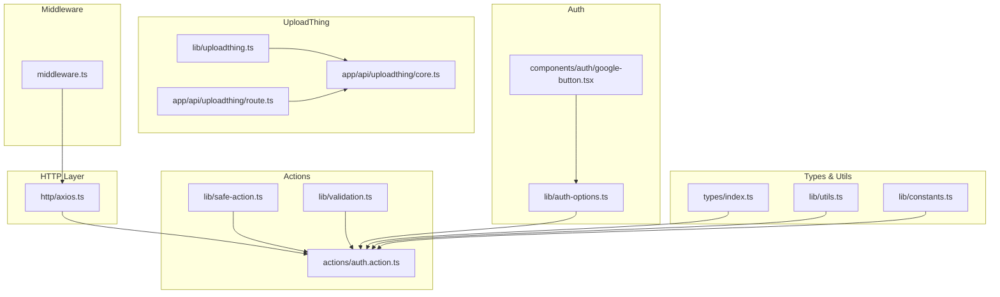
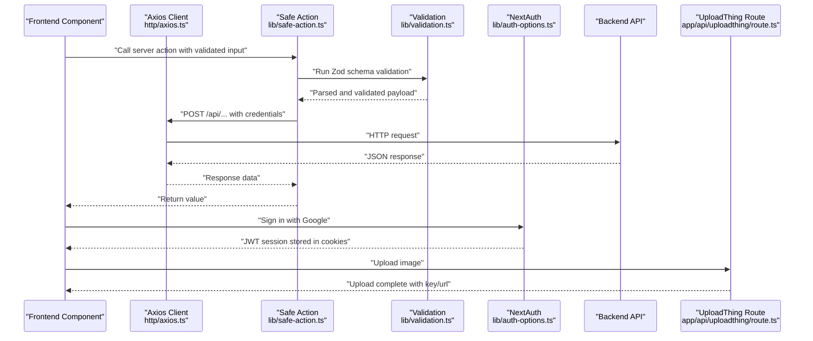
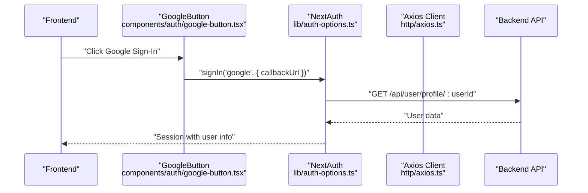
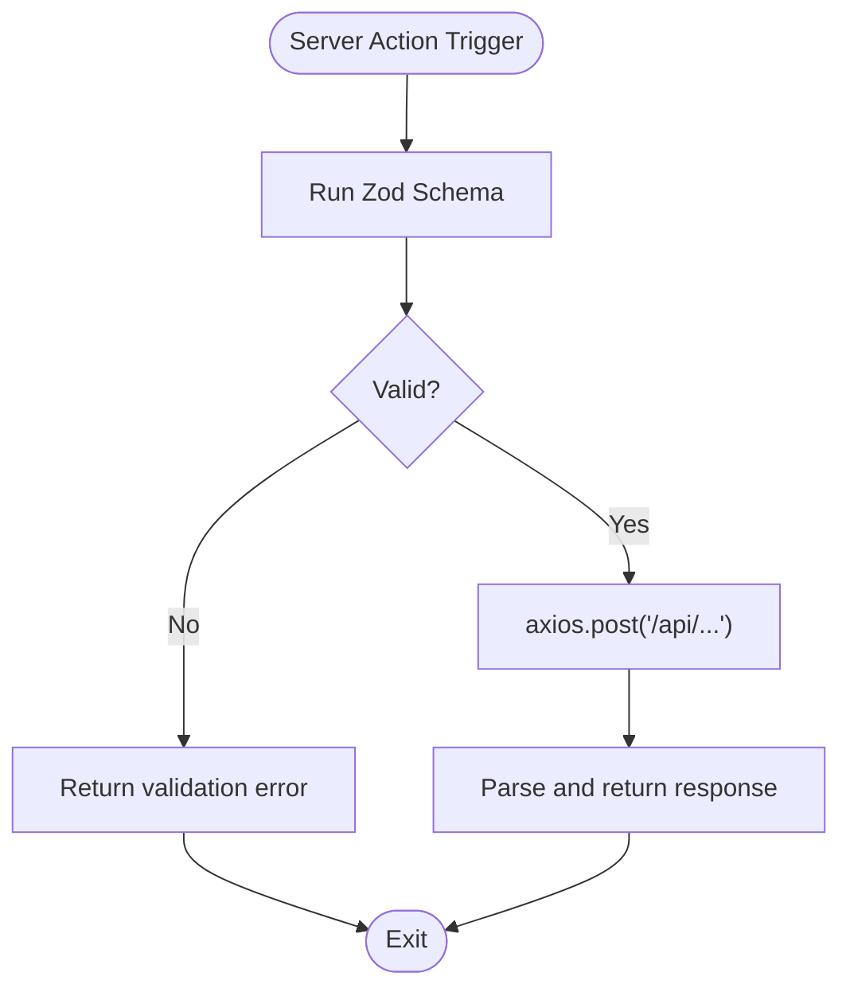
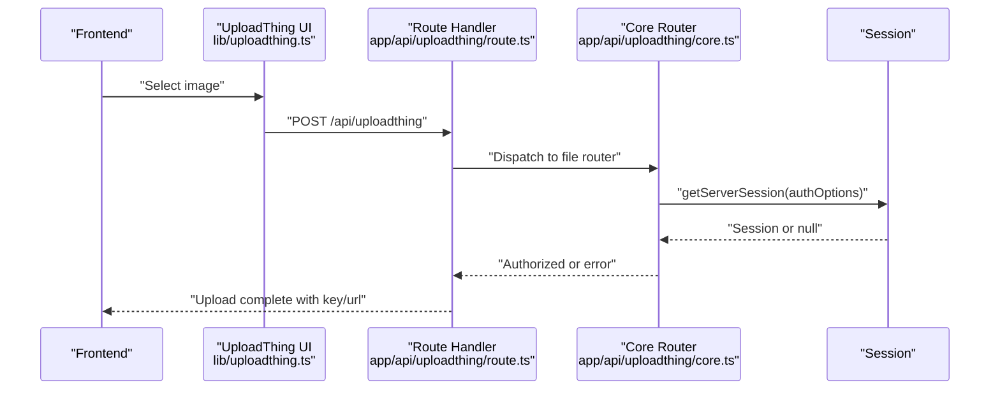
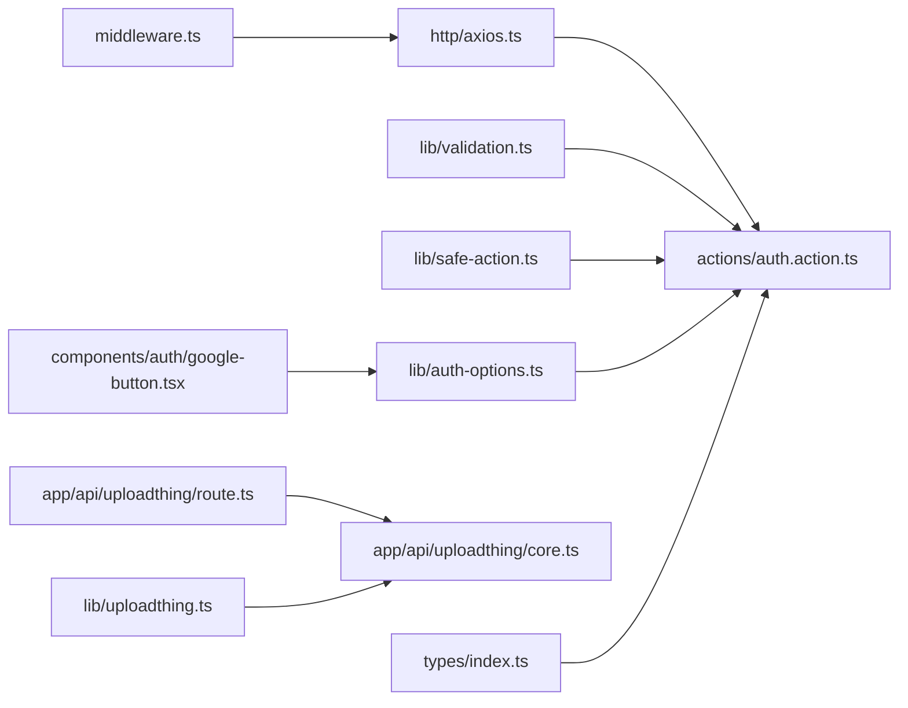

# API Integration

<cite>
**Referenced Files in This Document**
- [axios.ts](file://http/axios.ts)
- [uploadthing.ts](file://lib/uploadthing.ts)
- [core.ts](file://app/api/uploadthing/core.ts)
- [route.ts](file://app/api/uploadthing/route.ts)
- [auth.action.ts](file://actions/auth.action.ts)
- [auth-options.ts](file://lib/auth-options.ts)
- [safe-action.ts](file://lib/safe-action.ts)
- [validation.ts](file://lib/validation.ts)
- [use-action.ts](file://hooks/use-action.ts)
- [google-button.tsx](file://components/auth/google-button.tsx)
- [middleware.ts](file://middleware.ts)
- [utils.ts](file://lib/utils.ts)
- [constants.ts](file://lib/constants.ts)
- [index.ts](file://types/index.ts)
</cite>

## Table of Contents
1. [Introduction](#introduction)
2. [Project Structure](#project-structure)
3. [Core Components](#core-components)
4. [Architecture Overview](#architecture-overview)
5. [Detailed Component Analysis](#detailed-component-analysis)
6. [Dependency Analysis](#dependency-analysis)
7. [Performance Considerations](#performance-considerations)
8. [Troubleshooting Guide](#troubleshooting-guide)
9. [Conclusion](#conclusion)
10. [Appendices](#appendices)

## Introduction
This document explains how Optim Bozor integrates with backend APIs using a centralized HTTP client, authentication via NextAuth and Google OAuth, and file uploads through UploadThing. It covers endpoint patterns, request/response schemas, error handling, rate limiting, and security considerations such as cookie policies and token usage. Guidance is provided for extending the system with external services (payment processors, cloud storage) while maintaining robustness and performance.

## Project Structure
Optim Bozor organizes API integration across several layers:
- HTTP client configuration and base URL
- Authentication providers and session management
- Safe server actions for validated API calls
- UploadThing integration for image uploads
- Middleware for rate limiting
- Shared types and utilities

**Diagram sources**
- [axios.ts:1-10](file://http/axios.ts#L1-L10)
- [auth-options.ts:1-128](file://lib/auth-options.ts#L1-L128)
- [google-button.tsx:1-60](file://components/auth/google-button.tsx#L1-L60)
- [safe-action.ts:1-4](file://lib/safe-action.ts#L1-L4)
- [validation.ts:1-96](file://lib/validation.ts#L1-L96)
- [auth.action.ts:1-51](file://actions/auth.action.ts#L1-L51)
- [uploadthing.ts:1-9](file://lib/uploadthing.ts#L1-L9)
- [route.ts:1-7](file://app/api/uploadthing/route.ts#L1-L7)
- [core.ts:1-26](file://app/api/uploadthing/core.ts#L1-L26)
- [middleware.ts:1-26](file://middleware.ts#L1-L26)
- [index.ts:1-209](file://types/index.ts#L1-L209)
- [utils.ts:1-73](file://lib/utils.ts#L1-L73)
- [constants.ts:1-25](file://lib/constants.ts#L1-L25)

**Section sources**
- [axios.ts:1-10](file://http/axios.ts#L1-L10)
- [auth.action.ts:1-51](file://actions/auth.action.ts#L1-L51)
- [auth-options.ts:1-128](file://lib/auth-options.ts#L1-L128)
- [uploadthing.ts:1-9](file://lib/uploadthing.ts#L1-L9)
- [core.ts:1-26](file://app/api/uploadthing/core.ts#L1-L26)
- [route.ts:1-7](file://app/api/uploadthing/route.ts#L1-L7)
- [safe-action.ts:1-4](file://lib/safe-action.ts#L1-L4)
- [validation.ts:1-96](file://lib/validation.ts#L1-L96)
- [google-button.tsx:1-60](file://components/auth/google-button.tsx#L1-L60)
- [middleware.ts:1-26](file://middleware.ts#L1-L26)
- [index.ts:1-209](file://types/index.ts#L1-L209)
- [utils.ts:1-73](file://lib/utils.ts#L1-L73)
- [constants.ts:1-25](file://lib/constants.ts#L1-L25)

## Core Components
- Centralized HTTP client with base URL and credentials support
- Safe server actions with Zod validation
- NextAuth-based authentication with JWT sessions and Google OAuth
- UploadThing file router with middleware and completion handler
- Rate limiting middleware
- Shared TypeScript types and utilities

**Section sources**
- [axios.ts:1-10](file://http/axios.ts#L1-L10)
- [safe-action.ts:1-4](file://lib/safe-action.ts#L1-L4)
- [validation.ts:1-96](file://lib/validation.ts#L1-L96)
- [auth.action.ts:1-51](file://actions/auth.action.ts#L1-L51)
- [auth-options.ts:1-128](file://lib/auth-options.ts#L1-L128)
- [uploadthing.ts:1-9](file://lib/uploadthing.ts#L1-L9)
- [core.ts:1-26](file://app/api/uploadthing/core.ts#L1-L26)
- [route.ts:1-7](file://app/api/uploadthing/route.ts#L1-L7)
- [middleware.ts:1-26](file://middleware.ts#L1-L26)
- [index.ts:1-209](file://types/index.ts#L1-L209)

## Architecture Overview
The system integrates frontend API calls, authentication, and file uploads through a cohesive pipeline:

**Diagram sources**
- [axios.ts:1-10](file://http/axios.ts#L1-L10)
- [safe-action.ts:1-4](file://lib/safe-action.ts#L1-L4)
- [validation.ts:1-96](file://lib/validation.ts#L1-L96)
- [auth.action.ts:1-51](file://actions/auth.action.ts#L1-L51)
- [auth-options.ts:1-128](file://lib/auth-options.ts#L1-L128)
- [route.ts:1-7](file://app/api/uploadthing/route.ts#L1-L7)

## Detailed Component Analysis

### HTTP Client Configuration (Axios)
- Base URL is loaded from environment configuration and applied to all requests.
- Credentials are included to support session cookies.
- Timeout is configured to prevent hanging requests.
- Interceptors are not present in the current configuration; consider adding request/response interceptors for logging, auth token injection, and global error handling.

Recommended additions:
- Request interceptor to attach Authorization headers if tokens are used.
- Response interceptor to normalize errors and handle global auth failures.
- Retry logic for transient network errors.

**Section sources**
- [axios.ts:1-10](file://http/axios.ts#L1-L10)

### Authentication Token Management and NextAuth Integration
- NextAuth manages JWT sessions and stores secure cookies with strict attributes.
- Credentials provider fetches user profile from the backend and maps it to the session.
- Google provider is configured with client credentials from environment variables.
- Session callbacks enrich the session with user data and handle pending OAuth state.

**Diagram sources**
- [google-button.tsx:1-60](file://components/auth/google-button.tsx#L1-L60)
- [auth-options.ts:1-128](file://lib/auth-options.ts#L1-L128)
- [axios.ts:1-10](file://http/axios.ts#L1-L10)

**Section sources**
- [auth-options.ts:1-128](file://lib/auth-options.ts#L1-L128)
- [google-button.tsx:1-60](file://components/auth/google-button.tsx#L1-L60)
- [axios.ts:1-10](file://http/axios.ts#L1-L10)

### Safe Actions and Validation
- Server actions wrap API calls with Zod schemas to enforce input validation.
- Actions return normalized data parsed to avoid serialization issues.
- Validation schemas define strict contracts for login, registration, OTP, and user updates.

**Diagram sources**
- [safe-action.ts:1-4](file://lib/safe-action.ts#L1-L4)
- [validation.ts:1-96](file://lib/validation.ts#L1-L96)
- [auth.action.ts:1-51](file://actions/auth.action.ts#L1-L51)
- [axios.ts:1-10](file://http/axios.ts#L1-L10)

**Section sources**
- [safe-action.ts:1-4](file://lib/safe-action.ts#L1-L4)
- [validation.ts:1-96](file://lib/validation.ts#L1-L96)
- [auth.action.ts:1-51](file://actions/auth.action.ts#L1-L51)

### UploadThing Integration for File Uploads
- UploadThing route handler exposes GET/POST endpoints for the file router.
- File router defines an image uploader with size and count limits.
- Middleware enforces authentication; unauthorized uploads are rejected.
- Completion handler returns JSON-serializable metadata (key, name, URL).

**Diagram sources**
- [uploadthing.ts:1-9](file://lib/uploadthing.ts#L1-L9)
- [route.ts:1-7](file://app/api/uploadthing/route.ts#L1-L7)
- [core.ts:1-26](file://app/api/uploadthing/core.ts#L1-L26)
- [auth-options.ts:1-128](file://lib/auth-options.ts#L1-L128)

**Section sources**
- [uploadthing.ts:1-9](file://lib/uploadthing.ts#L1-L9)
- [route.ts:1-7](file://app/api/uploadthing/route.ts#L1-L7)
- [core.ts:1-26](file://app/api/uploadthing/core.ts#L1-L26)

### API Endpoint Patterns and Schemas
Common endpoint patterns observed in the codebase:
- POST /api/auth/login
- POST /api/auth/register
- POST /api/otp/send
- POST /api/otp/verify
- POST /api/auth/oauth-login
- GET /api/user/profile/:userId

Request/response schemas:
- Login: email and password
- Register: full name, email, password, optional phone
- OTP send/verify: email and 6-character OTP
- User profile: structured user object with roles and contact info

These are enforced by Zod schemas and returned via server actions.

**Section sources**
- [auth.action.ts:1-51](file://actions/auth.action.ts#L1-L51)
- [validation.ts:1-96](file://lib/validation.ts#L1-L96)
- [index.ts:54-73](file://types/index.ts#L54-L73)

### Error Handling Strategies
- Validation errors are surfaced via safe actions and displayed to users.
- NextAuth handles session and provider errors centrally.
- UploadThing throws explicit errors for unauthorized access.
- Frontend hook centralizes error toast notifications.

Recommendations:
- Add Axios interceptors to unify error responses and handle auth failures globally.
- Normalize backend error messages into user-friendly formats.
- Implement retry logic for transient failures.

**Section sources**
- [use-action.ts:1-16](file://hooks/use-action.ts#L1-L16)
- [core.ts:14-16](file://app/api/uploadthing/core.ts#L14-L16)
- [auth-options.ts:70-85](file://lib/auth-options.ts#L70-L85)

### Retry Mechanisms
- Not implemented in the current codebase.
- Recommended approach: exponential backoff with jitter for transient network errors; limit retries to avoid cascading failures.

[No sources needed since this section provides general guidance]

### Caching Strategies
- No explicit client-side caching is evident in the current codebase.
- Recommendations:
  - Use SWR or React Query for data caching and revalidation.
  - Cache immutable resources (categories, static assets) with appropriate cache headers.
  - Invalidate cache on mutations (e.g., profile updates, order creation).

**Section sources**
- [constants.ts:1-25](file://lib/constants.ts#L1-L25)
- [utils.ts:19-35](file://lib/utils.ts#L19-L35)

### Performance Optimization Techniques
- Use middleware to rate-limit requests and protect backend endpoints.
- Optimize image uploads with UploadThing’s size limits.
- Minimize payload sizes and use pagination for lists.
- Debounce search inputs and batch updates where possible.

**Section sources**
- [middleware.ts:1-26](file://middleware.ts#L1-L26)
- [core.ts:10-11](file://app/api/uploadthing/core.ts#L10-L11)

### Monitoring Approaches for API Calls
- Add request/response logging via Axios interceptors.
- Track error rates and latency per endpoint.
- Integrate with analytics or APM tools for production insights.

[No sources needed since this section provides general guidance]

### Security Considerations
- Secure cookies with httpOnly, sameSite, and secure flags.
- JWT secret and NextAuth secrets are loaded from environment variables.
- UploadThing requires authenticated sessions for uploads.
- Consider request signing and HTTPS enforcement in production.

**Section sources**
- [auth-options.ts:46-67](file://lib/auth-options.ts#L46-L67)
- [auth-options.ts:124-127](file://lib/auth-options.ts#L124-L127)
- [core.ts:12-18](file://app/api/uploadthing/core.ts#L12-L18)

### Integration with External Services
- Google OAuth: Configured via NextAuth providers; callback URL determines post-login routing.
- Payment processors: Integrate by adding server actions that call payment APIs and return checkout URLs or statuses.
- Cloud storage: Use UploadThing for signed uploads and CDN delivery; configure bucket policies and CORS appropriately.

**Section sources**
- [google-button.tsx:17-21](file://components/auth/google-button.tsx#L17-L21)
- [auth-options.ts:40-43](file://lib/auth-options.ts#L40-L43)
- [index.ts:57](file://types/index.ts#L57)

## Dependency Analysis
The following diagram highlights key dependencies among API integration components:

**Diagram sources**
- [axios.ts:1-10](file://http/axios.ts#L1-L10)
- [auth.action.ts:1-51](file://actions/auth.action.ts#L1-L51)
- [validation.ts:1-96](file://lib/validation.ts#L1-L96)
- [safe-action.ts:1-4](file://lib/safe-action.ts#L1-L4)
- [auth-options.ts:1-128](file://lib/auth-options.ts#L1-L128)
- [google-button.tsx:1-60](file://components/auth/google-button.tsx#L1-L60)
- [uploadthing.ts:1-9](file://lib/uploadthing.ts#L1-L9)
- [route.ts:1-7](file://app/api/uploadthing/route.ts#L1-L7)
- [core.ts:1-26](file://app/api/uploadthing/core.ts#L1-L26)
- [middleware.ts:1-26](file://middleware.ts#L1-L26)
- [index.ts:1-209](file://types/index.ts#L1-L209)

**Section sources**
- [axios.ts:1-10](file://http/axios.ts#L1-L10)
- [auth.action.ts:1-51](file://actions/auth.action.ts#L1-L51)
- [auth-options.ts:1-128](file://lib/auth-options.ts#L1-L128)
- [uploadthing.ts:1-9](file://lib/uploadthing.ts#L1-L9)
- [route.ts:1-7](file://app/api/uploadthing/route.ts#L1-L7)
- [core.ts:1-26](file://app/api/uploadthing/core.ts#L1-L26)
- [middleware.ts:1-26](file://middleware.ts#L1-L26)
- [index.ts:1-209](file://types/index.ts#L1-L209)

## Performance Considerations
- Use middleware to throttle requests and reduce load.
- Limit upload sizes and counts to control bandwidth and storage costs.
- Cache frequently accessed data and invalidate on change.
- Minimize payload sizes and leverage pagination.

**Section sources**
- [middleware.ts:1-26](file://middleware.ts#L1-L26)
- [core.ts:10-11](file://app/api/uploadthing/core.ts#L10-L11)
- [utils.ts:19-35](file://lib/utils.ts#L19-L35)

## Troubleshooting Guide
- Authentication failures: Verify NextAuth cookies and JWT secret configuration; check provider credentials.
- Upload errors: Ensure authenticated session exists; confirm UploadThing file limits and permissions.
- Validation errors: Confirm client-side schema matches backend expectations.
- Network timeouts: Increase Axios timeout or implement retry logic.

**Section sources**
- [auth-options.ts:40-43](file://lib/auth-options.ts#L40-L43)
- [core.ts:14-16](file://app/api/uploadthing/core.ts#L14-L16)
- [use-action.ts:7-10](file://hooks/use-action.ts#L7-L10)
- [axios.ts:8](file://http/axios.ts#L8)

## Conclusion
Optim Bozor’s API integration relies on a clean separation of concerns: a centralized HTTP client, validated server actions, robust NextAuth sessions, and secure UploadThing uploads. Extending the system involves adding interceptors for resilience, implementing caching and monitoring, and integrating external services with consistent error handling and security practices.

## Appendices

### API Endpoints Reference
- POST /api/auth/login
- POST /api/auth/register
- POST /api/otp/send
- POST /api/otp/verify
- POST /api/auth/oauth-login
- GET /api/user/profile/:userId

**Section sources**
- [auth.action.ts:13-50](file://actions/auth.action.ts#L13-L50)

### Types and Schemas Overview
- Validation schemas for login, registration, OTP, and user updates.
- Response types for actions, orders, transactions, and products.

**Section sources**
- [validation.ts:3-39](file://lib/validation.ts#L3-L39)
- [index.ts:54-193](file://types/index.ts#L54-L193)