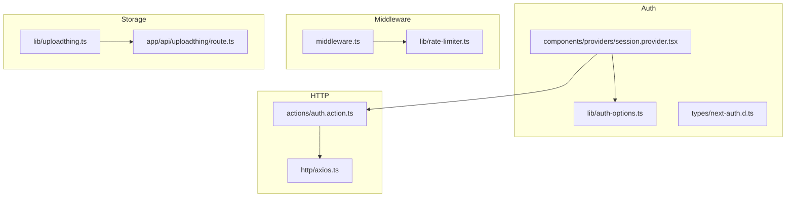
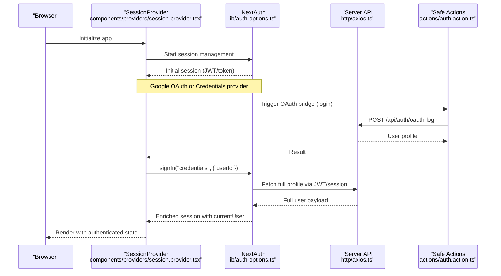
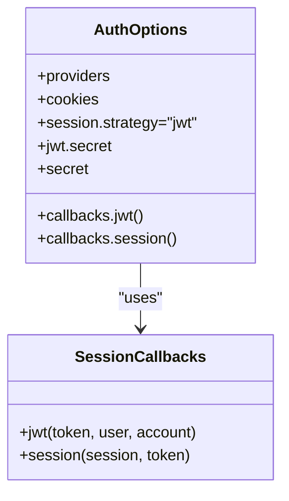
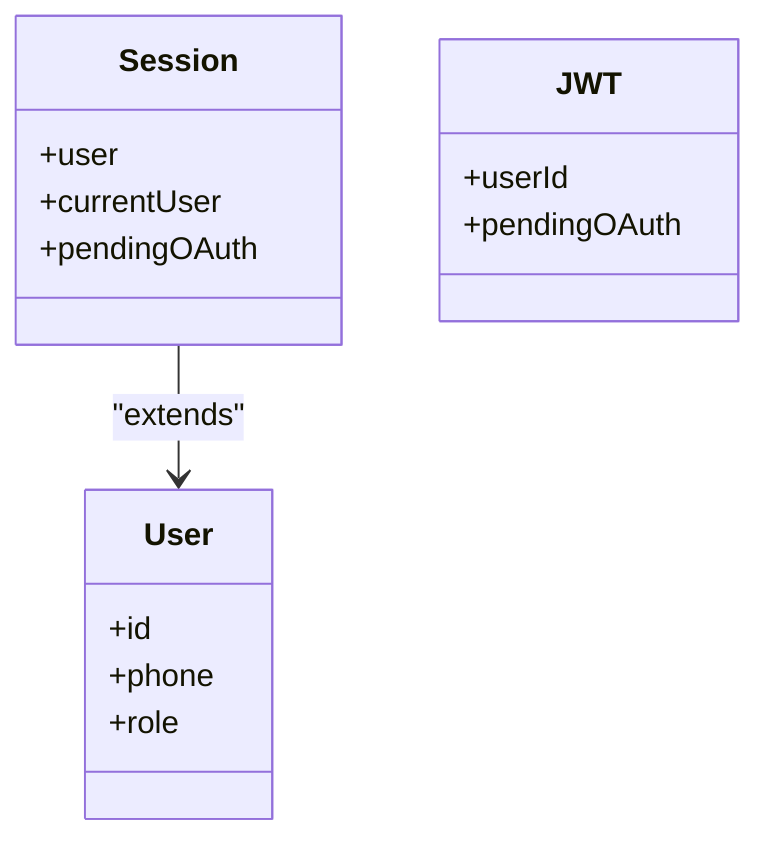
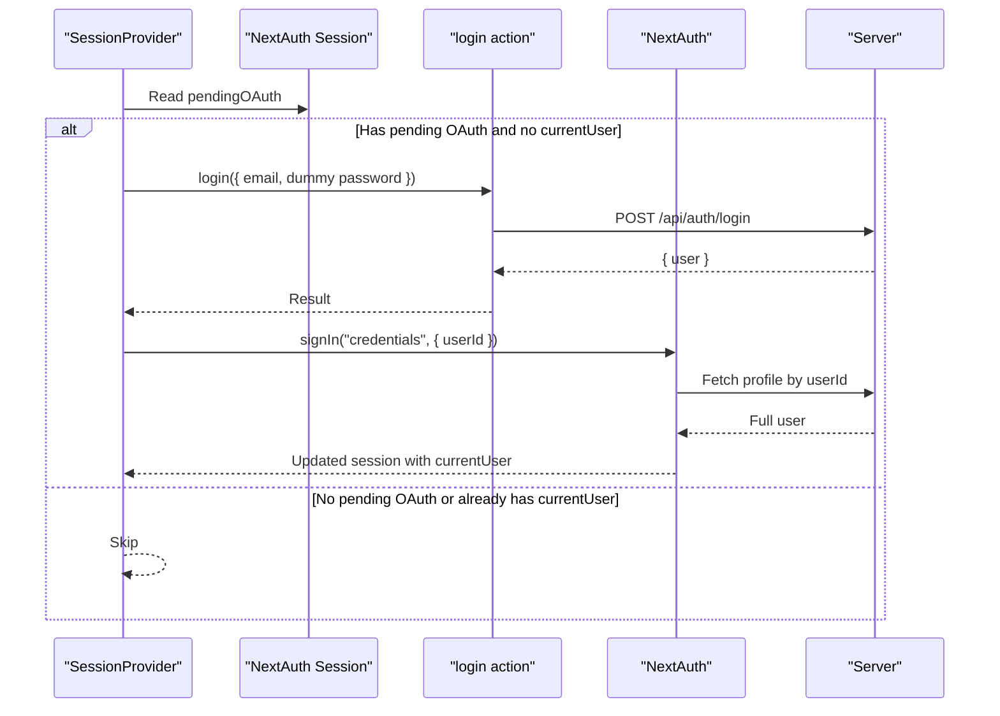
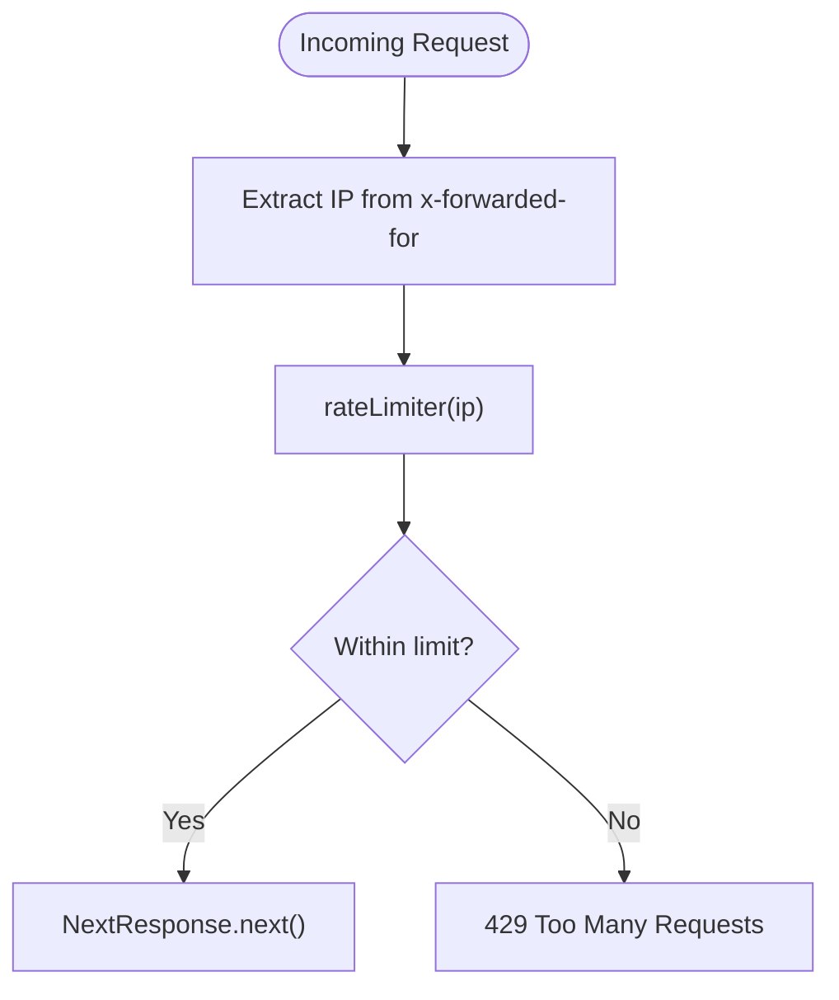
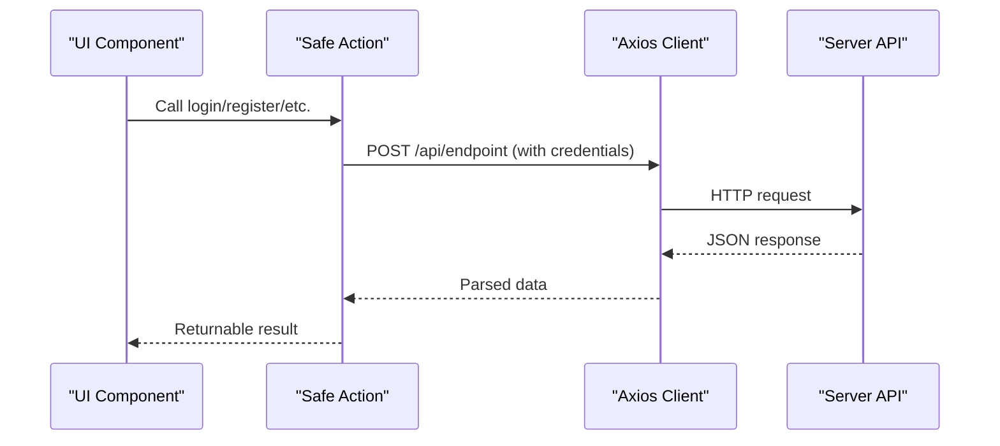
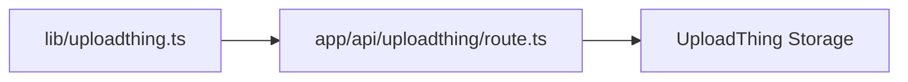
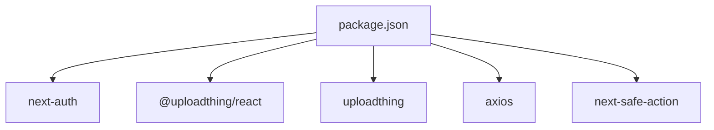

# External Service Integrations

<cite>
**Referenced Files in This Document**
- [lib/auth-options.ts](file://lib/auth-options.ts)
- [types/next-auth.d.ts](file://types/next-auth.d.ts)
- [components/providers/session.provider.tsx](file://components/providers/session.provider.tsx)
- [actions/auth.action.ts](file://actions/auth.action.ts)
- [http/axios.ts](file://http/axios.ts)
- [middleware.ts](file://middleware.ts)
- [lib/rate-limiter.ts](file://lib/rate-limiter.ts)
- [lib/uploadthing.ts](file://lib/uploadthing.ts)
- [app/api/uploadthing/route.ts](file://app/api/uploadthing/route.ts)
- [package.json](file://package.json)
</cite>

## Table of Contents
1. [Introduction](#introduction)
2. [Project Structure](#project-structure)
3. [Core Components](#core-components)
4. [Architecture Overview](#architecture-overview)
5. [Detailed Component Analysis](#detailed-component-analysis)
6. [Dependency Analysis](#dependency-analysis)
7. [Performance Considerations](#performance-considerations)
8. [Troubleshooting Guide](#troubleshooting-guide)
9. [Conclusion](#conclusion)
10. [Appendices](#appendices)

## Introduction
This document explains how the application integrates with external services, focusing on:
- Authentication providers via NextAuth (Google OAuth and credentials)
- Custom JWT handling and session management
- Middleware for rate limiting and request filtering
- Cloud storage integration with UploadThing
- Outbound HTTP communication via Axios
- Guidance for extending integrations and handling outages

Where applicable, we map integrations to actual source files and provide diagrams that reflect real code behavior.

## Project Structure
The external integrations touch several areas:
- Authentication: NextAuth configuration, typed session extensions, and client-side auto-OAuth login flow
- HTTP client: Axios-based client with base URL and credentials support
- Middleware: Global rate limiting applied to routes
- Upload storage: UploadThing integration for file uploads
- Actions: Safe-action wrappers around outbound API calls

**Diagram sources**
- [lib/auth-options.ts:1-128](file://lib/auth-options.ts#L1-L128)
- [types/next-auth.d.ts:1-39](file://types/next-auth.d.ts#L1-L39)
- [components/providers/session.provider.tsx:1-39](file://components/providers/session.provider.tsx#L1-L39)
- [http/axios.ts:1-10](file://http/axios.ts#L1-L10)
- [actions/auth.action.ts:1-51](file://actions/auth.action.ts#L1-L51)
- [middleware.ts:1-26](file://middleware.ts#L1-L26)
- [lib/rate-limiter.ts:1-29](file://lib/rate-limiter.ts#L1-L29)
- [lib/uploadthing.ts:1-9](file://lib/uploadthing.ts#L1-L9)
- [app/api/uploadthing/route.ts:1-7](file://app/api/uploadthing/route.ts#L1-L7)

**Section sources**
- [lib/auth-options.ts:1-128](file://lib/auth-options.ts#L1-L128)
- [types/next-auth.d.ts:1-39](file://types/next-auth.d.ts#L1-L39)
- [components/providers/session.provider.tsx:1-39](file://components/providers/session.provider.tsx#L1-L39)
- [http/axios.ts:1-10](file://http/axios.ts#L1-L10)
- [actions/auth.action.ts:1-51](file://actions/auth.action.ts#L1-L51)
- [middleware.ts:1-26](file://middleware.ts#L1-L26)
- [lib/rate-limiter.ts:1-29](file://lib/rate-limiter.ts#L1-L29)
- [lib/uploadthing.ts:1-9](file://lib/uploadthing.ts#L1-L9)
- [app/api/uploadthing/route.ts:1-7](file://app/api/uploadthing/route.ts#L1-L7)

## Core Components
- NextAuth configuration with Google OAuth and credentials provider, cookie hardening, JWT/session callbacks, and secrets
- Typed session/user extensions for strong typing across the app
- Client-side auto-OAuth login flow that bridges OAuth sessions to credentials-based sessions
- Axios client configured with base URL and credentials for cross-origin requests
- Middleware-based rate limiter enforcing per-IP limits
- UploadThing integration for file uploads

**Section sources**
- [lib/auth-options.ts:8-127](file://lib/auth-options.ts#L8-L127)
- [types/next-auth.d.ts:4-38](file://types/next-auth.d.ts#L4-L38)
- [components/providers/session.provider.tsx:7-30](file://components/providers/session.provider.tsx#L7-L30)
- [http/axios.ts:3-9](file://http/axios.ts#L3-L9)
- [middleware.ts:9-20](file://middleware.ts#L9-L20)
- [lib/rate-limiter.ts:9-28](file://lib/rate-limiter.ts#L9-L28)
- [lib/uploadthing.ts:1-9](file://lib/uploadthing.ts#L1-L9)
- [app/api/uploadthing/route.ts:4-6](file://app/api/uploadthing/route.ts#L4-L6)

## Architecture Overview
The external integration architecture centers on:
- NextAuth managing identity and tokens, with custom callbacks enriching sessions from the backend
- Client-side provider orchestrating OAuth-to-credentials bridging
- Safe actions encapsulating outbound API calls
- Middleware applying global rate limiting
- UploadThing handling file uploads

**Diagram sources**
- [components/providers/session.provider.tsx:7-30](file://components/providers/session.provider.tsx#L7-L30)
- [lib/auth-options.ts:69-122](file://lib/auth-options.ts#L69-L122)
- [http/axios.ts:5-9](file://http/axios.ts#L5-L9)
- [actions/auth.action.ts:42-50](file://actions/auth.action.ts#L42-L50)

## Detailed Component Analysis

### NextAuth Integration (Google OAuth + Credentials)
- Providers: Google OAuth and credentials-based login
- Cookie configuration: Hardened cookie names and attributes for production
- Callbacks:
  - jwt: Attach userId/phone/role for credentials; track pendingOAuth for Google
  - session: Resolve full user profile from backend using userId; populate session.user; preserve pendingOAuth
- Secrets: JWT and NextAuth secrets from environment variables
- Session strategy: JWT

**Diagram sources**
- [lib/auth-options.ts:8-127](file://lib/auth-options.ts#L8-L127)
- [types/next-auth.d.ts:4-38](file://types/next-auth.d.ts#L4-L38)

**Section sources**
- [lib/auth-options.ts:8-127](file://lib/auth-options.ts#L8-L127)
- [types/next-auth.d.ts:4-38](file://types/next-auth.d.ts#L4-L38)

### Typed Session and User Extensions
- Extends NextAuth session and user with application-specific fields (e.g., currentUser, pendingOAuth)
- Ensures type safety for session-aware components

**Diagram sources**
- [types/next-auth.d.ts:4-38](file://types/next-auth.d.ts#L4-L38)

**Section sources**
- [types/next-auth.d.ts:4-38](file://types/next-auth.d.ts#L4-L38)

### Client-Side Auto-OAuth Login Flow
- Detects pendingOAuth in session
- Calls safe action to log in via backend
- Switches to credentials provider and refreshes session

**Diagram sources**
- [components/providers/session.provider.tsx:7-30](file://components/providers/session.provider.tsx#L7-L30)
- [actions/auth.action.ts:13-18](file://actions/auth.action.ts#L13-L18)
- [lib/auth-options.ts:69-122](file://lib/auth-options.ts#L69-L122)

**Section sources**
- [components/providers/session.provider.tsx:7-30](file://components/providers/session.provider.tsx#L7-L30)
- [actions/auth.action.ts:13-18](file://actions/auth.action.ts#L13-L18)
- [lib/auth-options.ts:69-122](file://lib/auth-options.ts#L69-L122)

### Middleware and Rate Limiting
- Extracts client IP from x-forwarded-for header
- Enforces a sliding-window rate limit per IP
- Blocks requests exceeding threshold with 429

**Diagram sources**
- [middleware.ts:4-20](file://middleware.ts#L4-L20)
- [lib/rate-limiter.ts:9-28](file://lib/rate-limiter.ts#L9-L28)

**Section sources**
- [middleware.ts:4-20](file://middleware.ts#L4-L20)
- [lib/rate-limiter.ts:9-28](file://lib/rate-limiter.ts#L9-L28)

### HTTP Client and Safe Actions
- Axios client configured with base URL and credentials
- Safe actions wrap outbound calls with Zod validation and structured responses

**Diagram sources**
- [http/axios.ts:5-9](file://http/axios.ts#L5-L9)
- [actions/auth.action.ts:13-50](file://actions/auth.action.ts#L13-L50)

**Section sources**
- [http/axios.ts:5-9](file://http/axios.ts#L5-L9)
- [actions/auth.action.ts:13-50](file://actions/auth.action.ts#L13-L50)

### UploadThing Integration
- React helpers generated for upload buttons/dropzones
- Route handler for UploadThing endpoints

**Diagram sources**
- [lib/uploadthing.ts:1-9](file://lib/uploadthing.ts#L1-L9)
- [app/api/uploadthing/route.ts:1-7](file://app/api/uploadthing/route.ts#L1-L7)

**Section sources**
- [lib/uploadthing.ts:1-9](file://lib/uploadthing.ts#L1-L9)
- [app/api/uploadthing/route.ts:1-7](file://app/api/uploadthing/route.ts#L1-L7)

## Dependency Analysis
External dependencies relevant to integrations:
- next-auth for authentication
- @uploadthing/react and uploadthing for file uploads
- axios for HTTP requests
- next-safe-action for safe actions

**Diagram sources**
- [package.json:11-53](file://package.json#L11-L53)

**Section sources**
- [package.json:11-53](file://package.json#L11-L53)

## Performance Considerations
- Rate limiting uses an in-memory Map keyed by IP with O(n) cleanup per request; suitable for small scale but consider Redis-backed storage for production
- Axios timeout set to 15 seconds; tune based on network conditions
- JWT/session callbacks fetch user profiles; cache where appropriate to reduce backend load

[No sources needed since this section provides general guidance]

## Troubleshooting Guide
Common issues and resolutions:
- NextAuth cookies not persisting:
  - Verify cookie options match environment (secure flag, SameSite, host-only names)
  - Confirm domain/path alignment with deployment
- Session lacks currentUser:
  - Ensure userId is present in JWT; check callbacks.session logic
  - Validate backend endpoint returns full user on profile fetch
- Rate limit exceeded:
  - Check x-forwarded-for header presence and correctness
  - Adjust window size and max requests thresholds
- UploadThing errors:
  - Confirm route handler registration and router configuration
  - Verify UploadThing server configuration and permissions

**Section sources**
- [lib/auth-options.ts:46-67](file://lib/auth-options.ts#L46-L67)
- [lib/auth-options.ts:87-121](file://lib/auth-options.ts#L87-L121)
- [middleware.ts:9-17](file://middleware.ts#L9-L17)
- [app/api/uploadthing/route.ts:4-6](file://app/api/uploadthing/route.ts#L4-L6)

## Conclusion
The application integrates external services through a cohesive pattern:
- NextAuth governs authentication and session state with custom callbacks
- Safe actions encapsulate outbound API calls with validation
- Middleware applies global rate limiting
- UploadThing enables file uploads with minimal server configuration
Future enhancements can include centralized configuration for secrets, circuit breakers for upstream services, and structured logging for observability.

[No sources needed since this section summarizes without analyzing specific files]

## Appendices

### Security Considerations
- Secrets management:
  - Store NEXT_PUBLIC_JWT_SECRET, NEXT_AUTH_SECRET, GOOGLE_CLIENT_ID, GOOGLE_CLIENT_SECRET in environment variables
  - Avoid committing secrets to version control
- Request signing and encryption:
  - Not implemented in the current codebase; consider HMAC signatures or TLS mutual authentication for sensitive upstream calls
- Data protection:
  - Ensure HTTPS in production
  - Sanitize and validate all inputs handled by safe actions

**Section sources**
- [lib/auth-options.ts:40-43](file://lib/auth-options.ts#L40-L43)
- [lib/auth-options.ts:124-126](file://lib/auth-options.ts#L124-L126)

### Adding New External Integrations
- HTTP integrations:
  - Define a new safe action with Zod schema and axios call
  - Wrap in a reusable hook or action for UI consumption
- Authentication providers:
  - Add provider to authOptions and extend session/user types
  - Implement callbacks.jwt and callbacks.session to enrich tokens/sessions
- Upload/storage:
  - Register router in UploadThing core and expose route handler
- Middleware filters:
  - Extend matcher patterns and add pre-checks (e.g., allow-listed IPs, API keys)
- Monitoring and logging:
  - Integrate structured logs for outbound calls and rate-limit events

[No sources needed since this section provides general guidance]