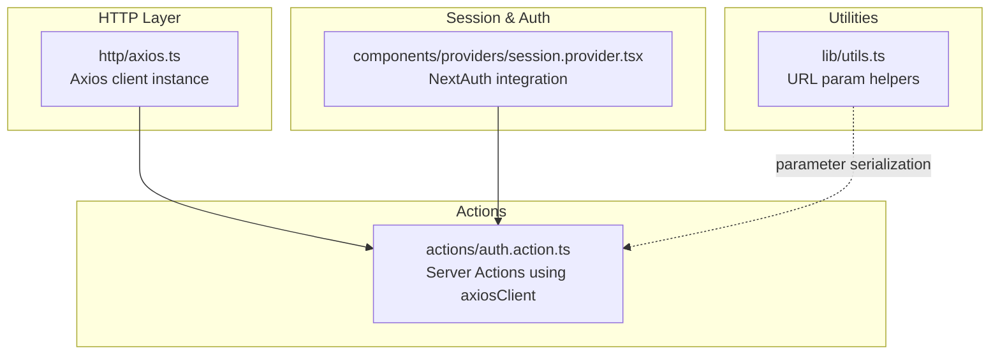
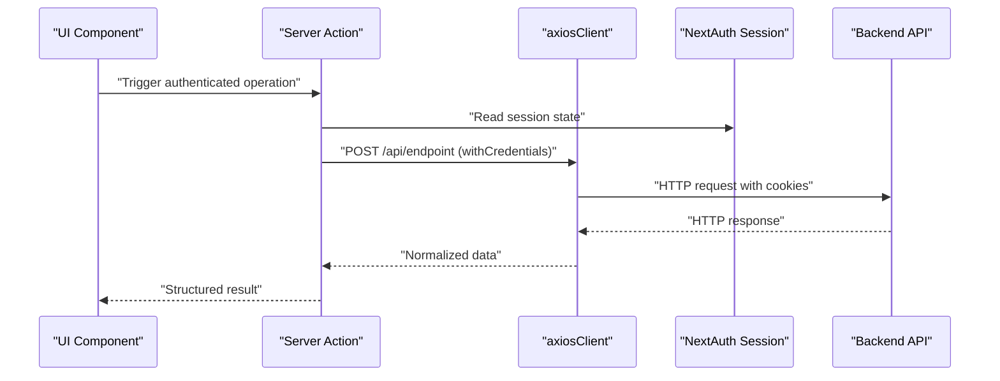
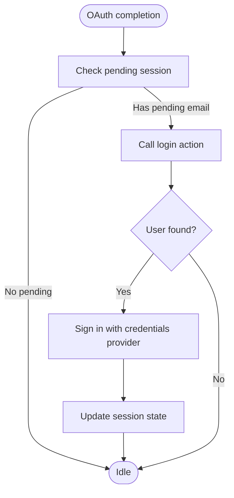
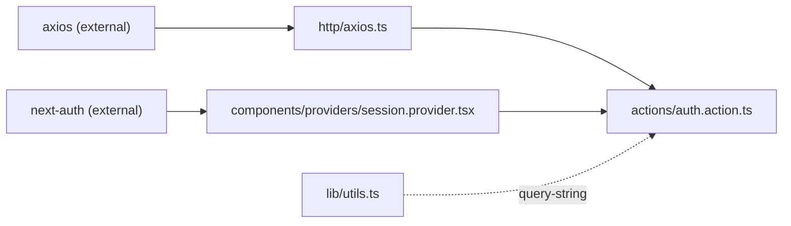

# HTTP Client Configuration

<cite>
**Referenced Files in This Document**
- [axios.ts](file://http/axios.ts)
- [auth.action.ts](file://actions/auth.action.ts)
- [session.provider.tsx](file://components/providers/session.provider.tsx)
- [middleware.ts](file://middleware.ts)
- [utils.ts](file://lib/utils.ts)
- [package.json](file://package.json)
</cite>

## Table of Contents
1. [Introduction](#introduction)
2. [Project Structure](#project-structure)
3. [Core Components](#core-components)
4. [Architecture Overview](#architecture-overview)
5. [Detailed Component Analysis](#detailed-component-analysis)
6. [Dependency Analysis](#dependency-analysis)
7. [Performance Considerations](#performance-considerations)
8. [Troubleshooting Guide](#troubleshooting-guide)
9. [Conclusion](#conclusion)

## Introduction
This document explains the HTTP client configuration built with Axios in the project. It covers base URL setup via environment variables, credentials handling, timeout configuration, client instance creation, and how the client is used across the application. It also documents request and response patterns, error handling strategies, token/session integration via NextAuth, and utility functions for parameter serialization and response transformation. Security considerations such as CORS and request signing are addressed conceptually, along with practical guidance for authenticated requests, retry logic, and handling various response types.

## Project Structure
The HTTP client is centralized in a single module that exports a configured Axios instance. Application code consumes this instance for API calls, while authentication and session management are handled by NextAuth. Utilities for URL parameter serialization are provided separately.

**Diagram sources**
- [axios.ts](file://http/axios.ts)
- [auth.action.ts](file://actions/auth.action.ts)
- [session.provider.tsx](file://components/providers/session.provider.tsx)
- [utils.ts](file://lib/utils.ts)

**Section sources**
- [axios.ts:1-10](file://http/axios.ts#L1-L10)
- [auth.action.ts:1-51](file://actions/auth.action.ts#L1-L51)
- [session.provider.tsx:1-38](file://components/providers/session.provider.tsx#L1-L38)
- [utils.ts:1-73](file://lib/utils.ts#L1-L73)

## Core Components
- Axios client instance with environment-driven base URL, credentials enabled, and a 15-second timeout.
- Server Actions that encapsulate API calls and return normalized data.
- NextAuth provider that manages sessions and integrates with backend OAuth flows.
- Utility functions for URL parameter serialization and deserialization.

Key characteristics:
- Base URL is loaded from a public environment variable.
- Credentials are included automatically for cross-origin requests.
- Timeout is set to balance responsiveness and reliability.
- Server Actions handle request/response normalization and error propagation.

**Section sources**
- [axios.ts:1-10](file://http/axios.ts#L1-L10)
- [auth.action.ts:13-51](file://actions/auth.action.ts#L13-L51)
- [session.provider.tsx:7-27](file://components/providers/session.provider.tsx#L7-L27)
- [utils.ts:19-35](file://lib/utils.ts#L19-L35)

## Architecture Overview
The HTTP client is a thin wrapper around Axios configured for the frontend runtime. Requests originate from Server Actions, which centralize API communication and response normalization. Authentication relies on NextAuth’s session management and credentials provider, enabling automatic cookie handling via withCredentials.

**Diagram sources**
- [auth.action.ts:13-51](file://actions/auth.action.ts#L13-L51)
- [axios.ts:5-9](file://http/axios.ts#L5-L9)
- [session.provider.tsx:7-27](file://components/providers/session.provider.tsx#L7-L27)

## Detailed Component Analysis

### Axios Client Instance
- Environment-driven base URL: The client reads the base URL from a public environment variable and sets it as the Axios base URL.
- Credentials handling: withCredentials is enabled so cookies are sent and received automatically for cross-origin requests.
- Timeout: A 15-second timeout is configured to prevent hanging requests.
- Export pattern: The module exports both the base URL constant and the configured client instance.

Usage patterns:
- Server Actions import the client and issue POST/GET requests to backend routes.
- Responses are returned after JSON serialization/deserialization to ensure safe transfer across server boundaries.

Security note:
- withCredentials enables cookie-based authentication but requires careful CORS configuration on the backend to avoid leakage risks.

**Section sources**
- [axios.ts:1-10](file://http/axios.ts#L1-L10)

### Server Actions and API Communication
- Login, registration, OTP send/verify, and OAuth login are implemented as server actions.
- Each action constructs a request payload, posts to the corresponding backend endpoint, and returns normalized data.
- Data is serialized to JSON and re-parsed to ensure safe transfer from server to client.

Common patterns:
- Request payload validation occurs upstream in the action pipeline.
- Backend responses are expected to be JSON; the action returns the parsed data object.

**Section sources**
- [auth.action.ts:13-51](file://actions/auth.action.ts#L13-L51)

### Parameter Serialization Utilities
- URL parameter helpers serialize and deserialize query parameters using a robust library.
- These utilities support updating or removing keys in the current URL while preserving others.

Typical use cases:
- Filtering, pagination, and search UIs can leverage these helpers to maintain clean URLs.

**Section sources**
- [utils.ts:19-35](file://lib/utils.ts#L19-L35)

### Session and Token Management Integration
- The session provider coordinates OAuth flows and updates the NextAuth session state.
- When a pending OAuth session exists, the provider triggers a login action and refreshes the session.
- Because the Axios client enables withCredentials, cookies set by the backend are automatically included in subsequent requests.

**Diagram sources**
- [session.provider.tsx:7-27](file://components/providers/session.provider.tsx#L7-L27)

**Section sources**
- [session.provider.tsx:1-38](file://components/providers/session.provider.tsx#L1-L38)

### Interceptors, Error Handling, and Retry Logic
- Current implementation does not define custom request/response interceptors in the client module.
- Error handling is primarily performed at the action boundary, where responses are parsed and returned.
- Retry logic is not implemented in the client; however, it can be added via interceptors or higher-level wrappers if needed.

Recommendations:
- Add a response interceptor to normalize error responses and surface consistent error objects.
- Introduce retry logic for transient network errors and rate-limiting scenarios using exponential backoff.
- Consider adding a request interceptor to attach metadata (e.g., correlation IDs) for observability.

[No sources needed since this section provides general guidance]

### Response Transformation
- Server Actions parse the Axios response data and return it after JSON serialization/deserialization.
- This ensures that the returned value is safe to use in client-side rendering and avoids issues with non-serializable data.

**Section sources**
- [auth.action.ts:15-17](file://actions/auth.action.ts#L15-L17)
- [auth.action.ts:23-25](file://actions/auth.action.ts#L23-L25)
- [auth.action.ts:30-32](file://actions/auth.action.ts#L30-L32)
- [auth.action.ts:37-39](file://actions/auth.action.ts#L37-L39)
- [auth.action.ts:45-49](file://actions/auth.action.ts#L45-L49)

### Making Authenticated Requests
- Use the Axios client within Server Actions to call backend endpoints that require authentication.
- The client automatically includes cookies due to withCredentials, simplifying token-based authentication flows.
- For OAuth flows, rely on NextAuth to manage session state and trigger login actions when necessary.

**Section sources**
- [auth.action.ts:13-51](file://actions/auth.action.ts#L13-L51)
- [session.provider.tsx:16-25](file://components/providers/session.provider.tsx#L16-L25)

### Handling Different Response Types
- The client treats all responses as JSON; ensure backend APIs return structured JSON for predictable handling.
- For file downloads or binary responses, configure Axios appropriately and handle the response stream accordingly.

[No sources needed since this section provides general guidance]

### Security Considerations
- CORS configuration: Since withCredentials is enabled, the backend must set appropriate Access-Control-Allow-Origin and Allow-Credentials headers to permit cookie transmission.
- Request signing: If the backend requires signed requests, implement a request interceptor to compute signatures and attach headers consistently.
- Environment variables: Ensure NEXT_PUBLIC_SERVER_URL is set correctly in production environments to prevent accidental misconfiguration.

**Section sources**
- [axios.ts:3-9](file://http/axios.ts#L3-L9)

## Dependency Analysis
The HTTP client depends on Axios. Server Actions depend on the client and NextAuth for session management. Utilities depend on a query-string library for URL manipulation.

**Diagram sources**
- [axios.ts:1-10](file://http/axios.ts#L1-L10)
- [auth.action.ts:3](file://actions/auth.action.ts#L3)
- [session.provider.tsx:3](file://components/providers/session.provider.tsx#L3)
- [utils.ts:5](file://lib/utils.ts#L5)
- [package.json:27](file://package.json#L27)
- [package.json:39](file://package.json#L39)

**Section sources**
- [package.json:27](file://package.json#L27)
- [package.json:39](file://package.json#L39)

## Performance Considerations
- Timeout tuning: The 15-second timeout balances responsiveness with reliability; adjust based on network conditions and backend latency.
- Caching: Consider adding caching strategies at the application layer for frequently accessed resources.
- Retry strategy: Implement retries for transient failures to improve resilience without overloading the backend.

[No sources needed since this section provides general guidance]

## Troubleshooting Guide
Common issues and resolutions:
- Missing base URL: Ensure NEXT_PUBLIC_SERVER_URL is set in the environment; otherwise, requests will target the wrong origin.
- CORS errors with credentials: Verify that the backend sets Access-Control-Allow-Origin to the exact origin and Allow-Credentials to true.
- Session not persisting: Confirm that withCredentials is enabled and that cookies are being sent/received correctly.
- Rate limiting: Use the middleware-provided rate limiter to throttle requests and avoid 429 responses.

**Section sources**
- [axios.ts:3](file://http/axios.ts#L3)
- [middleware.ts:9-20](file://middleware.ts#L9-L20)

## Conclusion
The project’s HTTP client is a minimal, environment-driven Axios instance configured with credentials and a sensible timeout. Server Actions encapsulate API communication and normalize responses, while NextAuth handles session and OAuth flows. To enhance reliability, consider adding interceptors for error normalization and retry logic, and ensure backend CORS settings align with credentials usage. Parameter serialization utilities simplify URL manipulation for UI components.