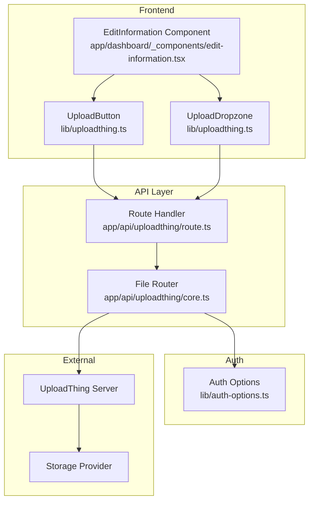
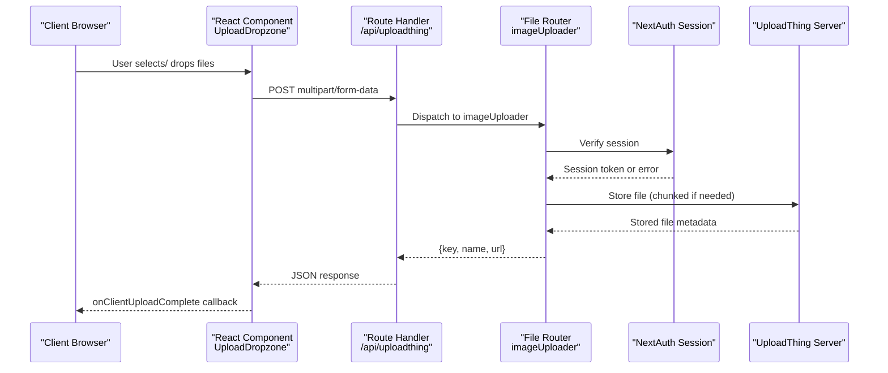
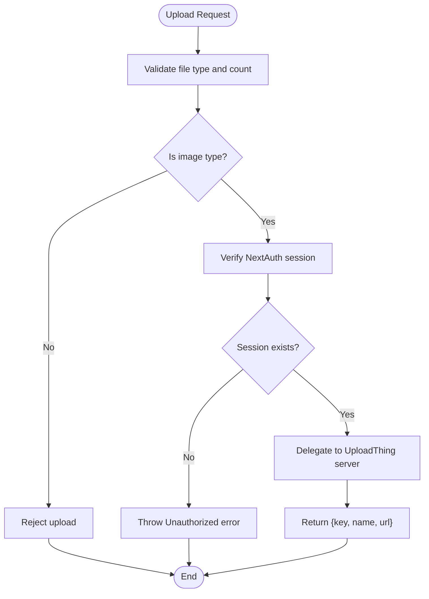
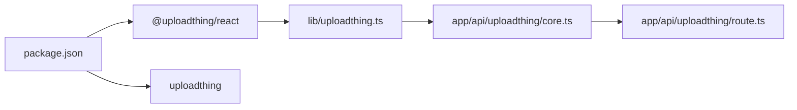

# UploadThing Integration

<cite>
**Referenced Files in This Document**
- [lib/uploadthing.ts](file://lib/uploadthing.ts)
- [app/api/uploadthing/core.ts](file://app/api/uploadthing/core.ts)
- [app/api/uploadthing/route.ts](file://app/api/uploadthing/route.ts)
- [app/dashboard/_components/edit-information.tsx](file://app/dashboard/_components/edit-information.tsx)
- [lib/auth-options.ts](file://lib/auth-options.ts)
- [next.config.js](file://next.config.js)
- [package.json](file://package.json)
</cite>

## Table of Contents
1. [Introduction](#introduction)
2. [Project Structure](#project-structure)
3. [Core Components](#core-components)
4. [Architecture Overview](#architecture-overview)
5. [Detailed Component Analysis](#detailed-component-analysis)
6. [Dependency Analysis](#dependency-analysis)
7. [Performance Considerations](#performance-considerations)
8. [Security Considerations](#security-considerations)
9. [Troubleshooting Guide](#troubleshooting-guide)
10. [Conclusion](#conclusion)

## Introduction
This document explains the UploadThing file upload integration in the project. It covers configuration, validation rules, supported file types, upload progress tracking, chunked uploads, image optimization pipeline, API endpoints, and practical integration examples with React forms. It also addresses security considerations, troubleshooting, and performance optimization.

## Project Structure
UploadThing is integrated at three layers:
- Frontend React components that wrap UploadThing’s typed helpers
- A Next.js route handler that exposes UploadThing endpoints
- A server-side file router that defines validation, middleware, and completion behavior

**Diagram sources**
- [lib/uploadthing.ts:1-8](file://lib/uploadthing.ts#L1-L8)
- [app/api/uploadthing/route.ts:1-6](file://app/api/uploadthing/route.ts#L1-L6)
- [app/api/uploadthing/core.ts:1-25](file://app/api/uploadthing/core.ts#L1-L25)
- [lib/auth-options.ts:1-128](file://lib/auth-options.ts#L1-L128)

**Section sources**
- [lib/uploadthing.ts:1-8](file://lib/uploadthing.ts#L1-L8)
- [app/api/uploadthing/route.ts:1-6](file://app/api/uploadthing/route.ts#L1-L6)
- [app/api/uploadthing/core.ts:1-25](file://app/api/uploadthing/core.ts#L1-L25)

## Core Components
- Typed helpers for React:
  - UploadButton and UploadDropzone are generated from the project’s FileRouter type and exported from a dedicated module.
- Route handler:
  - Exposes GET and POST endpoints backed by the file router.
- File router:
  - Defines a single endpoint with image validation, session-based authorization, and upload completion response.

Key behaviors:
- Endpoint: imageUploader
- Validation: image type, maxFileSize: 4MB, maxFileCount: 1
- Authorization: requires a valid NextAuth session
- Completion: returns serializable metadata (key, name, url)

**Section sources**
- [lib/uploadthing.ts:1-8](file://lib/uploadthing.ts#L1-L8)
- [app/api/uploadthing/route.ts:1-6](file://app/api/uploadthing/route.ts#L1-L6)
- [app/api/uploadthing/core.ts:8-23](file://app/api/uploadthing/core.ts#L8-L23)

## Architecture Overview
The upload flow is client-driven via UploadThing’s React components, routed through the Next.js API route handler to the server-side file router. The file router enforces validation and authorization, then delegates to UploadThing’s server to manage storage and returns a JSON-serializable result.

**Diagram sources**
- [app/api/uploadthing/route.ts:4-6](file://app/api/uploadthing/route.ts#L4-L6)
- [app/api/uploadthing/core.ts:12-22](file://app/api/uploadthing/core.ts#L12-L22)
- [lib/auth-options.ts:12-17](file://lib/auth-options.ts#L12-L17)

## Detailed Component Analysis

### UploadThing Helpers (lib/uploadthing.ts)
- Purpose: Export strongly-typed UploadThing React components bound to the project’s FileRouter.
- Behavior:
  - Generates UploadButton and UploadDropzone with compile-time endpoint typing.
  - Enables consistent theming and progress reporting across the app.

Integration example:
- The EditInformation component imports UploadDropzone and passes endpoint, config, appearance, and callbacks.

**Section sources**
- [lib/uploadthing.ts:1-8](file://lib/uploadthing.ts#L1-L8)
- [app/dashboard/_components/edit-information.tsx:23-114](file://app/dashboard/_components/edit-information.tsx#L23-L114)

### Route Handler (app/api/uploadthing/route.ts)
- Purpose: Expose UploadThing endpoints as Next.js route handlers.
- Behavior:
  - Creates a route handler using the project’s FileRouter.
  - Exposes GET and POST methods for the configured endpoints.

**Section sources**
- [app/api/uploadthing/route.ts:1-6](file://app/api/uploadthing/route.ts#L1-L6)

### File Router (app/api/uploadthing/core.ts)
- Endpoint definition:
  - imageUploader: accepts image files with maxFileSize and maxFileCount constraints.
- Middleware:
  - Requires a valid NextAuth session; throws an unauthorized error if missing.
- Upload completion:
  - Returns JSON-serializable metadata (key, name, url) to the client.

**Diagram sources**
- [app/api/uploadthing/core.ts:9-22](file://app/api/uploadthing/core.ts#L9-L22)

**Section sources**
- [app/api/uploadthing/core.ts:8-23](file://app/api/uploadthing/core.ts#L8-L23)

### React Integration Example (EditInformation)
- Uses UploadDropzone with:
  - endpoint: "imageUploader"
  - config: appendOnPaste enabled, mode: "auto"
  - appearance: custom container sizing
  - onClientUploadComplete: updates avatar URL and key via a server action
- The component manages loading states and displays a preview while uploading.

**Section sources**
- [app/dashboard/_components/edit-information.tsx:107-114](file://app/dashboard/_components/edit-information.tsx#L107-L114)

## Dependency Analysis
- Client dependencies:
  - @uploadthing/react and uploadthing are declared in package.json.
- Build-time typing:
  - The typed helpers in lib/uploadthing.ts depend on the FileRouter type from the API core.
- Runtime routing:
  - The route handler depends on the file router implementation.

**Diagram sources**
- [package.json:26-51](file://package.json#L26-L51)
- [lib/uploadthing.ts:1-8](file://lib/uploadthing.ts#L1-L8)
- [app/api/uploadthing/core.ts:1-25](file://app/api/uploadthing/core.ts#L1-L25)
- [app/api/uploadthing/route.ts:1-6](file://app/api/uploadthing/route.ts#L1-L6)

**Section sources**
- [package.json:26-51](file://package.json#L26-L51)
- [lib/uploadthing.ts:1-8](file://lib/uploadthing.ts#L1-L8)
- [app/api/uploadthing/core.ts:1-25](file://app/api/uploadthing/core.ts#L1-L25)
- [app/api/uploadthing/route.ts:1-6](file://app/api/uploadthing/route.ts#L1-L6)

## Performance Considerations
- Chunked uploads:
  - UploadThing automatically handles chunked transfers for large files to improve reliability and reduce memory usage during upload.
- Client progress reporting:
  - The React components expose onUploadProgress and uploadProgressGranularity for granular feedback.
- Image optimization pipeline:
  - The project’s next.config.js allows images from utfs.io, indicating UploadThing’s CDN is used for optimized delivery. Configure resizing and formats at the UploadThing dashboard for best performance.
- Network resilience:
  - Automatic retries and resume support are handled by UploadThing’s server; ensure clients handle abort signals and user-initiated cancellations gracefully.

[No sources needed since this section provides general guidance]

## Security Considerations
- Access control:
  - The file router enforces session-based authorization via NextAuth. Requests without a valid session are rejected.
- File validation:
  - Only image files are accepted with a 4MB limit and single-file constraint per upload.
- Storage and URLs:
  - Uploaded files are served via UploadThing’s storage provider. The returned URL is suitable for direct client consumption.
- Additional safeguards:
  - Integrate virus scanning and malware detection at the storage provider level if required by policy.
  - Consider signed URLs and short-lived tokens for sensitive assets.

**Section sources**
- [app/api/uploadthing/core.ts:12-17](file://app/api/uploadthing/core.ts#L12-L17)
- [lib/auth-options.ts:12-17](file://lib/auth-options.ts#L12-L17)
- [next.config.js:12-15](file://next.config.js#L12-L15)

## Troubleshooting Guide
Common issues and resolutions:
- Unauthorized error during upload:
  - Cause: Missing or invalid NextAuth session.
  - Resolution: Ensure the user is logged in before invoking UploadThing components. Verify session retrieval in the middleware and auth callbacks.
- Upload fails with validation errors:
  - Cause: File type not image, file size exceeds 4MB, or multiple files selected.
  - Resolution: Restrict selection to a single image under 4MB; confirm the endpoint configuration.
- Progress not updating:
  - Cause: Client-side callback not wired or network throttling.
  - Resolution: Bind onUploadProgress and ensure uploadProgressGranularity is appropriate; test with a stable connection.
- Images not displaying:
  - Cause: Remote pattern not configured for utfs.io.
  - Resolution: Confirm next.config.js includes utfs.io remotePatterns for image optimization.

**Section sources**
- [app/api/uploadthing/core.ts:12-17](file://app/api/uploadthing/core.ts#L12-L17)
- [next.config.js:12-15](file://next.config.js#L12-L15)

## Conclusion
The project integrates UploadThing with a minimal, secure, and scalable configuration:
- Strongly typed React components simplify integration.
- A single image endpoint with strict validation and session-based authorization ensures safety.
- Automatic chunked uploads and CDN-backed URLs provide robust performance.
- The provided example demonstrates practical usage in a real-world dashboard component.

[No sources needed since this section summarizes without analyzing specific files]