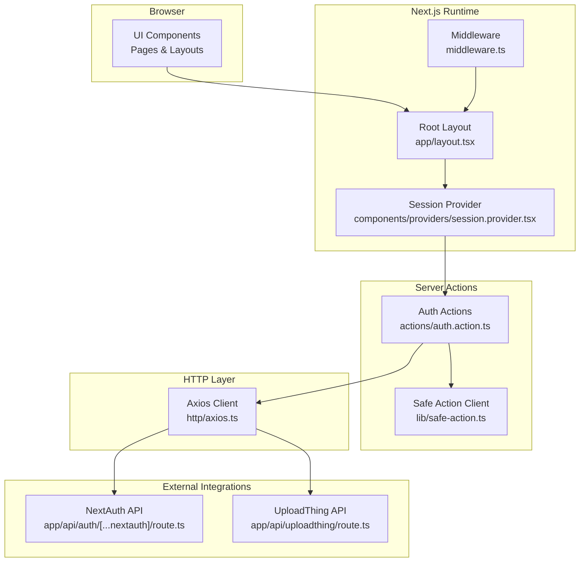
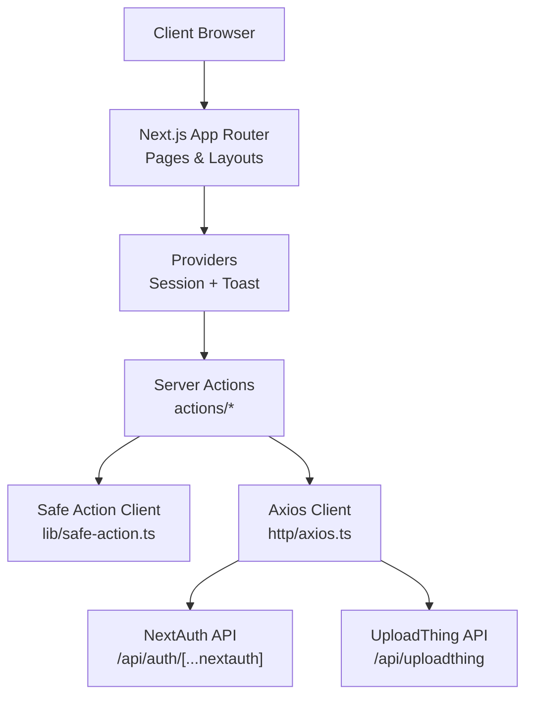
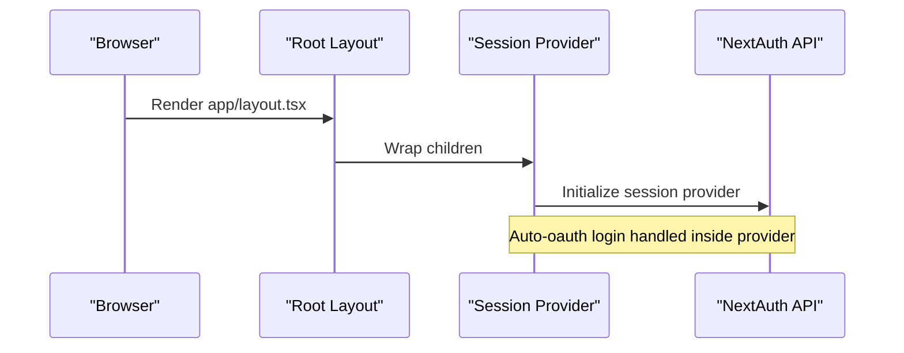
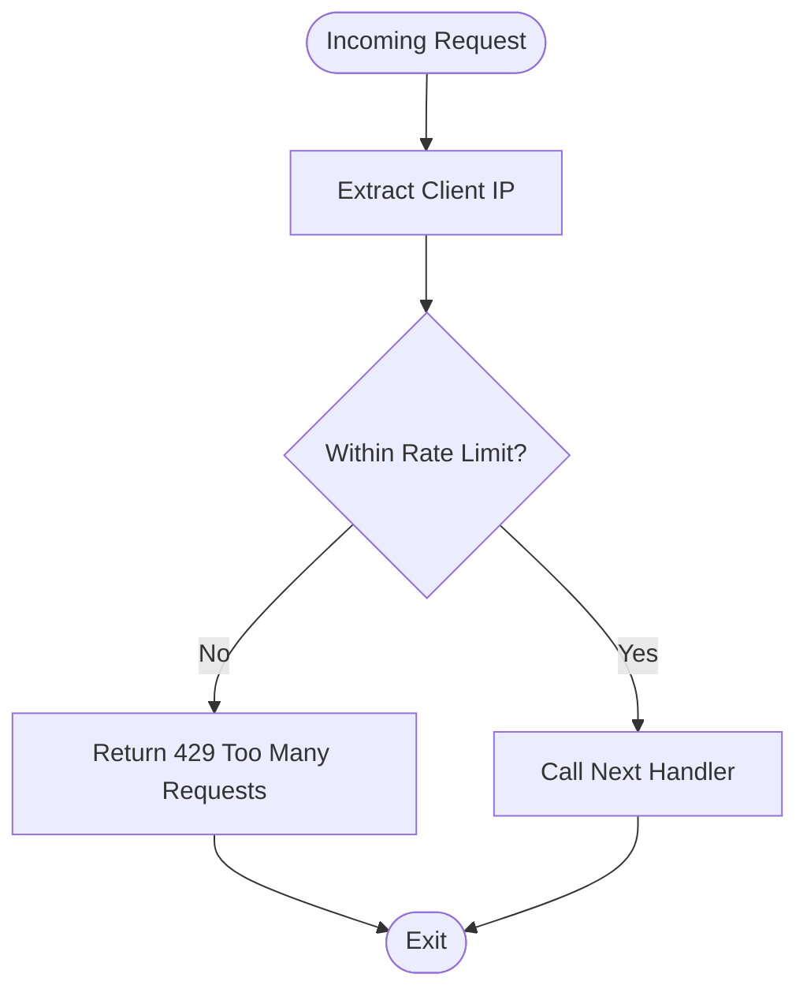
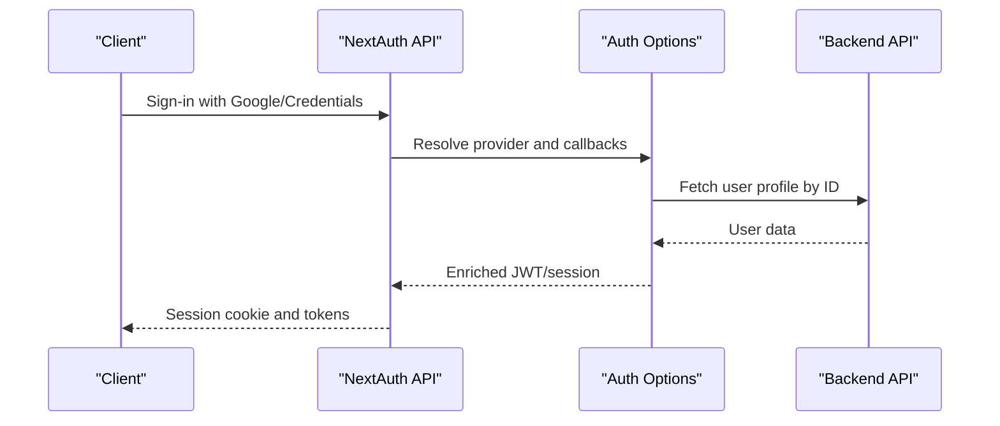
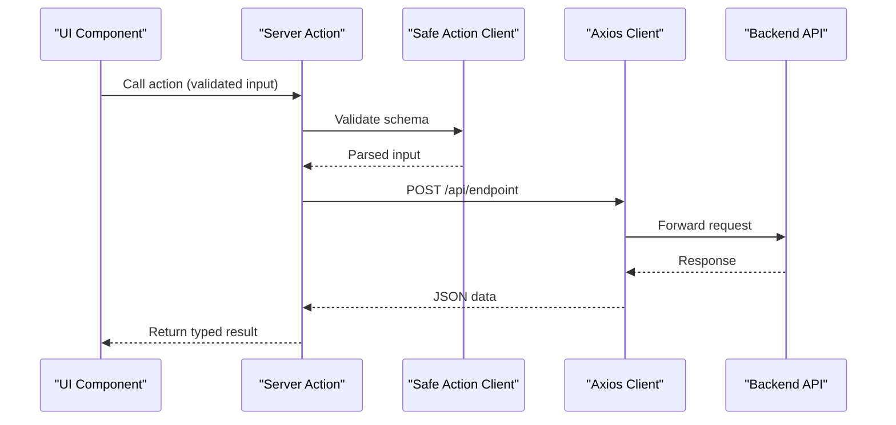
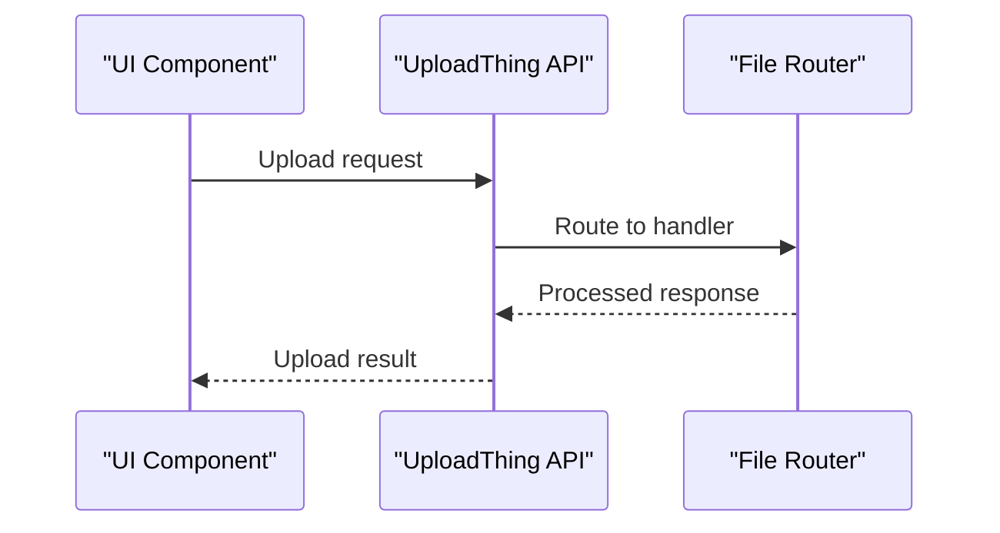
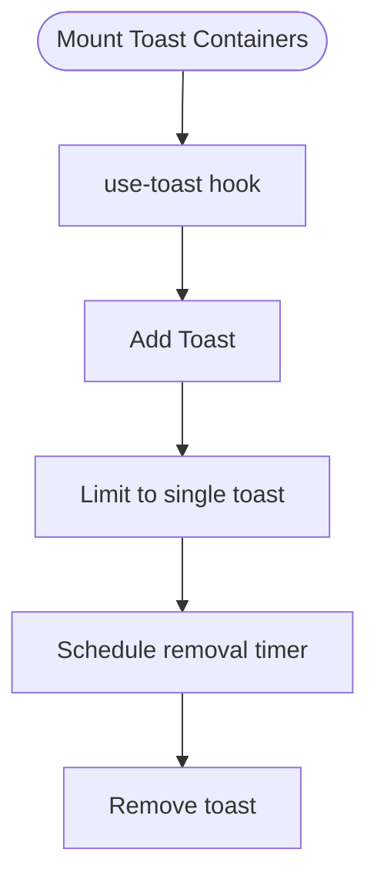
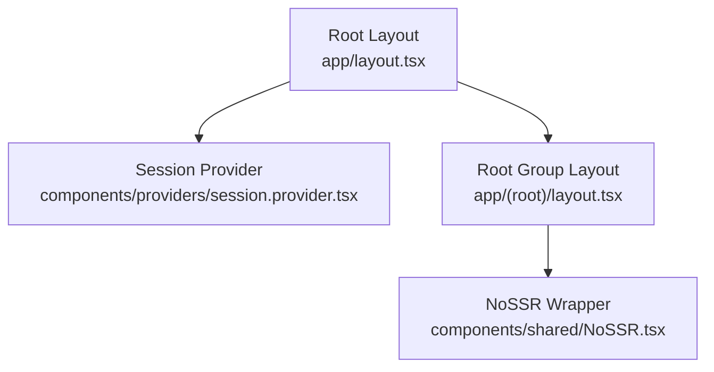
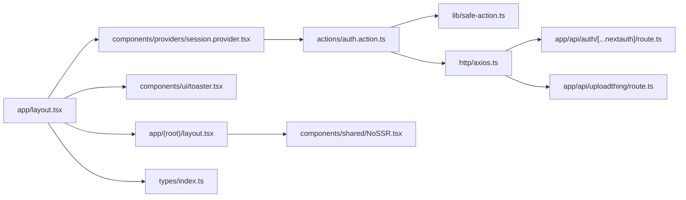

# Architecture & Design

<cite>
**Referenced Files in This Document**
- [app/layout.tsx](file://app/layout.tsx)
- [components/providers/session.provider.tsx](file://components/providers/session.provider.tsx)
- [middleware.ts](file://middleware.ts)
- [lib/auth-options.ts](file://lib/auth-options.ts)
- [actions/auth.action.ts](file://actions/auth.action.ts)
- [http/axios.ts](file://http/axios.ts)
- [app/api/auth/[...nextauth]/route.ts](file://app/api/auth/[...nextauth]/route.ts)
- [app/api/uploadthing/route.ts](file://app/api/uploadthing/route.ts)
- [lib/safe-action.ts](file://lib/safe-action.ts)
- [hooks/use-toast.ts](file://hooks/use-toast.ts)
- [components/ui/toaster.tsx](file://components/ui/toaster.tsx)
- [components/shared/NoSSR.tsx](file://components/shared/NoSSR.tsx)
- [app/(root)/layout.tsx](file://app/(root)/layout.tsx)
- [types/index.ts](file://types/index.ts)
</cite>

## Table of Contents
1. [Introduction](#introduction)
2. [Project Structure](#project-structure)
3. [Core Components](#core-components)
4. [Architecture Overview](#architecture-overview)
5. [Detailed Component Analysis](#detailed-component-analysis)
6. [Dependency Analysis](#dependency-analysis)
7. [Performance Considerations](#performance-considerations)
8. [Troubleshooting Guide](#troubleshooting-guide)
9. [Conclusion](#conclusion)
10. [Appendices](#appendices)

## Introduction
This document describes the system architecture of Optim Bozor, a Next.js application leveraging the App Router with file-based routing, server actions for secure data operations, and authentication middleware. It explains the component hierarchy from the root layout through session providers, progress loaders, and toast notifications. It also documents the data flow from client requests to server actions, HTTP client, and backend APIs, along with design patterns such as Provider pattern, Server Actions pattern, and component composition. Integration boundaries with external services (Google OAuth and UploadThing) and security considerations are included.

## Project Structure
Optim Bozor follows Next.js App Router conventions with nested route groups and file-based routing. The application is structured around:
- app/: Route handlers, pages, layouts, and API routes
- components/: Shared UI components and providers
- actions/: Server action modules for secure operations
- http/: Axios client configuration
- lib/: Authentication options, safe action client, constants, and utilities
- hooks/: Custom hooks for UI behavior (e.g., toast)
- types/: TypeScript type definitions

**Diagram sources**
- [app/layout.tsx:1-73](file://app/layout.tsx#L1-L73)
- [components/providers/session.provider.tsx:1-39](file://components/providers/session.provider.tsx#L1-L39)
- [middleware.ts:1-26](file://middleware.ts#L1-L26)
- [actions/auth.action.ts:1-51](file://actions/auth.action.ts#L1-L51)
- [lib/safe-action.ts:1-4](file://lib/safe-action.ts#L1-L4)
- [http/axios.ts:1-10](file://http/axios.ts#L1-L10)
- [app/api/auth/[...nextauth]/route.ts:1-6](file://app/api/auth/[...nextauth]/route.ts#L1-L6)
- [app/api/uploadthing/route.ts:1-7](file://app/api/uploadthing/route.ts#L1-L7)

**Section sources**
- [app/layout.tsx:1-73](file://app/layout.tsx#L1-L73)
- [components/providers/session.provider.tsx:1-39](file://components/providers/session.provider.tsx#L1-L39)
- [middleware.ts:1-26](file://middleware.ts#L1-L26)
- [actions/auth.action.ts:1-51](file://actions/auth.action.ts#L1-L51)
- [http/axios.ts:1-10](file://http/axios.ts#L1-L10)
- [app/api/auth/[...nextauth]/route.ts:1-6](file://app/api/auth/[...nextauth]/route.ts#L1-L6)
- [app/api/uploadthing/route.ts:1-7](file://app/api/uploadthing/route.ts#L1-L7)
- [lib/safe-action.ts:1-4](file://lib/safe-action.ts#L1-L4)

## Core Components
- Root layout and providers: Initializes global styles, session provider, progress loader, and toast containers.
- Session provider: Manages NextAuth session lifecycle, auto-oauth login flow, and integrates with server actions.
- Middleware: Enforces rate limiting and defines request matching.
- Server actions: Encapsulate secure, typed operations with schema validation and HTTP client integration.
- HTTP client: Centralized Axios configuration with credentials and timeouts.
- Authentication options: NextAuth configuration supporting credentials and Google OAuth providers, JWT session strategy, and cookie policies.
- UI toast system: Custom hook and component for toast notifications with deduplication and timing controls.
- NoSSR wrapper: Dynamic import to avoid SSR mismatches for specific components.

**Section sources**
- [app/layout.tsx:1-73](file://app/layout.tsx#L1-L73)
- [components/providers/session.provider.tsx:1-39](file://components/providers/session.provider.tsx#L1-L39)
- [middleware.ts:1-26](file://middleware.ts#L1-L26)
- [actions/auth.action.ts:1-51](file://actions/auth.action.ts#L1-L51)
- [http/axios.ts:1-10](file://http/axios.ts#L1-L10)
- [lib/auth-options.ts:1-128](file://lib/auth-options.ts#L1-L128)
- [hooks/use-toast.ts:1-192](file://hooks/use-toast.ts#L1-L192)
- [components/ui/toaster.tsx:1-36](file://components/ui/toaster.tsx#L1-L36)
- [components/shared/NoSSR.tsx:1-16](file://components/shared/NoSSR.tsx#L1-L16)

## Architecture Overview
The system follows a layered architecture:
- Presentation layer: Next.js App Router pages and layouts, UI components, and toasts.
- Application layer: Server actions encapsulate business logic and orchestrate HTTP requests.
- Infrastructure layer: HTTP client, NextAuth integration, and UploadThing integration.
- External services: Backend APIs via Next.js API routes and third-party providers.

**Diagram sources**
- [app/layout.tsx:1-73](file://app/layout.tsx#L1-L73)
- [components/providers/session.provider.tsx:1-39](file://components/providers/session.provider.tsx#L1-L39)
- [actions/auth.action.ts:1-51](file://actions/auth.action.ts#L1-L51)
- [lib/safe-action.ts:1-4](file://lib/safe-action.ts#L1-L4)
- [http/axios.ts:1-10](file://http/axios.ts#L1-L10)
- [app/api/auth/[...nextauth]/route.ts:1-6](file://app/api/auth/[...nextauth]/route.ts#L1-L6)
- [app/api/uploadthing/route.ts:1-7](file://app/api/uploadthing/route.ts#L1-L7)

## Detailed Component Analysis

### Root Layout and Providers
- Root layout initializes fonts, metadata, global CSS, a top-progress loader, and toast containers. It wraps children with the session provider.
- Session provider sets up NextAuth session management, auto-oauth login flow, and renders child components.

**Diagram sources**
- [app/layout.tsx:1-73](file://app/layout.tsx#L1-L73)
- [components/providers/session.provider.tsx:1-39](file://components/providers/session.provider.tsx#L1-L39)
- [app/api/auth/[...nextauth]/route.ts:1-6](file://app/api/auth/[...nextauth]/route.ts#L1-L6)

**Section sources**
- [app/layout.tsx:1-73](file://app/layout.tsx#L1-L73)
- [components/providers/session.provider.tsx:1-39](file://components/providers/session.provider.tsx#L1-L39)

### Authentication Middleware
- Middleware enforces rate limiting per IP address and allows all routes except static assets and internal Next.js paths. It injects a response for excessive requests.

**Diagram sources**
- [middleware.ts:1-26](file://middleware.ts#L1-L26)

**Section sources**
- [middleware.ts:1-26](file://middleware.ts#L1-L26)

### NextAuth Configuration and OAuth
- NextAuth supports credentials and Google providers. Cookies are configured for strict security. Callbacks enrich JWT and session with user data and pending OAuth state. The NextAuth API route exposes GET/POST handlers.

**Diagram sources**
- [lib/auth-options.ts:1-128](file://lib/auth-options.ts#L1-L128)
- [app/api/auth/[...nextauth]/route.ts:1-6](file://app/api/auth/[...nextauth]/route.ts#L1-L6)

**Section sources**
- [lib/auth-options.ts:1-128](file://lib/auth-options.ts#L1-L128)
- [app/api/auth/[...nextauth]/route.ts:1-6](file://app/api/auth/[...nextauth]/route.ts#L1-L6)

### Server Actions Pattern
- Server actions encapsulate secure operations with schema validation and typed return shapes. They use a safe action client and communicate with backend APIs via the HTTP client.

**Diagram sources**
- [actions/auth.action.ts:1-51](file://actions/auth.action.ts#L1-L51)
- [lib/safe-action.ts:1-4](file://lib/safe-action.ts#L1-L4)
- [http/axios.ts:1-10](file://http/axios.ts#L1-L10)

**Section sources**
- [actions/auth.action.ts:1-51](file://actions/auth.action.ts#L1-L51)
- [lib/safe-action.ts:1-4](file://lib/safe-action.ts#L1-L4)
- [http/axios.ts:1-10](file://http/axios.ts#L1-L10)

### UploadThing Integration
- UploadThing route handler integrates with the file router to enable direct uploads and server-side processing.

**Diagram sources**
- [app/api/uploadthing/route.ts:1-7](file://app/api/uploadthing/route.ts#L1-L7)

**Section sources**
- [app/api/uploadthing/route.ts:1-7](file://app/api/uploadthing/route.ts#L1-L7)

### Toast Notification System
- The toast system uses a custom hook and a UI component to manage toast state, deduplicate messages, and schedule removal. The root layout mounts toast containers for both libraries.

**Diagram sources**
- [hooks/use-toast.ts:1-192](file://hooks/use-toast.ts#L1-L192)
- [components/ui/toaster.tsx:1-36](file://components/ui/toaster.tsx#L1-L36)
- [app/layout.tsx:1-73](file://app/layout.tsx#L1-L73)

**Section sources**
- [hooks/use-toast.ts:1-192](file://hooks/use-toast.ts#L1-L192)
- [components/ui/toaster.tsx:1-36](file://components/ui/toaster.tsx#L1-L36)
- [app/layout.tsx:1-73](file://app/layout.tsx#L1-L73)

### Component Composition and Layout Hierarchy
- Root layout composes providers and global UI elements.
- Root route group layout organizes desktop sidebar, header, main content area, and scroll-to-top behavior.
- NoSSR wrapper defers rendering of specific components to the client to avoid SSR mismatches.

**Diagram sources**
- [app/layout.tsx:1-73](file://app/layout.tsx#L1-L73)
- [components/providers/session.provider.tsx:1-39](file://components/providers/session.provider.tsx#L1-L39)
- [app/(root)/layout.tsx:1-28](file://app/(root)/layout.tsx#L1-L28)
- [components/shared/NoSSR.tsx:1-16](file://components/shared/NoSSR.tsx#L1-L16)

**Section sources**
- [app/layout.tsx:1-73](file://app/layout.tsx#L1-L73)
- [app/(root)/layout.tsx:1-28](file://app/(root)/layout.tsx#L1-L28)
- [components/shared/NoSSR.tsx:1-16](file://components/shared/NoSSR.tsx#L1-L16)

## Dependency Analysis
- Root layout depends on providers, toast containers, and typography.
- Session provider depends on NextAuth and server actions for auto-oauth login.
- Server actions depend on the safe action client and HTTP client.
- HTTP client depends on environment configuration and communicates with backend APIs.
- NextAuth API depends on auth options and backend user profile retrieval.
- UploadThing API depends on the file router.
- Toast system depends on custom hook and UI components.
- NoSSR wrapper depends on dynamic imports.

**Diagram sources**
- [app/layout.tsx:1-73](file://app/layout.tsx#L1-L73)
- [components/providers/session.provider.tsx:1-39](file://components/providers/session.provider.tsx#L1-L39)
- [components/ui/toaster.tsx:1-36](file://components/ui/toaster.tsx#L1-L36)
- [actions/auth.action.ts:1-51](file://actions/auth.action.ts#L1-L51)
- [lib/safe-action.ts:1-4](file://lib/safe-action.ts#L1-L4)
- [http/axios.ts:1-10](file://http/axios.ts#L1-L10)
- [app/api/auth/[...nextauth]/route.ts:1-6](file://app/api/auth/[...nextauth]/route.ts#L1-L6)
- [app/api/uploadthing/route.ts:1-7](file://app/api/uploadthing/route.ts#L1-L7)
- [app/(root)/layout.tsx:1-28](file://app/(root)/layout.tsx#L1-L28)
- [components/shared/NoSSR.tsx:1-16](file://components/shared/NoSSR.tsx#L1-L16)
- [types/index.ts:1-209](file://types/index.ts#L1-L209)

**Section sources**
- [app/layout.tsx:1-73](file://app/layout.tsx#L1-L73)
- [components/providers/session.provider.tsx:1-39](file://components/providers/session.provider.tsx#L1-L39)
- [components/ui/toaster.tsx:1-36](file://components/ui/toaster.tsx#L1-L36)
- [actions/auth.action.ts:1-51](file://actions/auth.action.ts#L1-L51)
- [lib/safe-action.ts:1-4](file://lib/safe-action.ts#L1-L4)
- [http/axios.ts:1-10](file://http/axios.ts#L1-L10)
- [app/api/auth/[...nextauth]/route.ts:1-6](file://app/api/auth/[...nextauth]/route.ts#L1-L6)
- [app/api/uploadthing/route.ts:1-7](file://app/api/uploadthing/route.ts#L1-L7)
- [app/(root)/layout.tsx:1-28](file://app/(root)/layout.tsx#L1-L28)
- [components/shared/NoSSR.tsx:1-16](file://components/shared/NoSSR.tsx#L1-L16)
- [types/index.ts:1-209](file://types/index.ts#L1-L209)

## Performance Considerations
- Use server actions to minimize client-server round trips and centralize validation.
- Leverage the HTTP client’s timeout and credentials settings to balance reliability and responsiveness.
- Apply rate limiting at middleware level to protect backend resources.
- Keep toast updates minimal and avoid frequent re-renders by batching UI updates.
- Defer heavy components with NoSSR to reduce initial server load.

## Troubleshooting Guide
- Authentication issues: Verify NextAuth provider configuration, cookie policies, and user profile retrieval endpoint.
- Server action errors: Inspect safe action client schema validation and HTTP client responses.
- Upload failures: Confirm UploadThing route handler and file router configuration.
- Toast not appearing: Ensure both toast containers are mounted in the root layout and the use-toast hook is invoked correctly.
- Hydration warnings: Use NoSSR wrapper for components that rely on browser APIs.

**Section sources**
- [lib/auth-options.ts:1-128](file://lib/auth-options.ts#L1-L128)
- [actions/auth.action.ts:1-51](file://actions/auth.action.ts#L1-L51)
- [http/axios.ts:1-10](file://http/axios.ts#L1-L10)
- [app/api/uploadthing/route.ts:1-7](file://app/api/uploadthing/route.ts#L1-L7)
- [hooks/use-toast.ts:1-192](file://hooks/use-toast.ts#L1-L192)
- [components/shared/NoSSR.tsx:1-16](file://components/shared/NoSSR.tsx#L1-L16)

## Conclusion
Optim Bozor’s architecture leverages Next.js App Router for scalable routing, server actions for secure and validated operations, and robust authentication via NextAuth with Google OAuth. The Provider pattern centralizes session and UI state, while the HTTP client and API routes encapsulate backend communication. Security is enforced through middleware, strict cookie policies, and schema-driven actions. The toast system and layout hierarchy deliver a cohesive user experience.

## Appendices
- Type definitions provide consistent data contracts across actions, components, and API responses.

**Section sources**
- [types/index.ts:1-209](file://types/index.ts#L1-L209)