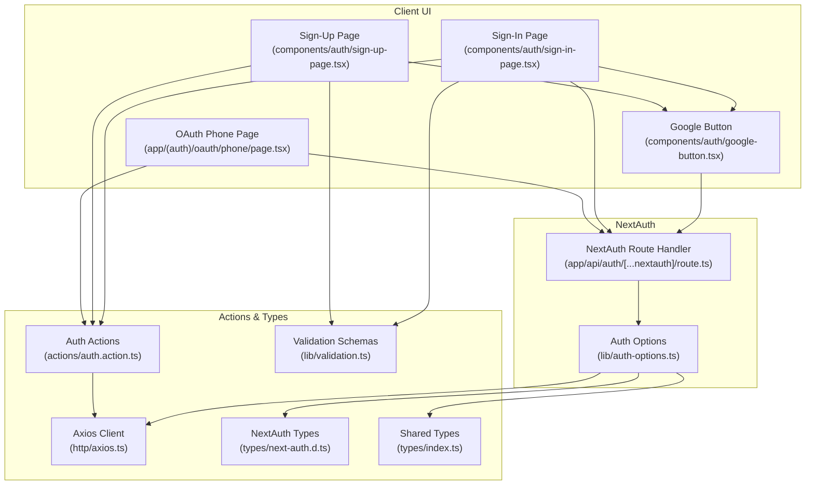
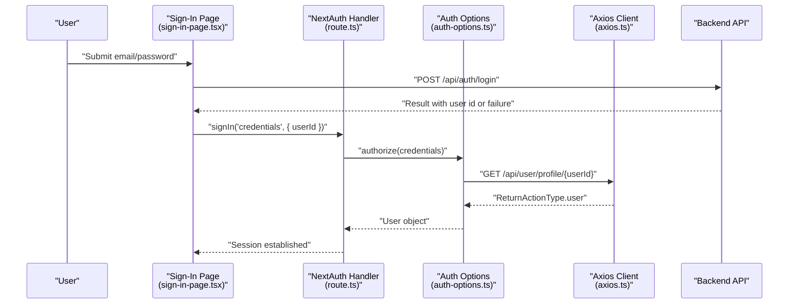
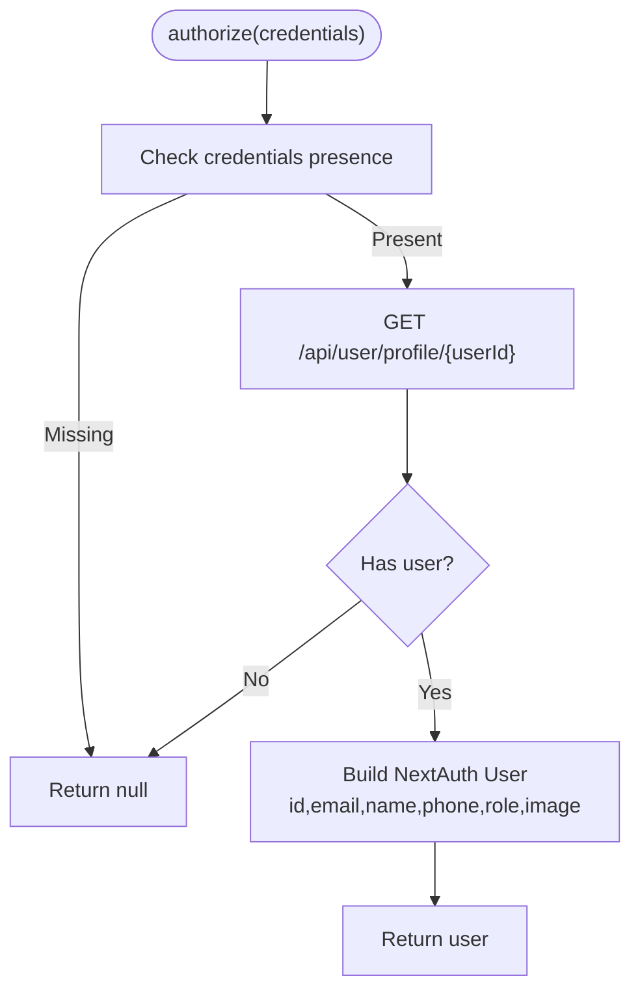
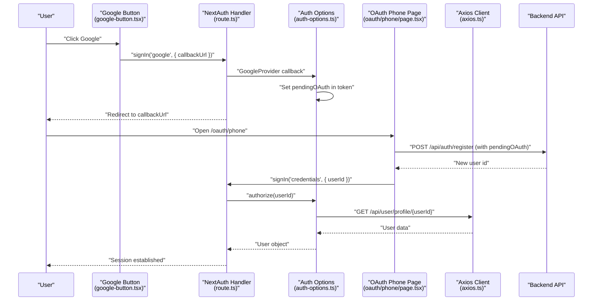
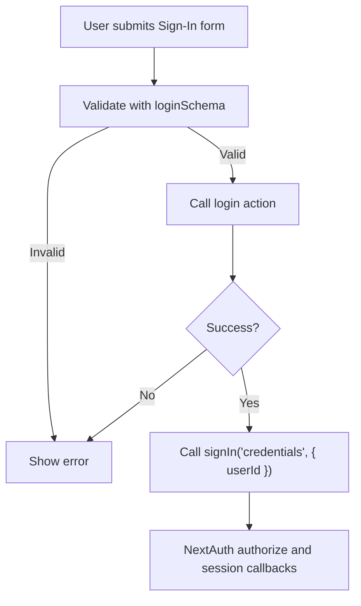
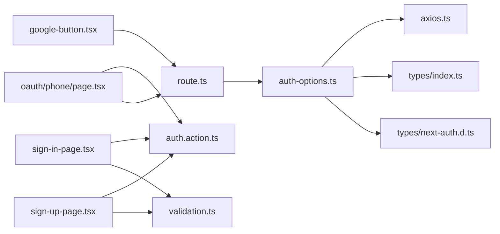

# Authentication Providers

<cite>
**Referenced Files in This Document**
- [lib/auth-options.ts](file://lib/auth-options.ts)
- [app/api/auth/[...nextauth]/route.ts](file://app/api/auth/[...nextauth]/route.ts)
- [components/auth/google-button.tsx](file://components/auth/google-button.tsx)
- [components/auth/sign-in-page.tsx](file://components/auth/sign-in-page.tsx)
- [components/auth/sign-up-page.tsx](file://components/auth/sign-up-page.tsx)
- [app/(auth)/oauth/phone/page.tsx](file://app/(auth)/oauth/phone/page.tsx)
- [actions/auth.action.ts](file://actions/auth.action.ts)
- [lib/validation.ts](file://lib/validation.ts)
- [types/next-auth.d.ts](file://types/next-auth.d.ts)
- [types/index.ts](file://types/index.ts)
- [http/axios.ts](file://http/axios.ts)
</cite>

## Table of Contents
1. [Introduction](#introduction)
2. [Project Structure](#project-structure)
3. [Core Components](#core-components)
4. [Architecture Overview](#architecture-overview)
5. [Detailed Component Analysis](#detailed-component-analysis)
6. [Dependency Analysis](#dependency-analysis)
7. [Performance Considerations](#performance-considerations)
8. [Troubleshooting Guide](#troubleshooting-guide)
9. [Conclusion](#conclusion)

## Introduction
This document explains the authentication providers implementation in Optim Bozor, focusing on:
- CredentialsProvider setup for email/password authentication with custom authorization logic
- GoogleProvider configuration, including client ID/secret setup and OAuth flow handling
- User authorization process, credential validation, and user data mapping from the backend API
- Practical examples of provider configuration, user object construction, and integration with the backend user profile API
- Differences between provider types and their specific implementation requirements

## Project Structure
Authentication in Optim Bozor is centered around NextAuth configuration, provider-specific UI components, and server actions that integrate with the backend API.

**Diagram sources**
- [lib/auth-options.ts:1-128](file://lib/auth-options.ts#L1-L128)
- [app/api/auth/[...nextauth]/route.ts:1-6](file://app/api/auth/[...nextauth]/route.ts#L1-L6)
- [components/auth/google-button.tsx:1-60](file://components/auth/google-button.tsx#L1-L60)
- [components/auth/sign-in-page.tsx:1-178](file://components/auth/sign-in-page.tsx#L1-L178)
- [components/auth/sign-up-page.tsx:1-436](file://components/auth/sign-up-page.tsx#L1-L436)
- [app/(auth)/oauth/phone/page.tsx:1-199](file://app/(auth)/oauth/phone/page.tsx#L1-L199)
- [actions/auth.action.ts:1-51](file://actions/auth.action.ts#L1-L51)
- [lib/validation.ts:1-96](file://lib/validation.ts#L1-L96)
- [types/next-auth.d.ts:1-39](file://types/next-auth.d.ts#L1-L39)
- [types/index.ts:153-209](file://types/index.ts#L153-L209)
- [http/axios.ts:1-10](file://http/axios.ts#L1-L10)

**Section sources**
- [lib/auth-options.ts:1-128](file://lib/auth-options.ts#L1-L128)
- [app/api/auth/[...nextauth]/route.ts:1-6](file://app/api/auth/[...nextauth]/route.ts#L1-L6)
- [components/auth/google-button.tsx:1-60](file://components/auth/google-button.tsx#L1-L60)
- [components/auth/sign-in-page.tsx:1-178](file://components/auth/sign-in-page.tsx#L1-L178)
- [components/auth/sign-up-page.tsx:1-436](file://components/auth/sign-up-page.tsx#L1-L436)
- [app/(auth)/oauth/phone/page.tsx:1-199](file://app/(auth)/oauth/phone/page.tsx#L1-L199)
- [actions/auth.action.ts:1-51](file://actions/auth.action.ts#L1-L51)
- [lib/validation.ts:1-96](file://lib/validation.ts#L1-L96)
- [types/next-auth.d.ts:1-39](file://types/next-auth.d.ts#L1-L39)
- [types/index.ts:153-209](file://types/index.ts#L153-L209)
- [http/axios.ts:1-10](file://http/axios.ts#L1-L10)

## Core Components
- NextAuth configuration defines two providers:
  - CredentialsProvider: authenticates via email/password using a custom authorize function that fetches user data from the backend API and constructs a NextAuth User object.
  - GoogleProvider: integrates Google OAuth with client credentials from environment variables.
- Provider-specific UI components trigger sign-in/sign-up flows and handle redirects.
- Server actions encapsulate backend API calls for login, registration, OTP send/verify, and Google OAuth login.
- Validation schemas ensure input correctness before invoking actions.
- Type definitions extend NextAuth session and user interfaces to include custom fields.

**Section sources**
- [lib/auth-options.ts:8-44](file://lib/auth-options.ts#L8-L44)
- [types/next-auth.d.ts:4-38](file://types/next-auth.d.ts#L4-L38)
- [actions/auth.action.ts:13-51](file://actions/auth.action.ts#L13-L51)
- [lib/validation.ts:3-39](file://lib/validation.ts#L3-L39)

## Architecture Overview
The authentication flow connects UI components, NextAuth, and backend APIs through server actions and Axios.

**Diagram sources**
- [components/auth/sign-in-page.tsx:39-52](file://components/auth/sign-in-page.tsx#L39-L52)
- [actions/auth.action.ts:13-18](file://actions/auth.action.ts#L13-L18)
- [lib/auth-options.ts:13-37](file://lib/auth-options.ts#L13-L37)
- [http/axios.ts:5-9](file://http/axios.ts#L5-L9)
- [types/index.ts:54-73](file://types/index.ts#L54-L73)

## Detailed Component Analysis

### CredentialsProvider: Email/Password Authentication
- Purpose: Authenticate users via email/password and map backend user data to NextAuth’s User object.
- Key steps:
  - UI triggers login action to backend API to receive a user identifier.
  - UI calls NextAuth signIn with provider "credentials" and passes the user ID.
  - NextAuth invokes authorize(credentials) which fetches the user profile from the backend API.
  - authorize constructs a User object with id, email, name, phone, role, and image, then returns it.
  - NextAuth stores user info in JWT and session via callbacks.

Implementation highlights:
- authorize function validates incoming credentials and fetches user data from the backend API.
- User object construction merges backend fields into NextAuth’s User shape.
- Session callback enriches session.currentUser with the latest user data and augments session.user with profile fields.

Practical example references:
- CredentialsProvider configuration: [lib/auth-options.ts:10-38](file://lib/auth-options.ts#L10-L38)
- authorize logic and user mapping: [lib/auth-options.ts:13-37](file://lib/auth-options.ts#L13-L37)
- Session enrichment: [lib/auth-options.ts:87-121](file://lib/auth-options.ts#L87-L121)
- Backend user profile endpoint type: [types/index.ts:54-73](file://types/index.ts#L54-L73)

**Diagram sources**
- [lib/auth-options.ts:13-37](file://lib/auth-options.ts#L13-L37)
- [types/index.ts:153-169](file://types/index.ts#L153-L169)

**Section sources**
- [lib/auth-options.ts:10-38](file://lib/auth-options.ts#L10-L38)
- [lib/auth-options.ts:13-37](file://lib/auth-options.ts#L13-L37)
- [lib/auth-options.ts:87-121](file://lib/auth-options.ts#L87-L121)
- [types/index.ts:54-73](file://types/index.ts#L54-L73)

### GoogleProvider: OAuth Flow and Onboarding
- Purpose: Allow users to sign in with Google. For existing users, the flow logs them in directly. For new users, it captures a phone number to finalize registration.
- Configuration:
  - Client ID and Secret are loaded from environment variables.
  - signIn("google", { callbackUrl }) is triggered from UI components.
- Onboarding flow:
  - If a user lacks a backend userId, the session includes pendingOAuth metadata.
  - The OAuthPhonePage collects a phone number, registers the user, and signs them in via credentials provider.

Implementation highlights:
- GoogleProvider setup: [lib/auth-options.ts:40-43](file://lib/auth-options.ts#L40-L43)
- GoogleButton click handler sets callbackUrl based on route/variant: [components/auth/google-button.tsx:17-21](file://components/auth/google-button.tsx#L17-L21)
- Pending OAuth token augmentation in JWT callback: [lib/auth-options.ts:79-82](file://lib/auth-options.ts#L79-L82)
- Session enrichment with pendingOAuth: [lib/auth-options.ts:116-118](file://lib/auth-options.ts#L116-L118)
- Phone capture and registration after OAuth: [app/(auth)/oauth/phone/page.tsx:47-84](file://app/(auth)/oauth/phone/page.tsx#L47-L84)

**Diagram sources**
- [components/auth/google-button.tsx:17-21](file://components/auth/google-button.tsx#L17-L21)
- [lib/auth-options.ts:79-82](file://lib/auth-options.ts#L79-L82)
- [lib/auth-options.ts:116-118](file://lib/auth-options.ts#L116-L118)
- [app/(auth)/oauth/phone/page.tsx:47-84](file://app/(auth)/oauth/phone/page.tsx#L47-L84)
- [lib/auth-options.ts:13-37](file://lib/auth-options.ts#L13-L37)
- [http/axios.ts:5-9](file://http/axios.ts#L5-L9)

**Section sources**
- [lib/auth-options.ts:40-43](file://lib/auth-options.ts#L40-L43)
- [components/auth/google-button.tsx:17-21](file://components/auth/google-button.tsx#L17-L21)
- [lib/auth-options.ts:79-82](file://lib/auth-options.ts#L79-L82)
- [lib/auth-options.ts:116-118](file://lib/auth-options.ts#L116-L118)
- [app/(auth)/oauth/phone/page.tsx:47-84](file://app/(auth)/oauth/phone/page.tsx#L47-L84)

### User Authorization Process and Credential Validation
- Sign-in flow:
  - UI validates inputs using loginSchema.
  - Calls login action to authenticate against backend API.
  - On success, triggers NextAuth signIn with provider "credentials" and userId.
- Registration and OTP flow:
  - UI sends OTP, verifies OTP, and registers the user.
  - On successful registration, triggers NextAuth signIn with provider "credentials" and userId.
- Validation schemas ensure robust input handling before invoking actions.

References:
- Login action and response parsing: [actions/auth.action.ts:13-18](file://actions/auth.action.ts#L13-L18)
- Registration and OTP actions: [actions/auth.action.ts:20-39](file://actions/auth.action.ts#L20-L39)
- Sign-in page submission and credentials sign-in: [components/auth/sign-in-page.tsx:39-52](file://components/auth/sign-in-page.tsx#L39-L52)
- Sign-up page OTP verification and credentials sign-in: [components/auth/sign-up-page.tsx:66-103](file://components/auth/sign-up-page.tsx#L66-L103)
- Validation schemas: [lib/validation.ts:3-39](file://lib/validation.ts#L3-L39)

**Diagram sources**
- [components/auth/sign-in-page.tsx:29-52](file://components/auth/sign-in-page.tsx#L29-L52)
- [actions/auth.action.ts:13-18](file://actions/auth.action.ts#L13-L18)
- [lib/validation.ts:3-6](file://lib/validation.ts#L3-L6)

**Section sources**
- [actions/auth.action.ts:13-18](file://actions/auth.action.ts#L13-L18)
- [components/auth/sign-in-page.tsx:29-52](file://components/auth/sign-in-page.tsx#L29-L52)
- [components/auth/sign-up-page.tsx:66-103](file://components/auth/sign-up-page.tsx#L66-L103)
- [lib/validation.ts:3-39](file://lib/validation.ts#L3-L39)

### User Data Mapping from Backend API
- Backend user profile API returns a structured user object.
- NextAuth callbacks map backend fields to NextAuth User and session shapes.
- Extended session types include current user details and pending OAuth metadata.

References:
- Backend user profile response type: [types/index.ts:54-73](file://types/index.ts#L54-L73)
- User mapping in authorize: [lib/auth-options.ts:20-34](file://lib/auth-options.ts#L20-L34)
- Session augmentation: [lib/auth-options.ts:99-110](file://lib/auth-options.ts#L99-L110)
- Extended session and user types: [types/next-auth.d.ts:4-38](file://types/next-auth.d.ts#L4-L38)

**Section sources**
- [types/index.ts:54-73](file://types/index.ts#L54-L73)
- [lib/auth-options.ts:20-34](file://lib/auth-options.ts#L20-L34)
- [lib/auth-options.ts:99-110](file://lib/auth-options.ts#L99-L110)
- [types/next-auth.d.ts:4-38](file://types/next-auth.d.ts#L4-L38)

### Differences Between Provider Types
- CredentialsProvider:
  - Requires a userId to be passed from the frontend after backend authentication.
  - Uses authorize to fetch and map user data from the backend API.
  - Suitable for traditional email/password login with custom backend logic.
- GoogleProvider:
  - Uses OAuth with client credentials from environment variables.
  - Supports onboarding flow for new users by capturing a phone number and registering them.
  - Integrates with pendingOAuth metadata to guide the onboarding experience.

References:
- CredentialsProvider vs GoogleProvider configuration: [lib/auth-options.ts:10-43](file://lib/auth-options.ts#L10-L43)
- Onboarding with pendingOAuth: [lib/auth-options.ts:79-82](file://lib/auth-options.ts#L79-L82), [lib/auth-options.ts:116-118](file://lib/auth-options.ts#L116-L118)
- Phone capture after OAuth: [app/(auth)/oauth/phone/page.tsx:47-84](file://app/(auth)/oauth/phone/page.tsx#L47-L84)

**Section sources**
- [lib/auth-options.ts:10-43](file://lib/auth-options.ts#L10-L43)
- [lib/auth-options.ts:79-82](file://lib/auth-options.ts#L79-L82)
- [lib/auth-options.ts:116-118](file://lib/auth-options.ts#L116-L118)
- [app/(auth)/oauth/phone/page.tsx:47-84](file://app/(auth)/oauth/phone/page.tsx#L47-L84)

## Dependency Analysis
- NextAuth route handler delegates to authOptions.
- authOptions depends on:
  - axiosClient for backend API calls
  - ReturnActionType and IUser for type safety
  - Environment variables for provider credentials
- UI components depend on:
  - NextAuth client for sign-in
  - Server actions for backend interactions
  - Validation schemas for input checks

**Diagram sources**
- [app/api/auth/[...nextauth]/route.ts:1-6](file://app/api/auth/[...nextauth]/route.ts#L1-L6)
- [lib/auth-options.ts:1-128](file://lib/auth-options.ts#L1-L128)
- [http/axios.ts:1-10](file://http/axios.ts#L1-L10)
- [types/index.ts:153-209](file://types/index.ts#L153-L209)
- [types/next-auth.d.ts:1-39](file://types/next-auth.d.ts#L1-L39)
- [components/auth/sign-in-page.tsx:1-178](file://components/auth/sign-in-page.tsx#L1-L178)
- [components/auth/sign-up-page.tsx:1-436](file://components/auth/sign-up-page.tsx#L1-L436)
- [lib/validation.ts:1-96](file://lib/validation.ts#L1-L96)
- [components/auth/google-button.tsx:1-60](file://components/auth/google-button.tsx#L1-L60)
- [app/(auth)/oauth/phone/page.tsx:1-199](file://app/(auth)/oauth/phone/page.tsx#L1-L199)
- [actions/auth.action.ts:1-51](file://actions/auth.action.ts#L1-L51)

**Section sources**
- [app/api/auth/[...nextauth]/route.ts:1-6](file://app/api/auth/[...nextauth]/route.ts#L1-L6)
- [lib/auth-options.ts:1-128](file://lib/auth-options.ts#L1-L128)
- [http/axios.ts:1-10](file://http/axios.ts#L1-L10)
- [types/index.ts:153-209](file://types/index.ts#L153-L209)
- [types/next-auth.d.ts:1-39](file://types/next-auth.d.ts#L1-L39)
- [components/auth/sign-in-page.tsx:1-178](file://components/auth/sign-in-page.tsx#L1-L178)
- [components/auth/sign-up-page.tsx:1-436](file://components/auth/sign-up-page.tsx#L1-L436)
- [lib/validation.ts:1-96](file://lib/validation.ts#L1-L96)
- [components/auth/google-button.tsx:1-60](file://components/auth/google-button.tsx#L1-L60)
- [app/(auth)/oauth/phone/page.tsx:1-199](file://app/(auth)/oauth/phone/page.tsx#L1-L199)
- [actions/auth.action.ts:1-51](file://actions/auth.action.ts#L1-L51)

## Performance Considerations
- Minimize network calls in callbacks: The session callback fetches the user profile on every request. Consider caching strategies or reducing frequency for high-traffic scenarios.
- Use environment variables for provider credentials to avoid embedding secrets in client-side code.
- Validate inputs early with Zod schemas to reduce unnecessary backend calls.
- Keep JWT payload minimal; only store essential user identifiers and flags in tokens.

## Troubleshooting Guide
Common issues and resolutions:
- Missing environment variables for GoogleProvider:
  - Ensure GOOGLE_CLIENT_ID and GOOGLE_CLIENT_SECRET are set. These are required for Google OAuth to function.
  - Reference: [lib/auth-options.ts:40-43](file://lib/auth-options.ts#L40-L43)
- CredentialsProvider fails to authorize:
  - Verify that the backend user profile endpoint returns a valid user object for the given userId.
  - Confirm that the authorize function receives and returns a properly shaped User object.
  - Reference: [lib/auth-options.ts:13-37](file://lib/auth-options.ts#L13-L37)
- Session.currentUser missing after Google OAuth:
  - Ensure the session callback fetches the user profile using the stored userId and merges it into session.currentUser.
  - Reference: [lib/auth-options.ts:87-121](file://lib/auth-options.ts#L87-L121)
- Pending OAuth not populated:
  - Check that the JWT callback sets pendingOAuth for Google sign-ins and that the session callback reads it.
  - Reference: [lib/auth-options.ts:79-82](file://lib/auth-options.ts#L79-L82), [lib/auth-options.ts:116-118](file://lib/auth-options.ts#L116-L118)
- Phone capture page not reachable:
  - Confirm that the OAuthPhonePage redirects to Google sign-in when pendingOAuth is absent and that it uses the correct callbackUrl.
  - Reference: [app/(auth)/oauth/phone/page.tsx:34-45](file://app/(auth)/oauth/phone/page.tsx#L34-L45)

**Section sources**
- [lib/auth-options.ts:40-43](file://lib/auth-options.ts#L40-L43)
- [lib/auth-options.ts:13-37](file://lib/auth-options.ts#L13-L37)
- [lib/auth-options.ts:87-121](file://lib/auth-options.ts#L87-L121)
- [lib/auth-options.ts:79-82](file://lib/auth-options.ts#L79-L82)
- [lib/auth-options.ts:116-118](file://lib/auth-options.ts#L116-L118)
- [app/(auth)/oauth/phone/page.tsx:34-45](file://app/(auth)/oauth/phone/page.tsx#L34-L45)

## Conclusion
Optim Bozor’s authentication system combines NextAuth providers with server actions and backend API integrations:
- CredentialsProvider enables email/password login with custom authorization logic and user data mapping.
- GoogleProvider supports OAuth with onboarding for new users, leveraging pendingOAuth metadata and a dedicated phone capture page.
- Strong typing via extended NextAuth interfaces ensures predictable session and user shapes.
- Robust input validation and clear separation of concerns between UI, NextAuth, and actions contribute to a maintainable and extensible authentication layer.