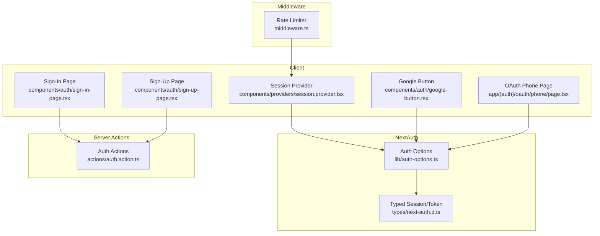
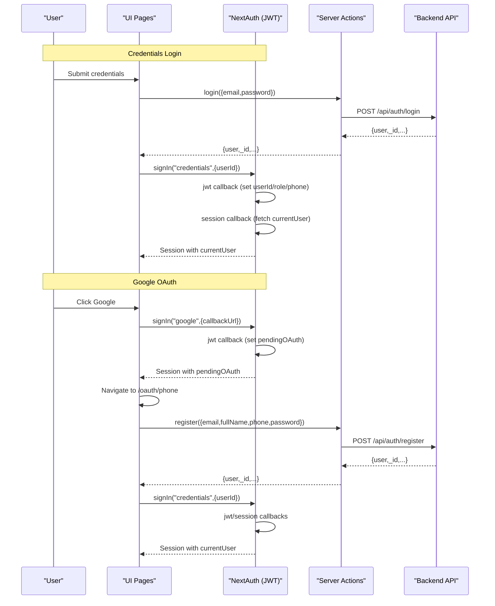
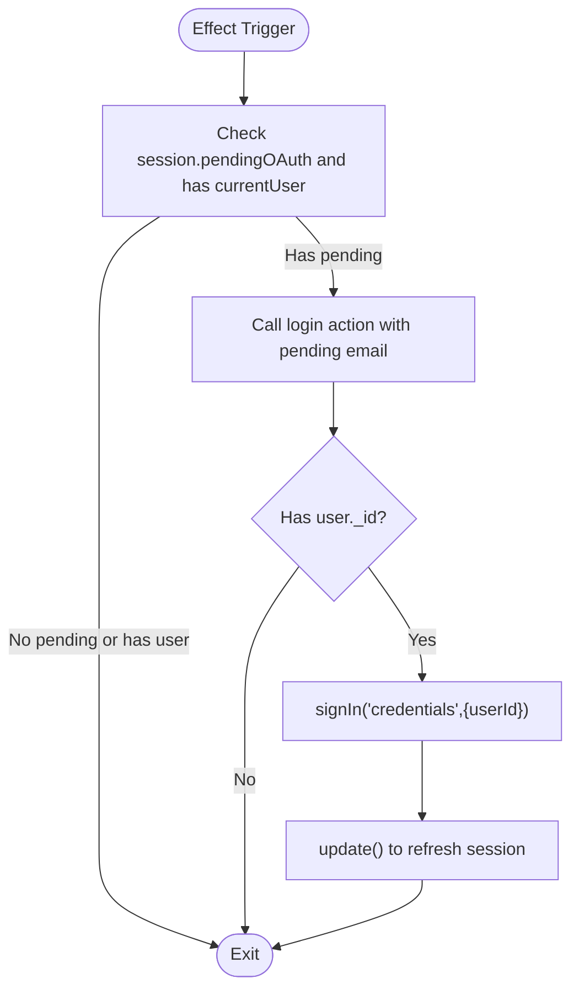
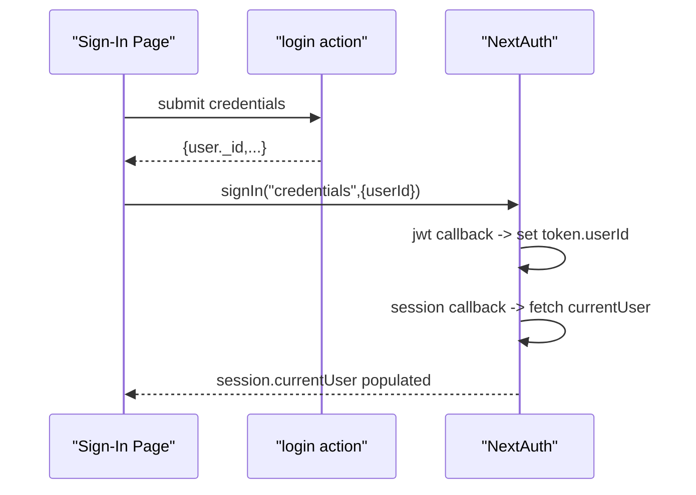
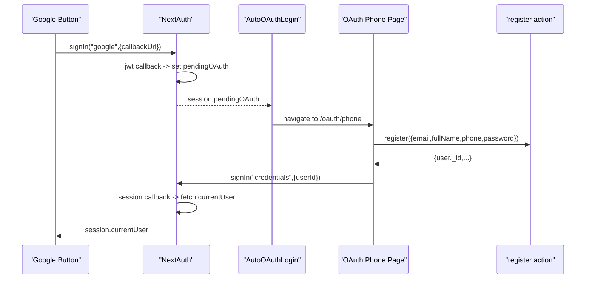
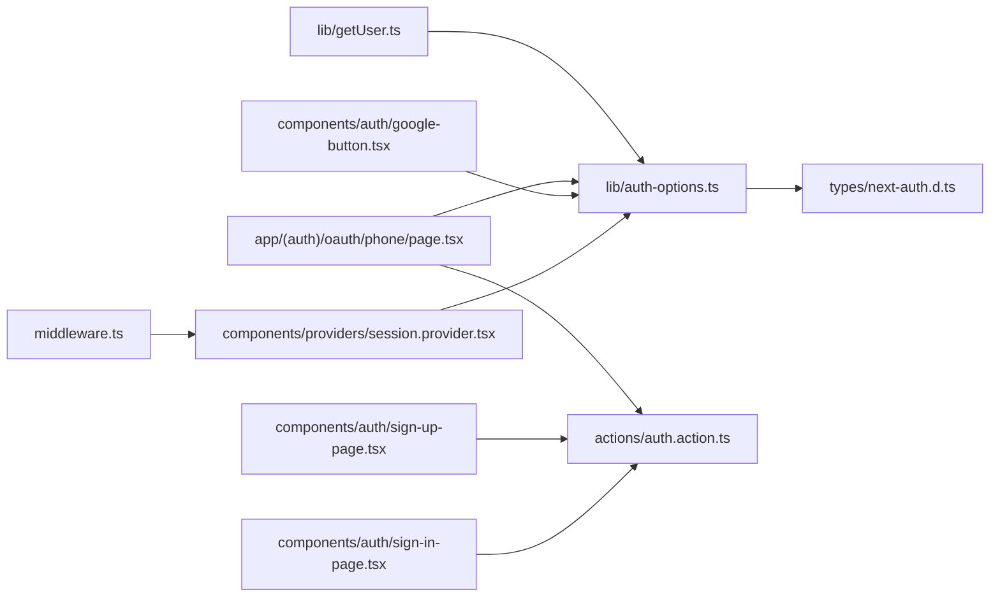

# Authentication System

<cite>
**Referenced Files in This Document**
- [lib/auth-options.ts](file://lib/auth-options.ts)
- [components/providers/session.provider.tsx](file://components/providers/session.provider.tsx)
- [types/next-auth.d.ts](file://types/next-auth.d.ts)
- [actions/auth.action.ts](file://actions/auth.action.ts)
- [components/auth/sign-in-page.tsx](file://components/auth/sign-in-page.tsx)
- [components/auth/sign-up-page.tsx](file://components/auth/sign-up-page.tsx)
- [components/auth/google-button.tsx](file://components/auth/google-button.tsx)
- [app/(auth)/oauth/phone/page.tsx](file://app/(auth)/oauth/phone/page.tsx)
- [lib/getUser.ts](file://lib/getUser.ts)
- [middleware.ts](file://middleware.ts)
</cite>

## Table of Contents
1. [Introduction](#introduction)
2. [Project Structure](#project-structure)
3. [Core Components](#core-components)
4. [Architecture Overview](#architecture-overview)
5. [Detailed Component Analysis](#detailed-component-analysis)
6. [Dependency Analysis](#dependency-analysis)
7. [Performance Considerations](#performance-considerations)
8. [Troubleshooting Guide](#troubleshooting-guide)
9. [Conclusion](#conclusion)

## Introduction
This document explains the authentication system for Optim Bozor built on NextAuth v4 with a custom JWT strategy. It covers the dual-provider setup (credentials and Google OAuth), the end-to-end authentication flow from login/signup to session management, protected route access, session persistence, security measures, and logout procedures. It also documents user role management, token refresh mechanisms, and practical examples for protected routes and user state management.

## Project Structure
The authentication system spans several layers:
- NextAuth configuration and typed session/token interfaces
- Client-side providers and auto-oauth login flow
- Action-layer wrappers for server-side API calls
- UI pages for sign-in, sign-up, and Google OAuth continuation
- Middleware for rate limiting and global protection
- Server-side session retrieval helpers

**Diagram sources**
- [components/providers/session.provider.tsx:1-39](file://components/providers/session.provider.tsx#L1-L39)
- [components/auth/sign-in-page.tsx:1-178](file://components/auth/sign-in-page.tsx#L1-L178)
- [components/auth/sign-up-page.tsx:1-436](file://components/auth/sign-up-page.tsx#L1-L436)
- [components/auth/google-button.tsx:1-60](file://components/auth/google-button.tsx#L1-L60)
- [app/(auth)/oauth/phone/page.tsx:1-199](file://app/(auth)/oauth/phone/page.tsx#L1-L199)
- [lib/auth-options.ts:1-128](file://lib/auth-options.ts#L1-L128)
- [types/next-auth.d.ts:1-39](file://types/next-auth.d.ts#L1-L39)
- [actions/auth.action.ts:1-51](file://actions/auth.action.ts#L1-L51)
- [middleware.ts:1-26](file://middleware.ts#L1-L26)

**Section sources**
- [lib/auth-options.ts:1-128](file://lib/auth-options.ts#L1-L128)
- [components/providers/session.provider.tsx:1-39](file://components/providers/session.provider.tsx#L1-L39)
- [types/next-auth.d.ts:1-39](file://types/next-auth.d.ts#L1-L39)
- [actions/auth.action.ts:1-51](file://actions/auth.action.ts#L1-L51)
- [components/auth/sign-in-page.tsx:1-178](file://components/auth/sign-in-page.tsx#L1-L178)
- [components/auth/sign-up-page.tsx:1-436](file://components/auth/sign-up-page.tsx#L1-L436)
- [components/auth/google-button.tsx:1-60](file://components/auth/google-button.tsx#L1-L60)
- [app/(auth)/oauth/phone/page.tsx:1-199](file://app/(auth)/oauth/phone/page.tsx#L1-L199)
- [middleware.ts:1-26](file://middleware.ts#L1-L26)

## Core Components
- NextAuth configuration with JWT strategy and cookie security
- Typed session and JWT interfaces for strong typing
- Session provider with automatic OAuth-to-credentials bridge
- Action-layer wrappers for login, registration, OTP, and OAuth login
- UI pages for credentials and Google OAuth flows
- Server-side session retrieval helper

Key capabilities:
- Dual providers: credentials (user ID lookup) and Google OAuth
- JWT callbacks for enriching tokens and sessions
- Session persistence via JWT strategy
- Security: HttpOnly and Secure cookies, SameSite lax, CSRF protection
- Role-aware user data propagation to session.currentUser
- Auto-oauth login flow to convert Google sessions into credentials sessions

**Section sources**
- [lib/auth-options.ts:8-127](file://lib/auth-options.ts#L8-L127)
- [types/next-auth.d.ts:4-38](file://types/next-auth.d.ts#L4-L38)
- [components/providers/session.provider.tsx:31-39](file://components/providers/session.provider.tsx#L31-L39)
- [actions/auth.action.ts:13-51](file://actions/auth.action.ts#L13-L51)

## Architecture Overview
The authentication architecture integrates client-side UI, NextAuth callbacks, and server actions. The flow varies by provider but converges on a unified JWT session with enriched user data.

**Diagram sources**
- [components/auth/sign-in-page.tsx:39-52](file://components/auth/sign-in-page.tsx#L39-L52)
- [actions/auth.action.ts:13-18](file://actions/auth.action.ts#L13-L18)
- [lib/auth-options.ts:69-122](file://lib/auth-options.ts#L69-L122)
- [components/auth/google-button.tsx:17-21](file://components/auth/google-button.tsx#L17-L21)
- [app/(auth)/oauth/phone/page.tsx:47-84](file://app/(auth)/oauth/phone/page.tsx#L47-L84)
- [actions/auth.action.ts:20-25](file://actions/auth.action.ts#L20-L25)

## Detailed Component Analysis

### NextAuth Configuration (JWT Strategy)
- Providers:
  - CredentialsProvider: authorizes via user ID and loads user profile from backend
  - GoogleProvider: standard OAuth with client ID/secret
- Cookies:
  - HttpOnly and Secure session token, CSRF, state, PKCE cookies
  - SameSite lax for cross-site callback handling
- Callbacks:
  - jwt: stores userId, role, phone for credentials; sets pendingOAuth for Google
  - session: enriches session with full currentUser from backend; backfills user.phone if needed; exposes pendingOAuth
- Session/JWT:
  - strategy: jwt
  - secrets from environment variables

Security highlights:
- HttpOnly cookies prevent XSS theft
- Secure cookies require HTTPS
- CSRF and state cookies protect against CSRF attacks
- SameSite lax allows Google redirects

**Section sources**
- [lib/auth-options.ts:8-127](file://lib/auth-options.ts#L8-L127)

### Typed Session and JWT Interfaces
- Session augmentation includes:
  - user.id, user.phone, user.phone1
  - currentUser: full user object from backend
  - pendingOAuth: temporary Google info during onboarding
- JWT augmentation mirrors pendingOAuth and user identifiers

These types ensure compile-time safety for session usage across the app.

**Section sources**
- [types/next-auth.d.ts:4-38](file://types/next-auth.d.ts#L4-L38)

### Session Provider and Auto-OAuth Login
- Wraps the app with SessionProvider and disables refetch on window focus
- AutoOAuthLogin effect:
  - Detects pendingOAuth in session and absence of currentUser
  - Calls login action with a dummy password
  - Switches to credentials provider using returned user._id
  - Updates session to reflect currentUser

This creates a seamless transition from Google OAuth to a persistent credentials session.

**Diagram sources**
- [components/providers/session.provider.tsx:7-30](file://components/providers/session.provider.tsx#L7-L30)

**Section sources**
- [components/providers/session.provider.tsx:31-39](file://components/providers/session.provider.tsx#L31-L39)

### Credentials Login Flow
- UI collects email/password
- Calls login action to validate and receive user._id
- Invokes signIn("credentials",{userId, callbackUrl })
- NextAuth jwt/session callbacks enrich the session with currentUser

**Diagram sources**
- [components/auth/sign-in-page.tsx:39-52](file://components/auth/sign-in-page.tsx#L39-L52)
- [actions/auth.action.ts:13-18](file://actions/auth.action.ts#L13-L18)
- [lib/auth-options.ts:69-122](file://lib/auth-options.ts#L69-L122)

**Section sources**
- [components/auth/sign-in-page.tsx:1-178](file://components/auth/sign-in-page.tsx#L1-L178)
- [actions/auth.action.ts:13-18](file://actions/auth.action.ts#L13-L18)

### Google OAuth Flow
- GoogleButton triggers signIn("google", { callbackUrl })
- NextAuth jwt callback sets pendingOAuth
- SessionProvider detects pendingOAuth and initiates AutoOAuthLogin
- OAuthPhonePage captures phone, registers user, then signs in with credentials

**Diagram sources**
- [components/auth/google-button.tsx:17-21](file://components/auth/google-button.tsx#L17-L21)
- [lib/auth-options.ts:79-82](file://lib/auth-options.ts#L79-L82)
- [components/providers/session.provider.tsx:7-30](file://components/providers/session.provider.tsx#L7-L30)
- [app/(auth)/oauth/phone/page.tsx:47-84](file://app/(auth)/oauth/phone/page.tsx#L47-L84)
- [actions/auth.action.ts:20-25](file://actions/auth.action.ts#L20-L25)

**Section sources**
- [components/auth/google-button.tsx:1-60](file://components/auth/google-button.tsx#L1-L60)
- [app/(auth)/oauth/phone/page.tsx:1-199](file://app/(auth)/oauth/phone/page.tsx#L1-L199)

### Protected Routes and Access Control
- Protected routes are enforced by middleware that applies a rate limiter to all routes except static assets and Next.js internals.
- Server-side session retrieval is available via a helper that uses NextAuth’s getServerSession with the configured authOptions.

Practical guidance:
- Wrap pages/components that require authentication with checks against session.currentUser
- Use middleware to guard API routes and enforce rate limits
- For SSR, use the server session helper to populate props safely

**Section sources**
- [middleware.ts:9-20](file://middleware.ts#L9-L20)
- [lib/getUser.ts:4-7](file://lib/getUser.ts#L4-L7)

### Logout Procedures
- Use the NextAuth client-side signOut function to clear session cookies and invalidate the JWT session on the client
- On the server, use getServerSession to manage session state during SSR and API handlers

Note: The repository does not define a dedicated logout page; integrate signOut in UI components as needed.

**Section sources**
- [lib/auth-options.ts:46-67](file://lib/auth-options.ts#L46-L67)

### Token Refresh Mechanisms
- JWT strategy: tokens are refreshed implicitly when session callbacks run and the session is accessed
- The session provider disables refetch on window focus to avoid redundant network calls; manual update is used after OAuth conversion

Recommendations:
- Keep JWT expiration aligned with application needs
- Use session.update() after critical state changes (e.g., OAuth completion)

**Section sources**
- [components/providers/session.provider.tsx:33-34](file://components/providers/session.provider.tsx#L33-L34)
- [lib/auth-options.ts:124-127](file://lib/auth-options.ts#L124-L127)

### User Role Management
- The credentials provider augments the user object with role information
- NextAuth callbacks propagate role into the JWT token and session
- UI pages can conditionally render content based on session.currentUser.role

Best practices:
- Enforce role-based access in middleware and server actions
- Avoid leaking sensitive role details outside of session

**Section sources**
- [lib/auth-options.ts:22-36](file://lib/auth-options.ts#L22-L36)
- [lib/auth-options.ts:72-77](file://lib/auth-options.ts#L72-L77)
- [types/next-auth.d.ts:11-18](file://types/next-auth.d.ts#L11-L18)

### Session Persistence and Security
- HttpOnly and Secure cookies for sessionToken, callbackUrl, csrfToken, state, pkceCodeVerifier
- SameSite lax for cross-site OAuth callbacks
- CSRF protection via dedicated cookie
- JWT secret and NextAuth secret from environment variables

Operational tips:
- Ensure HTTPS in production to enable Secure cookies
- Rotate secrets periodically
- Monitor cookie domains and paths if deploying behind proxies

**Section sources**
- [lib/auth-options.ts:46-67](file://lib/auth-options.ts#L46-L67)
- [lib/auth-options.ts:124-127](file://lib/auth-options.ts#L124-L127)

## Dependency Analysis

**Diagram sources**
- [lib/auth-options.ts:1-128](file://lib/auth-options.ts#L1-L128)
- [types/next-auth.d.ts:1-39](file://types/next-auth.d.ts#L1-L39)
- [components/providers/session.provider.tsx:1-39](file://components/providers/session.provider.tsx#L1-L39)
- [components/auth/sign-in-page.tsx:1-178](file://components/auth/sign-in-page.tsx#L1-L178)
- [components/auth/sign-up-page.tsx:1-436](file://components/auth/sign-up-page.tsx#L1-L436)
- [components/auth/google-button.tsx:1-60](file://components/auth/google-button.tsx#L1-L60)
- [app/(auth)/oauth/phone/page.tsx:1-199](file://app/(auth)/oauth/phone/page.tsx#L1-L199)
- [actions/auth.action.ts:1-51](file://actions/auth.action.ts#L1-L51)
- [middleware.ts:1-26](file://middleware.ts#L1-L26)
- [lib/getUser.ts:1-10](file://lib/getUser.ts#L1-L10)

**Section sources**
- [lib/auth-options.ts:1-128](file://lib/auth-options.ts#L1-L128)
- [components/providers/session.provider.tsx:1-39](file://components/providers/session.provider.tsx#L1-L39)
- [actions/auth.action.ts:1-51](file://actions/auth.action.ts#L1-L51)
- [components/auth/sign-in-page.tsx:1-178](file://components/auth/sign-in-page.tsx#L1-L178)
- [components/auth/sign-up-page.tsx:1-436](file://components/auth/sign-up-page.tsx#L1-L436)
- [components/auth/google-button.tsx:1-60](file://components/auth/google-button.tsx#L1-L60)
- [app/(auth)/oauth/phone/page.tsx:1-199](file://app/(auth)/oauth/phone/page.tsx#L1-L199)
- [middleware.ts:1-26](file://middleware.ts#L1-L26)
- [lib/getUser.ts:1-10](file://lib/getUser.ts#L1-L10)

## Performance Considerations
- JWT strategy avoids frequent database lookups; rely on callbacks to hydrate session.currentUser only when needed
- Disable refetch on window focus to reduce unnecessary network traffic
- Use session.update() sparingly; batch updates after critical transitions (e.g., OAuth completion)
- Ensure environment secrets are cached and not re-read per request

## Troubleshooting Guide
Common issues and resolutions:
- Missing environment variables:
  - GOOGLE_CLIENT_ID, GOOGLE_CLIENT_SECRET, NEXT_PUBLIC_JWT_SECRET, NEXT_AUTH_SECRET
  - Symptom: Google sign-in fails or JWT errors
- Cookie policy mismatches:
  - Symptom: Session not persisting across subdomains or HTTPS errors
  - Resolution: Verify domain/path and HTTPS enforcement
- Pending OAuth not converting:
  - Symptom: Stuck on /oauth/phone without credentials sign-in
  - Resolution: Confirm AutoOAuthLogin runs and login action succeeds
- Role-based UI not rendering:
  - Symptom: Role-dependent content not visible
  - Resolution: Ensure role is present in session.currentUser and UI checks are correct

**Section sources**
- [lib/auth-options.ts:40-43](file://lib/auth-options.ts#L40-L43)
- [lib/auth-options.ts:124-127](file://lib/auth-options.ts#L124-L127)
- [components/providers/session.provider.tsx:7-30](file://components/providers/session.provider.tsx#L7-L30)
- [app/(auth)/oauth/phone/page.tsx:47-84](file://app/(auth)/oauth/phone/page.tsx#L47-L84)

## Conclusion
Optim Bozor’s authentication system leverages NextAuth v4 with a robust JWT strategy, combining credentials and Google OAuth into a unified session model. Strong typing ensures safer session usage, while security-focused cookie configuration protects user sessions. The auto-oauth login flow provides a smooth transition from Google to credentials, enabling seamless protected route access. Middleware enforces rate limits, and server-side session retrieval supports SSR scenarios. By following the documented patterns and best practices, teams can maintain a secure, scalable, and user-friendly authentication experience.