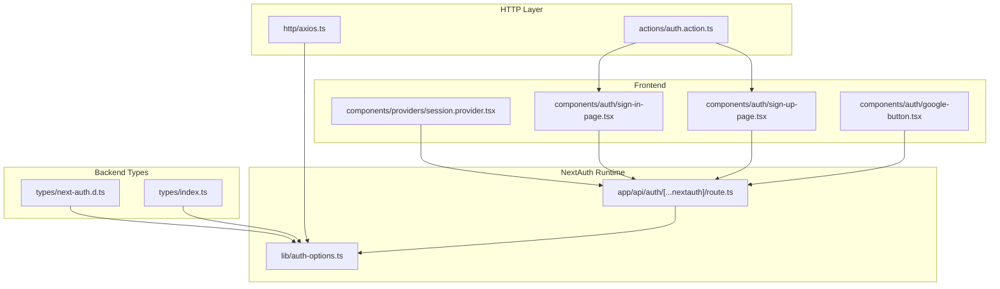
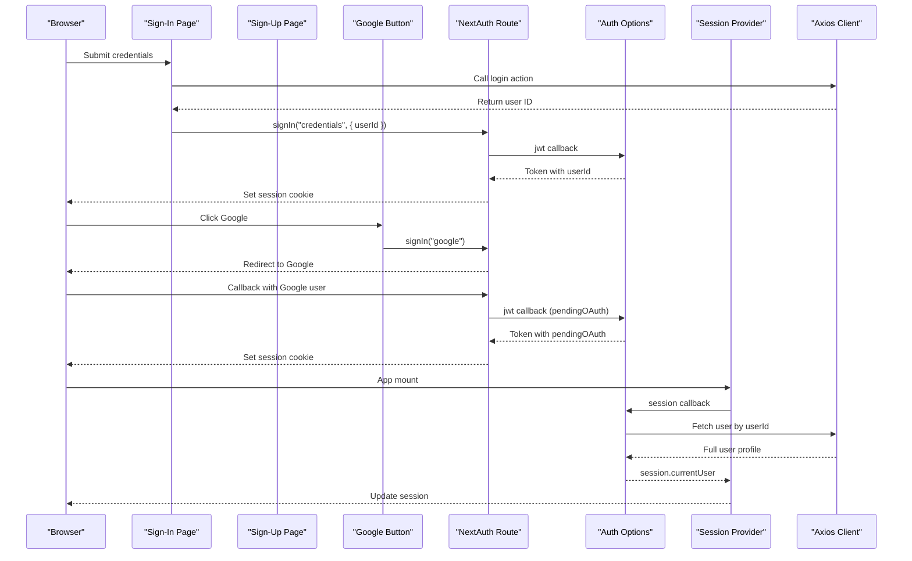
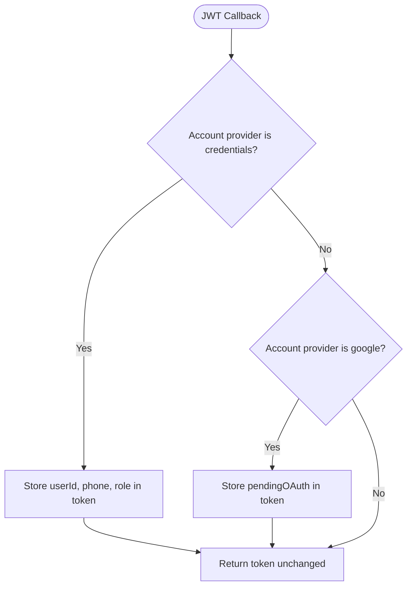
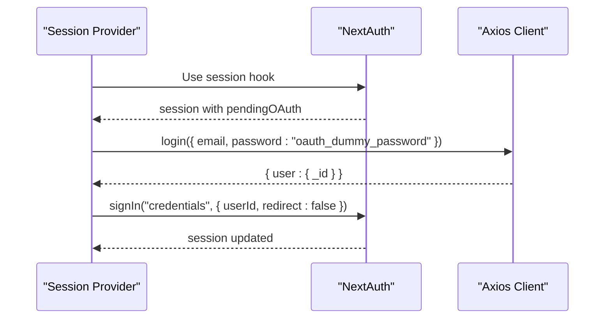
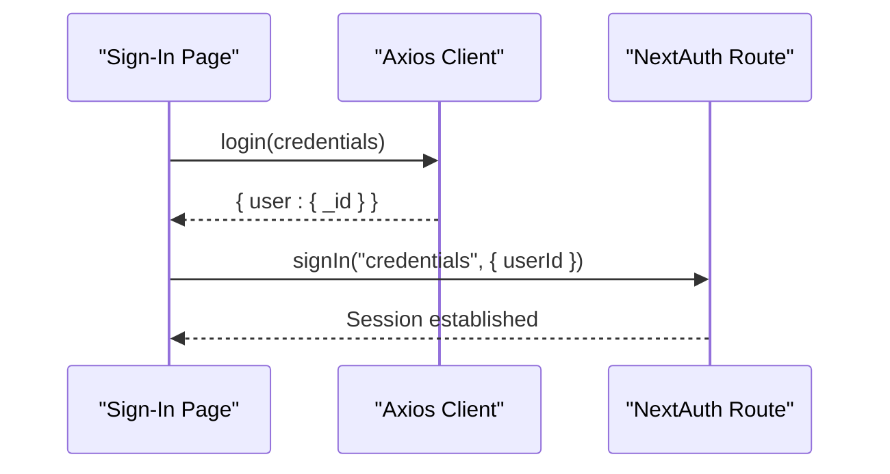
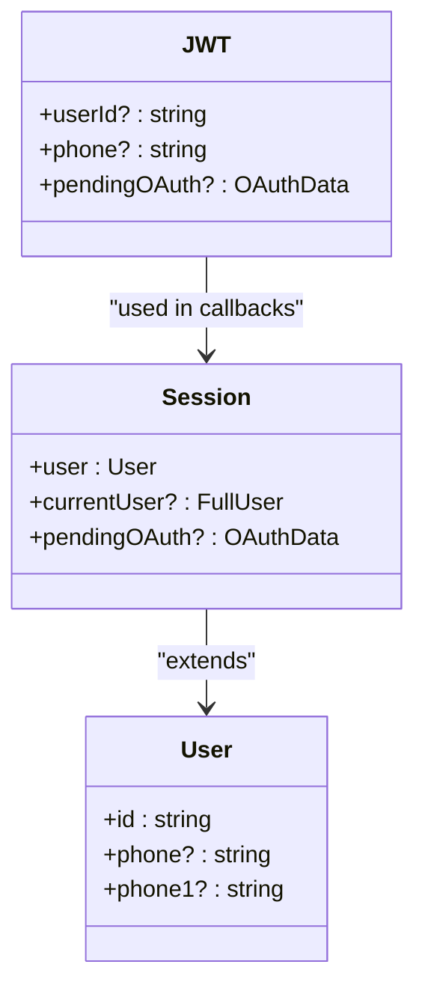
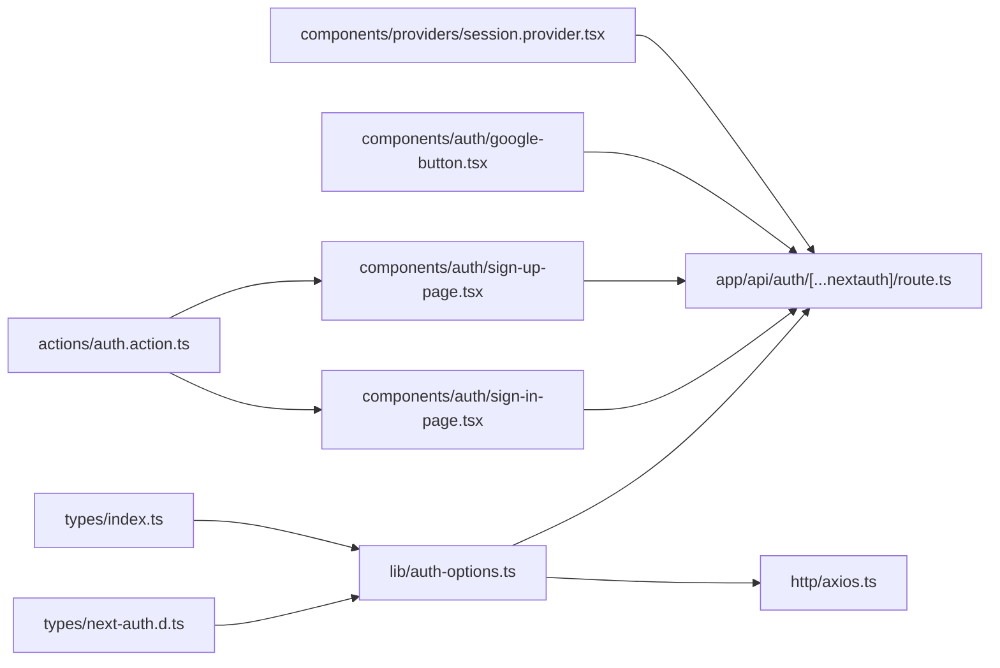

# NextAuth Configuration

<cite>
**Referenced Files in This Document**
- [lib/auth-options.ts](file://lib/auth-options.ts)
- [types/next-auth.d.ts](file://types/next-auth.d.ts)
- [types/index.ts](file://types/index.ts)
- [http/axios.ts](file://http/axios.ts)
- [actions/auth.action.ts](file://actions/auth.action.ts)
- [components/providers/session.provider.tsx](file://components/providers/session.provider.tsx)
- [components/auth/sign-in-page.tsx](file://components/auth/sign-in-page.tsx)
- [components/auth/sign-up-page.tsx](file://components/auth/sign-up-page.tsx)
- [components/auth/google-button.tsx](file://components/auth/google-button.tsx)
- [app/api/auth/[...nextauth]/route.ts](file://app/api/auth/[...nextauth]/route.ts)
- [package.json](file://package.json)
</cite>

## Table of Contents
1. [Introduction](#introduction)
2. [Project Structure](#project-structure)
3. [Core Components](#core-components)
4. [Architecture Overview](#architecture-overview)
5. [Detailed Component Analysis](#detailed-component-analysis)
6. [Dependency Analysis](#dependency-analysis)
7. [Performance Considerations](#performance-considerations)
8. [Troubleshooting Guide](#troubleshooting-guide)
9. [Conclusion](#conclusion)

## Introduction
This document explains the NextAuth v4 configuration used in Optim Bozor. It covers the authOptions object setup, provider configurations, cookie security settings, callback implementations, JWT and session strategies, environment variable requirements, and TypeScript type definitions for enhanced type safety. Practical examples demonstrate how credentials and Google OAuth providers integrate with the frontend and backend.

## Project Structure
The authentication system is centered around a single NextAuth configuration file and a Next.js route handler. Supporting components include:
- NextAuth route handler that mounts the authOptions
- Provider wrapper that auto-completes OAuth onboarding via credentials
- Frontend pages that trigger sign-in/sign-up flows using NextAuth and safe-action wrappers
- TypeScript declaration files that extend session and JWT types

**Diagram sources**
- [lib/auth-options.ts:1-128](file://lib/auth-options.ts#L1-L128)
- [app/api/auth/[...nextauth]/route.ts:1-6](file://app/api/auth/[...nextauth]/route.ts#L1-L6)
- [components/providers/session.provider.tsx:1-39](file://components/providers/session.provider.tsx#L1-L39)
- [components/auth/sign-in-page.tsx:1-178](file://components/auth/sign-in-page.tsx#L1-L178)
- [components/auth/sign-up-page.tsx:1-436](file://components/auth/sign-up-page.tsx#L1-L436)
- [components/auth/google-button.tsx:1-60](file://components/auth/google-button.tsx#L1-L60)
- [types/next-auth.d.ts:1-39](file://types/next-auth.d.ts#L1-L39)
- [types/index.ts:1-209](file://types/index.ts#L1-L209)
- [http/axios.ts:1-10](file://http/axios.ts#L1-L10)
- [actions/auth.action.ts:1-51](file://actions/auth.action.ts#L1-L51)

**Section sources**
- [lib/auth-options.ts:1-128](file://lib/auth-options.ts#L1-L128)
- [app/api/auth/[...nextauth]/route.ts:1-6](file://app/api/auth/[...nextauth]/route.ts#L1-L6)
- [components/providers/session.provider.tsx:1-39](file://components/providers/session.provider.tsx#L1-L39)
- [components/auth/sign-in-page.tsx:1-178](file://components/auth/sign-in-page.tsx#L1-L178)
- [components/auth/sign-up-page.tsx:1-436](file://components/auth/sign-up-page.tsx#L1-L436)
- [components/auth/google-button.tsx:1-60](file://components/auth/google-button.tsx#L1-L60)
- [types/next-auth.d.ts:1-39](file://types/next-auth.d.ts#L1-L39)
- [types/index.ts:1-209](file://types/index.ts#L1-L209)
- [http/axios.ts:1-10](file://http/axios.ts#L1-L10)
- [actions/auth.action.ts:1-51](file://actions/auth.action.ts#L1-L51)

## Core Components
- NextAuth route handler: Exposes NextAuth endpoints and mounts the authOptions configuration.
- Auth options: Defines providers, cookies, callbacks, session strategy, and secrets.
- Session provider: Wraps the app to enable automatic OAuth onboarding completion.
- Frontend pages: Trigger sign-in/sign-up flows using NextAuth and safe-action wrappers.
- Type declarations: Extend NextAuth session and JWT types for type-safe access.

**Section sources**
- [app/api/auth/[...nextauth]/route.ts:1-6](file://app/api/auth/[...nextauth]/route.ts#L1-L6)
- [lib/auth-options.ts:8-127](file://lib/auth-options.ts#L8-L127)
- [components/providers/session.provider.tsx:31-39](file://components/providers/session.provider.tsx#L31-L39)
- [components/auth/sign-in-page.tsx:39-52](file://components/auth/sign-in-page.tsx#L39-L52)
- [components/auth/sign-up-page.tsx:48-103](file://components/auth/sign-up-page.tsx#L48-L103)
- [types/next-auth.d.ts:4-38](file://types/next-auth.d.ts#L4-L38)

## Architecture Overview
The authentication flow integrates three main paths:
- Credentials provider: Authenticates via a server-side profile lookup and returns a normalized user object.
- Google provider: Performs OAuth and defers user provisioning to a subsequent credentials-based session activation.
- Session provider: Detects pending OAuth state and completes onboarding by signing in via credentials.

**Diagram sources**
- [components/auth/sign-in-page.tsx:39-52](file://components/auth/sign-in-page.tsx#L39-L52)
- [components/auth/sign-up-page.tsx:48-103](file://components/auth/sign-up-page.tsx#L48-L103)
- [components/auth/google-button.tsx:17-21](file://components/auth/google-button.tsx#L17-L21)
- [app/api/auth/[...nextauth]/route.ts:1-6](file://app/api/auth/[...nextauth]/route.ts#L1-L6)
- [lib/auth-options.ts:69-122](file://lib/auth-options.ts#L69-L122)
- [components/providers/session.provider.tsx:7-27](file://components/providers/session.provider.tsx#L7-L27)
- [http/axios.ts:5-9](file://http/axios.ts#L5-L9)

## Detailed Component Analysis

### NextAuth Configuration (authOptions)
- Providers
  - Credentials provider: Accepts a user identifier, performs a profile lookup, and normalizes the user object for downstream token/session handling.
  - Google provider: Configured with client ID and secret from environment variables.
- Cookies
  - Session token, callback URL, CSRF token, state, and PKCE code verifier are configured with strict security attributes (HttpOnly, Secure, SameSite, path).
- Callbacks
  - JWT callback: Stores userId, phone, role for credentials; stores pending OAuth data for Google.
  - Session callback: Resolves a full user profile from the backend when a userId exists; falls back to token-derived phone; propagates pending OAuth data.
- Session and secrets
  - Session strategy set to JWT.
  - JWT secret sourced from NEXT_PUBLIC_JWT_SECRET; general NextAuth secret sourced from NEXT_AUTH_SECRET.

**Diagram sources**
- [lib/auth-options.ts:69-85](file://lib/auth-options.ts#L69-L85)

**Section sources**
- [lib/auth-options.ts:8-127](file://lib/auth-options.ts#L8-L127)

### Session Provider and OAuth Onboarding
- Purpose: After Google OAuth, the session holds pending OAuth data. The provider triggers a credentials sign-in using a dummy password and the resolved user ID, then refreshes the session to populate currentUser.
- Behavior: Watches session pendingOAuth and currentUser; on change, calls the login action and signs in via credentials.

**Diagram sources**
- [components/providers/session.provider.tsx:7-27](file://components/providers/session.provider.tsx#L7-L27)
- [actions/auth.action.ts:13-18](file://actions/auth.action.ts#L13-L18)

**Section sources**
- [components/providers/session.provider.tsx:1-39](file://components/providers/session.provider.tsx#L1-L39)
- [actions/auth.action.ts:13-18](file://actions/auth.action.ts#L13-L18)

### Frontend Authentication Pages
- Sign-in page
  - Validates credentials, calls the login action, and triggers NextAuth credentials sign-in with the returned user ID.
- Sign-up page
  - Sends OTP, verifies OTP, registers the user, and triggers NextAuth credentials sign-in with the new user ID.
- Google button
  - Initiates Google OAuth with a callback URL determined by the current route.

**Diagram sources**
- [components/auth/sign-in-page.tsx:39-52](file://components/auth/sign-in-page.tsx#L39-L52)
- [components/auth/sign-up-page.tsx:48-103](file://components/auth/sign-up-page.tsx#L48-L103)
- [components/auth/google-button.tsx:17-21](file://components/auth/google-button.tsx#L17-L21)

**Section sources**
- [components/auth/sign-in-page.tsx:1-178](file://components/auth/sign-in-page.tsx#L1-L178)
- [components/auth/sign-up-page.tsx:1-436](file://components/auth/sign-up-page.tsx#L1-L436)
- [components/auth/google-button.tsx:1-60](file://components/auth/google-button.tsx#L1-L60)

### TypeScript Integration
- Extended Session interface: Adds optional currentUser and pendingOAuth fields, and augments User with id, phone, phone1, and role.
- Extended JWT interface: Adds userId, phone, and pendingOAuth fields for type-safe token handling.

**Diagram sources**
- [types/next-auth.d.ts:4-38](file://types/next-auth.d.ts#L4-L38)

**Section sources**
- [types/next-auth.d.ts:1-39](file://types/next-auth.d.ts#L1-L39)
- [types/index.ts:54-73](file://types/index.ts#L54-L73)

## Dependency Analysis
- NextAuth runtime depends on:
  - Auth options for provider, cookie, callback, session, and secret configuration.
  - Axios client for fetching user profiles during session resolution.
  - Safe-action wrappers for login/register/OTP flows.
- Frontend pages depend on:
  - NextAuth client hooks for sign-in/sign-out.
  - Action clients for server interactions.
- Type declarations extend NextAuth’s built-in types to support custom fields.

**Diagram sources**
- [lib/auth-options.ts:1-128](file://lib/auth-options.ts#L1-L128)
- [app/api/auth/[...nextauth]/route.ts:1-6](file://app/api/auth/[...nextauth]/route.ts#L1-L6)
- [http/axios.ts:1-10](file://http/axios.ts#L1-L10)
- [actions/auth.action.ts:1-51](file://actions/auth.action.ts#L1-L51)
- [components/auth/sign-in-page.tsx:1-178](file://components/auth/sign-in-page.tsx#L1-L178)
- [components/auth/sign-up-page.tsx:1-436](file://components/auth/sign-up-page.tsx#L1-L436)
- [components/auth/google-button.tsx:1-60](file://components/auth/google-button.tsx#L1-L60)
- [components/providers/session.provider.tsx:1-39](file://components/providers/session.provider.tsx#L1-L39)
- [types/next-auth.d.ts:1-39](file://types/next-auth.d.ts#L1-L39)
- [types/index.ts:1-209](file://types/index.ts#L1-L209)

**Section sources**
- [package.json:39-39](file://package.json#L39-L39)
- [lib/auth-options.ts:1-128](file://lib/auth-options.ts#L1-L128)
- [http/axios.ts:1-10](file://http/axios.ts#L1-L10)
- [actions/auth.action.ts:1-51](file://actions/auth.action.ts#L1-L51)
- [components/auth/sign-in-page.tsx:1-178](file://components/auth/sign-in-page.tsx#L1-L178)
- [components/auth/sign-up-page.tsx:1-436](file://components/auth/sign-up-page.tsx#L1-L436)
- [components/auth/google-button.tsx:1-60](file://components/auth/google-button.tsx#L1-L60)
- [components/providers/session.provider.tsx:1-39](file://components/providers/session.provider.tsx#L1-L39)
- [types/next-auth.d.ts:1-39](file://types/next-auth.d.ts#L1-L39)
- [types/index.ts:1-209](file://types/index.ts#L1-L209)

## Performance Considerations
- Session strategy set to JWT reduces server-side session storage overhead.
- Cookie security settings (HttpOnly, Secure, SameSite) improve protection against XSS and CSRF.
- Using a lightweight axios client with a reasonable timeout avoids blocking UI threads.
- Avoid unnecessary re-fetches by leveraging token-derived fallbacks in the session callback.

## Troubleshooting Guide
- Missing environment variables
  - Ensure NEXT_PUBLIC_JWT_SECRET and NEXT_AUTH_SECRET are set for JWT and NextAuth respectively.
  - Ensure GOOGLE_CLIENT_ID and GOOGLE_CLIENT_SECRET are set for Google OAuth.
- Cookie issues
  - Verify cookie names and options align with your deployment domain and HTTPS requirements.
  - Confirm SameSite and Secure flags match your production environment.
- Session not updating after OAuth
  - Check that the session provider detects pendingOAuth and triggers credentials sign-in.
  - Ensure the login action returns a user ID and that the session callback fetches the full profile.
- Type errors
  - Confirm extended session and JWT types are declared and imported by the application.

**Section sources**
- [lib/auth-options.ts:46-67](file://lib/auth-options.ts#L46-L67)
- [lib/auth-options.ts:124-127](file://lib/auth-options.ts#L124-L127)
- [components/providers/session.provider.tsx:7-27](file://components/providers/session.provider.tsx#L7-L27)
- [types/next-auth.d.ts:4-38](file://types/next-auth.d.ts#L4-L38)

## Conclusion
Optim Bozor’s NextAuth v4 configuration combines a credentials provider with a Google OAuth provider, secured by robust cookie policies and JWT-based sessions. The session provider automates OAuth onboarding by seamlessly transitioning to credentials-based sessions. TypeScript declarations ensure type safety across custom token and session fields. Together, these pieces deliver a secure, extensible authentication system.