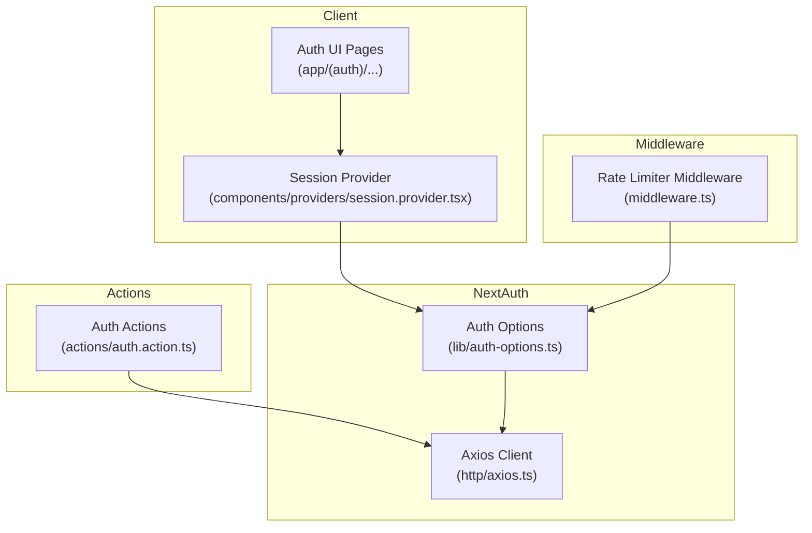
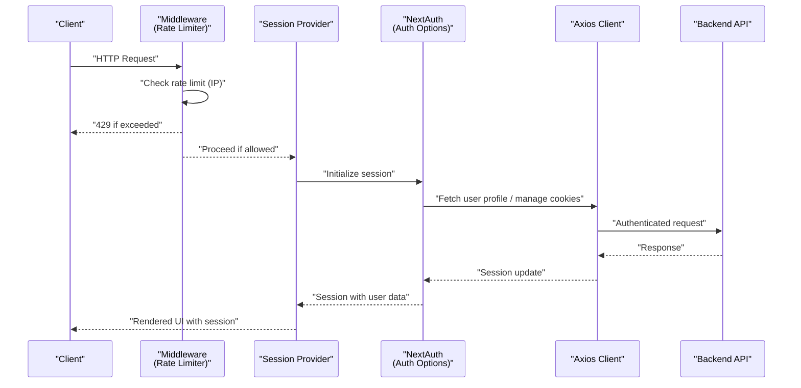
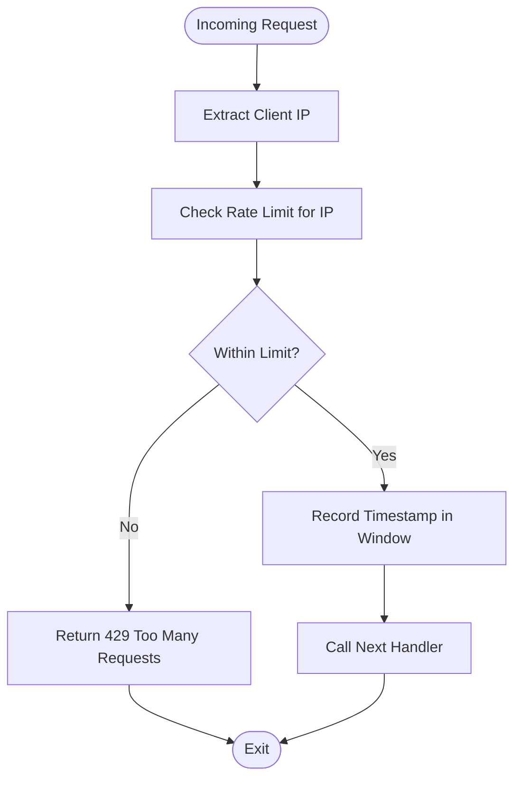
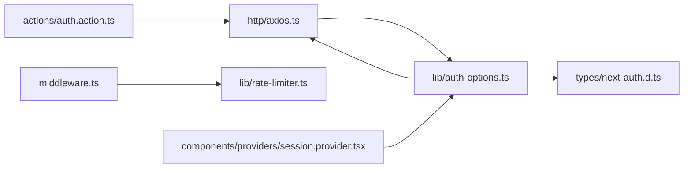

# Security Considerations

<cite>
**Referenced Files in This Document**
- [auth.action.ts](file://actions/auth.action.ts)
- [auth-options.ts](file://lib/auth-options.ts)
- [middleware.ts](file://middleware.ts)
- [rate-limiter.ts](file://lib/rate-limiter.ts)
- [session.provider.tsx](file://components/providers/session.provider.tsx)
- [axios.ts](file://http/axios.ts)
- [generate-token.ts](file://lib/generate-token.ts)
- [next-auth.d.ts](file://types/next-auth.d.ts)
</cite>

## Table of Contents
1. [Introduction](#introduction)
2. [Project Structure](#project-structure)
3. [Core Components](#core-components)
4. [Architecture Overview](#architecture-overview)
5. [Detailed Component Analysis](#detailed-component-analysis)
6. [Dependency Analysis](#dependency-analysis)
7. [Performance Considerations](#performance-considerations)
8. [Troubleshooting Guide](#troubleshooting-guide)
9. [Conclusion](#conclusion)

## Introduction
This document provides a comprehensive security analysis of Optim Bozor’s authentication system. It focuses on cookie security configurations, JWT token handling, secret management, rate limiting, request filtering, middleware integration, OAuth security considerations, CSRF protection, and session hijacking prevention. Practical examples of secure authentication flows and token validation are included to guide implementation and remediation.

## Project Structure
Optim Bozor integrates NextAuth for authentication and a lightweight rate limiter at the middleware level. Authentication actions proxy requests to backend endpoints, while Axios is configured with credentials to support cookie-based sessions. The session provider coordinates OAuth transitions and ensures session updates.

**Diagram sources**
- [session.provider.tsx:1-39](file://components/providers/session.provider.tsx#L1-L39)
- [middleware.ts:1-26](file://middleware.ts#L1-L26)
- [auth-options.ts:1-128](file://lib/auth-options.ts#L1-L128)
- [axios.ts:1-10](file://http/axios.ts#L1-L10)
- [auth.action.ts:1-51](file://actions/auth.action.ts#L1-L51)

**Section sources**
- [session.provider.tsx:1-39](file://components/providers/session.provider.tsx#L1-L39)
- [middleware.ts:1-26](file://middleware.ts#L1-L26)
- [auth-options.ts:1-128](file://lib/auth-options.ts#L1-L128)
- [axios.ts:1-10](file://http/axios.ts#L1-L10)
- [auth.action.ts:1-51](file://actions/auth.action.ts#L1-L51)

## Core Components
- Cookie security configuration for NextAuth-managed cookies (HttpOnly, Secure, SameSite, and Host-only naming in production).
- JWT strategy configuration and secret management for both NextAuth and a custom token generator.
- Middleware-based rate limiting with IP-based sliding window.
- OAuth integration with Google and internal credentials provider.
- Session provider orchestration for seamless OAuth-to-credentials transition.

**Section sources**
- [auth-options.ts:46-67](file://lib/auth-options.ts#L46-L67)
- [auth-options.ts:124-127](file://lib/auth-options.ts#L124-L127)
- [generate-token.ts:1-11](file://lib/generate-token.ts#L1-L11)
- [rate-limiter.ts:1-29](file://lib/rate-limiter.ts#L1-L29)
- [session.provider.tsx:1-39](file://components/providers/session.provider.tsx#L1-L39)

## Architecture Overview
The authentication flow combines NextAuth with custom actions and middleware. Cookies are managed by NextAuth with strict defaults, while a custom JWT token generator is available for short-lived tokens. Requests are rate-limited globally via middleware.

**Diagram sources**
- [middleware.ts:9-20](file://middleware.ts#L9-L20)
- [session.provider.tsx:31-38](file://components/providers/session.provider.tsx#L31-L38)
- [auth-options.ts:69-122](file://lib/auth-options.ts#L69-L122)
- [axios.ts:5-9](file://http/axios.ts#L5-L9)
- [auth.action.ts:13-39](file://actions/auth.action.ts#L13-L39)

## Detailed Component Analysis

### Cookie Security Configuration
NextAuth manages authentication cookies with explicit HttpOnly, Secure, SameSite, and Host-only naming in production. These settings mitigate XSS and CSRF risks and enforce secure transport.

- sessionToken: HttpOnly, Secure (production), SameSite lax, path /
- callbackUrl: Secure (production), SameSite lax, path /
- csrfToken: Secure (production), SameSite lax, path /
- state: HttpOnly, Secure (production), SameSite lax, path /
- pkceCodeVerifier: HttpOnly, Secure (production), SameSite lax, path /

Host-only cookie names are used in production to prevent subdomain leakage.

**Section sources**
- [auth-options.ts:46-67](file://lib/auth-options.ts#L46-L67)

### JWT Token Security and Secret Management
Two JWT-related mechanisms are present:
- NextAuth JWT strategy with secrets configured for both JWT and NextAuth core.
- A custom token generator for short-lived tokens.

Recommendations:
- Use a strong, random secret for JWT signing and store it in environment variables.
- Align the JWT secret with NextAuth’s secret for unified signing.
- Limit token lifetime aggressively (e.g., minutes) and avoid storing sensitive data in JWT payloads.
- Rotate secrets periodically and invalidate active sessions during rotation.

**Section sources**
- [auth-options.ts:124-127](file://lib/auth-options.ts#L124-L127)
- [generate-token.ts:5-10](file://lib/generate-token.ts#L5-L10)

### Rate Limiting Implementation
A sliding-window rate limiter tracks per-IP request counts within a fixed time window. Exceeding the threshold returns a 429 response.

- Window size: 60 seconds
- Max requests per window: 300
- Storage: In-memory Map (not persistent across processes)

Operational notes:
- The middleware applies to all routes except static assets and Next.js internals.
- Consider externalizing storage (e.g., Redis) for distributed environments.

**Diagram sources**
- [middleware.ts:4-20](file://middleware.ts#L4-L20)
- [rate-limiter.ts:9-28](file://lib/rate-limiter.ts#L9-L28)

**Section sources**
- [middleware.ts:1-26](file://middleware.ts#L1-L26)
- [rate-limiter.ts:1-29](file://lib/rate-limiter.ts#L1-L29)

### Request Filtering and Middleware Integration
The middleware extracts the client IP from x-forwarded-for and enforces rate limits globally. Matching configuration excludes static assets and internal Next.js paths.

- IP extraction: x-forwarded-for header, first value
- Response: JSON body with a standardized message on violation
- Matcher: dynamic path pattern excluding static assets and Next.js internals

**Section sources**
- [middleware.ts:4-25](file://middleware.ts#L4-L25)

### OAuth Security Considerations
Google OAuth is integrated via NextAuth. Pending OAuth state is stored in the session and resolved by transitioning to credentials-based login.

- Google provider configured with client ID and secret from environment variables.
- Pending OAuth data is attached to the session and used to trigger an internal login flow.
- After successful internal login, the session switches to credentials provider.

CSRF and state protection:
- NextAuth sets a state cookie and a CSRF token cookie with SameSite lax and Secure in production.
- Ensure HTTPS termination occurs behind a trusted proxy to preserve x-forwarded-for and cookie security.

**Section sources**
- [auth-options.ts:40-44](file://lib/auth-options.ts#L40-L44)
- [session.provider.tsx:7-30](file://components/providers/session.provider.tsx#L7-L30)
- [auth-options.ts:46-67](file://lib/auth-options.ts#L46-L67)

### Session Hijacking Prevention Measures
- HttpOnly cookies reduce exposure to client-side attacks.
- Secure flag (production) ensures cookies are transmitted over HTTPS.
- Host-only naming in production mitigates cross-subdomain theft.
- Session refresh and update logic in the provider help maintain a consistent session state after OAuth resolution.

**Section sources**
- [auth-options.ts:46-67](file://lib/auth-options.ts#L46-L67)
- [session.provider.tsx:31-38](file://components/providers/session.provider.tsx#L31-L38)

### Practical Secure Authentication Flow Examples
Below are secure flow examples mapped to the codebase. Replace placeholders with environment variables and backend endpoints.

- Login flow
  - Client submits credentials via an action.
  - Action posts to the backend login endpoint.
  - Backend responds with session cookies set by NextAuth.
  - Client reads session via NextAuth hooks.

- Registration flow
  - Client submits registration data via an action.
  - Action posts to the backend register endpoint.
  - Backend validates and creates user, then returns success.

- OTP-based flows
  - Send OTP: action posts to the OTP send endpoint.
  - Verify OTP: action posts to the OTP verify endpoint.
  - On success, proceed to finalize registration or login.

- OAuth login
  - Redirect to Google OAuth via NextAuth.
  - On callback, store pending OAuth data in session.
  - Trigger internal login and switch to credentials provider.

- Token validation
  - For custom short-lived tokens, validate signature and expiration using the configured secret.
  - Avoid embedding sensitive data in JWT payloads.

- CSRF protection
  - Rely on NextAuth-managed CSRF token and state cookies.
  - Ensure SameSite and Secure flags are enabled in production.

- Session hijacking prevention
  - Enforce HttpOnly and Secure flags for all session cookies.
  - Use Host-only naming in production.
  - Rotate secrets and invalidate sessions during key changes.

**Section sources**
- [auth.action.ts:13-50](file://actions/auth.action.ts#L13-L50)
- [auth-options.ts:69-122](file://lib/auth-options.ts#L69-L122)
- [generate-token.ts:5-10](file://lib/generate-token.ts#L5-L10)
- [axios.ts:5-9](file://http/axios.ts#L5-L9)

## Dependency Analysis
The authentication stack depends on NextAuth for session and cookie management, Axios for authenticated requests, and a middleware for rate limiting. The session provider bridges OAuth and credentials flows.

**Diagram sources**
- [auth.action.ts:1-51](file://actions/auth.action.ts#L1-L51)
- [axios.ts:1-10](file://http/axios.ts#L1-L10)
- [auth-options.ts:1-128](file://lib/auth-options.ts#L1-L128)
- [rate-limiter.ts:1-29](file://lib/rate-limiter.ts#L1-L29)
- [session.provider.tsx:1-39](file://components/providers/session.provider.tsx#L1-L39)
- [next-auth.d.ts:1-39](file://types/next-auth.d.ts#L1-L39)

**Section sources**
- [auth.action.ts:1-51](file://actions/auth.action.ts#L1-L51)
- [axios.ts:1-10](file://http/axios.ts#L1-L10)
- [auth-options.ts:1-128](file://lib/auth-options.ts#L1-L128)
- [rate-limiter.ts:1-29](file://lib/rate-limiter.ts#L1-L29)
- [session.provider.tsx:1-39](file://components/providers/session.provider.tsx#L1-L39)
- [next-auth.d.ts:1-39](file://types/next-auth.d.ts#L1-L39)

## Performance Considerations
- Rate limiter uses an in-memory Map; for horizontal scaling, migrate to a distributed cache (e.g., Redis).
- Keep rate limit windows and thresholds aligned with traffic patterns to minimize false positives.
- Avoid heavy synchronous work in middleware; offload to asynchronous tasks if needed.

## Troubleshooting Guide
Common issues and resolutions:
- 429 Too Many Requests
  - Cause: Exceeded request threshold per IP.
  - Resolution: Reduce client-side polling, increase window size/threshold, or deploy a distributed rate limiter.

- Cookie Not Set or Lost
  - Cause: Missing Secure flag in development, incorrect SameSite configuration, or missing withCredentials.
  - Resolution: Enable HTTPS locally for Secure cookies, verify SameSite and path settings, confirm Axios withCredentials is true.

- OAuth Callback Issues
  - Cause: Misconfigured provider credentials or mismatched state.
  - Resolution: Verify GOOGLE_CLIENT_ID and GOOGLE_CLIENT_SECRET, ensure cookies are accepted, and check callback URL consistency.

- Session Not Updating After OAuth
  - Cause: Pending OAuth not resolved or internal login failure.
  - Resolution: Confirm session provider logic triggers internal login and updates the session.

**Section sources**
- [middleware.ts:12-17](file://middleware.ts#L12-L17)
- [auth-options.ts:46-67](file://lib/auth-options.ts#L46-L67)
- [axios.ts:7-9](file://http/axios.ts#L7-L9)
- [session.provider.tsx:10-27](file://components/providers/session.provider.tsx#L10-L27)

## Conclusion
Optim Bozor’s authentication system leverages NextAuth for robust cookie and session management, with production-grade cookie attributes and OAuth integration. A middleware-based rate limiter provides basic DDoS mitigation, while a custom JWT generator supports short-lived tokens. To strengthen security, align JWT secrets with NextAuth, externalize rate limiting state, and rigorously test cookie behavior under HTTPS and SameSite constraints.