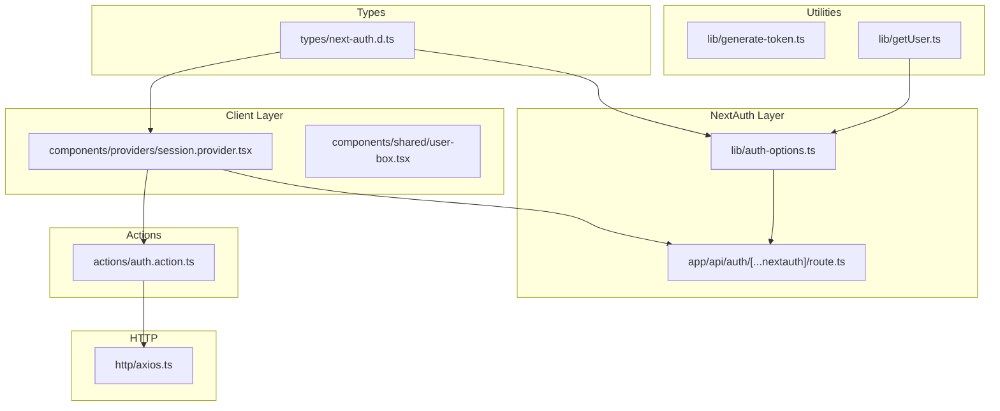
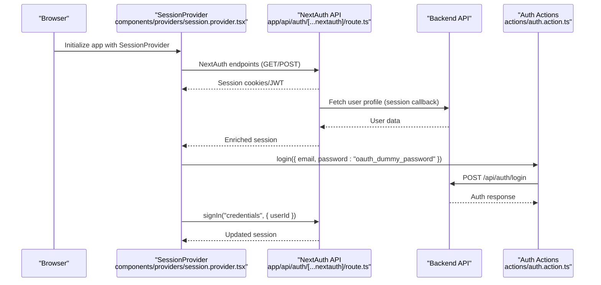
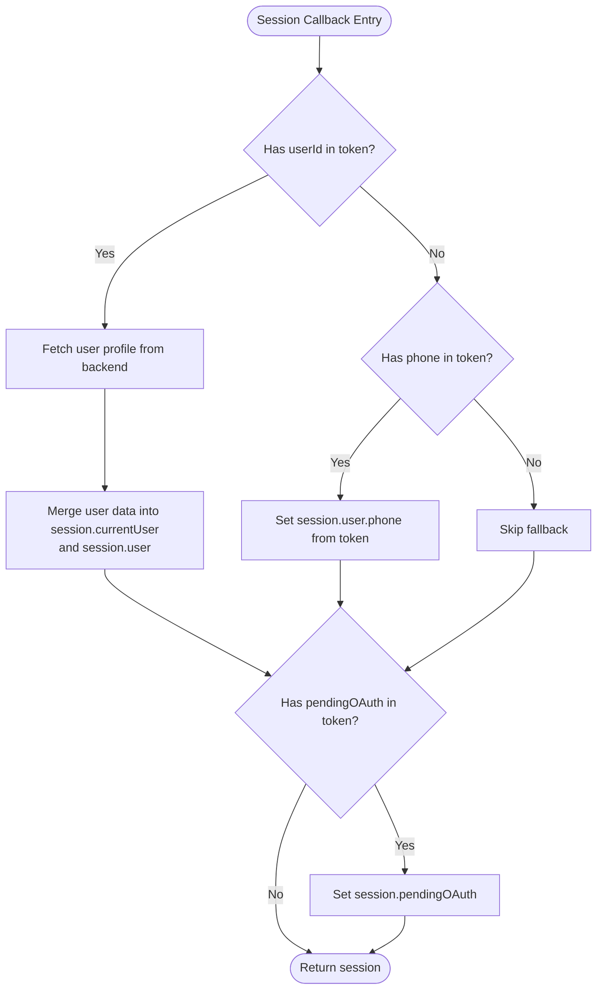
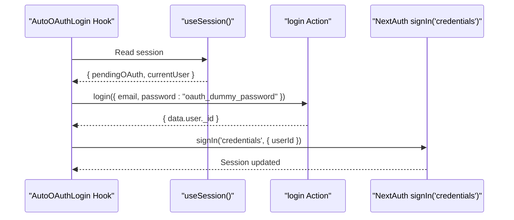
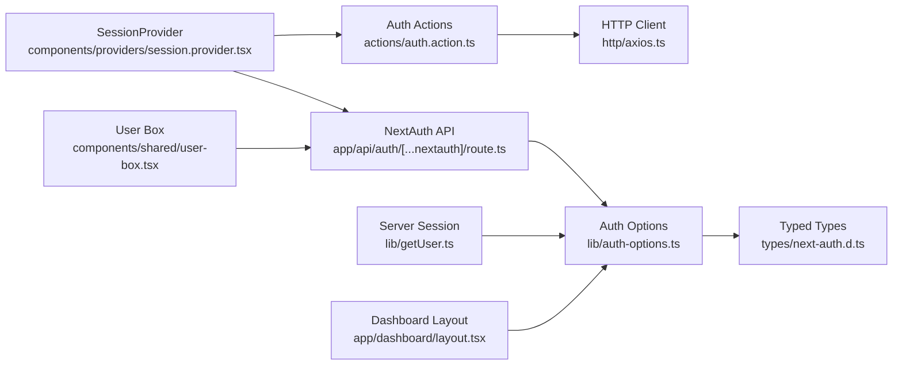

# Session Management

<cite>
**Referenced Files in This Document**
- [lib/auth-options.ts](file://lib/auth-options.ts)
- [app/api/auth/[...nextauth]/route.ts](file://app/api/auth/[...nextauth]/route.ts)
- [components/providers/session.provider.tsx](file://components/providers/session.provider.tsx)
- [actions/auth.action.ts](file://actions/auth.action.ts)
- [types/next-auth.d.ts](file://types/next-auth.d.ts)
- [http/axios.ts](file://http/axios.ts)
- [lib/generate-token.ts](file://lib/generate-token.ts)
- [lib/getUser.ts](file://lib/getUser.ts)
- [middleware.ts](file://middleware.ts)
- [app/dashboard/layout.tsx](file://app/dashboard/layout.tsx)
- [components/shared/user-box.tsx](file://components/shared/user-box.tsx)
</cite>

## Table of Contents
1. [Introduction](#introduction)
2. [Project Structure](#project-structure)
3. [Core Components](#core-components)
4. [Architecture Overview](#architecture-overview)
5. [Detailed Component Analysis](#detailed-component-analysis)
6. [Dependency Analysis](#dependency-analysis)
7. [Performance Considerations](#performance-considerations)
8. [Troubleshooting Guide](#troubleshooting-guide)
9. [Conclusion](#conclusion)
10. [Appendices](#appendices)

## Introduction
This document explains Optim Bozor’s session management system built on NextAuth.js. It covers the session provider setup, JWT token handling, session persistence, and the session callbacks that populate session data and synchronize with the backend. It also documents the OAuth auto-login flow, session strategy configuration, token refresh behavior, and security measures. Practical examples demonstrate how to use the session provider, protect routes, and manage session state across the application.

## Project Structure
The session management spans several layers:
- NextAuth configuration defines providers, cookies, callbacks, and session strategy.
- The NextAuth API route exposes NextAuth endpoints.
- A client-side session provider wraps the app and orchestrates OAuth auto-login.
- Actions handle backend authentication and OTP flows.
- Type declarations extend NextAuth types for typed session and JWT.
- Utilities and middleware support HTTP communication and rate limiting.

**Diagram sources**
- [lib/auth-options.ts:1-128](file://lib/auth-options.ts#L1-L128)
- [app/api/auth/[...nextauth]/route.ts:1-6](file://app/api/auth/[...nextauth]/route.ts#L1-L6)
- [components/providers/session.provider.tsx:1-39](file://components/providers/session.provider.tsx#L1-L39)
- [actions/auth.action.ts:1-51](file://actions/auth.action.ts#L1-L51)
- [types/next-auth.d.ts:1-39](file://types/next-auth.d.ts#L1-L39)
- [http/axios.ts:1-10](file://http/axios.ts#L1-L10)
- [lib/generate-token.ts:1-11](file://lib/generate-token.ts#L1-L11)
- [lib/getUser.ts:1-10](file://lib/getUser.ts#L1-L10)

**Section sources**
- [lib/auth-options.ts:1-128](file://lib/auth-options.ts#L1-L128)
- [app/api/auth/[...nextauth]/route.ts:1-6](file://app/api/auth/[...nextauth]/route.ts#L1-L6)
- [components/providers/session.provider.tsx:1-39](file://components/providers/session.provider.tsx#L1-L39)
- [actions/auth.action.ts:1-51](file://actions/auth.action.ts#L1-L51)
- [types/next-auth.d.ts:1-39](file://types/next-auth.d.ts#L1-L39)
- [http/axios.ts:1-10](file://http/axios.ts#L1-L10)
- [lib/generate-token.ts:1-11](file://lib/generate-token.ts#L1-L11)
- [lib/getUser.ts:1-10](file://lib/getUser.ts#L1-L10)

## Core Components
- NextAuth configuration: Defines providers (credentials and Google), cookie policies, JWT and session callbacks, and session strategy.
- NextAuth API route: Exposes NextAuth endpoints.
- Client session provider: Wraps the app, manages OAuth auto-login, and updates session state.
- Typed session and JWT: Extends NextAuth types for strongly typed session and JWT payloads.
- Backend actions: Handle login, registration, OTP send/verify, and OAuth login.
- HTTP client: Configures base URL, credentials, and timeout.
- Utilities: Token generation and server-side session retrieval.

Key responsibilities:
- Populate session with user profile data from the backend during the session callback.
- Persist session using JWT strategy with secure cookie settings.
- Support OAuth auto-login by transitioning from pending OAuth to credentials-based session.
- Provide typed session access on both client and server.

**Section sources**
- [lib/auth-options.ts:8-127](file://lib/auth-options.ts#L8-L127)
- [app/api/auth/[...nextauth]/route.ts:1-6](file://app/api/auth/[...nextauth]/route.ts#L1-L6)
- [components/providers/session.provider.tsx:7-30](file://components/providers/session.provider.tsx#L7-L30)
- [types/next-auth.d.ts:4-38](file://types/next-auth.d.ts#L4-L38)
- [actions/auth.action.ts:13-51](file://actions/auth.action.ts#L13-L51)
- [http/axios.ts:5-9](file://http/axios.ts#L5-L9)
- [lib/generate-token.ts:5-10](file://lib/generate-token.ts#L5-L10)
- [lib/getUser.ts:4-7](file://lib/getUser.ts#L4-L7)

## Architecture Overview
The session lifecycle integrates client-side and server-side components:
- Client initializes NextAuth session provider and listens for session changes.
- On successful OAuth login, a temporary pending OAuth state is stored in the JWT.
- The client triggers an auto-login action to exchange the pending OAuth for a credentials-based session.
- The session callback fetches the full user profile from the backend and enriches the session.
- The server uses the same NextAuth configuration to validate sessions and enforce protection.

**Diagram sources**
- [components/providers/session.provider.tsx:7-30](file://components/providers/session.provider.tsx#L7-L30)
- [app/api/auth/[...nextauth]/route.ts:1-6](file://app/api/auth/[...nextauth]/route.ts#L1-L6)
- [actions/auth.action.ts:13-18](file://actions/auth.action.ts#L13-L18)

## Detailed Component Analysis

### NextAuth Configuration and Callbacks
- Providers:
  - Credentials provider: Authorizes by fetching a user profile by ID from the backend and returning a normalized user object.
  - Google provider: Uses configured client ID and secret for OAuth.
- Cookies:
  - Secure, HttpOnly, SameSite cookies for session tokens, CSRF, state, and PKCE verifier.
- JWT callback:
  - Stores user identifiers and roles for credentials login.
  - Records pending OAuth data for Google login.
- Session callback:
  - Loads the full user profile from the backend using the user ID from the JWT.
  - Populates session.currentUser and session.user fields.
  - Falls back to token phone if needed.
  - Propagates pending OAuth data to the session.
- Strategy and secrets:
  - Session strategy set to JWT.
  - JWT and NextAuth secrets configured from environment variables.

**Diagram sources**
- [lib/auth-options.ts:87-121](file://lib/auth-options.ts#L87-L121)

**Section sources**
- [lib/auth-options.ts:9-44](file://lib/auth-options.ts#L9-L44)
- [lib/auth-options.ts:46-67](file://lib/auth-options.ts#L46-L67)
- [lib/auth-options.ts:69-122](file://lib/auth-options.ts#L69-L122)
- [lib/auth-options.ts:124-127](file://lib/auth-options.ts#L124-L127)

### NextAuth API Route
- Exposes NextAuth handlers for GET and POST to the [...nextauth] route.
- Uses the shared NextAuth configuration.

**Section sources**
- [app/api/auth/[...nextauth]/route.ts:1-6](file://app/api/auth/[...nextauth]/route.ts#L1-L6)

### Client Session Provider and OAuth Auto-Login
- Wraps the app with NextAuth SessionProvider.
- Monitors session pendingOAuth and currentUser.
- Triggers an action to log in using a dummy password for the pending OAuth email.
- On success, signs in with credentials provider using the returned user ID and updates the session.

**Diagram sources**
- [components/providers/session.provider.tsx:7-30](file://components/providers/session.provider.tsx#L7-L30)
- [actions/auth.action.ts:13-18](file://actions/auth.action.ts#L13-L18)

**Section sources**
- [components/providers/session.provider.tsx:31-39](file://components/providers/session.provider.tsx#L31-L39)
- [components/providers/session.provider.tsx:7-30](file://components/providers/session.provider.tsx#L7-L30)

### Typed Session and JWT Extensions
- Extends NextAuth Session and User interfaces to include user identifiers, phone numbers, roles, and optional pending OAuth data.
- Extends JWT payload with userId, phone, and pendingOAuth fields.

**Section sources**
- [types/next-auth.d.ts:4-38](file://types/next-auth.d.ts#L4-L38)

### Backend Authentication Actions
- Login, register, OTP send/verify, and OAuth login actions wrap HTTP calls to backend endpoints.
- Responses are serialized to ensure compatibility with Next.js server actions.

**Section sources**
- [actions/auth.action.ts:13-51](file://actions/auth.action.ts#L13-L51)

### HTTP Client Configuration
- Base URL from environment variable.
- Enables credentials to support cookie-based session storage.
- Includes a timeout for robustness.

**Section sources**
- [http/axios.ts:5-9](file://http/axios.ts#L5-L9)

### Token Generation Utility
- Generates short-lived JWT tokens for internal use with a server action.
- Uses the same JWT secret configured for NextAuth.

**Section sources**
- [lib/generate-token.ts:5-10](file://lib/generate-token.ts#L5-L10)

### Server-Side Session Retrieval
- Provides a server utility to fetch the current session on the server using the same NextAuth configuration.

**Section sources**
- [lib/getUser.ts:4-7](file://lib/getUser.ts#L4-L7)

### Protected Routes and Dashboard Layout
- Dashboard layout fetches the server session and redirects unauthenticated users to the sign-in page.
- Demonstrates server-side session usage for route protection.

**Section sources**
- [app/dashboard/layout.tsx:11-14](file://app/dashboard/layout.tsx#L11-L14)

### User Box and Logout
- Client-side user box displays user info and triggers logout via NextAuth.
- Logout redirects to the sign-in page.

**Section sources**
- [components/shared/user-box.tsx:104-108](file://components/shared/user-box.tsx#L104-L108)

## Dependency Analysis
The following diagram shows how components depend on each other to implement session management:

**Diagram sources**
- [components/providers/session.provider.tsx:1-39](file://components/providers/session.provider.tsx#L1-L39)
- [app/api/auth/[...nextauth]/route.ts:1-6](file://app/api/auth/[...nextauth]/route.ts#L1-L6)
- [actions/auth.action.ts:1-51](file://actions/auth.action.ts#L1-L51)
- [http/axios.ts:1-10](file://http/axios.ts#L1-L10)
- [lib/auth-options.ts:1-128](file://lib/auth-options.ts#L1-L128)
- [types/next-auth.d.ts:1-39](file://types/next-auth.d.ts#L1-L39)
- [lib/getUser.ts:1-10](file://lib/getUser.ts#L1-L10)
- [app/dashboard/layout.tsx:1-45](file://app/dashboard/layout.tsx#L1-L45)
- [components/shared/user-box.tsx:1-117](file://components/shared/user-box.tsx#L1-L117)

**Section sources**
- [lib/auth-options.ts:1-128](file://lib/auth-options.ts#L1-L128)
- [app/api/auth/[...nextauth]/route.ts:1-6](file://app/api/auth/[...nextauth]/route.ts#L1-L6)
- [components/providers/session.provider.tsx:1-39](file://components/providers/session.provider.tsx#L1-L39)
- [actions/auth.action.ts:1-51](file://actions/auth.action.ts#L1-L51)
- [types/next-auth.d.ts:1-39](file://types/next-auth.d.ts#L1-L39)
- [http/axios.ts:1-10](file://http/axios.ts#L1-L10)
- [lib/getUser.ts:1-10](file://lib/getUser.ts#L1-L10)
- [app/dashboard/layout.tsx:1-45](file://app/dashboard/layout.tsx#L1-L45)
- [components/shared/user-box.tsx:1-117](file://components/shared/user-box.tsx#L1-L117)

## Performance Considerations
- Session strategy: JWT strategy reduces server-side session storage overhead and simplifies scaling.
- Cookie policy: HttpOnly and secure cookies minimize XSS risks and ensure transport security.
- Refetch behavior: Disabling refetch on window focus reduces unnecessary network calls on visibility changes.
- HTTP client timeout: Prevents long-blocking requests and improves responsiveness.
- Rate limiting: Middleware protects against abuse at the application level.

[No sources needed since this section provides general guidance]

## Troubleshooting Guide
Common issues and resolutions:
- Session not persisting:
  - Verify cookie settings and SameSite policy align with deployment environment (secure flag and HTTPS).
  - Confirm the base URL and credentials configuration for cross-origin cookie behavior.
- Pending OAuth not converting to credentials:
  - Ensure the login action returns a user ID for the pending email.
  - Confirm the credentials provider receives a valid user ID and that the session callback fetches the user profile.
- Session.currentUser missing:
  - Check that the session callback fetches the user profile and merges it into session.currentUser.
  - Verify the backend endpoint returns the expected user data structure.
- Logout not working:
  - Ensure the sign-out action is called and the callback URL is set appropriately.
- Server session not available:
  - Confirm the server-side session retrieval uses the same NextAuth configuration and that the request includes cookies.

**Section sources**
- [components/providers/session.provider.tsx:7-30](file://components/providers/session.provider.tsx#L7-L30)
- [lib/auth-options.ts:87-121](file://lib/auth-options.ts#L87-L121)
- [components/shared/user-box.tsx:104-108](file://components/shared/user-box.tsx#L104-L108)

## Conclusion
Optim Bozor’s session management leverages NextAuth with a JWT strategy, secure cookies, and typed session extensions. The client-side provider automates OAuth-to-credentials transitions, while the session callback ensures session data remains synchronized with backend user profiles. Server-side utilities and protected routes complete the picture, enabling scalable and secure authentication across the application.

[No sources needed since this section summarizes without analyzing specific files]

## Appendices

### Practical Examples

- Using the session provider:
  - Wrap the application with the session provider to enable client-side session management and auto OAuth login.
  - Reference: [components/providers/session.provider.tsx:31-39](file://components/providers/session.provider.tsx#L31-L39)

- Protecting a route:
  - Use server-side session retrieval to guard pages and redirect unauthenticated users.
  - Reference: [app/dashboard/layout.tsx:11-14](file://app/dashboard/layout.tsx#L11-L14)

- Session state management:
  - Access session data on the client using the session hook and update after OAuth auto-login.
  - Reference: [components/providers/session.provider.tsx:7-30](file://components/providers/session.provider.tsx#L7-L30)

- Backend integration:
  - Call authentication actions to log in, register, or verify OTP; responses are compatible with Next.js server actions.
  - Reference: [actions/auth.action.ts:13-51](file://actions/auth.action.ts#L13-L51)

- HTTP configuration:
  - Configure the base URL and credentials for cookie-based session handling.
  - Reference: [http/axios.ts:5-9](file://http/axios.ts#L5-L9)

- Typed session usage:
  - Extend NextAuth types to ensure compile-time safety for session and JWT payloads.
  - Reference: [types/next-auth.d.ts:4-38](file://types/next-auth.d.ts#L4-L38)