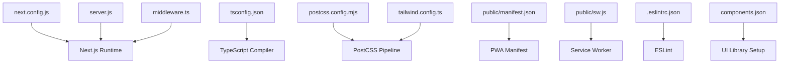
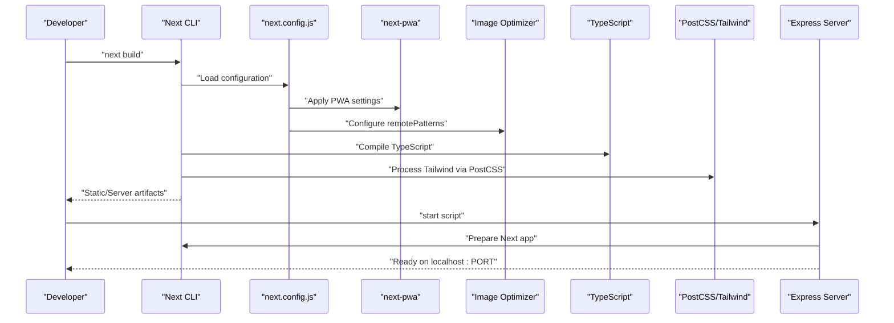
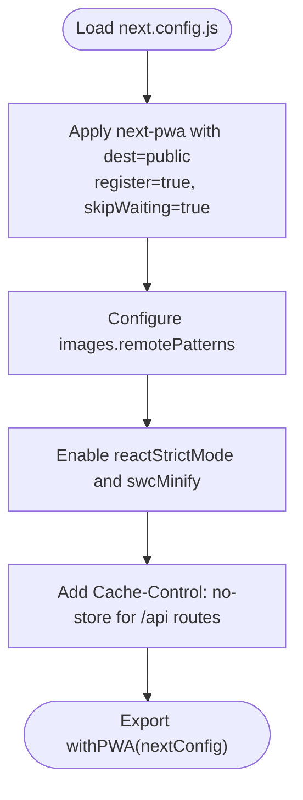
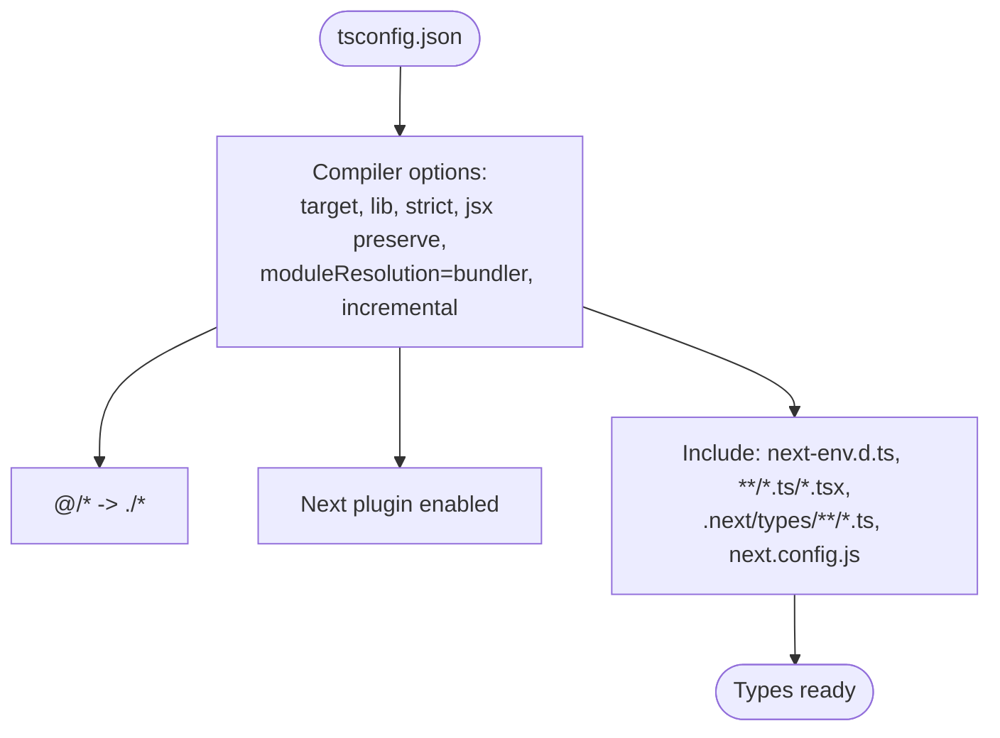
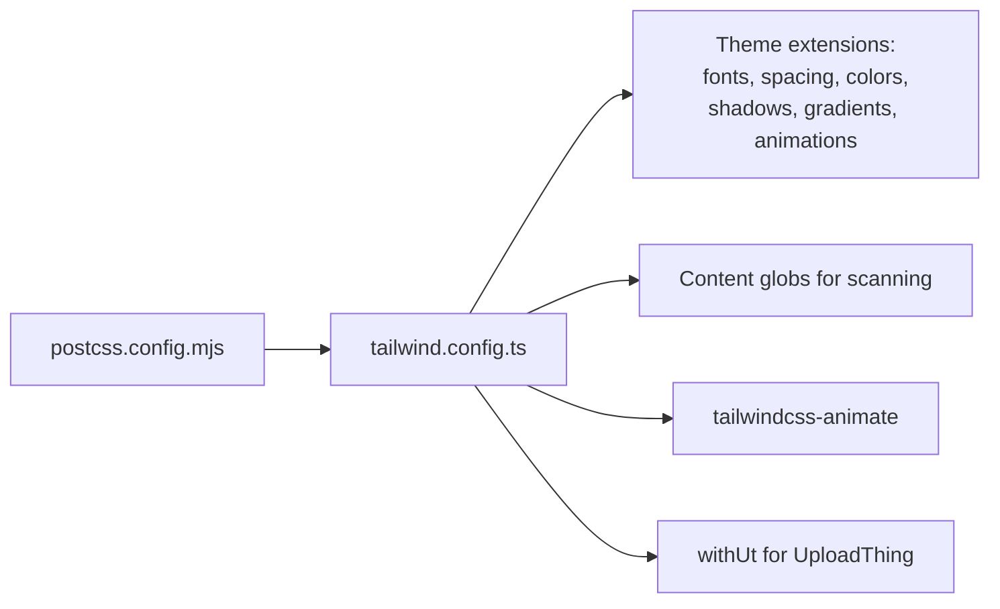
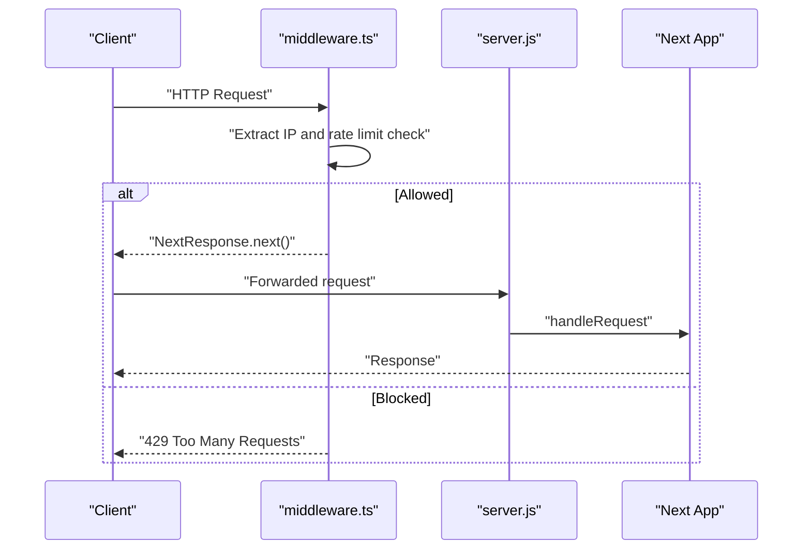
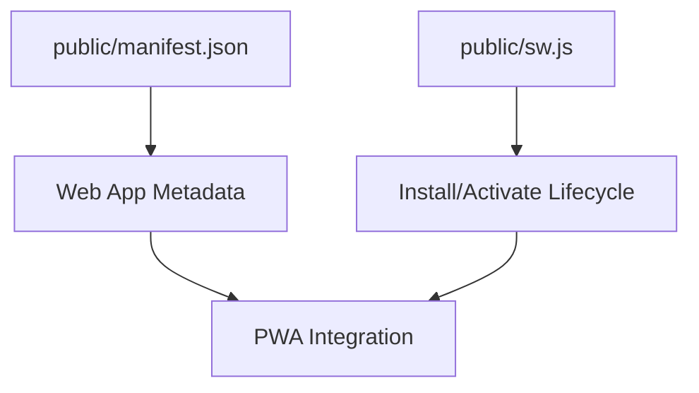
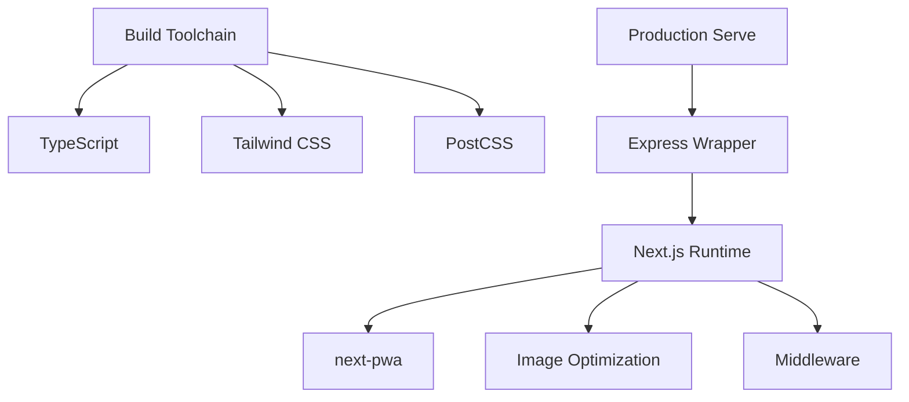

# Build Configuration

<cite>
**Referenced Files in This Document**
- [next.config.js](file://next.config.js)
- [package.json](file://package.json)
- [tsconfig.json](file://tsconfig.json)
- [postcss.config.mjs](file://postcss.config.mjs)
- [tailwind.config.ts](file://tailwind.config.ts)
- [server.js](file://server.js)
- [middleware.ts](file://middleware.ts)
- [components.json](file://components.json)
- [.eslintrc.json](file://.eslintrc.json)
- [public/manifest.json](file://public/manifest.json)
- [public/sw.js](file://public/sw.js)
</cite>

## Table of Contents
1. [Introduction](#introduction)
2. [Project Structure](#project-structure)
3. [Core Components](#core-components)
4. [Architecture Overview](#architecture-overview)
5. [Detailed Component Analysis](#detailed-component-analysis)
6. [Dependency Analysis](#dependency-analysis)
7. [Performance Considerations](#performance-considerations)
8. [Troubleshooting Guide](#troubleshooting-guide)
9. [Conclusion](#conclusion)

## Introduction
This document explains the build configuration for Optim Bozor, focusing on Next.js setup, PWA configuration, image optimization, caching strategies, TypeScript and PostCSS/Tailwind integration, and environment handling. It also covers the build process for development and production, optimization flags, and performance techniques such as code splitting and lazy loading.

## Project Structure
Optim Bozor follows a Next.js App Router project layout with a dedicated configuration layer:
- Next.js configuration via next.config.js
- TypeScript compiler options in tsconfig.json
- PostCSS configuration via postcss.config.mjs
- Tailwind CSS customization in tailwind.config.ts
- Optional Express server wrapper in server.js
- Middleware for request limiting in middleware.ts
- PWA assets under public/, including manifest.json and service worker sw.js
- UI component configuration in components.json

**Diagram sources**
- [next.config.js:1-35](file://next.config.js#L1-L35)
- [tsconfig.json:1-34](file://tsconfig.json#L1-L34)
- [postcss.config.mjs:1-9](file://postcss.config.mjs#L1-L9)
- [tailwind.config.ts:1-161](file://tailwind.config.ts#L1-L161)
- [server.js:1-16](file://server.js#L1-L16)
- [middleware.ts:1-26](file://middleware.ts#L1-L26)
- [public/manifest.json:1-61](file://public/manifest.json#L1-L61)
- [public/sw.js:1-7](file://public/sw.js#L1-L7)
- [components.json:1-22](file://components.json#L1-L22)
- [.eslintrc.json:1-7](file://.eslintrc.json#L1-L7)

**Section sources**
- [next.config.js:1-35](file://next.config.js#L1-L35)
- [tsconfig.json:1-34](file://tsconfig.json#L1-L34)
- [postcss.config.mjs:1-9](file://postcss.config.mjs#L1-L9)
- [tailwind.config.ts:1-161](file://tailwind.config.ts#L1-L161)
- [server.js:1-16](file://server.js#L1-L16)
- [middleware.ts:1-26](file://middleware.ts#L1-L26)
- [public/manifest.json:1-61](file://public/manifest.json#L1-L61)
- [public/sw.js:1-7](file://public/sw.js#L1-L7)
- [components.json:1-22](file://components.json#L1-L22)
- [.eslintrc.json:1-7](file://.eslintrc.json#L1-L7)

## Core Components
- Next.js configuration
  - PWA setup with next-pwa, including destination folder, registration, and skipWaiting behavior
  - Image optimization with remotePatterns for secure asset hosting
  - Strict mode and minification enabled
  - Cache-control headers applied to API routes
- TypeScript configuration
  - ES2017 target, strict mode, preserve JSX, bundler module resolution, path aliases
- PostCSS and Tailwind
  - Tailwind plugin loaded via PostCSS
  - Tailwind theme extensions, dark mode, content globs, and shadcn/ui integration
- Environment and server
  - Express server wrapper reads PORT and NODE_ENV
  - Middleware applies rate limiting and defines matchers
- PWA assets
  - Web app manifest with icons, display, and theme metadata
  - Minimal service worker lifecycle handlers

**Section sources**
- [next.config.js:1-35](file://next.config.js#L1-L35)
- [tsconfig.json:1-34](file://tsconfig.json#L1-L34)
- [postcss.config.mjs:1-9](file://postcss.config.mjs#L1-L9)
- [tailwind.config.ts:1-161](file://tailwind.config.ts#L1-L161)
- [server.js:1-16](file://server.js#L1-L16)
- [middleware.ts:1-26](file://middleware.ts#L1-L26)
- [public/manifest.json:1-61](file://public/manifest.json#L1-L61)
- [public/sw.js:1-7](file://public/sw.js#L1-L7)

## Architecture Overview
The build pipeline integrates Next.js compilation, PWA generation, image optimization, and CSS processing. Requests pass through middleware before reaching the Next.js request handler or Express wrapper.

**Diagram sources**
- [next.config.js:1-35](file://next.config.js#L1-L35)
- [tsconfig.json:1-34](file://tsconfig.json#L1-L34)
- [postcss.config.mjs:1-9](file://postcss.config.mjs#L1-L9)
- [tailwind.config.ts:1-161](file://tailwind.config.ts#L1-L161)
- [server.js:1-16](file://server.js#L1-L16)

## Detailed Component Analysis

### Next.js Configuration (next.config.js)
- PWA integration
  - next-pwa is applied with destination set to public, disabled during development, and configured for automatic registration and immediate activation
  - Runtime caching array is present but currently empty
- Images
  - Remote patterns allow assets from specific hosts, enabling optimized delivery from external sources
- React and build flags
  - Strict mode enabled for extra checks
  - SWC minification enabled for faster builds
- Headers
  - API routes are configured with cache-control: no-store to prevent caching sensitive endpoints

**Diagram sources**
- [next.config.js:1-35](file://next.config.js#L1-L35)

**Section sources**
- [next.config.js:1-35](file://next.config.js#L1-L35)

### TypeScript Configuration (tsconfig.json)
- Compiler options
  - Target ES2017, strict type checking, preserve JSX, bundler module resolution
  - Incremental compilation enabled
  - Path alias @/* mapped to project root
- Plugins and includes
  - Next.js TypeScript plugin included
  - Includes generated types and Next env declarations

**Diagram sources**
- [tsconfig.json:1-34](file://tsconfig.json#L1-L34)

**Section sources**
- [tsconfig.json:1-34](file://tsconfig.json#L1-L34)

### PostCSS and Tailwind CSS (postcss.config.mjs, tailwind.config.ts)
- PostCSS
  - Tailwind plugin enabled; no other PostCSS plugins configured
- Tailwind
  - Dark mode via class strategy
  - Content scanning across pages, components, and app directories
  - Theme extensions for fonts, spacing, colors, shadows, gradients, transitions, animations
  - Plugin integration for animation effects
  - Shadcn/ui compatibility via withUt wrapper

**Diagram sources**
- [postcss.config.mjs:1-9](file://postcss.config.mjs#L1-L9)
- [tailwind.config.ts:1-161](file://tailwind.config.ts#L1-L161)

**Section sources**
- [postcss.config.mjs:1-9](file://postcss.config.mjs#L1-L9)
- [tailwind.config.ts:1-161](file://tailwind.config.ts#L1-L161)

### Environment Variables and Server (server.js, middleware.ts)
- Express server wrapper
  - Reads PORT and NODE_ENV to determine dev mode
  - Prepares Next app and serves requests via Next’s request handler
- Middleware
  - Extracts client IP from x-forwarded-for
  - Applies rate limiting and returns 429 on limit exceeded
  - Matcher excludes static assets and targets API/trpc routes

**Diagram sources**
- [middleware.ts:1-26](file://middleware.ts#L1-L26)
- [server.js:1-16](file://server.js#L1-L16)

**Section sources**
- [server.js:1-16](file://server.js#L1-L16)
- [middleware.ts:1-26](file://middleware.ts#L1-L26)

### PWA Assets (public/manifest.json, public/sw.js)
- Web App Manifest
  - Icons for multiple sizes, standalone display, theme/background colors, and start URL
- Service Worker
  - Minimal lifecycle handlers for install and activate

**Diagram sources**
- [public/manifest.json:1-61](file://public/manifest.json#L1-L61)
- [public/sw.js:1-7](file://public/sw.js#L1-L7)

**Section sources**
- [public/manifest.json:1-61](file://public/manifest.json#L1-L61)
- [public/sw.js:1-7](file://public/sw.js#L1-L7)

### UI Component Configuration (components.json)
- Shadcn/ui setup
  - RSC enabled, TSX, Tailwind config and CSS path, color palette, CSS variables, and aliases for components, utils, ui, lib, hooks
  - Icon library configured as lucide

**Section sources**
- [components.json:1-22](file://components.json#L1-L22)

### ESLint Configuration (.eslintrc.json)
- Extends Next.js core web vitals and TypeScript configs
- Disables exhaustive-deps rule for React Hooks

**Section sources**
- [.eslintrc.json:1-7](file://.eslintrc.json#L1-L7)

## Dependency Analysis
- Next.js runtime depends on:
  - next-pwa for PWA features
  - Image optimization configuration for remote assets
  - Middleware for request filtering
- Build-time dependencies:
  - TypeScript compiler with Next plugin
  - Tailwind CSS with PostCSS pipeline
  - Optional Express server wrapper for production serving

**Diagram sources**
- [next.config.js:1-35](file://next.config.js#L1-L35)
- [tsconfig.json:1-34](file://tsconfig.json#L1-L34)
- [postcss.config.mjs:1-9](file://postcss.config.mjs#L1-L9)
- [tailwind.config.ts:1-161](file://tailwind.config.ts#L1-L161)
- [server.js:1-16](file://server.js#L1-L16)

**Section sources**
- [next.config.js:1-35](file://next.config.js#L1-L35)
- [tsconfig.json:1-34](file://tsconfig.json#L1-L34)
- [postcss.config.mjs:1-9](file://postcss.config.mjs#L1-L9)
- [tailwind.config.ts:1-161](file://tailwind.config.ts#L1-L161)
- [server.js:1-16](file://server.js#L1-L16)

## Performance Considerations
- Build-time optimizations
  - SWC minification enabled in Next.js configuration improves build speed
  - Strict mode helps catch issues early and can enable additional optimizations
- Asset optimization
  - Remote image patterns configured for optimized delivery from external hosts
  - Tailwind purging occurs via content globs; ensure globs remain accurate to avoid unnecessary CSS
- Caching strategies
  - API routes explicitly set no-store to prevent caching sensitive data
  - PWA caching array is empty; consider adding runtime caching policies for static assets and pages
- Code splitting and lazy loading
  - Next.js App Router naturally splits routes; ensure dynamic imports are used for heavy components
  - Lazy load non-critical UI elements and images using native lazy semantics
- Bundle analysis
  - Consider integrating a Next.js-compatible analyzer to inspect bundle composition and identify large dependencies
- Environment-specific behavior
  - PWA registration disabled in development to reduce overhead during iteration

[No sources needed since this section provides general guidance]

## Troubleshooting Guide
- PWA not registering in development
  - PWA registration is disabled when NODE_ENV is development; switch to production or adjust configuration
- Images not optimizing
  - Verify remotePatterns include the intended host; ensure images are served over HTTPS
- API response caching issues
  - Confirm cache-control headers are applied to the relevant routes
- Tailwind utilities missing
  - Ensure content globs cover all directories where Tailwind classes are used
- Rate limiting blocking legitimate traffic
  - Review middleware matcher and rate limiter thresholds; adjust for staging environments

**Section sources**
- [next.config.js:1-35](file://next.config.js#L1-L35)
- [middleware.ts:1-26](file://middleware.ts#L1-L26)
- [tailwind.config.ts:1-161](file://tailwind.config.ts#L1-L161)

## Conclusion
Optim Bozor’s build configuration leverages Next.js capabilities with a focused PWA setup, robust image optimization, and a tailored Tailwind CSS pipeline. Development and production scripts are straightforward, while middleware and headers enforce security and performance best practices. For further improvements, consider implementing runtime caching for the PWA, expanding content globs for Tailwind, and integrating bundle analysis to monitor bundle health.