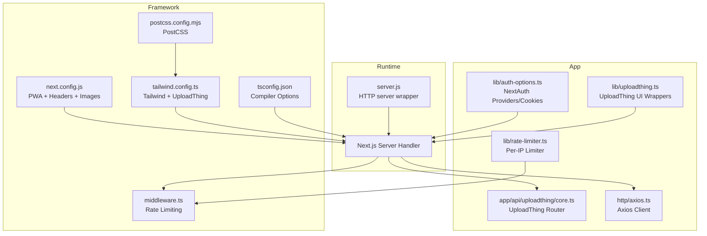
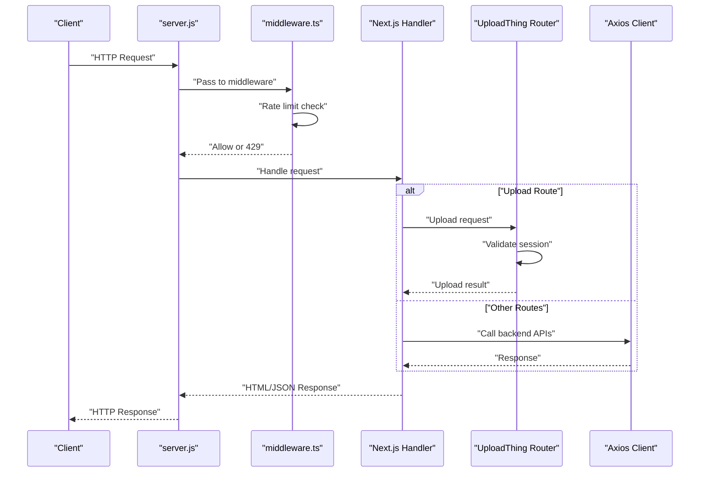
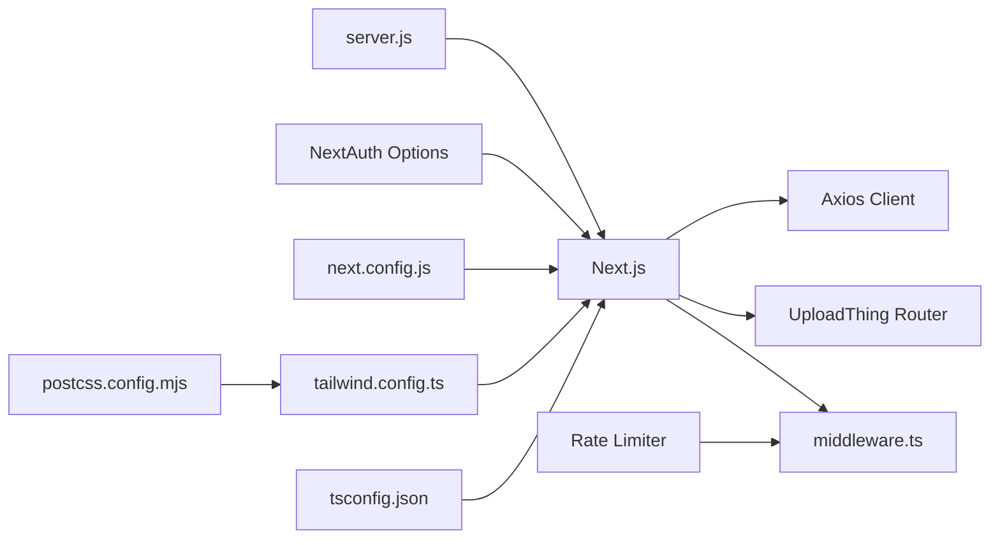
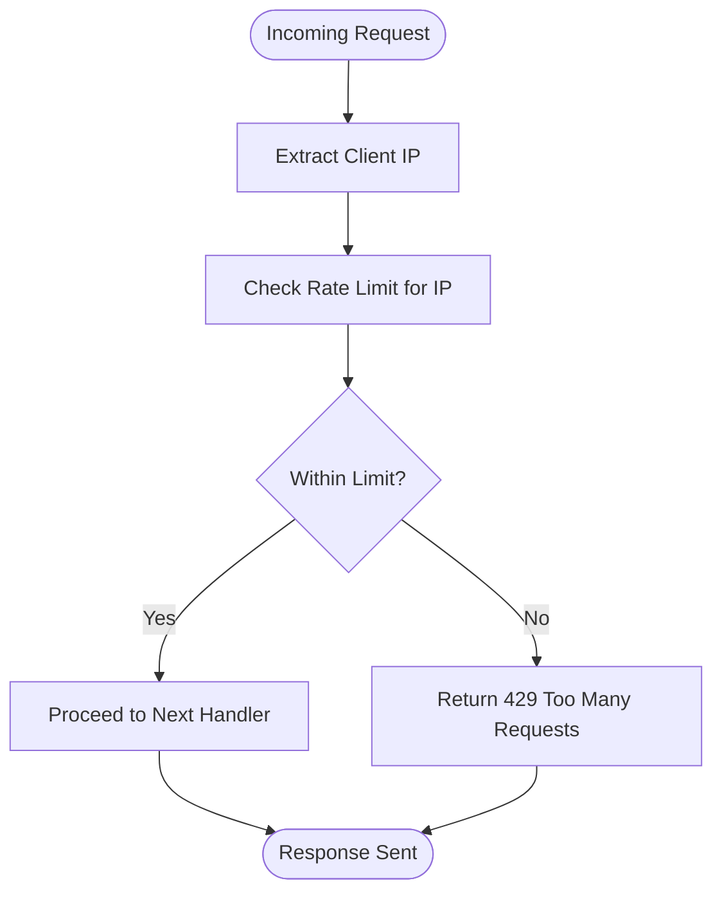

# Deployment & DevOps

<cite>
**Referenced Files in This Document**
- [package.json](file://package.json)
- [next.config.js](file://next.config.js)
- [server.js](file://server.js)
- [middleware.ts](file://middleware.ts)
- [tailwind.config.ts](file://tailwind.config.ts)
- [postcss.config.mjs](file://postcss.config.mjs)
- [tsconfig.json](file://tsconfig.json)
- [lib/constants.ts](file://lib/constants.ts)
- [lib/auth-options.ts](file://lib/auth-options.ts)
- [actions/auth.action.ts](file://actions/auth.action.ts)
- [http/axios.ts](file://http/axios.ts)
- [lib/rate-limiter.ts](file://lib/rate-limiter.ts)
- [app/api/uploadthing/core.ts](file://app/api/uploadthing/core.ts)
- [lib/uploadthing.ts](file://lib/uploadthing.ts)
</cite>

## Table of Contents
1. [Introduction](#introduction)
2. [Project Structure](#project-structure)
3. [Core Components](#core-components)
4. [Architecture Overview](#architecture-overview)
5. [Detailed Component Analysis](#detailed-component-analysis)
6. [Dependency Analysis](#dependency-analysis)
7. [Performance Considerations](#performance-considerations)
8. [Troubleshooting Guide](#troubleshooting-guide)
9. [Conclusion](#conclusion)
10. [Appendices](#appendices)

## Introduction
This document provides comprehensive deployment and DevOps guidance for Optim Bozor. It covers build configuration, environment variables, production optimizations, deployment strategies (Vercel, traditional servers, containerized), CI/CD pipeline setup, automated testing integration, environment configuration across development, staging, and production, monitoring and error tracking, performance monitoring, scaling and high availability, backup and disaster recovery, and operational maintenance procedures.

## Project Structure
Optim Bozor is a Next.js 14 application using the App Router and server-side rendering. It integrates authentication via NextAuth.js, file uploads via UploadThing, and a PWA layer via next-pwa. The runtime is Node.js-based, with a custom HTTP server wrapper around Next’s server handler. Build-time optimizations include SWC minification, strict mode, and image optimization with remote pattern allowances. Middleware enforces rate limiting per IP.

**Diagram sources**
- [server.js:1-16](file://server.js#L1-L16)
- [next.config.js:1-35](file://next.config.js#L1-L35)
- [middleware.ts:1-26](file://middleware.ts#L1-L26)
- [tsconfig.json:1-34](file://tsconfig.json#L1-L34)
- [tailwind.config.ts:1-161](file://tailwind.config.ts#L1-L161)
- [postcss.config.mjs:1-9](file://postcss.config.mjs#L1-L9)
- [app/api/uploadthing/core.ts:1-26](file://app/api/uploadthing/core.ts#L1-L26)
- [http/axios.ts:1-10](file://http/axios.ts#L1-L10)
- [lib/auth-options.ts:1-128](file://lib/auth-options.ts#L1-L128)
- [lib/rate-limiter.ts:1-29](file://lib/rate-limiter.ts#L1-L29)
- [lib/uploadthing.ts:1-9](file://lib/uploadthing.ts#L1-L9)

**Section sources**
- [package.json:1-67](file://package.json#L1-L67)
- [next.config.js:1-35](file://next.config.js#L1-L35)
- [server.js:1-16](file://server.js#L1-L16)
- [middleware.ts:1-26](file://middleware.ts#L1-L26)
- [tailwind.config.ts:1-161](file://tailwind.config.ts#L1-L161)
- [postcss.config.mjs:1-9](file://postcss.config.mjs#L1-L9)
- [tsconfig.json:1-34](file://tsconfig.json#L1-L34)

## Core Components
- Build and Runtime
  - Next.js build and start scripts are defined in package.json. Production startup uses a Node.js HTTP server wrapper around Next’s handler.
  - next.config.js enables PWA caching (disabled in development), sets image remote patterns, React strict mode, and SWC minification. It also injects cache-control headers for API routes.
- Authentication and Session Management
  - NextAuth.js is configured with credentials and Google providers. Cookies are hardened for security. JWT strategy is used with secrets from environment variables.
- File Uploads
  - UploadThing router requires a valid session and returns JSON-serializable metadata after upload completion.
- Client Communication
  - Axios client is configured with a base URL from environment variables and credentials support for cross-service cookie handling.
- Rate Limiting
  - Middleware enforces per-IP rate limiting using an in-memory map with a fixed window and threshold.

**Section sources**
- [package.json:5-10](file://package.json#L5-L10)
- [next.config.js:2-8](file://next.config.js#L2-L8)
- [next.config.js:10-32](file://next.config.js#L10-L32)
- [server.js:4-7](file://server.js#L4-L7)
- [lib/auth-options.ts:8-44](file://lib/auth-options.ts#L8-L44)
- [lib/auth-options.ts:46-67](file://lib/auth-options.ts#L46-L67)
- [lib/auth-options.ts:124-127](file://lib/auth-options.ts#L124-L127)
- [app/api/uploadthing/core.ts:8-23](file://app/api/uploadthing/core.ts#L8-L23)
- [http/axios.ts:3-9](file://http/axios.ts#L3-L9)
- [middleware.ts:9-20](file://middleware.ts#L9-L20)
- [lib/rate-limiter.ts:9-28](file://lib/rate-limiter.ts#L9-L28)

## Architecture Overview
The runtime architecture combines a Node.js HTTP server with Next.js App Router. Requests pass through middleware for rate limiting, then reach Next.js handlers. Authentication relies on NextAuth.js with JWT sessions and provider-specific flows. File uploads are handled by UploadThing with server-side session checks. Axios communicates with backend services using environment-driven base URLs.

**Diagram sources**
- [server.js:9-15](file://server.js#L9-L15)
- [middleware.ts:9-20](file://middleware.ts#L9-L20)
- [app/api/uploadthing/core.ts:12-22](file://app/api/uploadthing/core.ts#L12-L22)
- [http/axios.ts:5-9](file://http/axios.ts#L5-L9)

## Detailed Component Analysis

### Build Configuration and Production Optimizations
- Next.js Compilation
  - Strict mode enabled for robustness.
  - SWC minification enabled for faster builds and smaller bundles.
  - Image optimization allows UploadThing and wildcard HTTPS hosts.
- PWA Layer
  - next-pwa plugin is configured with destination folder and disabled in development. Service worker registration and skip-waiting are enabled.
- Security Headers
  - API routes are configured with cache-control: no-store to prevent caching of sensitive endpoints.
- TypeScript and Tailwind
  - Bundler module resolution, JSX preserve, and incremental compilation improve DX and build performance.
  - Tailwind integrates UploadThing utilities and scans app, components, and pages directories.

**Section sources**
- [next.config.js:10-32](file://next.config.js#L10-L32)
- [next.config.js:2-8](file://next.config.js#L2-L8)
- [tsconfig.json:10-23](file://tsconfig.json#L10-L23)
- [tailwind.config.ts:6-10](file://tailwind.config.ts#L6-L10)
- [tailwind.config.ts:157-161](file://tailwind.config.ts#L157-L161)

### Environment Variables and Secrets
- Authentication
  - GOOGLE_CLIENT_ID, GOOGLE_CLIENT_SECRET for Google OAuth.
  - NEXT_PUBLIC_JWT_SECRET and NEXT_AUTH_SECRET for JWT and session signing.
- Backend Integration
  - NEXT_PUBLIC_SERVER_URL defines the backend base URL for Axios client.
- UploadThing
  - UploadThing router depends on NextAuth session for authorization.

Recommended variables to define in deployment environments:
- GOOGLE_CLIENT_ID
- GOOGLE_CLIENT_SECRET
- NEXT_PUBLIC_JWT_SECRET
- NEXT_AUTH_SECRET
- NEXT_PUBLIC_SERVER_URL

**Section sources**
- [lib/auth-options.ts:40-43](file://lib/auth-options.ts#L40-L43)
- [lib/auth-options.ts:124-127](file://lib/auth-options.ts#L124-L127)
- [http/axios.ts:3](file://http/axios.ts#L3)
- [app/api/uploadthing/core.ts:12-17](file://app/api/uploadthing/core.ts#L12-L17)

### Deployment Strategies

#### Vercel Deployment
- Static Export Compatibility
  - The app uses server-side rendering and middleware. Vercel Serverless Functions or Edge Functions can host the Next.js app.
- Environment Variables
  - Configure the recommended variables under Project Settings > Environment Variables.
- Build and Output
  - Use the default Next.js build command. Ensure the server wrapper is compatible with Vercel’s runtime.
- PWA Considerations
  - PWA registration is enabled; confirm service worker behavior in Vercel’s hosting model.

#### Traditional Servers (Node.js)
- Runtime
  - Start with NODE_ENV=production and set PORT. The server wrapper listens on the configured port.
- Process Management
  - Use PM2 or systemd to manage the process, enable restart on failure, and configure log rotation.
- Reverse Proxy
  - Place NGINX or Apache in front to terminate TLS, proxy to the Node.js process, and handle static assets.

#### Containerized Deployment (Docker)
- Multi-stage Build
  - Build stage: install dependencies and run Next build.
  - Runtime stage: copy only production artifacts and serve with Node.js.
- Entrypoint
  - Entrypoint should execute the production start script via server.js.
- Health Checks
  - Implement HTTP health checks against a lightweight endpoint.
- Secrets Management
  - Mount secrets via environment variables or Kubernetes Secrets.

### CI/CD Pipeline Setup
- Branch Protection
  - Protect main branch; require reviews and successful checks.
- Automated Testing
  - Lint and type checks as prerequisites for PRs.
- Build Verification
  - Run Next build and export to validate production readiness.
- Artifact Promotion
  - Promote build artifacts to staging and production environments.
- Rollback Strategy
  - Maintain artifact versions and enable quick rollback to previous builds.

### Automated Testing Integration
- Linting and Type Checking
  - Use ESLint and TypeScript checks in CI to enforce quality gates.
- Unit and Integration Tests
  - Add unit tests for utility modules (e.g., rate limiter) and integration tests for API routes and authentication flows.

### Environment Configuration
- Development
  - NODE_ENV=development, PWA disabled, local backend URL.
- Staging
  - NODE_ENV=production, PWA enabled, staging backend URL.
- Production
  - NODE_ENV=production, PWA enabled, production backend URL, hardened NextAuth cookies, and strict CSP headers.

### Monitoring, Error Tracking, and Performance Monitoring
- Logging
  - Capture stdout/stderr from the Node.js process and forward to centralized logging (e.g., ELK, Cloud Logging).
- Error Tracking
  - Integrate an error tracking platform (e.g., Sentry) to capture unhandled exceptions and client-side errors.
- Performance Monitoring
  - Monitor response times, throughput, and error rates for API routes and page renders.
  - Track UploadThing upload performance and failures.
- Synthetic Monitoring
  - Set up synthetic checks for critical flows (login, upload, cart checkout).

### Scaling, Load Balancing, and High Availability
- Horizontal Scaling
  - Run multiple instances behind a load balancer; ensure sticky sessions are not required for stateless routes.
- Stateless Design
  - Keep sessions in JWT and avoid server-side session storage to simplify scaling.
- CDN and Assets
  - Serve static assets via CDN; leverage Next.js static export capabilities where applicable.
- Health Checks and Auto-healing
  - Configure health checks and auto-restart policies for containers or VMs.

### Backup and Disaster Recovery
- Database Backups
  - Schedule regular backups for the backend database and test restore procedures.
- Configuration Backups
  - Store environment variables and secrets securely; maintain encrypted backups.
- DR Plan
  - Define failover regions and RTO/RPO targets; automate failover where possible.

### Maintenance Procedures
- Patching
  - Regularly update dependencies and rebuild/publish.
- Deprecation Management
  - Monitor deprecated packages and plan replacements.
- Capacity Planning
  - Observe growth trends and scale compute/storage accordingly.

## Dependency Analysis
The application exhibits layered dependencies: runtime and framework layers, authentication and session management, file upload orchestration, and client communication. Middleware sits at the intersection of routing and security.

**Diagram sources**
- [server.js:1-16](file://server.js#L1-L16)
- [middleware.ts:1-26](file://middleware.ts#L1-L26)
- [app/api/uploadthing/core.ts:1-26](file://app/api/uploadthing/core.ts#L1-L26)
- [http/axios.ts:1-10](file://http/axios.ts#L1-L10)
- [lib/auth-options.ts:1-128](file://lib/auth-options.ts#L1-L128)
- [lib/rate-limiter.ts:1-29](file://lib/rate-limiter.ts#L1-L29)
- [next.config.js:1-35](file://next.config.js#L1-L35)
- [tailwind.config.ts:1-161](file://tailwind.config.ts#L1-L161)
- [postcss.config.mjs:1-9](file://postcss.config.mjs#L1-L9)
- [tsconfig.json:1-34](file://tsconfig.json#L1-L34)

**Section sources**
- [package.json:11-54](file://package.json#L11-L54)
- [lib/constants.ts:1-25](file://lib/constants.ts#L1-L25)

## Performance Considerations
- Build-time
  - SWC minification and strict mode reduce bundle sizes and improve correctness.
  - Tailwind scanning scope can be tuned to speed up builds.
- Runtime
  - Rate limiting prevents abuse and stabilizes performance under traffic spikes.
  - PWA caching improves repeat visits; ensure cache invalidation for critical assets.
- Network
  - Axios timeout and withCredentials help manage cross-origin requests and reduce hanging connections.

[No sources needed since this section provides general guidance]

## Troubleshooting Guide
- Authentication Failures
  - Verify GOOGLE_CLIENT_ID, GOOGLE_CLIENT_SECRET, NEXT_PUBLIC_JWT_SECRET, and NEXT_AUTH_SECRET are set and correct.
  - Confirm cookie security settings and SameSite/Lax configuration.
- Upload Failures
  - Ensure UploadThing router is reachable and session validation passes.
  - Check UploadThing file size limits and counts.
- API Connectivity
  - Validate NEXT_PUBLIC_SERVER_URL and network connectivity to backend services.
- Rate Limit Exceeded
  - Review middleware rate limiter thresholds and consider increasing window size or thresholds for legitimate traffic.

**Section sources**
- [lib/auth-options.ts:40-43](file://lib/auth-options.ts#L40-L43)
- [lib/auth-options.ts:46-67](file://lib/auth-options.ts#L46-L67)
- [app/api/uploadthing/core.ts:12-17](file://app/api/uploadthing/core.ts#L12-L17)
- [http/axios.ts:3-9](file://http/axios.ts#L3-L9)
- [middleware.ts:9-20](file://middleware.ts#L9-L20)
- [lib/rate-limiter.ts:6-7](file://lib/rate-limiter.ts#L6-L7)

## Conclusion
Optim Bozor’s deployment and DevOps strategy centers on a production-ready Next.js setup with hardened authentication, robust file upload handling, and middleware-driven rate limiting. By leveraging environment-driven configuration, CI/CD automation, and observability, teams can achieve reliable, scalable, and secure deployments across Vercel, traditional servers, and containers.

[No sources needed since this section summarizes without analyzing specific files]

## Appendices

### Environment Variable Reference
- GOOGLE_CLIENT_ID
- GOOGLE_CLIENT_SECRET
- NEXT_PUBLIC_JWT_SECRET
- NEXT_AUTH_SECRET
- NEXT_PUBLIC_SERVER_URL

**Section sources**
- [lib/auth-options.ts:40-43](file://lib/auth-options.ts#L40-L43)
- [lib/auth-options.ts:124-127](file://lib/auth-options.ts#L124-L127)
- [http/axios.ts:3](file://http/axios.ts#L3)

### Rate Limiter Flow

**Diagram sources**
- [middleware.ts:4-7](file://middleware.ts#L4-L7)
- [middleware.ts:9-20](file://middleware.ts#L9-L20)
- [lib/rate-limiter.ts:9-28](file://lib/rate-limiter.ts#L9-L28)