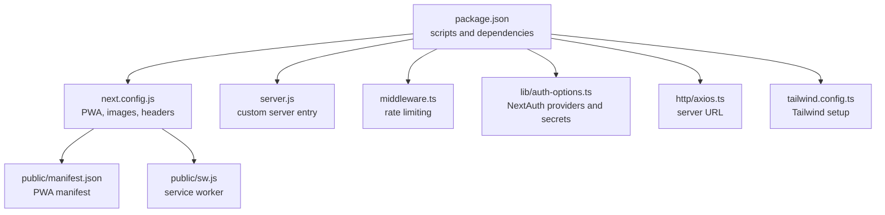
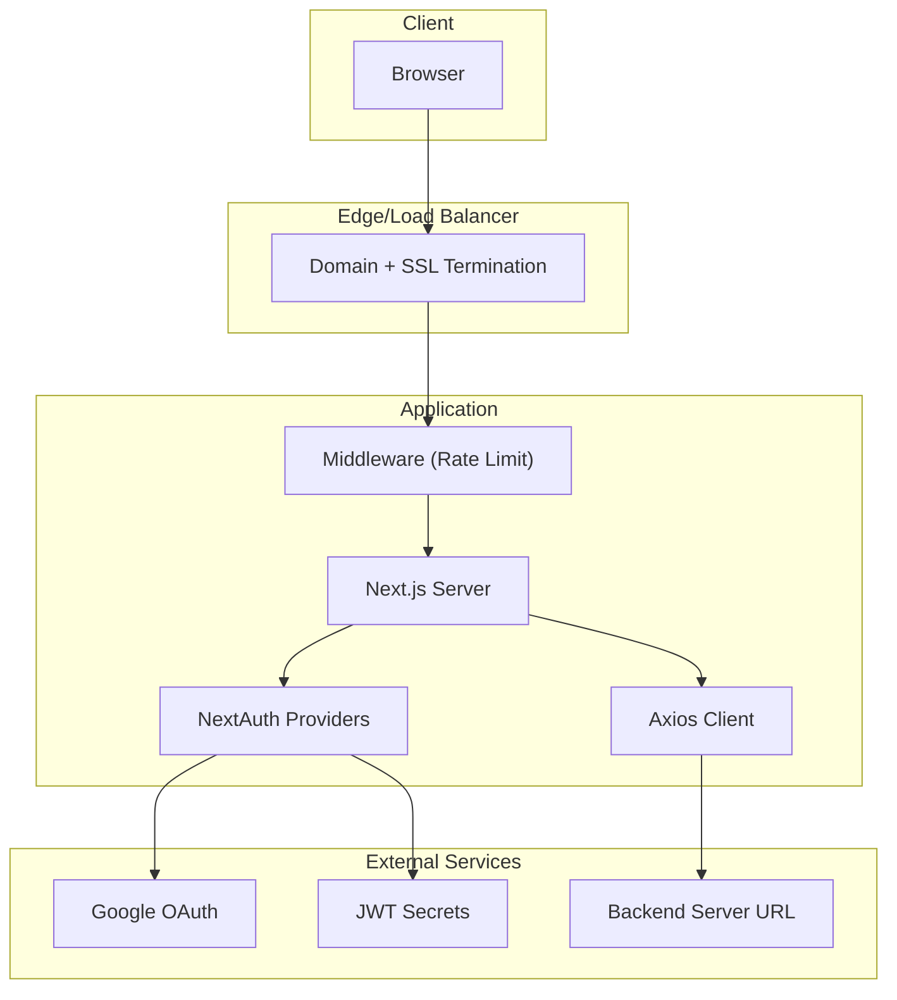
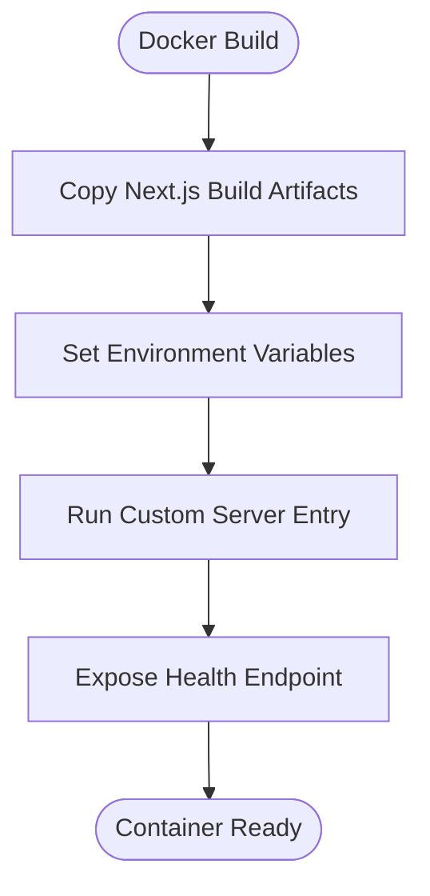
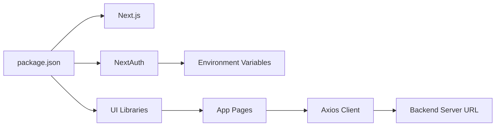

# Deployment Strategies

<cite>
**Referenced Files in This Document**
- [package.json](file://package.json)
- [next.config.js](file://next.config.js)
- [server.js](file://server.js)
- [middleware.ts](file://middleware.ts)
- [lib/auth-options.ts](file://lib/auth-options.ts)
- [http/axios.ts](file://http/axios.ts)
- [public/manifest.json](file://public/manifest.json)
- [public/sw.js](file://public/sw.js)
- [tailwind.config.ts](file://tailwind.config.ts)
</cite>

## Table of Contents
1. [Introduction](#introduction)
2. [Project Structure](#project-structure)
3. [Core Components](#core-components)
4. [Architecture Overview](#architecture-overview)
5. [Detailed Component Analysis](#detailed-component-analysis)
6. [Dependency Analysis](#dependency-analysis)
7. [Performance Considerations](#performance-considerations)
8. [Troubleshooting Guide](#troubleshooting-guide)
9. [Conclusion](#conclusion)
10. [Appendices](#appendices)

## Introduction
This document provides a comprehensive deployment strategy for Optim Bozor, a Next.js 14 application. It covers three primary deployment options: Vercel deployment, traditional server deployment, and Docker containerization. It also details build and deploy processes, environment configuration, static site generation setup, server-side rendering deployment, automation scripts, rollback procedures, blue-green deployment strategies, domain configuration, SSL certificates, CDN integration, troubleshooting, health checks, and monitoring setup.

## Project Structure
Optim Bozor is a Next.js application configured with:
- Next.js App Router pages and routes under the app directory
- Middleware for rate limiting
- Next PWA plugin enabled via next.config.js
- Environment-dependent configuration for development and production
- Tailwind CSS for styling

**Diagram sources**
- [package.json:1-67](file://package.json#L1-L67)
- [next.config.js:1-35](file://next.config.js#L1-L35)
- [server.js:1-16](file://server.js#L1-L16)
- [middleware.ts:1-26](file://middleware.ts#L1-L26)
- [public/manifest.json:1-61](file://public/manifest.json#L1-L61)
- [public/sw.js:1-7](file://public/sw.js#L1-L7)
- [lib/auth-options.ts:1-128](file://lib/auth-options.ts#L1-L128)
- [http/axios.ts:1-10](file://http/axios.ts#L1-L10)
- [tailwind.config.ts:1-161](file://tailwind.config.ts#L1-L161)

**Section sources**
- [package.json:1-67](file://package.json#L1-L67)
- [next.config.js:1-35](file://next.config.js#L1-L35)
- [server.js:1-16](file://server.js#L1-L16)
- [middleware.ts:1-26](file://middleware.ts#L1-L26)
- [public/manifest.json:1-61](file://public/manifest.json#L1-L61)
- [public/sw.js:1-7](file://public/sw.js#L1-L7)
- [lib/auth-options.ts:1-128](file://lib/auth-options.ts#L1-L128)
- [http/axios.ts:1-10](file://http/axios.ts#L1-L10)
- [tailwind.config.ts:1-161](file://tailwind.config.ts#L1-L161)

## Core Components
- Build and start scripts: The project defines standard Next.js scripts for development, building, and starting the server.
- Custom server entry: A minimal Express-like HTTP server is used to serve Next.js pages.
- Middleware: A rate-limiting middleware protects routes by IP.
- PWA configuration: Next PWA plugin is integrated with environment-specific toggles.
- Authentication: NextAuth is configured with credentials and Google providers, relying on environment variables for secrets and provider keys.
- Client-server communication: Axios client reads the backend server URL from environment variables.

Key deployment implications:
- Environment variables are essential for authentication, PWA behavior, and backend connectivity.
- The custom server entry supports traditional server deployments.
- Middleware impacts traffic shaping and can influence autoscaling decisions.

**Section sources**
- [package.json:5-9](file://package.json#L5-L9)
- [server.js:4-15](file://server.js#L4-L15)
- [middleware.ts:9-20](file://middleware.ts#L9-L20)
- [next.config.js:2-8](file://next.config.js#L2-L8)
- [lib/auth-options.ts:40-43](file://lib/auth-options.ts#L40-L43)
- [lib/auth-options.ts:124-127](file://lib/auth-options.ts#L124-L127)
- [http/axios.ts:1-2](file://http/axios.ts#L1-L2)

## Architecture Overview
The application runs as a Next.js server-rendered application with optional PWA capabilities. Requests pass through middleware before reaching Next.js handlers. Authentication integrates with external providers via environment variables. Static assets and PWA manifests are served from the public directory.

**Diagram sources**
- [middleware.ts:9-20](file://middleware.ts#L9-L20)
- [lib/auth-options.ts:8-44](file://lib/auth-options.ts#L8-L44)
- [lib/auth-options.ts:124-127](file://lib/auth-options.ts#L124-L127)
- [http/axios.ts:1-2](file://http/axios.ts#L1-L2)

## Detailed Component Analysis

### Vercel Deployment
Vercel is the recommended platform for this Next.js application due to its native support for App Router, ISR/SSR, and automatic optimizations.

- Build and deploy process:
  - Install dependencies and run the Next.js build command.
  - Vercel automatically detects the Next.js configuration and PWA plugin.
  - Environment variables are configured in Vercel’s project settings.

- Environment configuration:
  - NEXT_PUBLIC_SERVER_URL: Backend server URL for client-side requests.
  - NEXT_PUBLIC_JWT_SECRET: Public JWT secret for client-side JWT handling.
  - NEXT_AUTH_SECRET: Secret for NextAuth session signing.
  - GOOGLE_CLIENT_ID and GOOGLE_CLIENT_SECRET: For Google OAuth.

- Static site generation and server-side rendering:
  - Next.js App Router pages are server-rendered by default.
  - PWA caching is disabled in development and enabled in production via next.config.js.

- Domain configuration and SSL:
  - Configure custom domains and enable automatic SSL in Vercel.
  - Use HTTPS-only redirects and HSTS headers if required.

- CDN integration:
  - Vercel’s global CDN serves static assets and pages.
  - Image optimization is handled by Next.js with configured remote patterns.

- Monitoring and health checks:
  - Use Vercel logs and metrics dashboards.
  - Set up synthetic health checks pointing to the home page or a lightweight endpoint.

**Section sources**
- [package.json:5-9](file://package.json#L5-L9)
- [next.config.js:2-8](file://next.config.js#L2-L8)
- [lib/auth-options.ts:40-43](file://lib/auth-options.ts#L40-L43)
- [lib/auth-options.ts:124-127](file://lib/auth-options.ts#L124-L127)
- [http/axios.ts:1-2](file://http/axios.ts#L1-L2)

### Traditional Server Deployment
Deploying on a traditional server requires using the custom server entry and ensuring environment variables are present.

- Build and deploy process:
  - Build the application using the Next.js build script.
  - Start the server using the custom server entry with production mode.

- Environment configuration:
  - NODE_ENV=production
  - PORT: listening port
  - NEXT_PUBLIC_SERVER_URL: backend server URL
  - NEXT_PUBLIC_JWT_SECRET and NEXT_AUTH_SECRET
  - GOOGLE_CLIENT_ID and GOOGLE_CLIENT_SECRET

- Server-side rendering:
  - The custom server prepares Next.js and handles requests, enabling SSR for all routes.

- Domain configuration and SSL:
  - Place a reverse proxy (e.g., Nginx) in front of the server.
  - Terminate SSL at the proxy and forward to the application port.
  - Configure domain names and certificate management externally.

- CDN integration:
  - Serve static assets from the public directory.
  - Consider a CDN for static assets and media if bandwidth is a concern.

- Monitoring and health checks:
  - Expose a simple health endpoint (e.g., GET /health) returning 200 OK.
  - Use process managers like PM2 or systemd to restart failed instances.

**Section sources**
- [package.json:7-8](file://package.json#L7-L8)
- [server.js:4-15](file://server.js#L4-L15)
- [lib/auth-options.ts:124-127](file://lib/auth-options.ts#L124-L127)
- [http/axios.ts:1-2](file://http/axios.ts#L1-L2)

### Docker Containerization
Containerizing the application enables consistent deployments across environments.

- Build and deploy process:
  - Use a multi-stage Dockerfile to build the Next.js app and copy production artifacts.
  - Run the custom server entry inside the container with production mode.

- Environment configuration:
  - Pass environment variables via docker run or docker-compose.
  - Ensure NEXT_PUBLIC_SERVER_URL, NEXT_PUBLIC_JWT_SECRET, NEXT_AUTH_SECRET, GOOGLE_CLIENT_ID, and GOOGLE_CLIENT_SECRET are set.

- Static site generation and server-side rendering:
  - The container runs the same SSR pipeline as traditional deployments.

- Health checks:
  - Add a health endpoint in the container and configure Docker healthchecks.

- Monitoring:
  - Use container logs and integrate with your logging stack (e.g., ELK, CloudWatch).

[No sources needed since this diagram shows conceptual workflow, not actual code structure]

**Section sources**
- [package.json:7-8](file://package.json#L7-L8)
- [server.js:4-15](file://server.js#L4-L15)
- [lib/auth-options.ts:124-127](file://lib/auth-options.ts#L124-L127)
- [http/axios.ts:1-2](file://http/axios.ts#L1-L2)

### Blue-Green Deployment Strategy
Blue-green deployment minimizes downtime and risk by running two identical environments.

- Implementation steps:
  - Deploy the new version to the inactive environment (green).
  - Validate the new version with health checks and smoke tests.
  - Switch traffic from the active environment (blue) to green.
  - Retain blue for potential rollback.

- Rollback procedure:
  - If issues arise, switch traffic back to blue.
  - Keep the previous version ready for quick rollback.

- Automation:
  - Use CI/CD pipelines to automate builds, testing, and traffic switching.
  - Integrate with domain DNS or load balancer APIs for traffic routing.

[No sources needed since this section provides general guidance]

### Rollback Procedures
- Vercel: Use the dashboard to revert to a previous deployment or branch.
- Traditional servers: Keep previous builds and switch binaries/processes.
- Docker: Tag images and roll back containers to the previous image tag.

[No sources needed since this section provides general guidance]

### Environment Configuration Checklist
- Required variables:
  - NEXT_PUBLIC_SERVER_URL
  - NEXT_PUBLIC_JWT_SECRET
  - NEXT_AUTH_SECRET
  - GOOGLE_CLIENT_ID
  - GOOGLE_CLIENT_SECRET

- Optional variables:
  - NODE_ENV (development vs production)
  - PORT (traditional server)
  - NEXT_PUBLIC_GOOGLE_ANALYTICS_ID (if applicable)

**Section sources**
- [lib/auth-options.ts:40-43](file://lib/auth-options.ts#L40-L43)
- [lib/auth-options.ts:124-127](file://lib/auth-options.ts#L124-L127)
- [http/axios.ts:1-2](file://http/axios.ts#L1-L2)

### PWA and Manifest Considerations
- PWA caching is controlled by the PWA plugin and environment.
- The manifest and service worker are located under the public directory.
- Ensure HTTPS is enforced for PWA features.

**Section sources**
- [next.config.js:2-8](file://next.config.js#L2-L8)
- [public/manifest.json:1-61](file://public/manifest.json#L1-L61)
- [public/sw.js:1-7](file://public/sw.js#L1-L7)

### Middleware and Rate Limiting
- The middleware enforces per-IP rate limits and returns 429 on violations.
- Plan autoscaling and CDN caching around middleware behavior.

**Section sources**
- [middleware.ts:9-20](file://middleware.ts#L9-L20)

## Dependency Analysis
The application depends on Next.js, NextAuth, and various UI libraries. Authentication relies on environment variables, and client requests depend on the backend server URL.

**Diagram sources**
- [package.json:11-54](file://package.json#L11-L54)
- [lib/auth-options.ts:8-44](file://lib/auth-options.ts#L8-L44)
- [http/axios.ts:1-2](file://http/axios.ts#L1-L2)

**Section sources**
- [package.json:11-54](file://package.json#L11-L54)
- [lib/auth-options.ts:8-44](file://lib/auth-options.ts#L8-L44)
- [http/axios.ts:1-2](file://http/axios.ts#L1-L2)

## Performance Considerations
- Enable Next.js SWC minification and React strict mode.
- Use Vercel’s global CDN for static assets and images.
- Configure appropriate caching headers for API routes to avoid stale data.
- Monitor middleware impact on latency and adjust rate limits accordingly.

[No sources needed since this section provides general guidance]

## Troubleshooting Guide
- Authentication failures:
  - Verify GOOGLE_CLIENT_ID and GOOGLE_CLIENT_SECRET are set.
  - Confirm NEXT_AUTH_SECRET and NEXT_PUBLIC_JWT_SECRET are configured.

- Backend connectivity:
  - Ensure NEXT_PUBLIC_SERVER_URL points to a reachable backend.

- PWA issues:
  - Confirm HTTPS is enabled and the manifest/service worker are accessible.

- Health checks:
  - Implement a simple GET /health endpoint returning 200 OK.
  - Use load balancer or CDN health probes to monitor uptime.

**Section sources**
- [lib/auth-options.ts:40-43](file://lib/auth-options.ts#L40-L43)
- [lib/auth-options.ts:124-127](file://lib/auth-options.ts#L124-L127)
- [http/axios.ts:1-2](file://http/axios.ts#L1-L2)

## Conclusion
Optim Bozor can be deployed efficiently on Vercel, traditional servers, or Dockerized environments. The key to successful deployments lies in proper environment configuration, leveraging Next.js SSR and PWA features, and implementing robust monitoring and rollback procedures. Choose the deployment option that best fits your infrastructure and operational model while adhering to the environment variable requirements and security practices outlined above.

## Appendices

### Build and Deploy Scripts Reference
- Development: Starts the Next.js dev server.
- Build: Produces optimized production artifacts.
- Start: Runs the custom server entry for production.

**Section sources**
- [package.json:5-9](file://package.json#L5-L9)

### Next.js Configuration Highlights
- PWA plugin with environment-specific toggles.
- Image remote patterns for UploadThing and other hosts.
- Strict mode and SWC minification enabled.
- Cache-control headers for API routes.

**Section sources**
- [next.config.js:2-32](file://next.config.js#L2-L32)

### Custom Server Entry
- Prepares Next.js app and listens on the configured port.
- Suitable for traditional server deployments.

**Section sources**
- [server.js:4-15](file://server.js#L4-L15)

### Middleware Behavior
- Enforces rate limiting per IP and returns 429 on violation.
- Applies to non-static routes and API routes.

**Section sources**
- [middleware.ts:9-20](file://middleware.ts#L9-L20)

### PWA Assets
- Manifest and service worker are served from the public directory.
- PWA caching is controlled by next.config.js.

**Section sources**
- [public/manifest.json:1-61](file://public/manifest.json#L1-L61)
- [public/sw.js:1-7](file://public/sw.js#L1-L7)
- [next.config.js:2-8](file://next.config.js#L2-L8)

### Tailwind CSS Setup
- Tailwind content paths include app, components, and pages.
- Extends theme with custom spacing, colors, shadows, animations, and gradients.

**Section sources**
- [tailwind.config.ts:6-160](file://tailwind.config.ts#L6-L160)