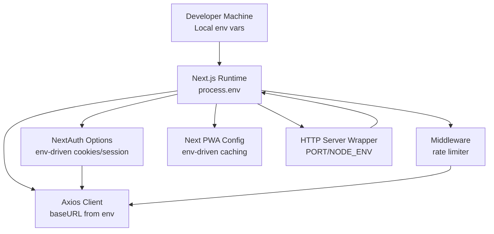
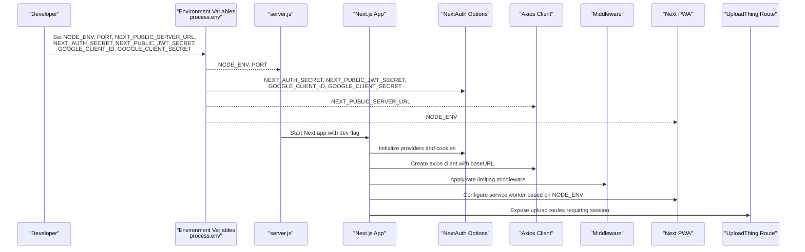
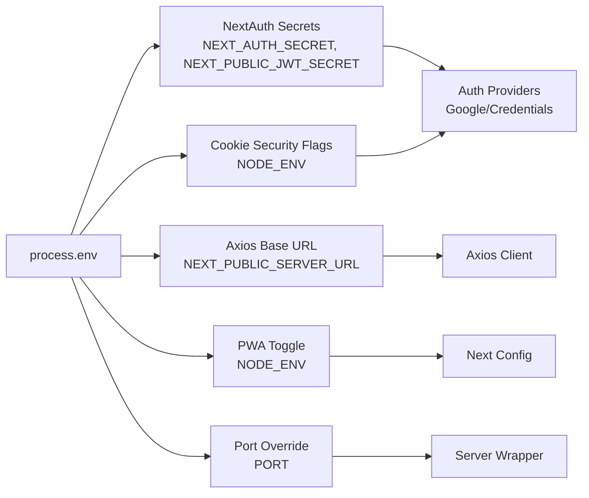

# Environment Management

<cite>
**Referenced Files in This Document**
- [package.json](file://package.json)
- [next.config.js](file://next.config.js)
- [server.js](file://server.js)
- [lib/auth-options.ts](file://lib/auth-options.ts)
- [http/axios.ts](file://http/axios.ts)
- [middleware.ts](file://middleware.ts)
- [lib/rate-limiter.ts](file://lib/rate-limiter.ts)
- [app/api/uploadthing/core.ts](file://app/api/uploadthing/core.ts)
- [app/api/uploadthing/route.ts](file://app/api/uploadthing/route.ts)
</cite>

## Table of Contents
1. [Introduction](#introduction)
2. [Project Structure](#project-structure)
3. [Core Components](#core-components)
4. [Architecture Overview](#architecture-overview)
5. [Detailed Component Analysis](#detailed-component-analysis)
6. [Dependency Analysis](#dependency-analysis)
7. [Performance Considerations](#performance-considerations)
8. [Troubleshooting Guide](#troubleshooting-guide)
9. [Conclusion](#conclusion)

## Introduction
This document describes environment management for Optim Bozor, focusing on how the application reads environment variables, sets up authentication and sessions, configures HTTP clients, applies middleware protections, and prepares the runtime for development and production. It also outlines differences between local development and production configurations, highlights environment-specific optimizations, and provides guidance on secrets management, configuration validation, and security considerations.

## Project Structure
Optim Bozor is a Next.js application with a client-side runtime and a small Node.js HTTP server wrapper. Configuration is primarily driven by environment variables exposed via process.env and Next.js configuration files. Authentication relies on NextAuth.js with provider-specific environment variables. HTTP requests are routed through an Axios client configured with a base URL derived from an environment variable. A global middleware enforces rate limiting, and UploadThing integrates with NextAuth for secure uploads.

**Diagram sources**
- [server.js:1-16](file://server.js#L1-L16)
- [next.config.js:1-35](file://next.config.js#L1-L35)
- [lib/auth-options.ts:1-128](file://lib/auth-options.ts#L1-L128)
- [http/axios.ts:1-10](file://http/axios.ts#L1-L10)
- [middleware.ts:1-26](file://middleware.ts#L1-L26)

**Section sources**
- [package.json:1-67](file://package.json#L1-L67)
- [next.config.js:1-35](file://next.config.js#L1-L35)
- [server.js:1-16](file://server.js#L1-L16)

## Core Components
- Environment variable sourcing
  - Port and environment detection are read from process.env in the server wrapper.
  - NextAuth.js reads provider credentials and cookie security flags from process.env.
  - The Axios client reads the backend base URL from NEXT_PUBLIC_SERVER_URL.
  - Next.js PWA configuration checks NODE_ENV to enable or disable service worker registration.
- Authentication and session cookies
  - Cookie names and security attributes (HttpOnly, Secure, SameSite) vary by environment.
  - JWT and session secrets are read from process.env for token signing and encryption.
- HTTP client configuration
  - Base URL is set from an environment variable; credentials are enabled with a fixed timeout.
- Middleware protection
  - A global middleware enforces rate limiting per IP using an in-memory map.
- UploadThing integration
  - Upload routes require a valid NextAuth session, enforced server-side.

**Section sources**
- [server.js:4-6](file://server.js#L4-L6)
- [lib/auth-options.ts:46-67](file://lib/auth-options.ts#L46-L67)
- [lib/auth-options.ts:124-127](file://lib/auth-options.ts#L124-L127)
- [http/axios.ts:3-9](file://http/axios.ts#L3-L9)
- [next.config.js:2-8](file://next.config.js#L2-L8)
- [middleware.ts:9-20](file://middleware.ts#L9-L20)
- [app/api/uploadthing/core.ts:12-18](file://app/api/uploadthing/core.ts#L12-L18)

## Architecture Overview
The environment-aware runtime ties together the server wrapper, Next.js configuration, authentication, HTTP client, middleware, and upload pipeline. The diagram below shows how environment variables influence each component.

**Diagram sources**
- [server.js:4-6](file://server.js#L4-L6)
- [lib/auth-options.ts:40-43](file://lib/auth-options.ts#L40-L43)
- [lib/auth-options.ts:124-127](file://lib/auth-options.ts#L124-L127)
- [http/axios.ts:3-9](file://http/axios.ts#L3-L9)
- [next.config.js:2-8](file://next.config.js#L2-L8)
- [middleware.ts:9-20](file://middleware.ts#L9-L20)
- [app/api/uploadthing/route.ts:1-7](file://app/api/uploadthing/route.ts#L1-L7)

## Detailed Component Analysis

### Environment Variable Setup and Secrets Management
- Required environment variables
  - Backend base URL: NEXT_PUBLIC_SERVER_URL
  - NextAuth secrets: NEXT_AUTH_SECRET, NEXT_PUBLIC_JWT_SECRET
  - OAuth provider credentials: GOOGLE_CLIENT_ID, GOOGLE_CLIENT_SECRET
  - Runtime: NODE_ENV, PORT
- Secrets handling
  - Secrets are read directly from process.env and used to configure authentication and session tokens.
  - Cookie security attributes (HttpOnly, Secure) are toggled based on NODE_ENV.
- Configuration files
  - next.config.js conditionally enables PWA registration based on NODE_ENV.
  - server.js reads PORT and NODE_ENV to determine dev mode and listen address.
- Validation and defaults
  - Missing environment variables are tolerated in code paths that accept empty strings, but missing secrets will break authentication.

**Section sources**
- [http/axios.ts:3](file://http/axios.ts#L3)
- [lib/auth-options.ts:40-43](file://lib/auth-options.ts#L40-L43)
- [lib/auth-options.ts:124-127](file://lib/auth-options.ts#L124-L127)
- [lib/auth-options.ts:46-67](file://lib/auth-options.ts#L46-L67)
- [next.config.js:2-8](file://next.config.js#L2-L8)
- [server.js:4-6](file://server.js#L4-L6)

### Local Development vs Production Differences
- Development
  - NODE_ENV is not "production"; PWA registration is disabled.
  - Cookies are not marked Secure; HttpOnly is applied where configured.
  - Port defaults to 3000 if not set.
- Production
  - NODE_ENV is "production"; PWA registration is enabled.
  - Cookies are marked Secure; HttpOnly is applied where configured.
  - Port is taken from environment; server logs readiness on localhost with the configured port.

**Section sources**
- [next.config.js:4](file://next.config.js#L4)
- [lib/auth-options.ts:48](file://lib/auth-options.ts#L48)
- [lib/auth-options.ts:50](file://lib/auth-options.ts#L50)
- [lib/auth-options.ts:56](file://lib/auth-options.ts#L56)
- [lib/auth-options.ts:61](file://lib/auth-options.ts#L61)
- [server.js:4-14](file://server.js#L4-L14)

### Database Connection Strings, API Endpoints, and External Services
- Backend base URL
  - The Axios client uses NEXT_PUBLIC_SERVER_URL as the base URL for API calls.
- Authentication endpoints
  - NextAuth handles OAuth and credential flows; endpoints are internal to NextAuth and depend on provider configurations.
- Upload service
  - UploadThing exposes routes under the app API surface and requires a valid NextAuth session.

**Section sources**
- [http/axios.ts:5-6](file://http/axios.ts#L5-L6)
- [lib/auth-options.ts:8-44](file://lib/auth-options.ts#L8-L44)
- [app/api/uploadthing/route.ts:4-6](file://app/api/uploadthing/route.ts#L4-L6)

### Environment-Specific Optimizations, Logging Levels, and Debugging Settings
- PWA caching
  - PWA caching is disabled during development and enabled in production via NODE_ENV.
- Request caching headers
  - Next.js adds cache-control headers for specific API routes to prevent caching.
- Rate limiting
  - Middleware enforces a per-IP rate limit using an in-memory map with a fixed window and threshold.
- Logging
  - The server wrapper logs readiness after preparation completes.

**Section sources**
- [next.config.js:4](file://next.config.js#L4)
- [next.config.js:20-31](file://next.config.js#L20-L31)
- [middleware.ts:9-20](file://middleware.ts#L9-L20)
- [server.js:12-14](file://server.js#L12-L14)

### Environment Switching and Configuration Validation
- Switching environments
  - Set NODE_ENV to "production" or "development" to toggle PWA registration and cookie security.
  - Set PORT to override the default listening port.
- Validation
  - Missing NEXT_PUBLIC_SERVER_URL will cause API calls to target an empty base URL.
  - Missing NextAuth secrets will prevent session creation and token signing.
  - Missing OAuth credentials will disable the respective provider.

**Section sources**
- [next.config.js:4](file://next.config.js#L4)
- [server.js:4-6](file://server.js#L4-L6)
- [http/axios.ts:3](file://http/axios.ts#L3)
- [lib/auth-options.ts:124-127](file://lib/auth-options.ts#L124-L127)
- [lib/auth-options.ts:40-43](file://lib/auth-options.ts#L40-L43)

### Security Considerations for Sensitive Data
- Secret storage
  - Store NEXT_AUTH_SECRET and NEXT_PUBLIC_JWT_SECRET in environment variables on deployment platforms.
  - Do not commit secrets to version control.
- Cookie security
  - In production, cookies are marked Secure and HttpOnly; ensure HTTPS termination at the edge or load balancer.
- Provider credentials
  - Keep GOOGLE_CLIENT_ID and GOOGLE_CLIENT_SECRET confidential and scoped appropriately.
- Transport security
  - Ensure NEXT_PUBLIC_SERVER_URL uses HTTPS in production to avoid mixed-content issues with cookies and APIs.

**Section sources**
- [lib/auth-options.ts:46-67](file://lib/auth-options.ts#L46-L67)
- [lib/auth-options.ts:124-127](file://lib/auth-options.ts#L124-L127)
- [http/axios.ts:3](file://http/axios.ts#L3)

## Dependency Analysis
The environment influences several subsystems. The diagram below shows how environment variables flow into each component.

**Diagram sources**
- [lib/auth-options.ts:40-43](file://lib/auth-options.ts#L40-L43)
- [lib/auth-options.ts:124-127](file://lib/auth-options.ts#L124-L127)
- [lib/auth-options.ts:46-67](file://lib/auth-options.ts#L46-L67)
- [http/axios.ts:3](file://http/axios.ts#L3)
- [next.config.js:4](file://next.config.js#L4)
- [server.js:4-6](file://server.js#L4-L6)

**Section sources**
- [lib/auth-options.ts:40-43](file://lib/auth-options.ts#L40-L43)
- [lib/auth-options.ts:124-127](file://lib/auth-options.ts#L124-L127)
- [http/axios.ts:3](file://http/axios.ts#L3)
- [next.config.js:4](file://next.config.js#L4)
- [server.js:4-6](file://server.js#L4-L6)

## Performance Considerations
- PWA caching
  - Disable PWA caching in development to avoid stale assets; enable in production for improved offline performance.
- Rate limiting
  - The middleware enforces a per-IP cap; tune thresholds and window size for production traffic patterns.
- HTTP timeouts
  - The Axios client has a fixed timeout; adjust if backend latency varies significantly.
- Image optimization
  - Remote image patterns are configured; ensure external hosts are reliable and fast.

**Section sources**
- [next.config.js:4](file://next.config.js#L4)
- [lib/rate-limiter.ts:6-7](file://lib/rate-limiter.ts#L6-L7)
- [http/axios.ts:8](file://http/axios.ts#L8)
- [next.config.js:11-16](file://next.config.js#L11-L16)

## Troubleshooting Guide
- Authentication fails
  - Verify NEXT_AUTH_SECRET and NEXT_PUBLIC_JWT_SECRET are set and correct.
  - Confirm provider credentials (GOOGLE_CLIENT_ID, GOOGLE_CLIENT_SECRET) are present.
- Session cookies not set securely
  - Ensure NODE_ENV is "production" so cookies are marked Secure.
- API requests fail
  - Confirm NEXT_PUBLIC_SERVER_URL is set and reachable.
- Too many requests
  - Review middleware rate limits and consider scaling thresholds for production.
- Uploads unauthorized
  - Ensure a valid NextAuth session exists before uploading.

**Section sources**
- [lib/auth-options.ts:124-127](file://lib/auth-options.ts#L124-L127)
- [lib/auth-options.ts:40-43](file://lib/auth-options.ts#L40-L43)
- [http/axios.ts:3](file://http/axios.ts#L3)
- [middleware.ts:9-20](file://middleware.ts#L9-L20)
- [app/api/uploadthing/core.ts:12-18](file://app/api/uploadthing/core.ts#L12-L18)

## Conclusion
Optim Bozor’s environment management centers on a small set of environment variables that drive authentication, HTTP client configuration, middleware behavior, and PWA activation. Correctly setting NODE_ENV, PORT, NEXT_PUBLIC_SERVER_URL, and NextAuth secrets ensures secure and predictable operation across development and production. The middleware and PWA settings provide practical performance and security controls tailored to each environment.