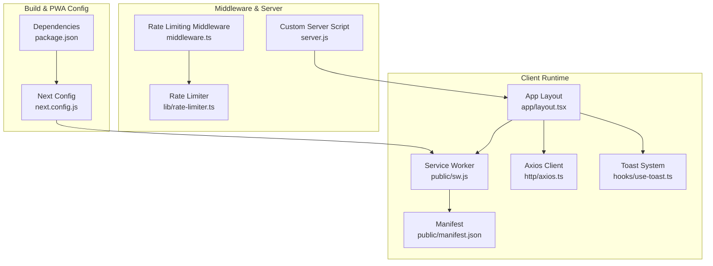
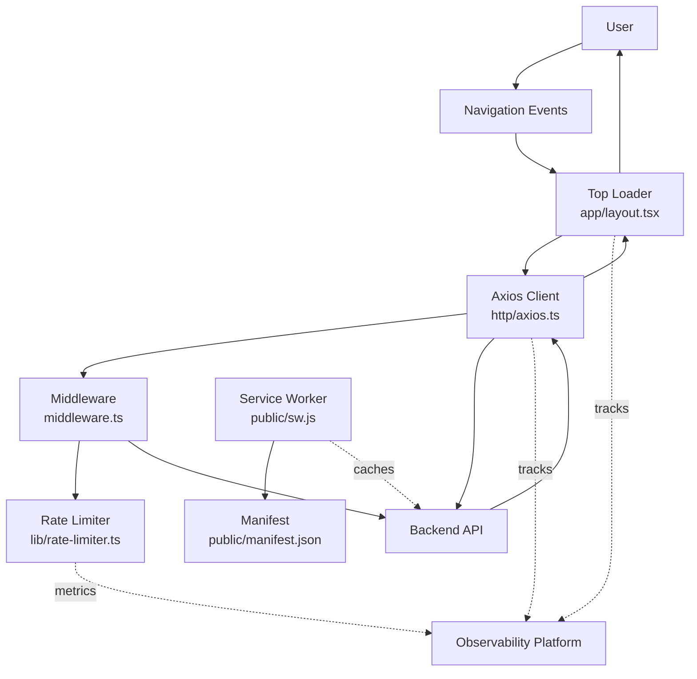
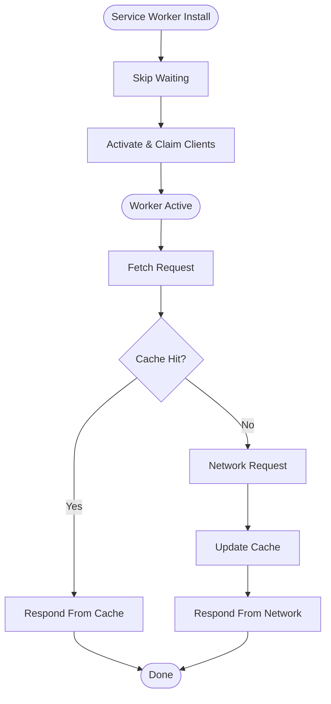
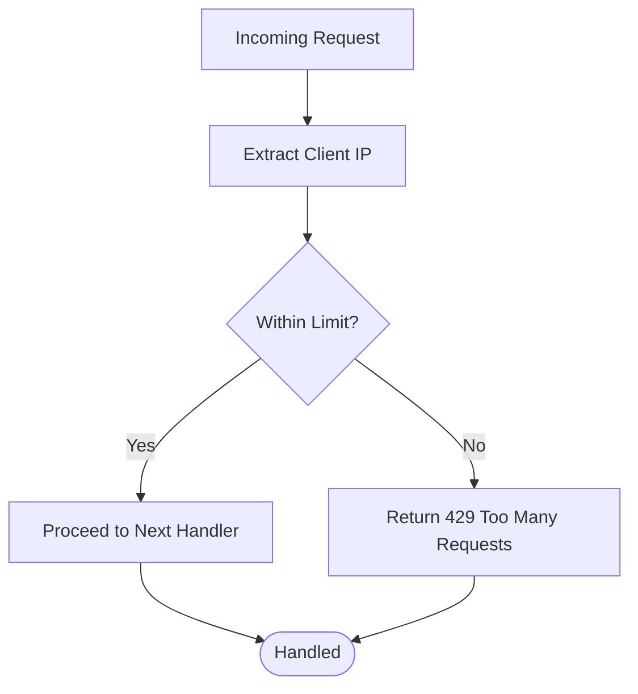
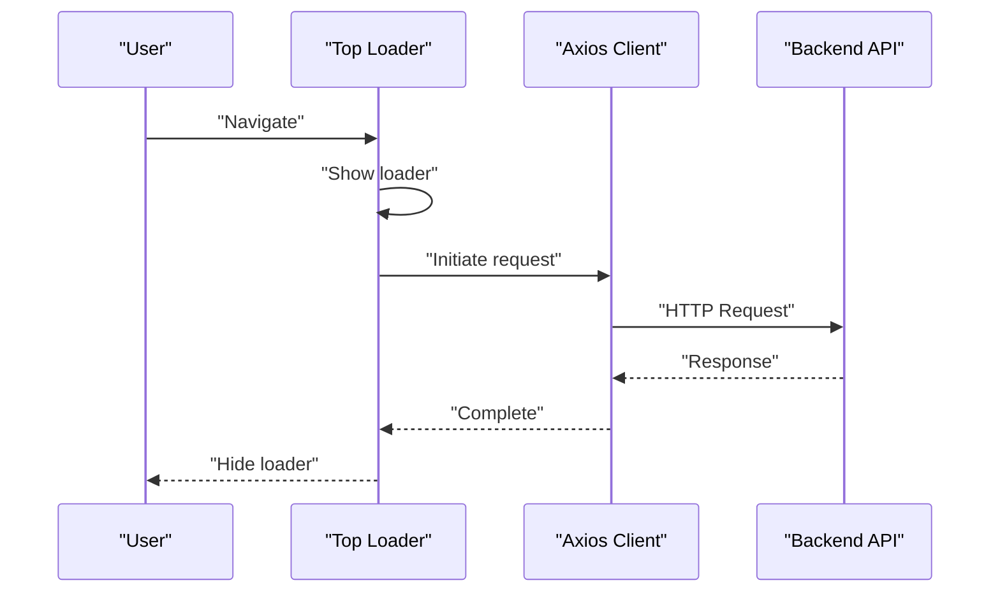
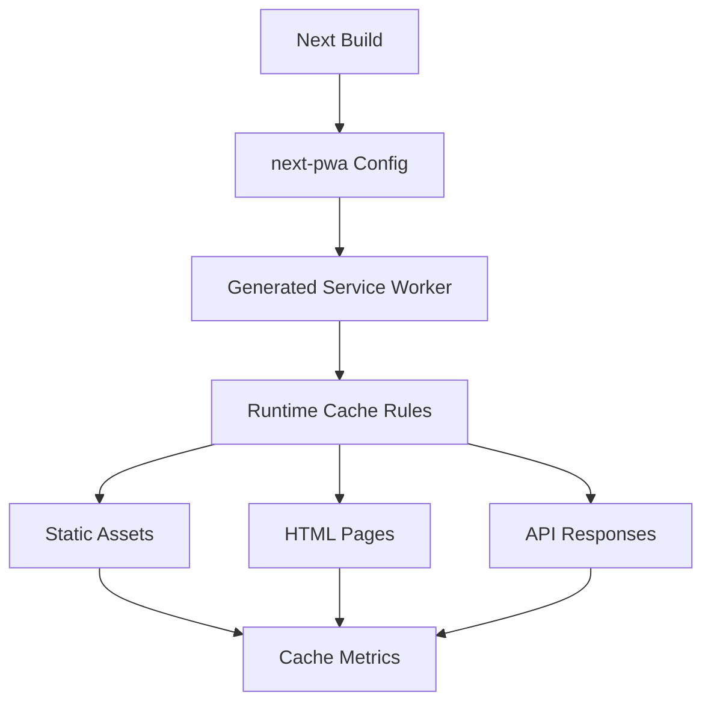
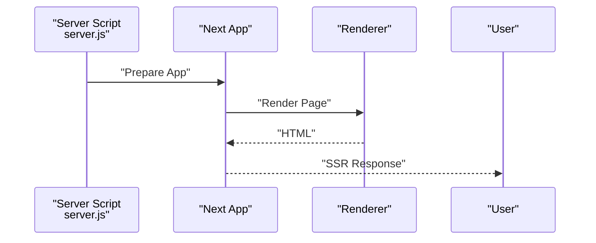
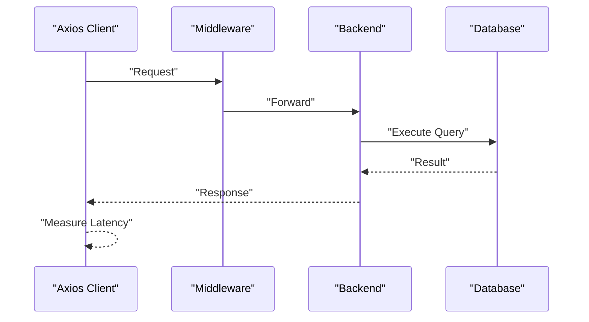
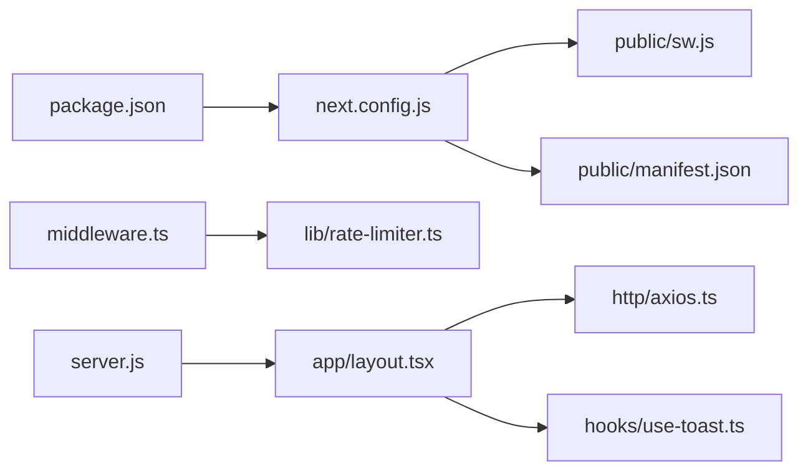

# Monitoring & Performance

<cite>
**Referenced Files in This Document**
- [package.json](file://package.json)
- [next.config.js](file://next.config.js)
- [public/manifest.json](file://public/manifest.json)
- [public/sw.js](file://public/sw.js)
- [middleware.ts](file://middleware.ts)
- [lib/rate-limiter.ts](file://lib/rate-limiter.ts)
- [server.js](file://server.js)
- [app/layout.tsx](file://app/layout.tsx)
- [components/providers/session.provider.tsx](file://components/providers/session.provider.tsx)
- [http/axios.ts](file://http/axios.ts)
- [hooks/use-toast.ts](file://hooks/use-toast.ts)
</cite>

## Table of Contents
1. [Introduction](#introduction)
2. [Project Structure](#project-structure)
3. [Core Components](#core-components)
4. [Architecture Overview](#architecture-overview)
5. [Detailed Component Analysis](#detailed-component-analysis)
6. [Dependency Analysis](#dependency-analysis)
7. [Performance Considerations](#performance-considerations)
8. [Troubleshooting Guide](#troubleshooting-guide)
9. [Conclusion](#conclusion)
10. [Appendices](#appendices)

## Introduction
This document provides comprehensive monitoring and performance guidance for Optim Bozor. It focuses on Progressive Web App (PWA) monitoring, service worker performance, offline functionality tracking, performance monitoring tools, error tracking integration, user experience metrics, caching strategies, performance budgets, Core Web Vitals tracking, server-side rendering performance optimization, API response time monitoring, database query performance, real-time dashboards, alerting systems, and performance regression detection.

## Project Structure
Optim Bozor is a Next.js application configured with PWA support via next-pwa, a lightweight service worker, and a global layout integrating top-loading indicators and toast notifications. Middleware enforces rate limiting, while a custom server script runs the Next.js app. The frontend integrates with a backend through an Axios client with a configurable timeout.

**Diagram sources**
- [app/layout.tsx:1-73](file://app/layout.tsx#L1-L73)
- [public/sw.js:1-7](file://public/sw.js#L1-L7)
- [public/manifest.json:1-61](file://public/manifest.json#L1-L61)
- [http/axios.ts:1-10](file://http/axios.ts#L1-L10)
- [hooks/use-toast.ts:1-192](file://hooks/use-toast.ts#L1-L192)
- [middleware.ts:1-26](file://middleware.ts#L1-L26)
- [lib/rate-limiter.ts:1-29](file://lib/rate-limiter.ts#L1-L29)
- [server.js:1-16](file://server.js#L1-L16)
- [next.config.js:1-35](file://next.config.js#L1-L35)
- [package.json:1-67](file://package.json#L1-L67)

**Section sources**
- [package.json:1-67](file://package.json#L1-L67)
- [next.config.js:1-35](file://next.config.js#L1-L35)
- [public/manifest.json:1-61](file://public/manifest.json#L1-L61)
- [public/sw.js:1-7](file://public/sw.js#L1-L7)
- [middleware.ts:1-26](file://middleware.ts#L1-L26)
- [lib/rate-limiter.ts:1-29](file://lib/rate-limiter.ts#L1-L29)
- [server.js:1-16](file://server.js#L1-L16)
- [app/layout.tsx:1-73](file://app/layout.tsx#L1-L73)
- [http/axios.ts:1-10](file://http/axios.ts#L1-L10)
- [hooks/use-toast.ts:1-192](file://hooks/use-toast.ts#L1-L192)

## Core Components
- PWA and Service Worker
  - PWA is enabled via next-pwa with a production-only registration and skipWaiting behavior. The service worker currently performs minimal lifecycle tasks (install and activate). The manifest defines app identity and icons.
  - Recommendations:
    - Define runtimeCaching in next.config.js for assets, API responses, and HTML to improve offline readiness and reduce network latency.
    - Instrument the service worker to emit performance metrics (cache hit ratio, activation duration, skipWaiting timing).
    - Track offline fallbacks and navigation preload usage.
- Rate Limiting Middleware
  - Implements sliding-window rate limiting keyed by client IP, returning 429 on overflow. This protects APIs and reduces load.
  - Recommendations:
    - Export rate-limit metrics (per-IP counters, window boundaries) to observability systems.
    - Integrate with external rate-limit storage (Redis) for distributed limits.
- Top Loader and Toast Notifications
  - NextTopLoader provides a visual indicator during navigation. Toast notifications are centralized via a custom hook with a bounded queue and delayed removal.
  - Recommendations:
    - Track navigation start/end events and combine with Top Loader visibility to derive Largest Contentful Paint (LCP) estimates.
    - Record toast interactions (dismiss, auto-close) to assess user experience impact.
- Axios Client and API Latency
  - Axios client sets a 15-second timeout and credentials inclusion. This helps detect slow endpoints and prevents hanging requests.
  - Recommendations:
    - Instrument request/response interceptors to capture per-endpoint latency, error rates, and retry counts.
    - Aggregate metrics by endpoint path and HTTP method.
- Custom Server Script
  - Runs Next.js with a standard HTTP server. Useful for attaching performance monitoring hooks at the Node.js level.
  - Recommendations:
    - Add startup profiling and memory metrics collection.
    - Monitor request throughput and error distribution at the Node layer.

**Section sources**
- [next.config.js:1-35](file://next.config.js#L1-L35)
- [public/sw.js:1-7](file://public/sw.js#L1-L7)
- [public/manifest.json:1-61](file://public/manifest.json#L1-L61)
- [middleware.ts:1-26](file://middleware.ts#L1-L26)
- [lib/rate-limiter.ts:1-29](file://lib/rate-limiter.ts#L1-L29)
- [app/layout.tsx:1-73](file://app/layout.tsx#L1-L73)
- [http/axios.ts:1-10](file://http/axios.ts#L1-L10)
- [hooks/use-toast.ts:1-192](file://hooks/use-toast.ts#L1-L192)
- [server.js:1-16](file://server.js#L1-L16)

## Architecture Overview
The monitoring architecture combines client-side instrumentation, middleware protection, and server-side metrics collection. The PWA stack supports offline scenarios, while the toast and loader components provide user-centric UX signals.

**Diagram sources**
- [app/layout.tsx:1-73](file://app/layout.tsx#L1-L73)
- [http/axios.ts:1-10](file://http/axios.ts#L1-L10)
- [middleware.ts:1-26](file://middleware.ts#L1-L26)
- [lib/rate-limiter.ts:1-29](file://lib/rate-limiter.ts#L1-L29)
- [public/sw.js:1-7](file://public/sw.js#L1-L7)
- [public/manifest.json:1-61](file://public/manifest.json#L1-L61)

## Detailed Component Analysis

### Service Worker and Offline Functionality
- Current state:
  - Minimal install/activate handlers; no runtime caching configuration.
- Recommended instrumentation:
  - Track activation lifecycle and skipWaiting timing.
  - Measure cache hit ratio and fallback behavior for offline routes.
  - Emit metrics for cache updates and stale-while-revalidate strategies.
- Implementation guidance:
  - Extend runtimeCaching in next.config.js to include static assets, API responses, and HTML.
  - Add a simple telemetry beacon to report offline mode transitions and cache misses.

**Diagram sources**
- [public/sw.js:1-7](file://public/sw.js#L1-L7)
- [next.config.js:1-35](file://next.config.js#L1-L35)

**Section sources**
- [public/sw.js:1-7](file://public/sw.js#L1-L7)
- [next.config.js:1-35](file://next.config.js#L1-L35)

### Rate Limiting and API Protection
- Current state:
  - Sliding-window rate limiter keyed by IP with a 60-second window and a threshold.
- Monitoring recommendations:
  - Expose counters for requests per IP and window boundaries.
  - Track 429 responses and correlate with backend load.
  - Consider exporting metrics to a metrics backend for alerting.
- Operational notes:
  - Middleware matches non-API paths and API/trpc routes; ensure consistent coverage.

**Diagram sources**
- [middleware.ts:1-26](file://middleware.ts#L1-L26)
- [lib/rate-limiter.ts:1-29](file://lib/rate-limiter.ts#L1-L29)

**Section sources**
- [middleware.ts:1-26](file://middleware.ts#L1-L26)
- [lib/rate-limiter.ts:1-29](file://lib/rate-limiter.ts#L1-L29)

### Client-Side Navigation and UX Metrics
- Top Loader:
  - Provides a visual indicator during navigation; can be correlated with navigation start/end to approximate LCP-like signals.
- Toast System:
  - Centralized toasts with bounded queue and delayed removal; useful for measuring user feedback and engagement.
- Recommendations:
  - Emit navigation timing and toast interaction metrics to analytics/backends.
  - Use toast dismissal patterns to infer user satisfaction.

**Diagram sources**
- [app/layout.tsx:1-73](file://app/layout.tsx#L1-L73)
- [http/axios.ts:1-10](file://http/axios.ts#L1-L10)

**Section sources**
- [app/layout.tsx:1-73](file://app/layout.tsx#L1-L73)
- [hooks/use-toast.ts:1-192](file://hooks/use-toast.ts#L1-L192)
- [http/axios.ts:1-10](file://http/axios.ts#L1-L10)

### PWA Caching Strategies and Performance Budgets
- Current state:
  - Manifest present; service worker minimal; next.config.js disables runtimeCaching by default.
- Recommendations:
  - Define runtimeCaching entries for:
    - Static assets: long-lived caching with versioned URLs.
    - HTML: short-lived or revalidating cache.
    - API responses: cache-first with background refresh for frequently accessed endpoints.
  - Enforce performance budgets:
    - Bundle size thresholds.
    - Largest Contentful Paint (LCP) targets.
    - First Input Delay (FID) targets.
- Tracking:
  - Measure cache hit ratios, eviction rates, and offline availability.
  - Correlate with Core Web Vitals via web vitals libraries.

**Diagram sources**
- [next.config.js:1-35](file://next.config.js#L1-L35)
- [public/manifest.json:1-61](file://public/manifest.json#L1-L61)
- [public/sw.js:1-7](file://public/sw.js#L1-L7)

**Section sources**
- [next.config.js:1-35](file://next.config.js#L1-L35)
- [public/manifest.json:1-61](file://public/manifest.json#L1-L61)
- [public/sw.js:1-7](file://public/sw.js#L1-L7)

### Server-Side Rendering and SSR Performance
- Current state:
  - Standard Next.js server script; no explicit SSR performance hooks.
- Recommendations:
  - Instrument page render durations and hydration times.
  - Track server-side request throughput and error rates.
  - Use profiling tools to identify heavy components and optimize rendering.

**Diagram sources**
- [server.js:1-16](file://server.js#L1-L16)

**Section sources**
- [server.js:1-16](file://server.js#L1-L16)

### API Response Time Monitoring and Database Query Performance
- Current state:
  - Axios client with 15-second timeout; middleware enforces rate limiting.
- Recommendations:
  - Add request/response interceptors to measure latency and error rates per endpoint.
  - Integrate with backend tracing to capture database query timings and slow queries.
  - Establish SLOs for response times and error budgets.

**Diagram sources**
- [http/axios.ts:1-10](file://http/axios.ts#L1-L10)
- [middleware.ts:1-26](file://middleware.ts#L1-L26)

**Section sources**
- [http/axios.ts:1-10](file://http/axios.ts#L1-L10)
- [middleware.ts:1-26](file://middleware.ts#L1-L26)

### Real-Time Dashboards, Alerting, and Regression Detection
- Recommendations:
  - Centralize metrics (navigation timings, toast interactions, API latencies, rate-limit violations, cache metrics).
  - Set up alerts for:
    - Increased error rates.
    - Elevated response times.
    - Dropped cache hit ratios.
    - Rate-limit overflows.
  - Use regression detection to flag performance drops across builds or deployments.

[No sources needed since this section provides general guidance]

## Dependency Analysis
- PWA and caching depend on next-pwa configuration and service worker presence.
- Rate limiting depends on middleware and an in-memory map; consider persistence for production.
- Client-side metrics depend on Top Loader and toast hooks.
- Server-side metrics depend on the custom server script and potential Node.js profiling integrations.

**Diagram sources**
- [package.json:1-67](file://package.json#L1-L67)
- [next.config.js:1-35](file://next.config.js#L1-L35)
- [public/sw.js:1-7](file://public/sw.js#L1-L7)
- [public/manifest.json:1-61](file://public/manifest.json#L1-L61)
- [middleware.ts:1-26](file://middleware.ts#L1-L26)
- [lib/rate-limiter.ts:1-29](file://lib/rate-limiter.ts#L1-L29)
- [app/layout.tsx:1-73](file://app/layout.tsx#L1-L73)
- [http/axios.ts:1-10](file://http/axios.ts#L1-L10)
- [hooks/use-toast.ts:1-192](file://hooks/use-toast.ts#L1-L192)
- [server.js:1-16](file://server.js#L1-L16)

**Section sources**
- [package.json:1-67](file://package.json#L1-L67)
- [next.config.js:1-35](file://next.config.js#L1-L35)
- [middleware.ts:1-26](file://middleware.ts#L1-L26)
- [lib/rate-limiter.ts:1-29](file://lib/rate-limiter.ts#L1-L29)
- [app/layout.tsx:1-73](file://app/layout.tsx#L1-L73)
- [http/axios.ts:1-10](file://http/axios.ts#L1-L10)
- [hooks/use-toast.ts:1-192](file://hooks/use-toast.ts#L1-L192)
- [server.js:1-16](file://server.js#L1-L16)

## Performance Considerations
- PWA caching:
  - Define runtimeCaching to reduce network requests and enable offline experiences.
  - Monitor cache hit ratios and eviction behavior.
- Navigation and UX:
  - Use Top Loader visibility and toast interactions to approximate LCP and FID.
  - Keep toast queues bounded to avoid UI thrashing.
- API performance:
  - Enforce timeouts and instrument latency per endpoint.
  - Apply rate limiting to protect backend resources.
- SSR:
  - Track render durations and hydration times; optimize heavy pages.
- Observability:
  - Centralize metrics and set SLOs/alerts for performance regressions.

[No sources needed since this section provides general guidance]

## Troubleshooting Guide
- Service Worker not updating:
  - Verify skipWaiting and clients.claim are active; check browser devtools Application tab for registered service workers.
- Offline mode not working:
  - Confirm runtimeCaching is configured; test cache population and fallback behavior.
- High 429 errors:
  - Review rate limiter thresholds and IP extraction logic; consider external storage for distributed limits.
- Slow API responses:
  - Inspect Axios interceptors and backend tracing; focus on slowest endpoints and database queries.
- Toast spam or delays:
  - Ensure bounded queue and proper dismissal timers; avoid excessive toast creation.

**Section sources**
- [public/sw.js:1-7](file://public/sw.js#L1-L7)
- [next.config.js:1-35](file://next.config.js#L1-L35)
- [middleware.ts:1-26](file://middleware.ts#L1-L26)
- [lib/rate-limiter.ts:1-29](file://lib/rate-limiter.ts#L1-L29)
- [http/axios.ts:1-10](file://http/axios.ts#L1-L10)
- [hooks/use-toast.ts:1-192](file://hooks/use-toast.ts#L1-L192)

## Conclusion
Optim Bozor’s current setup provides a solid foundation for monitoring and performance with PWA support, middleware protection, and client-side UX instrumentation. To achieve comprehensive observability, integrate runtimeCaching, instrument service worker performance, track API latencies, and establish real-time dashboards with alerting and regression detection. These enhancements will improve reliability, user experience, and operational insights.

[No sources needed since this section summarizes without analyzing specific files]

## Appendices
- Monitoring checklist:
  - PWA caching rules defined and tested.
  - Service worker metrics emitted (activation, cache hits).
  - API latency and error rate dashboards.
  - Rate-limit metrics and alerts.
  - Core Web Vitals tracked via web vitals libraries.
  - SSR render time and hydration metrics captured.
  - Database query performance monitored and optimized.

[No sources needed since this section provides general guidance]