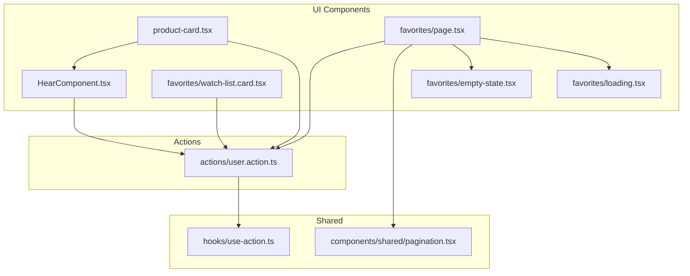
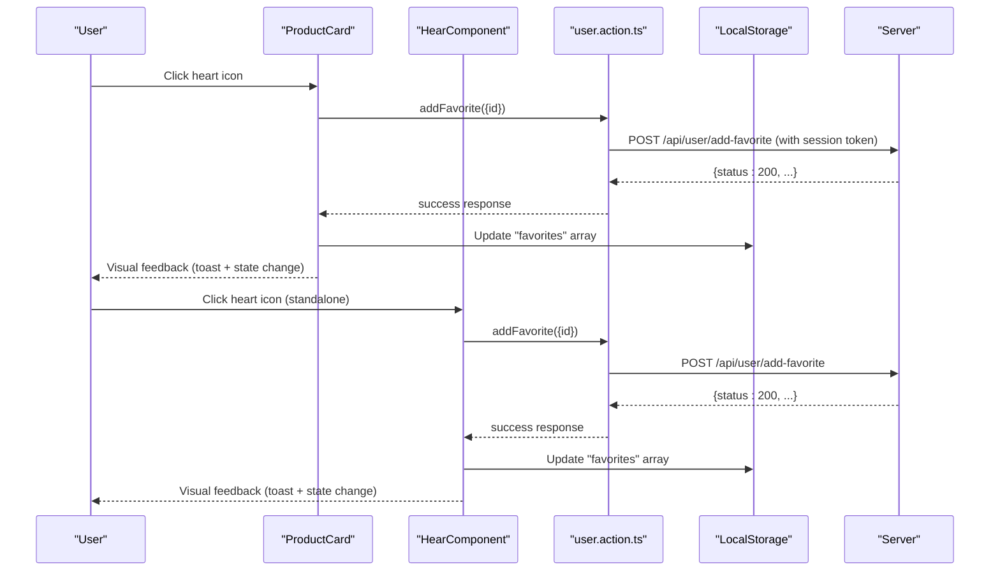
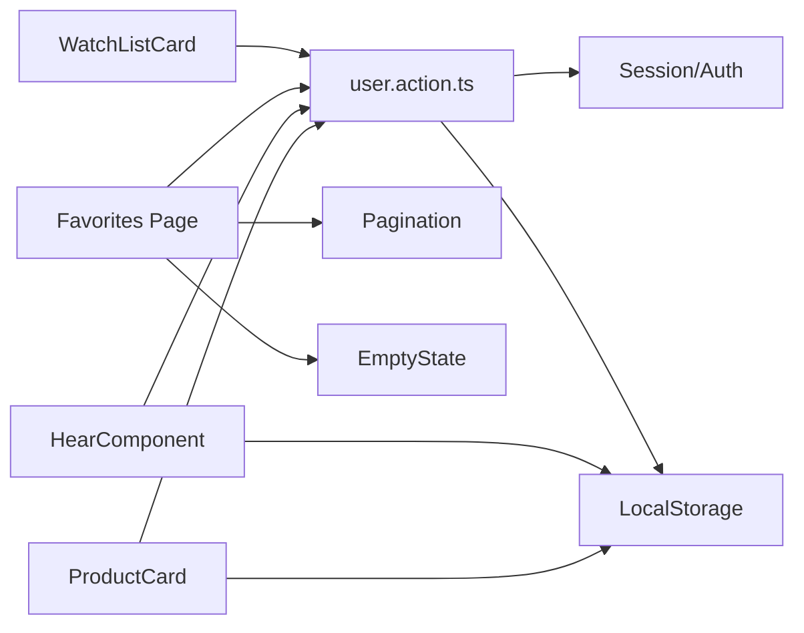

# Favorites System

<cite>
**Referenced Files in This Document**
- [HearComponent.tsx](file://app/(root)/_components/HearComponent.tsx)
- [product-card.tsx](file://app/(root)/_components/product-card.tsx)
- [page.tsx](file://app/(root)/favorites/page.tsx)
- [watch-list.card.tsx](file://app/(root)/favorites/watch-list.card.tsx)
- [empty-state.tsx](file://app/(root)/favorites/empty-state.tsx)
- [loading.tsx](file://app/(root)/favorites/loading.tsx)
- [user.action.ts](file://actions/user.action.ts)
- [pagination.tsx](file://components/shared/pagination.tsx)
- [use-action.ts](file://hooks/use-action.ts)
- [index.ts](file://types/index.ts)
</cite>

## Table of Contents
1. [Introduction](#introduction)
2. [Project Structure](#project-structure)
3. [Core Components](#core-components)
4. [Architecture Overview](#architecture-overview)
5. [Detailed Component Analysis](#detailed-component-analysis)
6. [Dependency Analysis](#dependency-analysis)
7. [Performance Considerations](#performance-considerations)
8. [Troubleshooting Guide](#troubleshooting-guide)
9. [Conclusion](#conclusion)

## Introduction
This document explains Optim Bozor’s favorites management system. It covers how users add and remove favorites, how local storage persists user preferences, and how server-side synchronization works for authenticated users. It also documents the heart icon component behavior, visual feedback, and state management. The favorites page implementation is described with empty state handling, loading states, and product listing display. We explain the integration with the product catalog, user session management, and data consistency between local and server favorites. Finally, we outline user experience patterns for adding/removing favorites and the relationship with the shopping cart, along with performance optimization strategies for large favorites collections and cleanup approaches.

## Project Structure
The favorites system spans several UI components and server actions:
- Heart icon components for adding/removing favorites in product listings and standalone contexts
- Favorites page for browsing and managing saved items
- Server actions orchestrating authenticated requests to the backend
- Shared pagination and toast utilities for UX consistency

**Diagram sources**
- [HearComponent.tsx](file://app/(root)/_components/HearComponent.tsx#L1-L60)
- [product-card.tsx](file://app/(root)/_components/product-card.tsx#L1-L242)
- [page.tsx](file://app/(root)/favorites/page.tsx#L1-L57)
- [watch-list.card.tsx](file://app/(root)/favorites/watch-list.card.tsx#L1-L83)
- [empty-state.tsx](file://app/(root)/favorites/empty-state.tsx#L1-L83)
- [loading.tsx](file://app/(root)/favorites/loading.tsx#L1-L14)
- [user.action.ts:86-119](file://actions/user.action.ts#L86-L119)
- [pagination.tsx:1-57](file://components/shared/pagination.tsx#L1-L57)
- [use-action.ts:1-16](file://hooks/use-action.ts#L1-L16)

**Section sources**
- [HearComponent.tsx](file://app/(root)/_components/HearComponent.tsx#L1-L60)
- [product-card.tsx](file://app/(root)/_components/product-card.tsx#L1-L242)
- [page.tsx](file://app/(root)/favorites/page.tsx#L1-L57)
- [watch-list.card.tsx](file://app/(root)/favorites/watch-list.card.tsx#L1-L83)
- [empty-state.tsx](file://app/(root)/favorites/empty-state.tsx#L1-L83)
- [loading.tsx](file://app/(root)/favorites/loading.tsx#L1-L14)
- [user.action.ts:86-119](file://actions/user.action.ts#L86-L119)
- [pagination.tsx:1-57](file://components/shared/pagination.tsx#L1-L57)
- [use-action.ts:1-16](file://hooks/use-action.ts#L1-L16)

## Core Components
- Heart icon component for quick add/remove favorites with immediate visual feedback and optimistic updates
- Product card with integrated favorites toggle and cart actions
- Favorites page with server-driven listing, pagination, and empty state
- Server actions for authenticated favorites CRUD operations and data fetching
- Shared utilities for pagination and action state management

Key responsibilities:
- Local persistence: maintain a “favorites” array in browser local storage
- Server sync: authenticated add/remove favorites via server actions
- UI state: loading states, error handling, and toast notifications
- Favorites page: search/filter/query params, pagination, and empty state rendering

**Section sources**
- [HearComponent.tsx](file://app/(root)/_components/HearComponent.tsx#L1-L60)
- [product-card.tsx](file://app/(root)/_components/product-card.tsx#L1-L242)
- [page.tsx](file://app/(root)/favorites/page.tsx#L1-L57)
- [watch-list.card.tsx](file://app/(root)/favorites/watch-list.card.tsx#L1-L83)
- [user.action.ts:86-119](file://actions/user.action.ts#L86-L119)
- [pagination.tsx:1-57](file://components/shared/pagination.tsx#L1-L57)
- [use-action.ts:1-16](file://hooks/use-action.ts#L1-L16)

## Architecture Overview
The system follows a client-side UI with server actions for authenticated operations. Local storage is used for immediate UI responsiveness, while server actions ensure data consistency for logged-in users.

**Diagram sources**
- [product-card.tsx](file://app/(root)/_components/product-card.tsx#L36-L61)
- [HearComponent.tsx](file://app/(root)/_components/HearComponent.tsx#L19-L40)
- [user.action.ts:98-119](file://actions/user.action.ts#L98-L119)
- [use-action.ts:1-16](file://hooks/use-action.ts#L1-L16)

## Detailed Component Analysis

### Heart Icon Component (Standalone)
Behavior:
- Reads local storage to set initial favorite state
- On click, disables UI during async operation, calls server action, handles errors, and updates local storage optimistically
- Uses a shared hook for loading/error state and toast notifications

Visual feedback:
- Changes button style and heart fill based on favorite state
- Shows success toast on add
- Disables interaction during loading

State management:
- Tracks favorite state locally
- Updates local storage synchronously after successful server response

Integration:
- Depends on server action for authenticated add
- Uses shared hook for consistent UX

**Section sources**
- [HearComponent.tsx](file://app/(root)/_components/HearComponent.tsx#L8-L56)
- [user.action.ts:98-119](file://actions/user.action.ts#L98-L119)
- [use-action.ts:1-16](file://hooks/use-action.ts#L1-L16)

### Product Card Favorite Toggle
Behavior:
- Initializes favorite state from local storage
- Calls server action to add favorite on click
- Updates local storage and UI state upon success
- Provides visual feedback via toast and button styling

UX patterns:
- Hover animations and button scaling for interactivity
- Immediate UI update for perceived performance
- Consistent error handling and loading states

**Section sources**
- [product-card.tsx](file://app/(root)/_components/product-card.tsx#L29-L61)
- [user.action.ts:98-119](file://actions/user.action.ts#L98-L119)
- [use-action.ts:1-16](file://hooks/use-action.ts#L1-L16)

### Favorites Page
Responsibilities:
- Fetches favorites from server via server action with support for search, filters, pagination
- Renders product cards in a responsive grid
- Displays empty state when no favorites are present
- Integrates pagination for navigating large collections

Data flow:
- Server action returns products and pagination flags
- Page renders cards and pagination controls
- Empty state component provides CTA to browse products

**Section sources**
- [page.tsx](file://app/(root)/favorites/page.tsx#L12-L54)
- [user.action.ts:86-96](file://actions/user.action.ts#L86-L96)
- [watch-list.card.tsx](file://app/(root)/favorites/watch-list.card.tsx#L19-L83)
- [empty-state.tsx](file://app/(root)/favorites/empty-state.tsx#L13-L82)
- [pagination.tsx:13-54](file://components/shared/pagination.tsx#L13-L54)

### Watch List Card (Favorites Page Item)
Behavior:
- Displays product image, title, and formatted price
- Provides a delete button to remove items from favorites
- Calls server action to delete favorite and updates local storage

UX:
- Link to product detail page
- Immediate visual feedback on delete
- Responsive grid layout

**Section sources**
- [watch-list.card.tsx](file://app/(root)/favorites/watch-list.card.tsx#L19-L83)
- [user.action.ts:279-294](file://actions/user.action.ts#L279-L294)

### Empty State Component
Purpose:
- Renders a friendly empty state with optional illustration and call-to-action
- Encourages users to explore products when favorites list is empty

**Section sources**
- [empty-state.tsx](file://app/(root)/favorites/empty-state.tsx#L13-L82)

### Loading State for Favorites Page
Purpose:
- Provides a skeleton-like layout while the page loads
- Maintains consistent spacing and structure

**Section sources**
- [loading.tsx](file://app/(root)/favorites/loading.tsx#L3-L13)

### Server Actions for Favorites
Endpoints and responsibilities:
- Fetch favorites: authenticated GET favorites with pagination and filters
- Add favorite: authenticated POST to add a product to favorites
- Delete favorite: authenticated DELETE to remove a product from favorites

Session and caching:
- Uses NextAuth session and generates token for protected routes
- Revalidates cached paths to reflect UI updates

**Section sources**
- [user.action.ts:86-96](file://actions/user.action.ts#L86-L96)
- [user.action.ts:98-119](file://actions/user.action.ts#L98-L119)
- [user.action.ts:279-294](file://actions/user.action.ts#L279-L294)

### Pagination Utility
Behavior:
- Builds new URLs with updated page parameter
- Navigates without full reloads for smooth UX
- Handles prev/next buttons and disabled states

**Section sources**
- [pagination.tsx:13-54](file://components/shared/pagination.tsx#L13-L54)

### Action Hook for UI State
Responsibilities:
- Manages loading state for async operations
- Centralizes error toast handling

**Section sources**
- [use-action.ts:4-12](file://hooks/use-action.ts#L4-L12)

## Dependency Analysis
The favorites system exhibits clear separation of concerns:
- UI components depend on server actions for authenticated operations
- Server actions depend on session management and token generation
- Local storage is used for optimistic UI updates
- Shared utilities provide consistent UX patterns

**Diagram sources**
- [product-card.tsx](file://app/(root)/_components/product-card.tsx#L1-L242)
- [HearComponent.tsx](file://app/(root)/_components/HearComponent.tsx#L1-L60)
- [page.tsx](file://app/(root)/favorites/page.tsx#L1-L57)
- [watch-list.card.tsx](file://app/(root)/favorites/watch-list.card.tsx#L1-L83)
- [user.action.ts:1-295](file://actions/user.action.ts#L1-L295)
- [pagination.tsx:1-57](file://components/shared/pagination.tsx#L1-L57)

**Section sources**
- [product-card.tsx](file://app/(root)/_components/product-card.tsx#L1-L242)
- [HearComponent.tsx](file://app/(root)/_components/HearComponent.tsx#L1-L60)
- [page.tsx](file://app/(root)/favorites/page.tsx#L1-L57)
- [watch-list.card.tsx](file://app/(root)/favorites/watch-list.card.tsx#L1-L83)
- [user.action.ts:1-295](file://actions/user.action.ts#L1-L295)
- [pagination.tsx:1-57](file://components/shared/pagination.tsx#L1-L57)

## Performance Considerations
- Optimize rendering for large favorites lists:
  - Keep product cards lightweight and lazy-load images
  - Use virtualized lists for very large collections
- Minimize re-renders:
  - Memoize product cards and avoid unnecessary prop drilling
- Efficient pagination:
  - Fetch only required pages and cache results per session
- Local storage efficiency:
  - Batch updates and avoid frequent writes
- Token reuse:
  - Reuse generated tokens within a short window to reduce overhead
- Server-side pagination:
  - Ensure backend supports efficient filtering and sorting

[No sources needed since this section provides general guidance]

## Troubleshooting Guide
Common issues and resolutions:
- Favorites not persisting after refresh:
  - Verify local storage key and parsing logic
  - Confirm server action updates are reflected in UI state
- Add/remove actions failing silently:
  - Check server action error handling and toast messages
  - Ensure session availability and token generation
- Empty state not appearing:
  - Confirm server action returns empty product list
  - Validate favorites page rendering logic
- Pagination not working:
  - Verify URL parameter handling and navigation logic
- Visual feedback not updating:
  - Ensure loading state toggles and UI state updates occur after server response

**Section sources**
- [use-action.ts:7-12](file://hooks/use-action.ts#L7-L12)
- [page.tsx](file://app/(root)/favorites/page.tsx#L26-L34)
- [pagination.tsx:17-31](file://components/shared/pagination.tsx#L17-L31)

## Conclusion
Optim Bozor’s favorites system combines immediate local feedback with authenticated server synchronization. Heart icon components provide intuitive interactions, while the favorites page offers robust browsing capabilities with pagination and empty states. Server actions manage session-aware CRUD operations, ensuring data consistency for logged-in users. By following the outlined UX patterns and performance strategies, the system remains responsive and scalable even with large favorites collections.