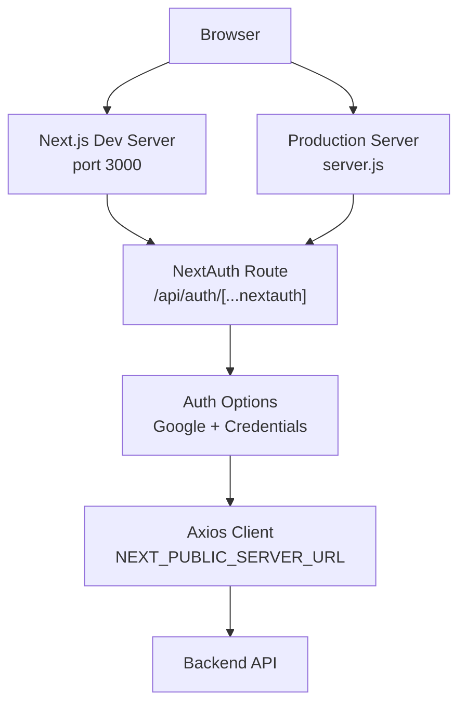

# Getting Started

<cite>
**Referenced Files in This Document**
- [package.json](file://package.json)
- [README.md](file://README.md)
- [next.config.js](file://next.config.js)
- [server.js](file://server.js)
- [lib/auth-options.ts](file://lib/auth-options.ts)
- [app/api/auth/[...nextauth]/route.ts](file://app/api/auth/[...nextauth]/route.ts)
- [http/axios.ts](file://http/axios.ts)
- [actions/auth.action.ts](file://actions/auth.action.ts)
- [middleware.ts](file://middleware.ts)
- [tsconfig.json](file://tsconfig.json)
- [tailwind.config.ts](file://tailwind.config.ts)
- [postcss.config.mjs](file://postcss.config.mjs)
</cite>

## Table of Contents
1. [Introduction](#introduction)
2. [Prerequisites](#prerequisites)
3. [Installation](#installation)
4. [Development Workflow](#development-workflow)
5. [Environment Variables](#environment-variables)
6. [Production Build and Deployment](#production-build-and-deployment)
7. [Architecture Overview](#architecture-overview)
8. [Troubleshooting Guide](#troubleshooting-guide)
9. [Verification Checklist](#verification-checklist)
10. [Conclusion](#conclusion)

## Introduction
Optim Bozor is a modern online marketplace platform built with Next.js and React. This guide helps you set up the development environment, configure authentication providers, prepare for production, and troubleshoot common issues.

## Prerequisites
Before installing Optim Bozor, ensure your system meets the following requirements:
- Node.js version: The project uses Next.js 14.2.18 and requires a compatible Node.js version. Based on the TypeScript target and Next.js version, use a recent LTS version of Node.js (e.g., 18.x or 20.x).
- Package manager: Either npm or yarn is supported. The scripts in the project are configured for npm commands.
- Operating system: Windows, macOS, or Linux.

Key indicators from the repository:
- Next.js version and related dependencies are defined in the package manifest.
- TypeScript compiler options target ES2017, indicating compatibility with modern Node.js versions.
- Tailwind CSS and PostCSS are configured for styling and build pipeline support.

**Section sources**
- [package.json:11-54](file://package.json#L11-L54)
- [tsconfig.json:3](file://tsconfig.json#L3)
- [package.json:55-65](file://package.json#L55-L65)

## Installation
Follow these steps to install and set up the project locally:

1. Clone the repository to your local machine.
2. Navigate to the project directory.
3. Install dependencies using your preferred package manager:
   - With npm: npm install
   - With yarn: yarn install
4. Verify the installation by checking that node_modules is populated and package-lock.json or yarn.lock exists.

Notes:
- The project uses Next.js and several UI libraries. Installing dependencies ensures the frontend stack is ready.
- If you encounter permission errors during installation, use your package manager’s appropriate resolution (e.g., --legacy-peer-deps for npm or yarn with --network-concurrency).

**Section sources**
- [package.json:1-10](file://package.json#L1-L10)

## Development Workflow
Start the development server with the following command:
- npm run dev

What happens:
- The development server runs on port 3000 by default. If you need to change the port, set the PORT environment variable before starting the server.
- The server.js file reads the PORT environment variable and starts the Next.js app in development mode.

Port configuration:
- Set the PORT environment variable to customize the listening port.
- The server logs the URL after the server is ready.

**Section sources**
- [server.js:4](file://server.js#L4)
- [server.js:12-14](file://server.js#L12-L14)

## Environment Variables
Optim Bozor relies on environment variables for authentication, session secrets, and backend communication. Configure the following variables in your environment:

- Authentication providers (Google OAuth):
  - GOOGLE_CLIENT_ID: Your Google OAuth client ID
  - GOOGLE_CLIENT_SECRET: Your Google OAuth client secret

- Session and JWT:
  - NEXT_PUBLIC_JWT_SECRET: Secret used to sign JWT tokens (frontend)
  - NEXT_AUTH_SECRET: Secret used by NextAuth (backend)

- Backend API base URL:
  - NEXT_PUBLIC_SERVER_URL: Base URL for the backend API (used by the frontend)

- Optional:
  - NODE_ENV: Set to development or production as needed.

Where these are used:
- Google OAuth provider configuration is loaded from environment variables in the authentication options.
- NextAuth options use the JWT and session secrets for secure sessions.
- The Axios client uses the server URL to communicate with the backend API.

**Section sources**
- [lib/auth-options.ts:40-43](file://lib/auth-options.ts#L40-L43)
- [lib/auth-options.ts:124-126](file://lib/auth-options.ts#L124-L126)
- [http/axios.ts:3](file://http/axios.ts#L3)

## Production Build and Deployment
Prepare the project for production with the following steps:

1. Build the project:
   - npm run build
   - This compiles the Next.js application and prepares static assets.

2. Start the production server:
   - npm start
   - This uses server.js to serve the built application.

3. PWA caching:
   - The Next.js configuration enables PWA caching in production. During development, PWA registration is disabled.

4. Middleware:
   - The rate limiter middleware is active and affects all routes except static assets and the Next.js internals.

5. Image optimization:
   - The Next.js configuration allows images from specific remote hosts and sets strict mode and minification.

6. Tailwind CSS:
   - Tailwind is configured via tailwind.config.ts and integrated with UploadThing utilities.

7. TypeScript:
   - The project targets ES2017 and uses bundler module resolution for TypeScript.

**Section sources**
- [package.json:7](file://package.json#L7)
- [server.js:1](file://server.js#L1)
- [next.config.js:2-8](file://next.config.js#L2-L8)
- [next.config.js:10-32](file://next.config.js#L10-L32)
- [middleware.ts:9-20](file://middleware.ts#L9-L20)
- [tailwind.config.ts:1](file://tailwind.config.ts#L1)
- [postcss.config.mjs:1](file://postcss.config.mjs#L1)
- [tsconfig.json:10-13](file://tsconfig.json#L10-L13)

## Architecture Overview
The following diagram shows how the frontend components, authentication, and API routes interact during development and production.

**Diagram sources**
- [server.js:1](file://server.js#L1)
- [app/api/auth/[...nextauth]/route.ts:1](file://app/api/auth/[...nextauth]/route.ts#L1)
- [lib/auth-options.ts:8](file://lib/auth-options.ts#L8)
- [http/axios.ts:5](file://http/axios.ts#L5)

## Troubleshooting Guide
Common setup and runtime issues:

- Port conflicts:
  - Symptom: Port 3000 already in use.
  - Fix: Set a different port via the PORT environment variable before running the dev server.

- Missing environment variables:
  - Symptom: Authentication provider fails or session errors occur.
  - Fix: Ensure GOOGLE_CLIENT_ID, GOOGLE_CLIENT_SECRET, NEXT_PUBLIC_JWT_SECRET, NEXT_AUTH_SECRET, and NEXT_PUBLIC_SERVER_URL are set.

- Backend connectivity:
  - Symptom: API calls fail or return errors.
  - Fix: Verify NEXT_PUBLIC_SERVER_URL points to a reachable backend endpoint.

- Rate limiting:
  - Symptom: Requests receive 429 Too Many Requests.
  - Fix: The rate limiter middleware restricts traffic per IP. Adjust or bypass temporarily for testing.

- PWA behavior:
  - Symptom: PWA caching appears in development.
  - Fix: PWA registration is intentionally disabled in development mode by the Next.js configuration.

- TypeScript/Module resolution:
  - Symptom: Import errors or bundling issues.
  - Fix: Ensure your editor recognizes the tsconfig paths and bundler module resolution settings.

**Section sources**
- [server.js:4](file://server.js#L4)
- [lib/auth-options.ts:40-43](file://lib/auth-options.ts#L40-L43)
- [http/axios.ts:3](file://http/axios.ts#L3)
- [middleware.ts:12-17](file://middleware.ts#L12-L17)
- [next.config.js:4](file://next.config.js#L4)
- [tsconfig.json:11](file://tsconfig.json#L11)

## Verification Checklist
After completing setup, verify the installation:

- Development server:
  - Run npm run dev and confirm the server starts on the expected port.
- Authentication:
  - Test Google OAuth login flow and credential-based login via the authentication route.
- API connectivity:
  - Confirm axios client uses NEXT_PUBLIC_SERVER_URL and API endpoints respond.
- Production build:
  - Run npm run build and then npm start to ensure the production server works.
- Middleware:
  - Verify rate limiting behavior under load.
- Styling:
  - Confirm Tailwind CSS and UploadThing utilities are applied.

**Section sources**
- [package.json:5](file://package.json#L5)
- [app/api/auth/[...nextauth]/route.ts:1](file://app/api/auth/[...nextauth]/route.ts#L1)
- [http/axios.ts:3](file://http/axios.ts#L3)
- [package.json:7](file://package.json#L7)
- [middleware.ts:9-20](file://middleware.ts#L9-L20)
- [tailwind.config.ts:1](file://tailwind.config.ts#L1)

## Conclusion
You now have the essential steps to install, configure, and run Optim Bozor locally, integrate authentication providers, and prepare for production deployment. Use the verification checklist to ensure everything is working as expected, and consult the troubleshooting section for common issues.