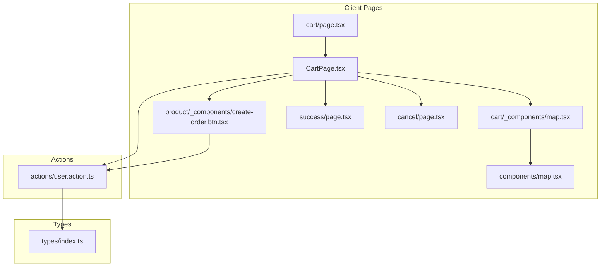
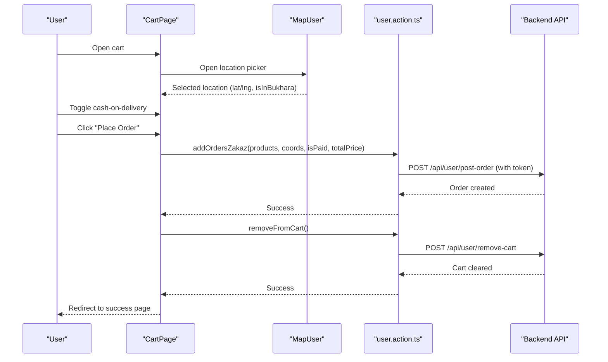
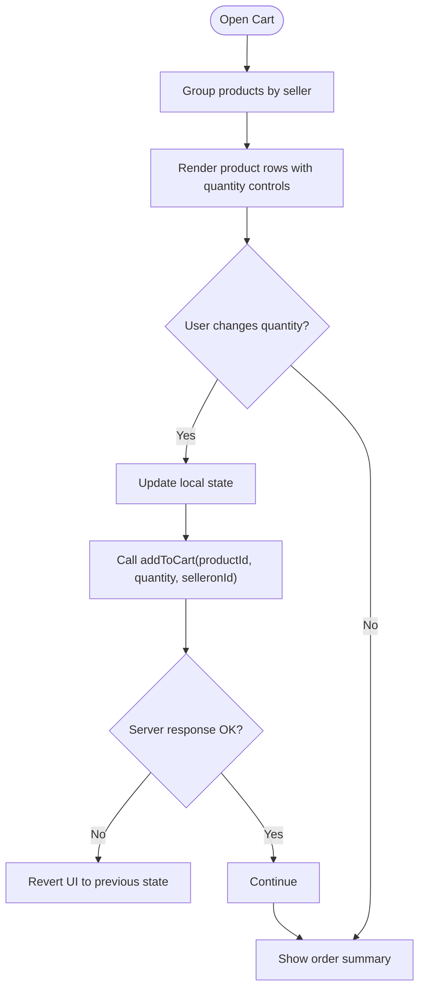
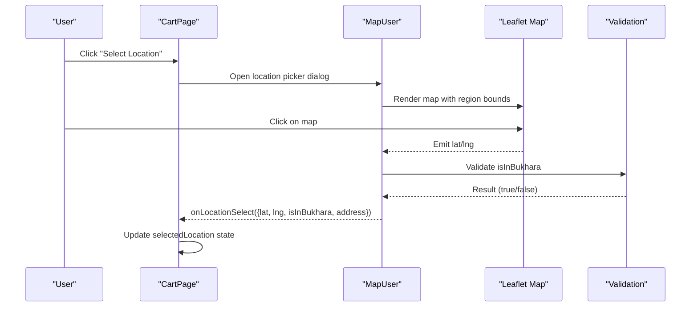
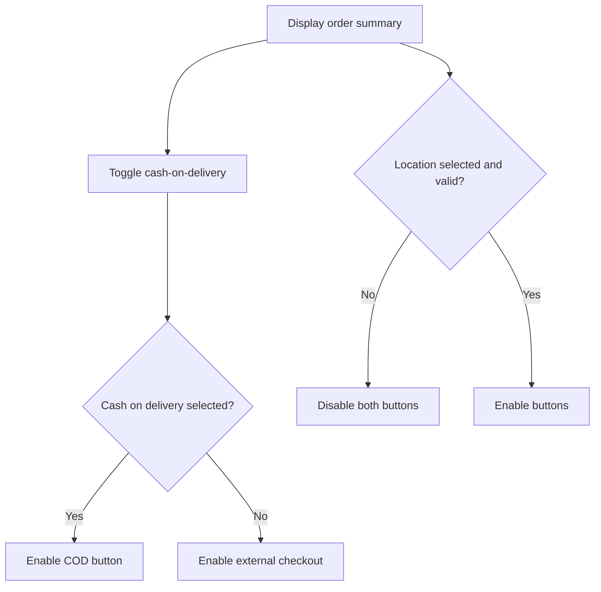
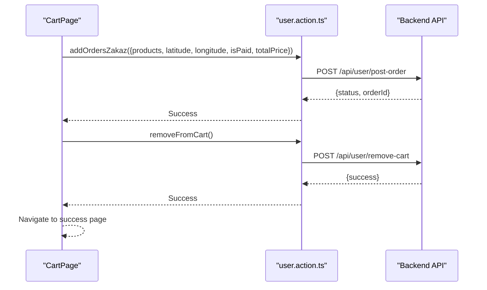
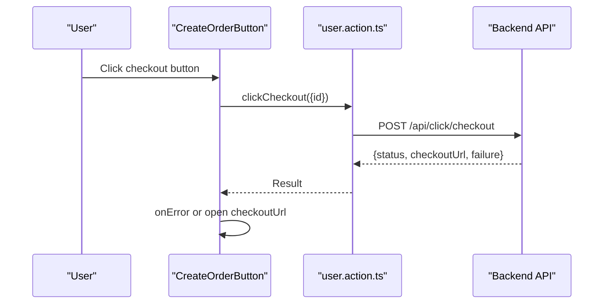
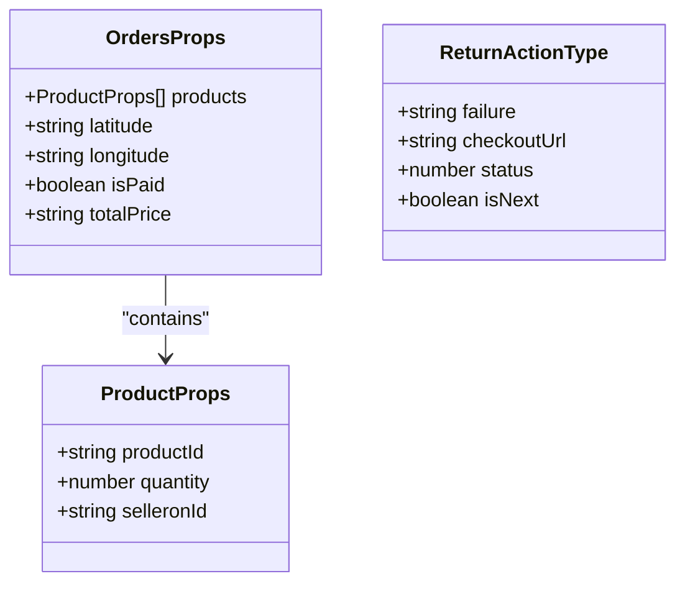
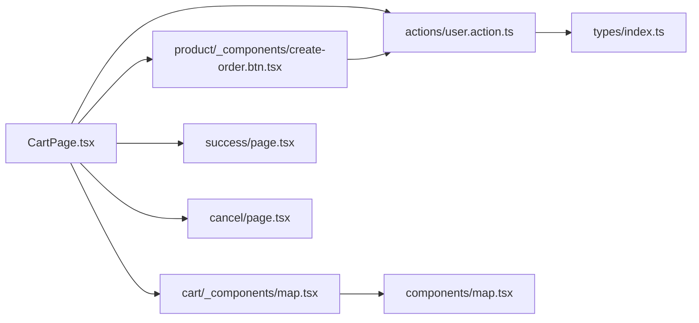

# Checkout Flow

<cite>
**Referenced Files in This Document**
- [CartPage.tsx](file://app/(root)/cart/CartPage.tsx)
- [page.tsx](file://app/(root)/cart/page.tsx)
- [create-order.btn.tsx](file://app/(root)/product/_components/create-order.btn.tsx)
- [user.action.ts](file://actions/user.action.ts)
- [use-action.ts](file://hooks/use-action.ts)
- [map.tsx](file://app/(root)/cart/_components/map.tsx)
- [map.tsx](file://components/map.tsx)
- [page.tsx](file://app/(root)/cancel/page.tsx)
- [page.tsx](file://app/(root)/success/page.tsx)
- [index.ts](file://types/index.ts)
</cite>

## Table of Contents
1. [Introduction](#introduction)
2. [Project Structure](#project-structure)
3. [Core Components](#core-components)
4. [Architecture Overview](#architecture-overview)
5. [Detailed Component Analysis](#detailed-component-analysis)
6. [Dependency Analysis](#dependency-analysis)
7. [Performance Considerations](#performance-considerations)
8. [Troubleshooting Guide](#troubleshooting-guide)
9. [Conclusion](#conclusion)

## Introduction
This document explains the checkout flow in Optim Bozor, focusing on the end-to-end process from cart review to order placement. It covers:
- Step-by-step checkout process: cart review, shipping address collection, delivery method selection, and order summary display
- Integration between cart components and checkout forms, including validation rules and user input handling
- Server-side processing of checkout requests through user actions, including cart data serialization and order preparation
- Checkout UI components, form validation patterns, and error handling during the checkout process
- Examples of checkout state management and user experience optimizations for smooth transaction completion

## Project Structure
The checkout flow spans client-side pages, UI components, and server actions:
- Cart page renders grouped products, handles quantity updates, collects delivery location, and triggers order creation
- Address selection uses a map-based component with region validation
- Order submission uses server actions for cart updates and order creation
- Payment initiation uses a dedicated checkout button that opens an external checkout URL

**Diagram sources**
- [CartPage.tsx](file://app/(root)/cart/CartPage.tsx)
- [page.tsx](file://app/(root)/cart/page.tsx)
- [create-order.btn.tsx](file://app/(root)/product/_components/create-order.btn.tsx)
- [map.tsx](file://app/(root)/cart/_components/map.tsx)
- [map.tsx](file://components/map.tsx)
- [user.action.ts](file://actions/user.action.ts)
- [index.ts](file://types/index.ts)
- [page.tsx](file://app/(root)/success/page.tsx)
- [page.tsx](file://app/(root)/cancel/page.tsx)

**Section sources**
- [CartPage.tsx](file://app/(root)/cart/CartPage.tsx)
- [page.tsx](file://app/(root)/cart/page.tsx)
- [create-order.btn.tsx](file://app/(root)/product/_components/create-order.btn.tsx)
- [map.tsx](file://app/(root)/cart/_components/map.tsx)
- [map.tsx](file://components/map.tsx)
- [user.action.ts](file://actions/user.action.ts)
- [index.ts](file://types/index.ts)
- [page.tsx](file://app/(root)/success/page.tsx)
- [page.tsx](file://app/(root)/cancel/page.tsx)

## Core Components
- CartPage: Renders grouped products per seller, manages quantities, collects delivery location, toggles cash-on-delivery, and submits orders
- Cart loader: Server-side fetches cart data and passes it to the client-side CartPage
- CreateOrderButton: Initiates external checkout flow via server action
- Map-based location selector: Validates location against Bukhara region and returns coordinates
- Server actions: Handle cart updates, order creation, and checkout initiation
- Types: Define payload shapes for cart and order submissions

Key responsibilities:
- Cart review and quantity adjustments
- Delivery address collection and validation
- Order summary calculation and display
- Order submission and cart cleanup
- External checkout initiation

**Section sources**
- [CartPage.tsx](file://app/(root)/cart/CartPage.tsx)
- [page.tsx](file://app/(root)/cart/page.tsx)
- [create-order.btn.tsx](file://app/(root)/product/_components/create-order.btn.tsx)
- [map.tsx](file://app/(root)/cart/_components/map.tsx)
- [map.tsx](file://components/map.tsx)
- [user.action.ts](file://actions/user.action.ts)
- [index.ts](file://types/index.ts)

## Architecture Overview
The checkout flow integrates UI components with server actions and external services:
- Client-side UI triggers actions to update cart and submit orders
- Server actions validate session, attach JWT tokens, and call backend APIs
- Map component validates location within Bukhara region
- External checkout is initiated via a returned checkout URL

**Diagram sources**
- [CartPage.tsx](file://app/(root)/cart/CartPage.tsx)
- [map.tsx](file://app/(root)/cart/_components/map.tsx)
- [user.action.ts](file://actions/user.action.ts)

## Detailed Component Analysis

### Cart Review and Quantity Management
- Groups products by seller and displays product images, titles, descriptions, and quantities
- Adjusts quantities via addToCart server action and reverts UI on server errors
- Calculates subtotal per seller and total price across all items

**Diagram sources**
- [CartPage.tsx](file://app/(root)/cart/CartPage.tsx)
- [user.action.ts](file://actions/user.action.ts)

**Section sources**
- [CartPage.tsx](file://app/(root)/cart/CartPage.tsx)
- [user.action.ts](file://actions/user.action.ts)

### Shipping Address Collection and Validation
- Opens a modal with a map-based location picker
- Validates that the selected location is within Bukhara region
- Displays success or error alerts based on validation result
- Passes coordinates and address metadata to the order submission

**Diagram sources**
- [CartPage.tsx](file://app/(root)/cart/CartPage.tsx)
- [map.tsx](file://app/(root)/cart/_components/map.tsx)
- [map.tsx](file://components/map.tsx)

**Section sources**
- [CartPage.tsx](file://app/(root)/cart/CartPage.tsx)
- [map.tsx](file://app/(root)/cart/_components/map.tsx)
- [map.tsx](file://components/map.tsx)

### Delivery Method Selection and Order Summary
- Displays order summary with product count, free shipping, and total price
- Provides a checkbox to choose cash-on-delivery vs. online payment
- Disables order buttons until location and method are selected appropriately

**Diagram sources**
- [CartPage.tsx](file://app/(root)/cart/CartPage.tsx)

**Section sources**
- [CartPage.tsx](file://app/(root)/cart/CartPage.tsx)

### Order Submission and Cart Cleanup
- Serializes cart items into product arrays with productId, selleronId, and quantity
- Submits order with coordinates, payment preference, and formatted total price
- On success, clears the cart and navigates to the success page

**Diagram sources**
- [CartPage.tsx](file://app/(root)/cart/CartPage.tsx)
- [user.action.ts](file://actions/user.action.ts)

**Section sources**
- [CartPage.tsx](file://app/(root)/cart/CartPage.tsx)
- [user.action.ts](file://actions/user.action.ts)

### External Checkout Initiation
- Uses a dedicated button to trigger checkout via a server action
- On success, opens the returned checkout URL in the same tab
- Handles server errors and validation failures gracefully

**Diagram sources**
- [create-order.btn.tsx](file://app/(root)/product/_components/create-order.btn.tsx)
- [user.action.ts](file://actions/user.action.ts)

**Section sources**
- [create-order.btn.tsx](file://app/(root)/product/_components/create-order.btn.tsx)
- [user.action.ts](file://actions/user.action.ts)

### Server-Side Actions and Payload Serialization
- Defines typed payloads for cart and order submissions
- Generates JWT tokens from session and attaches them to requests
- Serializes cart items and order totals before sending to backend

**Diagram sources**
- [index.ts](file://types/index.ts)
- [user.action.ts](file://actions/user.action.ts)

**Section sources**
- [index.ts](file://types/index.ts)
- [user.action.ts](file://actions/user.action.ts)

## Dependency Analysis
Checkout components depend on:
- UI primitives from shared components (buttons, cards, dialogs)
- Dynamic imports for map rendering to avoid SSR issues
- Server actions for cart manipulation and order creation
- Session-based authentication and token generation

**Diagram sources**
- [CartPage.tsx](file://app/(root)/cart/CartPage.tsx)
- [user.action.ts](file://actions/user.action.ts)
- [map.tsx](file://app/(root)/cart/_components/map.tsx)
- [map.tsx](file://components/map.tsx)
- [create-order.btn.tsx](file://app/(root)/product/_components/create-order.btn.tsx)
- [index.ts](file://types/index.ts)
- [page.tsx](file://app/(root)/success/page.tsx)
- [page.tsx](file://app/(root)/cancel/page.tsx)

**Section sources**
- [CartPage.tsx](file://app/(root)/cart/CartPage.tsx)
- [user.action.ts](file://actions/user.action.ts)
- [map.tsx](file://app/(root)/cart/_components/map.tsx)
- [map.tsx](file://components/map.tsx)
- [create-order.btn.tsx](file://app/(root)/product/_components/create-order.btn.tsx)
- [index.ts](file://types/index.ts)
- [page.tsx](file://app/(root)/success/page.tsx)
- [page.tsx](file://app/(root)/cancel/page.tsx)

## Performance Considerations
- Client-side cart updates are optimistic; server responses revert UI on errors
- Dynamic imports for map components reduce initial bundle size
- Server-side cart retrieval preloads data for improved perceived performance
- Token generation occurs server-side to avoid exposing secrets on the client

## Troubleshooting Guide
Common issues and resolutions:
- Empty cart submission: Prevents order creation and logs an error; ensure cart has items before placing order
- Invalid location: Disables order buttons; prompt users to select a location within Bukhara region
- Server errors during order creation: Logs error and keeps loading state; retry after fixing input
- External checkout failures: Error toast shown; verify product availability and session validity
- Payment cancellation: Redirects to cancel page; guide users to retry checkout

**Section sources**
- [CartPage.tsx](file://app/(root)/cart/CartPage.tsx)
- [create-order.btn.tsx](file://app/(root)/product/_components/create-order.btn.tsx)
- [use-action.ts](file://hooks/use-action.ts)
- [page.tsx](file://app/(root)/cancel/page.tsx)

## Conclusion
Optim Bozor’s checkout flow combines a responsive cart UI, validated location selection, flexible delivery methods, and robust server-side processing. The design emphasizes user feedback, error handling, and seamless transitions to success or cancellation pages, ensuring a smooth transaction experience.