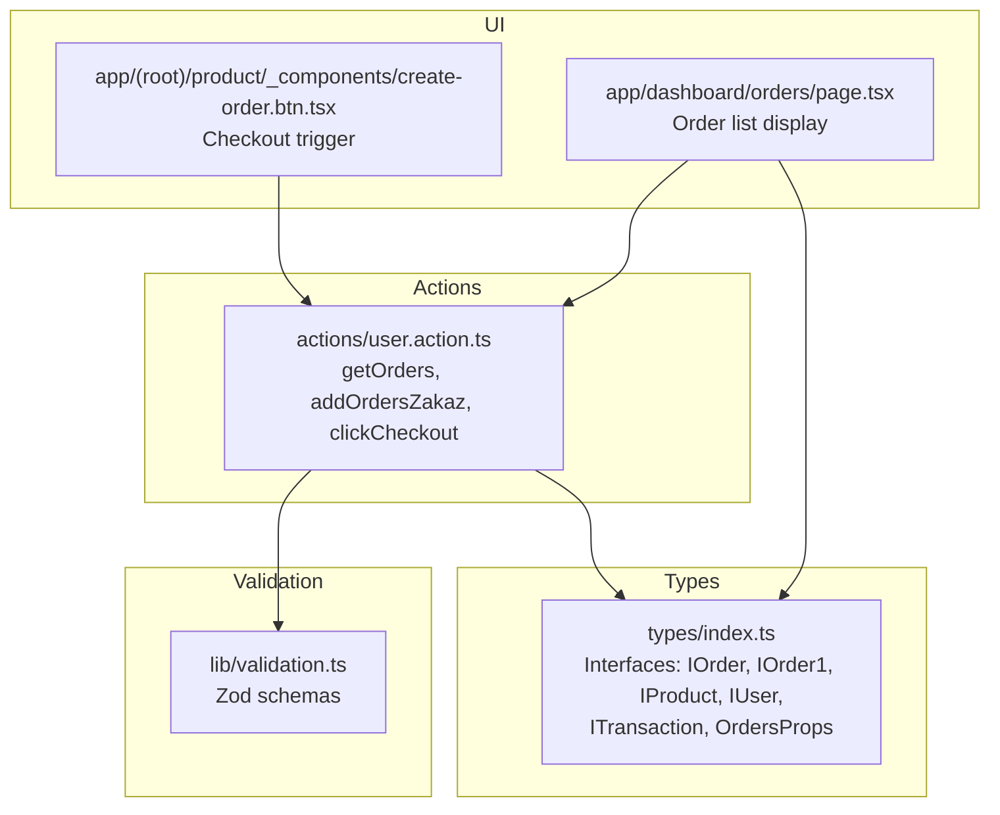
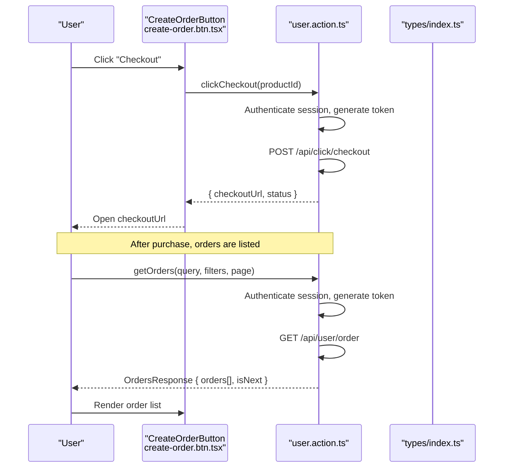
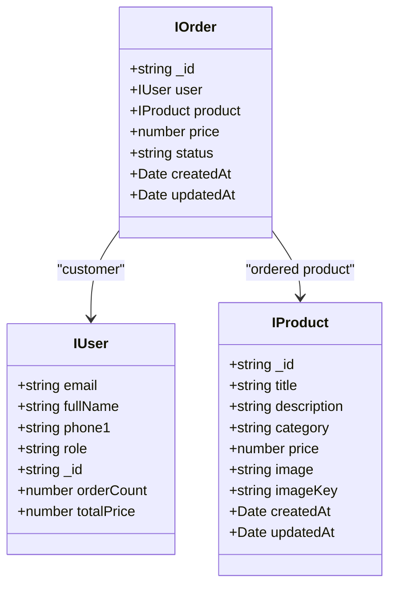
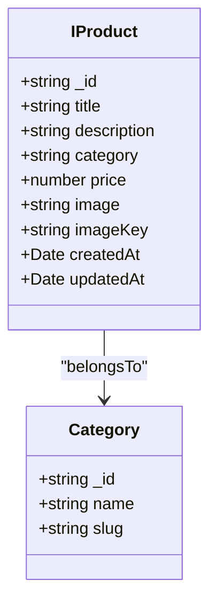
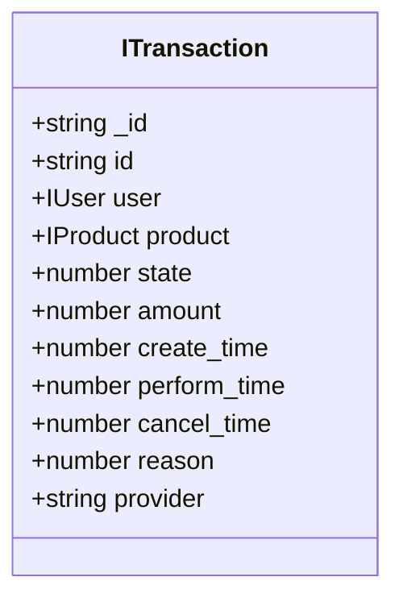
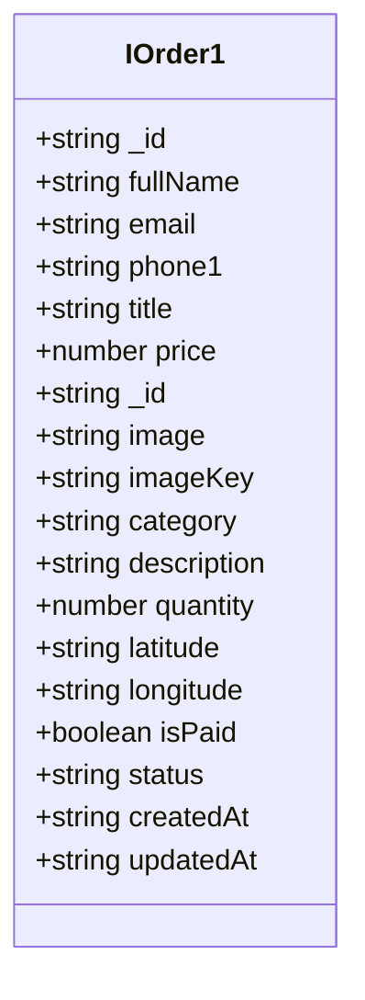
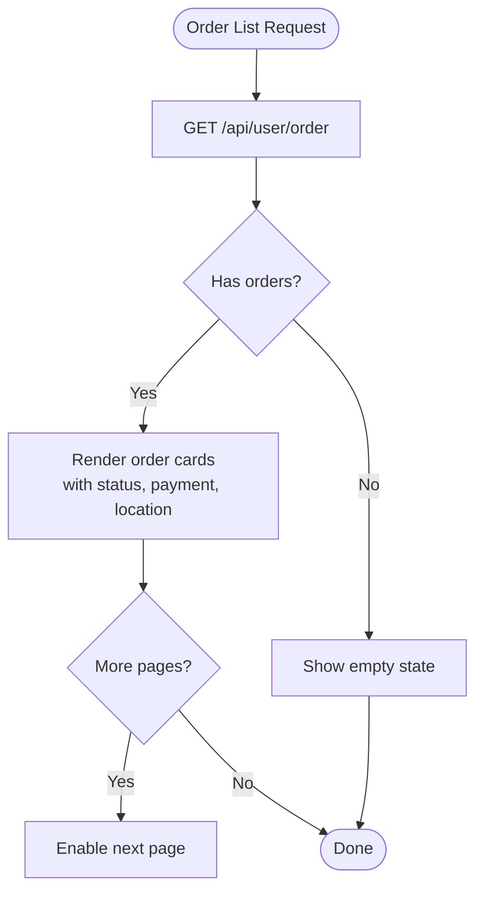
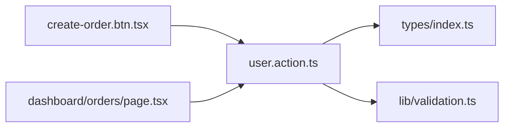

# Order Data Models

<cite>
**Referenced Files in This Document**
- [types/index.ts](file://types/index.ts)
- [actions/user.action.ts](file://actions/user.action.ts)
- [lib/validation.ts](file://lib/validation.ts)
- [app/(root)/product/_components/create-order.btn.tsx](file://app/(root)/product/_components/create-order.btn.tsx)
- [app/dashboard/orders/page.tsx](file://app/dashboard/orders/page.tsx)
</cite>

## Table of Contents
1. [Introduction](#introduction)
2. [Project Structure](#project-structure)
3. [Core Components](#core-components)
4. [Architecture Overview](#architecture-overview)
5. [Detailed Component Analysis](#detailed-component-analysis)
6. [Dependency Analysis](#dependency-analysis)
7. [Performance Considerations](#performance-considerations)
8. [Troubleshooting Guide](#troubleshooting-guide)
9. [Conclusion](#conclusion)

## Introduction
This document describes the order data models used in Optim Bozor. It focuses on the order entity, order item model, payment information, shipping information, and order lifecycle management. It also documents validation rules and business constraints observed in the client-side code and type definitions.

## Project Structure
The order-related data models and flows are primarily defined in TypeScript interfaces and validated via Zod schemas. Client-side actions orchestrate order creation and retrieval, and UI pages consume order data for display.

**Diagram sources**
- [types/index.ts:46-193](file://types/index.ts#L46-L193)
- [lib/validation.ts:75-96](file://lib/validation.ts#L75-L96)
- [actions/user.action.ts:61-243](file://actions/user.action.ts#L61-L243)
- [app/(root)/product/_components/create-order.btn.tsx:10-31](file://app/(root)/product/_components/create-order.btn.tsx#L10-L31)
- [app/dashboard/orders/page.tsx:58-202](file://app/dashboard/orders/page.tsx#L58-L202)

**Section sources**
- [types/index.ts:46-193](file://types/index.ts#L46-L193)
- [lib/validation.ts:75-96](file://lib/validation.ts#L75-L96)
- [actions/user.action.ts:61-243](file://actions/user.action.ts#L61-L243)
- [app/(root)/product/_components/create-order.btn.tsx:10-31](file://app/(root)/product/_components/create-order.btn.tsx#L10-L31)
- [app/dashboard/orders/page.tsx:58-202](file://app/dashboard/orders/page.tsx#L58-L202)

## Core Components
This section defines the primary data models used for orders and related entities.

- Order entity (IOrder)
  - Identifier: string
  - Customer: IUser
  - Product: IProduct
  - Price: number
  - Status: string
  - Timestamps: createdAt, updatedAt (Date)
  - Reference: [types/index.ts:171-179](file://types/index.ts#L171-L179)

- Simplified order view (IOrder1)
  - Identifier: string
  - Customer contact: fullName, email, phone1
  - Product summary: IOrderProduct (title, price, _id, image, imageKey, category, description)
  - Quantity: number
  - Location: latitude, longitude (strings)
  - Payment: isPaid (boolean)
  - Status: string
  - Timestamps: createdAt, updatedAt (ISO string)
  - Reference: [types/index.ts:88-103](file://types/index.ts#L88-L103)

- Order item model (IProduct)
  - Product identity: productId (_id, userId, title, price, description, category, images)
  - Category metadata: category (_id, name, image, slug, subcategories)
  - Pricing: price, quantity
  - Seller/buyer references: selleronId, userId
  - Timestamps: createdAt, updatedAt
  - Identifier: _id
  - Reference: [types/index.ts:105-151](file://types/index.ts#L105-L151)

- Transaction model (ITransaction)
  - Identifier: _id, id
  - Entities: user, product
  - State: state (number)
  - Amount: amount (number)
  - Timing: create_time, perform_time, cancel_time (numbers)
  - Reason: reason (number)
  - Provider: provider (string)
  - Reference: [types/index.ts:181-193](file://types/index.ts#L181-L193)

- Order creation payload (OrdersProps)
  - Products: ProductProps[]
  - Location: latitude, longitude (string or undefined)
  - Payment: isPaid (boolean)
  - Total: totalPrice (string)
  - References:
    - [types/index.ts:46-52](file://types/index.ts#L46-L52)
    - [types/index.ts:41-45](file://types/index.ts#L41-L45)

- UI order list response (OrdersResponse)
  - Orders: IOrder1[]
  - Pagination flag: isNext (boolean)
  - Reference: [types/index.ts:74-77](file://types/index.ts#L74-L77)

**Section sources**
- [types/index.ts:46-193](file://types/index.ts#L46-L193)

## Architecture Overview
The order lifecycle spans UI interactions, client-side actions, and typed data contracts. The following sequence illustrates order creation and listing.

**Diagram sources**
- [app/(root)/product/_components/create-order.btn.tsx:19-31](file://app/(root)/product/_components/create-order.btn.tsx#L19-L31)
- [actions/user.action.ts:230-243](file://actions/user.action.ts#L230-L243)
- [actions/user.action.ts:61-72](file://actions/user.action.ts#L61-L72)
- [types/index.ts:74-77](file://types/index.ts#L74-L77)

**Section sources**
- [app/(root)/product/_components/create-order.btn.tsx:19-31](file://app/(root)/product/_components/create-order.btn.tsx#L19-L31)
- [actions/user.action.ts:61-72](file://actions/user.action.ts#L61-L72)
- [actions/user.action.ts:230-243](file://actions/user.action.ts#L230-L243)
- [types/index.ts:74-77](file://types/index.ts#L74-L77)

## Detailed Component Analysis

### Order Entity Model (IOrder)
- Purpose: Core order representation with customer, product, pricing, and status.
- Fields:
  - _id: string
  - user: IUser
  - product: IProduct
  - price: number
  - status: string
  - createdAt: Date
  - updatedAt: Date
- Usage: Returned by backend APIs and consumed by UI pages.
- Reference: [types/index.ts:171-179](file://types/index.ts#L171-L179)

**Diagram sources**
- [types/index.ts:171-179](file://types/index.ts#L171-L179)
- [types/index.ts:153-169](file://types/index.ts#L153-L169)
- [types/index.ts:105-151](file://types/index.ts#L105-L151)

**Section sources**
- [types/index.ts:171-179](file://types/index.ts#L171-L179)

### Order Item Model (IProduct)
- Purpose: Describes the product included in an order, including pricing and category metadata.
- Key fields:
  - productId: nested product identity
  - category: structured category metadata
  - price, quantity
  - sellerId, userId
  - timestamps
  - _id
- Reference: [types/index.ts:105-151](file://types/index.ts#L105-L151)

**Diagram sources**
- [types/index.ts:105-151](file://types/index.ts#L105-L151)
- [types/index.ts:201-208](file://types/index.ts#L201-L208)

**Section sources**
- [types/index.ts:105-151](file://types/index.ts#L105-L151)

### Payment Information Model (ITransaction)
- Purpose: Captures payment lifecycle and state transitions.
- Fields:
  - _id, id
  - user, product
  - state (number)
  - amount (number)
  - create_time, perform_time, cancel_time (numbers)
  - reason (number)
  - provider (string)
- Reference: [types/index.ts:181-193](file://types/index.ts#L181-L193)

**Diagram sources**
- [types/index.ts:181-193](file://types/index.ts#L181-L193)

**Section sources**
- [types/index.ts:181-193](file://types/index.ts#L181-L193)

### Shipping Information Model (IOrder1)
- Purpose: Provides a simplified order view with location and payment status.
- Fields:
  - user: contact info (fullName, email, phone1)
  - product: IOrderProduct (title, price, _id, image, imageKey, category, description)
  - quantity: number
  - latitude, longitude: string
  - isPaid: boolean
  - status: string
  - createdAt, updatedAt: ISO string
- Reference: [types/index.ts:88-103](file://types/index.ts#L88-L103)

**Diagram sources**
- [types/index.ts:88-103](file://types/index.ts#L88-L103)

**Section sources**
- [types/index.ts:88-103](file://types/index.ts#L88-L103)

### Order Lifecycle Management
Observed lifecycle indicators and UI rendering:
- Status display: Orders page renders status badges and color-coded labels.
- Payment status: UI displays paid/unpaid badges derived from isPaid.
- Location: UI shows a Google Maps link using latitude/longitude.
- Pagination: OrdersResponse includes isNext for pagination control.

**Diagram sources**
- [actions/user.action.ts:61-72](file://actions/user.action.ts#L61-L72)
- [app/dashboard/orders/page.tsx:58-202](file://app/dashboard/orders/page.tsx#L58-L202)
- [types/index.ts:74-77](file://types/index.ts#L74-L77)

**Section sources**
- [app/dashboard/orders/page.tsx:58-202](file://app/dashboard/orders/page.tsx#L58-L202)
- [actions/user.action.ts:61-72](file://actions/user.action.ts#L61-L72)
- [types/index.ts:74-77](file://types/index.ts#L74-L77)

### Data Validation Rules and Business Constraints
- Orders creation payload (OrdersProps):
  - products: array of ProductProps (productId, quantity, selleronId)
  - latitude/longitude: optional strings
  - isPaid: boolean
  - totalPrice: string
  - References: [types/index.ts:46-52](file://types/index.ts#L46-L52), [types/index.ts:41-45](file://types/index.ts#L41-L45)

- Search and pagination parameters:
  - searchQuery, filter, category: optional strings
  - page: defaults to "1"
  - pageSize: defaults to "30"
  - Reference: [lib/validation.ts:75-81](file://lib/validation.ts#L75-L81)

- Checkout flow:
  - clickCheckout requires a productId and authenticated session.
  - Returns checkoutUrl and status.
  - Reference: [actions/user.action.ts:230-243](file://actions/user.action.ts#L230-L243)

- Order listing:
  - getOrders accepts searchParams and returns OrdersResponse.
  - Reference: [actions/user.action.ts:61-72](file://actions/user.action.ts#L61-L72)

**Section sources**
- [types/index.ts:41-52](file://types/index.ts#L41-L52)
- [lib/validation.ts:75-81](file://lib/validation.ts#L75-L81)
- [actions/user.action.ts:61-72](file://actions/user.action.ts#L61-L72)
- [actions/user.action.ts:230-243](file://actions/user.action.ts#L230-L243)

## Dependency Analysis
The following diagram shows how UI components depend on actions and types.

**Diagram sources**
- [app/(root)/product/_components/create-order.btn.tsx:19-31](file://app/(root)/product/_components/create-order.btn.tsx#L19-L31)
- [app/dashboard/orders/page.tsx:58-202](file://app/dashboard/orders/page.tsx#L58-L202)
- [actions/user.action.ts:61-243](file://actions/user.action.ts#L61-L243)
- [types/index.ts:46-193](file://types/index.ts#L46-L193)
- [lib/validation.ts:75-96](file://lib/validation.ts#L75-L96)

**Section sources**
- [app/(root)/product/_components/create-order.btn.tsx:19-31](file://app/(root)/product/_components/create-order.btn.tsx#L19-L31)
- [app/dashboard/orders/page.tsx:58-202](file://app/dashboard/orders/page.tsx#L58-L202)
- [actions/user.action.ts:61-243](file://actions/user.action.ts#L61-L243)
- [types/index.ts:46-193](file://types/index.ts#L46-L193)
- [lib/validation.ts:75-96](file://lib/validation.ts#L75-L96)

## Performance Considerations
- Pagination: Use isNext to avoid loading all orders at once.
- Minimal payload: Prefer IOrder1 for list views to reduce data transfer.
- Caching: Revalidation is used for cart and favorites; similar patterns can be applied to order lists.

## Troubleshooting Guide
- Authentication failures:
  - Many actions require a logged-in session and a generated token. Ensure session exists before invoking actions.
  - References: [actions/user.action.ts:61-72](file://actions/user.action.ts#L61-L72), [actions/user.action.ts:230-243](file://actions/user.action.ts#L230-L243)

- Checkout errors:
  - clickCheckout returns failure messages or server errors; handle gracefully in UI.
  - Reference: [app/(root)/product/_components/create-order.btn.tsx:22-27](file://app/(root)/product/_components/create-order.btn.tsx#L22-L27)

- Order list failures:
  - getOrders may return null; UI handles missing data with a fallback message.
  - Reference: [app/dashboard/orders/page.tsx:66-79](file://app/dashboard/orders/page.tsx#L66-L79)

**Section sources**
- [actions/user.action.ts:61-72](file://actions/user.action.ts#L61-L72)
- [actions/user.action.ts:230-243](file://actions/user.action.ts#L230-L243)
- [app/(root)/product/_components/create-order.btn.tsx:22-27](file://app/(root)/product/_components/create-order.btn.tsx#L22-L27)
- [app/dashboard/orders/page.tsx:66-79](file://app/dashboard/orders/page.tsx#L66-L79)

## Conclusion
Optim Bozor’s order data models are defined through TypeScript interfaces and validated via Zod schemas. The order entity captures customer, product, pricing, and status, while simplified order views support efficient UI rendering. Payment and shipping metadata are represented via dedicated models and UI indicators. Client-side actions enforce authentication and token generation, and UI pages implement pagination and error handling. Extending these models should preserve existing field semantics and add validation where appropriate.