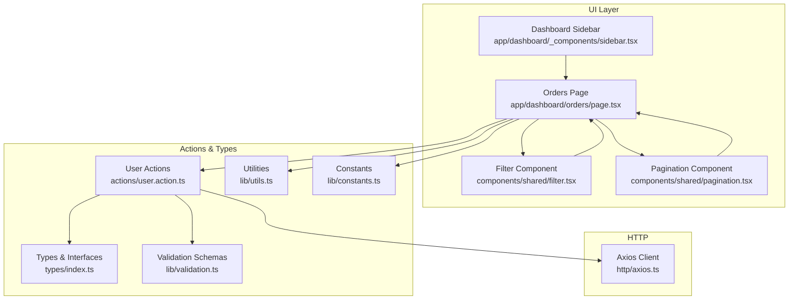
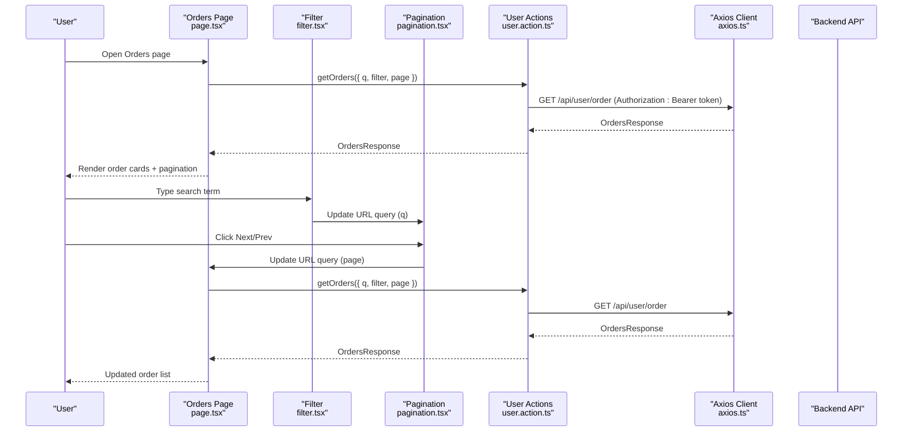
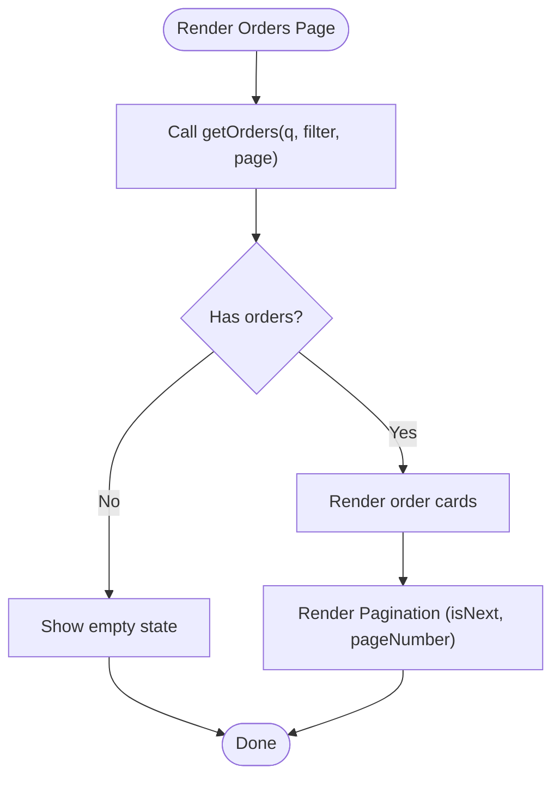
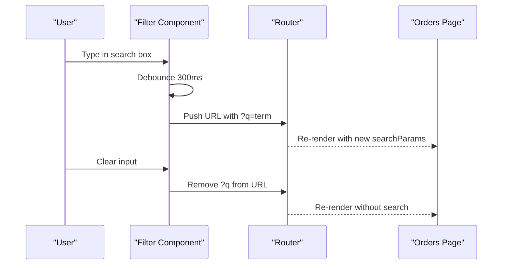
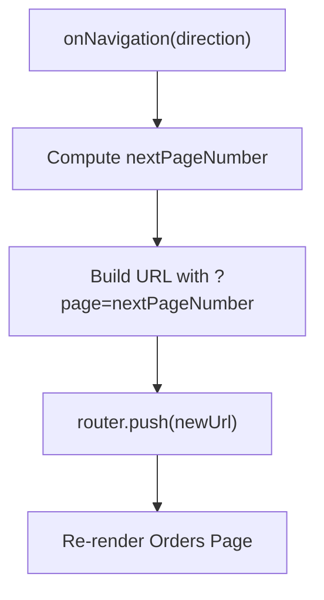
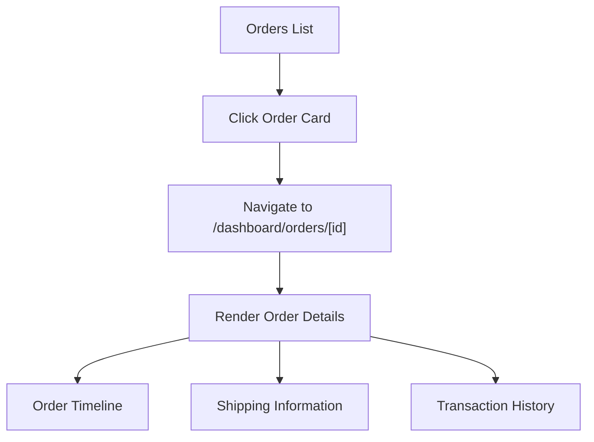
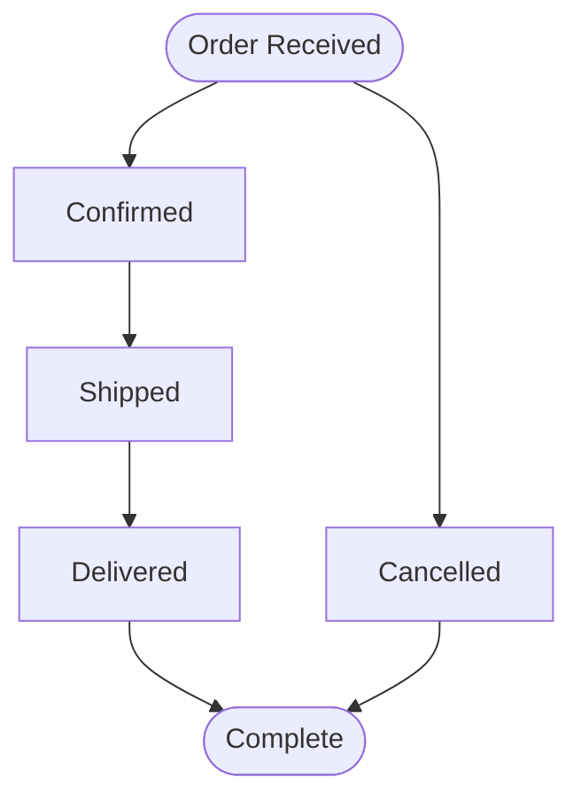
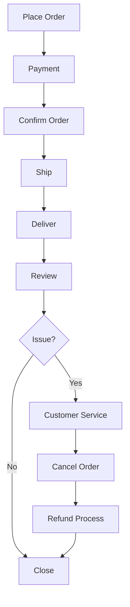
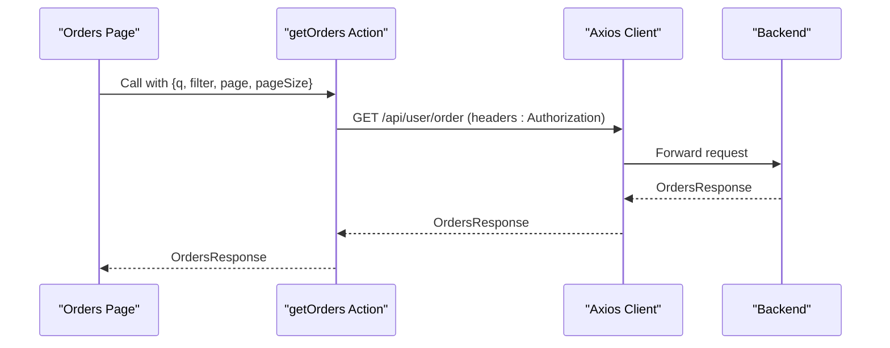
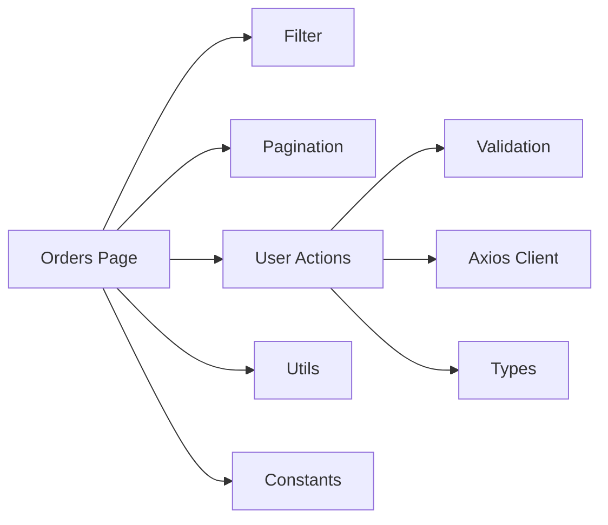

# Order Management

<cite>
**Referenced Files in This Document**
- [page.tsx](file://app/dashboard/orders/page.tsx)
- [pagination.tsx](file://components/shared/pagination.tsx)
- [filter.tsx](file://components/shared/filter.tsx)
- [user.action.ts](file://actions/user.action.ts)
- [index.ts](file://types/index.ts)
- [validation.ts](file://lib/validation.ts)
- [utils.ts](file://lib/utils.ts)
- [constants.ts](file://lib/constants.ts)
- [axios.ts](file://http/axios.ts)
- [sidebar.tsx](file://app/dashboard/_components/sidebar.tsx)
</cite>

## Table of Contents
1. [Introduction](#introduction)
2. [Project Structure](#project-structure)
3. [Core Components](#core-components)
4. [Architecture Overview](#architecture-overview)
5. [Detailed Component Analysis](#detailed-component-analysis)
6. [Dependency Analysis](#dependency-analysis)
7. [Performance Considerations](#performance-considerations)
8. [Troubleshooting Guide](#troubleshooting-guide)
9. [Conclusion](#conclusion)

## Introduction
This document describes the order management functionality available to users in their dashboards. It focuses on how order history is presented, how users can filter and paginate their orders, and how the frontend integrates with backend services to retrieve and manage order data. It also documents the order details view, status management, cancellation and refund handling, and customer service workflows. Where applicable, search and bulk operations are addressed.

## Project Structure
The order management feature spans several layers:
- UI page for displaying order history
- Shared components for pagination and filtering
- Action layer for server-side data fetching and token handling
- Type definitions for order data structures
- Validation schemas for request parameters
- Utility functions for URL manipulation and formatting
- HTTP client configuration for backend communication
- Dashboard sidebar for navigation

**Diagram sources**
- [page.tsx:1-206](file://app/dashboard/orders/page.tsx#L1-L206)
- [filter.tsx:1-49](file://components/shared/filter.tsx#L1-L49)
- [pagination.tsx:1-57](file://components/shared/pagination.tsx#L1-L57)
- [user.action.ts:61-72](file://actions/user.action.ts#L61-L72)
- [index.ts:74-103](file://types/index.ts#L74-L103)
- [validation.ts:75-81](file://lib/validation.ts#L75-L81)
- [utils.ts:19-35](file://lib/utils.ts#L19-L35)
- [constants.ts:13-17](file://lib/constants.ts#L13-L17)
- [axios.ts:1-10](file://http/axios.ts#L1-L10)
- [sidebar.tsx:1-103](file://app/dashboard/_components/sidebar.tsx#L1-L103)

**Section sources**
- [page.tsx:1-206](file://app/dashboard/orders/page.tsx#L1-L206)
- [filter.tsx:1-49](file://components/shared/filter.tsx#L1-L49)
- [pagination.tsx:1-57](file://components/shared/pagination.tsx#L1-L57)
- [user.action.ts:61-72](file://actions/user.action.ts#L61-L72)
- [index.ts:74-103](file://types/index.ts#L74-L103)
- [validation.ts:75-81](file://lib/validation.ts#L75-L81)
- [utils.ts:19-35](file://lib/utils.ts#L19-L35)
- [constants.ts:13-17](file://lib/constants.ts#L13-L17)
- [axios.ts:1-10](file://http/axios.ts#L1-L10)
- [sidebar.tsx:1-103](file://app/dashboard/_components/sidebar.tsx#L1-L103)

## Core Components
- Orders page: Renders order cards with product image, status badge, pricing, quantities, timestamps, delivery location, payment status, and seller info. Implements pagination and handles empty states.
- Pagination component: Updates URL query parameters to navigate pages without a full reload.
- Filter component: Debounced search input that updates the query string for live filtering.
- User actions: Fetches orders from the backend using a server action with session-based token injection.
- Types and validation: Defines order response shape and validates query parameters.
- Utilities: Provides URL manipulation helpers and formatting functions.
- HTTP client: Centralized Axios client configured with base URL and credentials.

**Section sources**
- [page.tsx:58-203](file://app/dashboard/orders/page.tsx#L58-L203)
- [pagination.tsx:13-54](file://components/shared/pagination.tsx#L13-L54)
- [filter.tsx:10-32](file://components/shared/filter.tsx#L10-L32)
- [user.action.ts:61-72](file://actions/user.action.ts#L61-L72)
- [index.ts:74-103](file://types/index.ts#L74-L103)
- [validation.ts:75-81](file://lib/validation.ts#L75-L81)
- [utils.ts:19-35](file://lib/utils.ts#L19-L35)
- [axios.ts:5-9](file://http/axios.ts#L5-L9)

## Architecture Overview
The order management flow connects the UI to backend services through a typed action layer. The UI reads URL search parameters, invokes a server action to fetch orders, and renders paginated results. Filtering is handled client-side via URL updates.

**Diagram sources**
- [page.tsx:58-64](file://app/dashboard/orders/page.tsx#L58-L64)
- [filter.tsx:14-30](file://components/shared/filter.tsx#L14-L30)
- [pagination.tsx:17-31](file://components/shared/pagination.tsx#L17-L31)
- [user.action.ts:61-72](file://actions/user.action.ts#L61-L72)
- [axios.ts:5-9](file://http/axios.ts#L5-L9)

## Detailed Component Analysis

### Orders History Display
- Data source: The page calls a server action to retrieve orders with optional query parameters for search, filter, and pagination.
- Rendering: Each order displays product image, status badge, formatted total price, quantity, creation date/time, delivery location link, payment status badge, and seller contact snippet.
- Empty state: When no orders are returned, a friendly message is shown.
- Pagination: The page receives an isNext flag and passes it to the pagination component along with the current page number.

**Diagram sources**
- [page.tsx:58-82](file://app/dashboard/orders/page.tsx#L58-L82)
- [page.tsx:103-200](file://app/dashboard/orders/page.tsx#L103-L200)

**Section sources**
- [page.tsx:58-203](file://app/dashboard/orders/page.tsx#L58-L203)

### Filtering by Status and Search
- Search: The filter component updates the URL query parameter q with debounced input. When the field is cleared, the query parameter is removed.
- Status filter: The action schema includes a filter parameter; however, the current page does not render explicit status filters. The filter input can be extended to pass a status filter value to the action.

**Diagram sources**
- [filter.tsx:14-30](file://components/shared/filter.tsx#L14-L30)
- [utils.ts:19-35](file://lib/utils.ts#L19-L35)

**Section sources**
- [filter.tsx:10-32](file://components/shared/filter.tsx#L10-L32)
- [validation.ts:75-81](file://lib/validation.ts#L75-L81)

### Pagination Implementation
- Navigation: The pagination component computes the next/previous page number and updates the URL query parameter page.
- Behavior: Previous is disabled on the first page; Next is disabled when isNext is false.
- Integration: The orders page passes the current page number and isNext flag to the pagination component.

**Diagram sources**
- [pagination.tsx:17-31](file://components/shared/pagination.tsx#L17-L31)
- [utils.ts:19-26](file://lib/utils.ts#L19-L26)

**Section sources**
- [pagination.tsx:13-54](file://components/shared/pagination.tsx#L13-L54)
- [page.tsx:195-200](file://app/dashboard/orders/page.tsx#L195-L200)

### Order Details View
- Current state: The orders page lists order summaries but does not define a dedicated order details route. Users can view product images, status, quantities, pricing, timestamps, delivery location, and payment status per order card.
- Enhancement suggestion: Introduce a route under /dashboard/orders/[id] to display detailed order timelines, shipping information, and transaction history. This would reuse the existing action layer and types.

[No sources needed since this diagram shows conceptual workflow, not actual code structure]

### Order Status Management
- Status display: Each order card shows a colored badge indicating status (pending confirm, confirmed, shipped, delivered, cancelled).
- Status transitions: The current page does not expose controls to change status. A future enhancement could add status update actions and notifications.
- Tracking information: Delivery location is shown as a Google Maps link derived from latitude and longitude stored with the order.

**Section sources**
- [page.tsx:116-120](file://app/dashboard/orders/page.tsx#L116-L120)
- [page.tsx:154-166](file://app/dashboard/orders/page.tsx#L154-L166)

### Order Cancellation, Refund Handling, and Customer Service
- Cancellation: The orders page does not currently provide a cancellation UI. A cancellation workflow could involve invoking a backend endpoint to update order status and initiate refunds.
- Refunds: Transaction state constants exist for paid, pending, and canceled states. A refund flow would align with these states and update order records accordingly.
- Customer service: The seller contact snippet on each order card enables quick communication with the seller.

**Section sources**
- [constants.ts:19-24](file://lib/constants.ts#L19-L24)
- [page.tsx:174-188](file://app/dashboard/orders/page.tsx#L174-L188)

### Backend Integration
- Endpoint: The action fetches orders from /api/user/order with Authorization: Bearer token injected from the session.
- Parameters: The action accepts searchQuery, filter, category, page, and pageSize validated by the schema.
- Response: The action returns an OrdersResponse containing orders and isNext.

**Diagram sources**
- [user.action.ts:61-72](file://actions/user.action.ts#L61-L72)
- [validation.ts:75-81](file://lib/validation.ts#L75-L81)
- [axios.ts:5-9](file://http/axios.ts#L5-L9)

**Section sources**
- [user.action.ts:61-72](file://actions/user.action.ts#L61-L72)
- [validation.ts:75-81](file://lib/validation.ts#L75-L81)
- [index.ts:74-77](file://types/index.ts#L74-L77)
- [axios.ts:5-9](file://http/axios.ts#L5-L9)

## Dependency Analysis
- UI depends on:
  - Pagination and Filter components for navigation and search
  - User actions for data retrieval
  - Types for shape validation and rendering
  - Utilities for URL manipulation
- Actions depend on:
  - Validation schemas for input sanitization
  - HTTP client for backend requests
  - Session for token generation
- Types define the contract between UI and backend.

**Diagram sources**
- [page.tsx:1-11](file://app/dashboard/orders/page.tsx#L1-L11)
- [filter.tsx:1-8](file://components/shared/filter.tsx#L1-L8)
- [pagination.tsx:1-6](file://components/shared/pagination.tsx#L1-L6)
- [user.action.ts:61-72](file://actions/user.action.ts#L61-L72)
- [validation.ts:75-81](file://lib/validation.ts#L75-L81)
- [utils.ts:1-6](file://lib/utils.ts#L1-L6)
- [constants.ts:1-10](file://lib/constants.ts#L1-L10)
- [axios.ts:1-10](file://http/axios.ts#L1-L10)
- [index.ts:74-103](file://types/index.ts#L74-L103)

**Section sources**
- [page.tsx:1-11](file://app/dashboard/orders/page.tsx#L1-L11)
- [user.action.ts:61-72](file://actions/user.action.ts#L61-L72)
- [validation.ts:75-81](file://lib/validation.ts#L75-L81)
- [index.ts:74-103](file://types/index.ts#L74-L103)
- [utils.ts:1-6](file://lib/utils.ts#L1-L6)
- [constants.ts:1-10](file://lib/constants.ts#L1-L10)
- [axios.ts:1-10](file://http/axios.ts#L1-L10)

## Performance Considerations
- Debounced search: The filter component uses a 300ms debounce to reduce unnecessary network requests during typing.
- Pagination: The isNext flag prevents redundant navigation when at the last page.
- Currency formatting: Price formatting uses locale-aware formatting to avoid repeated computations.
- Lazy loading: Product images use Next.js Image with fill and object-cover for efficient rendering.

[No sources needed since this section provides general guidance]

## Troubleshooting Guide
- Orders fail to load:
  - Verify the Authorization header is present and valid.
  - Check the backend endpoint availability and response shape.
- Pagination buttons disabled:
  - Ensure isNext reflects the backend response.
  - Confirm the current page number is parsed correctly from URL.
- Search not applying:
  - Confirm the q parameter is appended to the URL and passed to the action.
  - Verify the action schema accepts the searchQuery parameter.
- Styling or layout issues:
  - Confirm Tailwind classes and responsive grid classes are applied correctly.
  - Validate image URLs and fallbacks for missing assets.

**Section sources**
- [user.action.ts:61-72](file://actions/user.action.ts#L61-L72)
- [pagination.tsx:17-31](file://components/shared/pagination.tsx#L17-L31)
- [filter.tsx:14-30](file://components/shared/filter.tsx#L14-L30)
- [page.tsx:66-79](file://app/dashboard/orders/page.tsx#L66-L79)

## Conclusion
The order management feature provides a clean, paginated view of user orders with search and basic status/payment indicators. The architecture cleanly separates UI concerns from data fetching via server actions and a centralized HTTP client. Future enhancements can include a dedicated order details view, explicit status filters, cancellation workflows, and refund handling aligned with existing transaction state constants.