# Order Processing

<cite>
**Referenced Files in This Document**
- [actions/user.action.ts](file://actions/user.action.ts)
- [app/(root)/product/_components/create-order.btn.tsx](file://app/(root)/product/_components/create-order.btn.tsx)
- [app/(root)/cart/CartPage.tsx](file://app/(root)/cart/CartPage.tsx)
- [app/(root)/cart/_components/map.tsx](file://app/(root)/cart/_components/map.tsx)
- [app/(root)/success/page.tsx](file://app/(root)/success/page.tsx)
- [app/(root)/cancel/page.tsx](file://app/(root)/cancel/page.tsx)
- [app/dashboard/orders/page.tsx](file://app/dashboard/orders/page.tsx)
- [types/index.ts](file://types/index.ts)
- [http/axios.ts](file://http/axios.ts)
- [lib/generate-token.ts](file://lib/generate-token.ts)
- [lib/safe-action.ts](file://lib/safe-action.ts)
- [lib/validation.ts](file://lib/validation.ts)
- [lib/auth-options.ts](file://lib/auth-options.ts)
</cite>

## Table of Contents
1. [Introduction](#introduction)
2. [Project Structure](#project-structure)
3. [Core Components](#core-components)
4. [Architecture Overview](#architecture-overview)
5. [Detailed Component Analysis](#detailed-component-analysis)
6. [Dependency Analysis](#dependency-analysis)
7. [Performance Considerations](#performance-considerations)
8. [Troubleshooting Guide](#troubleshooting-guide)
9. [Conclusion](#conclusion)
10. [Appendices](#appendices)

## Introduction
This document explains the order processing system in Optim Bozor, covering the checkout flow, cart review, shipping information collection, payment initiation, order creation, and order management in the user dashboard. It also documents the data models, state transitions, and integrations with payment systems and external services. Guidance on error handling, cancellations, refunds, and the relationship between orders, payments, and inventory is included.

## Project Structure
Optim Bozor’s order processing spans client components, server actions, and shared types. Key areas:
- Client-side checkout and cart pages
- Server actions orchestrating backend requests
- Shared types defining order, product, and transaction models
- Payment integration via a third-party provider (Click)
- Dashboard for order history and status tracking

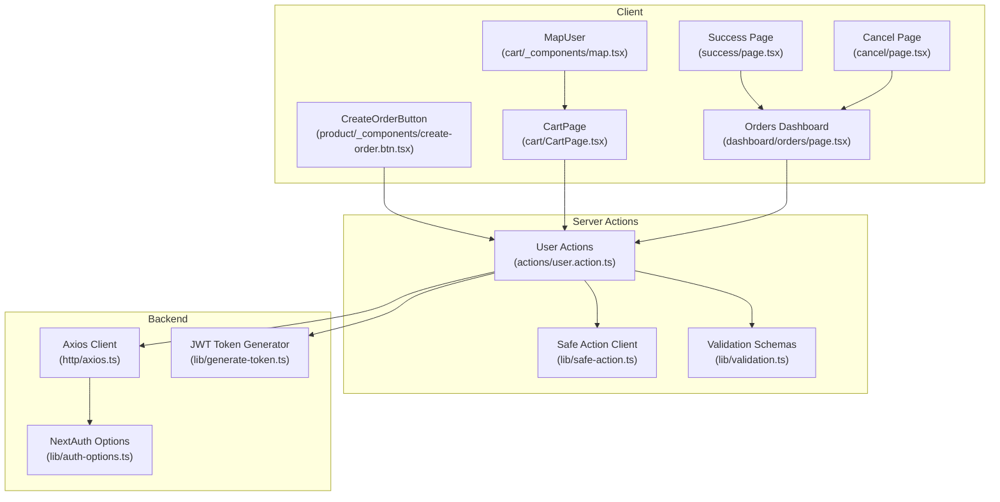

**Diagram sources**
- [app/(root)/product/_components/create-order.btn.tsx](file://app/(root)/product/_components/create-order.btn.tsx#L1-L52)
- [app/(root)/cart/CartPage.tsx](file://app/(root)/cart/CartPage.tsx#L196-L230)
- [app/(root)/cart/_components/map.tsx](file://app/(root)/cart/_components/map.tsx#L1-L390)
- [app/dashboard/orders/page.tsx:1-206](file://app/dashboard/orders/page.tsx#L1-L206)
- [app/(root)/success/page.tsx](file://app/(root)/success/page.tsx#L1-L28)
- [app/(root)/cancel/page.tsx](file://app/(root)/cancel/page.tsx#L1-L25)
- [actions/user.action.ts:1-296](file://actions/user.action.ts#L1-L296)
- [lib/safe-action.ts:1-4](file://lib/safe-action.ts#L1-L4)
- [lib/validation.ts:1-96](file://lib/validation.ts#L1-L96)
- [http/axios.ts:1-10](file://http/axios.ts#L1-L10)
- [lib/generate-token.ts:1-11](file://lib/generate-token.ts#L1-L11)
- [lib/auth-options.ts:1-128](file://lib/auth-options.ts#L1-L128)

**Section sources**
- [actions/user.action.ts:1-296](file://actions/user.action.ts#L1-L296)
- [types/index.ts:1-209](file://types/index.ts#L1-L209)
- [http/axios.ts:1-10](file://http/axios.ts#L1-L10)
- [lib/generate-token.ts:1-11](file://lib/generate-token.ts#L1-L11)
- [lib/safe-action.ts:1-4](file://lib/safe-action.ts#L1-L4)
- [lib/validation.ts:1-96](file://lib/validation.ts#L1-L96)
- [lib/auth-options.ts:1-128](file://lib/auth-options.ts#L1-L128)

## Core Components
- Checkout initiation via a dedicated button that triggers a server action to start a payment session.
- Cart review and shipping information collection with interactive map selection and geolocation.
- Order creation through server actions that send cart items, shipping coordinates, and payment intent to the backend.
- Order history and status tracking in the user dashboard.
- Success and cancellation pages to guide users after payment outcomes.

Key implementation references:
- Checkout initiation: [CreateOrderButton](file://app/(root)/product/_components/create-order.btn.tsx#L10-L31)
- Cart order submission: [CartPage.handleOrderZakaz](file://app/(root)/cart/CartPage.tsx#L196-L230)
- Shipping info collection: [MapUser](file://app/(root)/cart/_components/map.tsx#L29-L87)
- Order retrieval: [getOrders:61-72](file://actions/user.action.ts#L61-L72)
- Order model: [IOrder/IOrder1:171-103](file://types/index.ts#L171-L103)

**Section sources**
- [app/(root)/product/_components/create-order.btn.tsx](file://app/(root)/product/_components/create-order.btn.tsx#L1-L52)
- [app/(root)/cart/CartPage.tsx](file://app/(root)/cart/CartPage.tsx#L196-L230)
- [app/(root)/cart/_components/map.tsx](file://app/(root)/cart/_components/map.tsx#L1-L390)
- [actions/user.action.ts:61-72](file://actions/user.action.ts#L61-L72)
- [types/index.ts:171-103](file://types/index.ts#L171-L103)

## Architecture Overview
The order processing flow integrates client UI, server actions, and backend APIs. Authentication uses NextAuth with JWT, and server actions sign requests with short-lived tokens. Payments are initiated via a third-party provider (Click), returning a checkout URL for the user to complete payment.

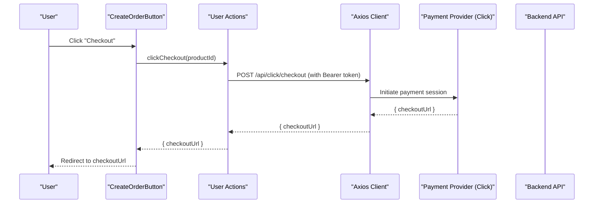

**Diagram sources**
- [app/(root)/product/_components/create-order.btn.tsx](file://app/(root)/product/_components/create-order.btn.tsx#L19-L30)
- [actions/user.action.ts:229-242](file://actions/user.action.ts#L229-L242)
- [http/axios.ts:1-10](file://http/axios.ts#L1-L10)
- [lib/generate-token.ts:5-10](file://lib/generate-token.ts#L5-L10)
- [lib/auth-options.ts:8-44](file://lib/auth-options.ts#L8-L44)

## Detailed Component Analysis

### Checkout Flow
- The checkout button triggers a server action that calls the payment provider endpoint and receives a checkout URL.
- On success, the client opens the checkout URL to finalize payment.
- On failure, errors are surfaced via the action’s response and toast notifications.

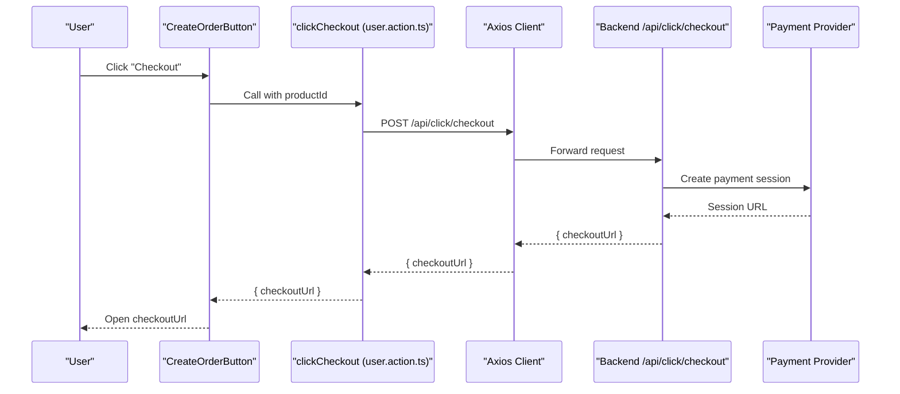

**Diagram sources**
- [app/(root)/product/_components/create-order.btn.tsx](file://app/(root)/product/_components/create-order.btn.tsx#L19-L30)
- [actions/user.action.ts:229-242](file://actions/user.action.ts#L229-L242)
- [http/axios.ts:1-10](file://http/axios.ts#L1-L10)

**Section sources**
- [app/(root)/product/_components/create-order.btn.tsx](file://app/(root)/product/_components/create-order.btn.tsx#L1-L52)
- [actions/user.action.ts:229-242](file://actions/user.action.ts#L229-L242)

### Cart Review and Shipping Information
- Users review cart items and optionally choose “Pay on delivery”.
- The shipping location is selected via an interactive map or geolocation, validated to be within the Buxoro region.
- Selected coordinates and optional address are attached to the order payload.

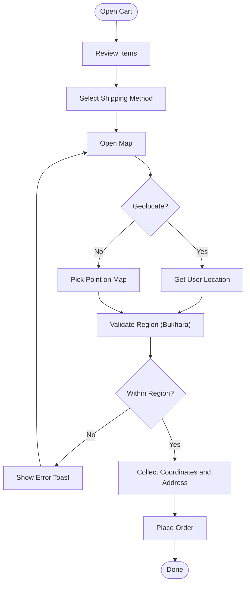

**Diagram sources**
- [app/(root)/cart/CartPage.tsx](file://app/(root)/cart/CartPage.tsx#L196-L230)
- [app/(root)/cart/_components/map.tsx](file://app/(root)/cart/_components/map.tsx#L89-L142)
- [app/(root)/cart/_components/map.tsx](file://app/(root)/cart/_components/map.tsx#L144-L155)

**Section sources**
- [app/(root)/cart/CartPage.tsx](file://app/(root)/cart/CartPage.tsx#L196-L230)
- [app/(root)/cart/_components/map.tsx](file://app/(root)/cart/_components/map.tsx#L1-L390)

### Order Creation and Transaction Handling
- The cart submission action posts order details to the backend, including products, quantities, shipping coordinates, and payment mode.
- After successful order creation, the cart is cleared, and the user is redirected to the success page.
- Payment outcomes are handled by the payment provider; the system relies on the returned checkout URL for completion.

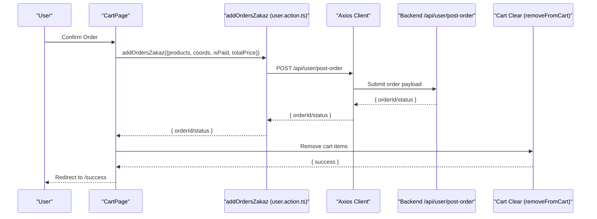

**Diagram sources**
- [app/(root)/cart/CartPage.tsx](file://app/(root)/cart/CartPage.tsx#L196-L230)
- [actions/user.action.ts:179-215](file://actions/user.action.ts#L179-L215)
- [http/axios.ts:1-10](file://http/axios.ts#L1-L10)

**Section sources**
- [app/(root)/cart/CartPage.tsx](file://app/(root)/cart/CartPage.tsx#L196-L230)
- [actions/user.action.ts:179-215](file://actions/user.action.ts#L179-L215)

### Order Management in User Dashboard
- The dashboard lists orders with product image, quantity, total price, creation date/time, shipping location, payment status, and order status badges.
- Pagination supports navigating multiple pages of orders.
- Links to open the shipping location in Google Maps are provided.

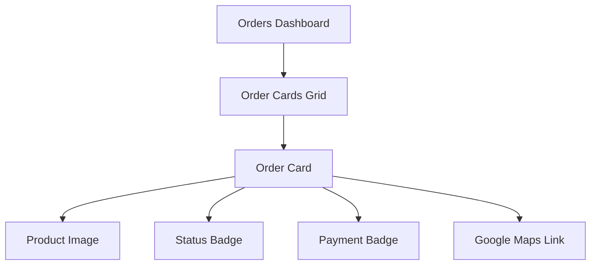

**Diagram sources**
- [app/dashboard/orders/page.tsx:58-202](file://app/dashboard/orders/page.tsx#L58-L202)

**Section sources**
- [app/dashboard/orders/page.tsx:1-206](file://app/dashboard/orders/page.tsx#L1-L206)

### Data Models and State Transitions
- Order model includes user, product, quantity, shipping coordinates, payment status, and status field.
- Status values observed in the UI include pending confirmation, confirmed, shipped, delivered, and cancelled.
- Payment status toggles between paid and cash-on-delivery.

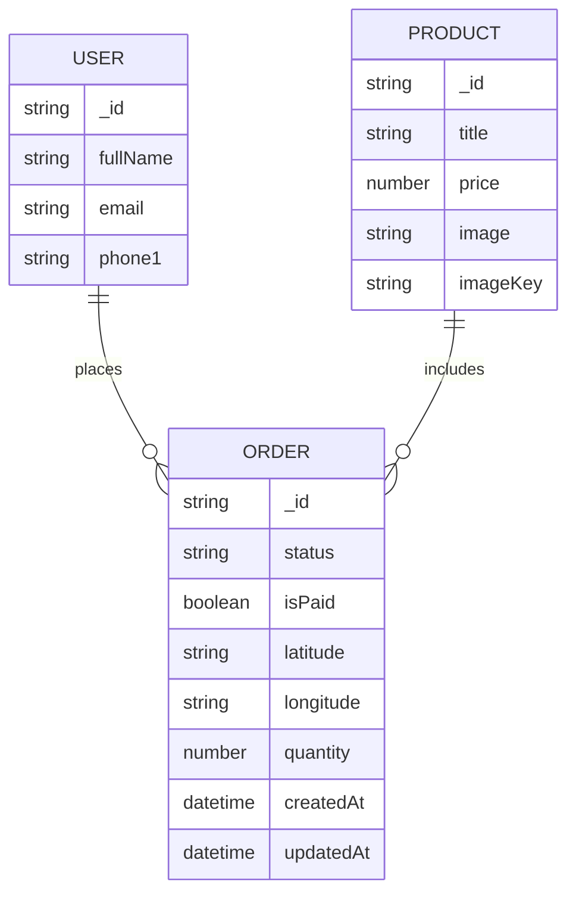

**Diagram sources**
- [types/index.ts:171-103](file://types/index.ts#L171-L103)

**Section sources**
- [types/index.ts:171-103](file://types/index.ts#L171-L103)

### Payment Integration and Confirmation Workflows
- Payment initiation is delegated to a third-party provider (Click). The server action returns a checkout URL upon success.
- Success and cancellation pages inform users of outcome and provide navigation back to the dashboard.
- The system does not implement internal payment capture logic; it relies on the provider’s session and redirect.

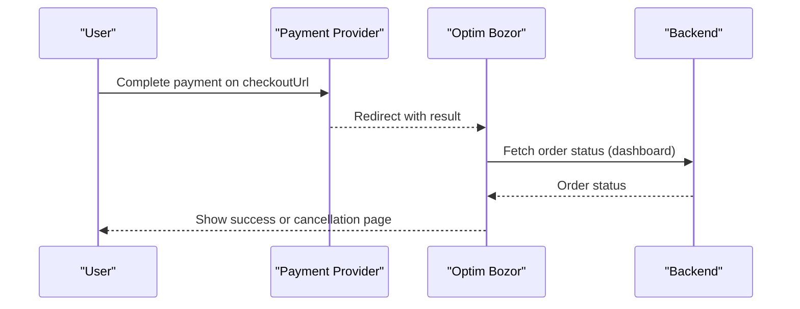

**Diagram sources**
- [app/(root)/product/_components/create-order.btn.tsx](file://app/(root)/product/_components/create-order.btn.tsx#L28-L30)
- [app/(root)/success/page.tsx](file://app/(root)/success/page.tsx#L5-L25)
- [app/(root)/cancel/page.tsx](file://app/(root)/cancel/page.tsx#L5-L25)
- [actions/user.action.ts:61-72](file://actions/user.action.ts#L61-L72)

**Section sources**
- [app/(root)/product/_components/create-order.btn.tsx](file://app/(root)/product/_components/create-order.btn.tsx#L1-L52)
- [app/(root)/success/page.tsx](file://app/(root)/success/page.tsx#L1-L28)
- [app/(root)/cancel/page.tsx](file://app/(root)/cancel/page.tsx#L1-L25)

### Order History, Status Tracking, and Details Viewing
- The orders page paginates results and displays order cards with key metadata.
- Status badges reflect current state; payment badges indicate payment method.
- Users can open the shipping location in Google Maps via a generated link.

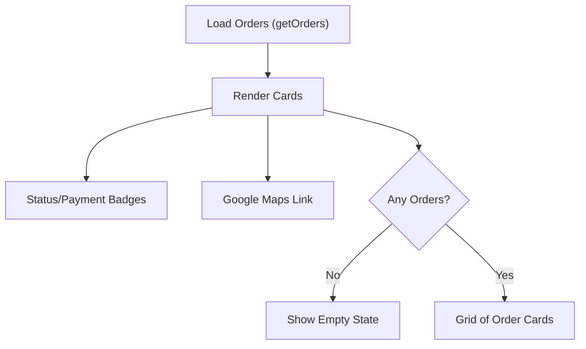

**Diagram sources**
- [actions/user.action.ts:61-72](file://actions/user.action.ts#L61-L72)
- [app/dashboard/orders/page.tsx:58-202](file://app/dashboard/orders/page.tsx#L58-L202)

**Section sources**
- [actions/user.action.ts:61-72](file://actions/user.action.ts#L61-L72)
- [app/dashboard/orders/page.tsx:1-206](file://app/dashboard/orders/page.tsx#L1-L206)

### Error Handling, Cancellations, and Refunds
- Checkout failures are surfaced via action responses and toast notifications.
- Cancellation page informs users that payment was not processed and offers navigation.
- Refund processing is not implemented in the client; it is expected to be handled by the payment provider and reflected in order status updates.

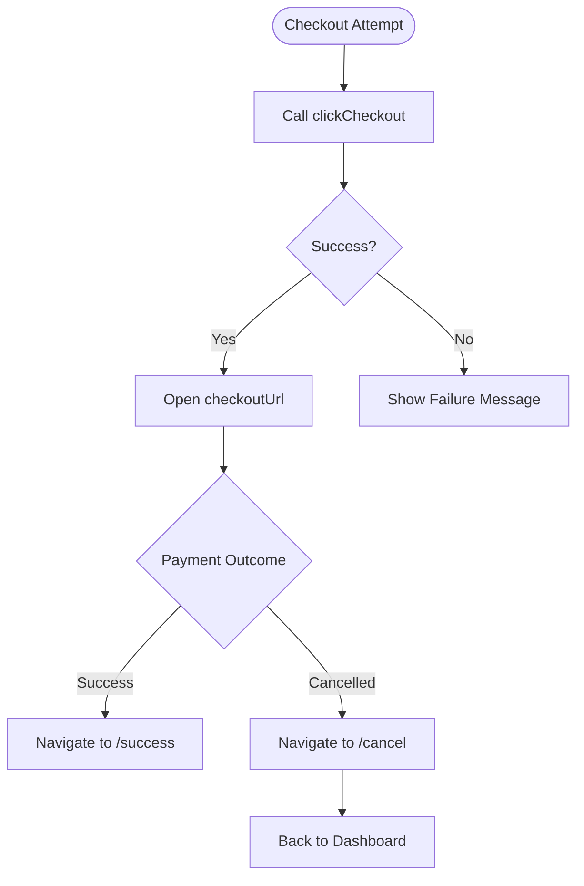

**Diagram sources**
- [app/(root)/product/_components/create-order.btn.tsx](file://app/(root)/product/_components/create-order.btn.tsx#L19-L30)
- [app/(root)/success/page.tsx](file://app/(root)/success/page.tsx#L5-L25)
- [app/(root)/cancel/page.tsx](file://app/(root)/cancel/page.tsx#L5-L25)

**Section sources**
- [app/(root)/product/_components/create-order.btn.tsx](file://app/(root)/product/_components/create-order.btn.tsx#L1-L52)
- [app/(root)/cancel/page.tsx](file://app/(root)/cancel/page.tsx#L1-L25)

## Dependency Analysis
- Client components depend on server actions for backend orchestration.
- Server actions depend on:
  - Axios client for HTTP communication
  - JWT generator for signed requests
  - Safe action client for typed, validated actions
  - Validation schemas for input sanitization
  - NextAuth for session and user context
- Types define the contract between frontend and backend.

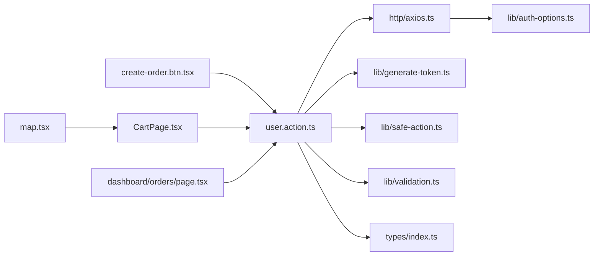

**Diagram sources**
- [app/(root)/product/_components/create-order.btn.tsx](file://app/(root)/product/_components/create-order.btn.tsx#L1-L52)
- [app/(root)/cart/CartPage.tsx](file://app/(root)/cart/CartPage.tsx#L196-L230)
- [app/(root)/cart/_components/map.tsx](file://app/(root)/cart/_components/map.tsx#L1-L390)
- [app/dashboard/orders/page.tsx:1-206](file://app/dashboard/orders/page.tsx#L1-L206)
- [actions/user.action.ts:1-296](file://actions/user.action.ts#L1-L296)
- [http/axios.ts:1-10](file://http/axios.ts#L1-L10)
- [lib/generate-token.ts:1-11](file://lib/generate-token.ts#L1-L11)
- [lib/safe-action.ts:1-4](file://lib/safe-action.ts#L1-L4)
- [lib/validation.ts:1-96](file://lib/validation.ts#L1-L96)
- [lib/auth-options.ts:1-128](file://lib/auth-options.ts#L1-L128)
- [types/index.ts:1-209](file://types/index.ts#L1-L209)

**Section sources**
- [actions/user.action.ts:1-296](file://actions/user.action.ts#L1-L296)
- [types/index.ts:1-209](file://types/index.ts#L1-L209)
- [http/axios.ts:1-10](file://http/axios.ts#L1-L10)
- [lib/generate-token.ts:1-11](file://lib/generate-token.ts#L1-L11)
- [lib/safe-action.ts:1-4](file://lib/safe-action.ts#L1-L4)
- [lib/validation.ts:1-96](file://lib/validation.ts#L1-L96)
- [lib/auth-options.ts:1-128](file://lib/auth-options.ts#L1-L128)

## Performance Considerations
- Minimize network round-trips by batching cart updates and order submissions.
- Use caching and revalidation strategically to keep the dashboard fresh without unnecessary reloads.
- Keep token lifetimes short and regenerate as needed to reduce stale session issues.
- Debounce map interactions and geolocation requests to avoid excessive API calls.

## Troubleshooting Guide
- Checkout fails silently:
  - Verify the payment provider endpoint is reachable and returns a checkout URL.
  - Check server action logs for validation or authorization errors.
- Cart removal after order creation fails:
  - Ensure the cart clearing endpoint is called and returns success.
  - Confirm the user session is present and the token is valid.
- Shipping location outside region:
  - Validate the region check logic and ensure the map component passes coordinates correctly.
- Order not appearing in dashboard:
  - Confirm pagination parameters and that the orders endpoint returns data for the authenticated user.

**Section sources**
- [app/(root)/product/_components/create-order.btn.tsx](file://app/(root)/product/_components/create-order.btn.tsx#L19-L30)
- [app/(root)/cart/CartPage.tsx](file://app/(root)/cart/CartPage.tsx#L223-L229)
- [app/(root)/cart/_components/map.tsx](file://app/(root)/cart/_components/map.tsx#L62-L86)
- [actions/user.action.ts:61-72](file://actions/user.action.ts#L61-L72)

## Conclusion
Optim Bozor’s order processing leverages a clean separation of concerns: client UI for cart and checkout, server actions for backend orchestration, and a third-party payment provider for transaction handling. The system provides robust order history and status tracking, with clear pathways for success and cancellation. Extending support for refunds and inventory adjustments would require backend integration and UI updates aligned with the existing data models and server action patterns.

## Appendices

### API Surface Summary
- Payment initiation: POST /api/click/checkout
- Order creation: POST /api/user/post-order
- Cart operations: GET /api/user/get-cart, POST /api/user/add-cart, POST /api/user/remove-cart
- Orders retrieval: GET /api/user/order
- Transactions retrieval: GET /api/user/transactions

**Section sources**
- [actions/user.action.ts:120-215](file://actions/user.action.ts#L120-L215)
- [http/axios.ts:1-10](file://http/axios.ts#L1-L10)