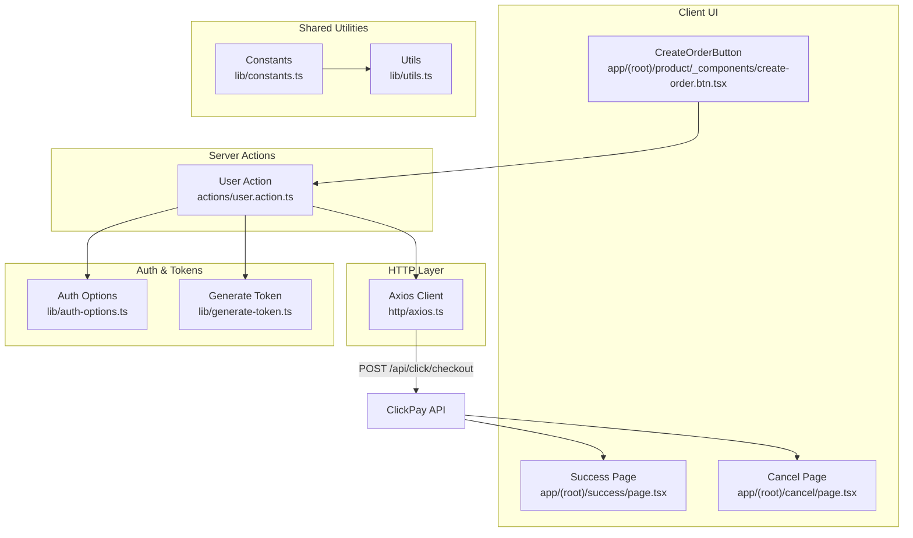
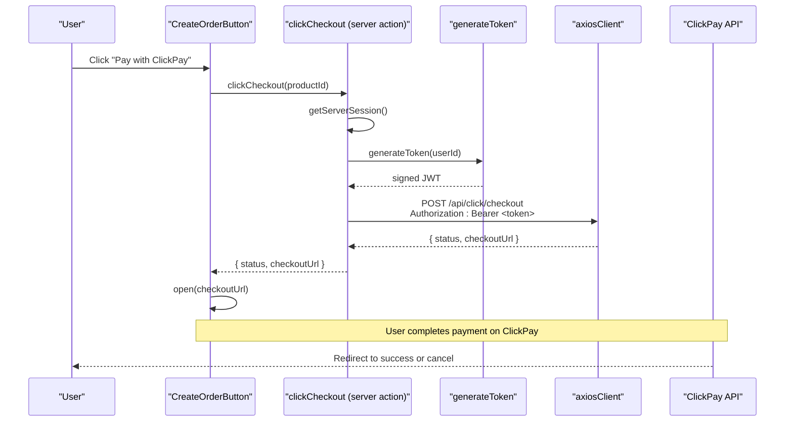
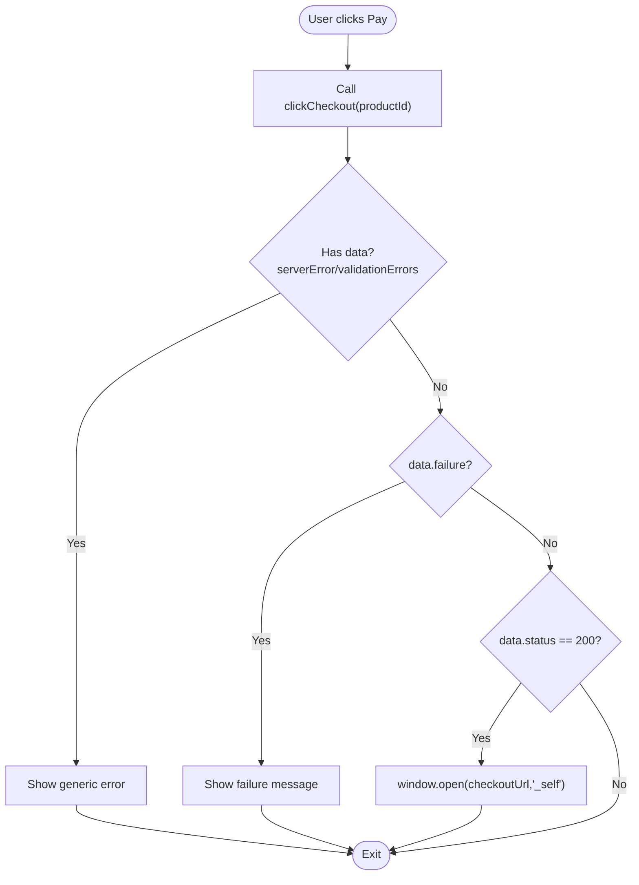
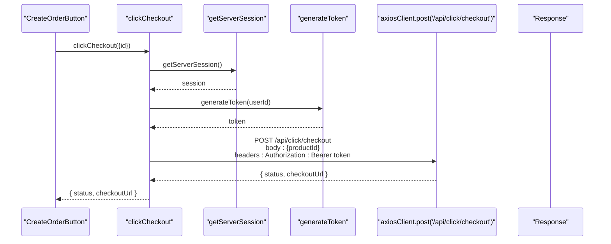
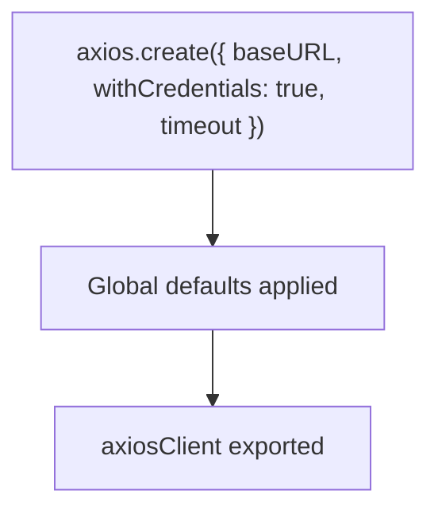
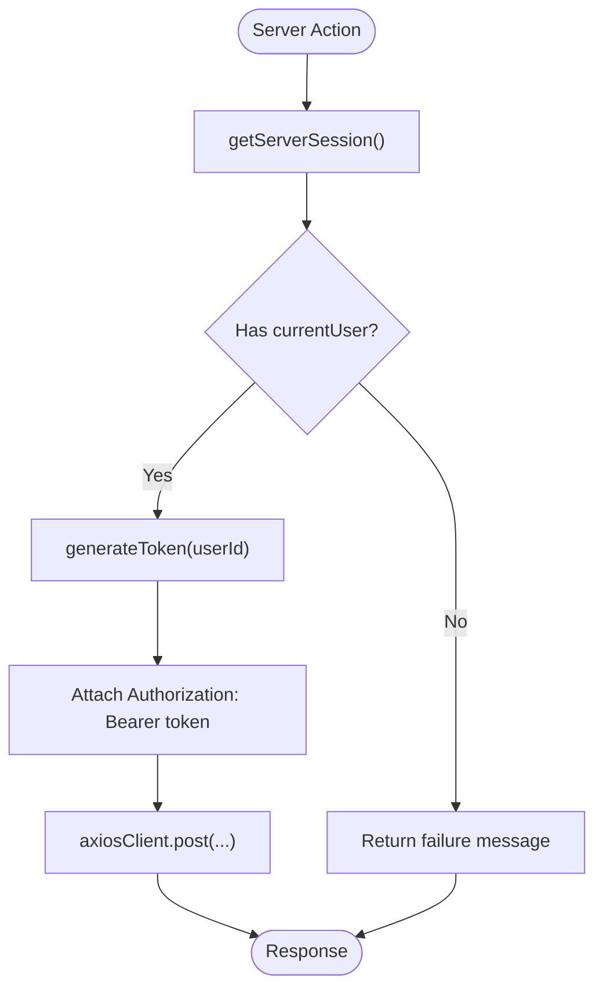
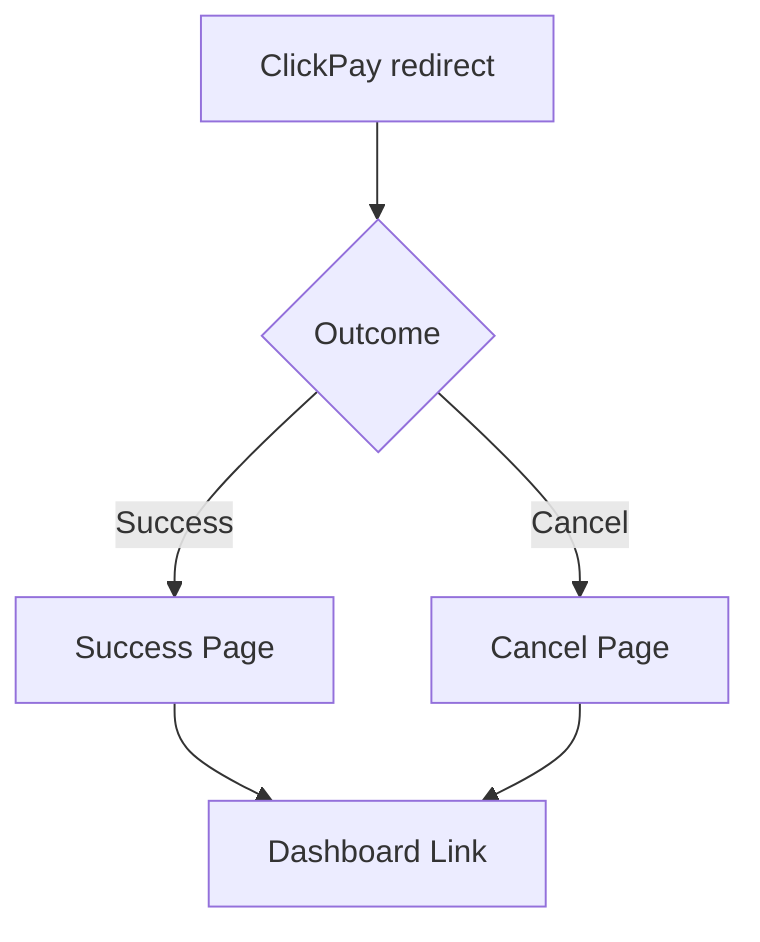
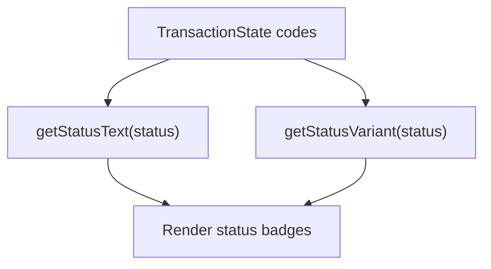
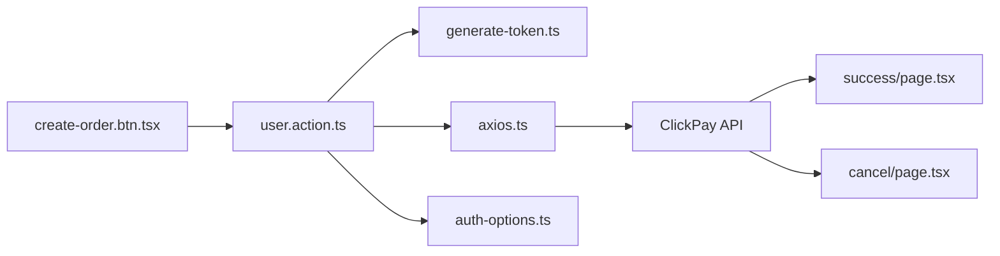

# Payment Integration

<cite>
**Referenced Files in This Document**
- [create-order.btn.tsx](file://app/(root)/product/_components/create-order.btn.tsx)
- [user.action.ts](file://actions/user.action.ts)
- [axios.ts](file://http/axios.ts)
- [auth-options.ts](file://lib/auth-options.ts)
- [generate-token.ts](file://lib/generate-token.ts)
- [constants.ts](file://lib/constants.ts)
- [utils.ts](file://lib/utils.ts)
- [success/page.tsx](file://app/(root)/success/page.tsx)
- [cancel/page.tsx](file://app/(root)/cancel/page.tsx)
- [server.js](file://server.js)
- [package.json](file://package.json)
</cite>

## Table of Contents
1. [Introduction](#introduction)
2. [Project Structure](#project-structure)
3. [Core Components](#core-components)
4. [Architecture Overview](#architecture-overview)
5. [Detailed Component Analysis](#detailed-component-analysis)
6. [Dependency Analysis](#dependency-analysis)
7. [Performance Considerations](#performance-considerations)
8. [Troubleshooting Guide](#troubleshooting-guide)
9. [Conclusion](#conclusion)
10. [Appendices](#appendices)

## Introduction
This document explains the payment integration for Optim Bozor’s ClickPay implementation. It covers the payment button workflow, transaction initiation via a server action, ClickPay checkout redirection, and success/cancel handling. It also documents the integration with ClickPay APIs, authentication and authorization mechanisms, response handling, validation, amount calculation, currency handling, error handling, timeouts, partial payments, status tracking, reconciliation, and security considerations including PCI compliance.

## Project Structure
The payment flow spans client-side UI components, server actions, HTTP client configuration, authentication, and dedicated pages for success and cancellation outcomes.

**Diagram sources**
- [create-order.btn.tsx](file://app/(root)/product/_components/create-order.btn.tsx#L1-L52)
- [user.action.ts:229-242](file://actions/user.action.ts#L229-L242)
- [axios.ts:1-10](file://http/axios.ts#L1-L10)
- [auth-options.ts:1-128](file://lib/auth-options.ts#L1-L128)
- [generate-token.ts:1-11](file://lib/generate-token.ts#L1-L11)
- [constants.ts:19-24](file://lib/constants.ts#L19-L24)
- [utils.ts:12-17](file://lib/utils.ts#L12-L17)
- [success/page.tsx](file://app/(root)/success/page.tsx#L1-L28)
- [cancel/page.tsx](file://app/(root)/cancel/page.tsx#L1-L26)

**Section sources**
- [create-order.btn.tsx](file://app/(root)/product/_components/create-order.btn.tsx#L1-L52)
- [user.action.ts:229-242](file://actions/user.action.ts#L229-L242)
- [axios.ts:1-10](file://http/axios.ts#L1-L10)
- [auth-options.ts:1-128](file://lib/auth-options.ts#L1-L128)
- [generate-token.ts:1-11](file://lib/generate-token.ts#L1-L11)
- [constants.ts:19-24](file://lib/constants.ts#L19-L24)
- [utils.ts:12-17](file://lib/utils.ts#L12-L17)
- [success/page.tsx](file://app/(root)/success/page.tsx#L1-L28)
- [cancel/page.tsx](file://app/(root)/cancel/page.tsx#L1-L26)

## Core Components
- Payment Button: Initiates ClickPay checkout by invoking a server action.
- Server Action: Validates session, generates a short-lived JWT, and calls the ClickPay checkout endpoint.
- HTTP Client: Centralized Axios client with base URL, credentials, and timeout.
- Authentication: NextAuth configuration and token generation utilities.
- Outcome Pages: Success and cancel pages for user feedback after ClickPay redirection.
- Shared Utilities: Status helpers and currency formatting.

Key responsibilities:
- Payment Button: Triggers checkout and handles errors.
- Server Action: Performs authorization checks, constructs requests, and returns checkout URLs.
- HTTP Client: Provides consistent API communication with timeouts and credentials.
- Auth Utilities: Ensures secure token issuance and session-based authorization.
- Outcome Pages: Guides users to next steps after payment outcome.

**Section sources**
- [create-order.btn.tsx](file://app/(root)/product/_components/create-order.btn.tsx#L10-L31)
- [user.action.ts:229-242](file://actions/user.action.ts#L229-L242)
- [axios.ts:5-9](file://http/axios.ts#L5-L9)
- [auth-options.ts:87-121](file://lib/auth-options.ts#L87-L121)
- [generate-token.ts:5-10](file://lib/generate-token.ts#L5-L10)
- [success/page.tsx](file://app/(root)/success/page.tsx#L5-L24)
- [cancel/page.tsx](file://app/(root)/cancel/page.tsx#L5-L24)
- [utils.ts:12-17](file://lib/utils.ts#L12-L17)

## Architecture Overview
The ClickPay integration follows a client-initiated flow:
- The client clicks the payment button.
- The client invokes a server action.
- The server action validates the session, generates a JWT, and posts to the ClickPay checkout endpoint.
- ClickPay responds with a checkout URL; the client opens it.
- After payment, ClickPay redirects to success or cancel pages.

**Diagram sources**
- [create-order.btn.tsx](file://app/(root)/product/_components/create-order.btn.tsx#L19-L30)
- [user.action.ts:229-242](file://actions/user.action.ts#L229-L242)
- [generate-token.ts:5-10](file://lib/generate-token.ts#L5-L10)
- [axios.ts:5-9](file://http/axios.ts#L5-L9)

## Detailed Component Analysis

### Payment Button Implementation
The payment button component:
- Disables itself during loading.
- Invokes the server action to initiate ClickPay checkout.
- Handles server-side errors, validation errors, and failure messages.
- On success, opens the returned checkout URL in the same tab.

**Diagram sources**
- [create-order.btn.tsx](file://app/(root)/product/_components/create-order.btn.tsx#L17-L31)

**Section sources**
- [create-order.btn.tsx](file://app/(root)/product/_components/create-order.btn.tsx#L10-L31)

### Transaction Initiation (Server Action)
The server action performs:
- Session validation via NextAuth.
- Short-lived JWT generation for internal authorization.
- Request to ClickPay checkout endpoint with product ID.
- Returns structured response containing status and checkout URL.

**Diagram sources**
- [user.action.ts:229-242](file://actions/user.action.ts#L229-L242)
- [generate-token.ts:5-10](file://lib/generate-token.ts#L5-L10)
- [axios.ts:5-9](file://http/axios.ts#L5-L9)

**Section sources**
- [user.action.ts:229-242](file://actions/user.action.ts#L229-L242)

### HTTP Client Configuration
The HTTP client:
- Uses a base URL from environment variables.
- Enables credentials for cross-origin cookie handling.
- Sets a 15-second timeout for all requests.

**Diagram sources**
- [axios.ts:5-9](file://http/axios.ts#L5-L9)

**Section sources**
- [axios.ts:1-10](file://http/axios.ts#L1-L10)

### Authentication and Authorization
Authentication relies on:
- NextAuth with custom providers and JWT/session callbacks.
- A short-lived JWT generated per request for backend authorization.
- Secure cookie policies enforced by NextAuth.

**Diagram sources**
- [auth-options.ts:87-121](file://lib/auth-options.ts#L87-L121)
- [generate-token.ts:5-10](file://lib/generate-token.ts#L5-L10)
- [user.action.ts:232-241](file://actions/user.action.ts#L232-L241)

**Section sources**
- [auth-options.ts:8-127](file://lib/auth-options.ts#L8-L127)
- [generate-token.ts:1-11](file://lib/generate-token.ts#L1-L11)
- [user.action.ts:229-242](file://actions/user.action.ts#L229-L242)

### Payment Confirmation Handling
After ClickPay redirection:
- Success page displays a confirmation message and a link to the dashboard.
- Cancel page informs the user that the payment was not processed and links back to the dashboard.

**Diagram sources**
- [success/page.tsx](file://app/(root)/success/page.tsx#L5-L24)
- [cancel/page.tsx](file://app/(root)/cancel/page.tsx#L5-L24)

**Section sources**
- [success/page.tsx](file://app/(root)/success/page.tsx#L1-L28)
- [cancel/page.tsx](file://app/(root)/cancel/page.tsx#L1-L26)

### Payment Validation, Amount Calculation, and Currency Handling
- Amount calculation and currency handling are performed server-side by the ClickPay service. The client passes the product identifier and receives a checkout URL with the correct amount and currency.
- Currency formatting utilities support UZS display for user-facing contexts.

**Section sources**
- [utils.ts:12-17](file://lib/utils.ts#L12-L17)

### Payment Status Tracking and Reconciliation
- Transaction states are represented by numeric codes and mapped to human-readable labels and variants.
- These utilities support UI rendering and status tracking in dashboards and order lists.

**Diagram sources**
- [constants.ts:19-24](file://lib/constants.ts#L19-L24)
- [utils.ts:37-65](file://lib/utils.ts#L37-L65)

**Section sources**
- [constants.ts:19-24](file://lib/constants.ts#L19-L24)
- [utils.ts:37-65](file://lib/utils.ts#L37-L65)

## Dependency Analysis
The payment flow depends on:
- Client UI component for initiating payment.
- Server action for authorization and API invocation.
- HTTP client for network requests.
- Authentication utilities for session and token management.
- Outcome pages for user feedback.

**Diagram sources**
- [create-order.btn.tsx](file://app/(root)/product/_components/create-order.btn.tsx#L1-L52)
- [user.action.ts:229-242](file://actions/user.action.ts#L229-L242)
- [generate-token.ts:1-11](file://lib/generate-token.ts#L1-L11)
- [axios.ts:1-10](file://http/axios.ts#L1-L10)
- [auth-options.ts:1-128](file://lib/auth-options.ts#L1-L128)
- [success/page.tsx](file://app/(root)/success/page.tsx#L1-L28)
- [cancel/page.tsx](file://app/(root)/cancel/page.tsx#L1-L26)

**Section sources**
- [package.json:11-53](file://package.json#L11-L53)

## Performance Considerations
- Network timeouts: The HTTP client enforces a 15-second timeout to prevent hanging requests.
- Token lifetime: The generated JWT expires quickly, reducing exposure windows.
- Minimal client-side logic: The client delegates heavy lifting to the server action, keeping the UI responsive.

[No sources needed since this section provides general guidance]

## Troubleshooting Guide
Common issues and resolutions:
- Authentication failures: Ensure the user is logged in; the server action checks for a valid session and returns a failure message if missing.
- Timeout errors: The HTTP client times out after 15 seconds; retry or check network connectivity.
- Missing checkout URL: Verify the response contains a checkout URL and status code; the client opens the URL only when status equals 200.
- Payment cancellation: Redirects to the cancel page; guide users to retry or contact support.
- Payment success: Redirects to the success page; provide a dashboard link for further actions.

**Section sources**
- [create-order.btn.tsx](file://app/(root)/product/_components/create-order.btn.tsx#L20-L31)
- [user.action.ts:232-241](file://actions/user.action.ts#L232-L241)
- [axios.ts:8-9](file://http/axios.ts#L8-L9)
- [cancel/page.tsx](file://app/(root)/cancel/page.tsx#L5-L24)
- [success/page.tsx](file://app/(root)/success/page.tsx#L5-L24)

## Conclusion
Optim Bozor’s ClickPay integration centers on a clean client-server boundary: the client triggers a server action that authenticates the user, generates a short-lived token, and calls the ClickPay checkout endpoint. The user completes the payment externally and is redirected to success or cancel pages. The system leverages NextAuth for session management, a centralized HTTP client for reliable networking, and shared utilities for status and currency handling.

[No sources needed since this section summarizes without analyzing specific files]

## Appendices

### API Endpoints and Authentication
- Endpoint: POST /api/click/checkout
- Authentication: Authorization: Bearer <JWT>
- Payload: { productId }
- Response: { status, checkoutUrl }

**Section sources**
- [user.action.ts:236-241](file://actions/user.action.ts#L236-L241)
- [generate-token.ts:5-10](file://lib/generate-token.ts#L5-L10)

### Security Considerations and PCI Compliance
- Token scope and lifetime: JWTs are short-lived and scoped to server actions.
- Cookie security: NextAuth enforces secure, HttpOnly, and SameSite policies for session cookies.
- Client isolation: Payment processing occurs outside the browser via ClickPay; sensitive data remains server-side.
- PCI guidance: Since ClickPay handles payment pages, maintain PCI SAQ A guidelines by avoiding sensitive data storage and processing on your servers.

**Section sources**
- [auth-options.ts:46-67](file://lib/auth-options.ts#L46-L67)
- [generate-token.ts:5-10](file://lib/generate-token.ts#L5-L10)