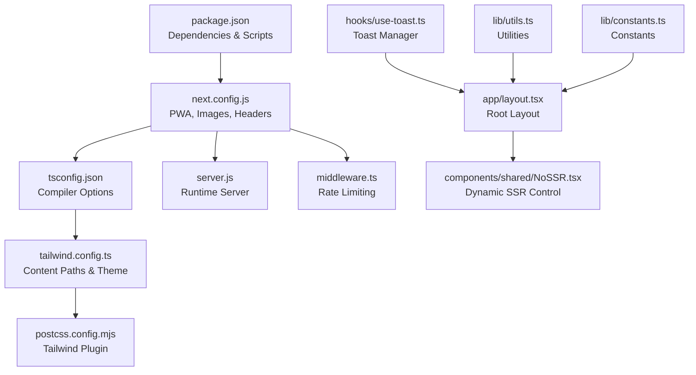
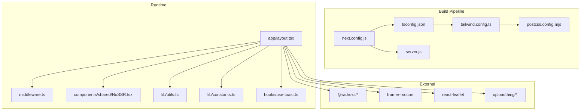
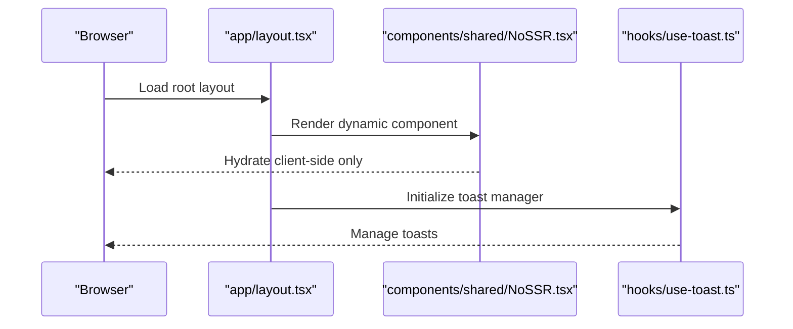

# Bundle Analysis & Optimization

<cite>
**Referenced Files in This Document**
- [package.json](file://package.json)
- [next.config.js](file://next.config.js)
- [tsconfig.json](file://tsconfig.json)
- [tailwind.config.ts](file://tailwind.config.ts)
- [postcss.config.mjs](file://postcss.config.mjs)
- [server.js](file://server.js)
- [middleware.ts](file://middleware.ts)
- [app/layout.tsx](file://app/layout.tsx)
- [components/shared/NoSSR.tsx](file://components/shared/NoSSR.tsx)
- [hooks/use-toast.ts](file://hooks/use-toast.ts)
- [lib/utils.ts](file://lib/utils.ts)
- [lib/constants.ts](file://lib/constants.ts)
</cite>

## Table of Contents
1. [Introduction](#introduction)
2. [Project Structure](#project-structure)
3. [Core Components](#core-components)
4. [Architecture Overview](#architecture-overview)
5. [Detailed Component Analysis](#detailed-component-analysis)
6. [Dependency Analysis](#dependency-analysis)
7. [Performance Considerations](#performance-considerations)
8. [Troubleshooting Guide](#troubleshooting-guide)
9. [Conclusion](#conclusion)
10. [Appendices](#appendices)

## Introduction
This document provides a comprehensive guide to analyzing and optimizing the webpack-based build of Optim Bozor. It covers bundle analysis tools, dependency size tracking, tree shaking, unused code elimination, module deduplication, chunk splitting, code splitting patterns, lazy loading, external library bundling, internal package optimization, version management, build performance, incremental compilation, bundle size monitoring, performance budgets, optimization reporting, third-party library optimization, polyfill strategies, and legacy browser support considerations. Practical examples demonstrate how to reduce bundle size and improve load times.

## Project Structure
Optim Bozor is a Next.js application configured with PWA support, image optimization, and strict mode enabled. The build pipeline leverages SWC minification and Tailwind CSS for styling. The project’s configuration files define caching headers, image remote patterns, and PWA registration behavior.

**Diagram sources**
- [package.json:1-67](file://package.json#L1-L67)
- [next.config.js:1-35](file://next.config.js#L1-L35)
- [tsconfig.json:1-34](file://tsconfig.json#L1-L34)
- [tailwind.config.ts:1-161](file://tailwind.config.ts#L1-L161)
- [postcss.config.mjs:1-9](file://postcss.config.mjs#L1-L9)
- [server.js:1-16](file://server.js#L1-L16)
- [middleware.ts:1-26](file://middleware.ts#L1-L26)
- [app/layout.tsx:1-73](file://app/layout.tsx#L1-L73)
- [components/shared/NoSSR.tsx:1-16](file://components/shared/NoSSR.tsx#L1-L16)
- [hooks/use-toast.ts:1-192](file://hooks/use-toast.ts#L1-L192)
- [lib/utils.ts:1-73](file://lib/utils.ts#L1-L73)
- [lib/constants.ts:1-25](file://lib/constants.ts#L1-L25)

**Section sources**
- [package.json:1-67](file://package.json#L1-L67)
- [next.config.js:1-35](file://next.config.js#L1-L35)
- [tsconfig.json:1-34](file://tsconfig.json#L1-L34)
- [tailwind.config.ts:1-161](file://tailwind.config.ts#L1-L161)
- [postcss.config.mjs:1-9](file://postcss.config.mjs#L1-L9)
- [server.js:1-16](file://server.js#L1-L16)
- [middleware.ts:1-26](file://middleware.ts#L1-L26)
- [app/layout.tsx:1-73](file://app/layout.tsx#L1-L73)
- [components/shared/NoSSR.tsx:1-16](file://components/shared/NoSSR.tsx#L1-L16)
- [hooks/use-toast.ts:1-192](file://hooks/use-toast.ts#L1-L192)
- [lib/utils.ts:1-73](file://lib/utils.ts#L1-L73)
- [lib/constants.ts:1-25](file://lib/constants.ts#L1-L25)

## Core Components
- Dependencies and scripts: The project defines development, build, and lint scripts and lists numerous production dependencies including UI libraries, state management, routing, and utilities.
- Next.js configuration: Enables PWA with caching and service worker registration, sets image remote patterns, strict mode, and SWC minification. Adds cache-control headers for API routes.
- TypeScript configuration: Uses ES2017 target, bundler module resolution, preserve JSX, incremental compilation, and path aliases.
- Tailwind CSS: Scans app, components, and pages directories; extends theme, animations, and gradients; integrates UploadThing plugin.
- PostCSS: Applies Tailwind CSS plugin.
- Runtime server: Standard Next.js server setup with dynamic request handling.
- Middleware: Implements rate limiting and path matching for API and application routes.

**Section sources**
- [package.json:1-67](file://package.json#L1-L67)
- [next.config.js:1-35](file://next.config.js#L1-L35)
- [tsconfig.json:1-34](file://tsconfig.json#L1-L34)
- [tailwind.config.ts:1-161](file://tailwind.config.ts#L1-L161)
- [postcss.config.mjs:1-9](file://postcss.config.mjs#L1-L9)
- [server.js:1-16](file://server.js#L1-L16)
- [middleware.ts:1-26](file://middleware.ts#L1-L26)

## Architecture Overview
The build and runtime architecture centers around Next.js’s Webpack-based pipeline, with PWA caching and image optimization. The root layout initializes providers, loaders, and global styles. Dynamic imports and lazy loading are used selectively to optimize initial bundles.

**Diagram sources**
- [next.config.js:1-35](file://next.config.js#L1-L35)
- [tsconfig.json:1-34](file://tsconfig.json#L1-L34)
- [tailwind.config.ts:1-161](file://tailwind.config.ts#L1-L161)
- [postcss.config.mjs:1-9](file://postcss.config.mjs#L1-L9)
- [server.js:1-16](file://server.js#L1-L16)
- [app/layout.tsx:1-73](file://app/layout.tsx#L1-L73)
- [components/shared/NoSSR.tsx:1-16](file://components/shared/NoSSR.tsx#L1-L16)
- [hooks/use-toast.ts:1-192](file://hooks/use-toast.ts#L1-L192)
- [lib/utils.ts:1-73](file://lib/utils.ts#L1-L73)
- [lib/constants.ts:1-25](file://lib/constants.ts#L1-L25)

## Detailed Component Analysis

### Bundle Analysis Tools and Reporting
- Use Next.js build stats and analyzer plugins to inspect bundle composition. Configure a webpack analyzer plugin in next.config.js to visualize dependencies and their sizes.
- Integrate bundle analyzers during CI to track bundle size trends and enforce budgets.
- Report metrics per page/chunk to identify heavy dependencies and optimize accordingly.

[No sources needed since this section provides general guidance]

### Dependency Size Tracking
- Monitor top dependencies via bundle analyzers and dependency size reports.
- Track growth across versions by pinning major versions and validating bundle deltas after updates.
- Use source maps and profiling tools to identify slow-loading assets.

[No sources needed since this section provides general guidance]

### Tree Shaking Implementation
- Enable SWC minification and strict mode to improve dead-code elimination.
- Prefer ES modules and avoid importing entire libraries; import only named exports.
- Remove unused UI components and utilities from pages and components.

**Section sources**
- [next.config.js:17-18](file://next.config.js#L17-L18)
- [tsconfig.json:10-11](file://tsconfig.json#L10-L11)

### Unused Code Elimination
- Consolidate shared utilities and constants to reduce duplication.
- Avoid global CSS imports; scope styles to components to minimize unused CSS.
- Remove unused third-party packages and replace with smaller alternatives.

**Section sources**
- [lib/utils.ts:1-73](file://lib/utils.ts#L1-L73)
- [lib/constants.ts:1-25](file://lib/constants.ts#L1-L25)

### Module Deduplication Strategies
- Align versions of peer dependencies (e.g., react, react-dom) across the project.
- Use Yarn resolutions or npm overrides to enforce single versions of shared libraries.
- Prefer monorepo-style internal packages to avoid duplication.

[No sources needed since this section provides general guidance]

### Chunk Splitting and Code Splitting Patterns
- Use Next.js automatic code splitting by organizing routes and components into separate pages and route segments.
- Split vendor chunks for large libraries (e.g., UI libraries, maps) to improve caching.
- Lazy load non-critical components using dynamic imports with SSR disabled where appropriate.

**Diagram sources**
- [app/layout.tsx:1-73](file://app/layout.tsx#L1-L73)
- [components/shared/NoSSR.tsx:1-16](file://components/shared/NoSSR.tsx#L1-L16)
- [hooks/use-toast.ts:1-192](file://hooks/use-toast.ts#L1-L192)

**Section sources**
- [app/layout.tsx:1-73](file://app/layout.tsx#L1-L73)
- [components/shared/NoSSR.tsx:1-16](file://components/shared/NoSSR.tsx#L1-L16)
- [hooks/use-toast.ts:1-192](file://hooks/use-toast.ts#L1-L192)

### Lazy Loading Implementations
- Use dynamic imports for heavy components (e.g., maps, modals) and disable SSR when hydration is not required.
- Defer non-critical UI updates until after initial render.

**Section sources**
- [components/shared/NoSSR.tsx:1-16](file://components/shared/NoSSR.tsx#L1-L16)

### Dependency Optimization: External Libraries and Internal Packages
- Externalize large libraries (e.g., UI frameworks) and host them via CDN to reduce bundle size.
- Internalize frequently used utilities and constants to avoid repeated imports.
- Audit dependencies regularly and prune unused ones.

**Section sources**
- [package.json:11-54](file://package.json#L11-L54)

### Version Management
- Pin major versions and test minor updates with automated bundle diffing.
- Use lockfiles to ensure reproducible builds across environments.

**Section sources**
- [package.json:1-67](file://package.json#L1-L67)

### Build Performance Optimization
- Enable SWC minification and incremental TypeScript compilation.
- Leverage Next.js caching and static generation where possible.
- Parallelize builds using CI matrix jobs and cache node_modules.

**Section sources**
- [next.config.js:17-18](file://next.config.js#L17-L18)
- [tsconfig.json:15](file://tsconfig.json#L15)

### Incremental Compilation
- Keep incremental TypeScript compilation enabled to speed up rebuilds.
- Avoid unnecessary recompilations by minimizing global state changes.

**Section sources**
- [tsconfig.json:15](file://tsconfig.json#L15)

### Bundle Size Monitoring and Performance Budgets
- Enforce performance budgets per page/chunk to prevent regressions.
- Monitor bundle size in CI and alert on breaches.

[No sources needed since this section provides general guidance]

### Optimization Reporting
- Generate and publish bundle reports per release.
- Track reduction metrics after applying optimizations.

[No sources needed since this section provides general guidance]

### Third-Party Library Optimization
- Replace heavy libraries with lighter alternatives (e.g., date-fns over moment).
- Import only required locales and features.
- Use tree-shaken imports for UI libraries.

**Section sources**
- [package.json:30](file://package.json#L30)
- [package.json:13-26](file://package.json#L13-L26)

### Polyfill Strategies and Legacy Browser Support
- Target modern browsers and avoid polyfills where possible.
- Use feature detection and dynamic imports for legacy features.

[No sources needed since this section provides general guidance]

### Practical Examples
- Reduce bundle size by:
  - Removing unused UI components and consolidating shared utilities.
  - Switching to tree-shaken imports for large libraries.
  - Lazy loading non-critical components.
  - Externalizing large libraries via CDN.
  - Enabling SWC minification and incremental compilation.

[No sources needed since this section provides general guidance]

## Dependency Analysis
The project relies on a set of UI, state management, routing, and utility libraries. The dependency graph below highlights key relationships and potential optimization opportunities.

```mermaid
graph TB
P["package.json"] --> R["react & react-dom"]
P --> NB["next & next-auth"]
P --> UI["@radix-ui/*"]
P --> FM["framer-motion"]
P --> RL["react-leaflet"]
P --> UT["uploadthing & @uploadthing/react"]
P --> AX["axios"]
P --> ZD["zod"]
P --> ST["zustand"]
P --> RF["react-hook-form"]
P --> CL["clsx & tailwind-merge"]
P --> QS["query-string"]
P --> DF["date-fns"]
P --> LC["lucide-react"]
P --> LZ["lodash"]
P --> JT["jsonwebtoken"]
P --> EX["express"]
P --> PW["next-pwa"]
P --> TL["nextjs-toploader"]
P --> RT["react-toastify"]
subgraph "UI Libraries"
UI
FM
RL
UT
end
subgraph "State & Forms"
ST
RF
ZD
end
subgraph "Utilities"
AX
QS
DF
CL
LC
LZ
end
subgraph "Runtime"
PW
TL
RT
end
```

**Diagram sources**
- [package.json:11-54](file://package.json#L11-L54)

**Section sources**
- [package.json:11-54](file://package.json#L11-L54)

## Performance Considerations
- Minimize initial payload by deferring non-critical features and using code splitting.
- Optimize images and leverage Next.js image optimization with remote patterns.
- Use PWA caching strategically to reduce repeat visits.
- Keep dependencies lean and aligned to reduce bundle bloat.

[No sources needed since this section provides general guidance]

## Troubleshooting Guide
- If builds fail due to module resolution, verify bundler module resolution and path aliases.
- If images fail to load, check remote patterns and protocol configurations.
- If middleware blocks legitimate traffic, adjust rate limiter thresholds and matchers.

**Section sources**
- [tsconfig.json:10-11](file://tsconfig.json#L10-L11)
- [next.config.js:11-16](file://next.config.js#L11-L16)
- [middleware.ts:9-20](file://middleware.ts#L9-L20)

## Conclusion
By combining Next.js’s built-in optimizations (SWC minification, incremental compilation, PWA caching, and image optimization) with targeted dependency pruning, tree shaking, code splitting, and lazy loading, Optim Bozor can achieve significant reductions in bundle size and improved load times. Establishing monitoring and performance budgets ensures sustained performance gains over time.

[No sources needed since this section summarizes without analyzing specific files]

## Appendices
- Recommended tools for bundle analysis: webpack-bundle-analyzer, source-map-explorer, and Next.js build stats.
- Best practices: prefer local utilities over global CSS, import only named exports, externalize large libraries, and monitor bundle deltas after updates.

[No sources needed since this section provides general guidance]