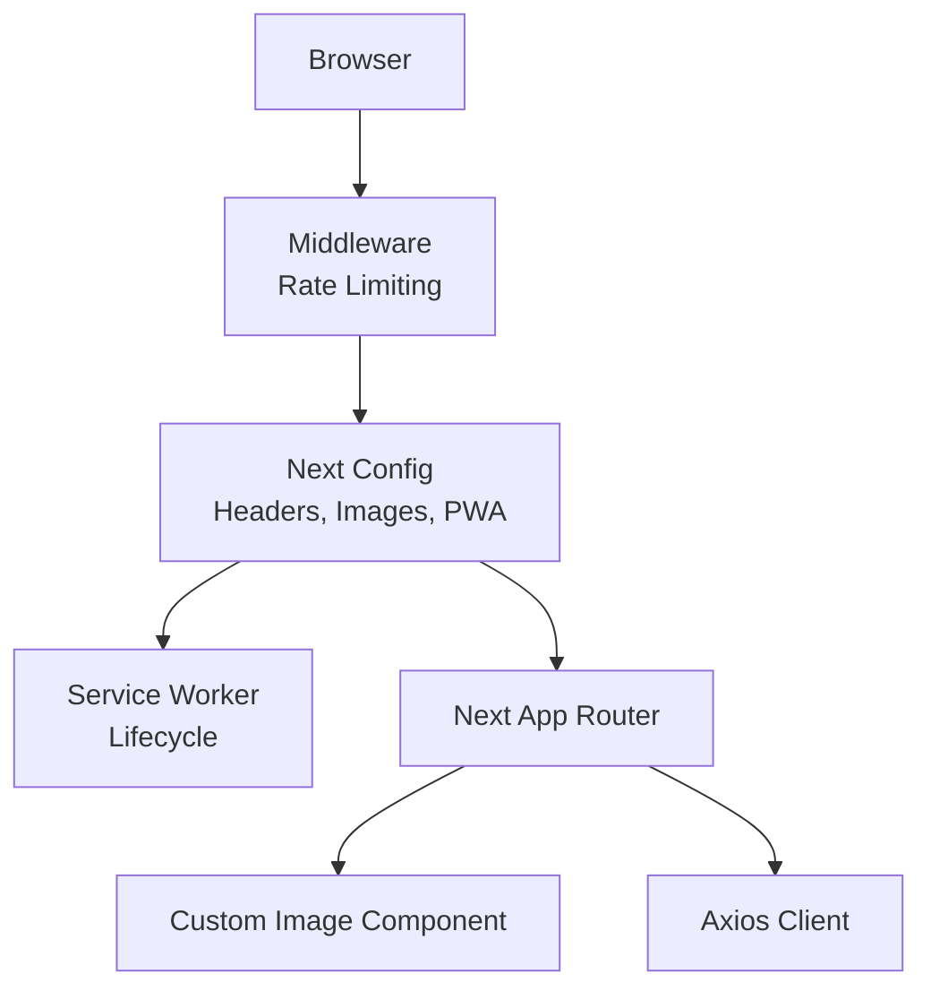
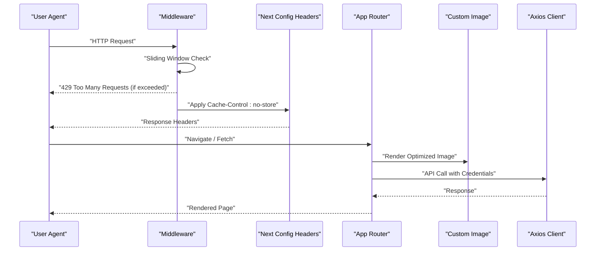
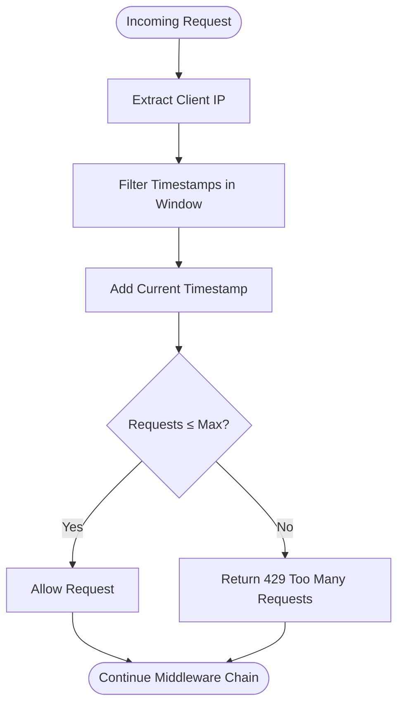
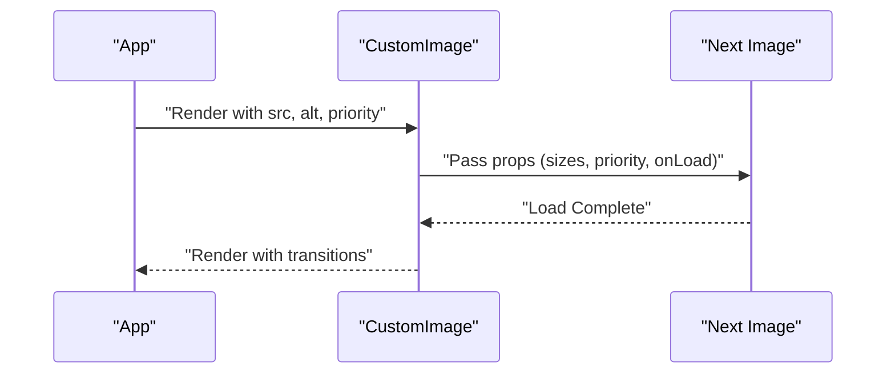
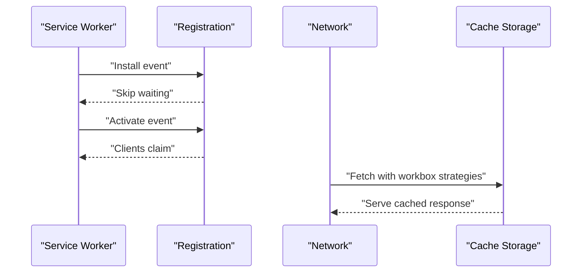
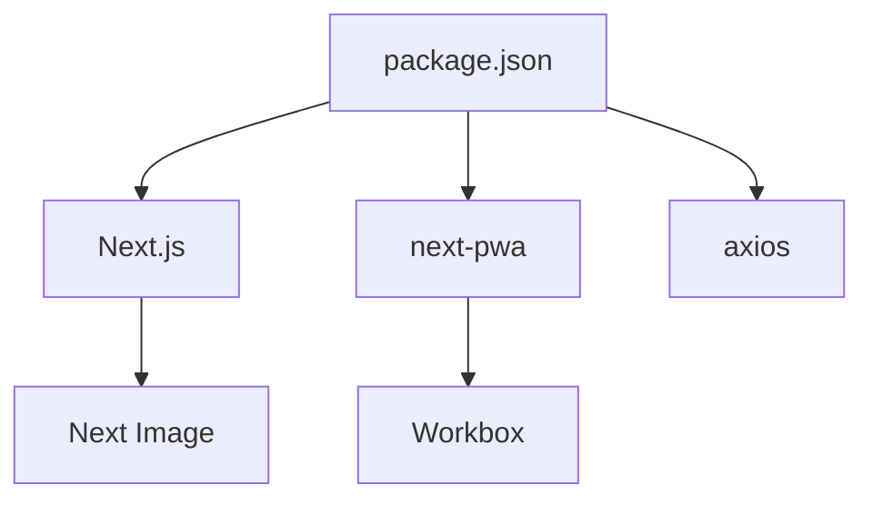

# Caching Strategies & Performance

<cite>
**Referenced Files in This Document**
- [middleware.ts](file://middleware.ts)
- [rate-limiter.ts](file://lib/rate-limiter.ts)
- [next.config.js](file://next.config.js)
- [server.js](file://server.js)
- [sw.js](file://public/sw.js)
- [custom-image.tsx](file://components/shared/custom-image.tsx)
- [axios.ts](file://http/axios.ts)
- [button.tsx](file://components/ui/button.tsx)
- [package.json](file://package.json)
</cite>

## Table of Contents
1. [Introduction](#introduction)
2. [Project Structure](#project-structure)
3. [Core Components](#core-components)
4. [Architecture Overview](#architecture-overview)
5. [Detailed Component Analysis](#detailed-component-analysis)
6. [Dependency Analysis](#dependency-analysis)
7. [Performance Considerations](#performance-considerations)
8. [Troubleshooting Guide](#troubleshooting-guide)
9. [Conclusion](#conclusion)
10. [Appendices](#appendices)

## Introduction
This document provides a comprehensive guide to caching strategies and performance optimization for Optim Bozor. It covers browser caching controls, server-side rate limiting, PWA caching, image optimization, CDN and static asset delivery, local storage and IndexedDB usage, performance monitoring, cache invalidation, stale-while-revalidate patterns, cache warming, and benchmarking methodologies. The goal is to help developers implement robust caching and performance improvements while maintaining correctness and scalability.

## Project Structure
Optim Bozor is a Next.js application with a clear separation of concerns:
- Middleware handles request-level rate limiting and routing.
- Next.js configuration defines headers, image optimization, and PWA caching.
- A service worker script supports basic PWA lifecycle events.
- Client-side components leverage Next.js Image for optimized rendering.
- HTTP client configuration centralizes API base URL and credentials.

**Diagram sources**
- [middleware.ts:1-26](file://middleware.ts#L1-L26)
- [next.config.js:10-35](file://next.config.js#L10-L35)
- [sw.js:1-7](file://public/sw.js#L1-L7)
- [custom-image.tsx:1-32](file://components/shared/custom-image.tsx#L1-L32)
- [axios.ts:1-10](file://http/axios.ts#L1-L10)

**Section sources**
- [middleware.ts:1-26](file://middleware.ts#L1-L26)
- [next.config.js:10-35](file://next.config.js#L10-L35)
- [sw.js:1-7](file://public/sw.js#L1-L7)
- [custom-image.tsx:1-32](file://components/shared/custom-image.tsx#L1-L32)
- [axios.ts:1-10](file://http/axios.ts#L1-L10)

## Core Components
- Middleware-based rate limiting enforces request quotas per IP using an in-memory map with a sliding window.
- Next.js headers enforce no-store for API routes to prevent caching sensitive responses.
- Next.js Image optimization and custom image component improve loading performance.
- PWA configuration integrates workbox caching with a placeholder runtime cache array.
- Axios client centralizes base URL and credentials for API calls.

Key implementation references:
- [middleware.ts:9-20](file://middleware.ts#L9-L20)
- [rate-limiter.ts:9-28](file://lib/rate-limiter.ts#L9-L28)
- [next.config.js:20-31](file://next.config.js#L20-L31)
- [next.config.js:2-8](file://next.config.js#L2-L8)
- [custom-image.tsx:12-28](file://components/shared/custom-image.tsx#L12-L28)
- [axios.ts:3-9](file://http/axios.ts#L3-L9)

**Section sources**
- [middleware.ts:9-20](file://middleware.ts#L9-L20)
- [rate-limiter.ts:9-28](file://lib/rate-limiter.ts#L9-L28)
- [next.config.js:20-31](file://next.config.js#L20-L31)
- [next.config.js:2-8](file://next.config.js#L2-L8)
- [custom-image.tsx:12-28](file://components/shared/custom-image.tsx#L12-L28)
- [axios.ts:3-9](file://http/axios.ts#L3-L9)

## Architecture Overview
The caching and performance architecture combines client-side, server-side, and network-level strategies:
- Browser caching: Cache-Control headers applied to API routes.
- Server-side rate limiting: Sliding-window in-memory rate limiter.
- PWA caching: Workbox caching with a configurable runtime cache.
- Image optimization: Next.js Image with responsive sizes and priority hints.
- Local storage and offline: Service worker lifecycle and potential IndexedDB usage.

**Diagram sources**
- [middleware.ts:9-20](file://middleware.ts#L9-L20)
- [next.config.js:20-31](file://next.config.js#L20-L31)
- [custom-image.tsx:12-28](file://components/shared/custom-image.tsx#L12-L28)
- [axios.ts:3-9](file://http/axios.ts#L3-L9)

## Detailed Component Analysis

### Browser Caching Controls
- API routes receive Cache-Control: no-store headers to prevent caching of sensitive or dynamic responses.
- These headers apply to both authentication and general API routes.

Implementation highlights:
- [next.config.js:20-31](file://next.config.js#L20-L31)

Recommended enhancements:
- Introduce Cache-Control headers selectively for read-only, stable endpoints (e.g., product catalogs) with appropriate max-age and immutable directives for static assets.
- Use ETag or Last-Modified for conditional GET requests on stable resources.

**Section sources**
- [next.config.js:20-31](file://next.config.js#L20-L31)

### Server-Side Rate Limiting Middleware
- Sliding window rate limiter tracks timestamps per IP within a fixed time window.
- Exceeding the configured threshold returns a 429 response.

**Diagram sources**
- [middleware.ts:4-7](file://middleware.ts#L4-L7)
- [rate-limiter.ts:9-28](file://lib/rate-limiter.ts#L9-L28)

Operational notes:
- The limiter uses an in-memory Map; for distributed deployments, consider Redis-backed counters.
- The window size and max requests are defined in seconds and integer counts respectively.

**Section sources**
- [middleware.ts:9-20](file://middleware.ts#L9-L20)
- [rate-limiter.ts:1-29](file://lib/rate-limiter.ts#L1-L29)

### API Response Caching
- Current configuration applies no-store headers to API routes, disabling caching.
- To enable caching:
  - Define Cache-Control headers for read-only endpoints.
  - Implement ETag generation on the server for conditional requests.
  - Use vary headers when caching depends on Accept-Language, Accept-Encoding, etc.

Reference:
- [next.config.js:20-31](file://next.config.js#L20-L31)

**Section sources**
- [next.config.js:20-31](file://next.config.js#L20-L31)

### Database Query Optimization
- The codebase does not expose explicit database query logic in the analyzed files.
- Recommended practices:
  - Use indexing on frequently queried columns.
  - Apply query result caching for expensive reads.
  - Implement pagination and filtering to reduce payload sizes.

[No sources needed since this section provides general guidance]

### CDN Configuration for Static Assets
- Next.js image optimization is enabled with remote patterns for UploadThing and wildcard hosts.
- Configure a CDN for static assets and images to reduce origin load and latency.

Recommendations:
- Set up a CDN with origin pull or push delivery.
- Enable compression and caching policies aligned with asset types.
- Use immutable caching for versioned assets.

**Section sources**
- [next.config.js:11-16](file://next.config.js#L11-L16)

### Image Optimization Delivery
- Next.js Image is used with responsive sizes and priority hints.
- The custom image component adds loading transitions and priority attributes.

**Diagram sources**
- [custom-image.tsx:12-28](file://components/shared/custom-image.tsx#L12-L28)

Best practices:
- Prefer modern formats (WebP, AVIF) when supported.
- Serve appropriately sized images for device widths.
- Lazy-load offscreen images.

**Section sources**
- [custom-image.tsx:12-28](file://components/shared/custom-image.tsx#L12-L28)

### PWA and Service Worker Caching
- PWA is enabled with workbox caching configured but with an empty runtime cache array.
- The service worker script implements install and activate lifecycles.

**Diagram sources**
- [sw.js:1-7](file://public/sw.js#L1-L7)
- [next.config.js:2-8](file://next.config.js#L2-L8)

Recommendations:
- Populate runtimeCaching with sensible strategies (cache-first for static assets, stale-while-revalidate for API).
- Implement cache warming during service worker activation.
- Use cache expiration and cache versioning to manage updates.

**Section sources**
- [sw.js:1-7](file://public/sw.js#L1-L7)
- [next.config.js:2-8](file://next.config.js#L2-L8)

### Local Storage Optimization and Offline Data
- The codebase does not show explicit IndexedDB usage.
- Recommendations:
  - Use localStorage for small, fast, synchronous data (e.g., user preferences).
  - Use IndexedDB for larger datasets requiring asynchronous operations.
  - Implement structured cloning and versioning for IndexedDB schemas.
  - Combine with service worker caching for offline-first experiences.

[No sources needed since this section provides general guidance]

### Cache Invalidation, Stale-While-Revalidate, and Cache Warming
- Stale-while-revalidate:
  - Serve cached content immediately and update cache asynchronously.
  - Useful for reducing perceived latency on repeat visits.
- Cache invalidation:
  - Use cache tags or cache keys to invalidate related entries.
  - Implement cache-busting for assets (e.g., versioned filenames).
- Cache warming:
  - Preload critical pages and assets during service worker activation or initial navigation.

[No sources needed since this section provides general guidance]

### Performance Monitoring Setup
- Lighthouse: Run automated audits via CLI or Chrome DevTools.
- Web Vitals: Integrate Core Web Vitals reporting in production.
- Real User Monitoring (RUM): Use browser extension APIs or dedicated RUM providers.

[No sources needed since this section provides general guidance]

### Benchmarking Methodologies and Tools
- Synthetic testing: Use tools like Lighthouse, Pagespeed Insights, or Artillery.
- Real user monitoring: Track observed metrics in production environments.
- A/B testing: Validate caching changes against control groups.

[No sources needed since this section provides general guidance]

## Dependency Analysis
The application’s performance-related dependencies include Next.js, next-pwa, axios, and related libraries. These influence caching behavior and performance characteristics.

**Diagram sources**
- [package.json:38-53](file://package.json#L38-L53)

**Section sources**
- [package.json:38-53](file://package.json#L38-L53)

## Performance Considerations
- Minimize round trips by enabling appropriate caching headers for stable endpoints.
- Optimize images with Next.js Image and responsive sizing.
- Use PWA caching strategies to reduce origin requests.
- Implement rate limiting to protect backend resources.
- Monitor performance with Lighthouse and Web Vitals.

[No sources needed since this section provides general guidance]

## Troubleshooting Guide
- 429 Too Many Requests:
  - Cause: Rate limiter exceeded for the client IP.
  - Resolution: Reduce client-side polling frequency or increase limits.
  - Reference: [middleware.ts:12-17](file://middleware.ts#L12-L17), [rate-limiter.ts:27](file://lib/rate-limiter.ts#L27)
- API responses not cached:
  - Cause: no-store headers applied to API routes.
  - Resolution: Adjust headers for read-only endpoints and implement ETag support.
  - Reference: [next.config.js:20-31](file://next.config.js#L20-L31)
- PWA caching not effective:
  - Cause: Empty runtimeCaching array.
  - Resolution: Configure workbox strategies for static assets and API responses.
  - Reference: [next.config.js:2-8](file://next.config.js#L2-L8), [sw.js:1-7](file://public/sw.js#L1-L7)
- Image loading delays:
  - Cause: Missing priority or responsive sizes.
  - Resolution: Ensure priority prop and sizes configuration in image components.
  - Reference: [custom-image.tsx:12-28](file://components/shared/custom-image.tsx#L12-L28)

**Section sources**
- [middleware.ts:12-17](file://middleware.ts#L12-L17)
- [rate-limiter.ts:27](file://lib/rate-limiter.ts#L27)
- [next.config.js:20-31](file://next.config.js#L20-L31)
- [next.config.js:2-8](file://next.config.js#L2-L8)
- [sw.js:1-7](file://public/sw.js#L1-L7)
- [custom-image.tsx:12-28](file://components/shared/custom-image.tsx#L12-L28)

## Conclusion
Optimizing caching and performance in Optim Bozor requires a layered approach: enforcing proper browser caching headers, implementing robust server-side rate limiting, leveraging Next.js image optimization, configuring PWA caching, and adopting CDN strategies. By introducing selective caching, ETag support, and structured monitoring, the platform can achieve significant improvements in speed, reliability, and user experience.

[No sources needed since this section summarizes without analyzing specific files]

## Appendices
- Example cache policy for stable endpoints:
  - Cache-Control: public, max-age=3600, s-maxage=86400, must-revalidate
  - ETag: generated from response body hash
  - Vary: Accept-Language, Accept-Encoding
- Example workbox runtime caching entries:
  - Static assets: cache-first with versioned URLs
  - API responses: stale-while-revalidate with short max-age
- Example service worker cache warming:
  - Pre-fetch critical pages and images during activate event

[No sources needed since this section provides general guidance]