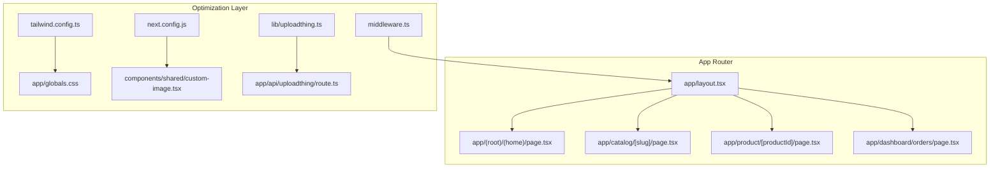
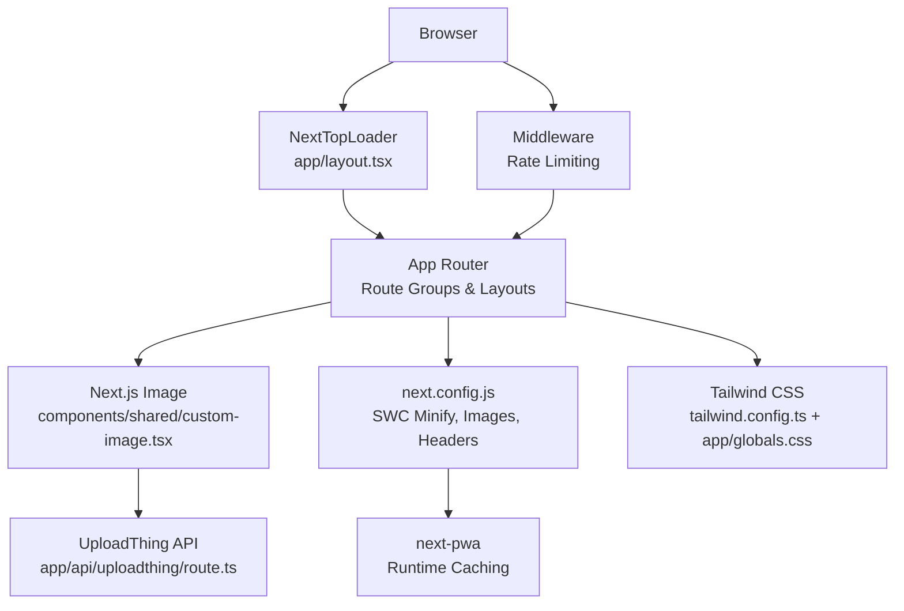
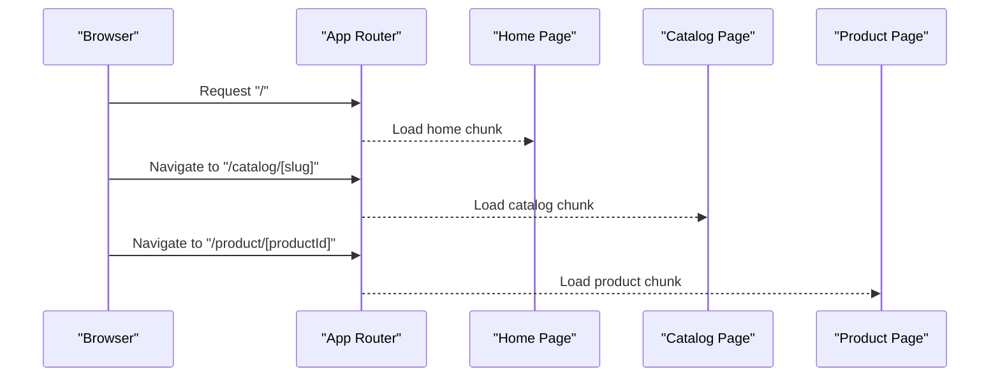
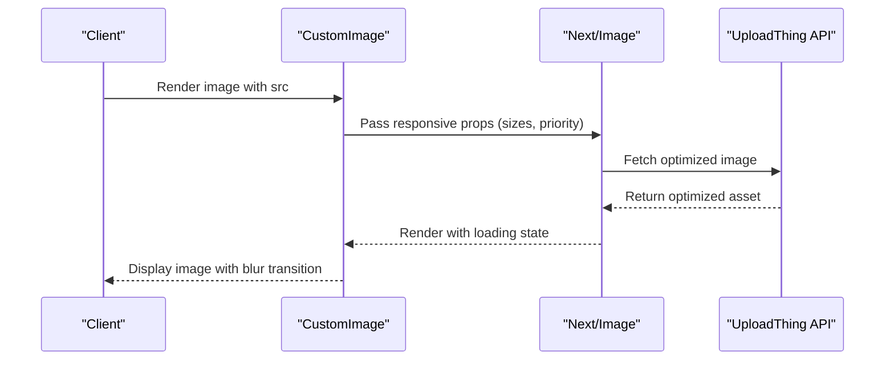
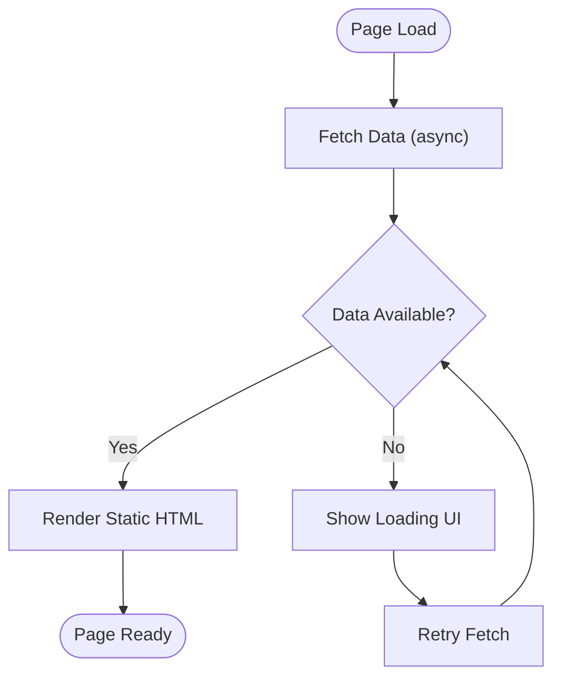
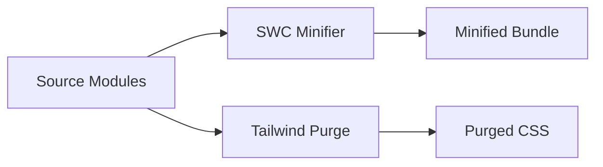
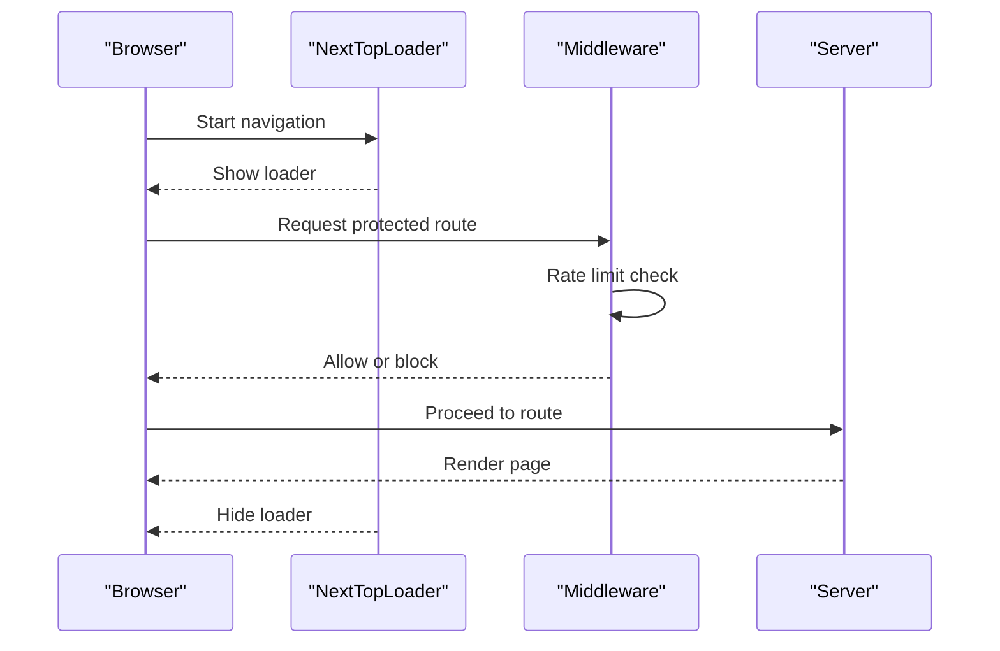
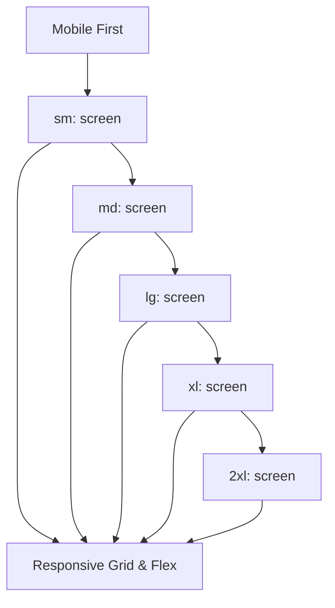
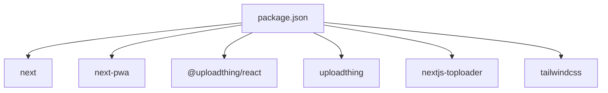

# Next.js Optimization Features

<cite>
**Referenced Files in This Document**
- [next.config.js](file://next.config.js)
- [package.json](file://package.json)
- [tailwind.config.ts](file://tailwind.config.ts)
- [postcss.config.mjs](file://postcss.config.mjs)
- [app/layout.tsx](file://app/layout.tsx)
- [app/globals.css](file://app/globals.css)
- [components/shared/custom-image.tsx](file://components/shared/custom-image.tsx)
- [lib/uploadthing.ts](file://lib/uploadthing.ts)
- [app/api/uploadthing/route.ts](file://app/api/uploadthing/route.ts)
- [middleware.ts](file://middleware.ts)
- [app/dashboard/orders/page.tsx](file://app/dashboard/orders/page.tsx)
</cite>

## Table of Contents
1. [Introduction](#introduction)
2. [Project Structure](#project-structure)
3. [Core Components](#core-components)
4. [Architecture Overview](#architecture-overview)
5. [Detailed Component Analysis](#detailed-component-analysis)
6. [Dependency Analysis](#dependency-analysis)
7. [Performance Considerations](#performance-considerations)
8. [Troubleshooting Guide](#troubleshooting-guide)
9. [Conclusion](#conclusion)

## Introduction
This document explains Next.js optimization features implemented in Optim Bozor. It covers automatic code splitting via the App Router file system, dynamic imports for components, route-based bundling, image optimization with UploadThing remote patterns, responsive image generation, static generation and ISR patterns, SWC minification and tree shaking, performance monitoring, build optimization reports, and mobile-first responsive design strategies.

## Project Structure
Optim Bozor follows the Next.js App Router convention with route groups, nested layouts, and per-route components. The project leverages:
- App Router file system for automatic code splitting and route-based bundling
- Tailwind CSS for utility-first styling and responsive design
- Next.js Image Optimization for responsive images and performance
- PWA configuration for caching and offline readiness
- Middleware for request rate limiting and routing control

**Diagram sources**
- [app/layout.tsx:1-73](file://app/layout.tsx#L1-L73)
- [next.config.js:1-35](file://next.config.js#L1-L35)
- [tailwind.config.ts:1-161](file://tailwind.config.ts#L1-L161)
- [app/globals.css:1-315](file://app/globals.css#L1-L315)
- [components/shared/custom-image.tsx:1-32](file://components/shared/custom-image.tsx#L1-L32)
- [lib/uploadthing.ts:1-9](file://lib/uploadthing.ts#L1-L9)
- [app/api/uploadthing/route.ts:1-7](file://app/api/uploadthing/route.ts#L1-L7)
- [middleware.ts:1-26](file://middleware.ts#L1-L26)

**Section sources**
- [app/layout.tsx:1-73](file://app/layout.tsx#L1-L73)
- [next.config.js:1-35](file://next.config.js#L1-L35)
- [tailwind.config.ts:1-161](file://tailwind.config.ts#L1-L161)
- [app/globals.css:1-315](file://app/globals.css#L1-L315)
- [components/shared/custom-image.tsx:1-32](file://components/shared/custom-image.tsx#L1-L32)
- [lib/uploadthing.ts:1-9](file://lib/uploadthing.ts#L1-L9)
- [app/api/uploadthing/route.ts:1-7](file://app/api/uploadthing/route.ts#L1-L7)
- [middleware.ts:1-26](file://middleware.ts#L1-L26)

## Core Components
- Automatic code splitting and route-based bundling: Implemented through the App Router’s file system. Route segments and nested layouts create separate bundles per route.
- Image optimization: Next.js Image component with responsive sizes and priority hints; UploadThing remote pattern configured for optimized assets.
- PWA and caching: next-pwa plugin with runtime caching configuration and service worker registration.
- Static generation and ISR: Pages using asynchronous data fetching demonstrate server-side rendering and static generation patterns; fallback strategies are implicit via loading UIs.
- SWC minification and tree shaking: Enabled via next.config.js; tree shaking benefits from ES module usage across the codebase.
- Performance monitoring: NextTopLoader for visual feedback during navigation; middleware for rate limiting and request control.
- Responsive design: Tailwind CSS utilities and custom animations; mobile-first container sizing and spacing.

**Section sources**
- [next.config.js:1-35](file://next.config.js#L1-L35)
- [components/shared/custom-image.tsx:1-32](file://components/shared/custom-image.tsx#L1-L32)
- [lib/uploadthing.ts:1-9](file://lib/uploadthing.ts#L1-L9)
- [app/api/uploadthing/route.ts:1-7](file://app/api/uploadthing/route.ts#L1-L7)
- [app/layout.tsx:1-73](file://app/layout.tsx#L1-L73)
- [middleware.ts:1-26](file://middleware.ts#L1-L26)
- [tailwind.config.ts:1-161](file://tailwind.config.ts#L1-L161)
- [app/globals.css:1-315](file://app/globals.css#L1-L315)

## Architecture Overview
The optimization architecture integrates Next.js App Router, Image Optimization, PWA, middleware, and Tailwind CSS to deliver fast, responsive experiences.

**Diagram sources**
- [app/layout.tsx:1-73](file://app/layout.tsx#L1-L73)
- [components/shared/custom-image.tsx:1-32](file://components/shared/custom-image.tsx#L1-L32)
- [app/api/uploadthing/route.ts:1-7](file://app/api/uploadthing/route.ts#L1-L7)
- [next.config.js:1-35](file://next.config.js#L1-L35)
- [tailwind.config.ts:1-161](file://tailwind.config.ts#L1-L161)
- [app/globals.css:1-315](file://app/globals.css#L1-L315)
- [middleware.ts:1-26](file://middleware.ts#L1-L26)

## Detailed Component Analysis

### Automatic Code Splitting and Route-Based Bundling
- Route groups and nested layouts create separate chunks per route segment.
- Dynamic imports can be used for heavy components to further optimize initial load.
- Route-based bundling ensures only the necessary code for the current page is loaded.

**Diagram sources**
- [app/layout.tsx:1-73](file://app/layout.tsx#L1-L73)

**Section sources**
- [app/layout.tsx:1-73](file://app/layout.tsx#L1-L73)

### Image Optimization and Responsive Images
- Remote pattern support for UploadThing enables optimized images served via utfs.io.
- The custom Image component sets responsive sizes and priority for above-the-fold content.
- Loading transitions improve perceived performance.

**Diagram sources**
- [components/shared/custom-image.tsx:1-32](file://components/shared/custom-image.tsx#L1-L32)
- [app/api/uploadthing/route.ts:1-7](file://app/api/uploadthing/route.ts#L1-L7)
- [next.config.js:10-19](file://next.config.js#L10-L19)

**Section sources**
- [next.config.js:10-19](file://next.config.js#L10-L19)
- [components/shared/custom-image.tsx:1-32](file://components/shared/custom-image.tsx#L1-L32)
- [lib/uploadthing.ts:1-9](file://lib/uploadthing.ts#L1-L9)
- [app/api/uploadthing/route.ts:1-7](file://app/api/uploadthing/route.ts#L1-L7)

### Static Generation and ISR Patterns
- Pages fetch data asynchronously; successful responses render static HTML.
- Loading UIs provide fallbacks while data loads.
- Pagination demonstrates server-rendered lists with optional caching strategies.

**Diagram sources**
- [app/dashboard/orders/page.tsx:58-83](file://app/dashboard/orders/page.tsx#L58-L83)

**Section sources**
- [app/dashboard/orders/page.tsx:58-83](file://app/dashboard/orders/page.tsx#L58-L83)

### SWC Minification, Tree Shaking, and Dead Code Elimination
- SWC minification enabled in next.config.js reduces bundle sizes.
- Tree shaking benefits from ES modules and unused exports removal.
- Tailwind purging via content globs removes unused CSS.

**Diagram sources**
- [next.config.js:17-18](file://next.config.js#L17-L18)
- [tailwind.config.ts:6-10](file://tailwind.config.ts#L6-L10)
- [postcss.config.mjs:1-9](file://postcss.config.mjs#L1-L9)

**Section sources**
- [next.config.js:17-18](file://next.config.js#L17-L18)
- [tailwind.config.ts:6-10](file://tailwind.config.ts#L6-L10)
- [postcss.config.mjs:1-9](file://postcss.config.mjs#L1-L9)

### Performance Monitoring and Navigation Feedback
- NextTopLoader provides visual feedback during page navigation.
- Middleware enforces rate limits to protect backend resources.

**Diagram sources**
- [app/layout.tsx:57-65](file://app/layout.tsx#L57-L65)
- [middleware.ts:9-20](file://middleware.ts#L9-L20)

**Section sources**
- [app/layout.tsx:57-65](file://app/layout.tsx#L57-L65)
- [middleware.ts:9-20](file://middleware.ts#L9-L20)

### Mobile-First Optimization and Responsive Design
- Tailwind’s container screens and spacing scale for small, medium, and large devices.
- Utility classes enable responsive layouts and component scaling.
- Custom animations and transitions enhance perceived performance on mobile.

**Diagram sources**
- [tailwind.config.ts:16-26](file://tailwind.config.ts#L16-L26)
- [app/globals.css:1-315](file://app/globals.css#L1-L315)

**Section sources**
- [tailwind.config.ts:16-26](file://tailwind.config.ts#L16-L26)
- [app/globals.css:1-315](file://app/globals.css#L1-L315)

## Dependency Analysis
Key optimization-related dependencies and their roles:
- next-pwa: Enables PWA features and service worker registration.
- next: Provides App Router, Image Optimization, SWC minification, and static generation.
- uploadthing and @uploadthing/react: File upload infrastructure integrated with Image Optimization.
- nextjs-toploader: Navigation performance indicator.
- tailwindcss: Utility-first CSS framework with purge for dead code elimination.

**Diagram sources**
- [package.json:11-54](file://package.json#L11-L54)

**Section sources**
- [package.json:11-54](file://package.json#L11-L54)

## Performance Considerations
- Prefer the Next.js Image component with appropriate sizes and priority for above-the-fold images.
- Use route groups to split large pages into smaller bundles.
- Enable SWC minification and rely on Tailwind purging to remove unused CSS.
- Implement lazy loading and skeleton loaders for lists and paginated content.
- Monitor navigation performance with NextTopLoader and enforce rate limits via middleware.
- Keep remote image origins secure and use UploadThing remote patterns for optimized assets.

[No sources needed since this section provides general guidance]

## Troubleshooting Guide
- Image not loading: Verify UploadThing remote pattern configuration and ensure the image URL matches the allowed host pattern.
- PWA not registering: Confirm next-pwa configuration and that the app runs in production mode.
- Excessive bundle size: Audit Tailwind purging and remove unused styles; leverage route-based bundling and dynamic imports.
- Slow navigation: Use NextTopLoader to identify slow routes and apply code splitting or defer non-critical features.
- Rate limiting errors: Review middleware matcher and rate limiter logic to avoid blocking legitimate traffic.

**Section sources**
- [next.config.js:10-19](file://next.config.js#L10-L19)
- [middleware.ts:9-20](file://middleware.ts#L9-L20)
- [tailwind.config.ts:6-10](file://tailwind.config.ts#L6-L10)

## Conclusion
Optim Bozor leverages Next.js App Router for automatic code splitting, Image Optimization for responsive assets, PWA for caching, and Tailwind CSS for efficient styling. SWC minification and middleware-driven rate limiting contribute to performance and reliability. By combining route-based bundling, dynamic imports, and mobile-first design, the application achieves fast, scalable user experiences.

[No sources needed since this section summarizes without analyzing specific files]