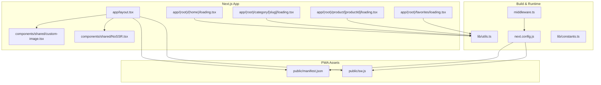
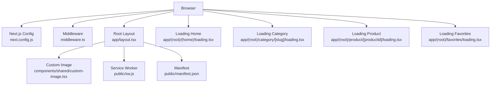
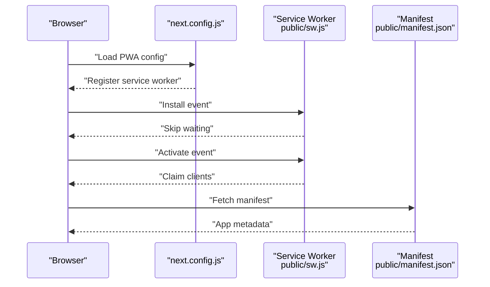
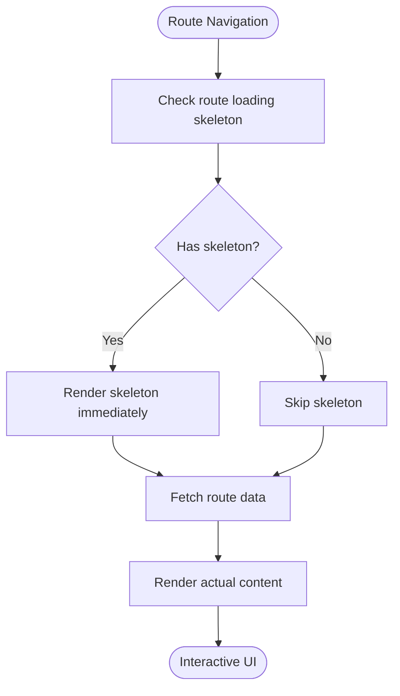
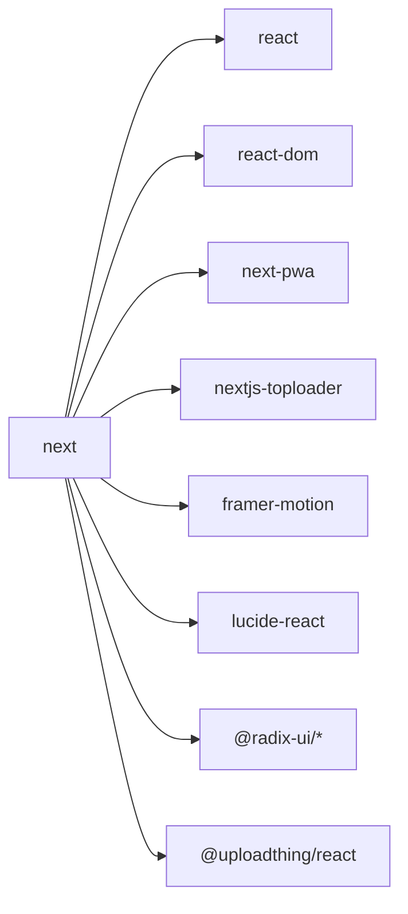

# Performance & Optimization

<cite>
**Referenced Files in This Document**
- [next.config.js](file://next.config.js)
- [package.json](file://package.json)
- [middleware.ts](file://middleware.ts)
- [app/layout.tsx](file://app/layout.tsx)
- [public/manifest.json](file://public/manifest.json)
- [public/sw.js](file://public/sw.js)
- [components/shared/custom-image.tsx](file://components/shared/custom-image.tsx)
- [components/shared/NoSSR.tsx](file://components/shared/NoSSR.tsx)
- [app/(root)/(home)/loading.tsx](file://app/(root)/(home)/loading.tsx)
- [app/(root)/category/[slug]/loading.tsx](file://app/(root)/category/[slug]/loading.tsx)
- [app/(root)/product/[productId]/loading.tsx](file://app/(root)/product/[productId]/loading.tsx)
- [app/(root)/favorites/loading.tsx](file://app/(root)/favorites/loading.tsx)
- [lib/utils.ts](file://lib/utils.ts)
- [lib/constants.ts](file://lib/constants.ts)
</cite>

## Table of Contents
1. [Introduction](#introduction)
2. [Project Structure](#project-structure)
3. [Core Components](#core-components)
4. [Architecture Overview](#architecture-overview)
5. [Detailed Component Analysis](#detailed-component-analysis)
6. [Dependency Analysis](#dependency-analysis)
7. [Performance Considerations](#performance-considerations)
8. [Troubleshooting Guide](#troubleshooting-guide)
9. [Conclusion](#conclusion)

## Introduction
This document provides comprehensive performance and optimization guidance for Optim Bozor, focusing on Next.js optimization features, Progressive Web App (PWA) capabilities, lazy loading strategies, caching mechanisms, bundle optimization, and mobile/Core Web Vitals considerations. It synthesizes the current configuration and implementation patterns present in the repository to deliver actionable insights and best practices.

## Project Structure
Optim Bozor follows a Next.js App Router project layout with feature-based pages under the app directory, shared UI components, and PWA assets in the public directory. Key performance-relevant areas include:
- Next.js configuration for image optimization, strict mode, minification, and headers
- Middleware for rate limiting and request handling
- PWA setup via next-pwa integration, service worker, and manifest
- Client-side image optimization with next/image and custom image wrapper
- Dynamic imports for client-only rendering and NoSSR components
- Route-level loading skeletons for perceived performance and UX continuity
- Utility helpers for class merging and URL manipulation

**Diagram sources**
- [app/layout.tsx:1-73](file://app/layout.tsx#L1-L73)
- [next.config.js:1-35](file://next.config.js#L1-L35)
- [middleware.ts:1-26](file://middleware.ts#L1-L26)
- [public/manifest.json:1-61](file://public/manifest.json#L1-L61)
- [public/sw.js:1-7](file://public/sw.js#L1-L7)
- [components/shared/custom-image.tsx:1-32](file://components/shared/custom-image.tsx#L1-L32)
- [components/shared/NoSSR.tsx:1-16](file://components/shared/NoSSR.tsx#L1-L16)
- [app/(root)/(home)/loading.tsx:1-175](file://app/(root)/(home)/loading.tsx#L1-L175)
- [app/(root)/category/[slug]/loading.tsx:1-23](file://app/(root)/category/[slug]/loading.tsx#L1-L23)
- [app/(root)/product/[productId]/loading.tsx:1-36](file://app/(root)/product/[productId]/loading.tsx#L1-L36)
- [app/(root)/favorites/loading.tsx:1-14](file://app/(root)/favorites/loading.tsx#L1-L14)
- [lib/utils.ts:1-73](file://lib/utils.ts#L1-L73)
- [lib/constants.ts:1-25](file://lib/constants.ts#L1-L25)

**Section sources**
- [next.config.js:1-35](file://next.config.js#L1-L35)
- [package.json:1-67](file://package.json#L1-L67)
- [middleware.ts:1-26](file://middleware.ts#L1-L26)
- [app/layout.tsx:1-73](file://app/layout.tsx#L1-L73)
- [public/manifest.json:1-61](file://public/manifest.json#L1-L61)
- [public/sw.js:1-7](file://public/sw.js#L1-L7)

## Core Components
- Next.js configuration and optimization
  - Image optimization with remotePatterns for secure external image sources
  - React strict mode enabled for extra checks
  - SWC minification enabled for smaller bundles
  - Cache-control headers set to no-store for API routes to prevent unwanted caching
- PWA integration
  - next-pwa plugin configured with destination folder, registration, and skipWaiting
  - Service worker lifecycle events handled in public/sw.js
  - App manifest defined in public/manifest.json with multiple icon sizes and standalone display
- Middleware
  - Rate limiter middleware applied to incoming requests with IP extraction and blocking on limit exceeded
- Client-side image optimization
  - CustomImage component wraps next/image with priority, sizes, and loading state transitions
- Lazy loading and SSR control
  - NoSSR component disables server-side rendering for client-only components
- Route-level loading states
  - Skeleton-based loading UIs for home, category, product, and favorites routes to improve perceived performance

**Section sources**
- [next.config.js:10-32](file://next.config.js#L10-L32)
- [next.config.js:2-8](file://next.config.js#L2-L8)
- [public/sw.js:1-7](file://public/sw.js#L1-L7)
- [public/manifest.json:1-61](file://public/manifest.json#L1-L61)
- [middleware.ts:9-20](file://middleware.ts#L9-L20)
- [components/shared/custom-image.tsx:12-28](file://components/shared/custom-image.tsx#L12-L28)
- [components/shared/NoSSR.tsx:8-13](file://components/shared/NoSSR.tsx#L8-L13)
- [app/(root)/(home)/loading.tsx:6-175](file://app/(root)/(home)/loading.tsx#L6-L175)
- [app/(root)/category/[slug]/loading.tsx:1-L23](file://app/(root)/category/[slug]/loading.tsx#L1-L23)
- [app/(root)/product/[productId]/loading.tsx:1-L36](file://app/(root)/product/[productId]/loading.tsx#L1-L36)
- [app/(root)/favorites/loading.tsx:1-14](file://app/(root)/favorites/loading.tsx#L1-L14)

## Architecture Overview
The performance architecture integrates Next.js optimizations with PWA capabilities and client-side enhancements:
- Build-time: next.config.js enables image optimization, minification, and cache headers
- Runtime: middleware enforces rate limits; PWA assets enable offline and installability
- Client: custom image optimization, skeleton loaders, and dynamic imports reduce initial payload and improve UX

**Diagram sources**
- [next.config.js:10-32](file://next.config.js#L10-L32)
- [middleware.ts:9-20](file://middleware.ts#L9-L20)
- [public/sw.js:1-7](file://public/sw.js#L1-L7)
- [public/manifest.json:1-61](file://public/manifest.json#L1-L61)
- [app/layout.tsx:57-70](file://app/layout.tsx#L57-L70)
- [components/shared/custom-image.tsx:12-28](file://components/shared/custom-image.tsx#L12-L28)
- [app/(root)/(home)/loading.tsx:6-175](file://app/(root)/(home)/loading.tsx#L6-L175)
- [app/(root)/category/[slug]/loading.tsx:1-L23](file://app/(root)/category/[slug]/loading.tsx#L1-L23)
- [app/(root)/product/[productId]/loading.tsx:1-L36](file://app/(root)/product/[productId]/loading.tsx#L1-L36)
- [app/(root)/favorites/loading.tsx:1-14](file://app/(root)/favorites/loading.tsx#L1-L14)

## Detailed Component Analysis

### Next.js Optimization Features
- Automatic code splitting
  - Next.js App Router automatically splits routes and their data requirements. Route groups and nested layouts contribute to logical separation of concerns and efficient loading.
- Image optimization
  - next/image is configured with remotePatterns to safely load images from trusted hosts. The CustomImage component adds priority, responsive sizes, and a smooth loading transition to reduce CLS and improve LCP.
- Static generation and ISR
  - Pages can leverage static generation and incremental static regeneration depending on data fetching patterns. Route-level loading skeletons indicate dynamic content rendering and potential ISR usage.

**Section sources**
- [next.config.js:11-16](file://next.config.js#L11-L16)
- [components/shared/custom-image.tsx:12-28](file://components/shared/custom-image.tsx#L12-L28)
- [app/(root)/(home)/loading.tsx:6-175](file://app/(root)/(home)/loading.tsx#L6-L175)

### Progressive Web App Implementation
- Service worker configuration
  - next-pwa registers a service worker and sets skipWaiting to update immediately. The public/sw.js handles install and activate events to claim clients.
- Offline capabilities
  - With a registered service worker and a manifest, the app can cache assets and serve them offline. Consider adding runtimeCaching entries in next.config.js for API and asset caching.
- App manifest setup
  - The manifest defines icons, display mode, background color, and theme color, enabling installation and a native app-like experience.

**Diagram sources**
- [next.config.js:2-8](file://next.config.js#L2-L8)
- [public/sw.js:1-7](file://public/sw.js#L1-L7)
- [public/manifest.json:1-61](file://public/manifest.json#L1-L61)

**Section sources**
- [next.config.js:2-8](file://next.config.js#L2-L8)
- [public/sw.js:1-7](file://public/sw.js#L1-L7)
- [public/manifest.json:1-61](file://public/manifest.json#L1-L61)

### Lazy Loading Strategies
- Components
  - NoSSR disables server-side rendering for client-only components, reducing server load and ensuring client-side-only logic runs after hydration.
- Images
  - CustomImage uses priority for above-the-fold images and sizes for responsive breakpoints. The loading state improves perceived performance and reduces layout shifts.
- Routes
  - Route-level loading skeletons provide immediate feedback during data fetching, improving FID and perceived responsiveness.

**Diagram sources**
- [components/shared/NoSSR.tsx:8-13](file://components/shared/NoSSR.tsx#L8-L13)
- [components/shared/custom-image.tsx:12-28](file://components/shared/custom-image.tsx#L12-L28)
- [app/(root)/(home)/loading.tsx:6-175](file://app/(root)/(home)/loading.tsx#L6-L175)
- [app/(root)/category/[slug]/loading.tsx:1-L23](file://app/(root)/category/[slug]/loading.tsx#L1-L23)
- [app/(root)/product/[productId]/loading.tsx:1-L36](file://app/(root)/product/[productId]/loading.tsx#L1-L36)
- [app/(root)/favorites/loading.tsx:1-14](file://app/(root)/favorites/loading.tsx#L1-L14)

**Section sources**
- [components/shared/NoSSR.tsx:8-13](file://components/shared/NoSSR.tsx#L8-L13)
- [components/shared/custom-image.tsx:12-28](file://components/shared/custom-image.tsx#L12-L28)
- [app/(root)/(home)/loading.tsx:6-175](file://app/(root)/(home)/loading.tsx#L6-L175)
- [app/(root)/category/[slug]/loading.tsx:1-L23](file://app/(root)/category/[slug]/loading.tsx#L1-L23)
- [app/(root)/product/[productId]/loading.tsx:1-L36](file://app/(root)/product/[productId]/loading.tsx#L1-L36)
- [app/(root)/favorites/loading.tsx:1-14](file://app/(root)/favorites/loading.tsx#L1-L14)

### Caching Mechanisms
- Browser caching
  - Cache-control headers are set to no-store for API routes to prevent stale data. Consider adding appropriate caching headers for static assets and pages where suitable.
- CDN configuration
  - Configure CDN caching policies for static assets and images. Ensure image optimization endpoints are cached appropriately.
- Server-side caching
  - Middleware applies rate limiting to protect backend resources. Integrate Redis or similar for caching frequent queries if needed.

**Section sources**
- [next.config.js:20-31](file://next.config.js#L20-L31)
- [middleware.ts:9-20](file://middleware.ts#L9-L20)

### Bundle Optimization, Tree Shaking, and Dead Code Elimination
- SWC minification
  - Enabled in next.config.js to reduce bundle size.
- Strict mode
  - Enabled to catch potential issues early and encourage clean code.
- Dynamic imports
  - NoSSR demonstrates dynamic imports for client-only components, reducing server bundle size and improving TTFB.

**Section sources**
- [next.config.js:17-18](file://next.config.js#L17-L18)
- [components/shared/NoSSR.tsx:8-13](file://components/shared/NoSSR.tsx#L8-L13)

### Performance Monitoring, Metrics Collection, and Best Practices
- Monitoring
  - Integrate performance monitoring tools (e.g., analytics SDKs) to track Core Web Vitals and user behavior.
- Metrics collection
  - Track LCP, FID, CLS, INP, and FCP. Use logging and observability platforms to capture errors and slow interactions.
- Best practices
  - Keep images optimized and use next/image with appropriate sizes and formats.
  - Minimize main-thread work; defer non-critical JavaScript.
  - Use skeleton loaders and lazy loading to improve perceived performance.
  - Ensure PWA caching strategy aligns with content freshness needs.

[No sources needed since this section provides general guidance]

## Dependency Analysis
Key dependencies impacting performance:
- next, react, react-dom: Core framework and renderer
- next-pwa: PWA integration and service worker management
- nextjs-toploader: Visual page load progress indicator
- framer-motion: Smooth animations for loading states
- lucide-react, @radix-ui/*: UI primitives with minimal overhead
- uploadthing and @uploadthing/react: File upload utilities

**Diagram sources**
- [package.json:38-53](file://package.json#L38-L53)

**Section sources**
- [package.json:11-54](file://package.json#L11-L54)

## Performance Considerations
- Mobile performance
  - Use next/image with appropriate widths and formats; ensure images are compressed and served in modern formats.
  - Prefer skeleton loaders and lazy loading for lower-end devices.
  - Minimize heavy animations and ensure smooth scrolling.
- Core Web Vitals optimization
  - Improve LCP by prioritizing above-the-fold images and deferring non-critical resources.
  - Reduce CLS by reserving space for images and avoiding layout shifts.
  - Enhance FID by minimizing main-thread work and using code splitting effectively.

[No sources needed since this section provides general guidance]

## Troubleshooting Guide
- Service worker not updating
  - Verify next-pwa configuration and skipWaiting behavior. Ensure public/sw.js handles install and activate events correctly.
- API caching issues
  - Confirm cache-control headers for API routes. Adjust headers if stale responses are observed.
- Rate limiting errors
  - Review middleware logic and IP extraction. Ensure legitimate users are not blocked unintentionally.

**Section sources**
- [next.config.js:2-8](file://next.config.js#L2-L8)
- [public/sw.js:1-7](file://public/sw.js#L1-L7)
- [next.config.js:20-31](file://next.config.js#L20-L31)
- [middleware.ts:4-20](file://middleware.ts#L4-L20)

## Conclusion
Optim Bozor leverages Next.js’s built-in optimizations, PWA capabilities, and thoughtful client-side enhancements to deliver a fast and responsive user experience. By refining caching strategies, expanding PWA runtime caching, and continuing to apply skeleton loaders and lazy loading, the application can further improve Core Web Vitals and mobile performance.