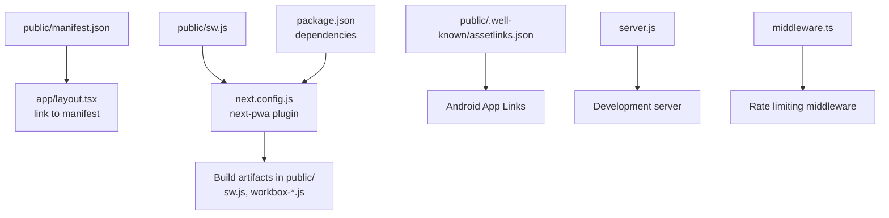
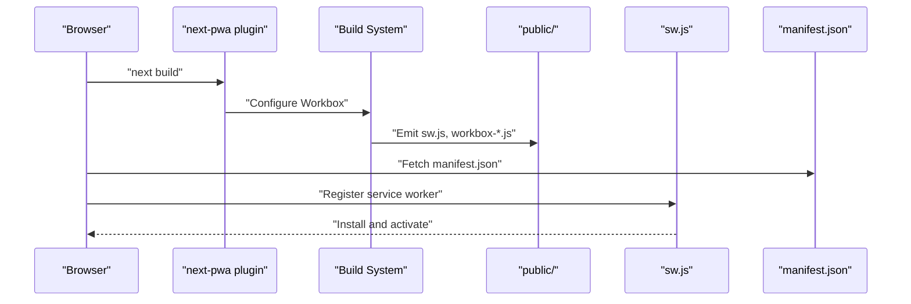
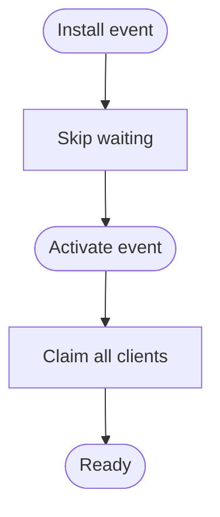
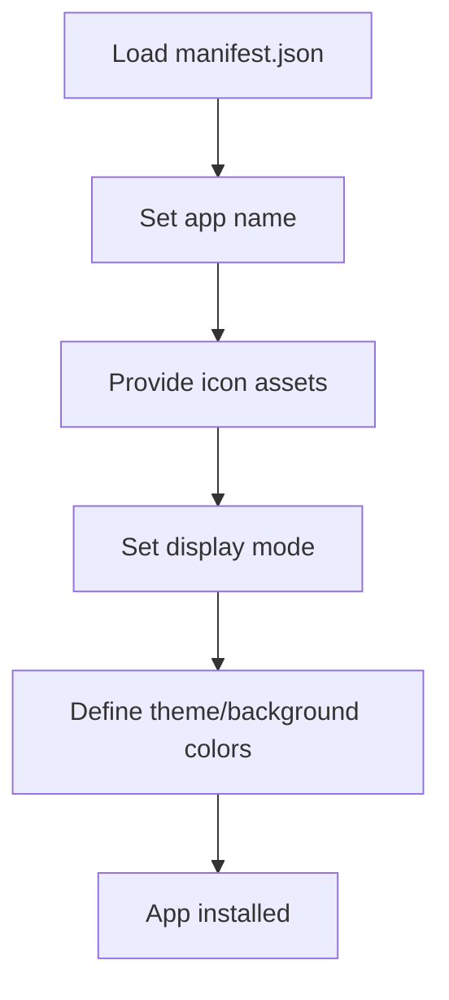
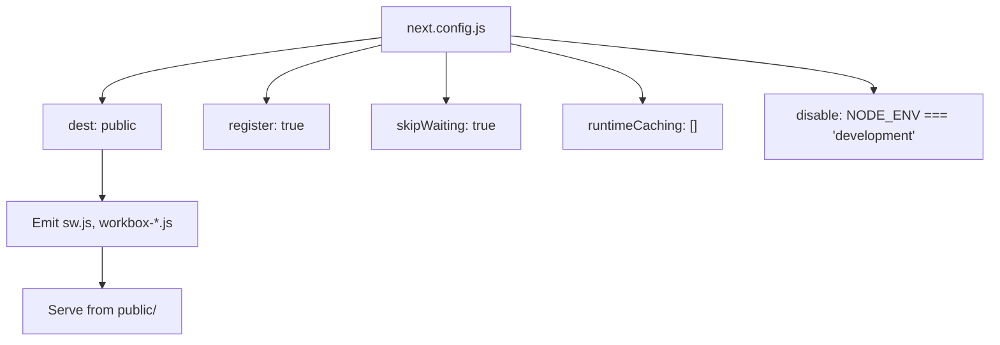
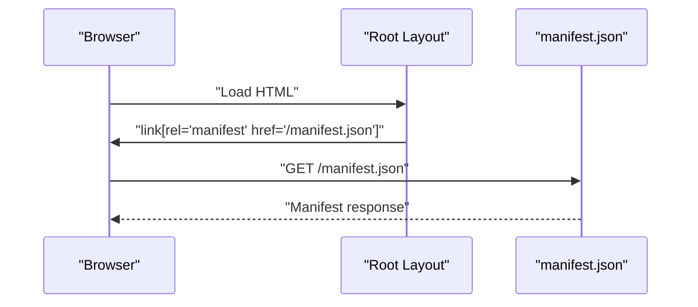
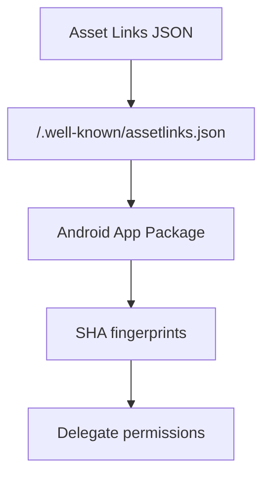
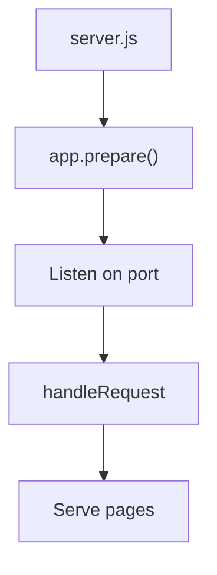
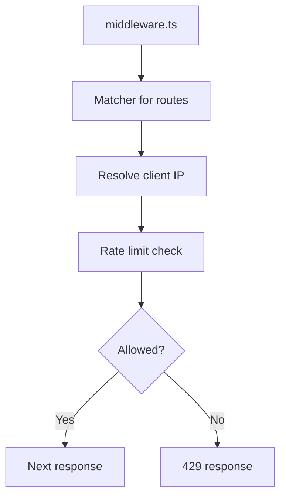
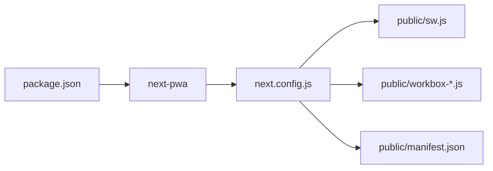

# Progressive Web App Implementation

<cite>
**Referenced Files in This Document**
- [sw.js](file://public/sw.js)
- [manifest.json](file://public/manifest.json)
- [next.config.js](file://next.config.js)
- [package.json](file://package.json)
- [layout.tsx](file://app/layout.tsx)
- [assetlinks.json](file://public/.well-known/assetlinks.json)
- [server.js](file://server.js)
- [middleware.ts](file://middleware.ts)
</cite>

## Table of Contents
1. [Introduction](#introduction)
2. [Project Structure](#project-structure)
3. [Core Components](#core-components)
4. [Architecture Overview](#architecture-overview)
5. [Detailed Component Analysis](#detailed-component-analysis)
6. [Dependency Analysis](#dependency-analysis)
7. [Performance Considerations](#performance-considerations)
8. [Troubleshooting Guide](#troubleshooting-guide)
9. [Conclusion](#conclusion)
10. [Appendices](#appendices)

## Introduction
This document explains the Progressive Web App (PWA) implementation for Optim Bozor. It covers service worker registration and lifecycle, caching strategies, offline behavior, web app manifest configuration, build-time setup, development versus production differences, push notifications and background sync, installation prompts, testing and auditing, and security considerations including HTTPS requirements.

## Project Structure
Optim Bozor integrates PWA assets and configuration under the public directory and Next.js configuration. Key PWA-related files include:
- Service Worker: public/sw.js
- Manifest: public/manifest.json
- Next.js PWA plugin configuration: next.config.js
- Dependencies: package.json
- Root layout manifest link: app/layout.tsx
- Android App Links: public/.well-known/assetlinks.json
- Optional custom server: server.js
- Middleware for rate limiting: middleware.ts

**Diagram sources**
- [manifest.json:1-61](file://public/manifest.json#L1-L61)
- [layout.tsx:57-57](file://app/layout.tsx#L57-L57)
- [sw.js:1-7](file://public/sw.js#L1-L7)
- [next.config.js:1-35](file://next.config.js#L1-L35)
- [package.json:1-67](file://package.json#L1-L67)
- [assetlinks.json:1-19](file://public/.well-known/assetlinks.json#L1-L19)
- [server.js:1-16](file://server.js#L1-L16)
- [middleware.ts:1-26](file://middleware.ts#L1-L26)

**Section sources**
- [manifest.json:1-61](file://public/manifest.json#L1-L61)
- [layout.tsx:57-57](file://app/layout.tsx#L57-L57)
- [sw.js:1-7](file://public/sw.js#L1-L7)
- [next.config.js:1-35](file://next.config.js#L1-L35)
- [package.json:1-67](file://package.json#L1-L67)
- [assetlinks.json:1-19](file://public/.well-known/assetlinks.json#L1-L19)
- [server.js:1-16](file://server.js#L1-L16)
- [middleware.ts:1-26](file://middleware.ts#L1-L26)

## Core Components
- Service Worker: Minimal lifecycle handlers for install and activate.
- Manifest: Application identity, icons, display mode, and theme/background colors.
- Next.js PWA Plugin: next-pwa configured with build destination, registration, skipWaiting, and empty runtimeCaching.
- Root Layout: Declares manifest link and global metadata.
- Android App Links: Delegation for Trusted Web Activity (TWA) integration.
- Optional Custom Server: Development server setup.
- Middleware: Rate limiting applied to routes.

**Section sources**
- [sw.js:1-7](file://public/sw.js#L1-L7)
- [manifest.json:1-61](file://public/manifest.json#L1-L61)
- [next.config.js:1-35](file://next.config.js#L1-L35)
- [layout.tsx:57-57](file://app/layout.tsx#L57-L57)
- [assetlinks.json:1-19](file://public/.well-known/assetlinks.json#L1-L19)
- [server.js:1-16](file://server.js#L1-L16)
- [middleware.ts:1-26](file://middleware.ts#L1-L26)

## Architecture Overview
The PWA architecture leverages next-pwa to inject and serve a service worker and Workbox runtime. The service worker currently uses minimal lifecycle handling. The manifest defines app presentation and identity. The root layout links to the manifest. Android App Links enable TWA delegation.

**Diagram sources**
- [next.config.js:1-35](file://next.config.js#L1-L35)
- [sw.js:1-7](file://public/sw.js#L1-L7)
- [manifest.json:1-61](file://public/manifest.json#L1-L61)

## Detailed Component Analysis

### Service Worker Lifecycle
The current service worker registers minimal lifecycle events:
- Install event: immediately signals skipWaiting.
- Activate event: claims all clients.

Implications:
- Immediate activation reduces update delays.
- No custom precache or runtime caching is defined.

**Diagram sources**
- [sw.js:1-7](file://public/sw.js#L1-L7)

**Section sources**
- [sw.js:1-7](file://public/sw.js#L1-L7)

### Web App Manifest
The manifest defines:
- Application name and short name
- Icons across multiple sizes
- Start URL and standalone display mode
- Background and theme colors

Recommendations:
- Ensure all icon sizes are available in public/icons.
- Confirm start_url resolves to the app shell route.
- Validate theme/background colors match branding.

**Diagram sources**
- [manifest.json:1-61](file://public/manifest.json#L1-L61)

**Section sources**
- [manifest.json:1-61](file://public/manifest.json#L1-L61)

### Next.js PWA Build Configuration
Key configuration points:
- Destination: public
- Registration enabled
- Skip waiting enabled
- Runtime caching: empty array
- Development mode disables PWA generation

Effects:
- During build, next-pwa emits sw.js and workbox-*.js into public/.
- In development, PWA features are disabled via disable flag.
- Empty runtimeCaching means no custom caching strategies are applied.

**Diagram sources**
- [next.config.js:1-35](file://next.config.js#L1-L35)

**Section sources**
- [next.config.js:1-35](file://next.config.js#L1-L35)

### Root Layout Manifest Link
The root layout includes a manifest link tag and global metadata. This ensures the browser discovers the manifest during initial load.

**Diagram sources**
- [layout.tsx:57-57](file://app/layout.tsx#L57-L57)
- [manifest.json:1-61](file://public/manifest.json#L1-L61)

**Section sources**
- [layout.tsx:57-57](file://app/layout.tsx#L57-L57)

### Android App Links (TWA)
The assetlinks.json file enables Android App Links for Trusted Web Activity (TWA). It delegates permissions and associates the web app with the Android package.

**Diagram sources**
- [assetlinks.json:1-19](file://public/.well-known/assetlinks.json#L1-L19)

**Section sources**
- [assetlinks.json:1-19](file://public/.well-known/assetlinks.json#L1-L19)

### Custom Server (Development)
The optional custom server uses Next.js to prepare and serve the app locally. While not required for PWA functionality, it supports local development.

**Diagram sources**
- [server.js:1-16](file://server.js#L1-L16)

**Section sources**
- [server.js:1-16](file://server.js#L1-L16)

### Middleware and Security Context
Middleware applies rate limiting to routes. While not directly related to PWA, it affects availability and reliability of the app in production environments.

**Diagram sources**
- [middleware.ts:1-26](file://middleware.ts#L1-L26)

**Section sources**
- [middleware.ts:1-26](file://middleware.ts#L1-L26)

## Dependency Analysis
- next-pwa dependency drives PWA generation and Workbox integration.
- The plugin configuration controls whether PWA features are built and registered.
- The service worker and manifest are static assets served from public/.

**Diagram sources**
- [package.json:1-67](file://package.json#L1-L67)
- [next.config.js:1-35](file://next.config.js#L1-L35)
- [sw.js:1-7](file://public/sw.js#L1-L7)
- [manifest.json:1-61](file://public/manifest.json#L1-L61)

**Section sources**
- [package.json:1-67](file://package.json#L1-L67)
- [next.config.js:1-35](file://next.config.js#L1-L35)

## Performance Considerations
- Current runtimeCaching is empty, meaning no custom caching strategies are defined. This simplifies maintenance but does not enable advanced offline or performance optimizations.
- Consider implementing cache-first or network-first strategies for static assets and API responses using Workbox routing and caching strategies.
- Use cache invalidation patterns (cache versioning, stale-while-revalidate) to balance freshness and performance.
- Audit with Lighthouse to measure Core Web Vitals and PWA scores.

[No sources needed since this section provides general guidance]

## Troubleshooting Guide
Common PWA issues and checks:
- Service worker not updating:
  - Verify skipWaiting and registration flags in next.config.js.
  - Clear browser caches and unregister old service workers.
- Manifest not applied:
  - Ensure the manifest link exists in the root layout.
  - Validate manifest.json syntax and paths.
- Offline behavior:
  - Since runtimeCaching is empty, define caching strategies for improved offline support.
- Installation prompts:
  - Ensure manifest is served over HTTPS and start_url is reachable.
- Android App Links:
  - Confirm assetlinks.json is publicly accessible and fingerprints match the signing certificate.

**Section sources**
- [next.config.js:1-35](file://next.config.js#L1-L35)
- [layout.tsx:57-57](file://app/layout.tsx#L57-L57)
- [manifest.json:1-61](file://public/manifest.json#L1-L61)
- [assetlinks.json:1-19](file://public/.well-known/assetlinks.json#L1-L19)

## Conclusion
Optim Bozor’s PWA setup is currently minimalistic: next-pwa is configured to emit a basic service worker and Workbox assets, and the manifest is declared in the root layout. There is no custom runtime caching defined, which limits offline and performance benefits. To achieve robust PWA behavior, implement Workbox runtime caching strategies, define cache-first or network-first policies, and add cache invalidation. Additionally, consider push notifications and background sync if required, and ensure HTTPS for production deployment.

[No sources needed since this section summarizes without analyzing specific files]

## Appendices

### A. PWA Build and Destination Setup
- Build destination: public
- Registration: enabled
- Skip waiting: enabled
- Development mode: PWA disabled

**Section sources**
- [next.config.js:1-35](file://next.config.js#L1-L35)

### B. Manifest Fields Reference
- name: Full application name
- short_name: Short app name
- icons: Icon assets with sizes and types
- start_url: Initial route
- display: standalone
- background_color: Splash color
- theme_color: Browser theme

**Section sources**
- [manifest.json:1-61](file://public/manifest.json#L1-L61)

### C. Service Worker Lifecycle Reference
- install: skipWaiting
- activate: claim clients

**Section sources**
- [sw.js:1-7](file://public/sw.js#L1-L7)

### D. Security and HTTPS Requirements
- PWA features (service workers, push notifications, background sync) require HTTPS in production.
- Ensure TLS certificates are valid and modern ciphers are enabled.

[No sources needed since this section provides general guidance]