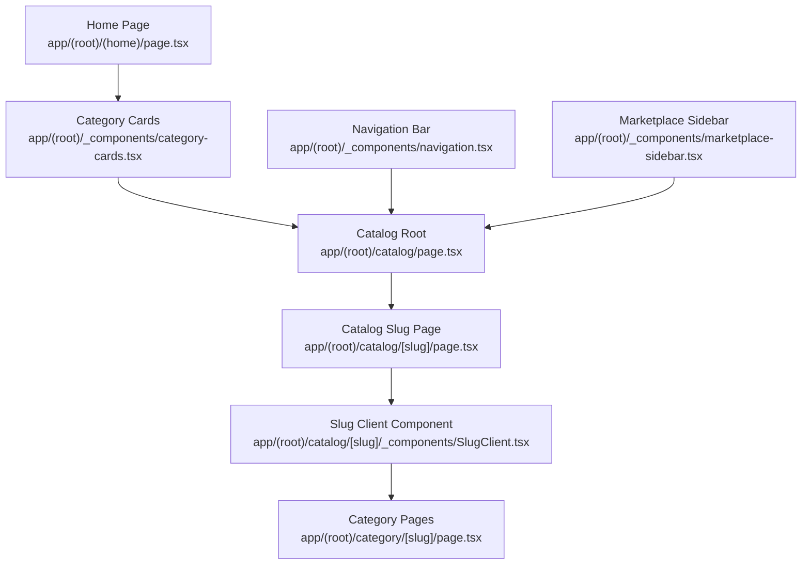
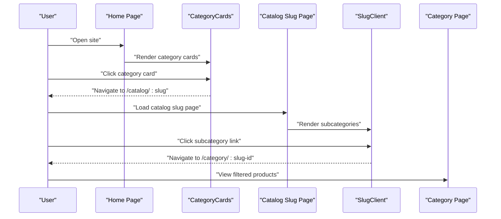
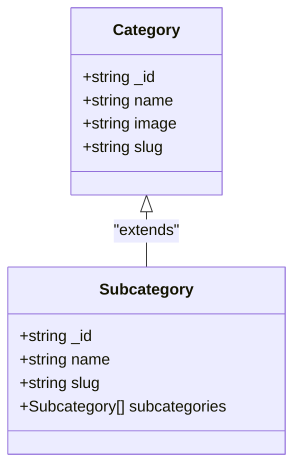
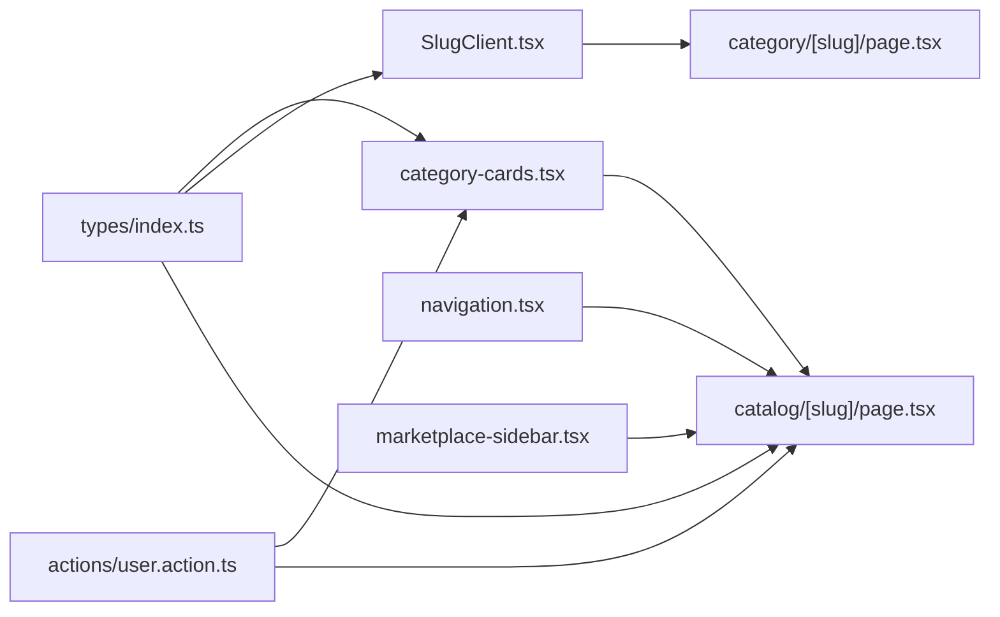

# Category Management

<cite>
**Referenced Files in This Document**
- [category-cards.tsx](file://app/(root)/_components/category-cards.tsx)
- [SlugClient.tsx](file://app/(root)/catalog/[slug]/_components/SlugClient.tsx)
- [page.tsx](file://app/(root)/catalog/[slug]/page.tsx)
- [catalog.tsx](file://app/(root)/_components/catalog.tsx)
- [marketplace-sidebar.tsx](file://app/(root)/_components/marketplace-sidebar.tsx)
- [navigation.tsx](file://app/(root)/_components/navigation.tsx)
- [page.tsx](file://app/(root)/category/[slug]/page.tsx)
- [page.tsx](file://app/(root)/(home)/page.tsx)
- [types.ts](file://types/index.ts)
- [user.action.ts](file://actions/user.action.ts)
</cite>

## Table of Contents
1. [Introduction](#introduction)
2. [Project Structure](#project-structure)
3. [Core Components](#core-components)
4. [Architecture Overview](#architecture-overview)
5. [Detailed Component Analysis](#detailed-component-analysis)
6. [Dependency Analysis](#dependency-analysis)
7. [Performance Considerations](#performance-considerations)
8. [Troubleshooting Guide](#troubleshooting-guide)
9. [Conclusion](#conclusion)
10. [Appendices](#appendices)

## Introduction
This document explains the category management system used for browsing products by categories. It covers category-based product filtering, dynamic category routing, category card components, category data structures, slug-based navigation, category selection logic, integration with product filtering via URL parameters, category hierarchy handling, SEO optimization for category pages, mobile-responsive layouts, sorting options, and category-specific search functionality.

## Project Structure
The category management system spans several Next.js app router pages and client components:
- Static category cards on the home page
- Dynamic catalog pages under /catalog/[slug]
- Subcategory navigation and client-side expansion
- Sidebar navigation integrating categories with URL parameters
- Navigation bar rendering top-level categories
- Category pages under /category/[slug] for filtered product listings

**Diagram sources**
- [page.tsx](file://app/(root)/(home)/page.tsx#L1-L50)
- [category-cards.tsx](file://app/(root)/_components/category-cards.tsx#L1-L43)
- [page.tsx](file://app/(root)/catalog/[slug]/page.tsx#L1-L25)
- [SlugClient.tsx](file://app/(root)/catalog/[slug]/_components/SlugClient.tsx#L1-L176)
- [page.tsx](file://app/(root)/category/[slug]/page.tsx#L1-L50)
- [navigation.tsx](file://app/(root)/_components/navigation.tsx#L1-L50)
- [marketplace-sidebar.tsx](file://app/(root)/_components/marketplace-sidebar.tsx#L1-L200)

**Section sources**
- [page.tsx](file://app/(root)/(home)/page.tsx#L1-L50)
- [category-cards.tsx](file://app/(root)/_components/category-cards.tsx#L1-L43)
- [page.tsx](file://app/(root)/catalog/[slug]/page.tsx#L1-L25)
- [SlugClient.tsx](file://app/(root)/catalog/[slug]/_components/SlugClient.tsx#L1-L176)
- [page.tsx](file://app/(root)/category/[slug]/page.tsx#L1-L50)
- [navigation.tsx](file://app/(root)/_components/navigation.tsx#L1-L50)
- [marketplace-sidebar.tsx](file://app/(root)/_components/marketplace-sidebar.tsx#L1-L200)

## Core Components
- CategoryCards: Renders top-level categories as clickable cards with optional images and links to catalog subpages.
- SlugClient: Handles dynamic subcategory rendering with responsive columns and expandable sections.
- Catalog page: Fetches category metadata and renders subcategories using SlugClient.
- CatalogSidebar: Provides a sidebar navigation linking to catalog slugs and highlighting current selection.
- Navigation: Displays top-level categories in the header.
- Marketplace Sidebar: Integrates categories with URL parameter-based filtering for product listings.
- Category Pages: Serve as entry points for category-specific product filtering and SEO.

**Section sources**
- [category-cards.tsx](file://app/(root)/_components/category-cards.tsx#L1-L43)
- [SlugClient.tsx](file://app/(root)/catalog/[slug]/_components/SlugClient.tsx#L1-L176)
- [page.tsx](file://app/(root)/catalog/[slug]/page.tsx#L1-L25)
- [catalog.tsx](file://app/(root)/_components/catalog.tsx#L1-L32)
- [navigation.tsx](file://app/(root)/_components/navigation.tsx#L1-L50)
- [marketplace-sidebar.tsx](file://app/(root)/_components/marketplace-sidebar.tsx#L1-L200)

## Architecture Overview
The system uses Next.js app router dynamic routes and client-side state to manage category navigation and filtering:
- Home page fetches categories and renders CategoryCards.
- Clicking a category card navigates to /catalog/[slug].
- Catalog/[slug] page fetches subcategories and renders SlugClient.
- SlugClient splits subcategories into columns and allows expanding hidden items.
- Navigation and Sidebar provide alternative entry points to catalog and filtered views.
- Category pages (/category/[slug]) integrate with product filtering via URL parameters.

**Diagram sources**
- [page.tsx](file://app/(root)/(home)/page.tsx#L1-L50)
- [category-cards.tsx](file://app/(root)/_components/category-cards.tsx#L1-L43)
- [page.tsx](file://app/(root)/catalog/[slug]/page.tsx#L1-L25)
- [SlugClient.tsx](file://app/(root)/catalog/[slug]/_components/SlugClient.tsx#L1-L176)
- [page.tsx](file://app/(root)/category/[slug]/page.tsx#L1-L50)

## Detailed Component Analysis

### Category Data Model
The category model used across components defines identifiers, names, images, and slugs. Subcategories extend this concept with nested items.

**Diagram sources**
- [types.ts:1-100](file://types/index.ts#L1-L100)

**Section sources**
- [types.ts:1-100](file://types/index.ts#L1-L100)

### Category Cards Component
- Fetches categories from a server action.
- Renders a grid of category cards with responsive columns.
- Links to catalog pages using either slug or fallback to _id.
- Supports optional image rendering based on URL-like checks.

Key behaviors:
- Grid layout adapts from two to four columns depending on screen size.
- Hover and focus states improve interactivity.
- Optional image rendering supports both absolute URLs and relative paths.

**Section sources**
- [category-cards.tsx](file://app/(root)/_components/category-cards.tsx#L1-L43)

### Dynamic Subcategory Rendering (SlugClient)
- Splits subcategories into up to four columns for balanced layout.
- Uses client-side state to expand/collapse long lists.
- Generates category-specific links combining slug and subcategory ID.

Processing logic:
- Calculates items per column to evenly distribute subcategories.
- Renders three buttons for toggling visibility of additional items.
- Applies rotation animation to chevrons based on expanded state.

**Section sources**
- [SlugClient.tsx](file://app/(root)/catalog/[slug]/_components/SlugClient.tsx#L1-L176)

### Catalog Slug Page and Metadata
- Generates metadata dynamically from the slug for SEO.
- Renders SlugClient with subcategories and slug context.

SEO considerations:
- Title and description derived from the slug.
- Ensures canonical and structured metadata for category pages.

**Section sources**
- [page.tsx](file://app/(root)/catalog/[slug]/page.tsx#L1-L25)

### Navigation and Sidebar Integration
- Navigation bar displays top-level categories for quick access.
- CatalogSidebar highlights the current catalog slug and shows category icons and names.
- Marketplace Sidebar integrates categories with URL parameter-based filtering for product listings.

Selection logic:
- Active state determined by matching current slug.
- Click handlers update URL parameters or navigate to category pages.

**Section sources**
- [navigation.tsx](file://app/(root)/_components/navigation.tsx#L1-L50)
- [catalog.tsx](file://app/(root)/_components/catalog.tsx#L1-L32)
- [marketplace-sidebar.tsx](file://app/(root)/_components/marketplace-sidebar.tsx#L1-L200)

### Category Pages and Product Filtering
- Category pages serve as entry points for filtered product listings.
- URL parameter handling enables category-based filtering in product queries.
- State management is handled client-side for interactive filtering experiences.

Filtering integration:
- Links from subcategories construct category identifiers for product queries.
- Parameterized routes support dynamic category navigation.

**Section sources**
- [page.tsx](file://app/(root)/category/[slug]/page.tsx#L1-L50)

### Category Hierarchy Management
- Top-level categories feed catalog pages with subcategories.
- Subcategories are split into columns for readability.
- Expandable sections reveal additional items without cluttering the UI.

Layout strategy:
- Responsive columns adapt to screen size.
- Even distribution ensures balanced visual weight across columns.

**Section sources**
- [SlugClient.tsx](file://app/(root)/catalog/[slug]/_components/SlugClient.tsx#L1-L176)

### Category Metadata and SEO
- Catalog slug pages generate metadata from the slug for improved SEO.
- Titles and descriptions reflect the current category context.
- Canonical and structured metadata support search engine indexing.

**Section sources**
- [page.tsx](file://app/(root)/catalog/[slug]/page.tsx#L1-L25)

### Mobile-Responsive Layouts
- Category cards use responsive grid classes to adjust columns on small screens.
- SlugClient columns stack vertically on smaller screens.
- Navigation and sidebar adapt to mobile viewport sizes.

Accessibility:
- Focus states and hover effects remain functional across devices.
- Touch-friendly spacing and interactive elements.

**Section sources**
- [category-cards.tsx](file://app/(root)/_components/category-cards.tsx#L1-L43)
- [SlugClient.tsx](file://app/(root)/catalog/[slug]/_components/SlugClient.tsx#L1-L176)

### Sorting Options and Search Functionality
- Marketplace Sidebar demonstrates category-based filtering via URL parameters.
- Sorting options can be integrated alongside category filters in product queries.
- Category-specific search can be implemented by combining slug context with search terms.

Integration points:
- URL parameter handling supports category and sort combinations.
- Client-side state updates maintain consistent UI state during navigation.

**Section sources**
- [marketplace-sidebar.tsx](file://app/(root)/_components/marketplace-sidebar.tsx#L1-L200)

## Dependency Analysis
The category management system relies on shared types and server actions for data fetching and on Next.js routing for dynamic navigation.

**Diagram sources**
- [types.ts:1-100](file://types/index.ts#L1-L100)
- [category-cards.tsx](file://app/(root)/_components/category-cards.tsx#L1-L43)
- [SlugClient.tsx](file://app/(root)/catalog/[slug]/_components/SlugClient.tsx#L1-L176)
- [page.tsx](file://app/(root)/catalog/[slug]/page.tsx#L1-L25)
- [user.action.ts:1-200](file://actions/user.action.ts#L1-L200)
- [page.tsx](file://app/(root)/category/[slug]/page.tsx#L1-L50)
- [navigation.tsx](file://app/(root)/_components/navigation.tsx#L1-L50)
- [marketplace-sidebar.tsx](file://app/(root)/_components/marketplace-sidebar.tsx#L1-L200)

**Section sources**
- [types.ts:1-100](file://types/index.ts#L1-L100)
- [category-cards.tsx](file://app/(root)/_components/category-cards.tsx#L1-L43)
- [SlugClient.tsx](file://app/(root)/catalog/[slug]/_components/SlugClient.tsx#L1-L176)
- [page.tsx](file://app/(root)/catalog/[slug]/page.tsx#L1-L25)
- [user.action.ts:1-200](file://actions/user.action.ts#L1-L200)
- [page.tsx](file://app/(root)/category/[slug]/page.tsx#L1-L50)
- [navigation.tsx](file://app/(root)/_components/navigation.tsx#L1-L50)
- [marketplace-sidebar.tsx](file://app/(root)/_components/marketplace-sidebar.tsx#L1-L200)

## Performance Considerations
- Client-side state updates minimize unnecessary server requests for expand/collapse interactions.
- Responsive grid layouts reduce DOM complexity on smaller screens.
- Lazy loading of images can be considered for category cards to optimize initial render performance.
- Memoization of computed columns in SlugClient can prevent redundant recalculations on re-renders.

## Troubleshooting Guide
Common issues and resolutions:
- Missing category images: Verify image URLs are valid and accessible; fallback logic should handle missing images gracefully.
- Incorrect slug navigation: Ensure slugs are unique and properly sanitized; confirm server action returns correct subcategories.
- Expand/collapse not working: Check client-side state initialization and event handlers for toggleSection.
- Sidebar highlighting mismatch: Confirm slug comparison logic and route parameter extraction.
- SEO metadata not updating: Validate metadata generation logic and ensure dynamic metadata is returned for catalog slug pages.

**Section sources**
- [category-cards.tsx](file://app/(root)/_components/category-cards.tsx#L1-L43)
- [SlugClient.tsx](file://app/(root)/catalog/[slug]/_components/SlugClient.tsx#L1-L176)
- [page.tsx](file://app/(root)/catalog/[slug]/page.tsx#L1-L25)
- [catalog.tsx](file://app/(root)/_components/catalog.tsx#L1-L32)

## Conclusion
The category management system provides a robust foundation for navigating and filtering products by categories. It leverages Next.js dynamic routes, client-side state, and shared data models to deliver responsive, SEO-friendly category experiences. The integration with URL parameters and sidebar navigation enables flexible filtering and seamless user journeys across desktop and mobile devices.

## Appendices
- Category data structure and subcategory composition are defined in shared types.
- Server actions supply category data to client components.
- Dynamic metadata generation enhances SEO for category pages.

[No sources needed since this section provides general guidance]