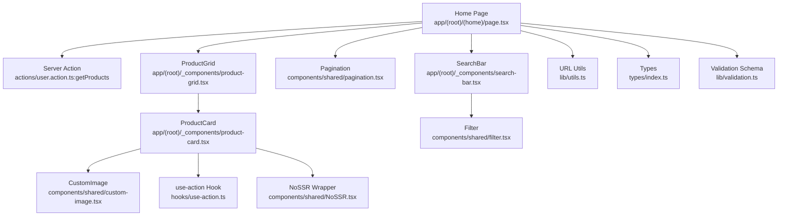
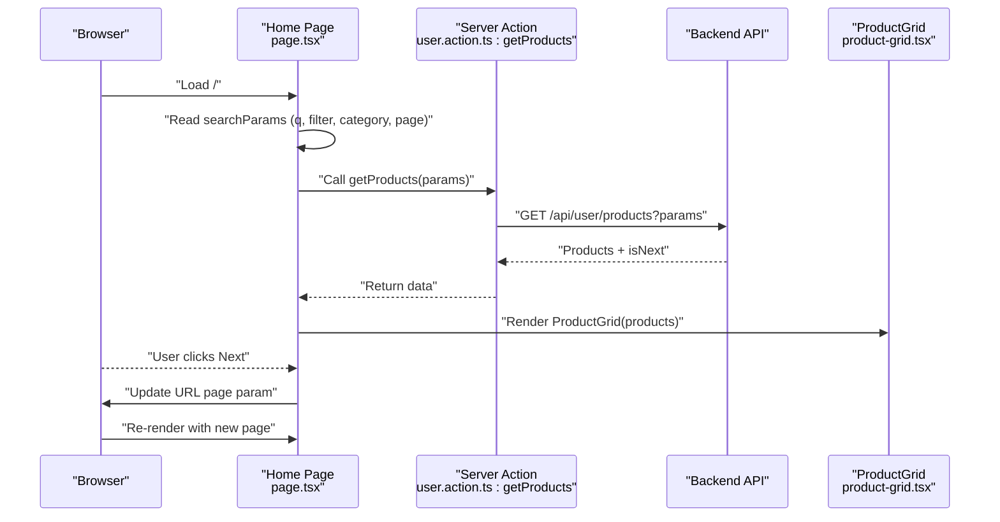
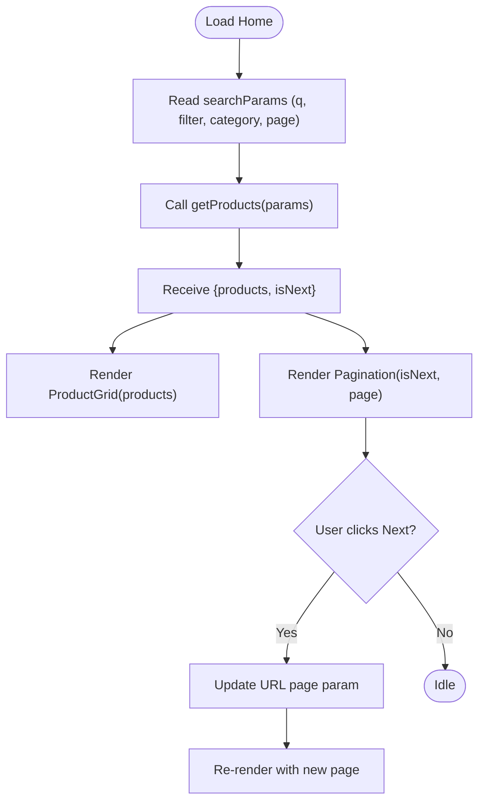
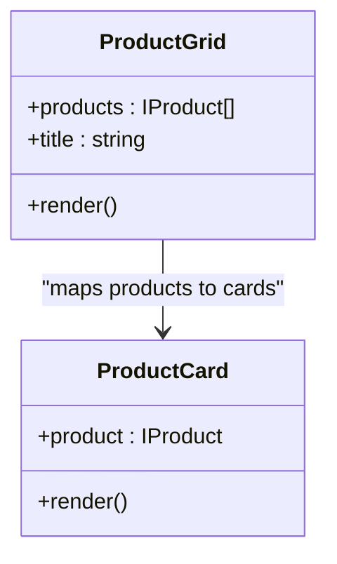
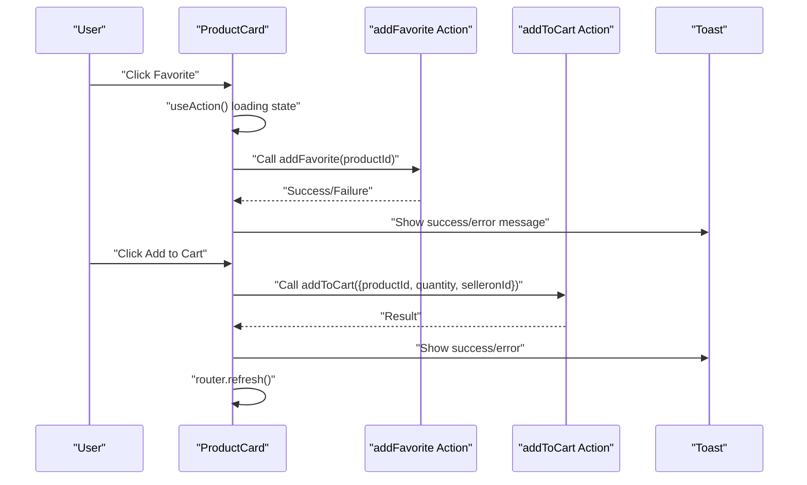
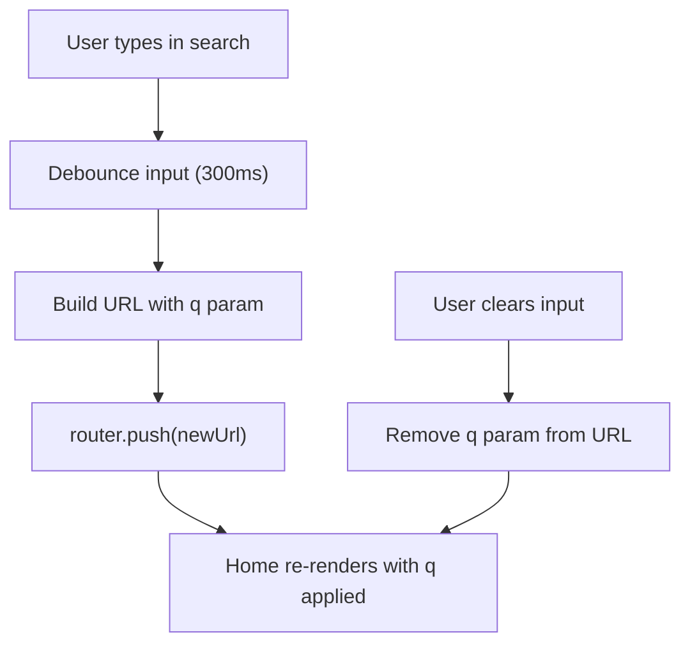
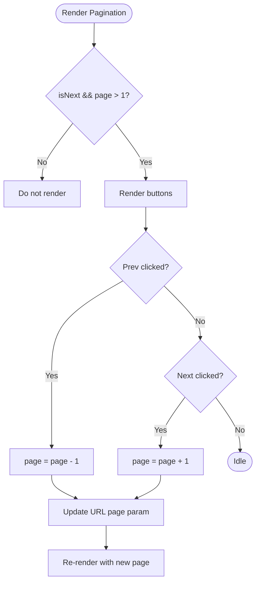
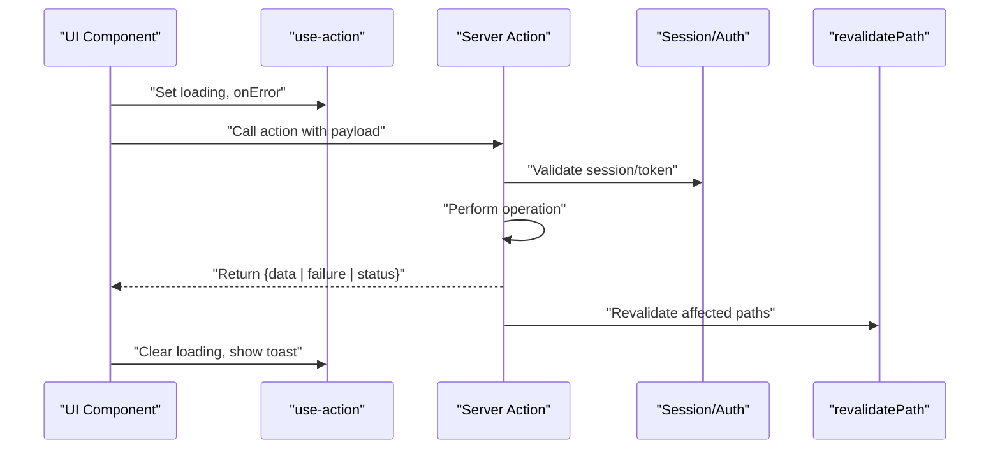
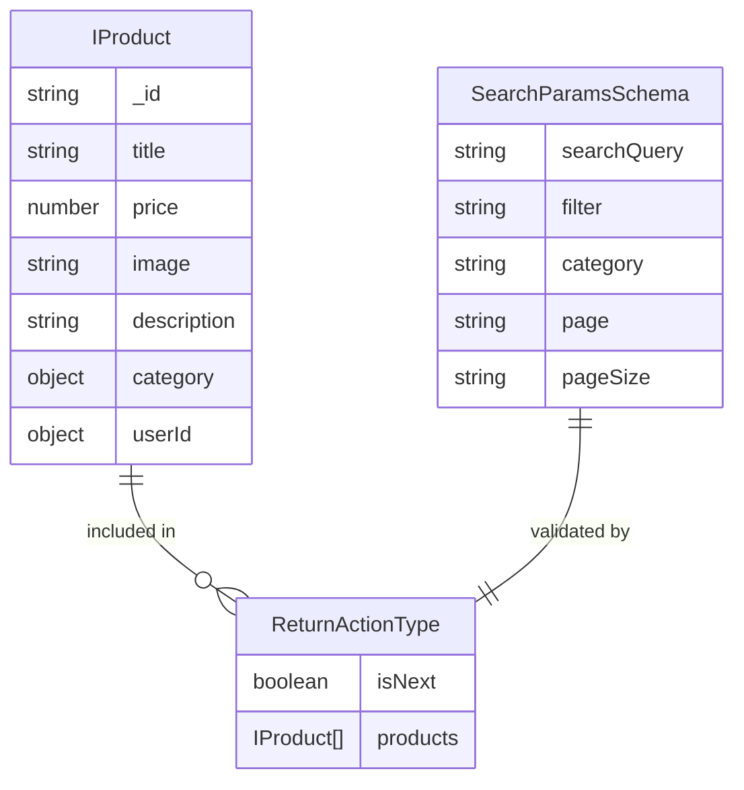
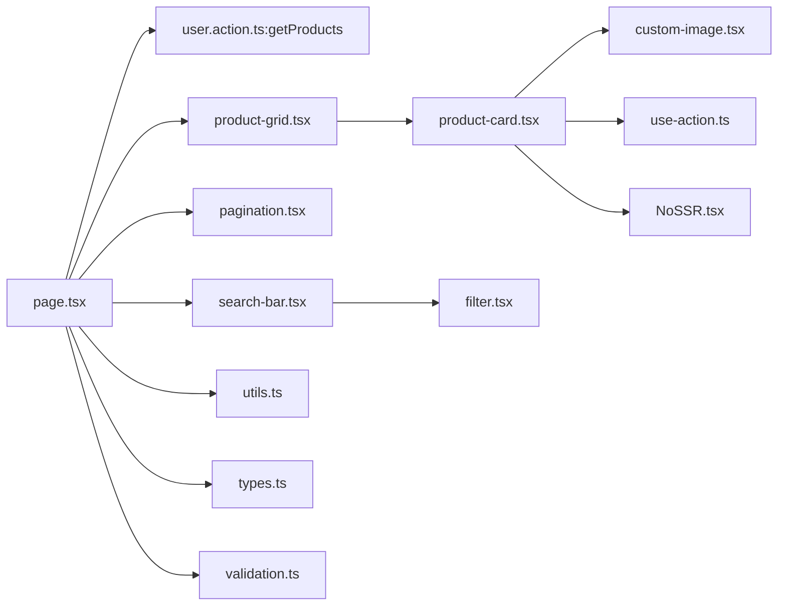

# Product Catalog Browsing

<cite>
**Referenced Files in This Document**
- [page.tsx](file://app/(root)/(home)/page.tsx)
- [product-grid.tsx](file://app/(root)/_components/product-grid.tsx)
- [product-card.tsx](file://app/(root)/_components/product-card.tsx)
- [search-bar.tsx](file://app/(root)/_components/search-bar.tsx)
- [pagination.tsx](file://components/shared/pagination.tsx)
- [filter.tsx](file://components/shared/filter.tsx)
- [custom-image.tsx](file://components/shared/custom-image.tsx)
- [user.action.ts](file://actions/user.action.ts)
- [utils.ts](file://lib/utils.ts)
- [validation.ts](file://lib/validation.ts)
- [types.ts](file://types/index.ts)
- [use-action.ts](file://hooks/use-action.ts)
- [NoSSR.tsx](file://components/shared/NoSSR.tsx)
- [catalog.page.tsx](file://app/(root)/catalog/page.tsx)
</cite>

## Table of Contents
1. [Introduction](#introduction)
2. [Project Structure](#project-structure)
3. [Core Components](#core-components)
4. [Architecture Overview](#architecture-overview)
5. [Detailed Component Analysis](#detailed-component-analysis)
6. [Dependency Analysis](#dependency-analysis)
7. [Performance Considerations](#performance-considerations)
8. [Troubleshooting Guide](#troubleshooting-guide)
9. [Conclusion](#conclusion)

## Introduction
This document explains the product catalog browsing system, focusing on the home page’s dynamic product loading, search query handling, pagination, and the ProductGrid component architecture. It also covers search functionality, pagination mechanics, server action integration, error handling, loading states, and performance optimizations such as lazy loading and image optimization.

## Project Structure
The product catalog browsing system spans several layers:
- App router pages under app/(root)/(home) and app/(root)/catalog
- Client components for UI (product-grid, product-card, search-bar, pagination, filter)
- Shared components for images and SSR handling
- Actions for server-side data fetching and user interactions
- Utilities for URL manipulation and formatting
- Type definitions for product data and server action responses

**Diagram sources**
- [page.tsx](file://app/(root)/(home)/page.tsx#L24-L55)
- [user.action.ts:22-29](file://actions/user.action.ts#L22-L29)
- [product-grid.tsx](file://app/(root)/_components/product-grid.tsx#L34-L74)
- [product-card.tsx](file://app/(root)/_components/product-card.tsx#L22-L239)
- [pagination.tsx:13-54](file://components/shared/pagination.tsx#L13-L54)
- [search-bar.tsx](file://app/(root)/_components/search-bar.tsx#L6-L40)
- [filter.tsx:10-48](file://components/shared/filter.tsx#L10-L48)
- [custom-image.tsx:12-28](file://components/shared/custom-image.tsx#L12-L28)
- [utils.ts:19-35](file://lib/utils.ts#L19-L35)
- [validation.ts:75-81](file://lib/validation.ts#L75-L81)
- [use-action.ts:4-13](file://hooks/use-action.ts#L4-L13)
- [NoSSR.tsx:8-13](file://components/shared/NoSSR.tsx#L8-L13)

**Section sources**
- [page.tsx](file://app/(root)/(home)/page.tsx#L1-L58)
- [product-grid.tsx](file://app/(root)/_components/product-grid.tsx#L1-L77)
- [product-card.tsx](file://app/(root)/_components/product-card.tsx#L1-L242)
- [search-bar.tsx](file://app/(root)/_components/search-bar.tsx#L1-L41)
- [pagination.tsx:1-57](file://components/shared/pagination.tsx#L1-L57)
- [filter.tsx:1-49](file://components/shared/filter.tsx#L1-L49)
- [custom-image.tsx:1-32](file://components/shared/custom-image.tsx#L1-L32)
- [user.action.ts:1-297](file://actions/user.action.ts#L1-L297)
- [utils.ts:1-73](file://lib/utils.ts#L1-L73)
- [validation.ts:1-96](file://lib/validation.ts#L1-L96)
- [types.ts:1-209](file://types/index.ts#L1-L209)
- [use-action.ts:1-16](file://hooks/use-action.ts#L1-L16)
- [NoSSR.tsx:1-16](file://components/shared/NoSSR.tsx#L1-L16)

## Core Components
- Home Page (server-rendered): Fetches products via a server action, passes products to ProductGrid, renders pagination, and displays banners and categories.
- ProductGrid: Renders a responsive grid of ProductCard components with animated entrance and “View all” CTA.
- ProductCard: Individual product card with image, ratings, pricing, quick view, add-to-cart, and favorite toggles; integrates with server actions and local storage.
- SearchBar and Filter: Provides a catalog navigation button and a debounced search input that updates URL query parameters.
- Pagination: Updates URL page parameter and navigates without full reload.
- CustomImage: Optimized image rendering with priority, sizes, and loading transitions.
- Server Actions: Centralized data fetching and user interactions (favorites, cart).
- Utilities: URL manipulation helpers and price formatting.
- Validation: Strongly typed search parameters schema.
- Types: Consistent product and response shapes across the system.

**Section sources**
- [page.tsx](file://app/(root)/(home)/page.tsx#L24-L55)
- [product-grid.tsx](file://app/(root)/_components/product-grid.tsx#L34-L74)
- [product-card.tsx](file://app/(root)/_components/product-card.tsx#L22-L239)
- [search-bar.tsx](file://app/(root)/_components/search-bar.tsx#L6-L40)
- [filter.tsx:10-48](file://components/shared/filter.tsx#L10-L48)
- [pagination.tsx:13-54](file://components/shared/pagination.tsx#L13-L54)
- [custom-image.tsx:12-28](file://components/shared/custom-image.tsx#L12-L28)
- [user.action.ts:22-29](file://actions/user.action.ts#L22-L29)
- [utils.ts:19-35](file://lib/utils.ts#L19-L35)
- [validation.ts:75-81](file://lib/validation.ts#L75-L81)
- [types.ts:105-151](file://types/index.ts#L105-L151)

## Architecture Overview
The home page orchestrates data fetching and UI rendering:
- The page reads URL search parameters (q, filter, category, page).
- It invokes a server action to fetch paginated products and a flag indicating if a next page exists.
- The page renders a banner, category cards, the product grid, and pagination controls.
- Pagination updates the URL page parameter and navigates without a full reload.
- Search input updates the q parameter and triggers filtered queries.

**Diagram sources**
- [page.tsx](file://app/(root)/(home)/page.tsx#L24-L55)
- [user.action.ts:22-29](file://actions/user.action.ts#L22-L29)
- [product-grid.tsx](file://app/(root)/_components/product-grid.tsx#L34-L74)

## Detailed Component Analysis

### Home Page (Dynamic Product Loading and Pagination)
- Reads URL search parameters and forwards them to the server action.
- Calls getProducts with validated parameters (query, filter, category, page).
- Receives products and isNext to drive pagination visibility.
- Renders ProductGrid and Pagination based on returned data.

**Diagram sources**
- [page.tsx](file://app/(root)/(home)/page.tsx#L24-L55)
- [pagination.tsx:17-31](file://components/shared/pagination.tsx#L17-L31)

**Section sources**
- [page.tsx](file://app/(root)/(home)/page.tsx#L24-L55)

### ProductGrid Component (Responsive Grid Layout and Animation)
- Accepts products array and optional title.
- Uses Framer Motion to animate grid entrance and stagger child animations.
- Responsive grid classes adapt from 2 to 5 columns based on screen size.
- Includes a “View all” CTA linking to the catalog route.

**Diagram sources**
- [product-grid.tsx](file://app/(root)/_components/product-grid.tsx#L29-L74)
- [product-card.tsx](file://app/(root)/_components/product-card.tsx#L18-L20)

**Section sources**
- [product-grid.tsx](file://app/(root)/_components/product-grid.tsx#L34-L74)

### ProductCard Component (Product Rendering and Interactions)
- Displays product image via CustomImage, title, rating, and price.
- Favorite toggle integrates with addFavorite server action and local storage.
- Add-to-cart flow validates seller info, calls addToCart, refreshes cart data, and handles errors.
- Uses NoSSR wrapper to avoid SSR mismatches for interactive elements.
- Implements hover effects and loading states during actions.

**Diagram sources**
- [product-card.tsx](file://app/(root)/_components/product-card.tsx#L36-L61)
- [product-card.tsx](file://app/(root)/_components/product-card.tsx#L182-L225)
- [user.action.ts:98-119](file://actions/user.action.ts#L98-L119)
- [user.action.ts:120-143](file://actions/user.action.ts#L120-L143)
- [use-action.ts:4-13](file://hooks/use-action.ts#L4-L13)

**Section sources**
- [product-card.tsx](file://app/(root)/_components/product-card.tsx#L22-L239)
- [user.action.ts:98-143](file://actions/user.action.ts#L98-L143)
- [use-action.ts:4-13](file://hooks/use-action.ts#L4-L13)
- [NoSSR.tsx:8-13](file://components/shared/NoSSR.tsx#L8-L13)

### Search Functionality (Query Parameter Handling and Real-Time Filtering)
- SearchBar provides a link to the catalog and embeds the Filter component.
- Filter updates the q parameter in the URL with a debounced handler.
- When the input becomes empty, removes the q parameter from the URL.
- The home page reads q and passes it to getProducts for filtering.

**Diagram sources**
- [filter.tsx:14-32](file://components/shared/filter.tsx#L14-L32)
- [utils.ts:19-35](file://lib/utils.ts#L19-L35)
- [page.tsx](file://app/(root)/(home)/page.tsx#L26-L31)

**Section sources**
- [search-bar.tsx](file://app/(root)/_components/search-bar.tsx#L6-L40)
- [filter.tsx:10-48](file://components/shared/filter.tsx#L10-L48)
- [utils.ts:19-35](file://lib/utils.ts#L19-L35)
- [page.tsx](file://app/(root)/(home)/page.tsx#L26-L31)

### Pagination System (Page Number Tracking and Navigation)
- Pagination receives isNext and current pageNumber.
- On navigation, computes next/previous page number and updates the URL page parameter.
- Disables Prev on page 1 and Next when isNext is false.
- Uses router.push with scroll=false to avoid scroll jump.

**Diagram sources**
- [pagination.tsx:13-54](file://components/shared/pagination.tsx#L13-L54)
- [utils.ts:19-35](file://lib/utils.ts#L19-L35)

**Section sources**
- [pagination.tsx:13-54](file://components/shared/pagination.tsx#L13-L54)

### Integration with Server Actions (Data Fetching, Error Handling, Loading States)
- getProducts is a server action that validates inputs via searchParamsSchema and fetches products from the backend.
- addFavorite and addToCart are server actions that manage user interactions and trigger cache revalidation.
- use-action hook centralizes loading state and error toast handling.
- Error handling distinguishes between server errors, validation errors, and business failures.

**Diagram sources**
- [user.action.ts:22-29](file://actions/user.action.ts#L22-L29)
- [user.action.ts:98-119](file://actions/user.action.ts#L98-L119)
- [user.action.ts:120-143](file://actions/user.action.ts#L120-L143)
- [use-action.ts:4-13](file://hooks/use-action.ts#L4-L13)

**Section sources**
- [user.action.ts:22-29](file://actions/user.action.ts#L22-L29)
- [user.action.ts:98-143](file://actions/user.action.ts#L98-L143)
- [use-action.ts:4-13](file://hooks/use-action.ts#L4-L13)
- [validation.ts:75-81](file://lib/validation.ts#L75-L81)

### Data Models and Type Safety
- IProduct defines the shape of product data returned by the server action.
- ReturnActionType includes products, isNext, and related metadata.
- SearchParams schema ensures q, filter, category, page, pageSize are properly typed.

**Diagram sources**
- [types.ts:105-151](file://types/index.ts#L105-L151)
- [types.ts:54-73](file://types/index.ts#L54-L73)
- [validation.ts:75-81](file://lib/validation.ts#L75-L81)

**Section sources**
- [types.ts:105-151](file://types/index.ts#L105-L151)
- [types.ts:54-73](file://types/index.ts#L54-L73)
- [validation.ts:75-81](file://lib/validation.ts#L75-L81)

## Dependency Analysis
- Home page depends on server actions for data fetching and on shared components for UI.
- ProductGrid depends on ProductCard and Framer Motion for animations.
- ProductCard depends on server actions, local storage, and NoSSR wrapper.
- Pagination and Filter depend on URL utilities and router hooks.
- Validation and types ensure consistent parameter handling across the system.

**Diagram sources**
- [page.tsx](file://app/(root)/(home)/page.tsx#L24-L55)
- [user.action.ts:22-29](file://actions/user.action.ts#L22-L29)
- [product-grid.tsx](file://app/(root)/_components/product-grid.tsx#L34-L74)
- [product-card.tsx](file://app/(root)/_components/product-card.tsx#L22-L239)
- [pagination.tsx:13-54](file://components/shared/pagination.tsx#L13-L54)
- [search-bar.tsx](file://app/(root)/_components/search-bar.tsx#L6-L40)
- [filter.tsx:10-48](file://components/shared/filter.tsx#L10-L48)
- [custom-image.tsx:12-28](file://components/shared/custom-image.tsx#L12-L28)
- [utils.ts:19-35](file://lib/utils.ts#L19-L35)
- [types.ts:105-151](file://types/index.ts#L105-L151)
- [validation.ts:75-81](file://lib/validation.ts#L75-L81)
- [use-action.ts:4-13](file://hooks/use-action.ts#L4-L13)
- [NoSSR.tsx:8-13](file://components/shared/NoSSR.tsx#L8-L13)

**Section sources**
- [page.tsx](file://app/(root)/(home)/page.tsx#L24-L55)
- [product-grid.tsx](file://app/(root)/_components/product-grid.tsx#L34-L74)
- [product-card.tsx](file://app/(root)/_components/product-card.tsx#L22-L239)
- [pagination.tsx:13-54](file://components/shared/pagination.tsx#L13-L54)
- [filter.tsx:10-48](file://components/shared/filter.tsx#L10-L48)
- [custom-image.tsx:12-28](file://components/shared/custom-image.tsx#L12-L28)
- [user.action.ts:22-29](file://actions/user.action.ts#L22-L29)
- [utils.ts:19-35](file://lib/utils.ts#L19-L35)
- [validation.ts:75-81](file://lib/validation.ts#L75-L81)
- [types.ts:105-151](file://types/index.ts#L105-L151)
- [use-action.ts:4-13](file://hooks/use-action.ts#L4-L13)
- [NoSSR.tsx:8-13](file://components/shared/NoSSR.tsx#L8-L13)

## Performance Considerations
- Lazy loading and image optimization:
  - CustomImage uses priority, sizes, and a smooth transition from blurred to focused to reduce layout shift and improve perceived performance.
- Client-side caching:
  - Local storage is used to persist favorite toggles, reducing unnecessary server requests for UI state.
- Minimal re-renders:
  - Pagination updates only the page parameter, avoiding full page reloads.
- SSR-safe components:
  - NoSSR wrapper prevents hydration mismatches for components relying on browser APIs.
- Debounced search:
  - Filter debounces input to limit network requests during typing.

**Section sources**
- [custom-image.tsx:12-28](file://components/shared/custom-image.tsx#L12-L28)
- [product-card.tsx](file://app/(root)/_components/product-card.tsx#L30-L34)
- [pagination.tsx:17-31](file://components/shared/pagination.tsx#L17-L31)
- [filter.tsx:32-32](file://components/shared/filter.tsx#L32-L32)
- [NoSSR.tsx:8-13](file://components/shared/NoSSR.tsx#L8-L13)

## Troubleshooting Guide
- Search not applying filters:
  - Verify q parameter is present in URL after typing and that the home page reads and forwards it to getProducts.
- Pagination not working:
  - Ensure isNext is true when more pages exist and that the page parameter increments/decrements correctly.
- Favorites not toggling:
  - Confirm addFavorite returns success and that local storage is updated accordingly.
- Add-to-cart failing:
  - Check that selleronId is available on the product and that addToCart returns success; verify router.refresh is triggered on success.
- SSR mismatch warnings:
  - Wrap interactive components with NoSSR to prevent server-client discrepancies.

**Section sources**
- [filter.tsx:14-32](file://components/shared/filter.tsx#L14-L32)
- [page.tsx](file://app/(root)/(home)/page.tsx#L26-L31)
- [pagination.tsx:17-31](file://components/shared/pagination.tsx#L17-L31)
- [user.action.ts:98-119](file://actions/user.action.ts#L98-L119)
- [user.action.ts:120-143](file://actions/user.action.ts#L120-L143)
- [product-card.tsx](file://app/(root)/_components/product-card.tsx#L182-L225)
- [NoSSR.tsx:8-13](file://components/shared/NoSSR.tsx#L8-L13)

## Conclusion
The product catalog browsing system combines server-rendered pages with client-side interactivity to deliver a responsive, efficient, and user-friendly shopping experience. The home page dynamically loads products, supports real-time search, and provides seamless pagination. The ProductGrid and ProductCard components offer a polished UI with animations and optimized image rendering. Server actions encapsulate data fetching and user interactions, while utilities and validation ensure robust URL handling and type safety. Performance optimizations such as lazy loading, debounced search, and client-side caching contribute to a smooth user experience.