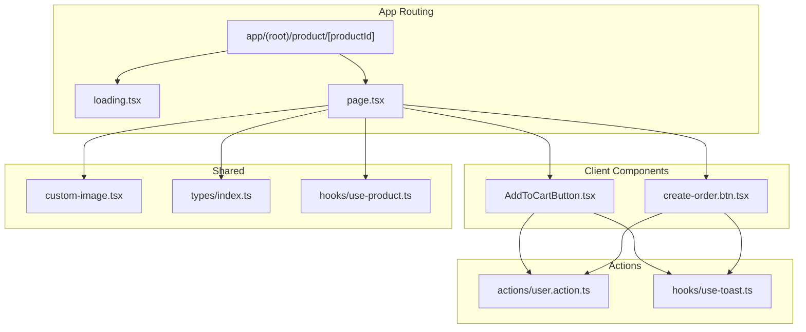
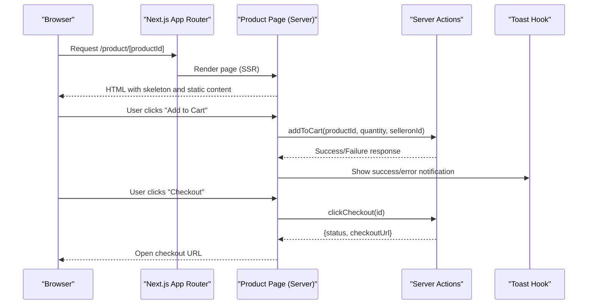
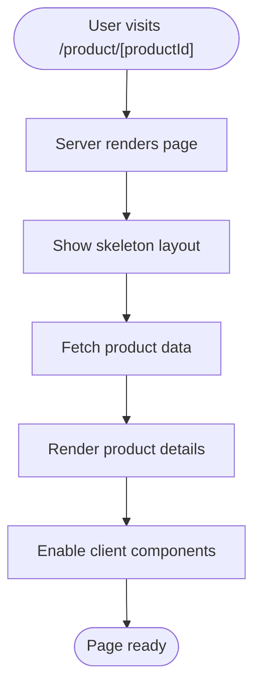
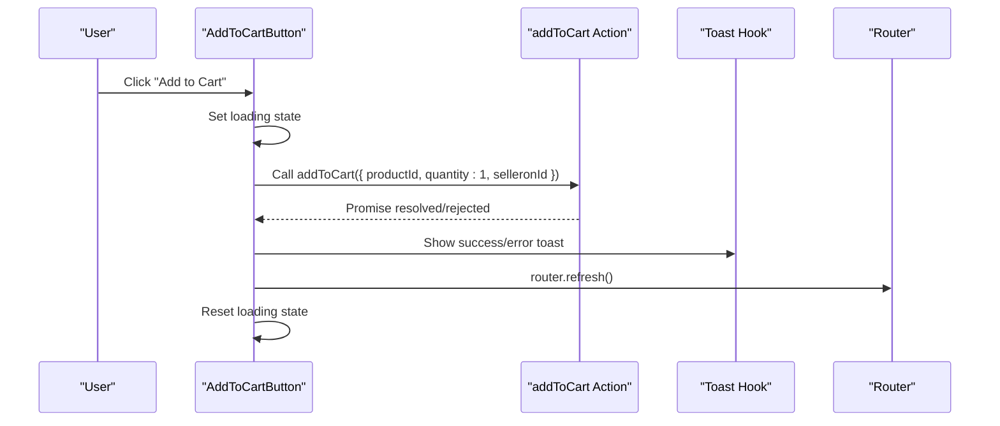
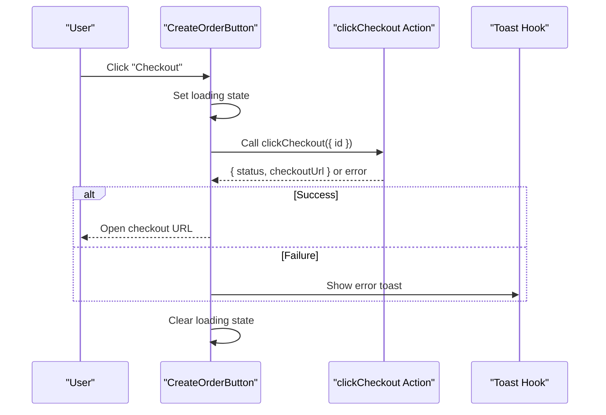
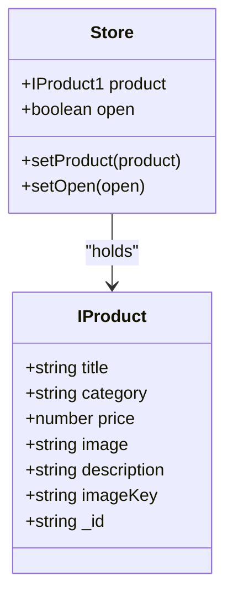
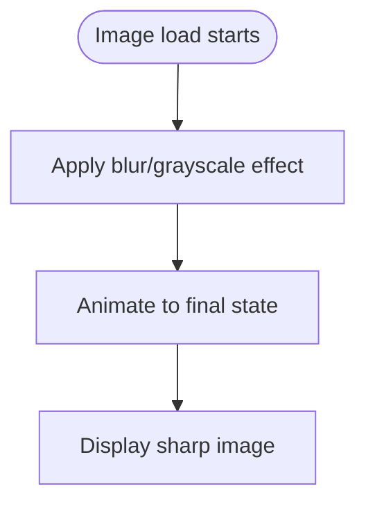
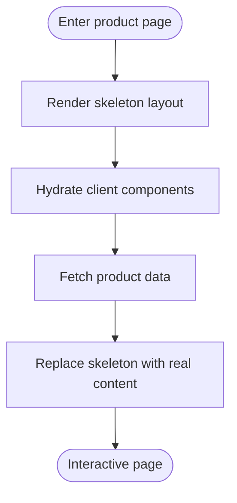
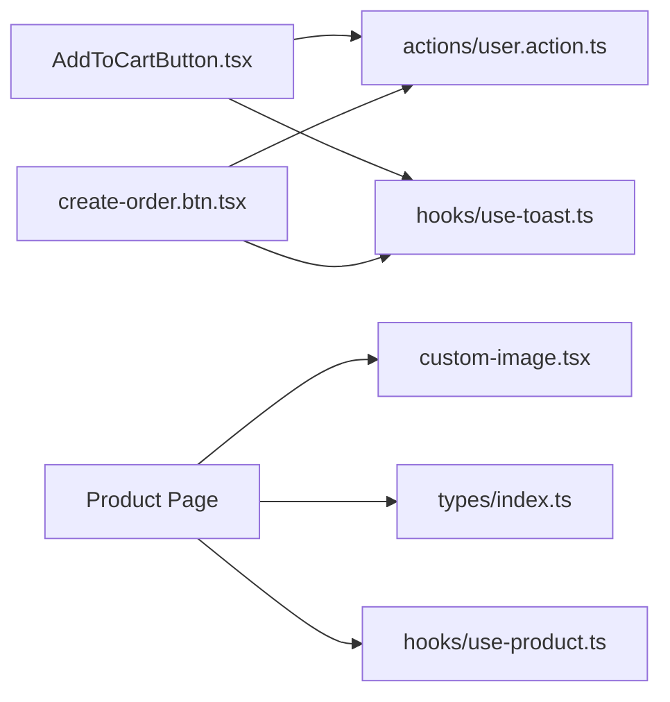

# Product Details & Individual Pages

<cite>
**Referenced Files in This Document**
- [app/(root)/product/[productId]/loading.tsx](file://app/(root)/product/[productId]/loading.tsx)
- [app/(root)/product/_components/AddToCartButton.tsx](file://app/(root)/product/_components/AddToCartButton.tsx)
- [app/(root)/product/_components/create-order.btn.tsx](file://app/(root)/product/_components/create-order.btn.tsx)
- [hooks/use-product.ts](file://hooks/use-product.ts)
- [types/index.ts](file://types/index.ts)
- [components/shared/custom-image.tsx](file://components/shared/custom-image.tsx)
- [lib/constants.ts](file://lib/constants.ts)
- [actions/user.action.ts](file://actions/user.action.ts)
- [hooks/use-toast.ts](file://hooks/use-toast.ts)
</cite>

## Table of Contents
1. [Introduction](#introduction)
2. [Project Structure](#project-structure)
3. [Core Components](#core-components)
4. [Architecture Overview](#architecture-overview)
5. [Detailed Component Analysis](#detailed-component-analysis)
6. [Dependency Analysis](#dependency-analysis)
7. [Performance Considerations](#performance-considerations)
8. [Troubleshooting Guide](#troubleshooting-guide)
9. [Conclusion](#conclusion)

## Introduction
This document explains the implementation of individual product pages, focusing on dynamic routing, client-side rendering patterns, and the loading experience. It covers the product detail layout, skeleton-based loading states, cart and checkout interactions, and responsive image handling. It also outlines how the system integrates with product data APIs and actions, and how performance and UX are optimized for product pages.

## Project Structure
The product detail page is organized under the app routing convention with a dynamic route segment for productId. The page leverages a dedicated loading skeleton and client components for cart and checkout actions. Shared UI primitives and image handling are reused across the application.

**Diagram sources**
- [app/(root)/product/[productId]/loading.tsx](file://app/(root)/product/[productId]/loading.tsx#L1-L130)
- [app/(root)/product/_components/AddToCartButton.tsx](file://app/(root)/product/_components/AddToCartButton.tsx#L1-L72)
- [app/(root)/product/_components/create-order.btn.tsx](file://app/(root)/product/_components/create-order.btn.tsx#L1-L53)
- [components/shared/custom-image.tsx:1-32](file://components/shared/custom-image.tsx#L1-L32)
- [types/index.ts:105-151](file://types/index.ts#L105-L151)
- [hooks/use-product.ts:1-17](file://hooks/use-product.ts#L1-L17)
- [actions/user.action.ts](file://actions/user.action.ts)
- [hooks/use-toast.ts](file://hooks/use-toast.ts)

**Section sources**
- [app/(root)/product/[productId]/loading.tsx](file://app/(root)/product/[productId]/loading.tsx#L1-L130)
- [app/(root)/product/_components/AddToCartButton.tsx](file://app/(root)/product/_components/AddToCartButton.tsx#L1-L72)
- [app/(root)/product/_components/create-order.btn.tsx](file://app/(root)/product/_components/create-order.btn.tsx#L1-L53)
- [components/shared/custom-image.tsx:1-32](file://components/shared/custom-image.tsx#L1-L32)
- [types/index.ts:105-151](file://types/index.ts#L105-L151)
- [hooks/use-product.ts:1-17](file://hooks/use-product.ts#L1-L17)

## Core Components
- Dynamic product route: The product detail page uses a dynamic route segment [productId] to resolve individual product pages.
- Loading skeleton: A comprehensive skeleton UI renders while the page loads, covering product images, details, ratings, pricing, and seller info.
- Client components:
  - AddToCartButton: Handles adding a product to the cart via a server action, with loading and success states and user feedback.
  - CreateOrderButton: Initiates checkout via a server action and opens the checkout URL in the current window.
- Shared utilities:
  - CustomImage: Optimized image component with loading transitions and responsive sizing.
  - Types: Strongly typed product and cart interfaces used across components.
  - Zustand store: A lightweight store for product state and visibility toggles.

**Section sources**
- [app/(root)/product/[productId]/loading.tsx](file://app/(root)/product/[productId]/loading.tsx#L1-L130)
- [app/(root)/product/_components/AddToCartButton.tsx](file://app/(root)/product/_components/AddToCartButton.tsx#L1-L72)
- [app/(root)/product/_components/create-order.btn.tsx](file://app/(root)/product/_components/create-order.btn.tsx#L1-L53)
- [components/shared/custom-image.tsx:1-32](file://components/shared/custom-image.tsx#L1-L32)
- [types/index.ts:105-151](file://types/index.ts#L105-L151)
- [hooks/use-product.ts:1-17](file://hooks/use-product.ts#L1-L17)

## Architecture Overview
The product detail page follows a hybrid SSR/CSR pattern:
- Server-rendered shell: The page is rendered on the server for initial load and SEO.
- Client-side interactivity: Client components manage cart and checkout actions, updating UI state and triggering navigations.
- Data fetching: Product data is fetched on the server during rendering; client components trigger mutations via server actions.

**Diagram sources**
- [app/(root)/product/[productId]/loading.tsx](file://app/(root)/product/[productId]/loading.tsx#L1-L130)
- [app/(root)/product/_components/AddToCartButton.tsx](file://app/(root)/product/_components/AddToCartButton.tsx#L1-L72)
- [app/(root)/product/_components/create-order.btn.tsx](file://app/(root)/product/_components/create-order.btn.tsx#L1-L53)
- [actions/user.action.ts](file://actions/user.action.ts)
- [hooks/use-toast.ts](file://hooks/use-toast.ts)

## Detailed Component Analysis

### Dynamic Product Routing and Layout
- Route segment: The dynamic route [productId] enables per-product URLs.
- Layout: The product route shares common layout elements with the rest of the application.
- Skeleton loading: A dedicated loading.tsx provides a full-page skeleton layout for the product detail page, ensuring smooth perceived performance.

**Diagram sources**
- [app/(root)/product/[productId]/loading.tsx](file://app/(root)/product/[productId]/loading.tsx#L1-L130)

**Section sources**
- [app/(root)/product/[productId]/loading.tsx](file://app/(root)/product/[productId]/loading.tsx#L1-L130)

### Add to Cart Client Component
- Purpose: Adds a product to the cart via a server action.
- Behavior:
  - Shows loading state during the operation.
  - Displays success state after a successful mutation.
  - Provides user feedback via toast notifications.
  - Refreshes the page to reflect updated cart state.
- Integration: Uses the addToCart action and a toast hook for user feedback.

**Diagram sources**
- [app/(root)/product/_components/AddToCartButton.tsx](file://app/(root)/product/_components/AddToCartButton.tsx#L1-L72)
- [actions/user.action.ts](file://actions/user.action.ts)
- [hooks/use-toast.ts](file://hooks/use-toast.ts)

**Section sources**
- [app/(root)/product/_components/AddToCartButton.tsx](file://app/(root)/product/_components/AddToCartButton.tsx#L1-L72)

### Checkout Client Component
- Purpose: Initiates checkout for a product via a server action.
- Behavior:
  - Executes a checkout action and validates the response.
  - Opens the returned checkout URL in the current window upon success.
  - Displays errors via toast notifications on failure.
- Integration: Uses the clickCheckout action and a reusable action hook for error handling.

**Diagram sources**
- [app/(root)/product/_components/create-order.btn.tsx](file://app/(root)/product/_components/create-order.btn.tsx#L1-L53)
- [actions/user.action.ts](file://actions/user.action.ts)
- [hooks/use-toast.ts](file://hooks/use-toast.ts)

**Section sources**
- [app/(root)/product/_components/create-order.btn.tsx](file://app/(root)/product/_components/create-order.btn.tsx#L1-L53)

### Product Data Model and Store
- Product model: Strongly typed product interface defines fields such as title, category, price, image, description, and identifiers.
- Store: A Zustand store manages product state and visibility flags, enabling cross-component sharing of product context.

**Diagram sources**
- [types/index.ts:105-151](file://types/index.ts#L105-L151)
- [hooks/use-product.ts:1-17](file://hooks/use-product.ts#L1-L17)

**Section sources**
- [types/index.ts:105-151](file://types/index.ts#L105-L151)
- [hooks/use-product.ts:1-17](file://hooks/use-product.ts#L1-L17)

### Responsive Image Handling
- CustomImage component:
  - Implements a smooth loading transition with blur and scale effects.
  - Uses responsive sizes for optimal image delivery across devices.
  - Integrates with Next.js Image for performance and optimization.

**Diagram sources**
- [components/shared/custom-image.tsx:1-32](file://components/shared/custom-image.tsx#L1-L32)

**Section sources**
- [components/shared/custom-image.tsx:1-32](file://components/shared/custom-image.tsx#L1-L32)

### Loading States and Skeleton Screens
- Skeleton layout:
  - Covers breadcrumb, product image gallery area, product details card, ratings, pricing, description, and seller information.
  - Ensures consistent visual rhythm and reduces perceived load time.
- Implementation:
  - Dedicated loading.tsx renders skeleton UI until the page finishes hydration and data fetching.

**Diagram sources**
- [app/(root)/product/[productId]/loading.tsx](file://app/(root)/product/[productId]/loading.tsx#L1-L130)

**Section sources**
- [app/(root)/product/[productId]/loading.tsx](file://app/(root)/product/[productId]/loading.tsx#L1-L130)

### Error Handling and Notifications
- AddToCartButton:
  - Displays success and error toasts based on the outcome of the cart mutation.
  - Resets UI states after a short delay.
- CreateOrderButton:
  - Uses a shared action hook to centralize error handling and loading state management.
  - Shows user-friendly messages on failures.

**Section sources**
- [app/(root)/product/_components/AddToCartButton.tsx](file://app/(root)/product/_components/AddToCartButton.tsx#L1-L72)
- [app/(root)/product/_components/create-order.btn.tsx](file://app/(root)/product/_components/create-order.btn.tsx#L1-L53)
- [hooks/use-toast.ts](file://hooks/use-toast.ts)

## Dependency Analysis
- Client components depend on server actions for mutations and on toast hooks for user feedback.
- The product page depends on shared UI components and types for consistent rendering and typing.
- The store provides a lightweight state container for product context across components.

**Diagram sources**
- [app/(root)/product/_components/AddToCartButton.tsx](file://app/(root)/product/_components/AddToCartButton.tsx#L1-L72)
- [app/(root)/product/_components/create-order.btn.tsx](file://app/(root)/product/_components/create-order.btn.tsx#L1-L53)
- [actions/user.action.ts](file://actions/user.action.ts)
- [hooks/use-toast.ts](file://hooks/use-toast.ts)
- [components/shared/custom-image.tsx:1-32](file://components/shared/custom-image.tsx#L1-L32)
- [types/index.ts:105-151](file://types/index.ts#L105-L151)
- [hooks/use-product.ts:1-17](file://hooks/use-product.ts#L1-L17)

**Section sources**
- [app/(root)/product/_components/AddToCartButton.tsx](file://app/(root)/product/_components/AddToCartButton.tsx#L1-L72)
- [app/(root)/product/_components/create-order.btn.tsx](file://app/(root)/product/_components/create-order.btn.tsx#L1-L53)
- [components/shared/custom-image.tsx:1-32](file://components/shared/custom-image.tsx#L1-L32)
- [types/index.ts:105-151](file://types/index.ts#L105-L151)
- [hooks/use-product.ts:1-17](file://hooks/use-product.ts#L1-L17)

## Performance Considerations
- Skeleton-first loading: Improves perceived performance by rendering a structured skeleton immediately.
- Optimized images: CustomImage applies responsive sizing and smooth loading transitions to reduce CLS and improve LCP.
- Minimal client-side work: Heavy lifting happens on the server; client components focus on interactions and state updates.
- Toast-driven feedback: Reduces unnecessary re-renders by providing concise user feedback.

[No sources needed since this section provides general guidance]

## Troubleshooting Guide
- Cart addition fails:
  - Verify the addToCart action signature and ensure productId and selleronId are passed correctly.
  - Check toast hook integration for error reporting.
- Checkout does not open:
  - Confirm the clickCheckout action returns a valid checkout URL and status.
  - Ensure the button disables loading state appropriately after failure.
- Skeleton remains visible:
  - Ensure the page hydrates and replaces skeleton content after data fetch completes.
  - Confirm the loading.tsx is present and not overridden by a conflicting route.

**Section sources**
- [app/(root)/product/_components/AddToCartButton.tsx](file://app/(root)/product/_components/AddToCartButton.tsx#L1-L72)
- [app/(root)/product/_components/create-order.btn.tsx](file://app/(root)/product/_components/create-order.btn.tsx#L1-L53)
- [app/(root)/product/[productId]/loading.tsx](file://app/(root)/product/[productId]/loading.tsx#L1-L130)

## Conclusion
The product detail page combines server-rendered content with client-side interactivity to deliver a fast, accessible, and responsive shopping experience. The skeleton-based loading strategy, optimized image handling, and robust error feedback ensure a smooth user journey. Server actions encapsulate data mutations, while shared components and types maintain consistency across the application.