# Product Management System

<cite>
**Referenced Files in This Document**
- [page.tsx](file://app/(root)/(home)/page.tsx)
- [product-grid.tsx](file://app/(root)/_components/product-grid.tsx)
- [product-card.tsx](file://app/(root)/_components/product-card.tsx)
- [category-cards.tsx](file://app/(root)/_components/category-cards.tsx)
- [search-bar.tsx](file://app/(root)/_components/search-bar.tsx)
- [filter.tsx](file://components/shared/filter.tsx)
- [pagination.tsx](file://components/shared/pagination.tsx)
- [custom-image.tsx](file://components/shared/custom-image.tsx)
- [user.action.ts](file://actions/user.action.ts)
- [index.ts](file://types/index.ts)
- [axios.ts](file://http/axios.ts)
- [validation.ts](file://lib/validation.ts)
</cite>

## Table of Contents
1. [Introduction](#introduction)
2. [Project Structure](#project-structure)
3. [Core Components](#core-components)
4. [Architecture Overview](#architecture-overview)
5. [Detailed Component Analysis](#detailed-component-analysis)
6. [Dependency Analysis](#dependency-analysis)
7. [Performance Considerations](#performance-considerations)
8. [Troubleshooting Guide](#troubleshooting-guide)
9. [Conclusion](#conclusion)

## Introduction
This document explains Optim Bozor’s product management system with a focus on the product catalog, dynamic routing, category-based filtering, search, pagination, and the user experience across home, catalog, category, and product pages. It also covers the image handling system, lazy-loading behavior, favorites integration, and the underlying data models and API integrations.

## Project Structure
The product management system spans Next.js app directory routes, shared UI components, and server actions that integrate with a backend API. Key areas:
- Home page renders featured products, category cards, and pagination.
- Catalog and category pages support dynamic slugs and filters.
- Shared components implement search, filtering, pagination, and image handling.
- Server actions encapsulate API calls and revalidation.

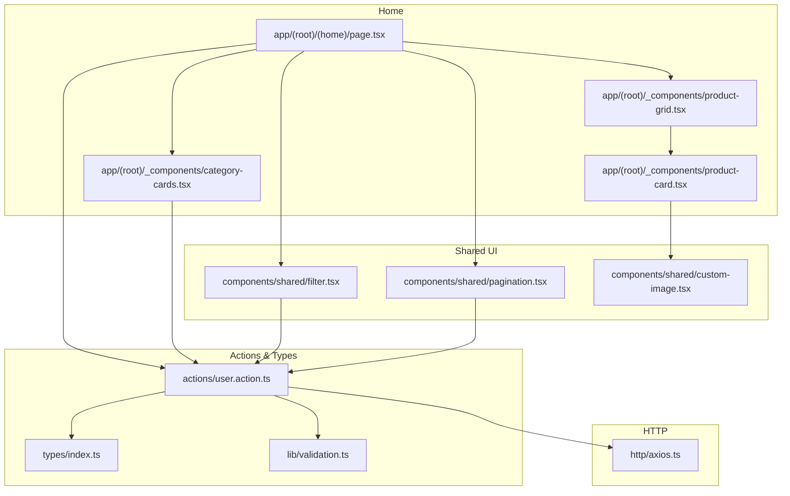

**Diagram sources**
- [page.tsx](file://app/(root)/(home)/page.tsx#L1-L58)
- [product-grid.tsx](file://app/(root)/_components/product-grid.tsx#L1-L77)
- [product-card.tsx](file://app/(root)/_components/product-card.tsx#L1-L196)
- [category-cards.tsx](file://app/(root)/_components/category-cards.tsx#L1-L101)
- [filter.tsx:1-49](file://components/shared/filter.tsx#L1-L49)
- [pagination.tsx:1-57](file://components/shared/pagination.tsx#L1-L57)
- [custom-image.tsx:1-32](file://components/shared/custom-image.tsx#L1-L32)
- [user.action.ts:1-295](file://actions/user.action.ts#L1-L295)
- [index.ts:105-151](file://types/index.ts#L105-L151)
- [axios.ts:1-10](file://http/axios.ts#L1-L10)
- [validation.ts:75-81](file://lib/validation.ts#L75-L81)

**Section sources**
- [page.tsx](file://app/(root)/(home)/page.tsx#L1-L58)
- [product-grid.tsx](file://app/(root)/_components/product-grid.tsx#L1-L77)
- [product-card.tsx](file://app/(root)/_components/product-card.tsx#L1-L196)
- [category-cards.tsx](file://app/(root)/_components/category-cards.tsx#L1-L101)
- [filter.tsx:1-49](file://components/shared/filter.tsx#L1-L49)
- [pagination.tsx:1-57](file://components/shared/pagination.tsx#L1-L57)
- [custom-image.tsx:1-32](file://components/shared/custom-image.tsx#L1-L32)
- [user.action.ts:1-295](file://actions/user.action.ts#L1-L295)
- [index.ts:105-151](file://types/index.ts#L105-L151)
- [axios.ts:1-10](file://http/axios.ts#L1-L10)
- [validation.ts:75-81](file://lib/validation.ts#L75-L81)

## Core Components
- Home page orchestrates product listing, category browsing, and pagination using server actions and shared components.
- Product grid and product cards render product tiles with hover effects, ratings, pricing, quick view, and favorites.
- Category cards present category navigation with dynamic slugs and optional images.
- Search bar integrates a filter component and links to the catalog page.
- Pagination updates URL query parameters to navigate pages.
- Custom image component implements lazy-loading and smooth transitions.

**Section sources**
- [page.tsx](file://app/(root)/(home)/page.tsx#L24-L54)
- [product-grid.tsx](file://app/(root)/_components/product-grid.tsx#L34-L74)
- [product-card.tsx](file://app/(root)/_components/product-card.tsx#L21-L192)
- [category-cards.tsx](file://app/(root)/_components/category-cards.tsx#L21-L99)
- [search-bar.tsx](file://app/(root)/_components/search-bar.tsx#L6-L39)
- [pagination.tsx:13-53](file://components/shared/pagination.tsx#L13-L53)
- [custom-image.tsx:12-28](file://components/shared/custom-image.tsx#L12-L28)

## Architecture Overview
The system follows a client-server pattern:
- Client-side React components manage UI state, routing, and user interactions.
- Server actions wrap API calls, enforce authentication, and trigger cache revalidation.
- Shared components encapsulate cross-cutting concerns like search, pagination, and image handling.
- Data models define product, category, and user structures used across components and actions.

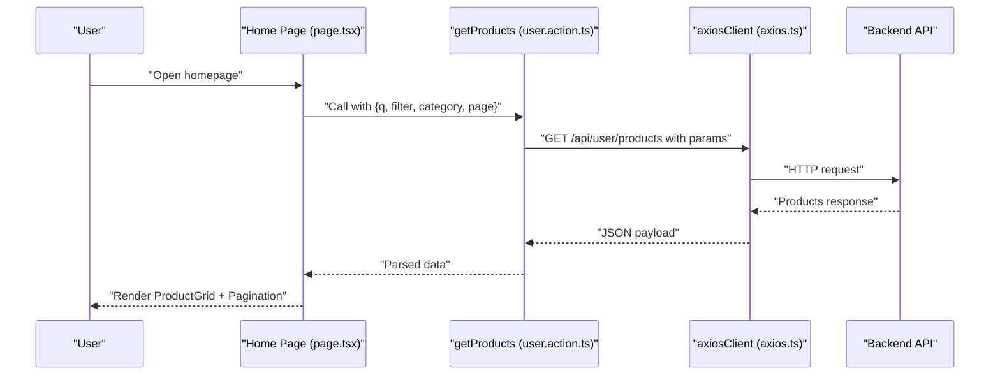

**Diagram sources**
- [page.tsx](file://app/(root)/(home)/page.tsx#L24-L31)
- [user.action.ts:22-29](file://actions/user.action.ts#L22-L29)
- [axios.ts:5-9](file://http/axios.ts#L5-L9)

## Detailed Component Analysis

### Home Page and Product Catalog Experience
- The home page aggregates:
  - Banner and category cards for discovery.
  - Product grid displaying products fetched via server action.
  - Pagination controls for navigating results.
- Dynamic routing:
  - Category cards link to catalog with slug fallback to ID.
  - Product cards link to individual product pages.
- Filtering and search:
  - Search bar routes to catalog and injects query parameters.
  - Pagination updates the page query parameter.

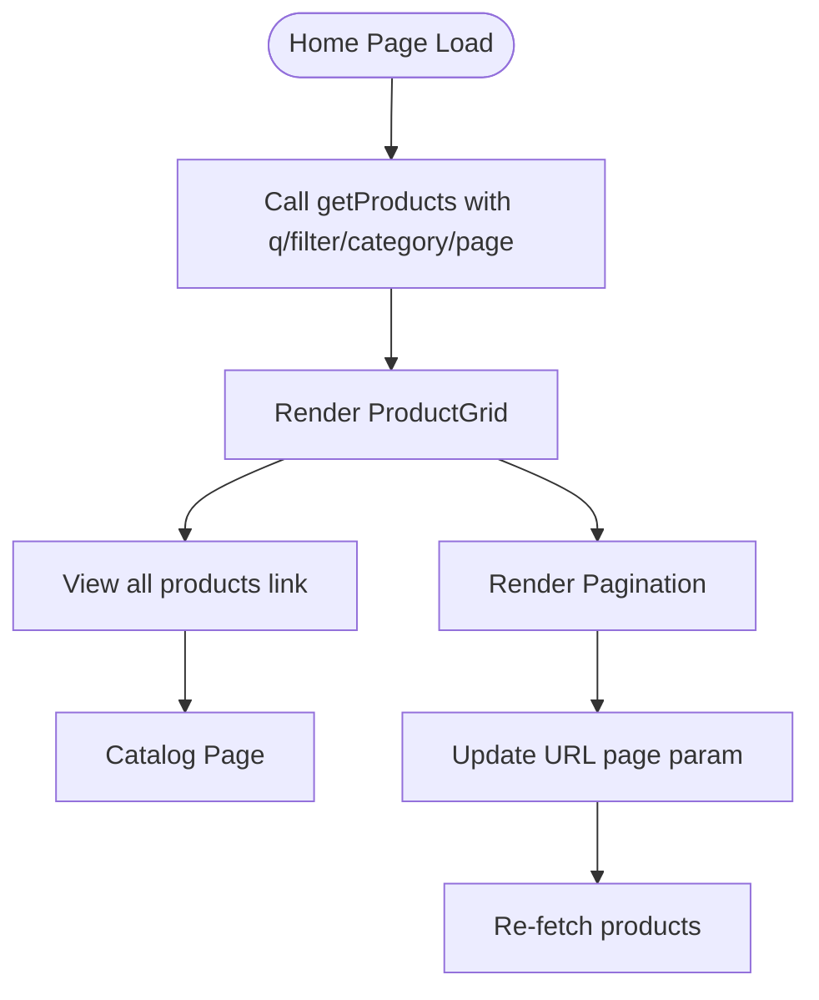

**Diagram sources**
- [page.tsx](file://app/(root)/(home)/page.tsx#L24-L50)
- [product-grid.tsx](file://app/(root)/_components/product-grid.tsx#L34-L74)
- [pagination.tsx:17-31](file://components/shared/pagination.tsx#L17-L31)

**Section sources**
- [page.tsx](file://app/(root)/(home)/page.tsx#L24-L54)
- [category-cards.tsx](file://app/(root)/_components/category-cards.tsx#L40-L61)
- [search-bar.tsx](file://app/(root)/_components/search-bar.tsx#L6-L39)
- [pagination.tsx:13-53](file://components/shared/pagination.tsx#L13-L53)

### Product Grid and Cards
- Product grid:
  - Uses motion variants for staggered entrance animations.
  - Responsive grid layout adapts from 2 to 5 columns.
  - “View all” CTA navigates to the catalog.
- Product cards:
  - Hover effects, quick view button, category badge, star rating, and price.
  - Favorites toggle integrates with server action and local storage.
  - Lazy-loaded image with smooth transition and priority loading.

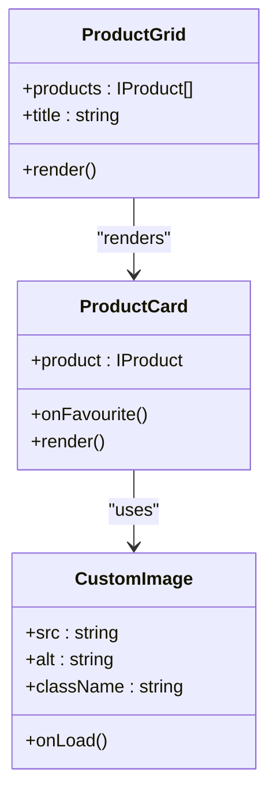

**Diagram sources**
- [product-grid.tsx](file://app/(root)/_components/product-grid.tsx#L29-L74)
- [product-card.tsx](file://app/(root)/_components/product-card.tsx#L17-L192)
- [custom-image.tsx:12-28](file://components/shared/custom-image.tsx#L12-L28)

**Section sources**
- [product-grid.tsx](file://app/(root)/_components/product-grid.tsx#L34-L74)
- [product-card.tsx](file://app/(root)/_components/product-card.tsx#L21-L192)
- [custom-image.tsx:12-28](file://components/shared/custom-image.tsx#L12-L28)

### Category Cards and Navigation
- Renders category cards with gradient backgrounds and optional images.
- Links to catalog using either slug or ID fallback.
- Supports prefetch disable for smoother navigation.

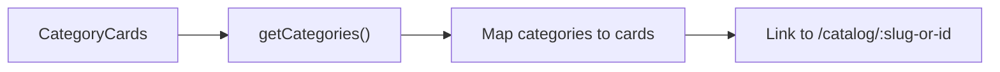

**Diagram sources**
- [category-cards.tsx](file://app/(root)/_components/category-cards.tsx#L21-L99)
- [user.action.ts:144-159](file://actions/user.action.ts#L144-L159)

**Section sources**
- [category-cards.tsx](file://app/(root)/_components/category-cards.tsx#L21-L99)
- [user.action.ts:144-159](file://actions/user.action.ts#L144-L159)

### Search and Filtering Mechanisms
- Search bar:
  - Provides a link to the catalog page.
  - Embeds a filter component for query input.
- Filter component:
  - Debounced input updates URL query parameter “q”.
  - Clears parameter when input is empty.
- Validation:
  - Search parameters are validated server-side to ensure defaults and types.

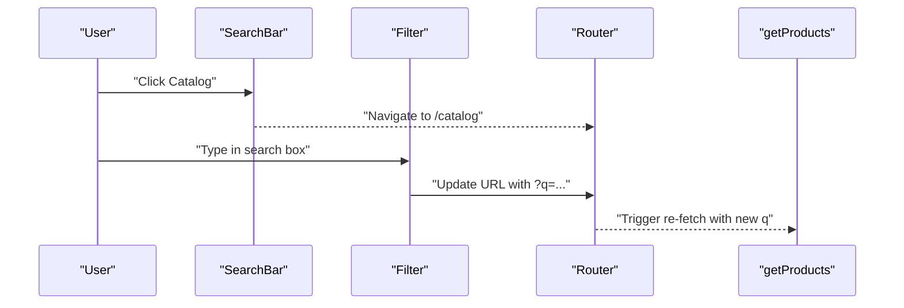

**Diagram sources**
- [search-bar.tsx](file://app/(root)/_components/search-bar.tsx#L6-L39)
- [filter.tsx:14-32](file://components/shared/filter.tsx#L14-L32)
- [user.action.ts:22-29](file://actions/user.action.ts#L22-L29)
- [validation.ts:75-81](file://lib/validation.ts#L75-L81)

**Section sources**
- [search-bar.tsx](file://app/(root)/_components/search-bar.tsx#L6-L39)
- [filter.tsx:10-49](file://components/shared/filter.tsx#L10-L49)
- [validation.ts:75-81](file://lib/validation.ts#L75-L81)

### Pagination Handling
- Pagination component:
  - Updates URL with page parameter on prev/next.
  - Disables buttons appropriately.
  - Uses URL manipulation helpers to preserve other query keys.

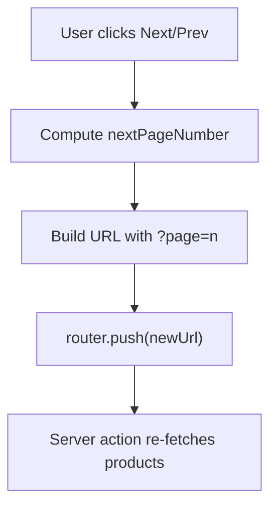

**Diagram sources**
- [pagination.tsx:17-31](file://components/shared/pagination.tsx#L17-L31)
- [user.action.ts:22-29](file://actions/user.action.ts#L22-L29)

**Section sources**
- [pagination.tsx:13-53](file://components/shared/pagination.tsx#L13-L53)

### Image Handling and Lazy Loading
- CustomImage:
  - Implements Next.js Image with fill and responsive sizes.
  - Smooth transition during load with priority prop.
  - Applies blur and scale effects while loading.

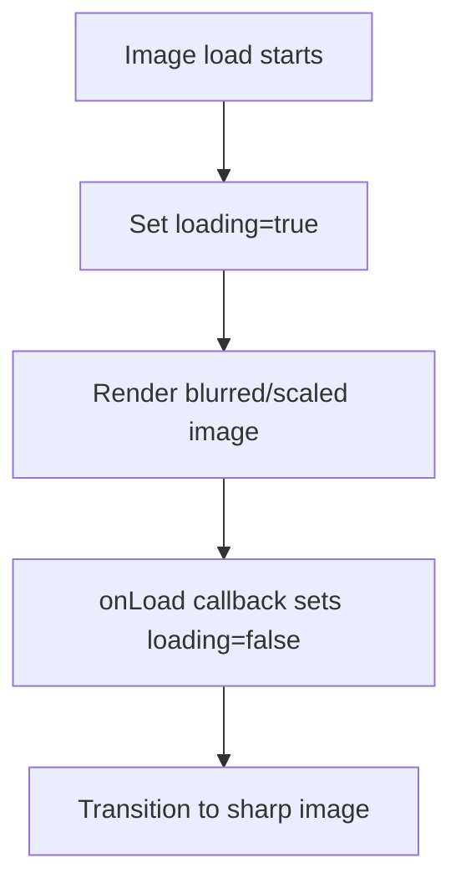

**Diagram sources**
- [custom-image.tsx:12-28](file://components/shared/custom-image.tsx#L12-L28)

**Section sources**
- [custom-image.tsx:12-28](file://components/shared/custom-image.tsx#L12-L28)

### Favorites and User Interactions
- Product card favorites:
  - Integrates with server action to add/remove favorites.
  - Persists current favorites in local storage.
  - Shows feedback via toast and updates UI state.
- Server actions:
  - Enforce authentication and revalidate relevant pages after changes.

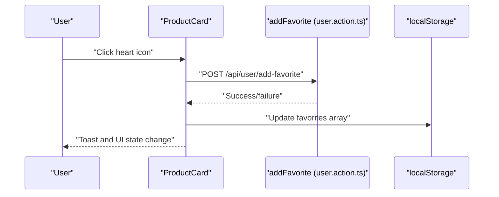

**Diagram sources**
- [product-card.tsx](file://app/(root)/_components/product-card.tsx#L33-L58)
- [user.action.ts:98-119](file://actions/user.action.ts#L98-L119)

**Section sources**
- [product-card.tsx](file://app/(root)/_components/product-card.tsx#L21-L192)
- [user.action.ts:98-119](file://actions/user.action.ts#L98-L119)

### Data Models and API Integrations
- Product model:
  - Includes nested category and seller info, plus identifiers and timestamps.
- Category model:
  - Supports subcategories and slug-based routing.
- API integrations:
  - getProducts, getProduct, getCategories, addFavorite, addToCart, getCart, getFavourites, getOrders, getTransactions, getStatistics.
- Validation:
  - Search parameters validated with defaults for page and pageSize.

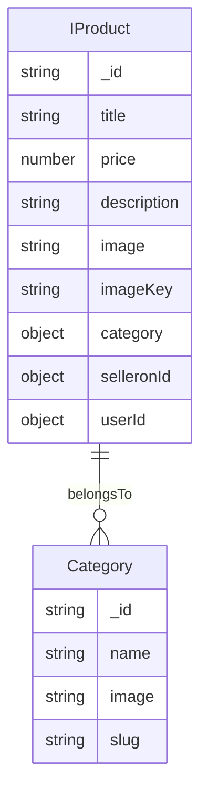

**Diagram sources**
- [index.ts:105-151](file://types/index.ts#L105-L151)
- [index.ts:201-209](file://types/index.ts#L201-L209)

**Section sources**
- [index.ts:105-151](file://types/index.ts#L105-L151)
- [index.ts:201-209](file://types/index.ts#L201-L209)
- [user.action.ts:22-29](file://actions/user.action.ts#L22-L29)
- [validation.ts:75-81](file://lib/validation.ts#L75-L81)

## Dependency Analysis
- Client components depend on:
  - Server actions for data fetching and mutations.
  - Shared components for UI primitives and behavior.
- Server actions depend on:
  - Axios client configured with base URL and credentials.
  - Zod schemas for input validation.
  - Next.js revalidatePath for cache invalidation.
- Types define contracts between client and server.

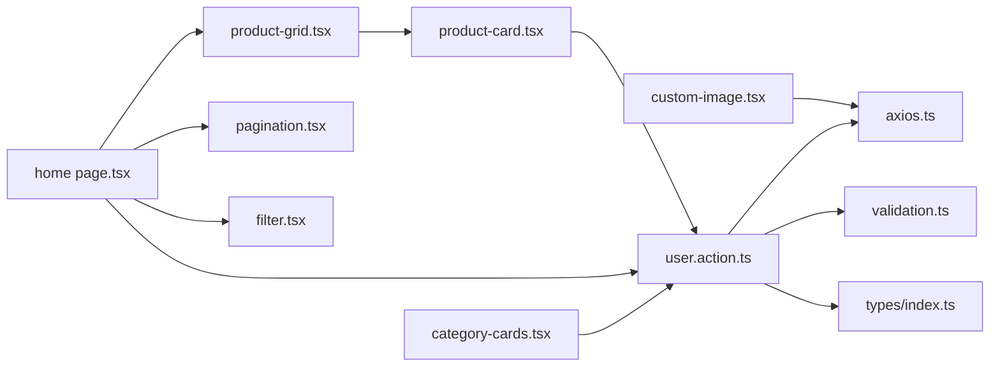

**Diagram sources**
- [product-card.tsx](file://app/(root)/_components/product-card.tsx#L1-L10)
- [product-grid.tsx](file://app/(root)/_components/product-grid.tsx#L1-L5)
- [page.tsx](file://app/(root)/(home)/page.tsx#L1-L10)
- [pagination.tsx:1-6](file://components/shared/pagination.tsx#L1-L6)
- [filter.tsx:1-8](file://components/shared/filter.tsx#L1-L8)
- [category-cards.tsx](file://app/(root)/_components/category-cards.tsx#L1)
- [custom-image.tsx:1-5](file://components/shared/custom-image.tsx#L1-L5)
- [user.action.ts:1-20](file://actions/user.action.ts#L1-L20)
- [axios.ts:1-10](file://http/axios.ts#L1-L10)
- [validation.ts:1-96](file://lib/validation.ts#L1-L96)
- [index.ts:1-209](file://types/index.ts#L1-L209)

**Section sources**
- [user.action.ts:1-295](file://actions/user.action.ts#L1-L295)
- [axios.ts:1-10](file://http/axios.ts#L1-L10)
- [validation.ts:75-81](file://lib/validation.ts#L75-L81)
- [index.ts:105-151](file://types/index.ts#L105-L151)

## Performance Considerations
- Image optimization:
  - Next/Image with fill and sizes ensures responsive images.
  - Priority loading for hero-like images; blur transitions reduce CLS.
- Client-side animations:
  - Motion variants introduce minimal overhead; keep animations simple.
- Debounced search:
  - Reduces unnecessary network requests during typing.
- Pagination:
  - URL-driven pagination avoids heavy client state; server action handles data fetching.
- Cache invalidation:
  - Revalidate paths after favorites/cart changes to keep UI fresh.

[No sources needed since this section provides general guidance]

## Troubleshooting Guide
- Products not updating after adding favorites:
  - Verify server action revalidation for favorites page and that client state syncs with local storage.
- Empty category cards:
  - Ensure categories endpoint returns data and images are URL-like or fallback to emoji placeholders.
- Pagination not working:
  - Confirm URL parameter handling and that server action accepts page/pageSize defaults.
- Search not filtering:
  - Check debounced input updates query parameter and server action validates search params.

**Section sources**
- [user.action.ts:115-119](file://actions/user.action.ts#L115-L119)
- [category-cards.tsx](file://app/(root)/_components/category-cards.tsx#L16-L19)
- [pagination.tsx:17-31](file://components/shared/pagination.tsx#L17-L31)
- [filter.tsx:14-32](file://components/shared/filter.tsx#L14-L32)
- [validation.ts:75-81](file://lib/validation.ts#L75-L81)

## Conclusion
Optim Bozor’s product management system combines dynamic routing, category-based navigation, and robust search with efficient pagination and responsive UI components. Server actions centralize API interactions and caching, while shared components standardize UX patterns. The image handling system and favorites integration enhance performance and user engagement. Together, these elements deliver a scalable and user-friendly product discovery experience.