# Search & Filtering System

<cite>
**Referenced Files in This Document**
- [search-bar.tsx](file://app/(root)/_components/search-bar.tsx)
- [filter.tsx](file://components/shared/filter.tsx)
- [utils.ts](file://lib/utils.ts)
- [page.tsx](file://app/(root)/(home)/page.tsx)
- [pagination.tsx](file://components/shared/pagination.tsx)
- [product-grid.tsx](file://app/(root)/_components/product-grid.tsx)
- [header.tsx](file://app/(root)/_components/header.tsx)
- [types.ts](file://types/index.ts)
- [SlugClient.tsx](file://app/(root)/catalog/[slug]/_components/SlugClient.tsx)
- [catalog.tsx](file://app/(root)/_components/catalog.tsx)
- [page.tsx](file://app/(root)/catalog/[slug]/page.tsx)
- [page.tsx](file://app/(root)/catalog/page.tsx)
</cite>

## Table of Contents
1. [Introduction](#introduction)
2. [Project Structure](#project-structure)
3. [Core Components](#core-components)
4. [Architecture Overview](#architecture-overview)
5. [Detailed Component Analysis](#detailed-component-analysis)
6. [Dependency Analysis](#dependency-analysis)
7. [Performance Considerations](#performance-considerations)
8. [Troubleshooting Guide](#troubleshooting-guide)
9. [Conclusion](#conclusion)

## Introduction
This document describes the search and filtering system implemented in the application. It covers the search bar with auto-suggestion-like behavior, query validation and persistence via URL parameters, real-time updates through Next.js app routing, and the integration with backend APIs for retrieving filtered and paginated results. It also documents the UI patterns for search input, filter controls, and result display, along with performance optimizations, debouncing, and analytics considerations.

## Project Structure
The search and filtering system spans several UI components and shared utilities:
- Search bar and filter input are integrated into the header and catalog pages.
- URL query parameters are parsed and updated reactively using Next.js’s client-side router hooks.
- Results are fetched server-side using the search parameters and rendered in a responsive product grid with pagination.

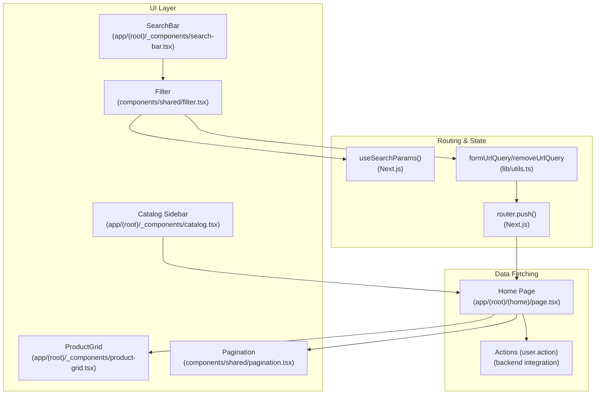

**Diagram sources**
- [search-bar.tsx](file://app/(root)/_components/search-bar.tsx#L1-L40)
- [filter.tsx:1-48](file://components/shared/filter.tsx#L1-L48)
- [utils.ts:19-35](file://lib/utils.ts#L19-L35)
- [page.tsx](file://app/(root)/(home)/page.tsx#L24-L55)
- [pagination.tsx:13-31](file://components/shared/pagination.tsx#L13-L31)
- [product-grid.tsx](file://app/(root)/_components/product-grid.tsx#L60-L71)
- [catalog.tsx](file://app/(root)/_components/catalog.tsx#L6-L31)

**Section sources**
- [search-bar.tsx](file://app/(root)/_components/search-bar.tsx#L1-L40)
- [filter.tsx:1-48](file://components/shared/filter.tsx#L1-L48)
- [utils.ts:19-35](file://lib/utils.ts#L19-L35)
- [page.tsx](file://app/(root)/(home)/page.tsx#L24-L55)
- [pagination.tsx:13-31](file://components/shared/pagination.tsx#L13-L31)
- [product-grid.tsx](file://app/(root)/_components/product-grid.tsx#L60-L71)
- [catalog.tsx](file://app/(root)/_components/catalog.tsx#L6-L31)

## Core Components
- SearchBar: Provides a quick-access “Catalog” button and embeds the Filter component for search input.
- Filter: Implements the search input field with debounced updates and URL parameter synchronization.
- URL Utilities: Helper functions to construct and remove query parameters safely.
- Home Page: Reads URL parameters and fetches products from backend actions.
- Pagination: Updates the page URL parameter for navigation.
- ProductGrid: Renders the list of products returned by the backend.
- Catalog Sidebar: Displays categories and highlights the active category.

**Section sources**
- [search-bar.tsx](file://app/(root)/_components/search-bar.tsx#L6-L39)
- [filter.tsx:10-32](file://components/shared/filter.tsx#L10-L32)
- [utils.ts:19-35](file://lib/utils.ts#L19-L35)
- [page.tsx](file://app/(root)/(home)/page.tsx#L24-L55)
- [pagination.tsx:13-31](file://components/shared/pagination.tsx#L13-L31)
- [product-grid.tsx](file://app/(root)/_components/product-grid.tsx#L60-L71)
- [catalog.tsx](file://app/(root)/_components/catalog.tsx#L6-L31)

## Architecture Overview
The system follows a client-driven URL parameter model:
- The Filter component listens to input changes and updates the URL after a debounce delay.
- The home page reads the current URL parameters and passes them to backend actions to fetch products.
- Pagination updates the page number in the URL, triggering re-fetches.
- The UI renders results and exposes category navigation.

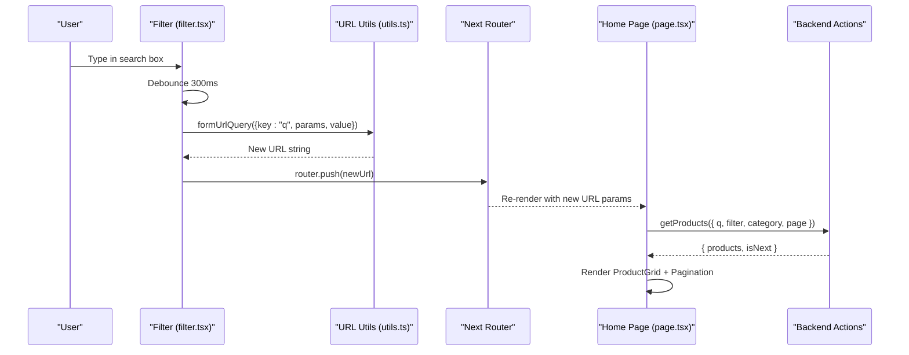

**Diagram sources**
- [filter.tsx:14-32](file://components/shared/filter.tsx#L14-L32)
- [utils.ts:19-26](file://lib/utils.ts#L19-L26)
- [page.tsx](file://app/(root)/(home)/page.tsx#L26-L31)
- [pagination.tsx:17-31](file://components/shared/pagination.tsx#L17-L31)

## Detailed Component Analysis

### Search Bar and Filter Input
- SearchBar integrates a “Catalog” button and the Filter component.
- Filter manages the input lifecycle:
  - On change, it constructs a new URL with the “q” parameter.
  - Clears the “q” parameter when the input becomes empty.
  - Uses a 300ms debounce to avoid excessive URL updates.

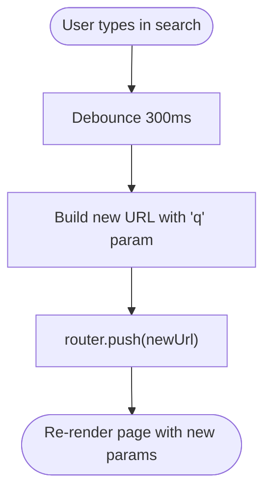

**Diagram sources**
- [filter.tsx:14-32](file://components/shared/filter.tsx#L14-L32)

**Section sources**
- [search-bar.tsx](file://app/(root)/_components/search-bar.tsx#L6-L39)
- [filter.tsx:10-32](file://components/shared/filter.tsx#L10-L32)

### URL Parameter Management
- formUrlQuery updates a single query key while preserving others.
- removeUrlQuery deletes a key from the current query string.
- Both rely on query-string parsing and stringify to maintain URL correctness.

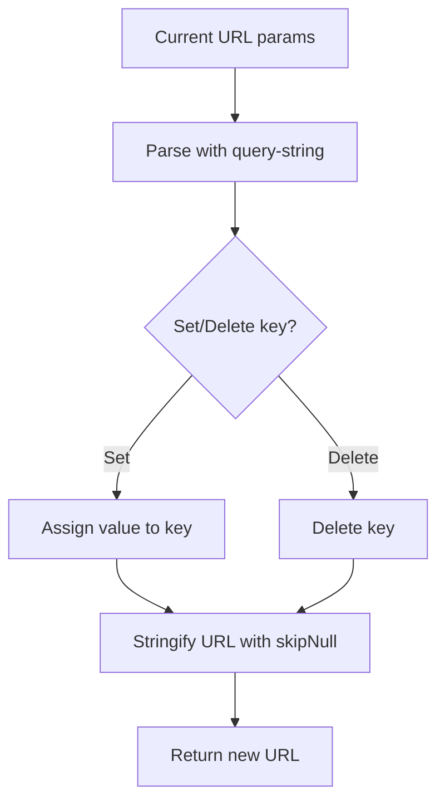

**Diagram sources**
- [utils.ts:19-35](file://lib/utils.ts#L19-L35)

**Section sources**
- [utils.ts:19-35](file://lib/utils.ts#L19-L35)

### Query Validation and Parsing
- The home page reads URL parameters and forwards them to the backend:
  - q: search query
  - filter: generic filter string
  - category: category identifier
  - page: pagination page number
- Types define the shape of search parameters and query props.

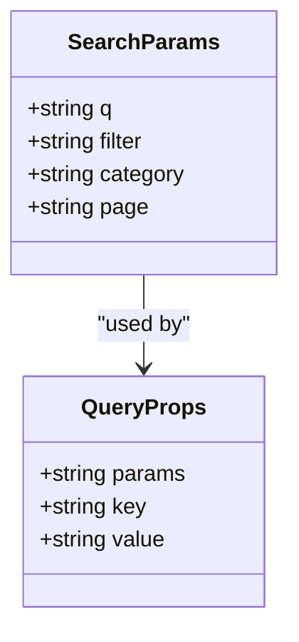

**Diagram sources**
- [types.ts:5-30](file://types/index.ts#L5-L30)
- [page.tsx](file://app/(root)/(home)/page.tsx#L24-L31)

**Section sources**
- [types.ts:5-30](file://types/index.ts#L5-L30)
- [page.tsx](file://app/(root)/(home)/page.tsx#L24-L31)

### Backend Integration and Result Rendering
- The home page calls a backend action with the current parameters and receives:
  - products: array of items
  - isNext: indicates whether there is a next page
- Pagination is controlled by a separate component that updates the “page” parameter.
- ProductGrid renders the results in a responsive grid.

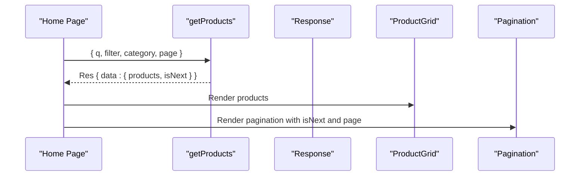

**Diagram sources**
- [page.tsx](file://app/(root)/(home)/page.tsx#L26-L50)
- [pagination.tsx:13-31](file://components/shared/pagination.tsx#L13-L31)
- [product-grid.tsx](file://app/(root)/_components/product-grid.tsx#L60-L71)

**Section sources**
- [page.tsx](file://app/(root)/(home)/page.tsx#L24-L55)
- [pagination.tsx:13-31](file://components/shared/pagination.tsx#L13-L31)
- [product-grid.tsx](file://app/(root)/_components/product-grid.tsx#L60-L71)

### Filtering Mechanisms
- Current implementation supports:
  - Text search via “q”
  - Generic “filter” parameter
  - Category selection via “category”
  - Pagination via “page”
- The Filter component updates “q”; other filters can be added similarly by extending URL parameters and backend logic.

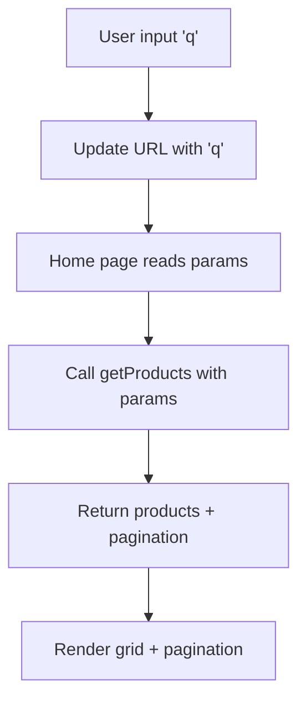

**Diagram sources**
- [filter.tsx:14-32](file://components/shared/filter.tsx#L14-L32)
- [page.tsx](file://app/(root)/(home)/page.tsx#L26-L31)

**Section sources**
- [filter.tsx:14-32](file://components/shared/filter.tsx#L14-L32)
- [page.tsx](file://app/(root)/(home)/page.tsx#L26-L31)

### Auto-Suggestion Pattern
- The current Filter component does not implement a dedicated suggestion dropdown.
- Suggested enhancement:
  - On input, fetch suggestions from a dedicated endpoint.
  - Display a dropdown list below the input.
  - Selecting a suggestion updates “q” and triggers a URL push.

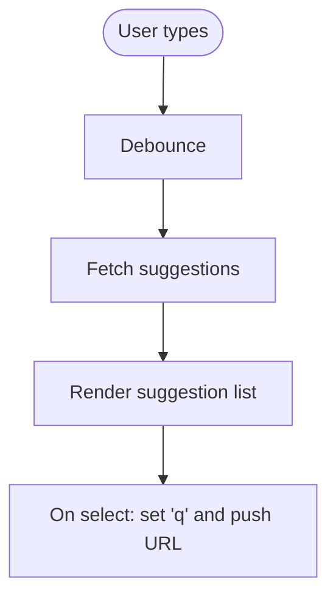

[No sources needed since this diagram shows conceptual workflow, not actual code structure]

### Category-Based Navigation
- The header includes recent search terms that can be clicked to set the search query.
- The catalog sidebar lists categories and highlights the active one based on URL slugs.

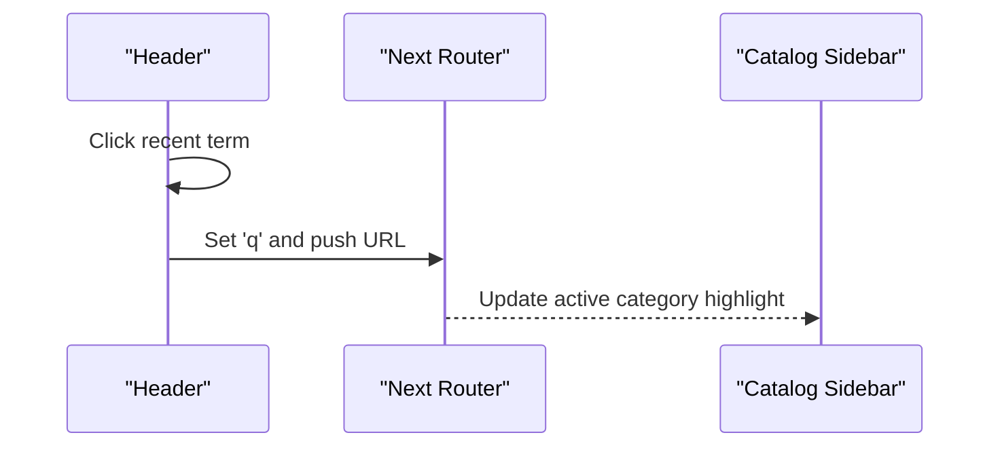

**Diagram sources**
- [header.tsx](file://app/(root)/_components/header.tsx#L194-L208)
- [catalog.tsx](file://app/(root)/_components/catalog.tsx#L11-L23)

**Section sources**
- [header.tsx](file://app/(root)/_components/header.tsx#L194-L208)
- [catalog.tsx](file://app/(root)/_components/catalog.tsx#L11-L23)

### Catalog Subcategories
- The catalog slug page fetches subcategories and renders them in a responsive grid with expandable sections.
- Links navigate to category pages using constructed slugs.

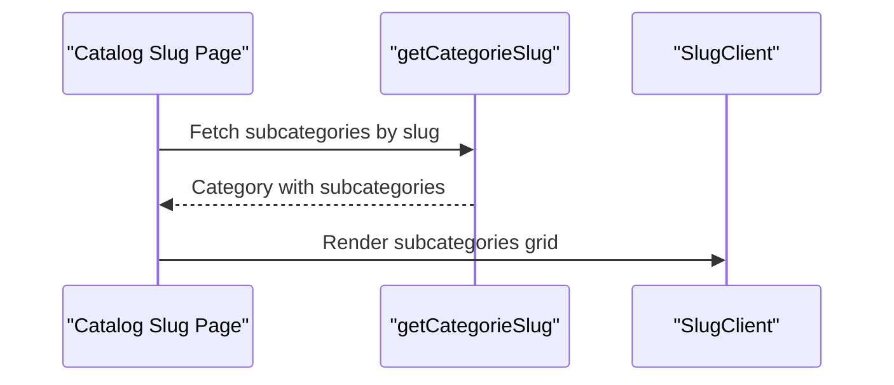

**Diagram sources**
- [page.tsx](file://app/(root)/catalog/[slug]/page.tsx#L15-L22)
- [SlugClient.tsx](file://app/(root)/catalog/[slug]/_components/SlugClient.tsx#L10-L30)

**Section sources**
- [page.tsx](file://app/(root)/catalog/[slug]/page.tsx#L15-L22)
- [SlugClient.tsx](file://app/(root)/catalog/[slug]/_components/SlugClient.tsx#L10-L30)

## Dependency Analysis
- Filter depends on:
  - Next.js hooks for URL state (useSearchParams, useRouter)
  - URL utilities for building URLs
  - lodash debounce for performance
- Home page depends on:
  - URL parameters to call backend actions
  - Pagination component to manage page transitions
- ProductGrid depends on:
  - Products passed from the home page

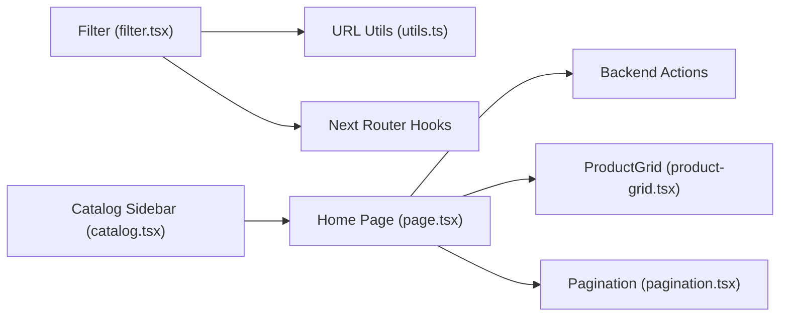

**Diagram sources**
- [filter.tsx:5-12](file://components/shared/filter.tsx#L5-L12)
- [utils.ts:19-35](file://lib/utils.ts#L19-L35)
- [page.tsx](file://app/(root)/(home)/page.tsx#L24-L55)
- [pagination.tsx:13-31](file://components/shared/pagination.tsx#L13-L31)
- [product-grid.tsx](file://app/(root)/_components/product-grid.tsx#L60-L71)
- [catalog.tsx](file://app/(root)/_components/catalog.tsx#L6-L31)

**Section sources**
- [filter.tsx:5-12](file://components/shared/filter.tsx#L5-L12)
- [utils.ts:19-35](file://lib/utils.ts#L19-L35)
- [page.tsx](file://app/(root)/(home)/page.tsx#L24-L55)
- [pagination.tsx:13-31](file://components/shared/pagination.tsx#L13-L31)
- [product-grid.tsx](file://app/(root)/_components/product-grid.tsx#L60-L71)
- [catalog.tsx](file://app/(root)/_components/catalog.tsx#L6-L31)

## Performance Considerations
- Debouncing: The Filter component debounces input changes to reduce URL updates and backend calls.
- Minimal re-renders: URL updates are scoped to the “q” parameter; other parameters can be extended similarly.
- Pagination: Uses URL updates to avoid full page reloads during navigation.
- Lazy loading: Consider adding intersection observer-based lazy loading for images in ProductGrid.

[No sources needed since this section provides general guidance]

## Troubleshooting Guide
- Search not updating:
  - Verify that onChange is bound to the debounced handler.
  - Confirm that router.push is called with the new URL string.
- Empty query handling:
  - Ensure removeUrlQuery is invoked when the input is cleared.
- Pagination issues:
  - Check that the page parameter is correctly updated and passed to the backend.
- URL corruption:
  - Use formUrlQuery/removeUrlQuery helpers to preserve existing parameters.

**Section sources**
- [filter.tsx:14-32](file://components/shared/filter.tsx#L14-L32)
- [utils.ts:19-35](file://lib/utils.ts#L19-L35)
- [pagination.tsx:17-31](file://components/shared/pagination.tsx#L17-L31)

## Conclusion
The current search and filtering system centers on a debounced search input that synchronizes with URL parameters, enabling real-time, persistent search state. The home page consumes these parameters to fetch and render results, with pagination supporting large datasets. Extending the system to include explicit auto-suggestions, category-specific filters, and attribute-based filtering involves adding new URL keys and backend logic while maintaining the existing URL-driven architecture.