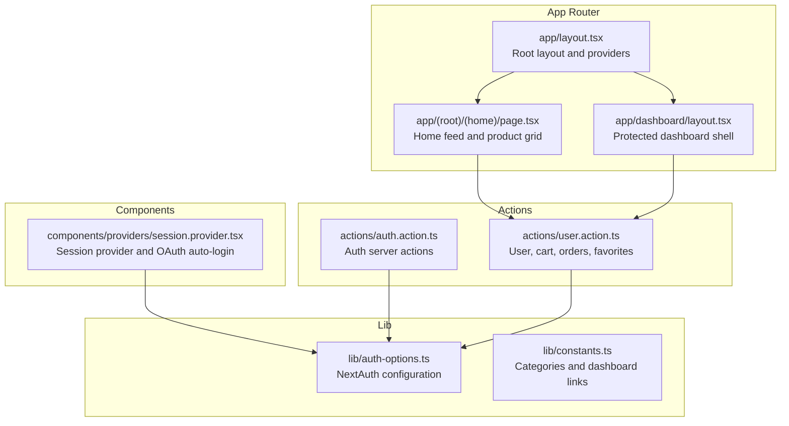
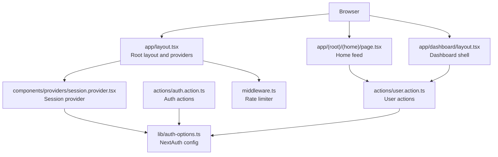
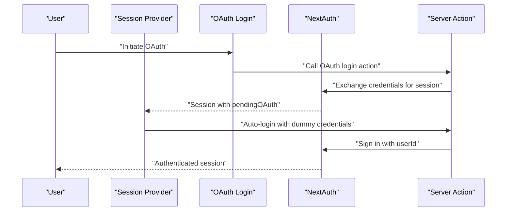
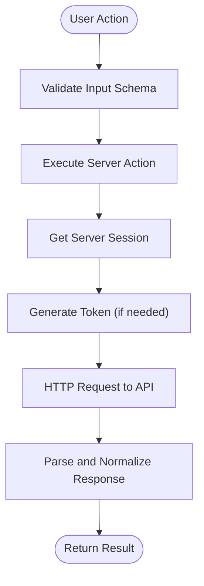
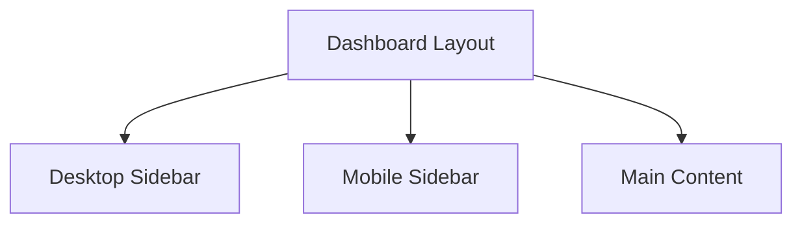
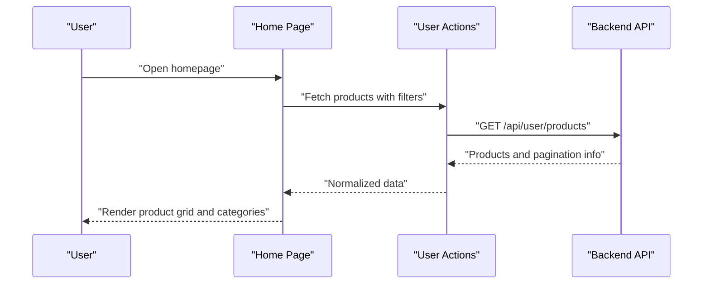
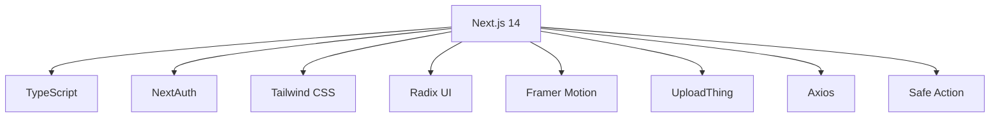

# Project Overview

<cite>
**Referenced Files in This Document**
- [README.md](file://README.md)
- [package.json](file://package.json)
- [app/layout.tsx](file://app/layout.tsx)
- [lib/constants.ts](file://lib/constants.ts)
- [lib/auth-options.ts](file://lib/auth-options.ts)
- [actions/auth.action.ts](file://actions/auth.action.ts)
- [actions/user.action.ts](file://actions/user.action.ts)
- [components/providers/session.provider.tsx](file://components/providers/session.provider.tsx)
- [middleware.ts](file://middleware.ts)
- [app/dashboard/layout.tsx](file://app/dashboard/layout.tsx)
- [app/(root)/(home)/page.tsx](file://app/(root)/(home)/page.tsx)
- [tailwind.config.ts](file://tailwind.config.ts)
</cite>

## Table of Contents
1. [Introduction](#introduction)
2. [Project Structure](#project-structure)
3. [Core Components](#core-components)
4. [Architecture Overview](#architecture-overview)
5. [Detailed Component Analysis](#detailed-component-analysis)
6. [Dependency Analysis](#dependency-analysis)
7. [Performance Considerations](#performance-considerations)
8. [Troubleshooting Guide](#troubleshooting-guide)
9. [Conclusion](#conclusion)

## Introduction
Optim Bozor is a modern online marketplace platform tailored for Uzbekistan, designed to connect local buyers and sellers with convenience, speed, and simplicity. Its mission is to enable users to discover, compare, and purchase local products quickly while offering sellers an easy way to showcase and manage their offerings. The platform emphasizes fast loading, a clean and intuitive interface, and strong mobile responsiveness to serve users across devices.

Key value propositions:
- Local-first marketplace for authentic, regionally relevant products
- Fast and reliable browsing and purchasing experience
- Simple, mobile-friendly interface optimized for everyday users
- Secure authentication and user-centric dashboards

Target audience and business context:
- Buyers: Everyday consumers seeking local goods with quick delivery and trust
- Sellers: Local vendors and entrepreneurs who want to reach nearby customers efficiently
- Business context: A hyperlocal marketplace that prioritizes regional relevance, trust, and accessibility

**Section sources**
- [README.md:19-29](file://README.md#L19-L29)

## Project Structure
The project follows a Next.js 14 App Router-based architecture with a clear separation of concerns:
- app/: Application routes, pages, layouts, and UI components organized by feature and route groups
- actions/: Server actions for secure, typed server-side operations
- components/: Shared UI components and providers
- lib/: Authentication configuration, constants, utilities, and validation helpers
- http/: HTTP client configuration for API communication
- hooks/: Custom React hooks for reusable logic
- public/: Static assets and PWA-related files

**Diagram sources**
- [app/layout.tsx:1-73](file://app/layout.tsx#L1-L73)
- [app/(root)/(home)/page.tsx:1-58](file://app/(root)/(home)/page.tsx#L1-L58)
- [app/dashboard/layout.tsx:1-45](file://app/dashboard/layout.tsx#L1-L45)
- [actions/auth.action.ts:1-51](file://actions/auth.action.ts#L1-L51)
- [actions/user.action.ts:1-288](file://actions/user.action.ts#L1-L288)
- [lib/auth-options.ts:1-128](file://lib/auth-options.ts#L1-L128)
- [lib/constants.ts:1-25](file://lib/constants.ts#L1-L25)
- [components/providers/session.provider.tsx:1-39](file://components/providers/session.provider.tsx#L1-L39)

**Section sources**
- [package.json:11-54](file://package.json#L11-L54)
- [app/layout.tsx:1-73](file://app/layout.tsx#L1-L73)
- [app/dashboard/layout.tsx:1-45](file://app/dashboard/layout.tsx#L1-L45)

## Core Components
- Authentication and session management via NextAuth with JWT strategy, supporting credentials and Google OAuth providers
- Server actions for secure, typed operations such as login, registration, OTP verification, user profile updates, cart management, order placement, favorites, and statistics retrieval
- Dashboard with protected routes, responsive sidebar, and mobile navigation
- Home page featuring product listings, category cards, banners, pagination, and SEO metadata
- Tailwind CSS-based responsive design with custom animations and theme tokens

Key features:
- Product catalog management and discovery with filtering and pagination
- User dashboard for personal information, orders, and settings
- Mobile-responsive design ensuring usability across devices
- Rate limiting middleware for traffic control

**Section sources**
- [lib/auth-options.ts:1-128](file://lib/auth-options.ts#L1-L128)
- [actions/auth.action.ts:1-51](file://actions/auth.action.ts#L1-L51)
- [actions/user.action.ts:1-288](file://actions/user.action.ts#L1-L288)
- [app/dashboard/layout.tsx:1-45](file://app/dashboard/layout.tsx#L1-L45)
- [app/(root)/(home)/page.tsx:1-58](file://app/(root)/(home)/page.tsx#L1-L58)
- [tailwind.config.ts:1-161](file://tailwind.config.ts#L1-L161)

## Architecture Overview
The application is structured around Next.js 14’s App Router, leveraging server actions for secure, typed server-side logic and NextAuth for authentication. The root layout initializes providers, global styles, and UI enhancements. Protected routes enforce authentication via server sessions, and the dashboard provides a responsive shell for user-centric workflows.

**Diagram sources**
- [app/layout.tsx:1-73](file://app/layout.tsx#L1-L73)
- [components/providers/session.provider.tsx:1-39](file://components/providers/session.provider.tsx#L1-L39)
- [lib/auth-options.ts:1-128](file://lib/auth-options.ts#L1-L128)
- [actions/auth.action.ts:1-51](file://actions/auth.action.ts#L1-L51)
- [actions/user.action.ts:1-288](file://actions/user.action.ts#L1-L288)
- [app/(root)/(home)/page.tsx:1-58](file://app/(root)/(home)/page.tsx#L1-L58)
- [app/dashboard/layout.tsx:1-45](file://app/dashboard/layout.tsx#L1-L45)
- [middleware.ts:1-26](file://middleware.ts#L1-L26)

## Detailed Component Analysis

### Authentication and Session Management
- NextAuth configuration defines providers (credentials and Google), cookie policies, JWT/session strategy, and callbacks to enrich session data from the backend
- Session provider handles automatic OAuth login flow by bridging pending OAuth state with credentials-based sign-in
- Protected dashboard enforces session presence and redirects unauthenticated users to the sign-in page

**Diagram sources**
- [components/providers/session.provider.tsx:1-39](file://components/providers/session.provider.tsx#L1-L39)
- [actions/auth.action.ts:42-51](file://actions/auth.action.ts#L42-L51)
- [lib/auth-options.ts:1-128](file://lib/auth-options.ts#L1-L128)

**Section sources**
- [lib/auth-options.ts:1-128](file://lib/auth-options.ts#L1-L128)
- [components/providers/session.provider.tsx:1-39](file://components/providers/session.provider.tsx#L1-L39)
- [app/dashboard/layout.tsx:1-45](file://app/dashboard/layout.tsx#L1-L45)

### Server Actions and Data Flow
- Server actions encapsulate backend calls for authentication, user operations, cart, orders, favorites, and statistics
- Actions use typed schemas for validation and return normalized responses
- Server-side session retrieval ensures secure operations and proper authorization

**Diagram sources**
- [actions/user.action.ts:52-59](file://actions/user.action.ts#L52-L59)
- [actions/user.action.ts:61-72](file://actions/user.action.ts#L61-L72)
- [actions/user.action.ts:237-253](file://actions/user.action.ts#L237-L253)

**Section sources**
- [actions/auth.action.ts:1-51](file://actions/auth.action.ts#L1-L51)
- [actions/user.action.ts:1-288](file://actions/user.action.ts#L1-L288)

### Dashboard and Responsive Design
- Dashboard layout enforces authentication, renders desktop and mobile sidebars, and manages responsive content areas
- Tailwind configuration extends spacing, colors, shadows, animations, and container sizes for a cohesive UI system
- Constants define dashboard navigation items and transaction states for consistent UX

**Diagram sources**
- [app/dashboard/layout.tsx:1-45](file://app/dashboard/layout.tsx#L1-L45)
- [lib/constants.ts:13-17](file://lib/constants.ts#L13-L17)
- [tailwind.config.ts:1-161](file://tailwind.config.ts#L1-L161)

**Section sources**
- [app/dashboard/layout.tsx:1-45](file://app/dashboard/layout.tsx#L1-L45)
- [lib/constants.ts:13-17](file://lib/constants.ts#L13-L17)
- [tailwind.config.ts:1-161](file://tailwind.config.ts#L1-L161)

### Home Feed and Product Catalog
- Home page aggregates product listings, categories, banners, and pagination based on search and filter parameters
- Uses server actions to fetch paginated product data and renders a responsive product grid

**Diagram sources**
- [app/(root)/(home)/page.tsx:24-55](file://app/(root)/(home)/page.tsx#L24-L55)
- [actions/user.action.ts:22-29](file://actions/user.action.ts#L22-L29)

**Section sources**
- [app/(root)/(home)/page.tsx:1-58](file://app/(root)/(home)/page.tsx#L1-L58)
- [actions/user.action.ts:22-29](file://actions/user.action.ts#L22-L29)

## Dependency Analysis
Technology stack highlights:
- Next.js 14 with App Router for routing and server actions
- TypeScript for type safety across client and server actions
- NextAuth for authentication with JWT strategy and multiple providers
- Tailwind CSS for utility-first styling and responsive design
- Radix UI primitives and Framer Motion for accessible UI components and animations
- UploadThing for file uploads and NextUI for UI primitives
- Axios for HTTP client configuration and safe-action utilities for validation

**Diagram sources**
- [package.json:11-54](file://package.json#L11-L54)

**Section sources**
- [package.json:11-54](file://package.json#L11-L54)

## Performance Considerations
- Use server actions to minimize client-server round trips and centralize validation
- Leverage caching and pagination to reduce payload sizes on product listings
- Keep Tailwind purged and scoped to avoid unnecessary CSS bundle bloat
- Optimize images and assets under the public directory for faster load times
- Apply rate limiting middleware to protect APIs from abuse

## Troubleshooting Guide
Common issues and resolutions:
- Authentication failures: Verify NextAuth provider credentials and JWT secrets; ensure session cookies are configured for HTTPS and SameSite policy
- Protected route access errors: Confirm server session retrieval and redirection logic in protected layouts
- Rate limit exceeded: Review middleware configuration and adjust limits for production traffic patterns
- Dashboard navigation: Ensure sidebar constants match actual routes and permissions

**Section sources**
- [lib/auth-options.ts:46-67](file://lib/auth-options.ts#L46-L67)
- [middleware.ts:9-20](file://middleware.ts#L9-L20)
- [app/dashboard/layout.tsx:11-14](file://app/dashboard/layout.tsx#L11-L14)
- [lib/constants.ts:13-17](file://lib/constants.ts#L13-L17)

## Conclusion
Optim Bozor delivers a fast, simple, and mobile-first marketplace experience tailored for Uzbekistan’s local economy. Its architecture centers on Next.js 14, TypeScript, NextAuth, and Tailwind CSS, enabling secure, scalable, and maintainable development. The combination of server actions, robust authentication, and responsive UI ensures a smooth journey for both buyers and sellers, reinforcing the platform’s mission to make local commerce accessible and efficient.