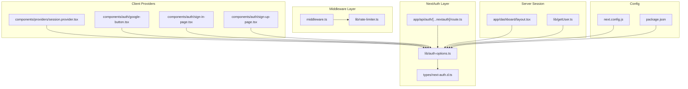
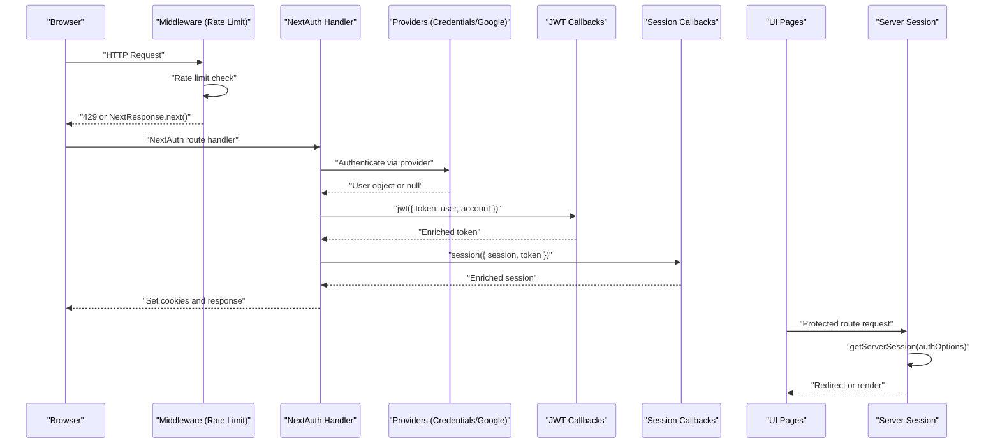
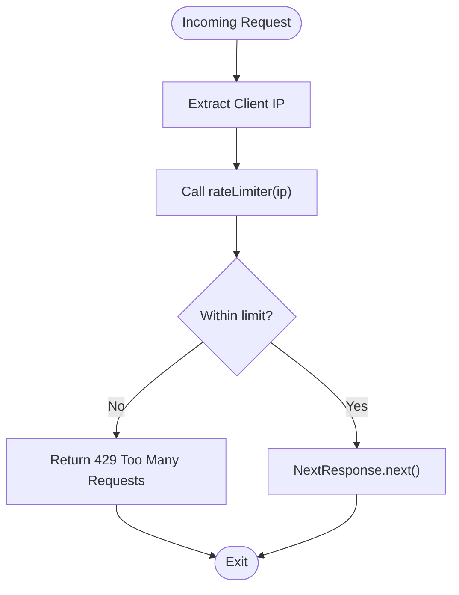
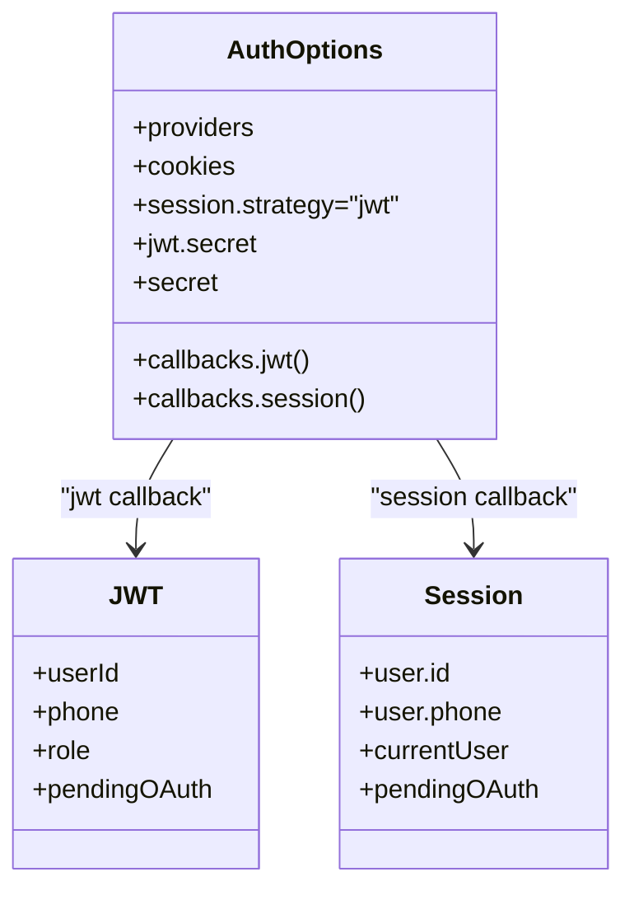
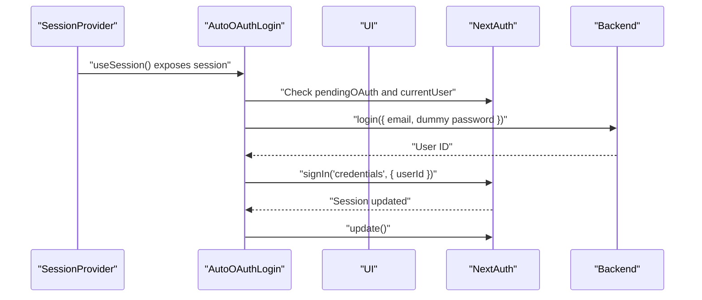
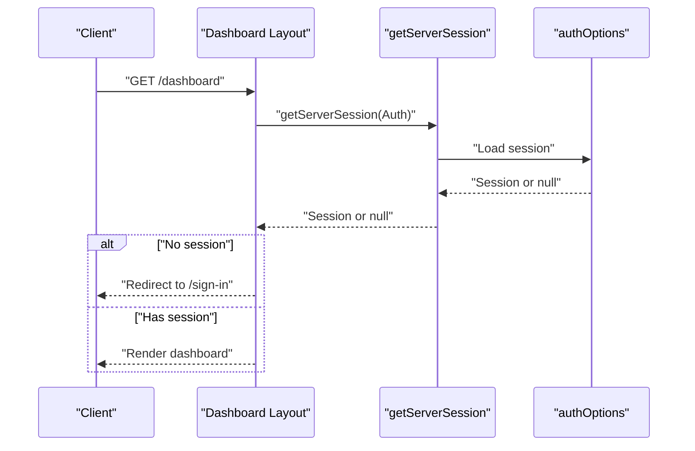
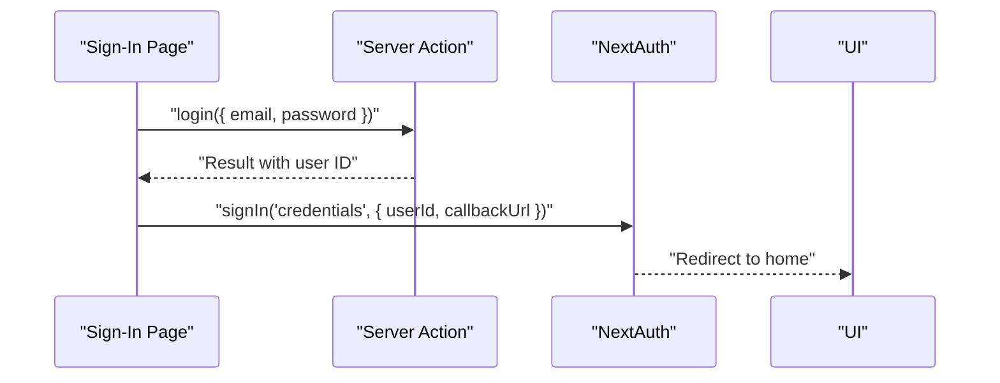
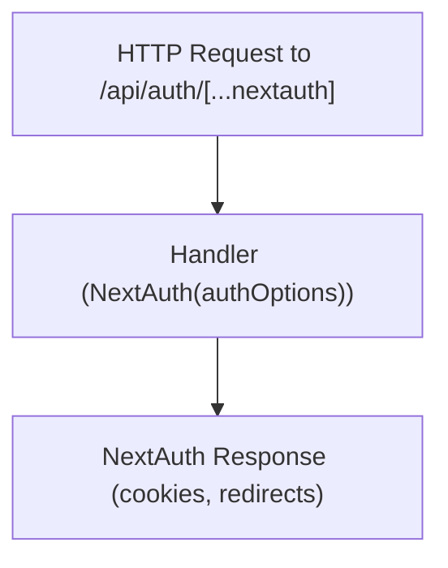
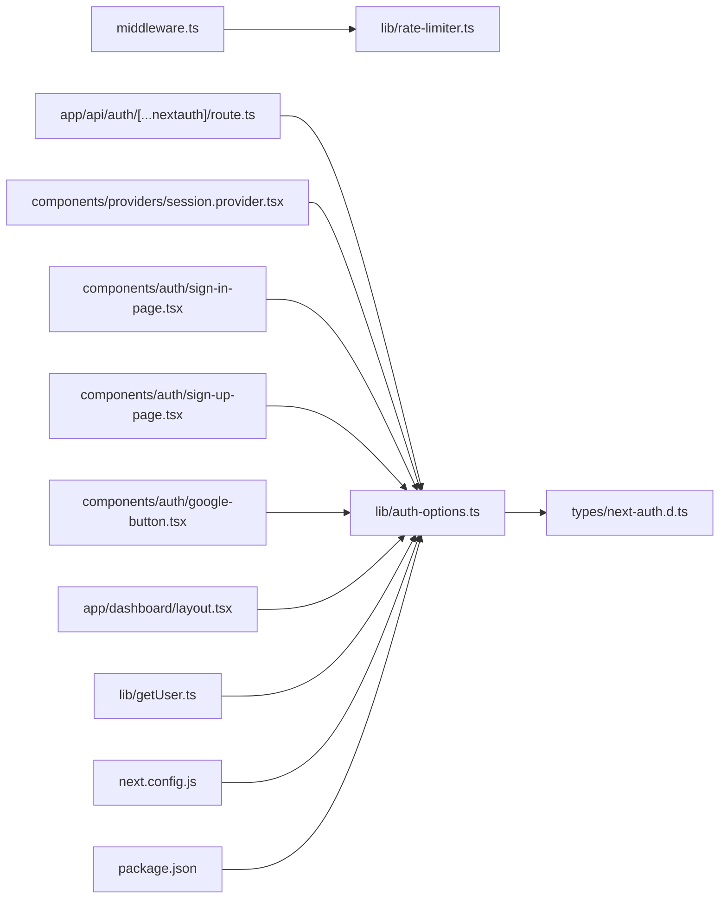

# Authentication Middleware

<cite>
**Referenced Files in This Document**
- [middleware.ts](file://middleware.ts)
- [auth-options.ts](file://lib/auth-options.ts)
- [next-auth.d.ts](file://types/next-auth.d.ts)
- [session.provider.tsx](file://components/providers/session.provider.tsx)
- [route.ts](file://app/api/auth/[...nextauth]/route.ts)
- [sign-in-page.tsx](file://components/auth/sign-in-page.tsx)
- [sign-up-page.tsx](file://components/auth/sign-up-page.tsx)
- [google-button.tsx](file://components/auth/google-button.tsx)
- [layout.tsx](file://app/dashboard/layout.tsx)
- [getUser.ts](file://lib/getUser.ts)
- [rate-limiter.ts](file://lib/rate-limiter.ts)
- [next.config.js](file://next.config.js)
- [package.json](file://package.json)
</cite>

## Table of Contents
1. [Introduction](#introduction)
2. [Project Structure](#project-structure)
3. [Core Components](#core-components)
4. [Architecture Overview](#architecture-overview)
5. [Detailed Component Analysis](#detailed-component-analysis)
6. [Dependency Analysis](#dependency-analysis)
7. [Performance Considerations](#performance-considerations)
8. [Troubleshooting Guide](#troubleshooting-guide)
9. [Conclusion](#conclusion)

## Introduction
This document explains the authentication middleware implementation and how it integrates with NextAuth to validate sessions, enforce protected routes, and maintain authentication state across requests. It covers the middleware execution flow for authenticated and unauthenticated requests, token validation via JWT callbacks, session enrichment, provider configuration, and practical guidance for debugging and performance optimization.

## Project Structure
The authentication system spans middleware, NextAuth configuration, client-side providers, UI pages, and server-side session retrieval utilities. The middleware applies rate limiting to all routes except static assets and internal Next.js paths. NextAuth handles providers, JWT/session callbacks, and cookie policies. Client-side providers manage auto-OAuth login transitions and session updates.

**Diagram sources**
- [middleware.ts:1-26](file://middleware.ts#L1-L26)
- [rate-limiter.ts:1-29](file://lib/rate-limiter.ts#L1-L29)
- [auth-options.ts:1-128](file://lib/auth-options.ts#L1-L128)
- [route.ts:1-6](file://app/api/auth/[...nextauth]/route.ts#L1-L6)
- [next-auth.d.ts:1-39](file://types/next-auth.d.ts#L1-L39)
- [session.provider.tsx:1-39](file://components/providers/session.provider.tsx#L1-L39)
- [google-button.tsx:1-60](file://components/auth/google-button.tsx#L1-L60)
- [sign-in-page.tsx:1-178](file://components/auth/sign-in-page.tsx#L1-L178)
- [sign-up-page.tsx:1-436](file://components/auth/sign-up-page.tsx#L1-L436)
- [layout.tsx:1-45](file://app/dashboard/layout.tsx#L1-L45)
- [getUser.ts:1-10](file://lib/getUser.ts#L1-L10)
- [next.config.js:1-34](file://next.config.js#L1-L34)
- [package.json:1-67](file://package.json#L1-L67)

**Section sources**
- [middleware.ts:1-26](file://middleware.ts#L1-L26)
- [auth-options.ts:1-128](file://lib/auth-options.ts#L1-L128)
- [route.ts:1-6](file://app/api/auth/[...nextauth]/route.ts#L1-L6)
- [next-auth.d.ts:1-39](file://types/next-auth.d.ts#L1-L39)
- [session.provider.tsx:1-39](file://components/providers/session.provider.tsx#L1-L39)
- [google-button.tsx:1-60](file://components/auth/google-button.tsx#L1-L60)
- [sign-in-page.tsx:1-178](file://components/auth/sign-in-page.tsx#L1-L178)
- [sign-up-page.tsx:1-436](file://components/auth/sign-up-page.tsx#L1-L436)
- [layout.tsx:1-45](file://app/dashboard/layout.tsx#L1-L45)
- [getUser.ts:1-10](file://lib/getUser.ts#L1-L10)
- [rate-limiter.ts:1-29](file://lib/rate-limiter.ts#L1-L29)
- [next.config.js:1-34](file://next.config.js#L1-L34)
- [package.json:1-67](file://package.json#L1-L67)

## Core Components
- Middleware: Applies rate limiting to incoming requests and forwards them to the application. It does not enforce authentication itself; authentication enforcement occurs at the route level.
- NextAuth configuration: Defines providers (credentials and Google), cookie policies, JWT/session callbacks, and session strategy.
- Client session provider: Wraps the app with NextAuth’s provider and orchestrates automatic OAuth-to-credentials transition.
- UI pages: Provide sign-in and sign-up flows with OTP support and Google OAuth integration.
- Server session retrieval: Demonstrates server-side session access for protected routes.
- Rate limiter: Tracks per-IP request counts within a sliding window.

**Section sources**
- [middleware.ts:9-20](file://middleware.ts#L9-L20)
- [auth-options.ts:8-127](file://lib/auth-options.ts#L8-L127)
- [session.provider.tsx:31-38](file://components/providers/session.provider.tsx#L31-L38)
- [sign-in-page.tsx:39-52](file://components/auth/sign-in-page.tsx#L39-L52)
- [sign-up-page.tsx:48-103](file://components/auth/sign-up-page.tsx#L48-L103)
- [layout.tsx:11-14](file://app/dashboard/layout.tsx#L11-L14)
- [rate-limiter.ts:9-28](file://lib/rate-limiter.ts#L9-L28)

## Architecture Overview
The authentication pipeline combines middleware-level rate limiting with NextAuth for session management and provider-based authentication. The client provider auto-completes OAuth onboarding by transitioning to credentials after verifying the user. Server-side layouts protect routes by checking sessions.

**Diagram sources**
- [middleware.ts:9-20](file://middleware.ts#L9-L20)
- [route.ts:1-6](file://app/api/auth/[...nextauth]/route.ts#L1-L6)
- [auth-options.ts:69-122](file://lib/auth-options.ts#L69-L122)
- [session.provider.tsx:7-27](file://components/providers/session.provider.tsx#L7-L27)
- [layout.tsx:11-14](file://app/dashboard/layout.tsx#L11-L14)

## Detailed Component Analysis

### Middleware Execution Flow
- Purpose: Apply rate limiting to incoming requests and allow normal processing otherwise.
- Behavior:
  - Extracts client IP from headers.
  - Enforces rate limit per IP within a sliding window.
  - Returns a 429 response if exceeded; otherwise proceeds.
- Protected routes: Not enforced here; use server-side session checks in protected pages.

**Diagram sources**
- [middleware.ts:4-20](file://middleware.ts#L4-L20)
- [rate-limiter.ts:9-28](file://lib/rate-limiter.ts#L9-L28)

**Section sources**
- [middleware.ts:9-20](file://middleware.ts#L9-L20)
- [rate-limiter.ts:9-28](file://lib/rate-limiter.ts#L9-L28)

### NextAuth Configuration and Token Validation
- Providers:
  - Credentials provider fetches user data from a backend endpoint and maps it to a NextAuth user object.
  - Google provider configured with environment variables.
- Cookie policy: Hardened cookie names and attributes for security.
- Callbacks:
  - JWT callback enriches the token with user identifiers and temporary OAuth metadata.
  - Session callback enriches the session with full user profile and fallback fields.
- Strategy: JWT-based session with secrets configured from environment variables.

**Diagram sources**
- [auth-options.ts:8-127](file://lib/auth-options.ts#L8-L127)
- [next-auth.d.ts:4-38](file://types/next-auth.d.ts#L4-L38)

**Section sources**
- [auth-options.ts:8-127](file://lib/auth-options.ts#L8-L127)
- [next-auth.d.ts:4-38](file://types/next-auth.d.ts#L4-L38)

### Client Session Provider and Auto-OAuth Login
- Purpose: Wrap the app with NextAuth provider and automatically convert pending OAuth sessions to credentials after verifying the user.
- Flow:
  - On session change, if pending OAuth exists and no current user, trigger a login action.
  - On successful login, sign in with credentials and update the session.

**Diagram sources**
- [session.provider.tsx:7-27](file://components/providers/session.provider.tsx#L7-L27)
- [sign-in-page.tsx:48-51](file://components/auth/sign-in-page.tsx#L48-L51)

**Section sources**
- [session.provider.tsx:7-27](file://components/providers/session.provider.tsx#L7-L27)
- [sign-in-page.tsx:48-51](file://components/auth/sign-in-page.tsx#L48-L51)

### Protected Route Enforcement (Server-Side)
- Dashboard layout demonstrates server-side session enforcement:
  - Retrieves session via getServerSession with authOptions.
  - Redirects to sign-in if no session is present.
- This pattern ensures protected routes are enforced consistently server-side.

**Diagram sources**
- [layout.tsx:11-14](file://app/dashboard/layout.tsx#L11-L14)
- [auth-options.ts:124-127](file://lib/auth-options.ts#L124-L127)

**Section sources**
- [layout.tsx:11-14](file://app/dashboard/layout.tsx#L11-L14)
- [getUser.ts:4-7](file://lib/getUser.ts#L4-L7)

### Authentication UI Flows
- Sign-in page:
  - Uses a server action to authenticate and then triggers NextAuth credentials sign-in with a user ID.
  - Redirects to home on success.
- Sign-up page:
  - Implements OTP flow (send/verify) and registers the user.
  - On success, triggers credentials sign-in with the new user ID.
- Google button:
  - Initiates OAuth with provider-specific callback URLs depending on the route.

**Diagram sources**
- [sign-in-page.tsx:39-52](file://components/auth/sign-in-page.tsx#L39-L52)
- [auth.action.ts:13-18](file://actions/auth.action.ts#L13-L18)

**Section sources**
- [sign-in-page.tsx:39-52](file://components/auth/sign-in-page.tsx#L39-L52)
- [sign-up-page.tsx:48-103](file://components/auth/sign-up-page.tsx#L48-L103)
- [google-button.tsx:17-21](file://components/auth/google-button.tsx#L17-L21)
- [auth.action.ts:13-18](file://actions/auth.action.ts#L13-L18)

### NextAuth API Route Integration
- The NextAuth handler is mounted under the dynamic route app/api/auth/[...nextauth]/route.ts.
- Exposes GET and POST handlers for NextAuth.

**Diagram sources**
- [route.ts:1-6](file://app/api/auth/[...nextauth]/route.ts#L1-L6)
- [auth-options.ts:124-127](file://lib/auth-options.ts#L124-L127)

**Section sources**
- [route.ts:1-6](file://app/api/auth/[...nextauth]/route.ts#L1-L6)
- [auth-options.ts:124-127](file://lib/auth-options.ts#L124-L127)

## Dependency Analysis
- Middleware depends on a local rate limiter implementation.
- NextAuth configuration depends on environment variables for secrets and provider credentials.
- Client provider depends on NextAuth hooks and server actions.
- Protected routes depend on getServerSession and authOptions.
- Next config adds cache-control headers for API routes.

**Diagram sources**
- [middleware.ts:1-26](file://middleware.ts#L1-L26)
- [rate-limiter.ts:1-29](file://lib/rate-limiter.ts#L1-L29)
- [auth-options.ts:1-128](file://lib/auth-options.ts#L1-L128)
- [next-auth.d.ts:1-39](file://types/next-auth.d.ts#L1-L39)
- [route.ts:1-6](file://app/api/auth/[...nextauth]/route.ts#L1-L6)
- [session.provider.tsx:1-39](file://components/providers/session.provider.tsx#L1-L39)
- [sign-in-page.tsx:1-178](file://components/auth/sign-in-page.tsx#L1-L178)
- [sign-up-page.tsx:1-436](file://components/auth/sign-up-page.tsx#L1-L436)
- [google-button.tsx:1-60](file://components/auth/google-button.tsx#L1-L60)
- [layout.tsx:1-45](file://app/dashboard/layout.tsx#L1-L45)
- [getUser.ts:1-10](file://lib/getUser.ts#L1-L10)
- [next.config.js:1-34](file://next.config.js#L1-L34)
- [package.json:1-67](file://package.json#L1-L67)

**Section sources**
- [middleware.ts:1-26](file://middleware.ts#L1-L26)
- [auth-options.ts:1-128](file://lib/auth-options.ts#L1-L128)
- [route.ts:1-6](file://app/api/auth/[...nextauth]/route.ts#L1-L6)
- [session.provider.tsx:1-39](file://components/providers/session.provider.tsx#L1-L39)
- [sign-in-page.tsx:1-178](file://components/auth/sign-in-page.tsx#L1-L178)
- [sign-up-page.tsx:1-436](file://components/auth/sign-up-page.tsx#L1-L436)
- [google-button.tsx:1-60](file://components/auth/google-button.tsx#L1-L60)
- [layout.tsx:1-45](file://app/dashboard/layout.tsx#L1-L45)
- [getUser.ts:1-10](file://lib/getUser.ts#L1-L10)
- [rate-limiter.ts:1-29](file://lib/rate-limiter.ts#L1-L29)
- [next.config.js:1-34](file://next.config.js#L1-L34)
- [package.json:1-67](file://package.json#L1-L67)

## Performance Considerations
- Middleware rate limiting:
  - Sliding window with a fixed number of requests per minute reduces abuse without blocking legitimate traffic.
  - Consider external rate limiting for production-scale deployments.
- NextAuth JWT/session callbacks:
  - Minimize network calls inside callbacks; cache where appropriate.
  - Keep token payload minimal; avoid heavy computations.
- Client provider:
  - Avoid unnecessary re-renders by guarding effects with proper dependency arrays.
- Server-side session retrieval:
  - Use getServerSession judiciously; avoid redundant calls in the same request lifecycle.
- Caching:
  - Next config disables caching for auth and API routes; ensure this remains aligned with your deployment needs.

[No sources needed since this section provides general guidance]

## Troubleshooting Guide
- Environment variables missing:
  - Ensure NEXT_PUBLIC_JWT_SECRET, NEXT_AUTH_SECRET, GOOGLE_CLIENT_ID, and GOOGLE_CLIENT_SECRET are set.
- Session not persisting:
  - Verify cookie attributes (HttpOnly, Secure, SameSite) and domain/path alignment.
- OAuth callback mismatch:
  - Confirm callback URLs in Google OAuth match application routes.
- Rate limiting errors:
  - Review middleware matcher and rate limiter thresholds; adjust for expected traffic.
- Protected route redirects loop:
  - Check getServerSession usage and ensure authOptions are consistent across server/client.

**Section sources**
- [auth-options.ts:46-67](file://lib/auth-options.ts#L46-L67)
- [route.ts:1-6](file://app/api/auth/[...nextauth]/route.ts#L1-L6)
- [middleware.ts:23-25](file://middleware.ts#L23-L25)
- [layout.tsx:11-14](file://app/dashboard/layout.tsx#L11-L14)
- [next.config.js:20-31](file://next.config.js#L20-L31)

## Conclusion
The authentication system leverages a lightweight middleware for rate limiting and NextAuth for robust session management, provider integration, and cookie security. Protected routes are enforced server-side using getServerSession, while client-side providers streamline OAuth-to-credentials transitions. Proper configuration of environment variables, cookie policies, and callback logic ensures reliable authentication across the application.