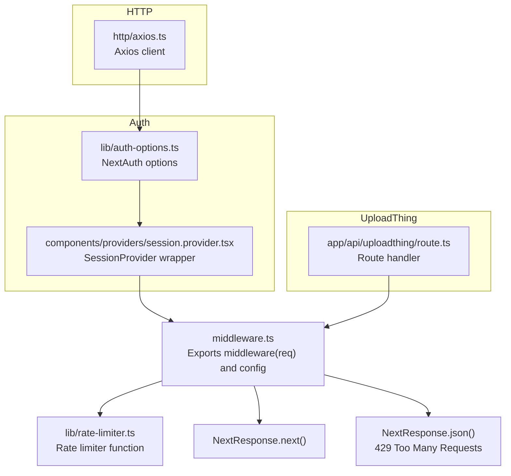
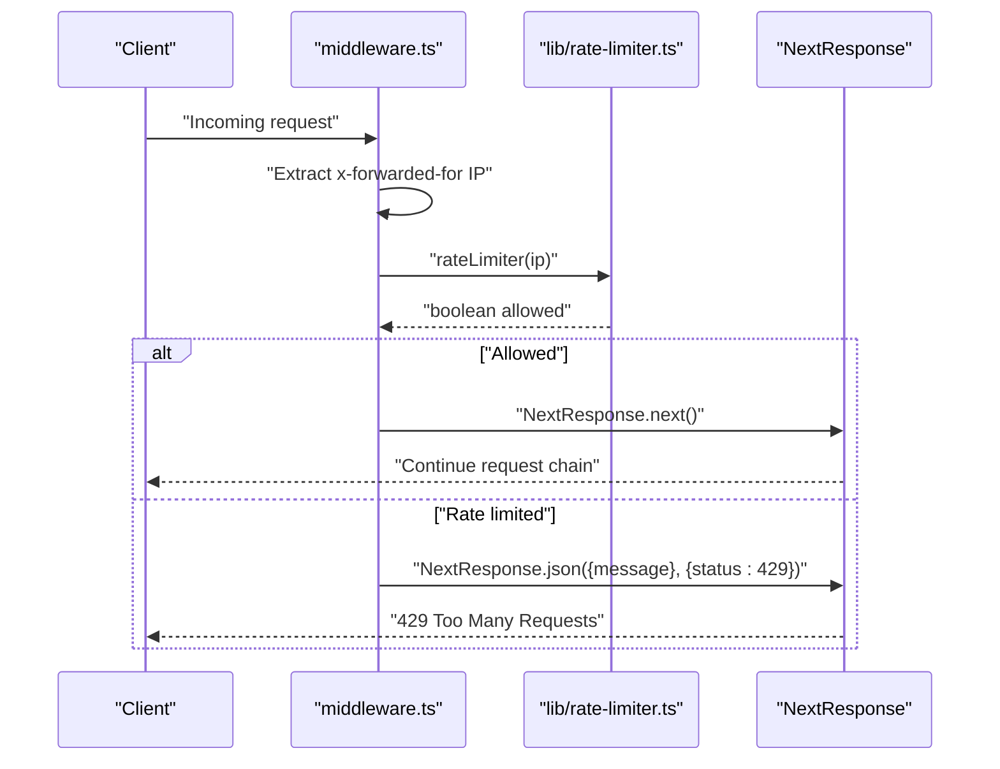
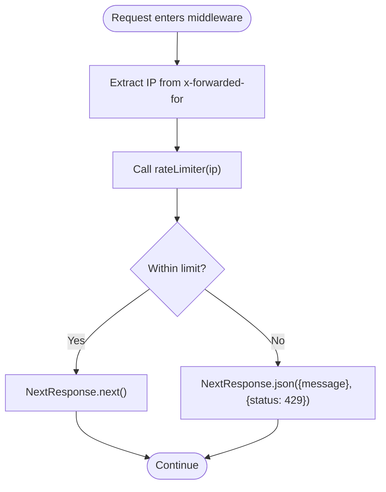
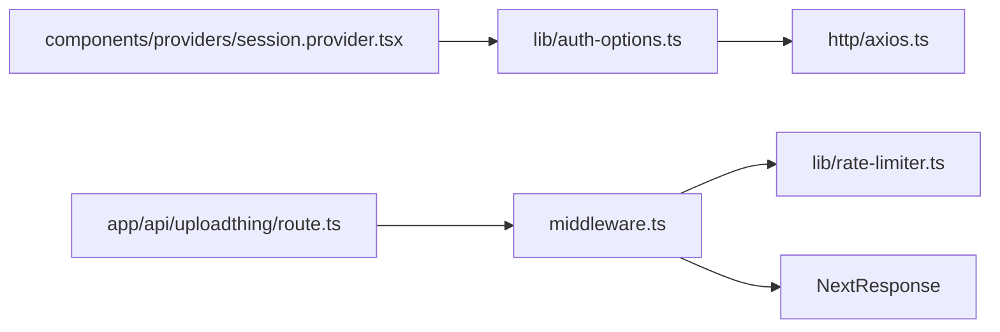

# Middleware Configuration

<cite>
**Referenced Files in This Document**
- [middleware.ts](file://middleware.ts)
- [rate-limiter.ts](file://lib/rate-limiter.ts)
- [auth-options.ts](file://lib/auth-options.ts)
- [session.provider.tsx](file://components/providers/session.provider.tsx)
- [next.config.js](file://next.config.js)
- [axios.ts](file://http/axios.ts)
- [route.ts](file://app/api/uploadthing/route.ts)
</cite>

## Table of Contents
1. [Introduction](#introduction)
2. [Project Structure](#project-structure)
3. [Core Components](#core-components)
4. [Architecture Overview](#architecture-overview)
5. [Detailed Component Analysis](#detailed-component-analysis)
6. [Dependency Analysis](#dependency-analysis)
7. [Performance Considerations](#performance-considerations)
8. [Troubleshooting Guide](#troubleshooting-guide)
9. [Conclusion](#conclusion)
10. [Appendices](#appendices)

## Introduction
This document explains middleware configuration and customization in Optim Bozor. It focuses on the exported middleware function, the configuration object, matcher patterns, and the request/response transformation pipeline. It also covers environment-specific configuration, execution order and priority, custom middleware examples, performance optimization, debugging, troubleshooting, and testing strategies.

## Project Structure
Optim Bozor uses Next.js middleware to enforce rate limiting and control routing. The middleware integrates with a local in-memory rate limiter and applies environment-aware cookie and header policies. Authentication relies on NextAuth.js with environment-specific cookie settings and session handling via a provider wrapper.

**Diagram sources**
- [middleware.ts:1-26](file://middleware.ts#L1-L26)
- [rate-limiter.ts:1-29](file://lib/rate-limiter.ts#L1-L29)
- [auth-options.ts:1-128](file://lib/auth-options.ts#L1-L128)
- [session.provider.tsx:1-39](file://components/providers/session.provider.tsx#L1-L39)
- [axios.ts:1-10](file://http/axios.ts#L1-L10)
- [route.ts:1-7](file://app/api/uploadthing/route.ts#L1-L7)

**Section sources**
- [middleware.ts:1-26](file://middleware.ts#L1-L26)
- [rate-limiter.ts:1-29](file://lib/rate-limiter.ts#L1-L29)
- [auth-options.ts:1-128](file://lib/auth-options.ts#L1-L128)
- [session.provider.tsx:1-39](file://components/providers/session.provider.tsx#L1-L39)
- [next.config.js:1-35](file://next.config.js#L1-L35)
- [axios.ts:1-10](file://http/axios.ts#L1-L10)
- [route.ts:1-7](file://app/api/uploadthing/route.ts#L1-L7)

## Core Components
- Middleware entrypoint and export structure:
  - Exported function receives a NextRequest and returns NextResponse or a JSON response with a 429 status when rate-limited.
  - Exported config object defines matcher patterns that control when middleware runs.
- Rate limiter:
  - Tracks per-IP request counts within a fixed time window and enforces a maximum threshold.
- Environment-specific configuration:
  - NextAuth cookie settings vary by environment (development vs production).
  - Next.js headers configuration sets cache-control policies for API routes.
- UploadThing integration:
  - Route handler delegates to UploadThing’s adapter.

**Section sources**
- [middleware.ts:9-25](file://middleware.ts#L9-L25)
- [rate-limiter.ts:9-28](file://lib/rate-limiter.ts#L9-L28)
- [auth-options.ts:46-67](file://lib/auth-options.ts#L46-L67)
- [next.config.js:20-31](file://next.config.js#L20-L31)
- [route.ts:1-7](file://app/api/uploadthing/route.ts#L1-L7)

## Architecture Overview
The middleware pipeline intercepts incoming requests, extracts the client IP, checks the rate limiter, and either blocks the request with a 429 response or continues the request chain. The matcher configuration ensures middleware runs on non-static paths and API/trpc routes. Authentication and session management are handled separately via NextAuth options and a provider wrapper.

**Diagram sources**
- [middleware.ts:4-20](file://middleware.ts#L4-L20)
- [rate-limiter.ts:9-28](file://lib/rate-limiter.ts#L9-L28)

## Detailed Component Analysis

### Middleware Export Structure
- Main middleware function:
  - Accepts a NextRequest and returns NextResponse.
  - Extracts the client IP from the x-forwarded-for header and trims whitespace.
  - Calls the rate limiter; if denied, returns a JSON body with a 429 status.
  - Otherwise, proceeds with NextResponse.next().
- Config object:
  - Defines matcher patterns to include non-API pages, root path, and API/trpc routes.
  - Ensures middleware runs on dynamic routes and API endpoints while excluding static assets and internal Next.js paths.

**Section sources**
- [middleware.ts:9-25](file://middleware.ts#L9-L25)

### Request/Response Transformation Pipeline
- Interception:
  - Middleware inspects the request headers to determine client IP.
- Decision:
  - The rate limiter filters old timestamps outside the current window, appends the current timestamp, and compares against the maximum allowed count.
- Outcome:
  - Allowed requests continue; otherwise, a structured JSON response with 429 is returned.

**Diagram sources**
- [middleware.ts:4-20](file://middleware.ts#L4-L20)
- [rate-limiter.ts:9-28](file://lib/rate-limiter.ts#L9-L28)

**Section sources**
- [middleware.ts:9-20](file://middleware.ts#L9-L20)
- [rate-limiter.ts:9-28](file://lib/rate-limiter.ts#L9-L28)

### Configuration Options by Environment
- Development vs production:
  - NextAuth cookie options adjust secure flags and cookie names based on NODE_ENV.
  - Next.js headers set Cache-Control: no-store for API and auth APIs to prevent caching.
- Rate limiting:
  - The current implementation uses an in-memory map and fixed window/limit values. These can be externalized to environment variables for per-environment tuning.

**Section sources**
- [auth-options.ts:46-67](file://lib/auth-options.ts#L46-L67)
- [next.config.js:20-31](file://next.config.js#L20-L31)
- [rate-limiter.ts:6-7](file://lib/rate-limiter.ts#L6-L7)

### Middleware Execution Order and Priority
- Matcher-driven order:
  - The matcher array determines when middleware executes. Routes matching the patterns are processed by the middleware before proceeding to the next handler.
- Priority:
  - Within the same request lifecycle, middleware runs in the order defined by the matcher. Place global protections early to fail fast.

**Section sources**
- [middleware.ts:23-25](file://middleware.ts#L23-L25)

### Custom Middleware Implementation Examples
- Extending the existing middleware:
  - Add pre-checks (e.g., UA inspection, country-based throttling) before invoking the rate limiter.
  - Integrate with a distributed cache (e.g., Redis) to persist rate-limit counters across instances.
- Integrating third-party middleware:
  - Use a library-compatible adapter pattern to wrap external middleware functions and return NextResponse objects.
  - Ensure the adapter respects the matcher configuration and preserves the request/response semantics.

[No sources needed since this section provides conceptual guidance]

### Security Header Adjustments
- Cache-control headers:
  - API and auth API routes are configured to send Cache-Control: no-store to prevent caching of sensitive responses.
- Cookie security:
  - Environment-specific cookie flags (secure, httpOnly, sameSite) improve protection in production.

**Section sources**
- [next.config.js:20-31](file://next.config.js#L20-L31)
- [auth-options.ts:46-67](file://lib/auth-options.ts#L46-L67)

### UploadThing Integration
- The UploadThing route handler delegates to the framework adapter and is invoked alongside the middleware pipeline.
- Ensure UploadThing endpoints are included in the matcher if custom logic is needed.

**Section sources**
- [route.ts:1-7](file://app/api/uploadthing/route.ts#L1-L7)
- [middleware.ts:23-25](file://middleware.ts#L23-L25)

## Dependency Analysis
The middleware depends on the rate limiter module and Next.js response utilities. Authentication and session management are decoupled but can influence middleware behavior indirectly (e.g., authenticated requests may bypass certain checks). UploadThing integration is independent but shares the same request lifecycle.

**Diagram sources**
- [middleware.ts:1-26](file://middleware.ts#L1-L26)
- [rate-limiter.ts:1-29](file://lib/rate-limiter.ts#L1-L29)
- [session.provider.tsx:1-39](file://components/providers/session.provider.tsx#L1-L39)
- [auth-options.ts:1-128](file://lib/auth-options.ts#L1-L128)
- [axios.ts:1-10](file://http/axios.ts#L1-L10)
- [route.ts:1-7](file://app/api/uploadthing/route.ts#L1-L7)

**Section sources**
- [middleware.ts:1-26](file://middleware.ts#L1-L26)
- [rate-limiter.ts:1-29](file://lib/rate-limiter.ts#L1-L29)
- [session.provider.tsx:1-39](file://components/providers/session.provider.tsx#L1-L39)
- [auth-options.ts:1-128](file://lib/auth-options.ts#L1-L128)
- [axios.ts:1-10](file://http/axios.ts#L1-L10)
- [route.ts:1-7](file://app/api/uploadthing/route.ts#L1-L7)

## Performance Considerations
- In-memory rate limiter:
  - Suitable for single-instance deployments. For multi-instance setups, migrate counters to a distributed store to avoid inconsistent limits.
- Window and threshold sizing:
  - Tune the time window and maximum requests per window according to traffic patterns and infrastructure capacity.
- Middleware overhead:
  - Keep middleware logic minimal; avoid heavy synchronous operations inside the request path.
- Caching and headers:
  - Use cache-control headers for non-sensitive API responses to reduce load, while ensuring sensitive endpoints remain uncached.

[No sources needed since this section provides general guidance]

## Troubleshooting Guide
- Symptom: Unexpected 429 responses
  - Verify the x-forwarded-for header is present and correctly formatted behind proxies.
  - Confirm the rate limiter window and threshold values align with expectations.
- Symptom: Middleware not applying to expected routes
  - Review the matcher patterns to ensure they include the intended paths.
- Symptom: Authentication cookies not secure in production
  - Check environment variables and cookie option configuration for production mode.
- Debugging tips:
  - Log the extracted IP and rate limiter decisions at development.
  - Temporarily disable rate limiting to isolate issues.

**Section sources**
- [middleware.ts:4-20](file://middleware.ts#L4-L20)
- [rate-limiter.ts:9-28](file://lib/rate-limiter.ts#L9-L28)
- [auth-options.ts:46-67](file://lib/auth-options.ts#L46-L67)

## Conclusion
Optim Bozor’s middleware provides a focused, extensible foundation for request interception and rate limiting. By leveraging the exported function and config object, teams can tailor behavior per environment, integrate third-party protections, and maintain robust performance and security through careful configuration and testing.

[No sources needed since this section summarizes without analyzing specific files]

## Appendices

### Testing and Validation Strategies
- Unit tests for rate limiter:
  - Simulate bursts within and exceeding the threshold to validate enforcement.
- Integration tests:
  - Verify middleware behavior across matcher patterns and endpoint types.
- Load tests:
  - Assess rate limiter under realistic traffic to tune thresholds and windows.
- Smoke tests:
  - Confirm environment-specific cookie and header configurations in development and production.

[No sources needed since this section provides general guidance]