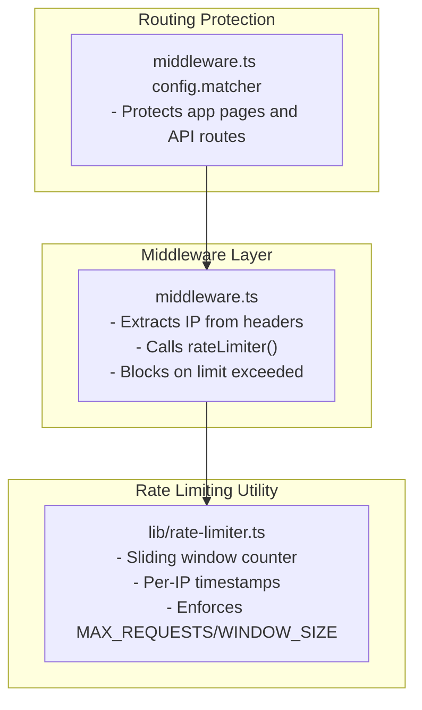
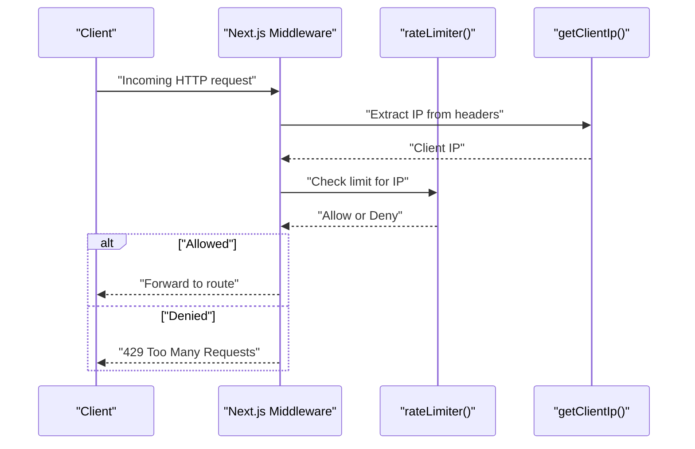
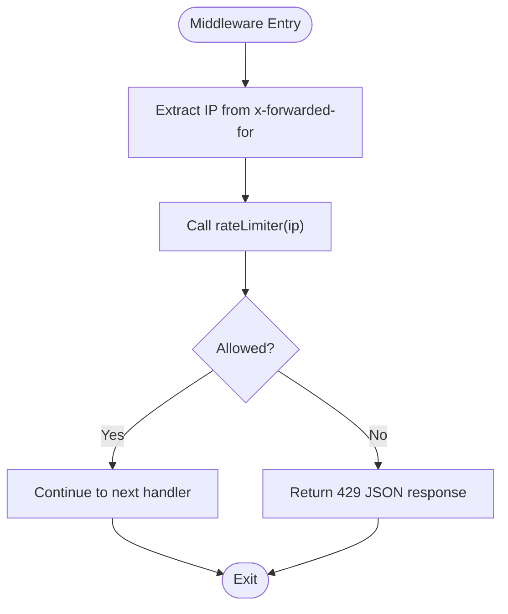
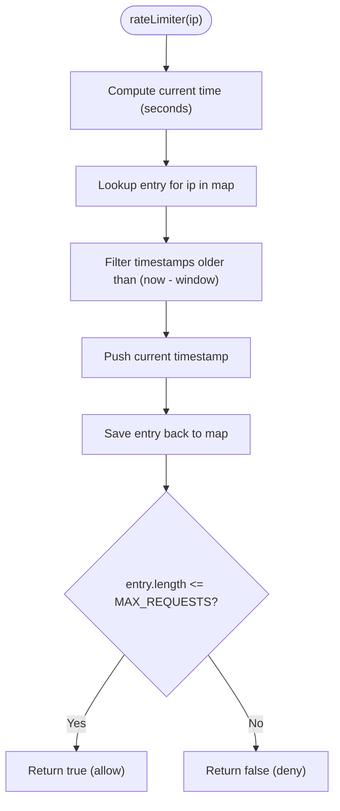
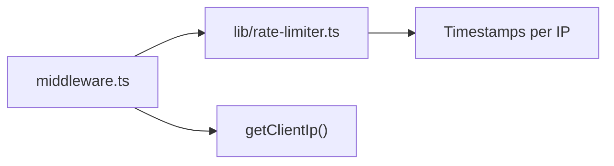

# Request Rate Limiting

<cite>
**Referenced Files in This Document**
- [middleware.ts](file://middleware.ts)
- [rate-limiter.ts](file://lib/rate-limiter.ts)
- [next.config.js](file://next.config.js)
</cite>

## Table of Contents
1. [Introduction](#introduction)
2. [Project Structure](#project-structure)
3. [Core Components](#core-components)
4. [Architecture Overview](#architecture-overview)
5. [Detailed Component Analysis](#detailed-component-analysis)
6. [Dependency Analysis](#dependency-analysis)
7. [Performance Considerations](#performance-considerations)
8. [Troubleshooting Guide](#troubleshooting-guide)
9. [Conclusion](#conclusion)

## Introduction
This document explains the request rate limiting implementation in Optim Bozor. The system is middleware-based and uses IP-based throttling to prevent abuse and DDoS-like traffic spikes. It leverages a simple in-memory sliding-window counter per IP address and applies protection to specific routes via a matcher pattern. The implementation also includes a helper to extract client IPs from x-forwarded-for headers for environments behind proxies and load balancers.

## Project Structure
The rate limiting logic is implemented in two primary locations:
- Middleware: Applies rate limiting to incoming requests and defines which routes are protected.
- Rate limiter utility: Implements the sliding-window counting mechanism and enforces limits.

**Diagram sources**
- [middleware.ts:1-26](file://middleware.ts#L1-L26)
- [rate-limiter.ts:1-29](file://lib/rate-limiter.ts#L1-L29)

**Section sources**
- [middleware.ts:1-26](file://middleware.ts#L1-L26)
- [rate-limiter.ts:1-29](file://lib/rate-limiter.ts#L1-L29)

## Core Components
- Middleware: Intercepts requests, extracts the client IP from x-forwarded-for, checks the rate limiter, and either blocks the request with a 429 response or forwards it.
- Rate limiter: Maintains a per-IP map of timestamps within a fixed time window and compares the count against a configured maximum.

Key behaviors:
- IP extraction: Uses the first IP from the x-forwarded-for header when present; falls back to a placeholder if absent.
- Sliding window: Filters old timestamps outside the current window and appends the current timestamp.
- Enforcement: Returns false when the request count exceeds the threshold, causing the middleware to reject the request.

**Section sources**
- [middleware.ts:4-20](file://middleware.ts#L4-L20)
- [rate-limiter.ts:9-28](file://lib/rate-limiter.ts#L9-L28)

## Architecture Overview
The rate limiting pipeline runs during the Next.js middleware phase. Requests are matched by the matcher pattern, the client IP is extracted, and the sliding-window counter is consulted. If the limit is exceeded, the request is rejected with a JSON body and 429 status.

**Diagram sources**
- [middleware.ts:9-20](file://middleware.ts#L9-L20)
- [rate-limiter.ts:9-28](file://lib/rate-limiter.ts#L9-L28)

## Detailed Component Analysis

### Middleware: IP Extraction and Enforcement
- IP extraction: Reads the x-forwarded-for header and takes the first IP in the comma-separated list, trimming whitespace. Falls back to a placeholder if the header is missing.
- Enforcement: Calls the rate limiter with the resolved IP. On failure, responds with a JSON body and 429 status; otherwise, continues to the next middleware or route.

**Diagram sources**
- [middleware.ts:4-20](file://middleware.ts#L4-L20)

**Section sources**
- [middleware.ts:4-20](file://middleware.ts#L4-L20)

### Rate Limiter: Sliding Window Counter
- Data structure: A map keyed by IP storing an array of timestamps within the current window.
- Window and threshold: A fixed window size and a maximum number of requests per window are defined.
- Algorithm:
  - Filter timestamps older than the current window.
  - Append the current timestamp.
  - Compare the resulting count to the maximum and decide whether to allow the request.

**Diagram sources**
- [rate-limiter.ts:9-28](file://lib/rate-limiter.ts#L9-L28)

**Section sources**
- [rate-limiter.ts:1-29](file://lib/rate-limiter.ts#L1-L29)

### Middleware Matcher Patterns
The middleware protects:
- App pages (non-static assets and Next.js internals).
- Root path "/".
- API/trpc routes.

These patterns ensure that rate limiting applies broadly to dynamic routes and API endpoints while avoiding static assets.

**Section sources**
- [middleware.ts:23-25](file://middleware.ts#L23-L25)

## Dependency Analysis
- Middleware depends on the rate limiter utility to enforce limits.
- The rate limiter utility is self-contained and does not depend on external modules.
- The middleware’s IP extraction relies on the presence of the x-forwarded-for header, commonly set by proxies/load balancers.

**Diagram sources**
- [middleware.ts:1-26](file://middleware.ts#L1-L26)
- [rate-limiter.ts:1-29](file://lib/rate-limiter.ts#L1-L29)

**Section sources**
- [middleware.ts:1-26](file://middleware.ts#L1-L26)
- [rate-limiter.ts:1-29](file://lib/rate-limiter.ts#L1-L29)

## Performance Considerations
- Memory footprint: The limiter stores an array of timestamps per IP. With high concurrency and many distinct IPs, memory usage grows linearly with active clients within the window.
- Complexity: Filtering timestamps is O(n) where n is the number of stored timestamps for an IP. This is efficient for moderate loads but can become a bottleneck under very high RPS.
- Scalability: The in-memory map is local to the process. In multi-instance deployments, each instance maintains its own counters, potentially allowing bursts across instances. Consider a distributed store (e.g., Redis) for production-scale systems.
- Header parsing: Splitting and trimming x-forwarded-for is lightweight but should still be considered in hot paths.

[No sources needed since this section provides general guidance]

## Troubleshooting Guide
Common issues and resolutions:
- Unexpected 429 responses:
  - Verify that the x-forwarded-for header is being set by your proxy/load balancer. Without it, the middleware may fall back to a placeholder IP, causing shared limits across clients.
  - Confirm that the matcher patterns match the intended routes. Routes not matched by the middleware will not be rate-limited.
- Misconfigured thresholds:
  - The current window size and maximum requests are defined in the limiter utility. Adjust these values to tune sensitivity for your workload.
- Multi-instance deployments:
  - In-memory counters are not shared across instances. If clients hit different instances, bursts may temporarily exceed the per-instance limit. Consider integrating a shared storage backend for consistent enforcement.

**Section sources**
- [middleware.ts:4-25](file://middleware.ts#L4-L25)
- [rate-limiter.ts:5-8](file://lib/rate-limiter.ts#L5-L8)

## Conclusion
Optim Bozor’s rate limiting is a lightweight, middleware-driven solution using an in-memory sliding-window counter keyed by IP. It protects app pages and API routes via matcher patterns and extracts client IPs from x-forwarded-for headers. While suitable for small to medium workloads, consider scaling to a distributed store for multi-instance deployments and high-traffic scenarios.