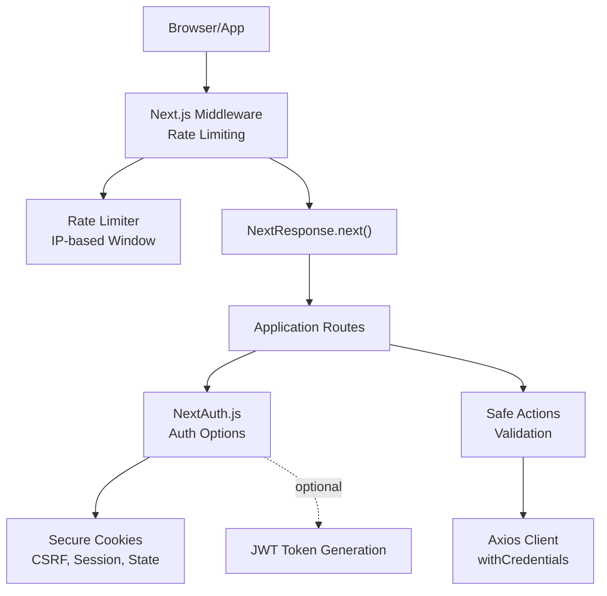
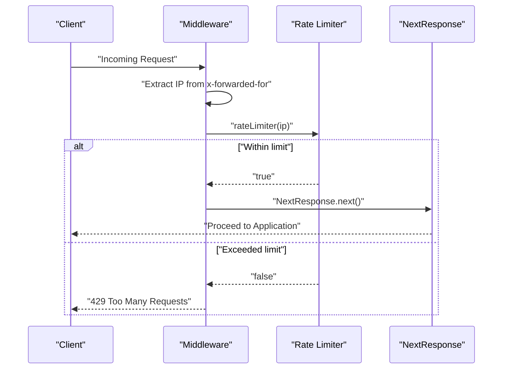
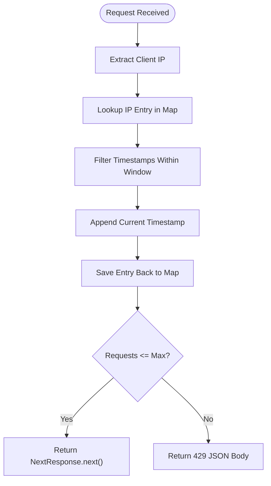
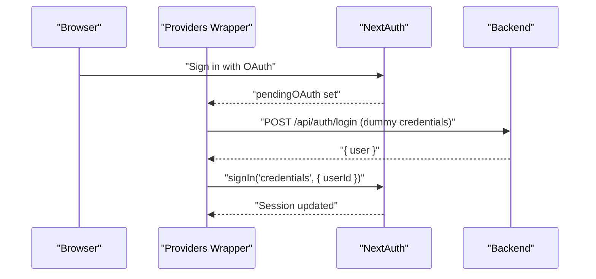
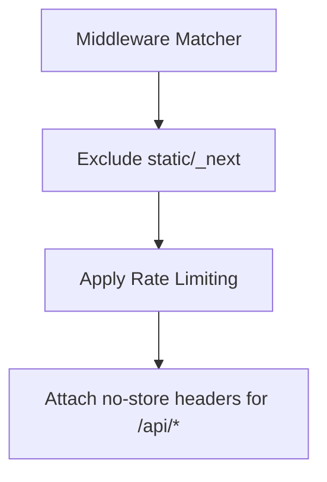
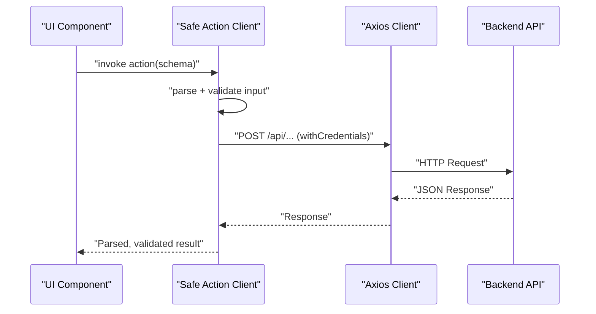
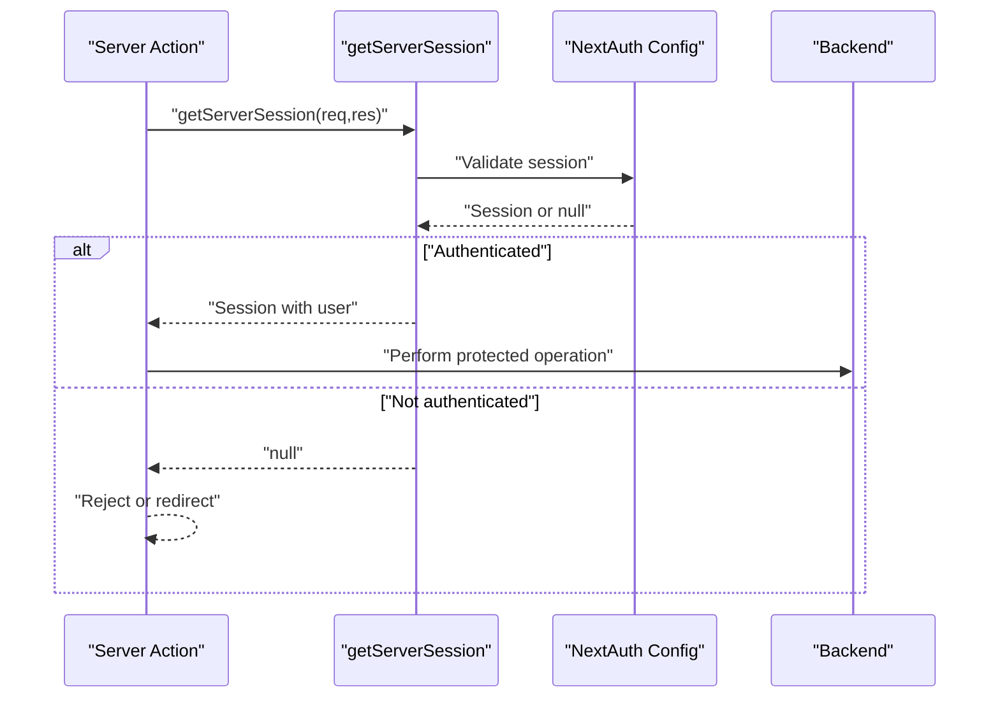
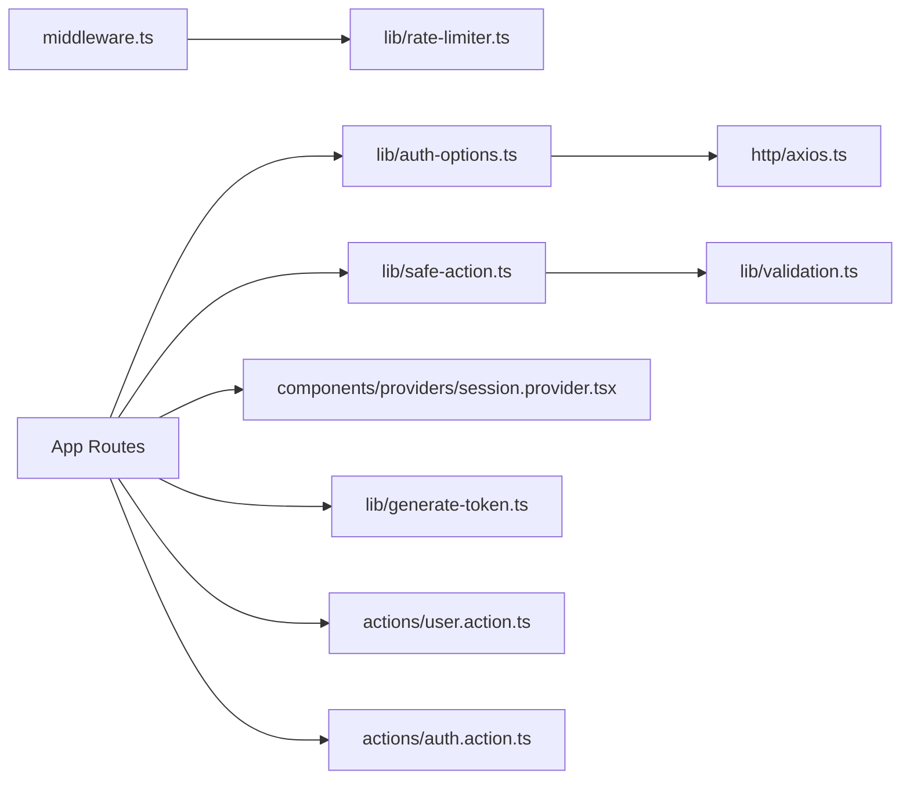

# Security & Middleware

<cite>
**Referenced Files in This Document**
- [middleware.ts](file://middleware.ts)
- [rate-limiter.ts](file://lib/rate-limiter.ts)
- [auth-options.ts](file://lib/auth-options.ts)
- [session.provider.tsx](file://components/providers/session.provider.tsx)
- [auth.action.ts](file://actions/auth.action.ts)
- [next.config.js](file://next.config.js)
- [axios.ts](file://http/axios.ts)
- [safe-action.ts](file://lib/safe-action.ts)
- [validation.ts](file://lib/validation.ts)
- [generate-token.ts](file://lib/generate-token.ts)
- [user.action.ts](file://actions/user.action.ts)
</cite>

## Table of Contents
1. [Introduction](#introduction)
2. [Project Structure](#project-structure)
3. [Core Components](#core-components)
4. [Architecture Overview](#architecture-overview)
5. [Detailed Component Analysis](#detailed-component-analysis)
6. [Dependency Analysis](#dependency-analysis)
7. [Performance Considerations](#performance-considerations)
8. [Troubleshooting Guide](#troubleshooting-guide)
9. [Conclusion](#conclusion)

## Introduction
This document explains the security and middleware implementation in Optim Bozor. It covers request rate limiting (IP-based throttling), request filtering, security headers, authentication and session management, and CSRF/XSS/SQL injection mitigations. It also documents middleware execution order, request/response transformation, error handling, and monitoring/logging strategies for security events and performance tracking.

## Project Structure
Security-related logic is primarily implemented via:
- A Next.js middleware for global request filtering and rate limiting
- NextAuth.js configuration for authentication and session management
- Safe Action clients and validation schemas for request sanitization
- Next.js configuration for cache-control headers on sensitive routes

**Diagram sources**
- [middleware.ts:1-26](file://middleware.ts#L1-L26)
- [rate-limiter.ts:1-29](file://lib/rate-limiter.ts#L1-L29)
- [auth-options.ts:1-128](file://lib/auth-options.ts#L1-L128)
- [session.provider.tsx:1-39](file://components/providers/session.provider.tsx#L1-L39)
- [safe-action.ts:1-3](file://lib/safe-action.ts#L1-L3)
- [validation.ts:1-96](file://lib/validation.ts#L1-L96)
- [axios.ts:1-10](file://http/axios.ts#L1-L10)
- [generate-token.ts:1-10](file://lib/generate-token.ts#L1-L10)

**Section sources**
- [middleware.ts:1-26](file://middleware.ts#L1-L26)
- [next.config.js:1-35](file://next.config.js#L1-L35)

## Core Components
- Request Rate Limiter (IP-based)
  - Implements sliding-window counting per IP within a fixed time window.
  - Enforced globally by middleware before reaching application routes.
- Authentication and Session Management
  - NextAuth.js configuration with secure cookie policies and JWT-based session strategy.
  - Provider wrapper auto-completes OAuth onboarding by bridging pending OAuth state to a credentials login.
- Safe Actions and Validation
  - Strongly typed action clients with Zod schemas to sanitize and validate inputs.
- Security Headers
  - Cache-control headers applied to sensitive API routes to prevent caching of auth-related responses.

**Section sources**
- [rate-limiter.ts:1-29](file://lib/rate-limiter.ts#L1-L29)
- [middleware.ts:1-26](file://middleware.ts#L1-L26)
- [auth-options.ts:1-128](file://lib/auth-options.ts#L1-L128)
- [session.provider.tsx:1-39](file://components/providers/session.provider.tsx#L1-L39)
- [safe-action.ts:1-3](file://lib/safe-action.ts#L1-L3)
- [validation.ts:1-96](file://lib/validation.ts#L1-L96)
- [next.config.js:20-31](file://next.config.js#L20-L31)

## Architecture Overview
The middleware layer acts as a global gatekeeper:
- Extracts client IP from request headers
- Applies rate-limiting logic
- Returns a 429 response if exceeded; otherwise continues to the application

**Diagram sources**
- [middleware.ts:4-20](file://middleware.ts#L4-L20)
- [rate-limiter.ts:9-28](file://lib/rate-limiter.ts#L9-L28)

## Detailed Component Analysis

### Request Rate Limiting (IP-based Throttling)
- Implementation
  - Sliding time window (fixed size) tracks per-IP request timestamps.
  - Limits are enforced in-memory using a Map keyed by IP.
- Endpoint coverage
  - Applied to all routes except static assets and internal Next.js paths via the middleware matcher.
- Enforcement
  - On exceeding the configured threshold, returns a JSON body with a 429 status.

**Diagram sources**
- [rate-limiter.ts:9-28](file://lib/rate-limiter.ts#L9-L28)
- [middleware.ts:9-20](file://middleware.ts#L9-L20)

**Section sources**
- [rate-limiter.ts:1-29](file://lib/rate-limiter.ts#L1-L29)
- [middleware.ts:1-26](file://middleware.ts#L1-L26)

### Authentication Middleware and Protected Routes
- NextAuth.js configuration
  - Providers: Credentials and Google
  - Secure cookies: httpOnly, secure, sameSite lax for session, CSRF, state, and PKCE tokens
  - JWT strategy for sessions with secrets from environment
  - Callbacks enrich JWT and session with user data fetched from backend
- Session provider wrapper
  - Auto-completes OAuth onboarding by attempting a credentials login when pending OAuth state exists
  - Updates session after successful conversion

**Diagram sources**
- [auth-options.ts:8-127](file://lib/auth-options.ts#L8-L127)
- [session.provider.tsx:7-27](file://components/providers/session.provider.tsx#L7-L27)
- [auth.action.ts:13-18](file://actions/auth.action.ts#L13-L18)

**Section sources**
- [auth-options.ts:1-128](file://lib/auth-options.ts#L1-L128)
- [session.provider.tsx:1-39](file://components/providers/session.provider.tsx#L1-L39)
- [auth.action.ts:1-51](file://actions/auth.action.ts#L1-L51)

### Request Filtering and Security Headers
- Middleware matcher
  - Excludes static assets and internal Next.js resources while applying rate limiting to application routes and API/trpc paths.
- Cache-control headers
  - Sensitive API routes are configured to return no-store headers to prevent caching of auth responses.

**Diagram sources**
- [middleware.ts:23-26](file://middleware.ts#L23-L26)
- [next.config.js:20-31](file://next.config.js#L20-L31)

**Section sources**
- [middleware.ts:23-26](file://middleware.ts#L23-L26)
- [next.config.js:20-31](file://next.config.js#L20-L31)

### Safe Actions, Validation, and Request Transformation
- Safe Action client
  - Provides typed action execution with built-in input parsing and error handling.
- Validation schemas
  - Zod schemas define strict input contracts for login, registration, OTP, and other forms.
- Request transformation
  - Actions serialize responses to avoid leaking raw server internals.

**Diagram sources**
- [safe-action.ts:1-3](file://lib/safe-action.ts#L1-L3)
- [validation.ts:1-96](file://lib/validation.ts#L1-L96)
- [auth.action.ts:13-18](file://actions/auth.action.ts#L13-L18)
- [axios.ts:5-9](file://http/axios.ts#L5-L9)

**Section sources**
- [safe-action.ts:1-3](file://lib/safe-action.ts#L1-L3)
- [validation.ts:1-96](file://lib/validation.ts#L1-L96)
- [auth.action.ts:1-51](file://actions/auth.action.ts#L1-L51)
- [axios.ts:1-10](file://http/axios.ts#L1-L10)

### Session Validation and Protected Route Enforcement
- Session retrieval
  - Server-side session access via getServerSession integrated with NextAuth options.
- Protected route enforcement
  - Use getServerSession in server actions to enforce authenticated access and derive user identity for protected operations.

**Diagram sources**
- [user.action.ts:19-20](file://actions/user.action.ts#L19-L20)
- [auth-options.ts:124-127](file://lib/auth-options.ts#L124-L127)

**Section sources**
- [user.action.ts:1-48](file://actions/user.action.ts#L1-L48)
- [auth-options.ts:1-128](file://lib/auth-options.ts#L1-L128)

### CSRF Protection, XSS Prevention, and SQL Injection Mitigation
- CSRF protection
  - NextAuth.js sets secure CSRF cookies with sameSite and httpOnly flags to mitigate cross-site request forgery.
- XSS prevention
  - Strict input validation via Zod schemas reduces risk of injecting malformed payloads.
  - Safe Action serialization avoids exposing raw server objects to the client.
- SQL injection mitigation
  - Backend APIs handle parameterized queries; client-side validation prevents obviously malicious inputs from reaching endpoints.

**Section sources**
- [auth-options.ts:46-67](file://lib/auth-options.ts#L46-L67)
- [validation.ts:1-96](file://lib/validation.ts#L1-L96)
- [safe-action.ts:1-3](file://lib/safe-action.ts#L1-L3)

### Middleware Execution Order and Request/Response Transformation
- Execution order
  - Middleware runs before any route handler; rate limiter checks occur prior to application logic.
- Request transformation
  - Middleware extracts IP from x-forwarded-for header for accurate throttling behind proxies.
- Response transformation
  - On rate limit violation, middleware returns a JSON body with a 429 status; otherwise proceeds unmodified.

**Section sources**
- [middleware.ts:4-20](file://middleware.ts#L4-L20)

### Monitoring and Logging for Security Events and Performance
- Security event logging
  - Log rate-limit violations centrally (e.g., structured logs with IP, timestamp, route) for anomaly detection.
- Threat detection
  - Monitor spikes in 429 responses and repeated failed authentication attempts; trigger alerts for potential abuse.
- Performance tracking
  - Track middleware latency and request volume per IP; correlate with backend response times.

[No sources needed since this section provides general guidance]

## Dependency Analysis

**Diagram sources**
- [middleware.ts:1-2](file://middleware.ts#L1-L2)
- [rate-limiter.ts:1-1](file://lib/rate-limiter.ts#L1-L1)
- [auth-options.ts:1-2](file://lib/auth-options.ts#L1-L2)
- [axios.ts:1-2](file://http/axios.ts#L1-L2)
- [safe-action.ts:1-1](file://lib/safe-action.ts#L1-L1)
- [validation.ts:1-1](file://lib/validation.ts#L1-L1)
- [session.provider.tsx:1-2](file://components/providers/session.provider.tsx#L1-L2)
- [generate-token.ts:1-2](file://lib/generate-token.ts#L1-L2)
- [user.action.ts:1-2](file://actions/user.action.ts#L1-L2)
- [auth.action.ts:1-2](file://actions/auth.action.ts#L1-L2)

**Section sources**
- [middleware.ts:1-26](file://middleware.ts#L1-L26)
- [rate-limiter.ts:1-29](file://lib/rate-limiter.ts#L1-L29)
- [auth-options.ts:1-128](file://lib/auth-options.ts#L1-L128)
- [session.provider.tsx:1-39](file://components/providers/session.provider.tsx#L1-L39)
- [safe-action.ts:1-3](file://lib/safe-action.ts#L1-L3)
- [validation.ts:1-96](file://lib/validation.ts#L1-L96)
- [axios.ts:1-10](file://http/axios.ts#L1-L10)
- [generate-token.ts:1-10](file://lib/generate-token.ts#L1-L10)
- [user.action.ts:1-48](file://actions/user.action.ts#L1-L48)
- [auth.action.ts:1-51](file://actions/auth.action.ts#L1-L51)

## Performance Considerations
- Rate limiter memory footprint
  - In-memory Map grows with unique IPs; consider external storage (e.g., Redis) for distributed environments.
- Header configuration
  - Cache-control headers reduce unnecessary caching of sensitive responses; ensure they are not overly broad.
- Safe Action overhead
  - Validation adds CPU cost; ensure schemas are concise and reused across actions.

[No sources needed since this section provides general guidance]

## Troubleshooting Guide
- Rate limiting triggers unexpectedly
  - Verify proxy headers are correctly passed (x-forwarded-for). Confirm middleware matcher excludes static assets.
- Authentication fails intermittently
  - Check secure cookie settings and SameSite configuration. Ensure backend allows credentials and CORS is aligned.
- 401/403 on protected routes
  - Confirm getServerSession returns a valid session in server actions and that user roles are checked as needed.

**Section sources**
- [middleware.ts:4-20](file://middleware.ts#L4-L20)
- [auth-options.ts:46-67](file://lib/auth-options.ts#L46-L67)
- [user.action.ts:19-20](file://actions/user.action.ts#L19-L20)

## Conclusion
Optim Bozor’s security posture combines middleware-driven rate limiting, robust authentication via NextAuth.js with secure cookies, typed safe actions with strong validation, and cache-control headers for sensitive endpoints. Together, these components provide a layered defense against common threats while maintaining a clear execution model and extensibility for future enhancements.