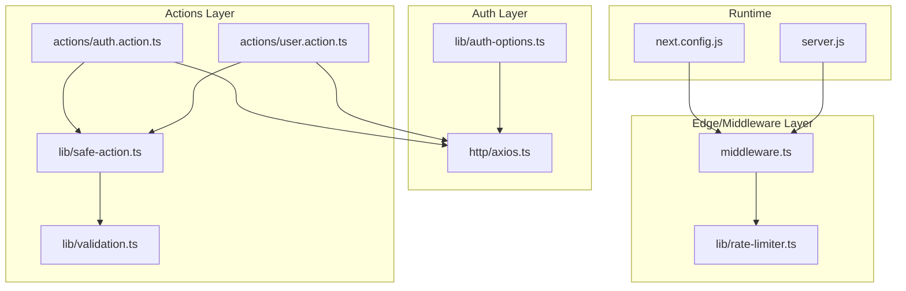
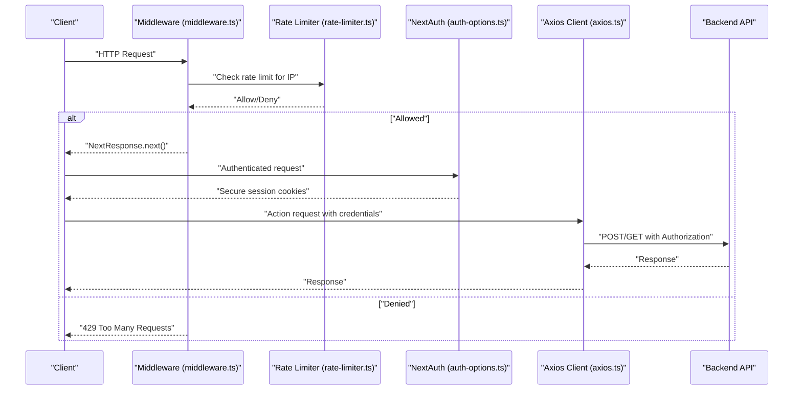
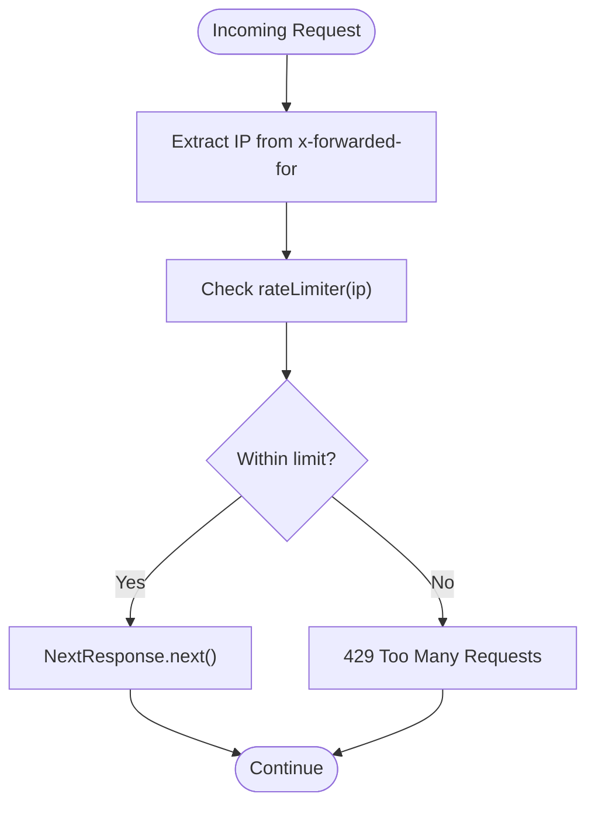
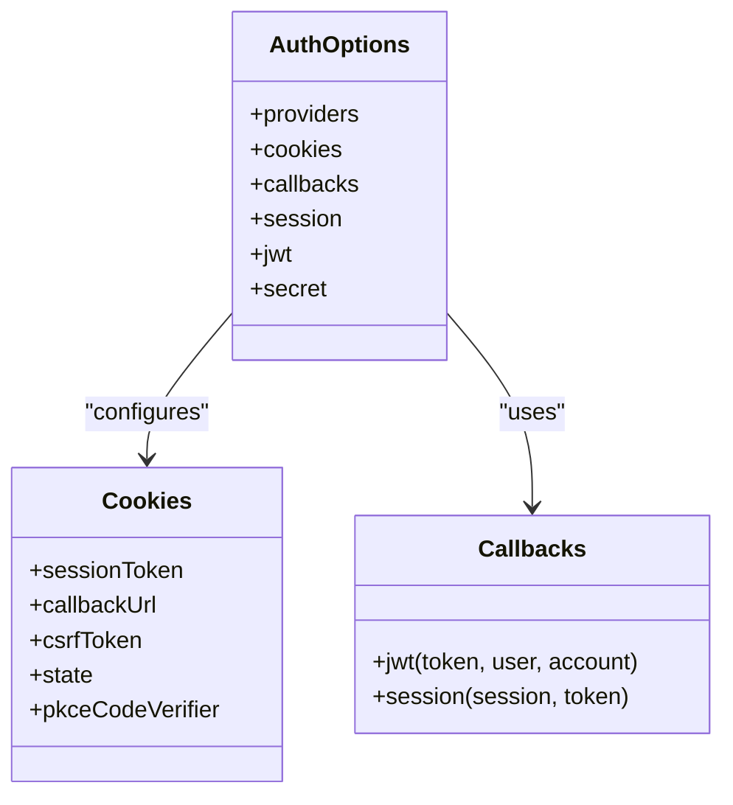
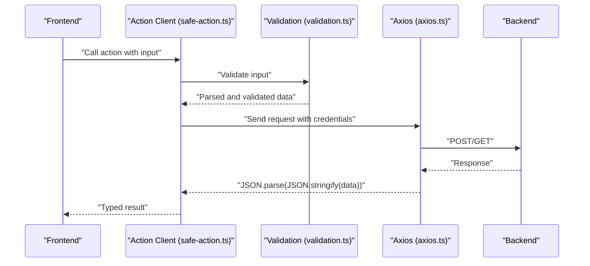
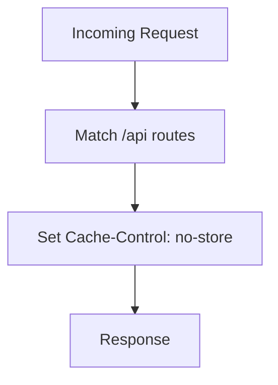
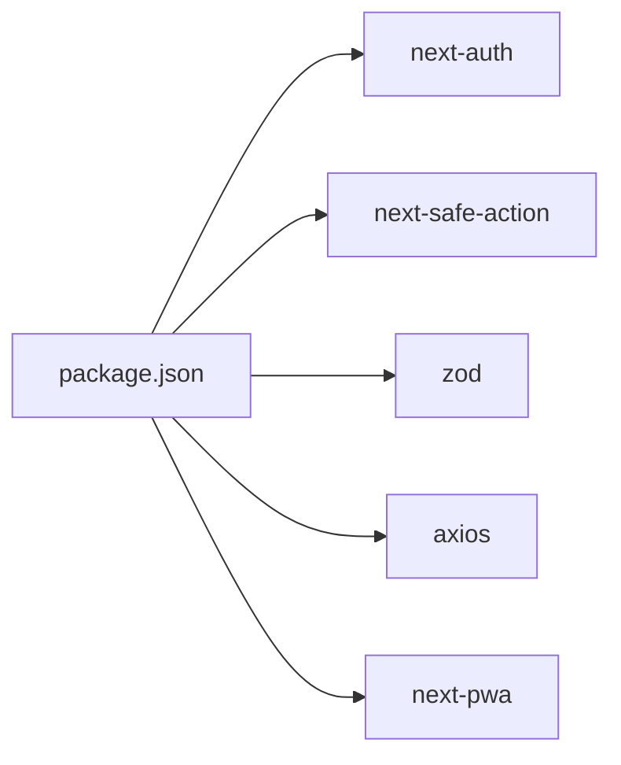

# Security Measures

<cite>
**Referenced Files in This Document**
- [middleware.ts](file://middleware.ts)
- [rate-limiter.ts](file://lib/rate-limiter.ts)
- [auth-options.ts](file://lib/auth-options.ts)
- [safe-action.ts](file://lib/safe-action.ts)
- [validation.ts](file://lib/validation.ts)
- [axios.ts](file://http/axios.ts)
- [next.config.js](file://next.config.js)
- [package.json](file://package.json)
- [server.js](file://server.js)
- [auth.action.ts](file://actions/auth.action.ts)
- [user.action.ts](file://actions/user.action.ts)
</cite>

## Table of Contents
1. [Introduction](#introduction)
2. [Project Structure](#project-structure)
3. [Core Components](#core-components)
4. [Architecture Overview](#architecture-overview)
5. [Detailed Component Analysis](#detailed-component-analysis)
6. [Dependency Analysis](#dependency-analysis)
7. [Performance Considerations](#performance-considerations)
8. [Troubleshooting Guide](#troubleshooting-guide)
9. [Conclusion](#conclusion)
10. [Appendices](#appendices)

## Introduction
This document details the security measures implemented in Optim Bozor’s middleware and application layers. It focuses on request filtering and rate limiting, authentication and session controls via NextAuth.js, input validation and safe actions, and HTTP security headers configuration. It also outlines CORS and cookie policies, CSRF protections, and operational guidance for monitoring and incident response.

## Project Structure
Optim Bozor is a Next.js application with a dedicated middleware module, a rate limiter utility, NextAuth.js configuration, safe action clients, Zod-based validation schemas, and HTTP client configuration. Security-relevant files are organized as follows:
- Middleware: request interception and rate limiting
- Authentication: NextAuth.js configuration with secure cookie policies
- Safe Actions and Validation: typed, validated server actions
- HTTP Client: base URL and credential handling
- Next Config: HTTP headers for sensitive routes
- Server bootstrap: minimal Express server wrapper

**Diagram sources**
- [middleware.ts:1-26](file://middleware.ts#L1-L26)
- [rate-limiter.ts:1-29](file://lib/rate-limiter.ts#L1-L29)
- [auth-options.ts:1-128](file://lib/auth-options.ts#L1-L128)
- [axios.ts:1-10](file://http/axios.ts#L1-L10)
- [safe-action.ts:1-4](file://lib/safe-action.ts#L1-L4)
- [validation.ts:1-96](file://lib/validation.ts#L1-L96)
- [auth.action.ts:1-50](file://actions/auth.action.ts#L1-L50)
- [user.action.ts:1-218](file://actions/user.action.ts#L1-L218)
- [next.config.js:1-35](file://next.config.js#L1-L35)
- [server.js:1-16](file://server.js#L1-L16)

**Section sources**
- [middleware.ts:1-26](file://middleware.ts#L1-L26)
- [rate-limiter.ts:1-29](file://lib/rate-limiter.ts#L1-L29)
- [auth-options.ts:1-128](file://lib/auth-options.ts#L1-L128)
- [safe-action.ts:1-4](file://lib/safe-action.ts#L1-L4)
- [validation.ts:1-96](file://lib/validation.ts#L1-L96)
- [axios.ts:1-10](file://http/axios.ts#L1-L10)
- [next.config.js:1-35](file://next.config.js#L1-L35)
- [server.js:1-16](file://server.js#L1-L16)

## Core Components
- Request Rate Limiting: middleware enforces per-IP limits using an in-memory map and sliding window logic.
- Authentication and Session Management: NextAuth.js with JWT strategy and secure cookie policies.
- Safe Actions and Validation: typed server actions with Zod schemas to prevent invalid inputs and enforce constraints.
- HTTP Headers: Next.js headers configuration adds cache-control directives for sensitive API routes.
- HTTP Client: Axios client configured with credentials and base URL for backend communication.

**Section sources**
- [middleware.ts:9-20](file://middleware.ts#L9-L20)
- [rate-limiter.ts:9-28](file://lib/rate-limiter.ts#L9-L28)
- [auth-options.ts:46-67](file://lib/auth-options.ts#L46-L67)
- [safe-action.ts:1-4](file://lib/safe-action.ts#L1-L4)
- [validation.ts:1-96](file://lib/validation.ts#L1-L96)
- [next.config.js:20-31](file://next.config.js#L20-L31)
- [axios.ts:5-9](file://http/axios.ts#L5-L9)

## Architecture Overview
The security architecture centers on layered controls:
- Edge/middleware: IP-based rate limiting and request gating
- Auth: secure cookie configuration and session retrieval
- Actions: input validation and safe action execution
- Transport: HTTPS-first client configuration and strict headers

**Diagram sources**
- [middleware.ts:9-20](file://middleware.ts#L9-L20)
- [rate-limiter.ts:9-28](file://lib/rate-limiter.ts#L9-L28)
- [auth-options.ts:46-67](file://lib/auth-options.ts#L46-L67)
- [axios.ts:5-9](file://http/axios.ts#L5-L9)

## Detailed Component Analysis

### Middleware and Rate Limiting
- Purpose: Throttle inbound requests per IP to mitigate brute force and abuse.
- Implementation:
  - Extracts client IP from x-forwarded-for header.
  - Maintains a sliding window counter per IP.
  - Returns 429 when exceeding threshold.
- Execution Order: Applied to non-static paths and API/trpc routes via matcher configuration.

**Diagram sources**
- [middleware.ts:4-20](file://middleware.ts#L4-L20)
- [rate-limiter.ts:9-28](file://lib/rate-limiter.ts#L9-L28)

**Section sources**
- [middleware.ts:9-20](file://middleware.ts#L9-L20)
- [middleware.ts:23-26](file://middleware.ts#L23-L26)
- [rate-limiter.ts:1-29](file://lib/rate-limiter.ts#L1-L29)

### Authentication and Session Controls (NextAuth.js)
- Secure Cookie Policies:
  - sessionToken, callbackUrl, csrfToken, state, pkceCodeVerifier configured with httpOnly, secure, sameSite, and path attributes.
  - Production toggles adjust cookie names and secure flag.
- Session and JWT:
  - JWT strategy with secrets from environment variables.
  - Callbacks enrich session with user profile and pending OAuth data.
- Integration:
  - Actions retrieve server session to enforce auth checks and issue bearer tokens.

**Diagram sources**
- [auth-options.ts:8-127](file://lib/auth-options.ts#L8-L127)

**Section sources**
- [auth-options.ts:46-67](file://lib/auth-options.ts#L46-L67)
- [auth-options.ts:69-122](file://lib/auth-options.ts#L69-L122)
- [auth-options.ts:124-127](file://lib/auth-options.ts#L124-L127)
- [user.action.ts:160-177](file://actions/user.action.ts#L160-L177)
- [user.action.ts:186-215](file://actions/user.action.ts#L186-L215)

### Safe Actions and Input Validation
- Safe Action Client:
  - Uses next-safe-action to create a typed action client.
- Validation Schemas:
  - Zod schemas define allowed shapes for login, registration, OTP, passwords, product updates, and search parameters.
- Action Usage:
  - Actions wrap axios calls and parse responses to avoid leaking internal structures.

**Diagram sources**
- [safe-action.ts:1-4](file://lib/safe-action.ts#L1-L4)
- [validation.ts:1-96](file://lib/validation.ts#L1-L96)
- [auth.action.ts:13-39](file://actions/auth.action.ts#L13-L39)
- [user.action.ts:22-29](file://actions/user.action.ts#L22-L29)

**Section sources**
- [safe-action.ts:1-4](file://lib/safe-action.ts#L1-L4)
- [validation.ts:1-96](file://lib/validation.ts#L1-L96)
- [auth.action.ts:13-39](file://actions/auth.action.ts#L13-L39)
- [user.action.ts:22-29](file://actions/user.action.ts#L22-L29)

### HTTP Headers and Transport Security
- Cache Control:
  - Next.js headers function sets no-store for /api/auth and /api routes to prevent caching of sensitive responses.
- Transport:
  - Axios client configured with credentials and base URL; relies on HTTPS for production deployments.

**Diagram sources**
- [next.config.js:20-31](file://next.config.js#L20-L31)

**Section sources**
- [next.config.js:20-31](file://next.config.js#L20-L31)
- [axios.ts:5-9](file://http/axios.ts#L5-L9)

### CORS and Cross-Origin Controls
- Observations:
  - No explicit CORS middleware or headers are configured in the repository.
  - Next.js does not apply default CORS headers; cross-origin behavior depends on deployment proxy or CDN configuration.
- Recommendations:
  - Define Access-Control-Allow-Origin and related headers for trusted origins.
  - Align with Next.js headers configuration for API routes.

[No sources needed since this section provides general guidance]

### CSRF Protection Mechanisms
- NextAuth.js CSRF Tokens:
  - CSRF cookie configured via auth-options; ensures CSRF protection for OAuth and session-managed flows.
- Frontend Practices:
  - Ensure forms/actions are submitted within the same origin and leverage session cookies.
  - Avoid GET-based destructive actions for sensitive mutations.

**Section sources**
- [auth-options.ts:55-58](file://lib/auth-options.ts#L55-L58)

### XSS Prevention Strategies
- Input Validation:
  - Zod schemas enforce shape and length constraints; sanitize and escape user-generated content on the server before rendering.
- Secure Rendering:
  - Avoid inline scripts and unescaped HTML; use templating libraries that escape output by default.
- Content Security Policy (CSP):
  - Not configured in the repository; consider adding CSP headers via Next.js headers to restrict script sources.

[No sources needed since this section provides general guidance]

### SQL Injection Mitigation Techniques
- Backend Responsibility:
  - The repository does not include a backend service; SQL injection controls are implemented server-side in the backend API.
- Client-Side Guidance:
  - Use parameterized queries and ORM/ODMs on the server.
  - Avoid constructing SQL from user input; rely on validated schemas and typed actions.

[No sources needed since this section provides general guidance]

## Dependency Analysis
Security-related dependencies and their roles:
- next-auth: authentication and session management with secure cookie configuration
- next-safe-action: typed server actions to reduce misuse
- zod: input validation schemas
- axios: HTTP client with credentials for backend calls
- next-pwa: PWA support; not a security control

**Diagram sources**
- [package.json:11-53](file://package.json#L11-L53)

**Section sources**
- [package.json:11-53](file://package.json#L11-L53)

## Performance Considerations
- Rate Limiting:
  - Sliding window with in-memory map is efficient but not persistent across instances; consider Redis-backed storage for multi-instance deployments.
- Validation:
  - Zod schemas are fast; ensure schema reuse and avoid deep nesting for large payloads.
- HTTP Client:
  - Timeout configured; ensure backend health checks and circuit breakers.

[No sources needed since this section provides general guidance]

## Troubleshooting Guide
- 429 Too Many Requests:
  - Verify x-forwarded-for header presence behind proxies; confirm rate limiter window and thresholds.
- Authentication Failures:
  - Check cookie SameSite and Secure flags; ensure HTTPS in production; validate NextAuth secrets.
- Action Validation Errors:
  - Inspect parsed input against Zod schemas; confirm frontend sends correct payload shapes.
- CORS Issues:
  - Configure Access-Control-Allow-Origin and related headers; align with deployment proxy behavior.

**Section sources**
- [middleware.ts:12-17](file://middleware.ts#L12-L17)
- [auth-options.ts:46-67](file://lib/auth-options.ts#L46-L67)
- [validation.ts:1-96](file://lib/validation.ts#L1-L96)

## Conclusion
Optim Bozor implements essential security controls at the edge and application layers: middleware-based rate limiting, secure NextAuth.js configuration, typed safe actions with Zod validation, and cache-control headers for sensitive routes. To further strengthen security posture, consider adding CSP headers, explicit CORS controls, and backend SQL injection mitigations aligned with your API implementation.

## Appendices

### Security Headers Configuration Checklist
- Content Security Policy (CSP): Define directives for script-src, style-src, img-src, connect-src, frame-ancestors.
- X-Frame-Options: Prevent clickjacking by setting DENY or SAMEORIGIN.
- X-Content-Type-Options: Prevent MIME sniffing by setting nosniff.
- Strict-Transport-Security: Enforce HTTPS with max-age and includeSubDomains/preload where applicable.
- Referrer-Policy: Limit referrer leakage.

[No sources needed since this section provides general guidance]

### Threat Modeling and Vulnerability Assessment Guidelines
- Assets: User credentials, session cookies, JWT tokens, API endpoints, uploaded assets.
- Threats: Brute force, session hijacking, CSRF, XSS, insecure transport, rate limit bypass.
- Controls: Multi-factor authentication, secure cookies, CSRF tokens, CSP, HTTPS enforcement, input validation, rate limiting.
- Assessment: Regular dependency audits, SAST/DAST scans, penetration testing, log review.

[No sources needed since this section provides general guidance]

### Security Monitoring and Incident Response
- Logging:
  - Log failed authentication attempts, rate limit hits, validation errors, and unexpected status codes.
- Monitoring:
  - Track request volume per IP, authentication success/failure rates, and response latency.
- Alerting:
  - Alert on spikes in 429 responses, repeated auth failures, and unusual geographic access patterns.
- Response:
  - Investigate incidents, temporarily block offending IPs, rotate secrets, and notify affected users.

[No sources needed since this section provides general guidance]