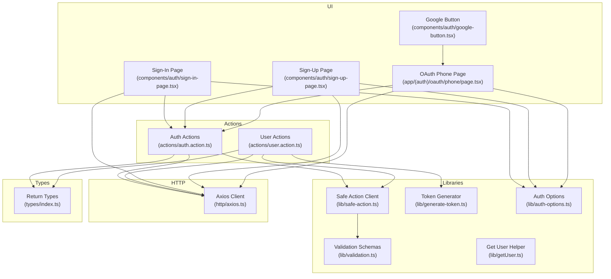
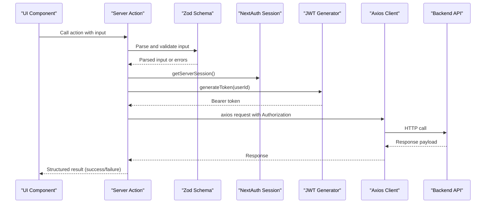
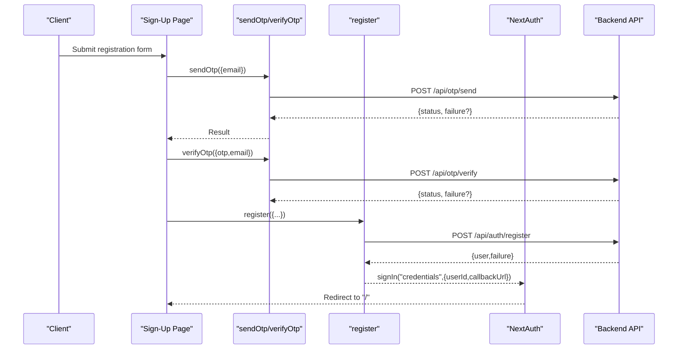
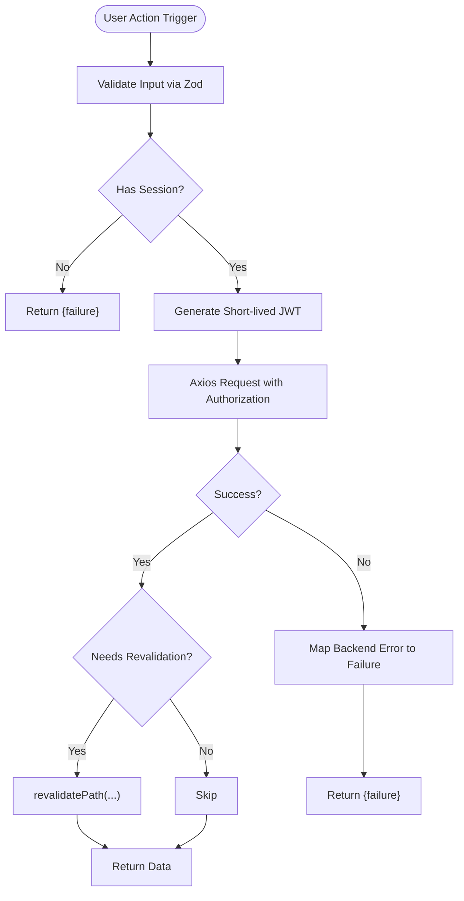
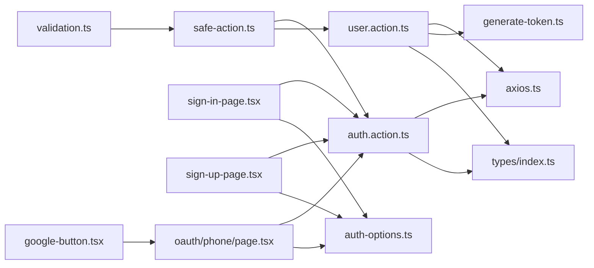

# Practical Implementation Examples

<cite>
**Referenced Files in This Document**
- [actions/auth.action.ts](file://actions/auth.action.ts)
- [actions/user.action.ts](file://actions/user.action.ts)
- [lib/safe-action.ts](file://lib/safe-action.ts)
- [lib/validation.ts](file://lib/validation.ts)
- [lib/generate-token.ts](file://lib/generate-token.ts)
- [lib/auth-options.ts](file://lib/auth-options.ts)
- [lib/getUser.ts](file://lib/getUser.ts)
- [components/auth/sign-in-page.tsx](file://components/auth/sign-in-page.tsx)
- [components/auth/sign-up-page.tsx](file://components/auth/sign-up-page.tsx)
- [components/auth/google-button.tsx](file://components/auth/google-button.tsx)
- [hooks/use-action.ts](file://hooks/use-action.ts)
- [app/(auth)/sign-in/page.tsx](file://app/(auth)/sign-in/page.tsx)
- [app/(auth)/oauth/phone/page.tsx](file://app/(auth)/oauth/phone/page.tsx)
- [types/index.ts](file://types/index.ts)
- [http/axios.ts](file://http/axios.ts)
</cite>

## Table of Contents
1. [Introduction](#introduction)
2. [Project Structure](#project-structure)
3. [Core Components](#core-components)
4. [Architecture Overview](#architecture-overview)
5. [Detailed Component Analysis](#detailed-component-analysis)
6. [Dependency Analysis](#dependency-analysis)
7. [Performance Considerations](#performance-considerations)
8. [Troubleshooting Guide](#troubleshooting-guide)
9. [Conclusion](#conclusion)
10. [Appendices](#appendices)

## Introduction
This document provides practical, code-backed guidance for implementing Server Actions in Optim Bozor. It focuses on authentication actions (login, registration, OTP handling, and OAuth integration), user actions for CRUD and state management, and step-by-step recipes for building robust server interactions. You will learn how to handle async operations, manage server state, integrate with UI components, and apply error handling, loading states, and user feedback. Performance considerations and caching strategies are also covered for real-world usage.

## Project Structure
Optim Bozor organizes server-side logic under actions/, validation schemas under lib/, and UI components under components/. Authentication and user-related flows are wired through NextAuth and Next-Safe-Action for type-safe, validated server actions.

**Diagram sources**
- [components/auth/sign-in-page.tsx:1-178](file://components/auth/sign-in-page.tsx#L1-L178)
- [components/auth/sign-up-page.tsx:1-436](file://components/auth/sign-up-page.tsx#L1-L436)
- [components/auth/google-button.tsx:1-60](file://components/auth/google-button.tsx#L1-L60)
- [app/(auth)/oauth/phone/page.tsx:1-199](file://app/(auth)/oauth/phone/page.tsx#L1-L199)
- [actions/auth.action.ts:1-51](file://actions/auth.action.ts#L1-L51)
- [actions/user.action.ts:1-296](file://actions/user.action.ts#L1-L296)
- [lib/validation.ts:1-96](file://lib/validation.ts#L1-L96)
- [lib/safe-action.ts:1-4](file://lib/safe-action.ts#L1-L4)
- [lib/generate-token.ts:1-11](file://lib/generate-token.ts#L1-L11)
- [lib/auth-options.ts:1-128](file://lib/auth-options.ts#L1-L128)
- [lib/getUser.ts:1-10](file://lib/getUser.ts#L1-L10)
- [http/axios.ts:1-10](file://http/axios.ts#L1-L10)
- [types/index.ts:1-209](file://types/index.ts#L1-L209)

**Section sources**
- [actions/auth.action.ts:1-51](file://actions/auth.action.ts#L1-L51)
- [actions/user.action.ts:1-296](file://actions/user.action.ts#L1-L296)
- [lib/safe-action.ts:1-4](file://lib/safe-action.ts#L1-L4)
- [lib/validation.ts:1-96](file://lib/validation.ts#L1-L96)
- [lib/generate-token.ts:1-11](file://lib/generate-token.ts#L1-L11)
- [lib/auth-options.ts:1-128](file://lib/auth-options.ts#L1-L128)
- [lib/getUser.ts:1-10](file://lib/getUser.ts#L1-L10)
- [http/axios.ts:1-10](file://http/axios.ts#L1-L10)
- [types/index.ts:1-209](file://types/index.ts#L1-L209)

## Core Components
- Safe Action Client: Centralized action client for type-safe server actions.
- Validation Schemas: Zod schemas for login, registration, OTP, and other inputs.
- Auth Actions: Login, registration, OTP send/verify, and OAuth login.
- User Actions: Products, favorites, cart, orders, transactions, statistics, and profile updates.
- NextAuth Integration: Credentials and Google providers with JWT/session callbacks.
- Token Generation: Short-lived JWT generation for protected routes.
- Axios Client: Shared HTTP client with base URL and credentials support.

**Section sources**
- [lib/safe-action.ts:1-4](file://lib/safe-action.ts#L1-L4)
- [lib/validation.ts:1-96](file://lib/validation.ts#L1-L96)
- [actions/auth.action.ts:1-51](file://actions/auth.action.ts#L1-L51)
- [actions/user.action.ts:1-296](file://actions/user.action.ts#L1-L296)
- [lib/auth-options.ts:1-128](file://lib/auth-options.ts#L1-L128)
- [lib/generate-token.ts:1-11](file://lib/generate-token.ts#L1-L11)
- [http/axios.ts:1-10](file://http/axios.ts#L1-L10)

## Architecture Overview
The system uses Server Actions to encapsulate server logic, validated by Zod schemas via the Safe Action client. UI components trigger actions, receive structured responses, and update state. Protected routes use NextAuth sessions and short-lived JWT tokens generated per request.

**Diagram sources**
- [actions/auth.action.ts:13-50](file://actions/auth.action.ts#L13-L50)
- [actions/user.action.ts:52-84](file://actions/user.action.ts#L52-L84)
- [lib/validation.ts:3-24](file://lib/validation.ts#L3-L24)
- [lib/auth-options.ts:86-121](file://lib/auth-options.ts#L86-L121)
- [lib/generate-token.ts:5-10](file://lib/generate-token.ts#L5-L10)
- [http/axios.ts:5-9](file://http/axios.ts#L5-L9)

## Detailed Component Analysis

### Authentication Actions
Authentication flows are implemented as Server Actions with schema validation and HTTP requests to backend endpoints. They return a unified shape for UI consumption.

- Login
  - Action: [login:13-18](file://actions/auth.action.ts#L13-L18)
  - Schema: [loginSchema:3-6](file://lib/validation.ts#L3-L6)
  - UI: [SignInPage.onSubmit:39-52](file://components/auth/sign-in-page.tsx#L39-L52)
  - Notes: Handles server errors, validation errors, and user presence; triggers NextAuth credentials sign-in on success.

- Registration
  - Action: [register:20-25](file://actions/auth.action.ts#L20-L25)
  - Schema: [registerSchema:17-24](file://lib/validation.ts#L17-L24)
  - UI: [SignUpPage.onSubmit:48-64](file://components/auth/sign-up-page.tsx#L48-L64)

- OTP Handling
  - Send OTP: [sendOtp:27-32](file://actions/auth.action.ts#L27-L32)
  - Verify OTP: [verifyOtp:34-39](file://actions/auth.action.ts#L34-L39)
  - UI: [SignUpPage.onSubmit/onVerify:48-103](file://components/auth/sign-up-page.tsx#L48-L103)

- OAuth Integration
  - Google Button: [GoogleButton:12-21](file://components/auth/google-button.tsx#L12-L21)
  - OAuth Phone Capture: [OAuthPhonePage](file://app/(auth)/oauth/phone/page.tsx#L24-L84)
  - NextAuth Providers and Callbacks: [authOptions:8-44](file://lib/auth-options.ts#L8-L44), [authOptions callbacks:69-121](file://lib/auth-options.ts#L69-L121)
  - OAuth Login Action: [oauthLogin:42-50](file://actions/auth.action.ts#L42-L50)

**Diagram sources**
- [components/auth/sign-up-page.tsx:48-103](file://components/auth/sign-up-page.tsx#L48-L103)
- [actions/auth.action.ts:27-39](file://actions/auth.action.ts#L27-L39)
- [actions/auth.action.ts:20-25](file://actions/auth.action.ts#L20-L25)
- [lib/auth-options.ts:86-121](file://lib/auth-options.ts#L86-L121)

**Section sources**
- [actions/auth.action.ts:13-50](file://actions/auth.action.ts#L13-L50)
- [lib/validation.ts:3-24](file://lib/validation.ts#L3-L24)
- [components/auth/sign-in-page.tsx:39-52](file://components/auth/sign-in-page.tsx#L39-L52)
- [components/auth/sign-up-page.tsx:48-103](file://components/auth/sign-up-page.tsx#L48-L103)
- [components/auth/google-button.tsx:12-21](file://components/auth/google-button.tsx#L12-L21)
- [app/(auth)/oauth/phone/page.tsx:24-84](file://app/(auth)/oauth/phone/page.tsx#L24-L84)
- [lib/auth-options.ts:8-44](file://lib/auth-options.ts#L8-L44)
- [lib/auth-options.ts:69-121](file://lib/auth-options.ts#L69-L121)

### User Actions: CRUD, Data Manipulation, and State Management
User actions demonstrate authenticated operations, token injection, and cache invalidation.

- Products
  - List: [getProducts:22-29](file://actions/user.action.ts#L22-L29)
  - Single: [getProduct:31-38](file://actions/user.action.ts#L31-L38)
  - Categories: [getCategories:144-155](file://actions/user.action.ts#L144-L155), [getProductCategorySlug:39-50](file://actions/user.action.ts#L39-L50)

- Favorites
  - Add: [addFavorite:98-119](file://actions/user.action.ts#L98-L119) with revalidation
  - Delete: [deleteFavorite:279-295](file://actions/user.action.ts#L279-L295) with revalidation

- Cart
  - Add: [addToCart:120-143](file://actions/user.action.ts#L120-L143) with revalidation
  - Remove: [removeFromCart:160-177](file://actions/user.action.ts#L160-L177)
  - Get: [getCart:217-227](file://actions/user.action.ts#L217-L227)

- Orders and Transactions
  - Orders: [getOrders:61-72](file://actions/user.action.ts#L61-L72)
  - Add Order: [addOrdersZakaz:179-215](file://actions/user.action.ts#L179-L215)
  - Transactions: [getTransactions:74-84](file://actions/user.action.ts#L74-L84)
  - Statistics: [getStatistics:52-59](file://actions/user.action.ts#L52-L59)

- Profile
  - Update: [updateUser:244-260](file://actions/user.action.ts#L244-L260) with revalidation
  - Update Password: [updatePassword:262-277](file://actions/user.action.ts#L262-L277)

- Checkout
  - Click Checkout: [clickCheckout:229-242](file://actions/user.action.ts#L229-L242)

**Diagram sources**
- [actions/user.action.ts:98-119](file://actions/user.action.ts#L98-L119)
- [actions/user.action.ts:120-143](file://actions/user.action.ts#L120-L143)
- [actions/user.action.ts:244-260](file://actions/user.action.ts#L244-L260)
- [lib/generate-token.ts:5-10](file://lib/generate-token.ts#L5-L10)
- [http/axios.ts:5-9](file://http/axios.ts#L5-L9)

**Section sources**
- [actions/user.action.ts:22-84](file://actions/user.action.ts#L22-L84)
- [actions/user.action.ts:98-143](file://actions/user.action.ts#L98-L143)
- [actions/user.action.ts:179-227](file://actions/user.action.ts#L179-L227)
- [actions/user.action.ts:244-277](file://actions/user.action.ts#L244-L277)
- [actions/user.action.ts:229-242](file://actions/user.action.ts#L229-L242)
- [lib/generate-token.ts:5-10](file://lib/generate-token.ts#L5-L10)

### Step-by-Step Implementation Guides

#### Creating a New Server Action
1. Define input schema in [lib/validation.ts:1-96](file://lib/validation.ts#L1-L96).
2. Create action in [actions/user.action.ts:1-296](file://actions/user.action.ts#L1-L296) or [actions/auth.action.ts:1-51](file://actions/auth.action.ts#L1-L51).
3. Wrap with Safe Action client from [lib/safe-action.ts:1-4](file://lib/safe-action.ts#L1-L4).
4. Validate input with `.schema(schema)` and implement `.action(...)` body.
5. Use `getServerSession()` and `generateToken()` for protected endpoints.
6. Use `axiosClient` from [http/axios.ts:1-10](file://http/axios.ts#L1-L10) with Authorization header.
7. Return a consistent shape defined in [types/index.ts:54-77](file://types/index.ts#L54-L77).

**Section sources**
- [lib/validation.ts:1-96](file://lib/validation.ts#L1-L96)
- [lib/safe-action.ts:1-4](file://lib/safe-action.ts#L1-L4)
- [actions/user.action.ts:1-296](file://actions/user.action.ts#L1-L296)
- [actions/auth.action.ts:1-51](file://actions/auth.action.ts#L1-L51)
- [http/axios.ts:5-9](file://http/axios.ts#L5-L9)
- [types/index.ts:54-77](file://types/index.ts#L54-L77)

#### Handling Async Operations
- Use async action bodies and await axios responses.
- Propagate server errors and validation errors from action results to UI.
- Example paths:
  - [actions/auth.action.ts:13-50](file://actions/auth.action.ts#L13-L50)
  - [actions/user.action.ts:52-84](file://actions/user.action.ts#L52-L84)

**Section sources**
- [actions/auth.action.ts:13-50](file://actions/auth.action.ts#L13-L50)
- [actions/user.action.ts:52-84](file://actions/user.action.ts#L52-L84)

#### Managing Server State
- Use `getServerSession()` to guard protected actions.
- Generate short-lived JWT per request with [lib/generate-token.ts:5-10](file://lib/generate-token.ts#L5-L10).
- Inject Authorization header in [http/axios.ts:5-9](file://http/axios.ts#L5-L9).

**Section sources**
- [lib/auth-options.ts:86-121](file://lib/auth-options.ts#L86-L121)
- [lib/generate-token.ts:5-10](file://lib/generate-token.ts#L5-L10)
- [http/axios.ts:5-9](file://http/axios.ts#L5-L9)

#### Integrating with UI Components
- Use action imports in client components.
- Manage loading state with [hooks/use-action.ts:4-13](file://hooks/use-action.ts#L4-L13) or local state.
- Handle errors and success feedback via toasts.
- Example integrations:
  - [components/auth/sign-in-page.tsx:39-52](file://components/auth/sign-in-page.tsx#L39-L52)
  - [components/auth/sign-up-page.tsx:48-103](file://components/auth/sign-up-page.tsx#L48-L103)

**Section sources**
- [hooks/use-action.ts:4-13](file://hooks/use-action.ts#L4-L13)
- [components/auth/sign-in-page.tsx:39-52](file://components/auth/sign-in-page.tsx#L39-L52)
- [components/auth/sign-up-page.tsx:48-103](file://components/auth/sign-up-page.tsx#L48-L103)

#### Error Handling, Loading States, and User Feedback
- UI-level error mapping and toasts:
  - [components/auth/sign-in-page.tsx:34-52](file://components/auth/sign-in-page.tsx#L34-L52)
  - [components/auth/sign-up-page.tsx:48-103](file://components/auth/sign-up-page.tsx#L48-L103)
- Action-level failures returned as `{ failure }` for guarded operations:
  - [actions/user.action.ts:98-119](file://actions/user.action.ts#L98-L119)

**Section sources**
- [components/auth/sign-in-page.tsx:34-52](file://components/auth/sign-in-page.tsx#L34-L52)
- [components/auth/sign-up-page.tsx:48-103](file://components/auth/sign-up-page.tsx#L48-L103)
- [actions/user.action.ts:98-119](file://actions/user.action.ts#L98-L119)

## Dependency Analysis
The following diagram shows key dependencies among modules involved in authentication and user actions.

**Diagram sources**
- [lib/validation.ts:1-96](file://lib/validation.ts#L1-L96)
- [lib/safe-action.ts:1-4](file://lib/safe-action.ts#L1-L4)
- [actions/auth.action.ts:1-51](file://actions/auth.action.ts#L1-L51)
- [actions/user.action.ts:1-296](file://actions/user.action.ts#L1-L296)
- [http/axios.ts:1-10](file://http/axios.ts#L1-L10)
- [lib/generate-token.ts:1-11](file://lib/generate-token.ts#L1-L11)
- [types/index.ts:1-209](file://types/index.ts#L1-L209)
- [components/auth/sign-in-page.tsx:1-178](file://components/auth/sign-in-page.tsx#L1-L178)
- [components/auth/sign-up-page.tsx:1-436](file://components/auth/sign-up-page.tsx#L1-L436)
- [components/auth/google-button.tsx:1-60](file://components/auth/google-button.tsx#L1-L60)
- [app/(auth)/oauth/phone/page.tsx:1-199](file://app/(auth)/oauth/phone/page.tsx#L1-L199)
- [lib/auth-options.ts:1-128](file://lib/auth-options.ts#L1-L128)

**Section sources**
- [lib/validation.ts:1-96](file://lib/validation.ts#L1-L96)
- [lib/safe-action.ts:1-4](file://lib/safe-action.ts#L1-L4)
- [actions/auth.action.ts:1-51](file://actions/auth.action.ts#L1-L51)
- [actions/user.action.ts:1-296](file://actions/user.action.ts#L1-L296)
- [http/axios.ts:1-10](file://http/axios.ts#L1-L10)
- [lib/generate-token.ts:1-11](file://lib/generate-token.ts#L1-L11)
- [types/index.ts:1-209](file://types/index.ts#L1-L209)
- [components/auth/sign-in-page.tsx:1-178](file://components/auth/sign-in-page.tsx#L1-L178)
- [components/auth/sign-up-page.tsx:1-436](file://components/auth/sign-up-page.tsx#L1-L436)
- [components/auth/google-button.tsx:1-60](file://components/auth/google-button.tsx#L1-L60)
- [app/(auth)/oauth/phone/page.tsx:1-199](file://app/(auth)/oauth/phone/page.tsx#L1-L199)
- [lib/auth-options.ts:1-128](file://lib/auth-options.ts#L1-L128)

## Performance Considerations
- Prefer short-lived JWTs per request to reduce token lifetime risks and stale permissions. See [lib/generate-token.ts:5-10](file://lib/generate-token.ts#L5-L10).
- Use `revalidatePath` judiciously after mutations to keep cached views fresh without over-invalidating. See [actions/user.action.ts:116-118](file://actions/user.action.ts#L116-L118) and [actions/user.action.ts:258-258](file://actions/user.action.ts#L258-L258).
- Batch UI updates and avoid redundant network calls by combining steps (e.g., OTP verification followed by registration).
- Leverage Next.js App Router caching and server actions’ built-in validation to minimize client-side retries.
- Keep axios timeout reasonable (currently 15 seconds) to prevent long blocking UI. See [http/axios.ts:8-8](file://http/axios.ts#L8-L8).

[No sources needed since this section provides general guidance]

## Troubleshooting Guide
Common issues and resolutions:
- Validation Failures
  - Symptom: Action returns validation errors.
  - Resolution: Ensure input matches schema in [lib/validation.ts:1-96](file://lib/validation.ts#L1-L96).
- Authentication Failures
  - Symptom: Guarded actions return `{ failure }` when not logged in.
  - Resolution: Check session via [lib/auth-options.ts:86-121](file://lib/auth-options.ts#L86-L121) and ensure proper sign-in flow.
- OTP Expired or Invalid
  - Symptom: Verification returns status indicating expiration.
  - Resolution: Allow resending OTP in [components/auth/sign-up-page.tsx:78-82](file://components/auth/sign-up-page.tsx#L78-L82).
- Network Errors
  - Symptom: Axios request fails.
  - Resolution: Confirm backend endpoint availability and base URL in [http/axios.ts:5-9](file://http/axios.ts#L5-L9).
- UI Feedback
  - Symptom: No user feedback on error.
  - Resolution: Map action results to toasts in [components/auth/sign-in-page.tsx:34-52](file://components/auth/sign-in-page.tsx#L34-L52) and [components/auth/sign-up-page.tsx:48-103](file://components/auth/sign-up-page.tsx#L48-L103).

**Section sources**
- [lib/validation.ts:1-96](file://lib/validation.ts#L1-L96)
- [lib/auth-options.ts:86-121](file://lib/auth-options.ts#L86-L121)
- [components/auth/sign-up-page.tsx:78-82](file://components/auth/sign-up-page.tsx#L78-L82)
- [http/axios.ts:5-9](file://http/axios.ts#L5-L9)
- [components/auth/sign-in-page.tsx:34-52](file://components/auth/sign-in-page.tsx#L34-L52)
- [components/auth/sign-up-page.tsx:48-103](file://components/auth/sign-up-page.tsx#L48-L103)

## Conclusion
Optim Bozor’s Server Actions provide a robust, type-safe foundation for authentication and user operations. By validating inputs, generating short-lived tokens, and returning consistent response shapes, the system ensures predictable UI behavior, reliable error handling, and maintainable code. Use the included patterns and references to implement new actions quickly and safely.

[No sources needed since this section summarizes without analyzing specific files]

## Appendices

### Best Practices Checklist
- Always define a Zod schema for action inputs.
- Use the Safe Action client to enforce schema and type safety.
- Guard protected actions with session checks and inject short-lived JWTs.
- Return a single, consistent response shape for UI consumption.
- Use `revalidatePath` after mutations to keep UI in sync.
- Provide clear user feedback via toasts and disable UI during loading.
- Keep axios configuration minimal and environment-driven.

[No sources needed since this section provides general guidance]