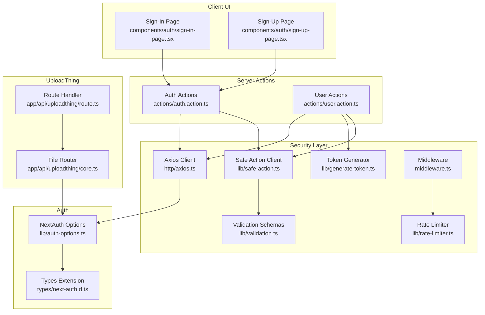
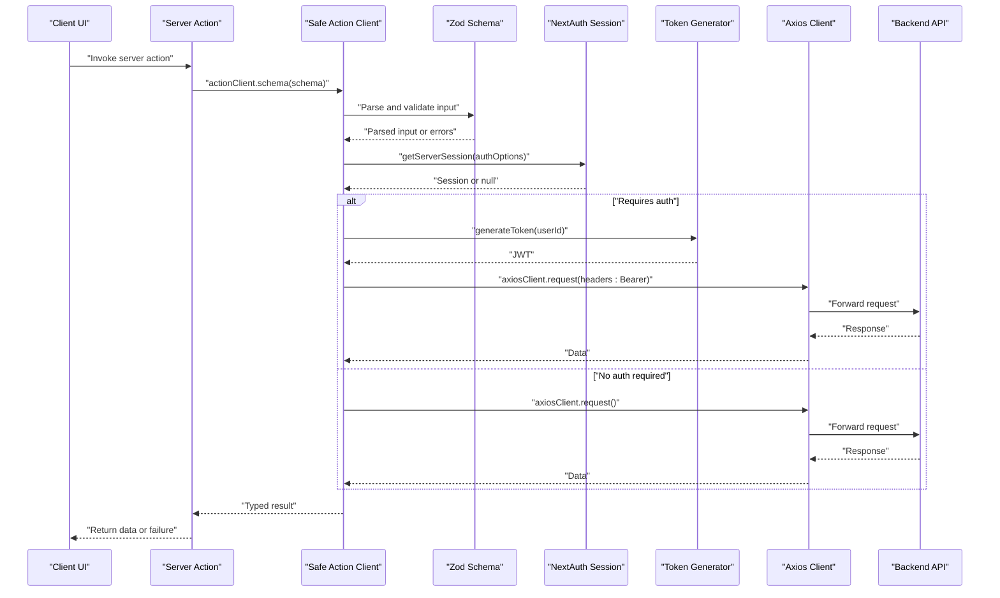
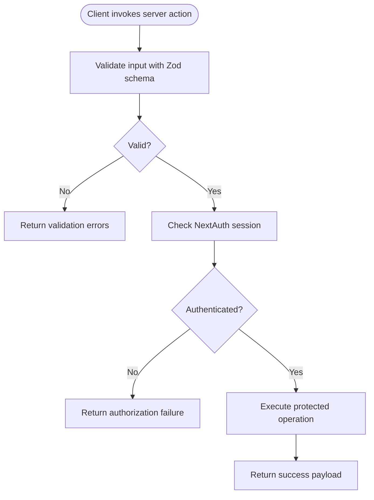
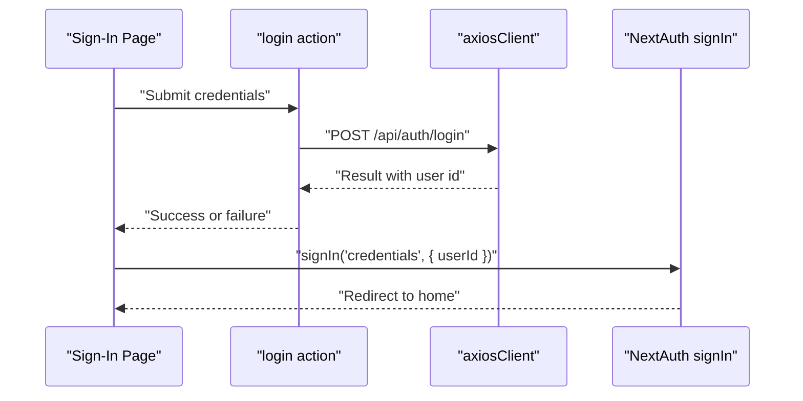
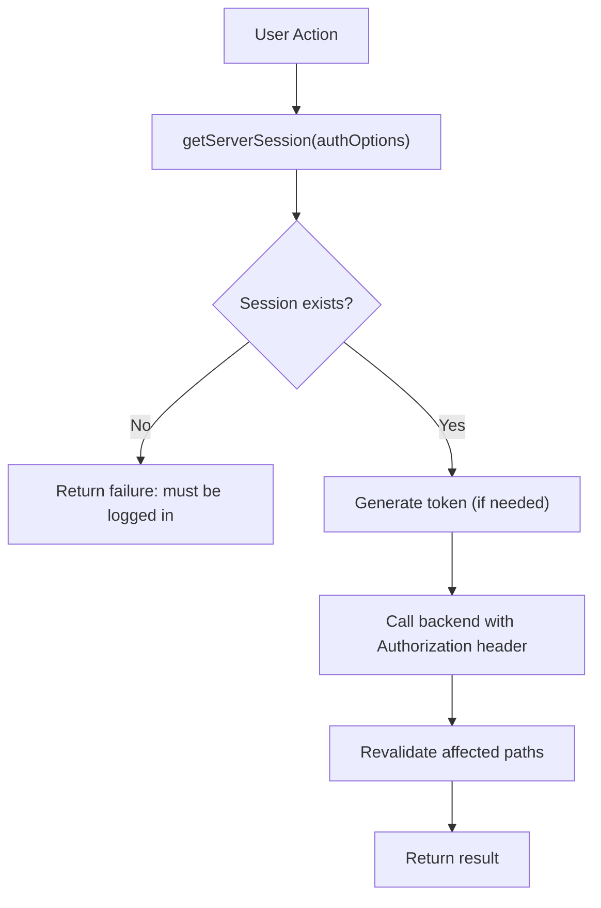
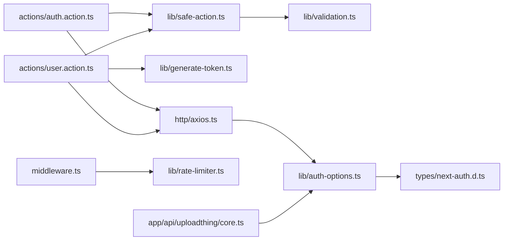

# Security Implementation

<cite>
**Referenced Files in This Document**
- [actions/auth.action.ts](file://actions/auth.action.ts)
- [actions/user.action.ts](file://actions/user.action.ts)
- [lib/safe-action.ts](file://lib/safe-action.ts)
- [lib/validation.ts](file://lib/validation.ts)
- [lib/auth-options.ts](file://lib/auth-options.ts)
- [lib/generate-token.ts](file://lib/generate-token.ts)
- [http/axios.ts](file://http/axios.ts)
- [middleware.ts](file://middleware.ts)
- [lib/rate-limiter.ts](file://lib/rate-limiter.ts)
- [components/auth/sign-in-page.tsx](file://components/auth/sign-in-page.tsx)
- [components/auth/sign-up-page.tsx](file://components/auth/sign-up-page.tsx)
- [types/next-auth.d.ts](file://types/next-auth.d.ts)
- [app/api/uploadthing/core.ts](file://app/api/uploadthing/core.ts)
- [app/api/uploadthing/route.ts](file://app/api/uploadthing/route.ts)
- [hooks/use-action.ts](file://hooks/use-action.ts)
</cite>

## Table of Contents
1. [Introduction](#introduction)
2. [Project Structure](#project-structure)
3. [Core Components](#core-components)
4. [Architecture Overview](#architecture-overview)
5. [Detailed Component Analysis](#detailed-component-analysis)
6. [Dependency Analysis](#dependency-analysis)
7. [Performance Considerations](#performance-considerations)
8. [Troubleshooting Guide](#troubleshooting-guide)
9. [Conclusion](#conclusion)

## Introduction
This document explains the security implementation in Optim Bozor’s Server Actions pattern. It focuses on how Next.js Server Actions provide automatic CSRF protection, reduce the attack surface versus traditional API routes, and simplify authorization. It documents the security benefits such as automatic input sanitization via Zod schemas, type safety enforcement, and reduced manual security boilerplate. It also covers authentication flows, session management through NextAuth, and how sensitive operations are protected. Practical examples are provided via file references and diagrams that map to actual code.

## Project Structure
Optim Bozor organizes security-sensitive logic primarily in:
- Server Action modules under actions/
- Validation schemas under lib/validation.ts
- Safe action client under lib/safe-action.ts
- Authentication configuration under lib/auth-options.ts
- Session generation and HTTP client under lib/generate-token.ts and http/axios.ts
- Middleware-based rate limiting under middleware.ts and lib/rate-limiter.ts
- UploadThing file routing with server-side authorization under app/api/uploadthing/*

**Diagram sources**
- [components/auth/sign-in-page.tsx:1-178](file://components/auth/sign-in-page.tsx#L1-L178)
- [components/auth/sign-up-page.tsx:1-436](file://components/auth/sign-up-page.tsx#L1-L436)
- [actions/auth.action.ts:1-51](file://actions/auth.action.ts#L1-L51)
- [actions/user.action.ts:1-296](file://actions/user.action.ts#L1-L296)
- [lib/safe-action.ts:1-4](file://lib/safe-action.ts#L1-L4)
- [lib/validation.ts:1-96](file://lib/validation.ts#L1-L96)
- [lib/generate-token.ts:1-11](file://lib/generate-token.ts#L1-L11)
- [http/axios.ts:1-10](file://http/axios.ts#L1-L10)
- [middleware.ts:1-26](file://middleware.ts#L1-L26)
- [lib/rate-limiter.ts:1-29](file://lib/rate-limiter.ts#L1-L29)
- [lib/auth-options.ts:1-128](file://lib/auth-options.ts#L1-L128)
- [types/next-auth.d.ts:1-39](file://types/next-auth.d.ts#L1-L39)
- [app/api/uploadthing/core.ts:1-26](file://app/api/uploadthing/core.ts#L1-L26)
- [app/api/uploadthing/route.ts:1-7](file://app/api/uploadthing/route.ts#L1-L7)

**Section sources**
- [actions/auth.action.ts:1-51](file://actions/auth.action.ts#L1-L51)
- [actions/user.action.ts:1-296](file://actions/user.action.ts#L1-L296)
- [lib/safe-action.ts:1-4](file://lib/safe-action.ts#L1-L4)
- [lib/validation.ts:1-96](file://lib/validation.ts#L1-L96)
- [lib/auth-options.ts:1-128](file://lib/auth-options.ts#L1-L128)
- [lib/generate-token.ts:1-11](file://lib/generate-token.ts#L1-L11)
- [http/axios.ts:1-10](file://http/axios.ts#L1-L10)
- [middleware.ts:1-26](file://middleware.ts#L1-L26)
- [lib/rate-limiter.ts:1-29](file://lib/rate-limiter.ts#L1-L29)
- [components/auth/sign-in-page.tsx:1-178](file://components/auth/sign-in-page.tsx#L1-L178)
- [components/auth/sign-up-page.tsx:1-436](file://components/auth/sign-up-page.tsx#L1-L436)
- [types/next-auth.d.ts:1-39](file://types/next-auth.d.ts#L1-L39)
- [app/api/uploadthing/core.ts:1-26](file://app/api/uploadthing/core.ts#L1-L26)
- [app/api/uploadthing/route.ts:1-7](file://app/api/uploadthing/route.ts#L1-L7)

## Core Components
- Safe Action Client: Centralized creation of typed, validated server actions using next-safe-action.
- Validation Schemas: Zod schemas define strict input contracts for all server actions.
- Authentication and Session Management: NextAuth with JWT strategy, cookie hardening, and session augmentation.
- Token Generation: Short-lived JWTs generated server-side for backend-to-backend or service calls.
- HTTP Client: Axios configured with base URL and credentials for cross-origin requests.
- Middleware and Rate Limiting: Global middleware enforcing rate limits to mitigate abuse.
- UploadThing Authorization: Server-side middleware checks session before allowing uploads.

**Section sources**
- [lib/safe-action.ts:1-4](file://lib/safe-action.ts#L1-L4)
- [lib/validation.ts:1-96](file://lib/validation.ts#L1-L96)
- [lib/auth-options.ts:1-128](file://lib/auth-options.ts#L1-L128)
- [lib/generate-token.ts:1-11](file://lib/generate-token.ts#L1-L11)
- [http/axios.ts:1-10](file://http/axios.ts#L1-L10)
- [middleware.ts:1-26](file://middleware.ts#L1-L26)
- [lib/rate-limiter.ts:1-29](file://lib/rate-limiter.ts#L1-L29)
- [app/api/uploadthing/core.ts:1-26](file://app/api/uploadthing/core.ts#L1-L26)

## Architecture Overview
The security architecture leverages Next.js Server Actions as the primary entry point for sensitive operations. Inputs are validated with Zod schemas, executed in a server context, and authorized against NextAuth sessions. For protected backend calls, short-lived JWTs are generated server-side and attached to Authorization headers. Uploads are gated by server-side session checks.

**Diagram sources**
- [actions/auth.action.ts:13-50](file://actions/auth.action.ts#L13-L50)
- [actions/user.action.ts:52-295](file://actions/user.action.ts#L52-L295)
- [lib/safe-action.ts:1-4](file://lib/safe-action.ts#L1-L4)
- [lib/validation.ts:1-96](file://lib/validation.ts#L1-L96)
- [lib/auth-options.ts:1-128](file://lib/auth-options.ts#L1-L128)
- [lib/generate-token.ts:1-11](file://lib/generate-token.ts#L1-L11)
- [http/axios.ts:1-10](file://http/axios.ts#L1-L10)

## Detailed Component Analysis

### Server Actions and CSRF Protection
- Automatic CSRF protection: Server Actions execute in the server context and are invoked from client components, eliminating cross-site request forgery risks associated with open endpoints.
- Reduced attack surface: By keeping sensitive logic in server actions and validating inputs with Zod, the codebase avoids exposing raw API routes to external manipulation.
- Simplified authorization: Server actions can directly check NextAuth sessions and enforce access policies close to the operation.

**Diagram sources**
- [lib/safe-action.ts:1-4](file://lib/safe-action.ts#L1-L4)
- [lib/validation.ts:1-96](file://lib/validation.ts#L1-L96)
- [actions/auth.action.ts:13-50](file://actions/auth.action.ts#L13-L50)
- [actions/user.action.ts:52-295](file://actions/user.action.ts#L52-L295)

**Section sources**
- [actions/auth.action.ts:13-50](file://actions/auth.action.ts#L13-L50)
- [actions/user.action.ts:52-295](file://actions/user.action.ts#L52-L295)
- [lib/safe-action.ts:1-4](file://lib/safe-action.ts#L1-L4)
- [lib/validation.ts:1-96](file://lib/validation.ts#L1-L96)

### Authentication and Session Management
- NextAuth configuration enforces secure cookies, JWT strategy, and session augmentation with user data fetched from the backend.
- Types extension ensures type-safe access to currentUser and provider-specific tokens.
- Client pages trigger NextAuth flows after successful server action completion.

**Diagram sources**
- [components/auth/sign-in-page.tsx:39-52](file://components/auth/sign-in-page.tsx#L39-L52)
- [actions/auth.action.ts:13-18](file://actions/auth.action.ts#L13-L18)
- [http/axios.ts:1-10](file://http/axios.ts#L1-L10)
- [lib/auth-options.ts:1-128](file://lib/auth-options.ts#L1-L128)
- [types/next-auth.d.ts:1-39](file://types/next-auth.d.ts#L1-L39)

**Section sources**
- [lib/auth-options.ts:1-128](file://lib/auth-options.ts#L1-L128)
- [types/next-auth.d.ts:1-39](file://types/next-auth.d.ts#L1-L39)
- [components/auth/sign-in-page.tsx:39-52](file://components/auth/sign-in-page.tsx#L39-L52)
- [components/auth/sign-up-page.tsx:48-103](file://components/auth/sign-up-page.tsx#L48-L103)

### Parameter Validation and Type Safety
- Zod schemas define strict contracts for all inputs, ensuring automatic sanitization and type enforcement.
- Safe action client integrates with Zod to parse and validate inputs before execution, returning typed results.

Examples of schema usage:
- Login and registration inputs validated with dedicated schemas.
- OTP verification and email-based flows use precise Zod schemas.
- User update and password change schemas enforce field constraints.

**Section sources**
- [lib/validation.ts:1-96](file://lib/validation.ts#L1-L96)
- [actions/auth.action.ts:13-50](file://actions/auth.action.ts#L13-L50)
- [actions/user.action.ts:22-295](file://actions/user.action.ts#L22-L295)

### Authorization Patterns in Server Actions
- Many user-centric actions require an authenticated session; otherwise they return a failure indicating the need to log in.
- For protected backend calls, server actions generate short-lived JWTs and attach them to Authorization headers.
- Revalidation is used to keep cached UI consistent after mutating operations.

**Diagram sources**
- [actions/user.action.ts:98-142](file://actions/user.action.ts#L98-L142)
- [actions/user.action.ts:179-215](file://actions/user.action.ts#L179-L215)
- [actions/user.action.ts:217-242](file://actions/user.action.ts#L217-L242)
- [lib/generate-token.ts:1-11](file://lib/generate-token.ts#L1-L11)

**Section sources**
- [actions/user.action.ts:98-142](file://actions/user.action.ts#L98-L142)
- [actions/user.action.ts:179-215](file://actions/user.action.ts#L179-L215)
- [actions/user.action.ts:217-242](file://actions/user.action.ts#L217-L242)
- [lib/generate-token.ts:1-11](file://lib/generate-token.ts#L1-L11)

### UploadThing Authorization
- UploadThing route handler delegates to a file router that requires a valid NextAuth session in middleware.
- Unauthorized uploads throw an error, preventing unauthenticated file uploads.

**Section sources**
- [app/api/uploadthing/route.ts:1-7](file://app/api/uploadthing/route.ts#L1-L7)
- [app/api/uploadthing/core.ts:8-23](file://app/api/uploadthing/core.ts#L8-L23)

### Client-Side Integration Examples
- Sign-in page invokes the login server action, handles validation and server errors, and triggers NextAuth after success.
- Sign-up page orchestrates OTP sending and verification via server actions, then registers the user and signs in.

**Section sources**
- [components/auth/sign-in-page.tsx:39-52](file://components/auth/sign-in-page.tsx#L39-L52)
- [components/auth/sign-up-page.tsx:48-103](file://components/auth/sign-up-page.tsx#L48-L103)

## Dependency Analysis
The security stack exhibits low coupling and high cohesion:
- Server actions depend on the safe action client and Zod schemas.
- Authentication depends on NextAuth configuration and session augmentation.
- HTTP client encapsulates backend communication and credentials.
- Middleware and rate limiter provide global protections.
- UploadThing enforces server-side authorization independently.

**Diagram sources**
- [actions/auth.action.ts:1-51](file://actions/auth.action.ts#L1-L51)
- [actions/user.action.ts:1-296](file://actions/user.action.ts#L1-L296)
- [lib/safe-action.ts:1-4](file://lib/safe-action.ts#L1-L4)
- [lib/validation.ts:1-96](file://lib/validation.ts#L1-L96)
- [lib/generate-token.ts:1-11](file://lib/generate-token.ts#L1-L11)
- [http/axios.ts:1-10](file://http/axios.ts#L1-L10)
- [lib/auth-options.ts:1-128](file://lib/auth-options.ts#L1-L128)
- [types/next-auth.d.ts:1-39](file://types/next-auth.d.ts#L1-L39)
- [middleware.ts:1-26](file://middleware.ts#L1-L26)
- [lib/rate-limiter.ts:1-29](file://lib/rate-limiter.ts#L1-L29)
- [app/api/uploadthing/core.ts:1-26](file://app/api/uploadthing/core.ts#L1-L26)

**Section sources**
- [actions/auth.action.ts:1-51](file://actions/auth.action.ts#L1-L51)
- [actions/user.action.ts:1-296](file://actions/user.action.ts#L1-L296)
- [lib/safe-action.ts:1-4](file://lib/safe-action.ts#L1-L4)
- [lib/validation.ts:1-96](file://lib/validation.ts#L1-L96)
- [lib/generate-token.ts:1-11](file://lib/generate-token.ts#L1-L11)
- [http/axios.ts:1-10](file://http/axios.ts#L1-L10)
- [lib/auth-options.ts:1-128](file://lib/auth-options.ts#L1-L128)
- [types/next-auth.d.ts:1-39](file://types/next-auth.d.ts#L1-L39)
- [middleware.ts:1-26](file://middleware.ts#L1-L26)
- [lib/rate-limiter.ts:1-29](file://lib/rate-limiter.ts#L1-L29)
- [app/api/uploadthing/core.ts:1-26](file://app/api/uploadthing/core.ts#L1-L26)

## Performance Considerations
- Server Actions execute on the server, reducing client-side logic and minimizing network overhead.
- Zod parsing occurs once per action invocation, adding minimal overhead compared to runtime validation.
- Short-lived JWTs reduce long-term credential exposure.
- Rate limiting prevents resource exhaustion and improves resilience under load.

[No sources needed since this section provides general guidance]

## Troubleshooting Guide
Common issues and resolutions:
- Validation failures: Inspect returned validation errors from server actions and adjust client forms accordingly.
- Authentication failures: Ensure NextAuth session exists and is properly hydrated; check cookie settings and session callbacks.
- Authorization failures in protected actions: Verify that getServerSession returns a valid user and that token generation succeeds.
- Upload failures: Confirm that UploadThing middleware receives a valid session and that the file router is correctly configured.

**Section sources**
- [hooks/use-action.ts:1-16](file://hooks/use-action.ts#L1-L16)
- [actions/auth.action.ts:13-50](file://actions/auth.action.ts#L13-L50)
- [actions/user.action.ts:98-142](file://actions/user.action.ts#L98-L142)
- [app/api/uploadthing/core.ts:12-18](file://app/api/uploadthing/core.ts#L12-L18)

## Conclusion
Optim Bozor’s Server Actions pattern delivers strong security by combining automatic CSRF protection, strict input validation, and robust session management. The use of next-safe-action and Zod schemas ensures type safety and reduces manual security work. NextAuth with JWT and hardened cookies secures sessions, while middleware and rate limiting provide additional safeguards. UploadThing further strengthens security by gating uploads server-side. Together, these patterns create a secure, maintainable foundation for sensitive operations.