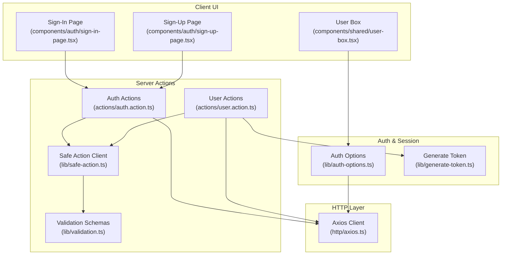
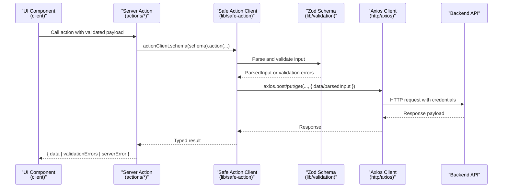
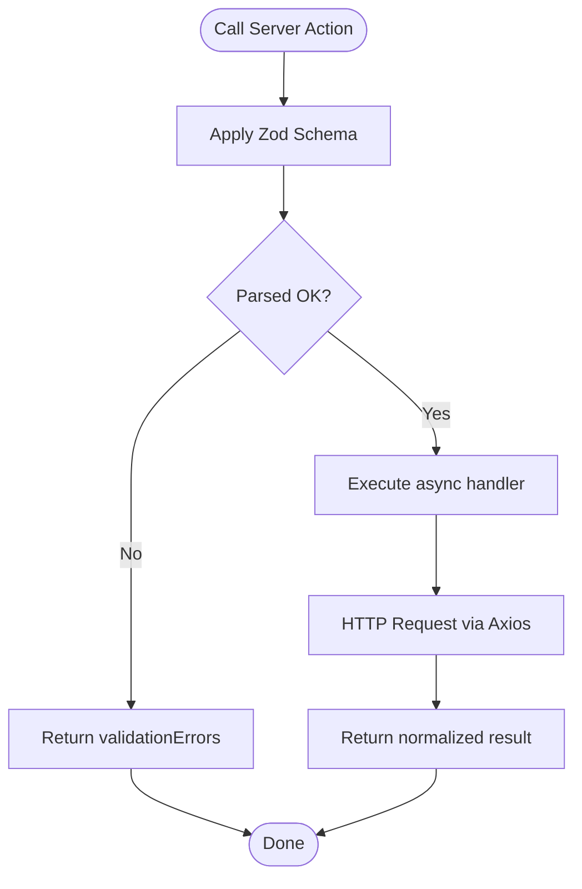
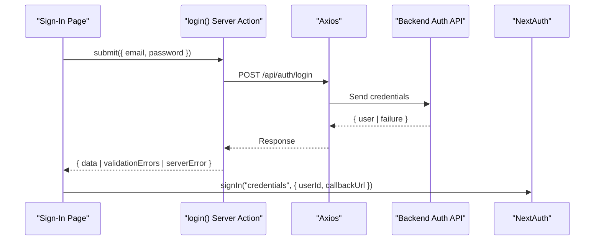
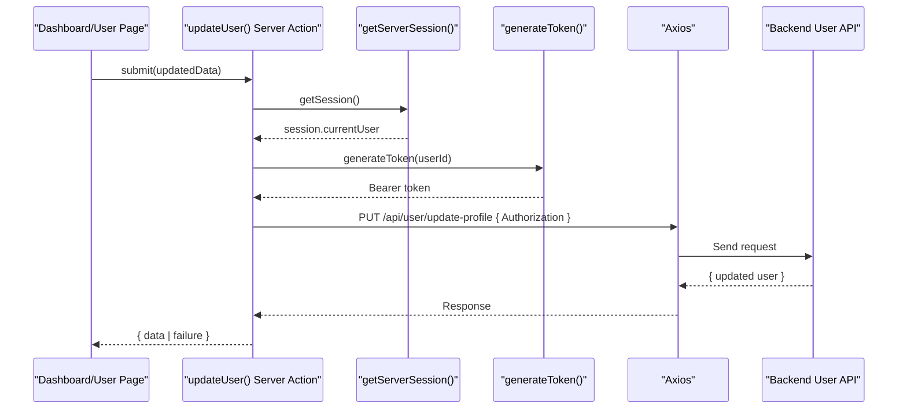
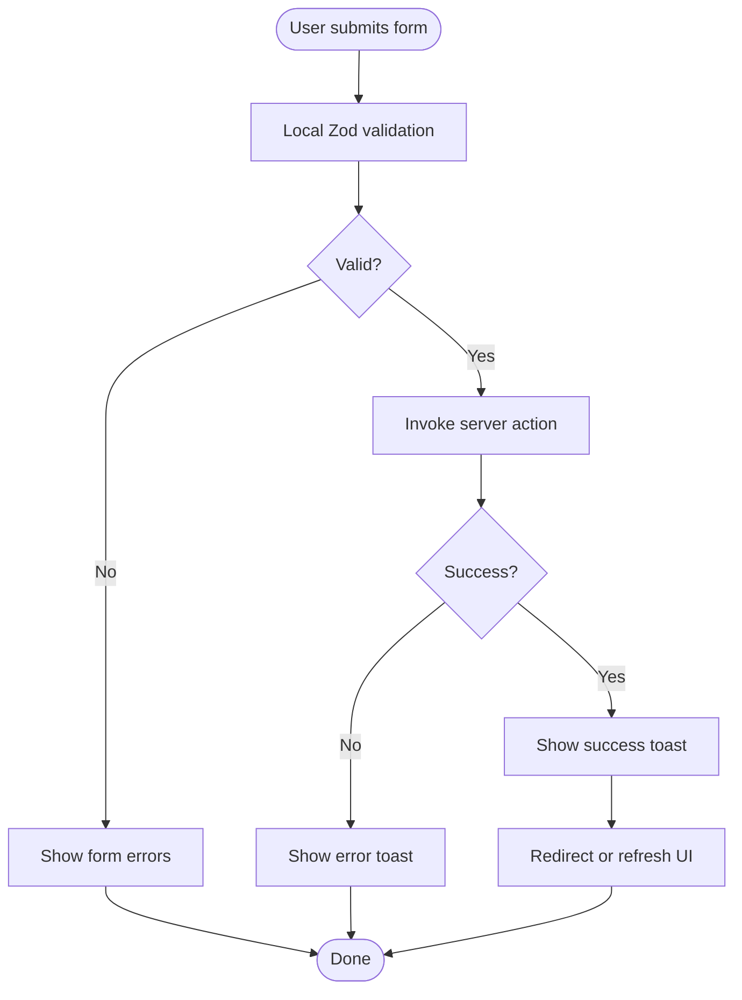
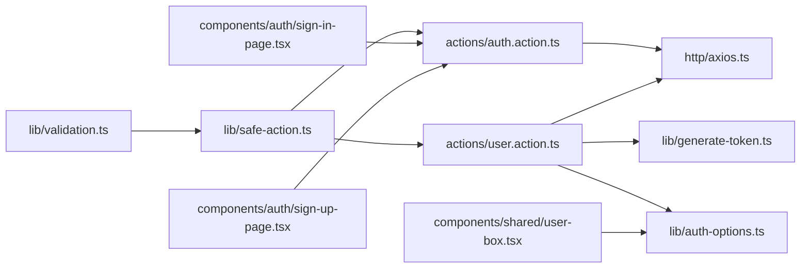

# Server Actions Pattern

<cite>
**Referenced Files in This Document**
- [actions/auth.action.ts](file://actions/auth.action.ts)
- [actions/user.action.ts](file://actions/user.action.ts)
- [lib/safe-action.ts](file://lib/safe-action.ts)
- [lib/validation.ts](file://lib/validation.ts)
- [lib/auth-options.ts](file://lib/auth-options.ts)
- [lib/generate-token.ts](file://lib/generate-token.ts)
- [http/axios.ts](file://http/axios.ts)
- [components/auth/sign-in-page.tsx](file://components/auth/sign-in-page.tsx)
- [components/auth/sign-up-page.tsx](file://components/auth/sign-up-page.tsx)
- [hooks/use-action.ts](file://hooks/use-action.ts)
- [hooks/use-toast.ts](file://hooks/use-toast.ts)
- [types/index.ts](file://types/index.ts)
- [components/shared/user-box.tsx](file://components/shared/user-box.tsx)
- [components/ui/form.tsx](file://components/ui/form.tsx)
</cite>

## Table of Contents
1. [Introduction](#introduction)
2. [Project Structure](#project-structure)
3. [Core Components](#core-components)
4. [Architecture Overview](#architecture-overview)
5. [Detailed Component Analysis](#detailed-component-analysis)
6. [Dependency Analysis](#dependency-analysis)
7. [Performance Considerations](#performance-considerations)
8. [Troubleshooting Guide](#troubleshooting-guide)
9. [Conclusion](#conclusion)

## Introduction
This document explains Optim Bozor’s implementation of Next.js 14 Server Actions to replace traditional API routes with secure, type-safe server functions. It covers the safe-action wrapper for robust error handling and validation, Zod schema integration, authentication actions for registration, login, and session management, and user actions for CRUD operations. It also highlights the security benefits of Server Actions (automatic CSRF protection, reduced attack surface, simplified authorization), practical implementation patterns, and performance considerations.

## Project Structure
Optim Bozor organizes server-side logic under actions/, validation schemas under lib/, and integrates with UI components in app/ and components/. Authentication and session management are handled via NextAuth with JWT-based callbacks and cookie policies. The frontend uses React Hook Form with Zod resolvers to validate inputs before invoking server actions.

**Diagram sources**
- [components/auth/sign-in-page.tsx:1-178](file://components/auth/sign-in-page.tsx#L1-L178)
- [components/auth/sign-up-page.tsx:1-436](file://components/auth/sign-up-page.tsx#L1-L436)
- [components/shared/user-box.tsx:1-117](file://components/shared/user-box.tsx#L1-L117)
- [actions/auth.action.ts:1-51](file://actions/auth.action.ts#L1-L51)
- [actions/user.action.ts:1-288](file://actions/user.action.ts#L1-L288)
- [lib/safe-action.ts:1-4](file://lib/safe-action.ts#L1-L4)
- [lib/validation.ts:1-96](file://lib/validation.ts#L1-L96)
- [lib/auth-options.ts:1-128](file://lib/auth-options.ts#L1-L128)
- [lib/generate-token.ts:1-11](file://lib/generate-token.ts#L1-L11)
- [http/axios.ts:1-10](file://http/axios.ts#L1-L10)

**Section sources**
- [actions/auth.action.ts:1-51](file://actions/auth.action.ts#L1-L51)
- [actions/user.action.ts:1-288](file://actions/user.action.ts#L1-L288)
- [lib/safe-action.ts:1-4](file://lib/safe-action.ts#L1-L4)
- [lib/validation.ts:1-96](file://lib/validation.ts#L1-L96)
- [lib/auth-options.ts:1-128](file://lib/auth-options.ts#L1-L128)
- [lib/generate-token.ts:1-11](file://lib/generate-token.ts#L1-L11)
- [http/axios.ts:1-10](file://http/axios.ts#L1-L10)
- [components/auth/sign-in-page.tsx:1-178](file://components/auth/sign-in-page.tsx#L1-L178)
- [components/auth/sign-up-page.tsx:1-436](file://components/auth/sign-up-page.tsx#L1-L436)
- [components/shared/user-box.tsx:1-117](file://components/shared/user-box.tsx#L1-L117)

## Core Components
- Safe Action Client: A thin wrapper around next-safe-action to centralize error handling and validation behavior for all server actions.
- Validation Schemas: Zod schemas define strict input contracts for all server actions, ensuring type safety and runtime validation.
- Authentication Actions: Login, register, OTP send/verify, and OAuth login implemented as server actions with schema-driven validation.
- User Actions: CRUD-like operations for products, favorites, cart, orders, transactions, and profile updates, leveraging server sessions and JWT tokens.
- Auth Options: NextAuth configuration with JWT callbacks, cookie policies, and session hydration from backend APIs.
- Axios Client: Shared HTTP client configured with credentials and timeouts, used by server actions to communicate with backend endpoints.

**Section sources**
- [lib/safe-action.ts:1-4](file://lib/safe-action.ts#L1-L4)
- [lib/validation.ts:1-96](file://lib/validation.ts#L1-L96)
- [actions/auth.action.ts:1-51](file://actions/auth.action.ts#L1-L51)
- [actions/user.action.ts:1-288](file://actions/user.action.ts#L1-L288)
- [lib/auth-options.ts:1-128](file://lib/auth-options.ts#L1-L128)
- [http/axios.ts:1-10](file://http/axios.ts#L1-L10)

## Architecture Overview
The system uses Server Actions to execute sensitive logic on the server, validating inputs with Zod schemas and returning structured results. Authentication relies on NextAuth with JWT callbacks and a custom token generator for protected backend calls. UI components trigger server actions after local validation with React Hook Form and Zod resolvers.

**Diagram sources**
- [actions/auth.action.ts:13-18](file://actions/auth.action.ts#L13-L18)
- [actions/auth.action.ts:20-25](file://actions/auth.action.ts#L20-L25)
- [actions/auth.action.ts:27-39](file://actions/auth.action.ts#L27-L39)
- [lib/safe-action.ts:1-4](file://lib/safe-action.ts#L1-L4)
- [lib/validation.ts:3-6](file://lib/validation.ts#L3-L6)
- [lib/validation.ts:17-24](file://lib/validation.ts#L17-L24)
- [lib/validation.ts:8-11](file://lib/validation.ts#L8-L11)
- [http/axios.ts:5-9](file://http/axios.ts#L5-L9)

## Detailed Component Analysis

### Safe Action Wrapper and Validation Integration
- Purpose: Provide a single, typed contract for server actions with built-in Zod schema enforcement and consistent error/result shape.
- Behavior: Each action defines a schema and an async handler receiving parsedInput. The wrapper ensures validation occurs before handler execution and normalizes results.
- Benefits: Centralized error handling, predictable result structure, and compile-time type safety.

**Diagram sources**
- [lib/safe-action.ts:1-4](file://lib/safe-action.ts#L1-L4)
- [lib/validation.ts:1-96](file://lib/validation.ts#L1-L96)
- [actions/auth.action.ts:13-18](file://actions/auth.action.ts#L13-L18)

**Section sources**
- [lib/safe-action.ts:1-4](file://lib/safe-action.ts#L1-L4)
- [lib/validation.ts:1-96](file://lib/validation.ts#L1-L96)
- [actions/auth.action.ts:13-18](file://actions/auth.action.ts#L13-L18)

### Authentication Actions: Registration, Login, OTP, and OAuth
- Login: Validates email/password, posts to backend, and returns either user data or failure messages. UI triggers NextAuth sign-in upon success.
- Register: Sends OTP to email, verifies OTP, then registers the user and signs in.
- OTP: Separate send and verify actions with schema-driven validation.
- OAuth: Lightweight server action to support OAuth login flows with minimal user data.

**Diagram sources**
- [components/auth/sign-in-page.tsx:39-52](file://components/auth/sign-in-page.tsx#L39-L52)
- [actions/auth.action.ts:13-18](file://actions/auth.action.ts#L13-L18)
- [http/axios.ts:5-9](file://http/axios.ts#L5-L9)
- [lib/auth-options.ts:10-37](file://lib/auth-options.ts#L10-L37)

**Section sources**
- [actions/auth.action.ts:13-18](file://actions/auth.action.ts#L13-L18)
- [components/auth/sign-in-page.tsx:39-52](file://components/auth/sign-in-page.tsx#L39-L52)
- [lib/auth-options.ts:10-37](file://lib/auth-options.ts#L10-L37)

### User Actions: CRUD Operations and Session Management
- Products: Fetch paginated/searchable products with schema validation for filters.
- Favorites: Add/delete favorites and manage watch-list revalidation.
- Cart: Add/remove items and retrieve cart contents with session checks.
- Orders/Transactions: Fetch paginated lists with JWT token generation for protected endpoints.
- Profile: Update personal info and passwords with session guards and revalidation.
- Statistics: Aggregated metrics retrieval using generated tokens.

**Diagram sources**
- [actions/user.action.ts:237-253](file://actions/user.action.ts#L237-L253)
- [lib/generate-token.ts:5-10](file://lib/generate-token.ts#L5-L10)
- [lib/auth-options.ts:19](file://lib/auth-options.ts#L19)
- [http/axios.ts:5-9](file://http/axios.ts#L5-L9)

**Section sources**
- [actions/user.action.ts:22-29](file://actions/user.action.ts#L22-L29)
- [actions/user.action.ts:86-96](file://actions/user.action.ts#L86-L96)
- [actions/user.action.ts:117-136](file://actions/user.action.ts#L117-L136)
- [actions/user.action.ts:172-208](file://actions/user.action.ts#L172-L208)
- [actions/user.action.ts:210-220](file://actions/user.action.ts#L210-L220)
- [actions/user.action.ts:237-253](file://actions/user.action.ts#L237-L253)
- [actions/user.action.ts:255-270](file://actions/user.action.ts#L255-L270)
- [actions/user.action.ts:272-287](file://actions/user.action.ts#L272-L287)
- [lib/generate-token.ts:5-10](file://lib/generate-token.ts#L5-L10)

### UI Integration Patterns
- Local validation with React Hook Form and Zod resolvers before invoking server actions.
- Loading states and error handling via a shared hook and toast notifications.
- Conditional rendering for OTP verification flow during sign-up.

**Diagram sources**
- [components/auth/sign-in-page.tsx:29-52](file://components/auth/sign-in-page.tsx#L29-L52)
- [components/auth/sign-up-page.tsx:48-103](file://components/auth/sign-up-page.tsx#L48-L103)
- [hooks/use-action.ts:1-16](file://hooks/use-action.ts#L1-L16)
- [hooks/use-toast.ts:142-169](file://hooks/use-toast.ts#L142-L169)

**Section sources**
- [components/auth/sign-in-page.tsx:29-52](file://components/auth/sign-in-page.tsx#L29-L52)
- [components/auth/sign-up-page.tsx:48-103](file://components/auth/sign-up-page.tsx#L48-L103)
- [hooks/use-action.ts:1-16](file://hooks/use-action.ts#L1-L16)
- [hooks/use-toast.ts:142-169](file://hooks/use-toast.ts#L142-L169)

### Security Benefits of Server Actions
- Automatic CSRF protection through Next.js Server Actions and NextAuth cookies.
- Reduced attack surface by keeping sensitive logic on the server and avoiding direct client-to-backend endpoints.
- Simplified authorization via getServerSession() inside actions, enforcing session checks per operation.
- Structured error handling prevents leakage of internal errors to clients.

**Section sources**
- [lib/auth-options.ts:46-67](file://lib/auth-options.ts#L46-L67)
- [actions/user.action.ts:100-116](file://actions/user.action.ts#L100-L116)
- [actions/user.action.ts:210-220](file://actions/user.action.ts#L210-L220)

## Dependency Analysis
- Server Actions depend on the safe-action client and Zod schemas for validation.
- User actions additionally depend on NextAuth session retrieval and JWT token generation for protected backend calls.
- All actions use a shared Axios client configured with credentials and timeouts.
- UI components depend on React Hook Form and toast utilities for UX and error feedback.

**Diagram sources**
- [lib/validation.ts:1-96](file://lib/validation.ts#L1-L96)
- [lib/safe-action.ts:1-4](file://lib/safe-action.ts#L1-L4)
- [actions/auth.action.ts:1-51](file://actions/auth.action.ts#L1-L51)
- [actions/user.action.ts:1-288](file://actions/user.action.ts#L1-L288)
- [http/axios.ts:1-10](file://http/axios.ts#L1-L10)
- [lib/generate-token.ts:1-11](file://lib/generate-token.ts#L1-L11)
- [lib/auth-options.ts:1-128](file://lib/auth-options.ts#L1-L128)
- [components/auth/sign-in-page.tsx:1-178](file://components/auth/sign-in-page.tsx#L1-L178)
- [components/auth/sign-up-page.tsx:1-436](file://components/auth/sign-up-page.tsx#L1-L436)
- [components/shared/user-box.tsx:1-117](file://components/shared/user-box.tsx#L1-L117)

**Section sources**
- [lib/validation.ts:1-96](file://lib/validation.ts#L1-L96)
- [lib/safe-action.ts:1-4](file://lib/safe-action.ts#L1-L4)
- [actions/auth.action.ts:1-51](file://actions/auth.action.ts#L1-L51)
- [actions/user.action.ts:1-288](file://actions/user.action.ts#L1-L288)
- [http/axios.ts:1-10](file://http/axios.ts#L1-L10)
- [lib/generate-token.ts:1-11](file://lib/generate-token.ts#L1-L11)
- [lib/auth-options.ts:1-128](file://lib/auth-options.ts#L1-L128)
- [components/auth/sign-in-page.tsx:1-178](file://components/auth/sign-in-page.tsx#L1-L178)
- [components/auth/sign-up-page.tsx:1-436](file://components/auth/sign-up-page.tsx#L1-L436)
- [components/shared/user-box.tsx:1-117](file://components/shared/user-box.tsx#L1-L117)

## Performance Considerations
- Prefer schema-driven validation close to the boundary to fail fast and reduce unnecessary network calls.
- Use pagination and filtering schemas to limit payload sizes for list endpoints.
- Revalidate only affected paths after write operations (e.g., favorites, dashboard) to minimize cache invalidation overhead.
- Keep server action handlers small and delegate heavy work to backend services; avoid long-running synchronous logic.
- Use JWT tokens for short-lived authorizations to backend endpoints to reduce session lookup overhead.

[No sources needed since this section provides general guidance]

## Troubleshooting Guide
- Validation failures: Inspect returned validationErrors and ensure UI displays appropriate messages.
- Authentication errors: Verify NextAuth callbacks populate session.currentUser and that the UI triggers sign-in with credentials when successful.
- Session issues: Confirm getServerSession() is awaited and that cookies are set securely according to auth-options.
- Network timeouts: Adjust axios timeout and handle serverError in UI to show user-friendly messages.
- Token generation: Ensure NEXT_PUBLIC_JWT_SECRET is configured and tokens are short-lived.

**Section sources**
- [components/auth/sign-in-page.tsx:42-51](file://components/auth/sign-in-page.tsx#L42-L51)
- [components/auth/sign-up-page.tsx:50-102](file://components/auth/sign-up-page.tsx#L50-L102)
- [lib/auth-options.ts:69-122](file://lib/auth-options.ts#L69-L122)
- [http/axios.ts:5-9](file://http/axios.ts#L5-L9)
- [lib/generate-token.ts:5-10](file://lib/generate-token.ts#L5-L10)

## Conclusion
Optim Bozor’s Server Actions implementation leverages next-safe-action and Zod schemas to deliver secure, type-safe, and maintainable client-server interactions. By centralizing validation, enforcing session-based authorization, and integrating tightly with NextAuth, the system achieves strong security posture and a streamlined developer experience. The UI remains responsive and user-friendly through local validation, loading states, and toast notifications, while server actions encapsulate business logic and protect backend endpoints.