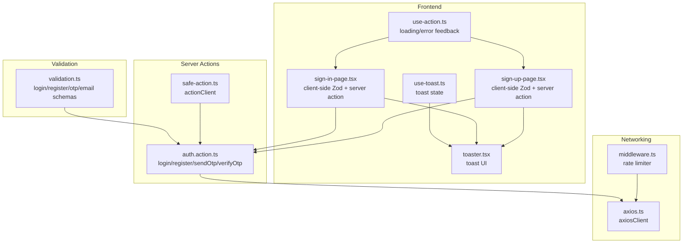
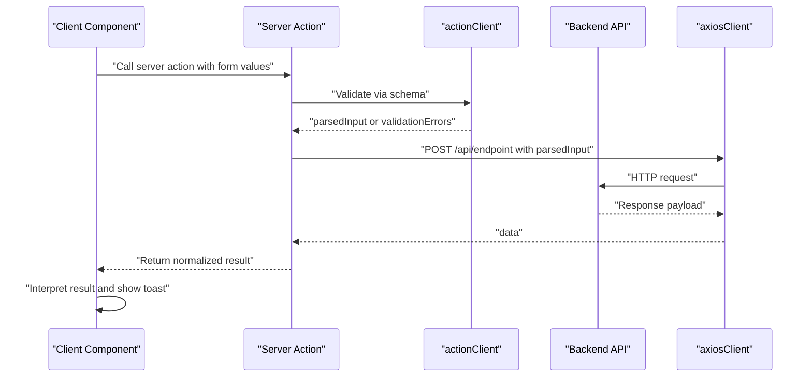
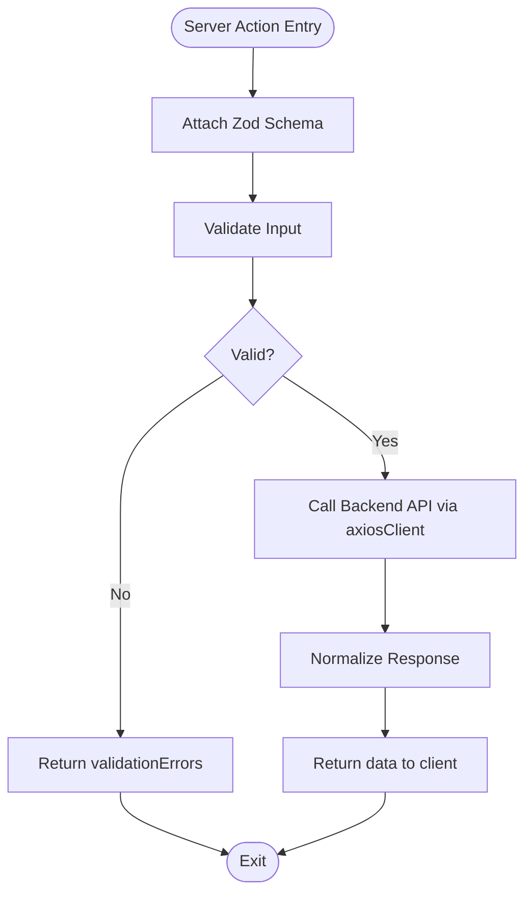
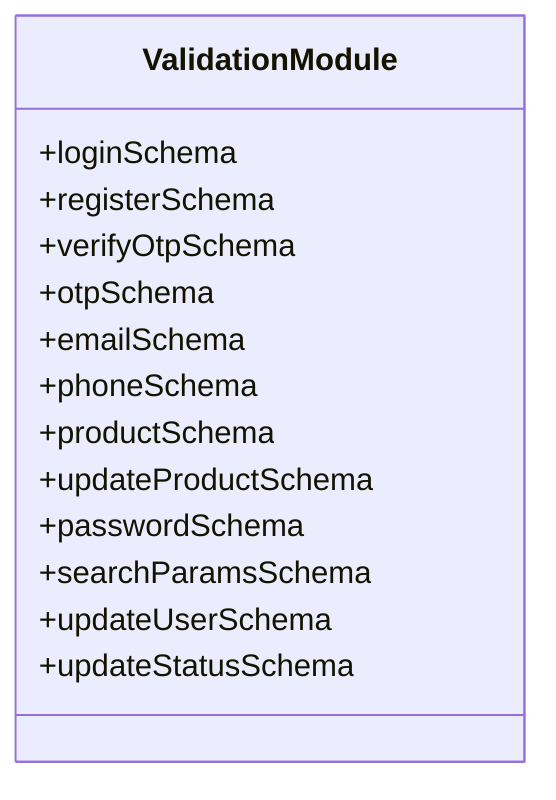
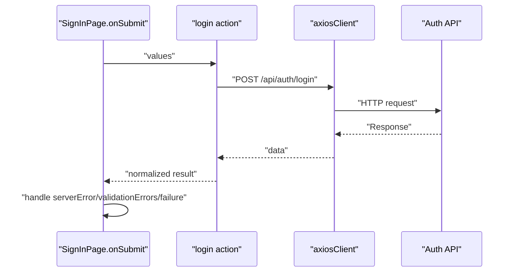
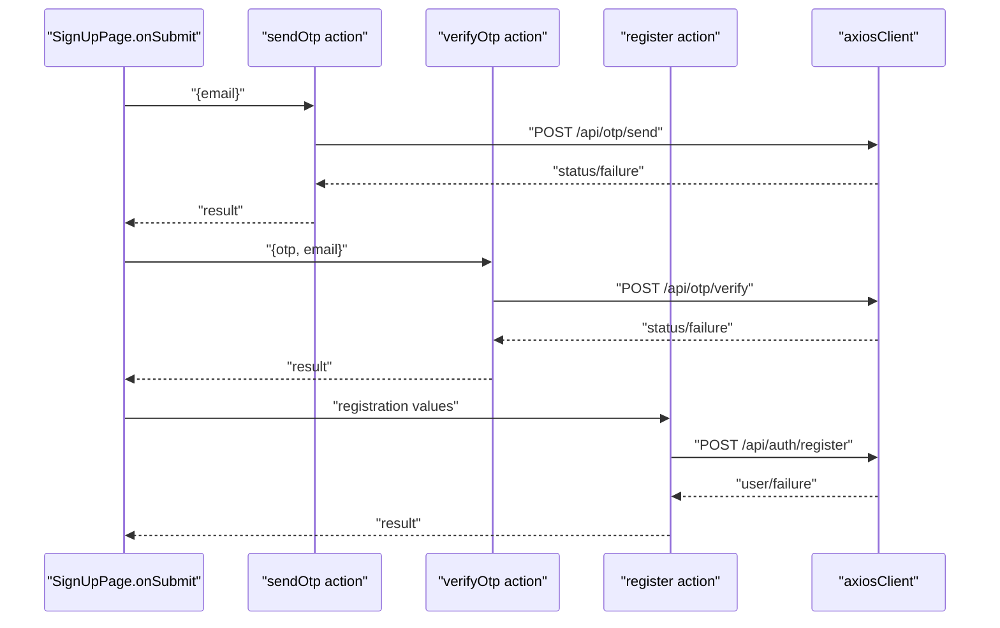
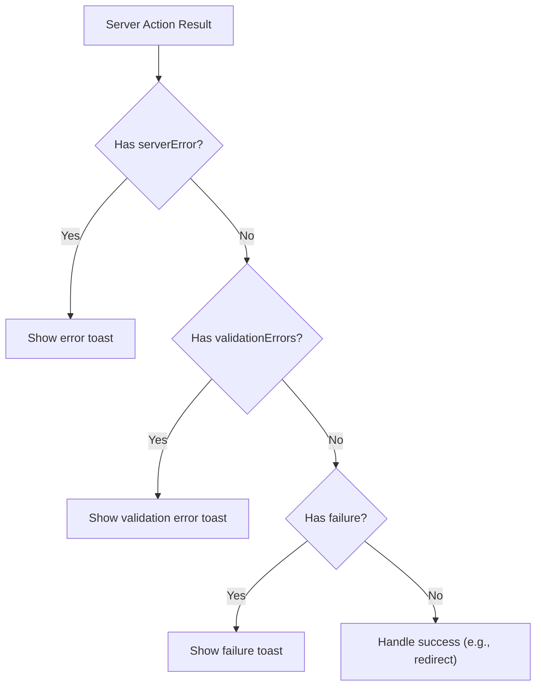
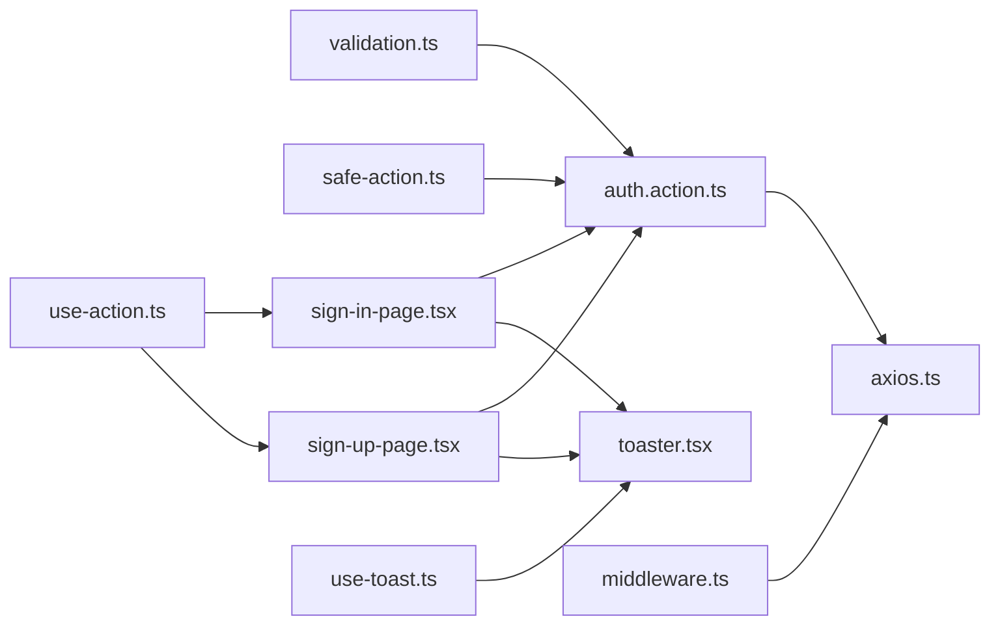

# Validation and Error Handling

<cite>
**Referenced Files in This Document**
- [safe-action.ts](file://lib/safe-action.ts)
- [validation.ts](file://lib/validation.ts)
- [auth.action.ts](file://actions/auth.action.ts)
- [sign-in-page.tsx](file://components/auth/sign-in-page.tsx)
- [sign-up-page.tsx](file://components/auth/sign-up-page.tsx)
- [use-action.ts](file://hooks/use-action.ts)
- [use-toast.ts](file://hooks/use-toast.ts)
- [toaster.tsx](file://components/ui/toaster.tsx)
- [index.ts](file://types/index.ts)
- [axios.ts](file://http/axios.ts)
- [middleware.ts](file://middleware.ts)
</cite>

## Table of Contents
1. [Introduction](#introduction)
2. [Project Structure](#project-structure)
3. [Core Components](#core-components)
4. [Architecture Overview](#architecture-overview)
5. [Detailed Component Analysis](#detailed-component-analysis)
6. [Dependency Analysis](#dependency-analysis)
7. [Performance Considerations](#performance-considerations)
8. [Troubleshooting Guide](#troubleshooting-guide)
9. [Conclusion](#conclusion)

## Introduction
This document explains Optim Bozor’s validation and error handling implementation within the Server Actions pattern. It focuses on the safe-action wrapper that ensures consistent error handling, type safety, and validation integration, along with the Zod schema validation system covering login, registration, OTP verification, and email schemas. It also documents how validation errors propagate to the client, practical examples for implementing validation schemas and handling failures, and best practices for error messages, user feedback, and debugging server actions.

## Project Structure
The validation and error handling system spans several layers:
- Safe action client creation and usage in server actions
- Zod schemas for input validation
- Frontend components that integrate client-side Zod validation and server action calls
- Shared hooks for consistent error feedback and toast notifications
- HTTP client configuration for server action network calls

**Diagram sources**
- [safe-action.ts:1-4](file://lib/safe-action.ts#L1-L4)
- [auth.action.ts:1-51](file://actions/auth.action.ts#L1-L51)
- [validation.ts:1-96](file://lib/validation.ts#L1-L96)
- [sign-in-page.tsx:1-178](file://components/auth/sign-in-page.tsx#L1-L178)
- [sign-up-page.tsx:1-436](file://components/auth/sign-up-page.tsx#L1-L436)
- [use-action.ts:1-16](file://hooks/use-action.ts#L1-L16)
- [use-toast.ts:1-192](file://hooks/use-toast.ts#L1-L192)
- [toaster.tsx:1-36](file://components/ui/toaster.tsx#L1-L36)
- [axios.ts:1-10](file://http/axios.ts#L1-L10)
- [middleware.ts:1-25](file://middleware.ts#L1-L25)

**Section sources**
- [safe-action.ts:1-4](file://lib/safe-action.ts#L1-L4)
- [validation.ts:1-96](file://lib/validation.ts#L1-L96)
- [auth.action.ts:1-51](file://actions/auth.action.ts#L1-L51)
- [sign-in-page.tsx:1-178](file://components/auth/sign-in-page.tsx#L1-L178)
- [sign-up-page.tsx:1-436](file://components/auth/sign-up-page.tsx#L1-L436)
- [use-action.ts:1-16](file://hooks/use-action.ts#L1-L16)
- [use-toast.ts:1-192](file://hooks/use-toast.ts#L1-L192)
- [toaster.tsx:1-36](file://components/ui/toaster.tsx#L1-L36)
- [axios.ts:1-10](file://http/axios.ts#L1-L10)
- [middleware.ts:1-25](file://middleware.ts#L1-L25)

## Core Components
- Safe action client: Centralized server action client configured via next-safe-action.
- Zod schemas: Strongly typed validation schemas for login, registration, OTP verification, email, and related inputs.
- Server actions: Wrapped with schema validation and return a unified shape for client consumption.
- Frontend integration: Client components use Zod forms and call server actions, handling returned errors and success states.
- Error feedback: Shared hook and toast system provide consistent user feedback.

**Section sources**
- [safe-action.ts:1-4](file://lib/safe-action.ts#L1-L4)
- [validation.ts:1-96](file://lib/validation.ts#L1-L96)
- [auth.action.ts:13-50](file://actions/auth.action.ts#L13-L50)
- [index.ts:54-73](file://types/index.ts#L54-L73)
- [sign-in-page.tsx:29-52](file://components/auth/sign-in-page.tsx#L29-L52)
- [sign-up-page.tsx:48-103](file://components/auth/sign-up-page.tsx#L48-L103)
- [use-action.ts:4-12](file://hooks/use-action.ts#L4-L12)
- [use-toast.ts:142-169](file://hooks/use-toast.ts#L142-L169)

## Architecture Overview
The system follows a layered approach:
- Client components define Zod forms and submit to server actions.
- Server actions validate inputs using Zod schemas and forward validated data to backend APIs via axios.
- Responses are normalized and returned to the client, which interprets serverError and validationErrors fields.
- Toast notifications provide immediate user feedback.

**Diagram sources**
- [auth.action.ts:13-39](file://actions/auth.action.ts#L13-L39)
- [safe-action.ts:1-4](file://lib/safe-action.ts#L1-L4)
- [axios.ts:5-9](file://http/axios.ts#L5-L9)
- [sign-in-page.tsx:39-52](file://components/auth/sign-in-page.tsx#L39-L52)
- [sign-up-page.tsx:48-103](file://components/auth/sign-up-page.tsx#L48-L103)

## Detailed Component Analysis

### Safe Action Wrapper
The safe action wrapper centralizes server action behavior:
- Creates a typed action client using next-safe-action.
- Server actions attach a Zod schema and return a normalized result shape.

**Diagram sources**
- [safe-action.ts:1-4](file://lib/safe-action.ts#L1-L4)
- [auth.action.ts:13-39](file://actions/auth.action.ts#L13-L39)
- [axios.ts:5-9](file://http/axios.ts#L5-L9)

**Section sources**
- [safe-action.ts:1-4](file://lib/safe-action.ts#L1-L4)
- [auth.action.ts:13-39](file://actions/auth.action.ts#L13-L39)

### Zod Validation System
The validation module defines schemas for:
- Login: email and password
- Registration: full name, email, password, optional phone
- OTP verification: 6-character OTP and email
- Email-only: email for OTP send
- Additional schemas for phone, product, password updates, search params, and user updates

Key characteristics:
- Explicit error messages for user-friendly feedback
- Optional fields where appropriate
- Phone format enforced with regex
- Password confirmation validated via refine

**Diagram sources**
- [validation.ts:3-96](file://lib/validation.ts#L3-L96)

**Section sources**
- [validation.ts:3-96](file://lib/validation.ts#L3-L96)

### Server Actions: Authentication Workflows
Server actions wrap HTTP calls with schema validation:
- login: validates email/password and posts to login endpoint
- register: validates registration fields and posts to register endpoint
- sendOtp: validates email and posts to OTP send endpoint
- verifyOtp: validates OTP and email and posts to OTP verify endpoint
- oauthLogin: validates minimal fields for OAuth login

**Diagram sources**
- [sign-in-page.tsx:39-52](file://components/auth/sign-in-page.tsx#L39-L52)
- [auth.action.ts:13-18](file://actions/auth.action.ts#L13-L18)
- [axios.ts:5-9](file://http/axios.ts#L5-L9)

**Section sources**
- [auth.action.ts:13-50](file://actions/auth.action.ts#L13-L50)
- [sign-in-page.tsx:39-52](file://components/auth/sign-in-page.tsx#L39-L52)

### Frontend Integration: Sign-In and Sign-Up
- Sign-In Page:
  - Uses Zod resolver with loginSchema
  - Calls login server action
  - Interprets serverError, validationErrors, and failure messages
  - Provides success toast and redirects on success

- Sign-Up Page:
  - Uses Zod resolver with registerSchema and otpSchema
  - Sends OTP, verifies OTP, then registers
  - Manages UI states for OTP entry and resend
  - Uses shared useAction hook for loading and error feedback
  - Displays toasts for success and failure

**Diagram sources**
- [sign-up-page.tsx:48-103](file://components/auth/sign-up-page.tsx#L48-L103)
- [auth.action.ts:27-49](file://actions/auth.action.ts#L27-L49)
- [axios.ts:5-9](file://http/axios.ts#L5-L9)

**Section sources**
- [sign-in-page.tsx:29-52](file://components/auth/sign-in-page.tsx#L29-L52)
- [sign-up-page.tsx:38-103](file://components/auth/sign-up-page.tsx#L38-L103)
- [use-action.ts:4-12](file://hooks/use-action.ts#L4-L12)

### Error Handling Strategies and Propagation
- Server-side:
  - next-safe-action validates inputs and surfaces validationErrors
  - Server actions return a normalized shape defined by ReturnActionType
  - Backend APIs return structured responses consumed by server actions

- Client-side:
  - Components check for serverError and validationErrors
  - On failure, useAction hook triggers a destructive toast via use-toast
  - Success paths trigger positive toasts and navigation

**Diagram sources**
- [sign-in-page.tsx:42-47](file://components/auth/sign-in-page.tsx#L42-L47)
- [sign-up-page.tsx:51-57](file://components/auth/sign-up-page.tsx#L51-L57)
- [index.ts:54-73](file://types/index.ts#L54-L73)
- [use-action.ts:7-10](file://hooks/use-action.ts#L7-L10)
- [use-toast.ts:142-169](file://hooks/use-toast.ts#L142-L169)

**Section sources**
- [sign-in-page.tsx:42-52](file://components/auth/sign-in-page.tsx#L42-L52)
- [sign-up-page.tsx:51-103](file://components/auth/sign-up-page.tsx#L51-L103)
- [index.ts:54-73](file://types/index.ts#L54-L73)
- [use-action.ts:7-10](file://hooks/use-action.ts#L7-L10)
- [use-toast.ts:142-169](file://hooks/use-toast.ts#L142-L169)

### Practical Examples
- Implementing a validation schema:
  - Define a Zod object schema in the validation module with appropriate refinements and error messages
  - Reference the schema in a server action via .schema(schema)
  - Use the same schema in the frontend component with a Zod resolver

- Handling validation failures:
  - On the client, check for validationErrors in the server action result
  - Display user-friendly messages via toasts

- Managing server action errors:
  - Check for serverError and display generic error messaging
  - Ensure loading states are toggled appropriately

**Section sources**
- [validation.ts:17-24](file://lib/validation.ts#L17-L24)
- [auth.action.ts:20-25](file://actions/auth.action.ts#L20-L25)
- [sign-up-page.tsx:48-64](file://components/auth/sign-up-page.tsx#L48-L64)

### Best Practices for Error Messages, User Feedback, and Debugging
- Keep error messages concise and actionable
- Use the shared toast system for consistent feedback
- Distinguish between validationErrors (schema-level) and failure (business logic)
- Provide clear success feedback after successful operations
- For debugging, log server action results and inspect network responses; ensure axios timeouts and base URLs are configured correctly

**Section sources**
- [use-toast.ts:142-169](file://hooks/use-toast.ts#L142-L169)
- [axios.ts:5-9](file://http/axios.ts#L5-L9)

## Dependency Analysis
The system exhibits low coupling and high cohesion:
- Server actions depend on the safe action client and Zod schemas
- Frontend components depend on Zod schemas and server actions
- Toast system is decoupled and reusable across components
- Middleware applies rate limiting at the edge

**Diagram sources**
- [validation.ts:1-96](file://lib/validation.ts#L1-L96)
- [auth.action.ts:1-51](file://actions/auth.action.ts#L1-L51)
- [safe-action.ts:1-4](file://lib/safe-action.ts#L1-L4)
- [axios.ts:1-10](file://http/axios.ts#L1-L10)
- [sign-in-page.tsx:1-178](file://components/auth/sign-in-page.tsx#L1-L178)
- [sign-up-page.tsx:1-436](file://components/auth/sign-up-page.tsx#L1-L436)
- [use-action.ts:1-16](file://hooks/use-action.ts#L1-L16)
- [use-toast.ts:1-192](file://hooks/use-toast.ts#L1-L192)
- [toaster.tsx:1-36](file://components/ui/toaster.tsx#L1-L36)
- [middleware.ts:1-25](file://middleware.ts#L1-L25)

**Section sources**
- [validation.ts:1-96](file://lib/validation.ts#L1-L96)
- [auth.action.ts:1-51](file://actions/auth.action.ts#L1-L51)
- [safe-action.ts:1-4](file://lib/safe-action.ts#L1-L4)
- [axios.ts:1-10](file://http/axios.ts#L1-L10)
- [sign-in-page.tsx:1-178](file://components/auth/sign-in-page.tsx#L1-L178)
- [sign-up-page.tsx:1-436](file://components/auth/sign-up-page.tsx#L1-L436)
- [use-action.ts:1-16](file://hooks/use-action.ts#L1-L16)
- [use-toast.ts:1-192](file://hooks/use-toast.ts#L1-L192)
- [toaster.tsx:1-36](file://components/ui/toaster.tsx#L1-L36)
- [middleware.ts:1-25](file://middleware.ts#L1-L25)

## Performance Considerations
- Network timeouts: axios client has a 15-second timeout; adjust as needed for production stability
- Rate limiting: Middleware enforces a per-IP request limit to prevent abuse
- Toast batching: The toast system limits concurrent toasts to improve UX and reduce overhead

**Section sources**
- [axios.ts:8-9](file://http/axios.ts#L8-L9)
- [middleware.ts:9-20](file://middleware.ts#L9-L20)
- [use-toast.ts:8-9](file://hooks/use-toast.ts#L8-L9)

## Troubleshooting Guide
- Validation fails unexpectedly:
  - Verify the schema attached to the server action matches the client submission
  - Confirm the frontend Zod resolver aligns with the server schema
- Server action returns serverError:
  - Inspect backend API responses and ensure axiosClient receives expected payloads
  - Check middleware for rate limiting blocking requests
- No visible error messages:
  - Ensure the toast system is initialized and components call onError/useAction hook
  - Confirm that failure messages are present in the response payload

**Section sources**
- [auth.action.ts:13-39](file://actions/auth.action.ts#L13-L39)
- [sign-in-page.tsx:42-52](file://components/auth/sign-in-page.tsx#L42-L52)
- [sign-up-page.tsx:51-103](file://components/auth/sign-up-page.tsx#L51-L103)
- [use-action.ts:7-10](file://hooks/use-action.ts#L7-L10)
- [middleware.ts:9-20](file://middleware.ts#L9-L20)

## Conclusion
Optim Bozor’s Server Actions pattern leverages a safe action client and Zod schemas to deliver robust, type-safe validation and consistent error handling. The frontend components integrate client-side Zod forms with server actions, ensuring clear user feedback through a shared toast system. By following the outlined patterns and best practices, developers can maintain predictable validation flows, reliable error propagation, and a smooth user experience.