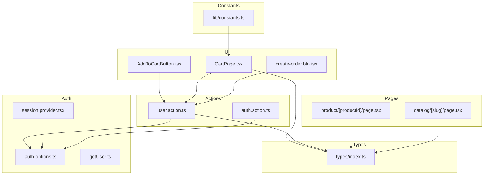
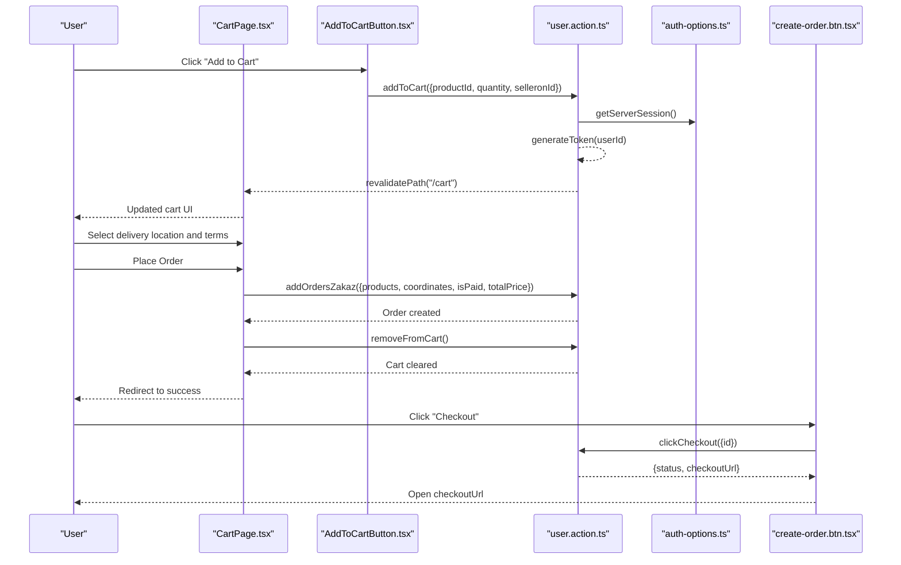
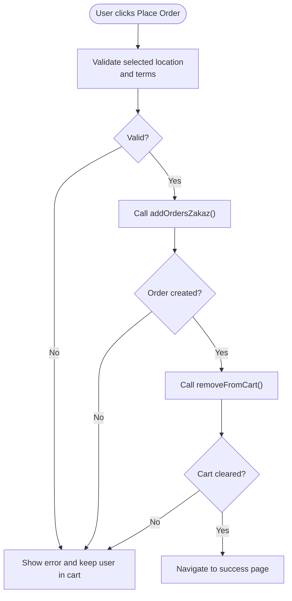
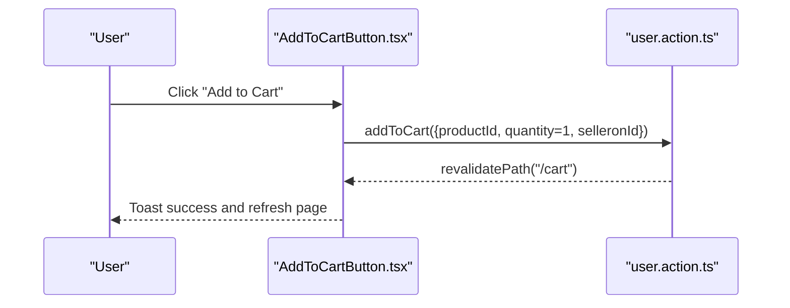
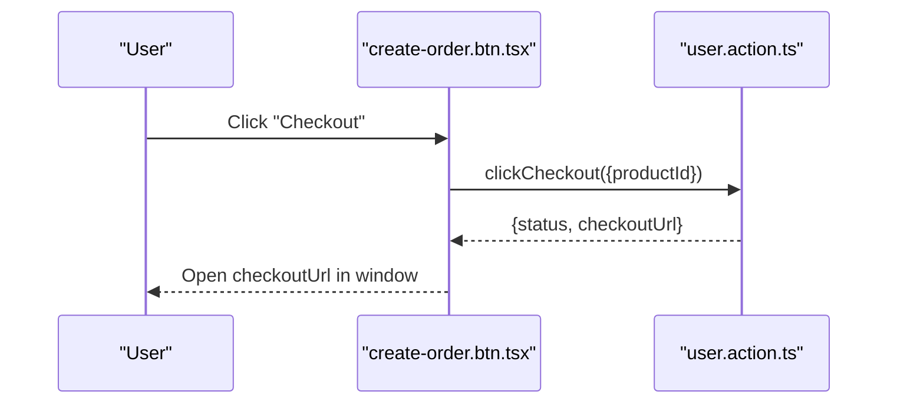
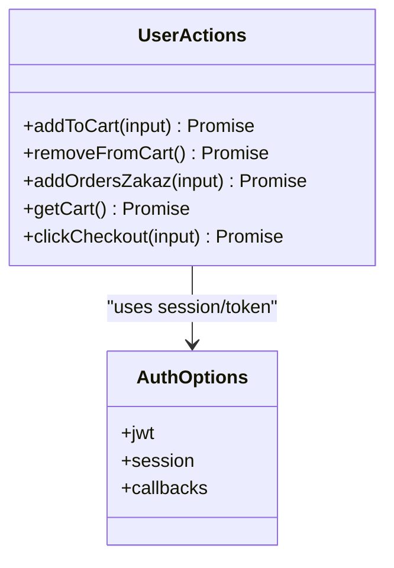
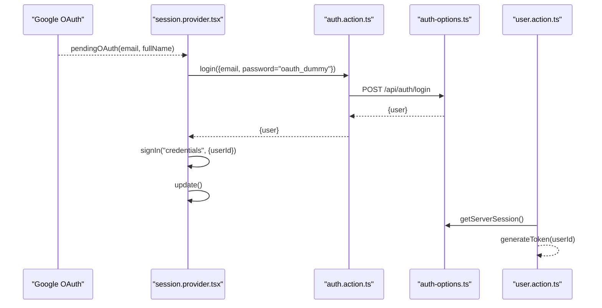
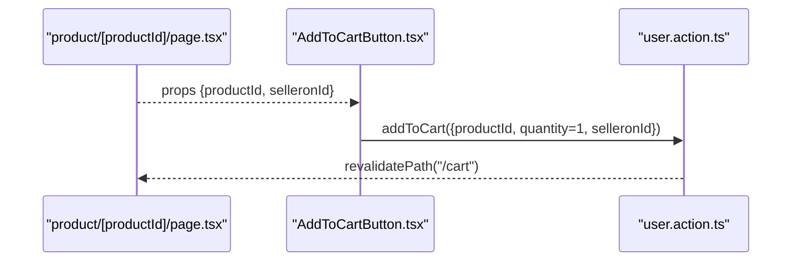
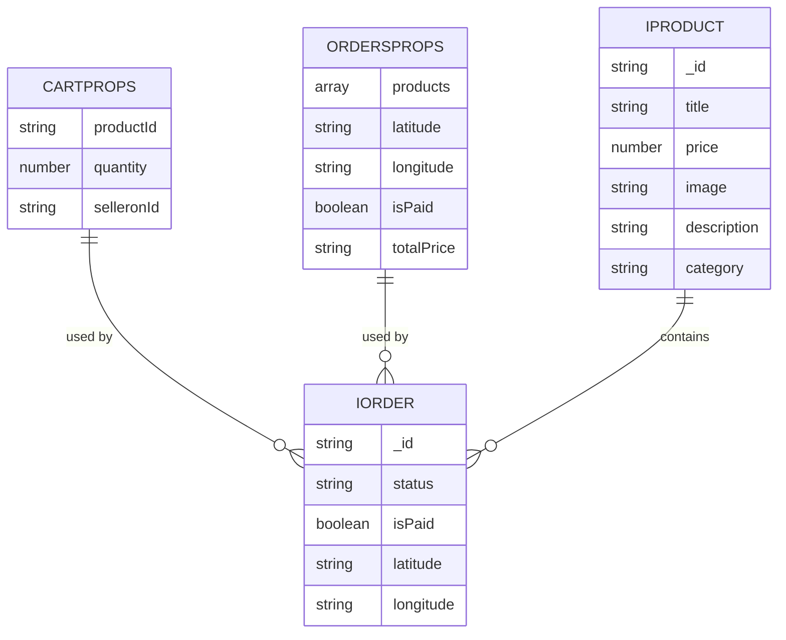
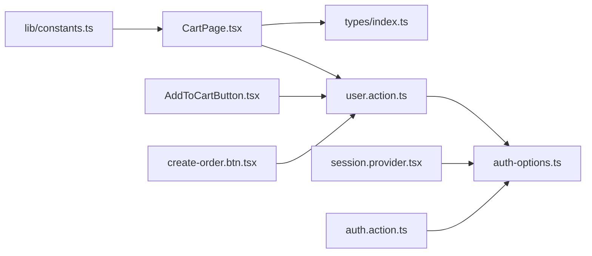

# Cart Integration

<cite>
**Referenced Files in This Document**
- [CartPage.tsx](file://app/(root)/cart/CartPage.tsx)
- [AddToCartButton.tsx](file://app/(root)/product/_components/AddToCartButton.tsx)
- [create-order.btn.tsx](file://app/(root)/product/_components/create-order.btn.tsx)
- [user.action.ts](file://actions/user.action.ts)
- [auth.action.ts](file://actions/auth.action.ts)
- [session.provider.tsx](file://components/providers/session.provider.tsx)
- [auth-options.ts](file://lib/auth-options.ts)
- [getUser.ts](file://lib/getUser.ts)
- [index.ts](file://types/index.ts)
- [page.tsx](file://app/(root)/product/[productId]/page.tsx)
- [page.tsx](file://app/(root)/catalog/[slug]/page.tsx)
- [constants.ts](file://lib/constants.ts)
</cite>

## Table of Contents
1. [Introduction](#introduction)
2. [Project Structure](#project-structure)
3. [Core Components](#core-components)
4. [Architecture Overview](#architecture-overview)
5. [Detailed Component Analysis](#detailed-component-analysis)
6. [Dependency Analysis](#dependency-analysis)
7. [Performance Considerations](#performance-considerations)
8. [Troubleshooting Guide](#troubleshooting-guide)
9. [Conclusion](#conclusion)

## Introduction
This document explains how the cart system integrates with other application modules. It covers:
- How cart operations relate to the product catalog and inventory
- Authentication-driven session-based cart persistence
- Cross-device cart synchronization via sessions
- The cart-to-order workflow and checkout integration
- Payment system coordination
- Cleanup mechanisms and abandoned cart handling
- Validation rules, availability checks, and error scenarios during checkout transition

## Project Structure
The cart system spans UI pages, client components, server actions, and authentication providers. Key areas:
- Cart UI and ordering: app/(root)/cart/CartPage.tsx
- Add-to-cart button: app/(root)/product/_components/AddToCartButton.tsx
- Direct checkout button: app/(root)/product/_components/create-order.btn.tsx
- Server actions for cart/order/payment: actions/user.action.ts
- Authentication and session management: components/providers/session.provider.tsx, lib/auth-options.ts, actions/auth.action.ts
- Types and models: types/index.ts
- Product and catalog pages: app/(root)/product/[productId]/page.tsx, app/(root)/catalog/[slug]/page.tsx
- Constants and transaction states: lib/constants.ts

**Diagram sources**
- [CartPage.tsx](file://app/(root)/cart/CartPage.tsx#L1-L500)
- [AddToCartButton.tsx](file://app/(root)/product/_components/AddToCartButton.tsx#L1-L72)
- [create-order.btn.tsx](file://app/(root)/product/_components/create-order.btn.tsx#L1-L53)
- [user.action.ts:1-296](file://actions/user.action.ts#L1-L296)
- [auth.action.ts:1-51](file://actions/auth.action.ts#L1-L51)
- [session.provider.tsx:1-39](file://components/providers/session.provider.tsx#L1-L39)
- [auth-options.ts:1-128](file://lib/auth-options.ts#L1-L128)
- [getUser.ts:1-10](file://lib/getUser.ts#L1-L10)
- [index.ts:1-209](file://types/index.ts#L1-L209)
- [page.tsx](file://app/(root)/product/[productId]/page.tsx#L1-L222)
- [page.tsx](file://app/(root)/catalog/[slug]/page.tsx#L1-L26)
- [constants.ts:1-25](file://lib/constants.ts#L1-L25)

**Section sources**
- [CartPage.tsx](file://app/(root)/cart/CartPage.tsx#L1-L500)
- [user.action.ts:1-296](file://actions/user.action.ts#L1-L296)
- [auth-options.ts:1-128](file://lib/auth-options.ts#L1-L128)
- [index.ts:1-209](file://types/index.ts#L1-L209)

## Core Components
- Cart UI and ordering: renders grouped products by seller, handles quantity updates, removal, location selection, and order placement. It also triggers cart cleanup after successful order creation.
- Add-to-cart button: adds a single unit to the cart and refreshes the UI.
- Direct checkout button: initiates external payment checkout via a third-party service.
- Server actions: encapsulate cart CRUD, order creation, cart retrieval, and payment checkout. They enforce authentication and use JWT tokens for backend requests.
- Authentication and session: NextAuth with JWT strategy, session persistence, and automatic OAuth bridging.

**Section sources**
- [CartPage.tsx](file://app/(root)/cart/CartPage.tsx#L109-L247)
- [AddToCartButton.tsx](file://app/(root)/product/_components/AddToCartButton.tsx#L15-L40)
- [create-order.btn.tsx](file://app/(root)/product/_components/create-order.btn.tsx#L19-L31)
- [user.action.ts:120-242](file://actions/user.action.ts#L120-L242)
- [auth-options.ts:8-127](file://lib/auth-options.ts#L8-L127)

## Architecture Overview
The cart system integrates with:
- Product catalog: product pages supply productId and selleronId to add to cart.
- Inventory validation and stock updates: performed server-side via actions; client UI reflects server responses and reverts on errors.
- Authentication: server actions require a valid session; cart persistence relies on session identity.
- Checkout and payments: two flows are supported—direct checkout via external provider and cash-on-delivery order placement.

**Diagram sources**
- [CartPage.tsx](file://app/(root)/cart/CartPage.tsx#L155-L247)
- [AddToCartButton.tsx](file://app/(root)/product/_components/AddToCartButton.tsx#L20-L30)
- [create-order.btn.tsx](file://app/(root)/product/_components/create-order.btn.tsx#L19-L31)
- [user.action.ts:120-242](file://actions/user.action.ts#L120-L242)
- [auth-options.ts:87-121](file://lib/auth-options.ts#L87-L121)

## Detailed Component Analysis

### CartPage: Cart UI, Grouping, Validation, and Order Placement
- Groups cart items by seller for per-seller totals and display.
- Updates quantities locally and syncs with server; on server error, reverts UI.
- Validates location and delivery eligibility; disables order button if invalid.
- Supports cash-on-delivery vs paid-in-advance via a checkbox.
- On successful order:
  - Calls order creation endpoint
  - Clears cart via server action
  - Navigates to success page

**Diagram sources**
- [CartPage.tsx](file://app/(root)/cart/CartPage.tsx#L209-L247)
- [user.action.ts:179-215](file://actions/user.action.ts#L179-L215)
- [user.action.ts:160-177](file://actions/user.action.ts#L160-L177)

**Section sources**
- [CartPage.tsx](file://app/(root)/cart/CartPage.tsx#L88-L107)
- [CartPage.tsx](file://app/(root)/cart/CartPage.tsx#L155-L188)
- [CartPage.tsx](file://app/(root)/cart/CartPage.tsx#L209-L247)
- [user.action.ts:179-215](file://actions/user.action.ts#L179-L215)
- [user.action.ts:160-177](file://actions/user.action.ts#L160-L177)

### AddToCartButton: Single Product Addition
- Adds one unit to the cart with immediate UI feedback.
- Refreshes product pages to reflect cart changes.
- Uses server action with authentication and token generation.

**Diagram sources**
- [AddToCartButton.tsx](file://app/(root)/product/_components/AddToCartButton.tsx#L20-L30)
- [user.action.ts:120-143](file://actions/user.action.ts#L120-L143)

**Section sources**
- [AddToCartButton.tsx](file://app/(root)/product/_components/AddToCartButton.tsx#L15-L40)
- [user.action.ts:120-143](file://actions/user.action.ts#L120-L143)

### Direct Checkout Button: External Payment Integration
- Initiates payment via external checkout service.
- Returns a checkout URL; client opens it.

**Diagram sources**
- [create-order.btn.tsx](file://app/(root)/product/_components/create-order.btn.tsx#L19-L31)
- [user.action.ts:229-242](file://actions/user.action.ts#L229-L242)

**Section sources**
- [create-order.btn.tsx](file://app/(root)/product/_components/create-order.btn.tsx#L10-L31)
- [user.action.ts:229-242](file://actions/user.action.ts#L229-L242)

### Server Actions: Cart, Orders, and Payments
- addToCart: validates session, generates token, posts to cart endpoint, revalidates cart and home paths.
- removeFromCart: clears current user’s cart.
- addOrdersZakaz: creates an order with products, coordinates, payment mode, and total price.
- getCart: retrieves current cart for authenticated users.
- clickCheckout: initiates external checkout and returns URL.

**Diagram sources**
- [user.action.ts:120-242](file://actions/user.action.ts#L120-L242)
- [auth-options.ts:87-121](file://lib/auth-options.ts#L87-L121)

**Section sources**
- [user.action.ts:120-143](file://actions/user.action.ts#L120-L143)
- [user.action.ts:160-177](file://actions/user.action.ts#L160-L177)
- [user.action.ts:179-215](file://actions/user.action.ts#L179-L215)
- [user.action.ts:229-242](file://actions/user.action.ts#L229-L242)

### Authentication and Session-Based Cart Persistence
- NextAuth with JWT strategy stores user identity and profile in session.
- Automatic OAuth bridging: when Google login completes, the provider sets pendingOAuth; a client-side effect logs in via credentials and refreshes session.
- Server actions rely on getServerSession to enforce authentication and attach user ID to requests.

**Diagram sources**
- [session.provider.tsx:7-27](file://components/providers/session.provider.tsx#L7-L27)
- [auth.action.ts:13-18](file://actions/auth.action.ts#L13-L18)
- [auth-options.ts:87-121](file://lib/auth-options.ts#L87-L121)
- [user.action.ts:125-136](file://actions/user.action.ts#L125-L136)

**Section sources**
- [session.provider.tsx:7-27](file://components/providers/session.provider.tsx#L7-L27)
- [auth.action.ts:13-18](file://actions/auth.action.ts#L13-L18)
- [auth-options.ts:87-121](file://lib/auth-options.ts#L87-L121)
- [user.action.ts:125-136](file://actions/user.action.ts#L125-L136)

### Product Catalog Integration
- Product page supplies productId and selleronId to AddToCartButton.
- Catalog pages load subcategories and render product grids.

**Diagram sources**
- [page.tsx](file://app/(root)/product/[productId]/page.tsx#L148-L151)
- [AddToCartButton.tsx](file://app/(root)/product/_components/AddToCartButton.tsx#L20-L30)
- [user.action.ts:120-143](file://actions/user.action.ts#L120-L143)

**Section sources**
- [page.tsx](file://app/(root)/product/[productId]/page.tsx#L148-L151)
- [page.tsx](file://app/(root)/catalog/[slug]/page.tsx#L15-L22)

### Types and Models
- CartProps and OrdersProps define payload shapes for cart and order operations.
- IProduct and related interfaces model product, seller, and order entities.

**Diagram sources**
- [index.ts:31-52](file://types/index.ts#L31-L52)
- [index.ts:105-151](file://types/index.ts#L105-L151)
- [index.ts:171-179](file://types/index.ts#L171-L179)

**Section sources**
- [index.ts:31-52](file://types/index.ts#L31-L52)
- [index.ts:105-151](file://types/index.ts#L105-L151)
- [index.ts:171-179](file://types/index.ts#L171-L179)

## Dependency Analysis
- UI components depend on server actions for cart/order operations.
- Server actions depend on NextAuth for session and token generation.
- CartPage depends on types for product and order models.
- Constants module defines transaction states used in order processing.

**Diagram sources**
- [CartPage.tsx](file://app/(root)/cart/CartPage.tsx#L1-L500)
- [AddToCartButton.tsx](file://app/(root)/product/_components/AddToCartButton.tsx#L1-L72)
- [create-order.btn.tsx](file://app/(root)/product/_components/create-order.btn.tsx#L1-L53)
- [user.action.ts:1-296](file://actions/user.action.ts#L1-L296)
- [auth-options.ts:1-128](file://lib/auth-options.ts#L1-L128)
- [auth.action.ts:1-51](file://actions/auth.action.ts#L1-L51)
- [index.ts:1-209](file://types/index.ts#L1-L209)
- [constants.ts:19-24](file://lib/constants.ts#L19-L24)

**Section sources**
- [CartPage.tsx](file://app/(root)/cart/CartPage.tsx#L1-L500)
- [user.action.ts:1-296](file://actions/user.action.ts#L1-L296)
- [auth-options.ts:1-128](file://lib/auth-options.ts#L1-L128)
- [index.ts:1-209](file://types/index.ts#L1-L209)
- [constants.ts:19-24](file://lib/constants.ts#L19-L24)

## Performance Considerations
- Client-side re-renders: addToCart triggers revalidation for cart and home pages; avoid unnecessary revalidation by batching updates when possible.
- Local state updates: CartPage updates UI immediately upon quantity change; ensure server responses are fast to minimize revert flicker.
- Token generation: Server actions generate a token per request; cache tokens per session on the server if latency becomes an issue.
- Pagination and caching: Product and order lists use searchParamsSchema; ensure efficient backend queries and appropriate caching headers.

## Troubleshooting Guide
Common issues and resolutions:
- Not logged in:
  - Symptom: addToCart/removeFromCart/addOrdersZakaz return a failure indicating login requirement.
  - Resolution: Ensure user is authenticated via NextAuth; check session provider initialization.
  - Section sources
    - [user.action.ts:125-128](file://actions/user.action.ts#L125-L128)
    - [user.action.ts:161-164](file://actions/user.action.ts#L161-L164)
    - [user.action.ts:187-189](file://actions/user.action.ts#L187-L189)
- Server errors during cart update:
  - Symptom: UI reverts quantity change after server error.
  - Resolution: Verify backend endpoints and network connectivity; inspect returned serverError field.
  - Section sources
    - [CartPage.tsx](file://app/(root)/cart/CartPage.tsx#L179-L187)
- Invalid delivery location:
  - Symptom: Order button disabled or error alert shown.
  - Resolution: Ensure location is within Bukhara; enable button only when valid.
  - Section sources
    - [CartPage.tsx](file://app/(root)/cart/CartPage.tsx#L434-L463)
- Payment checkout failures:
  - Symptom: clickCheckout returns failure or empty data.
  - Resolution: Validate productId, ensure external checkout service is reachable, and handle onError gracefully.
  - Section sources
    - [create-order.btn.tsx](file://app/(root)/product/_components/create-order.btn.tsx#L22-L27)
    - [user.action.ts:236-241](file://actions/user.action.ts#L236-L241)
- Abandoned cart handling:
  - Recommendation: Implement periodic server-side cleanup jobs to remove stale carts for inactive users. Track last activity timestamps and prune after a threshold (e.g., 7 days).
  - Section sources
    - [user.action.ts:217-227](file://actions/user.action.ts#L217-L227)

## Conclusion
The cart system integrates tightly with authentication, product catalog, and payment workflows. Session-based persistence ensures continuity across devices, while server actions enforce validation and maintain data consistency. The dual checkout paths support both cash-on-delivery and external payment providers. Robust error handling and UI reversion provide resilience against transient failures. For production hardening, consider adding automated cart cleanup and enhanced inventory validation hooks.