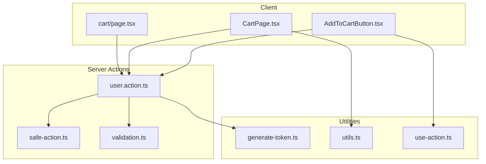
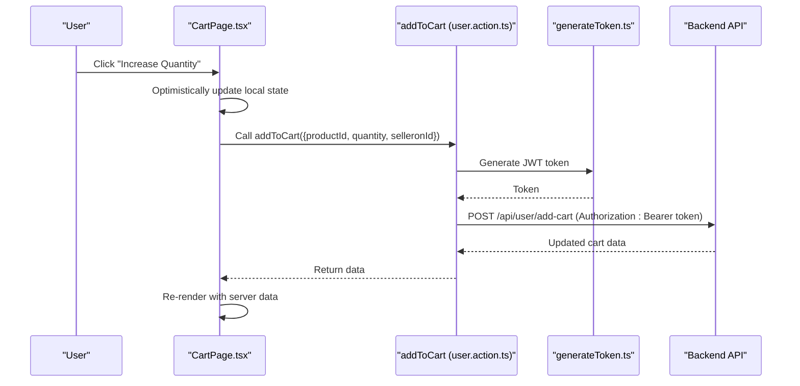
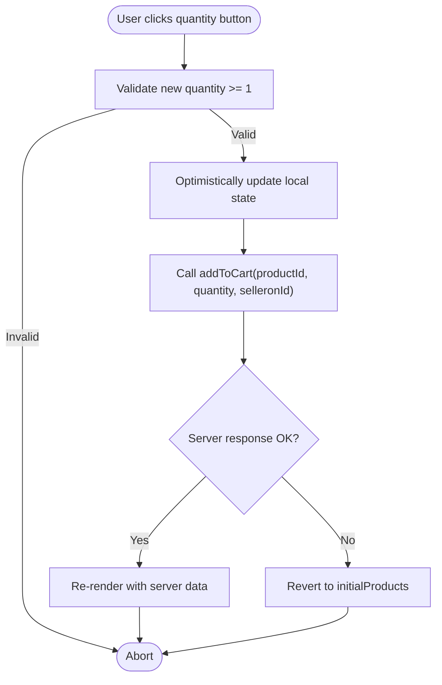
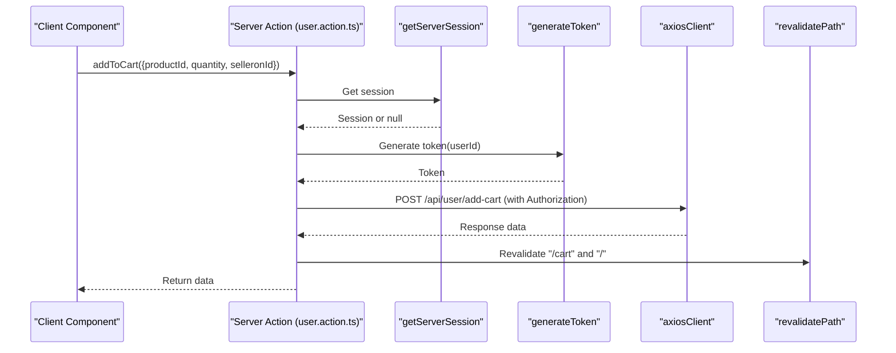
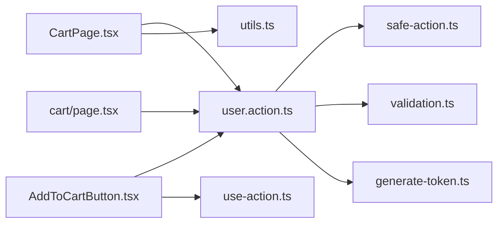

# Cart State Management

<cite>
**Referenced Files in This Document**
- [CartPage.tsx](file://app/(root)/cart/CartPage.tsx)
- [page.tsx](file://app/(root)/cart/page.tsx)
- [AddToCartButton.tsx](file://app/(root)/product/_components/AddToCartButton.tsx)
- [user.action.ts](file://actions/user.action.ts)
- [safe-action.ts](file://lib/safe-action.ts)
- [validation.ts](file://lib/validation.ts)
- [utils.ts](file://lib/utils.ts)
- [generate-token.ts](file://lib/generate-token.ts)
- [use-action.ts](file://hooks/use-action.ts)
</cite>

## Table of Contents
1. [Introduction](#introduction)
2. [Project Structure](#project-structure)
3. [Core Components](#core-components)
4. [Architecture Overview](#architecture-overview)
5. [Detailed Component Analysis](#detailed-component-analysis)
6. [Dependency Analysis](#dependency-analysis)
7. [Performance Considerations](#performance-considerations)
8. [Troubleshooting Guide](#troubleshooting-guide)
9. [Conclusion](#conclusion)

## Introduction
This document explains the cart state management implementation in the application. It focuses on the server actions pattern used for cart operations (add to cart, remove from cart, quantity updates), state synchronization between client and server, cart persistence, and session-based cart merging. It also documents Zod validation schemas, error handling strategies, security considerations, practical mutation examples, integration with the global state management system, and performance optimization techniques for large cart contents.

## Project Structure
The cart feature spans client UI pages, server actions, and shared utilities:
- Client-side cart page renders and mutates cart state locally while synchronizing with the server.
- Server actions encapsulate cart operations and enforce authentication and validation.
- Shared utilities provide token generation, safe action client, and formatting helpers.

**Diagram sources**
- [CartPage.tsx](file://app/(root)/cart/CartPage.tsx#L1-L500)
- [page.tsx](file://app/(root)/cart/page.tsx#L1-L21)
- [AddToCartButton.tsx](file://app/(root)/product/_components/AddToCartButton.tsx#L1-L45)
- [user.action.ts:1-297](file://actions/user.action.ts#L1-L297)
- [safe-action.ts:1-4](file://lib/safe-action.ts#L1-L4)
- [validation.ts:1-96](file://lib/validation.ts#L1-L96)
- [generate-token.ts:1-11](file://lib/generate-token.ts#L1-L11)
- [utils.ts:1-73](file://lib/utils.ts#L1-L73)
- [use-action.ts:1-16](file://hooks/use-action.ts#L1-L16)

**Section sources**
- [CartPage.tsx](file://app/(root)/cart/CartPage.tsx#L1-L500)
- [page.tsx](file://app/(root)/cart/page.tsx#L1-L21)
- [AddToCartButton.tsx](file://app/(root)/product/_components/AddToCartButton.tsx#L1-L45)
- [user.action.ts:1-297](file://actions/user.action.ts#L1-L297)
- [safe-action.ts:1-4](file://lib/safe-action.ts#L1-L4)
- [validation.ts:1-96](file://lib/validation.ts#L1-L96)
- [generate-token.ts:1-11](file://lib/generate-token.ts#L1-L11)
- [utils.ts:1-73](file://lib/utils.ts#L1-L73)
- [use-action.ts:1-16](file://hooks/use-action.ts#L1-L16)

## Core Components
- CartPage: Client component managing local cart state, rendering grouped items by seller, and orchestrating cart mutations.
- AddToCartButton: Client component invoking add-to-cart action with optimistic UI updates.
- user.action.ts: Server actions module implementing addToCart, removeFromCart, addOrdersZakaz, and getCart with authentication and revalidation.
- safe-action.ts: Centralized safe action client creation for typed server actions.
- validation.ts: Zod schemas used by server actions for input validation.
- generate-token.ts: JWT token generation for backend requests.
- utils.ts: Formatting utilities for prices and URLs.
- use-action.ts: Hook for consistent loading/error handling in client components.

**Section sources**
- [CartPage.tsx](file://app/(root)/cart/CartPage.tsx#L1-L500)
- [AddToCartButton.tsx](file://app/(root)/product/_components/AddToCartButton.tsx#L1-L45)
- [user.action.ts:120-228](file://actions/user.action.ts#L120-L228)
- [safe-action.ts:1-4](file://lib/safe-action.ts#L1-L4)
- [validation.ts:55-56](file://lib/validation.ts#L55-L56)
- [generate-token.ts:1-11](file://lib/generate-token.ts#L1-L11)
- [utils.ts:12-17](file://lib/utils.ts#L12-L17)
- [use-action.ts:1-16](file://hooks/use-action.ts#L1-L16)

## Architecture Overview
The cart system follows a client-server split:
- Client UI performs optimistic updates and triggers server actions.
- Server actions validate inputs, enforce authentication, call backend APIs, and revalidate cached routes.
- Token-based authentication secures backend calls.

**Diagram sources**
- [CartPage.tsx](file://app/(root)/cart/CartPage.tsx#L155-L188)
- [user.action.ts:120-143](file://actions/user.action.ts#L120-L143)
- [generate-token.ts:5-10](file://lib/generate-token.ts#L5-L10)

## Detailed Component Analysis

### CartPage: Client State Management and Mutations
- Local state: Maintains products array and derived UI state (selection, loading).
- Grouping: Items grouped by seller for per-seller cart sections.
- Mutations:
  - Increase/decrease quantity: Optimistically updates UI, then calls addToCart; on server error, reverts to initialProducts.
  - Remove item: Removes item from local state immediately.
  - Order placement: Aggregates items, validates location, calls addOrdersZakaz, then removeFromCart to clear cart on success.
- Rendering: Uses formatted prices and grouped layout per seller.

**Diagram sources**
- [CartPage.tsx](file://app/(root)/cart/CartPage.tsx#L155-L188)

**Section sources**
- [CartPage.tsx](file://app/(root)/cart/CartPage.tsx#L109-L247)

### AddToCartButton: Client Mutation Trigger
- Triggers addToCart with quantity 1 and seller identifier.
- Provides optimistic feedback via loading state and toast notifications.

**Section sources**
- [AddToCartButton.tsx](file://app/(root)/product/_components/AddToCartButton.tsx#L13-L33)

### Server Actions: Cart Operations and Validation
- addToCart: Requires authenticated session, generates token, posts to backend, revalidates cart and home routes.
- removeFromCart: Clears the cart after successful order placement.
- addOrdersZakaz: Submits order payload with location and payment flags.
- getCart: Returns current cart contents for SSR hydration.

**Diagram sources**
- [user.action.ts:120-143](file://actions/user.action.ts#L120-L143)

**Section sources**
- [user.action.ts:120-228](file://actions/user.action.ts#L120-L228)

### Safe Action Client and Validation
- safe-action.ts: Creates a typed action client for server actions.
- validation.ts: Defines Zod schemas used by server actions (e.g., idSchema for productId).

**Section sources**
- [safe-action.ts:1-4](file://lib/safe-action.ts#L1-L4)
- [validation.ts:55-56](file://lib/validation.ts#L55-L56)

### Token Generation and Security
- generate-token.ts: Produces short-lived JWT tokens signed with a secret for backend authorization.
- user.action.ts: Attaches Authorization header to all cart/order requests.

**Section sources**
- [generate-token.ts:5-10](file://lib/generate-token.ts#L5-L10)
- [user.action.ts:130-136](file://actions/user.action.ts#L130-L136)

### State Synchronization and Persistence
- Client-side optimistic updates improve perceived responsiveness.
- Server-side revalidation ensures UI reflects server state after mutations.
- getCart action hydrates the cart on the server for initial render.

**Section sources**
- [CartPage.tsx](file://app/(root)/cart/CartPage.tsx#L155-L188)
- [page.tsx](file://app/(root)/cart/page.tsx#L9-L18)
- [user.action.ts:217-228](file://actions/user.action.ts#L217-L228)

### Session-Based Cart Merging
- The implementation relies on server-side sessions to associate cart operations with authenticated users.
- addToCart and other cart actions require a valid session, ensuring operations are scoped to the current user.

**Section sources**
- [user.action.ts:125-128](file://actions/user.action.ts#L125-L128)

### Zod Validation Schemas for Cart Operations
- While cart-specific schemas are not defined in validation.ts, server actions use idSchema for productId and rely on runtime checks for quantity and selleronId.
- Recommended: Define dedicated Zod schemas for cart payloads to centralize validation.

**Section sources**
- [validation.ts:55-56](file://lib/validation.ts#L55-L56)
- [user.action.ts:120-143](file://actions/user.action.ts#L120-L143)

### Error Handling Strategies
- Client-side:
  - Optimistic updates with rollback on server error.
  - Toast notifications for success/error feedback.
- Server-side:
  - Authentication checks return structured failures.
  - Revalidation ensures cache coherence after mutations.

**Section sources**
- [CartPage.tsx](file://app/(root)/cart/CartPage.tsx#L179-L187)
- [AddToCartButton.tsx](file://app/(root)/product/_components/AddToCartButton.tsx#L20-L32)
- [user.action.ts:125-128](file://actions/user.action.ts#L125-L128)

### Practical Examples of Cart State Mutations
- Add to cart:
  - Client: AddToCartButton triggers addToCart with quantity 1.
  - Server: addToCart persists item and revalidates routes.
- Update quantity:
  - Client: CartPage optimistically updates quantity, then calls addToCart.
  - Server: addToCart applies the change and revalidates.
- Remove from cart:
  - Client: CartPage removes item locally; removeFromCart clears server cart after order.
  - Server: removeFromCart clears the cart and returns success.

**Section sources**
- [AddToCartButton.tsx](file://app/(root)/product/_components/AddToCartButton.tsx#L16-L33)
- [CartPage.tsx](file://app/(root)/cart/CartPage.tsx#L155-L194)
- [user.action.ts:160-177](file://actions/user.action.ts#L160-L177)

### Integration with Global State Management
- Next.js App Router with Server Actions:
  - getCart hydrates the cart on the server for initial render.
  - addToCart and removeFromCart trigger revalidation to update cached UI.
- Client-side state:
  - useState manages local cart items during editing.
  - Dynamic imports reduce bundle size for heavy components.

**Section sources**
- [page.tsx](file://app/(root)/cart/page.tsx#L9-L18)
- [CartPage.tsx](file://app/(root)/cart/CartPage.tsx#L109-L117)

## Dependency Analysis

**Diagram sources**
- [CartPage.tsx](file://app/(root)/cart/CartPage.tsx#L1-L500)
- [AddToCartButton.tsx](file://app/(root)/product/_components/AddToCartButton.tsx#L1-L45)
- [page.tsx](file://app/(root)/cart/page.tsx#L1-L21)
- [user.action.ts:1-297](file://actions/user.action.ts#L1-L297)
- [safe-action.ts:1-4](file://lib/safe-action.ts#L1-L4)
- [validation.ts:1-96](file://lib/validation.ts#L1-L96)
- [generate-token.ts:1-11](file://lib/generate-token.ts#L1-L11)
- [utils.ts:1-73](file://lib/utils.ts#L1-L73)
- [use-action.ts:1-16](file://hooks/use-action.ts#L1-L16)

**Section sources**
- [user.action.ts:1-297](file://actions/user.action.ts#L1-L297)
- [CartPage.tsx](file://app/(root)/cart/CartPage.tsx#L1-L500)
- [AddToCartButton.tsx](file://app/(root)/product/_components/AddToCartButton.tsx#L1-L45)
- [page.tsx](file://app/(root)/cart/page.tsx#L1-L21)

## Performance Considerations
- Bundle size:
  - Dynamic imports for heavy components reduce initial load.
- Client-side optimistic updates:
  - Improve perceived performance; ensure rollback on errors.
- Revalidation:
  - Use revalidatePath judiciously to avoid unnecessary cache invalidation.
- Large cart contents:
  - Consider pagination or virtualization for item lists.
  - Debounce frequent updates (e.g., quantity changes) to limit network calls.
- Token lifecycle:
  - Short-lived tokens reduce overhead; regenerate as needed.

[No sources needed since this section provides general guidance]

## Troubleshooting Guide
- Authentication failures:
  - addToCart and other actions return structured failures when session is missing.
- Network errors:
  - addToCart catches exceptions and reverts UI; check server logs for backend errors.
- Price formatting:
  - Use formatPrice utility consistently across components.
- Toast feedback:
  - use-action hook centralizes error toast behavior.

**Section sources**
- [user.action.ts:125-128](file://actions/user.action.ts#L125-L128)
- [CartPage.tsx](file://app/(root)/cart/CartPage.tsx#L183-L187)
- [utils.ts:12-17](file://lib/utils.ts#L12-L17)
- [use-action.ts:7-10](file://hooks/use-action.ts#L7-L10)

## Conclusion
The cart state management leverages a robust server actions pattern with client-side optimistic updates, secure token-based backend calls, and route revalidation to keep UI synchronized with server state. By centralizing validation and error handling, the system remains maintainable and scalable. For large carts, consider additional optimizations such as debouncing, pagination, and virtualization to enhance performance.