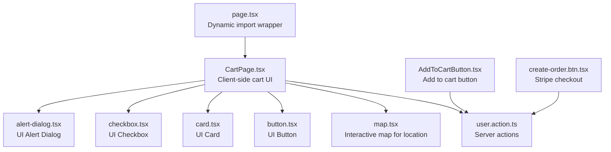
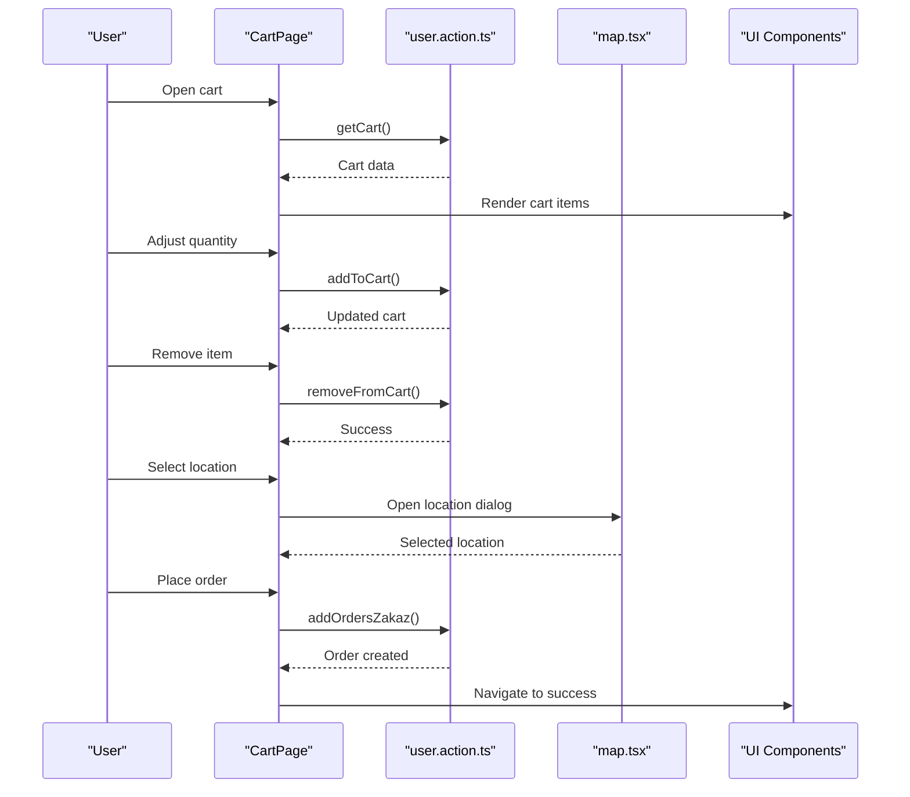
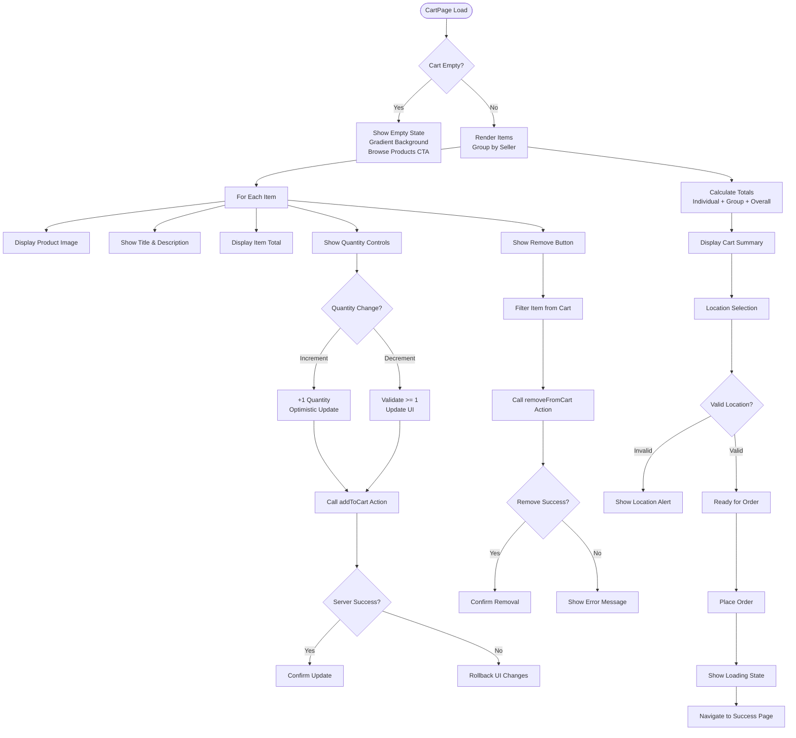
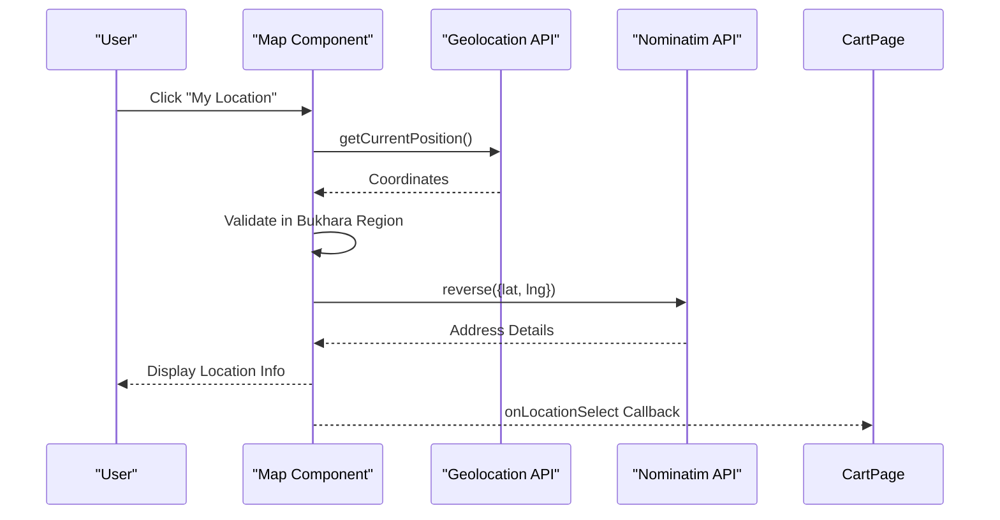
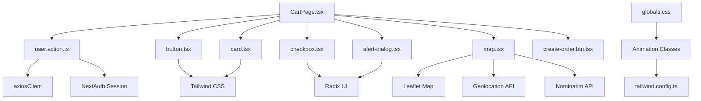

# Cart UI Components

<cite>
**Referenced Files in This Document**
- [CartPage.tsx](file://app/(root)/cart/CartPage.tsx)
- [page.tsx](file://app/(root)/cart/page.tsx)
- [map.tsx](file://app/(root)/cart/_components/map.tsx)
- [button.tsx](file://components/ui/button.tsx)
- [card.tsx](file://components/ui/card.tsx)
- [checkbox.tsx](file://components/ui/checkbox.tsx)
- [alert-dialog.tsx](file://components/ui/alert-dialog.tsx)
- [AddToCartButton.tsx](file://app/(root)/product/_components/AddToCartButton.tsx)
- [create-order.btn.tsx](file://app/(root)/product/_components/create-order.btn.tsx)
- [user.action.ts](file://actions/user.action.ts)
- [globals.css](file://app/globals.css)
- [tailwind.config.ts](file://tailwind.config.ts)
</cite>

## Table of Contents
1. [Introduction](#introduction)
2. [Project Structure](#project-structure)
3. [Core Components](#core-components)
4. [Architecture Overview](#architecture-overview)
5. [Detailed Component Analysis](#detailed-component-analysis)
6. [Dependency Analysis](#dependency-analysis)
7. [Performance Considerations](#performance-considerations)
8. [Troubleshooting Guide](#troubleshooting-guide)
9. [Conclusion](#conclusion)

## Introduction
This document provides comprehensive documentation for the cart UI components and user interface implementation. It covers the CartPage layout, cart item rendering, quantity selectors, remove functionality, responsive design patterns, accessibility features, integration with product images and pricing, stock availability indicators, cart summary calculations, tax handling, total price computation, empty cart state, loading states, error messaging, animations, and user interaction patterns. The goal is to help developers understand and maintain the cart experience effectively.

## Project Structure
The cart feature is organized under the root application route with dedicated client-side and server-side components:
- Client-side cart page: app/(root)/cart/CartPage.tsx
- Dynamic import wrapper: app/(root)/cart/page.tsx
- Interactive map component for location selection: app/(root)/cart/_components/map.tsx
- Shared UI primitives: components/ui/*.tsx
- Actions for cart operations: actions/user.action.ts
- Global styles and animations: app/globals.css, tailwind.config.ts

**Diagram sources**
- [CartPage.tsx](file://app/(root)/cart/CartPage.tsx)
- [page.tsx](file://app/(root)/cart/page.tsx)
- [map.tsx](file://app/(root)/cart/_components/map.tsx)
- [button.tsx](file://components/ui/button.tsx)
- [card.tsx](file://components/ui/card.tsx)
- [checkbox.tsx](file://components/ui/checkbox.tsx)
- [alert-dialog.tsx](file://components/ui/alert-dialog.tsx)
- [AddToCartButton.tsx](file://app/(root)/product/_components/AddToCartButton.tsx)
- [create-order.btn.tsx](file://app/(root)/product/_components/create-order.btn.tsx)
- [user.action.ts](file://actions/user.action.ts)

**Section sources**
- [CartPage.tsx](file://app/(root)/cart/CartPage.tsx)
- [page.tsx](file://app/(root)/cart/page.tsx)

## Core Components
This section outlines the primary cart components and their responsibilities:
- CartPage: Renders the cart UI, handles item updates/removal, calculates totals, manages location selection, and orchestrates order placement.
- Dynamic Wrapper (page.tsx): Loads CartPage dynamically to optimize bundle size and improve initial load performance.
- Map Component (map.tsx): Provides interactive map-based location selection with geolocation support and validation against Bukhara region boundaries.
- UI Primitives: Shared components (Button, Card, Checkbox, Alert Dialog) used throughout the cart UI.
- Actions: Server actions for cart operations (add, remove, get cart, place order).

Key responsibilities:
- Rendering cart items grouped by seller
- Quantity adjustment with optimistic UI updates and server sync
- Item removal with immediate UI feedback
- Cart summary calculation and display
- Location selection with validation and alerts
- Order creation flow with payment options

**Section sources**
- [CartPage.tsx](file://app/(root)/cart/CartPage.tsx)
- [page.tsx](file://app/(root)/cart/page.tsx)
- [map.tsx](file://app/(root)/cart/_components/map.tsx)
- [button.tsx](file://components/ui/button.tsx)
- [card.tsx](file://components/ui/card.tsx)
- [checkbox.tsx](file://components/ui/checkbox.tsx)
- [alert-dialog.tsx](file://components/ui/alert-dialog.tsx)
- [user.action.ts](file://actions/user.action.ts)

## Architecture Overview
The cart architecture follows a client-server pattern with dynamic imports and server actions:
- Client-side rendering with Next.js App Router
- Dynamic imports for performance optimization
- Server actions for secure cart operations
- Shared UI components for consistency
- Map integration for location-based features

**Diagram sources**
- [CartPage.tsx](file://app/(root)/cart/CartPage.tsx)
- [map.tsx](file://app/(root)/cart/_components/map.tsx)
- [user.action.ts](file://actions/user.action.ts)

## Detailed Component Analysis

### CartPage Component
The CartPage component serves as the central hub for cart management with the following key features:

#### Layout and Structure
- Responsive grid layout with two-column design on larger screens
- Seller-based grouping of cart items
- Sticky summary panel for order details
- Empty cart state with gradient background and call-to-action

#### Cart Item Rendering
Each cart item displays:
- Product image with fallback placeholder
- Product title with truncation
- Description with line clamping
- Individual item total price
- Quantity selector with increment/decrement buttons
- Remove button with trash icon

#### Quantity Management
The quantity selector implements:
- Increment/decrement buttons with ghost styling
- Real-time quantity display
- Optimistic UI updates before server confirmation
- Validation to prevent quantities below 1
- Immediate server synchronization via addToCart action

#### Remove Functionality
Item removal provides:
- Visual feedback with hover effects
- Immediate UI removal
- Server-side synchronization
- Error handling with UI rollback

#### Cart Summary Calculation
The cart computes:
- Individual item totals (price × quantity)
- Group totals per seller
- Overall cart total
- Formatted currency display using Uzbek locale

#### Location Selection Integration
The component integrates with:
- Interactive map component for location selection
- Geolocation API for automatic location detection
- Region validation against Bukhara boundaries
- Toast notifications for user feedback

#### Order Placement Flow
Order creation includes:
- Conditional payment options (cash on delivery vs online)
- Location validation requirements
- Loading states during processing
- Success/error handling with navigation

**Diagram sources**
- [CartPage.tsx](file://app/(root)/cart/CartPage.tsx)

**Section sources**
- [CartPage.tsx](file://app/(root)/cart/CartPage.tsx)

### Dynamic Import Wrapper
The page.tsx component implements:
- Dynamic import of CartPage to reduce initial bundle size
- Server-side cart data fetching with getCart action
- Suspense boundary for loading states
- Proper hydration handling for client-side components

**Section sources**
- [page.tsx](file://app/(root)/cart/page.tsx)

### Map Component Integration
The map.tsx component provides:
- Interactive map with Leaflet integration
- Geolocation API support with user permission handling
- Location validation against Bukhara region boundaries
- Reverse geocoding for address display
- Toast notifications for user feedback
- Tabbed interface for map and information views

**Diagram sources**
- [map.tsx](file://app/(root)/cart/_components/map.tsx)

**Section sources**
- [map.tsx](file://app/(root)/cart/_components/map.tsx)

### UI Component Integration
The cart leverages shared UI components:
- Button variants: gradient, outline, ghost for different interaction patterns
- Card components for item containers and summary panels
- Checkbox for cash-on-delivery preference
- Alert Dialog for location confirmation

**Section sources**
- [button.tsx](file://components/ui/button.tsx)
- [card.tsx](file://components/ui/card.tsx)
- [checkbox.tsx](file://components/ui/checkbox.tsx)
- [alert-dialog.tsx](file://components/ui/alert-dialog.tsx)

### Server Actions Integration
The cart interacts with server actions for:
- Cart management: addToCart, removeFromCart, getCart
- Order placement: addOrdersZakaz
- Payment processing: clickCheckout
- Session validation and token generation

**Section sources**
- [user.action.ts](file://actions/user.action.ts)

## Dependency Analysis
The cart components have the following dependencies:

**Diagram sources**
- [CartPage.tsx](file://app/(root)/cart/CartPage.tsx)
- [map.tsx](file://app/(root)/cart/_components/map.tsx)
- [user.action.ts](file://actions/user.action.ts)
- [button.tsx](file://components/ui/button.tsx)
- [card.tsx](file://components/ui/card.tsx)
- [checkbox.tsx](file://components/ui/checkbox.tsx)
- [alert-dialog.tsx](file://components/ui/alert-dialog.tsx)
- [globals.css](file://app/globals.css)
- [tailwind.config.ts](file://tailwind.config.ts)

**Section sources**
- [CartPage.tsx](file://app/(root)/cart/CartPage.tsx)
- [map.tsx](file://app/(root)/cart/_components/map.tsx)
- [user.action.ts](file://actions/user.action.ts)

## Performance Considerations
The cart implementation includes several performance optimizations:
- Dynamic imports for client-side components to reduce initial bundle size
- Server-side data fetching with caching and revalidation
- Optimistic UI updates for immediate user feedback
- Efficient cart calculations using reduce operations
- Lazy loading for heavy components like maps
- Tailwind CSS utility classes for minimal CSS overhead

Recommendations:
- Consider implementing virtual scrolling for large cart lists
- Add debounced quantity updates to reduce server requests
- Implement cart persistence with local storage for offline scenarios
- Optimize image loading with proper sizing and lazy loading attributes

## Troubleshooting Guide
Common issues and solutions:

### Empty Cart State
- Verify server-side cart retrieval is working correctly
- Check authentication state for logged-in users
- Ensure proper hydration after dynamic imports

### Quantity Update Issues
- Validate server response contains expected data structure
- Implement proper error rollback for failed updates
- Check network connectivity and server action permissions

### Location Selection Problems
- Verify geolocation API permissions are granted
- Check browser compatibility for geolocation services
- Ensure map component loads correctly without SSR issues

### Order Placement Failures
- Validate location selection requirements are met
- Check payment method availability
- Monitor server action response handling

**Section sources**
- [CartPage.tsx](file://app/(root)/cart/CartPage.tsx)
- [map.tsx](file://app/(root)/cart/_components/map.tsx)
- [user.action.ts](file://actions/user.action.ts)

## Conclusion
The cart UI components provide a comprehensive shopping cart experience with modern React patterns, responsive design, and robust server integration. The implementation balances performance optimization with user experience, offering smooth interactions, clear feedback, and reliable state management. The modular architecture allows for easy maintenance and future enhancements while maintaining consistency across the application.