# Shopping Cart System

<cite>
**Referenced Files in This Document**
- [CartPage.tsx](file://app/(root)/cart/CartPage.tsx)
- [page.tsx](file://app/(root)/cart/page.tsx)
- [map.tsx](file://app/(root)/cart/_components/map.tsx)
- [user.action.ts](file://actions/user.action.ts)
- [AddToCartButton.tsx](file://app/(root)/product/_components/AddToCartButton.tsx)
- [create-order.btn.tsx](file://app/(root)/product/_components/create-order.btn.tsx)
- [product-card.tsx](file://app/(root)/_components/product-card.tsx)
- [index.ts](file://types/index.ts)
- [use-product.ts](file://hooks/use-product.ts)
</cite>

## Table of Contents
1. [Introduction](#introduction)
2. [Project Structure](#project-structure)
3. [Core Components](#core-components)
4. [Architecture Overview](#architecture-overview)
5. [Detailed Component Analysis](#detailed-component-analysis)
6. [Dependency Analysis](#dependency-analysis)
7. [Performance Considerations](#performance-considerations)
8. [Troubleshooting Guide](#troubleshooting-guide)
9. [Conclusion](#conclusion)

## Introduction
This document describes the shopping cart system for Optim Bozor, focusing on cart state management, item addition/removal, quantity adjustments, persistence, server synchronization, UI components, integration with the product catalog and pricing, inventory considerations, validation, error handling, user session cart merging, and the relationship to the order processing workflow. It also covers performance and cleanup strategies for large carts.

## Project Structure
The cart system spans client-side UI pages, server actions for persistence and order creation, and supporting components for product integration and location selection.

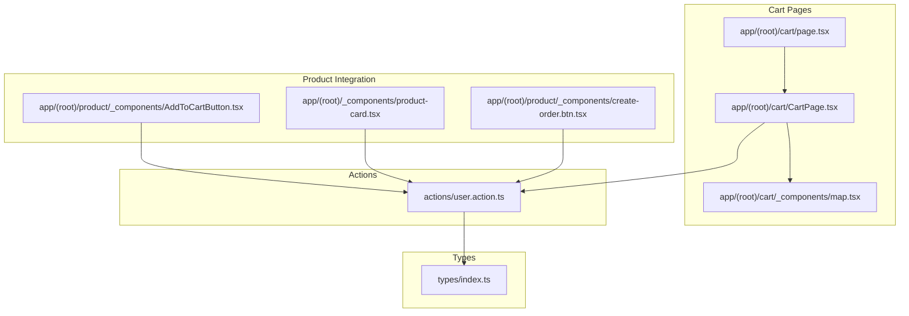

**Diagram sources**
- [page.tsx](file://app/(root)/cart/page.tsx#L1-L22)
- [CartPage.tsx](file://app/(root)/cart/CartPage.tsx#L1-L487)
- [map.tsx](file://app/(root)/cart/_components/map.tsx#L1-L390)
- [user.action.ts:1-295](file://actions/user.action.ts#L1-L295)
- [AddToCartButton.tsx](file://app/(root)/product/_components/AddToCartButton.tsx#L1-L45)
- [product-card.tsx](file://app/(root)/_components/product-card.tsx#L167-L241)
- [create-order.btn.tsx](file://app/(root)/product/_components/create-order.btn.tsx#L1-L53)
- [index.ts:1-209](file://types/index.ts#L1-L209)

**Section sources**
- [page.tsx](file://app/(root)/cart/page.tsx#L1-L22)
- [CartPage.tsx](file://app/(root)/cart/CartPage.tsx#L1-L487)
- [map.tsx](file://app/(root)/cart/_components/map.tsx#L1-L390)
- [user.action.ts:1-295](file://actions/user.action.ts#L1-L295)
- [AddToCartButton.tsx](file://app/(root)/product/_components/AddToCartButton.tsx#L1-L45)
- [product-card.tsx](file://app/(root)/_components/product-card.tsx#L167-L241)
- [create-order.btn.tsx](file://app/(root)/product/_components/create-order.btn.tsx#L1-L53)
- [index.ts:1-209](file://types/index.ts#L1-L209)

## Core Components
- Cart page renderer and state manager: [CartPage.tsx](file://app/(root)/cart/CartPage.tsx#L108-L487)
- Server-side cart retrieval: [getCart:217-227](file://actions/user.action.ts#L217-L227)
- Item addition/removal and order creation: [addToCart:120-143](file://actions/user.action.ts#L120-L143), [removeFromCart:160-177](file://actions/user.action.ts#L160-L177), [addOrdersZakaz:179-215](file://actions/user.action.ts#L179-L215)
- Product integration UI: [AddToCartButton](file://app/(root)/product/_components/AddToCartButton.tsx#L1-L45), [ProductCard](file://app/(root)/_components/product-card.tsx#L167-L241)
- Location picker and validation: [map.tsx](file://app/(root)/cart/_components/map.tsx#L1-L390)
- Types and schemas: [types/index.ts:31-151](file://types/index.ts#L31-L151)

**Section sources**
- [CartPage.tsx](file://app/(root)/cart/CartPage.tsx#L108-L487)
- [user.action.ts:120-227](file://actions/user.action.ts#L120-L227)
- [AddToCartButton.tsx](file://app/(root)/product/_components/AddToCartButton.tsx#L1-L45)
- [product-card.tsx](file://app/(root)/_components/product-card.tsx#L167-L241)
- [map.tsx](file://app/(root)/cart/_components/map.tsx#L1-L390)
- [index.ts:31-151](file://types/index.ts#L31-L151)

## Architecture Overview
The cart system follows a client-server pattern:
- Client-side Next.js app renders the cart UI and manages transient state.
- Server actions handle authentication, token generation, and persistence via HTTP requests.
- Product catalog integration triggers cart updates through dedicated UI components.
- Order placement validates location and payment preferences, then clears the cart.

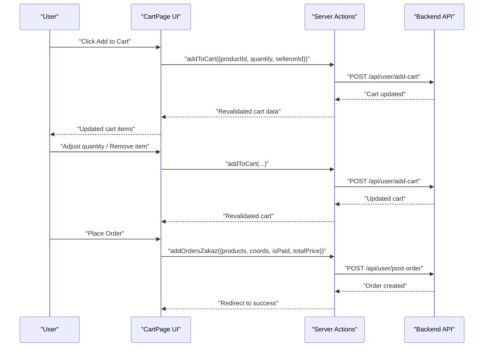

**Diagram sources**
- [CartPage.tsx](file://app/(root)/cart/CartPage.tsx#L142-L234)
- [user.action.ts:120-215](file://actions/user.action.ts#L120-L215)

## Detailed Component Analysis

### Cart State Management and UI
- State initialization: [CartPage.tsx](file://app/(root)/cart/CartPage.tsx#L108-L116)
- Empty cart rendering: [CartPage.tsx](file://app/(root)/cart/CartPage.tsx#L124-L140)
- Grouping by seller: [groupBySeller](file://app/(root)/cart/CartPage.tsx#L87-L106)
- Quantity adjustment with optimistic UI and rollback on error: [updateQuantity](file://app/(root)/cart/CartPage.tsx#L142-L175)
- Item removal: [removeProduct](file://app/(root)/cart/CartPage.tsx#L177-L181)
- Pricing calculation: [calculateTotalPrice](file://app/(root)/cart/CartPage.tsx#L183-L188)
- Order placement flow: [handleOrderZakaz](file://app/(root)/cart/CartPage.tsx#L196-L234)

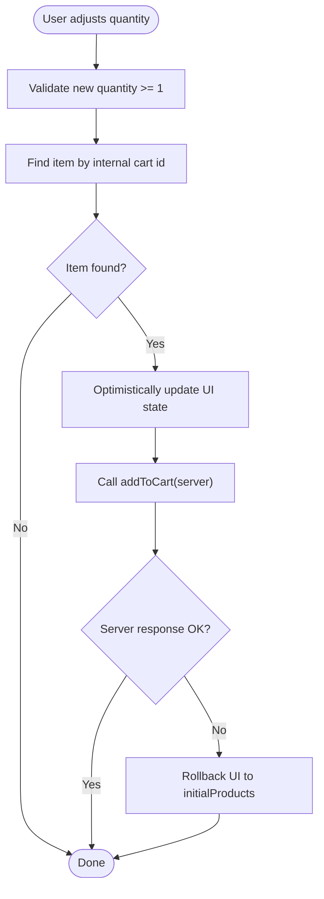

**Diagram sources**
- [CartPage.tsx](file://app/(root)/cart/CartPage.tsx#L142-L175)

**Section sources**
- [CartPage.tsx](file://app/(root)/cart/CartPage.tsx#L108-L234)

### Item Addition and Removal
- Product card integration: [product-card.tsx](file://app/(root)/_components/product-card.tsx#L182-L225)
- Dedicated add-to-cart button: [AddToCartButton.tsx](file://app/(root)/product/_components/AddToCartButton.tsx#L13-L33)
- Server action for adding items: [addToCart:120-143](file://actions/user.action.ts#L120-L143)
- Server action for removing cart: [removeFromCart:160-177](file://actions/user.action.ts#L160-L177)

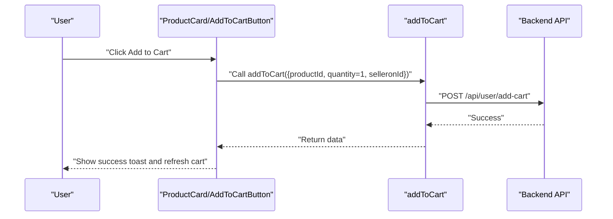

**Diagram sources**
- [product-card.tsx](file://app/(root)/_components/product-card.tsx#L182-L225)
- [AddToCartButton.tsx](file://app/(root)/product/_components/AddToCartButton.tsx#L13-L33)
- [user.action.ts:120-143](file://actions/user.action.ts#L120-L143)

**Section sources**
- [product-card.tsx](file://app/(root)/_components/product-card.tsx#L182-L225)
- [AddToCartButton.tsx](file://app/(root)/product/_components/AddToCartButton.tsx#L13-L33)
- [user.action.ts:120-177](file://actions/user.action.ts#L120-L177)

### Quantity Adjustment Functionality
- Optimistic update and immediate UI feedback: [CartPage.tsx](file://app/(root)/cart/CartPage.tsx#L150-L157)
- Server sync and error rollback: [CartPage.tsx](file://app/(root)/cart/CartPage.tsx#L160-L174)
- Prevent invalid quantities: [CartPage.tsx](file://app/(root)/cart/CartPage.tsx#L142-L143)

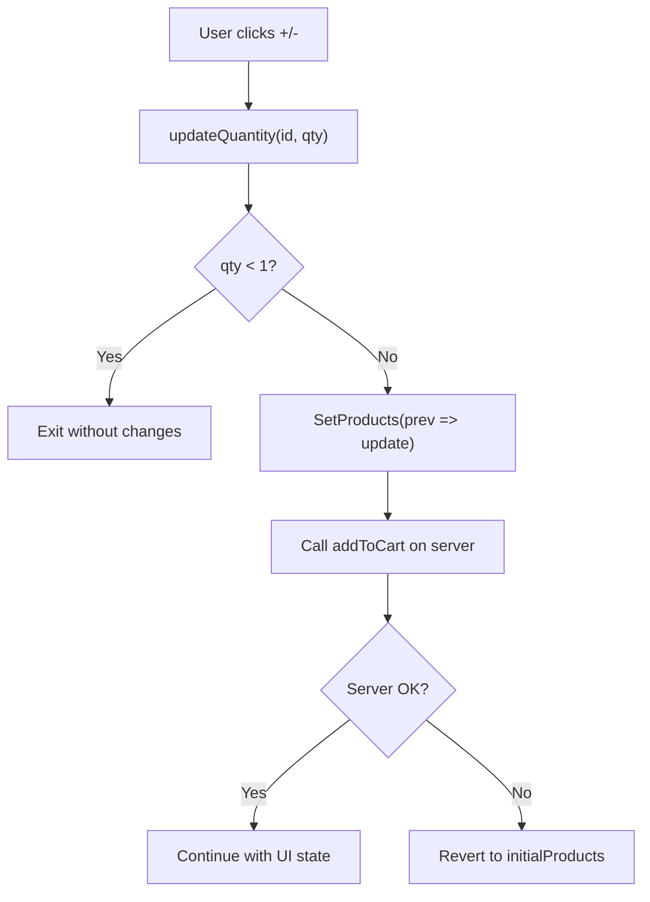

**Diagram sources**
- [CartPage.tsx](file://app/(root)/cart/CartPage.tsx#L142-L175)

**Section sources**
- [CartPage.tsx](file://app/(root)/cart/CartPage.tsx#L142-L175)

### Cart Persistence and Server Synchronization
- Retrieval on server-rendered cart page: [page.tsx](file://app/(root)/cart/page.tsx#L9-L12)
- Server action to fetch cart: [getCart:217-227](file://actions/user.action.ts#L217-L227)
- Server action to add items: [addToCart:120-143](file://actions/user.action.ts#L120-L143)
- Server action to place order and clear cart: [addOrdersZakaz:179-215](file://actions/user.action.ts#L179-L215), [removeFromCart:160-177](file://actions/user.action.ts#L160-L177)

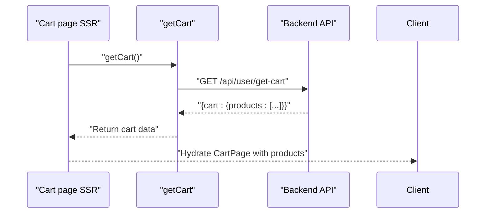

**Diagram sources**
- [page.tsx](file://app/(root)/cart/page.tsx#L9-L12)
- [user.action.ts:217-227](file://actions/user.action.ts#L217-L227)

**Section sources**
- [page.tsx](file://app/(root)/cart/page.tsx#L9-L12)
- [user.action.ts:120-227](file://actions/user.action.ts#L120-L227)

### Cart UI Components
- Layout and grouping by seller: [CartPage.tsx](file://app/(root)/cart/CartPage.tsx#L240-L336)
- Item listing with image, title, description, quantity controls, and remove: [CartPage.tsx](file://app/(root)/cart/CartPage.tsx#L252-L326)
- Order summary panel with totals and payment option: [CartPage.tsx](file://app/(root)/cart/CartPage.tsx#L339-L481)
- Location selection dialog and validation: [map.tsx](file://app/(root)/cart/_components/map.tsx#L68-L87)

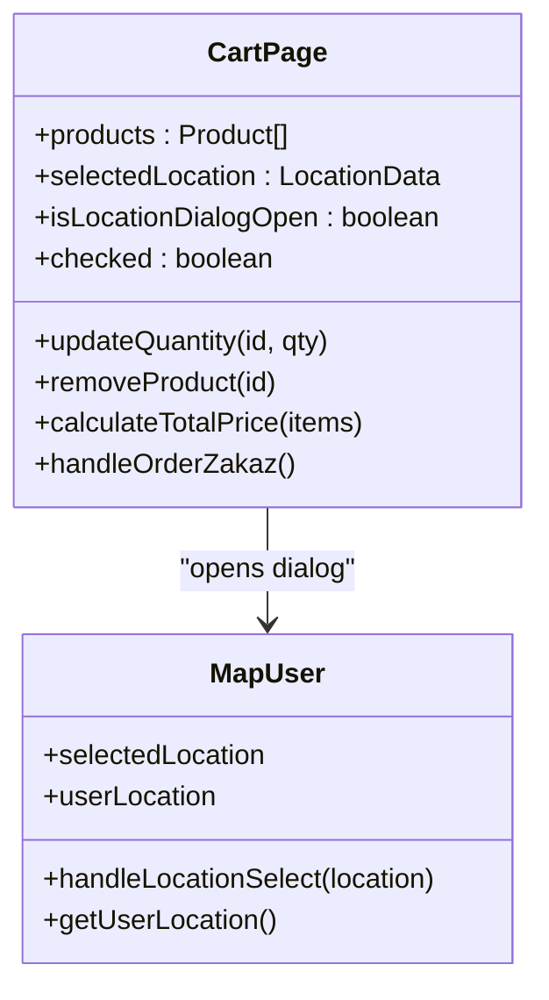

**Diagram sources**
- [CartPage.tsx](file://app/(root)/cart/CartPage.tsx#L108-L487)
- [map.tsx](file://app/(root)/cart/_components/map.tsx#L29-L87)

**Section sources**
- [CartPage.tsx](file://app/(root)/cart/CartPage.tsx#L240-L481)
- [map.tsx](file://app/(root)/cart/_components/map.tsx#L29-L87)

### Integration with Product Catalog and Pricing
- Product catalog integration via AddToCartButton and ProductCard: [AddToCartButton.tsx](file://app/(root)/product/_components/AddToCartButton.tsx#L13-L33), [product-card.tsx](file://app/(root)/_components/product-card.tsx#L182-L225)
- Pricing display and formatting: [formatPrice](file://app/(root)/cart/CartPage.tsx#L78-L85), [calculateTotalPrice](file://app/(root)/cart/CartPage.tsx#L183-L188)
- Types for product and cart items: [types/index.ts:105-151](file://types/index.ts#L105-L151)

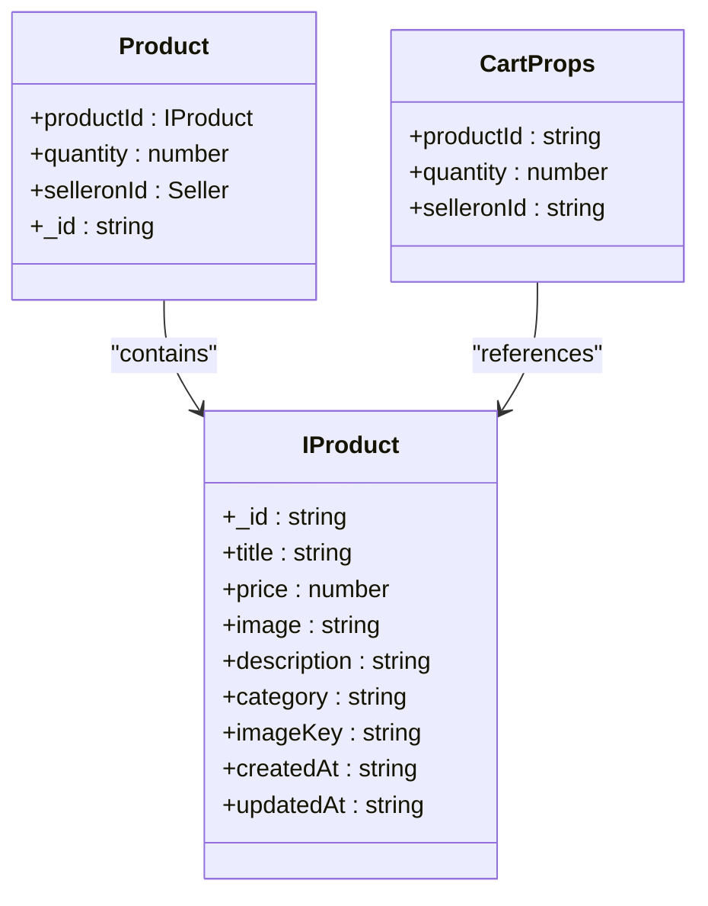

**Diagram sources**
- [index.ts:105-151](file://types/index.ts#L105-L151)
- [CartPage.tsx](file://app/(root)/cart/CartPage.tsx#L48-L68)

**Section sources**
- [AddToCartButton.tsx](file://app/(root)/product/_components/AddToCartButton.tsx#L13-L33)
- [product-card.tsx](file://app/(root)/_components/product-card.tsx#L182-L225)
- [CartPage.tsx](file://app/(root)/cart/CartPage.tsx#L78-L85)
- [index.ts:105-151](file://types/index.ts#L105-L151)

### Inventory Management and Validation
- Out-of-stock handling: The server action for adding to cart returns a server error field; the client reverts UI state on encountering a server error. See [CartPage.tsx](file://app/(root)/cart/CartPage.tsx#L166-L174).
- Location validation: The map component checks whether coordinates fall within the Bukhara region and displays appropriate alerts. See [map.tsx](file://app/(root)/cart/_components/map.tsx#L62-L87).
- Payment method toggle: Cash-on-delivery vs pre-paid is controlled by a checkbox state. See [CartPage.tsx](file://app/(root)/cart/CartPage.tsx#L190-L192).

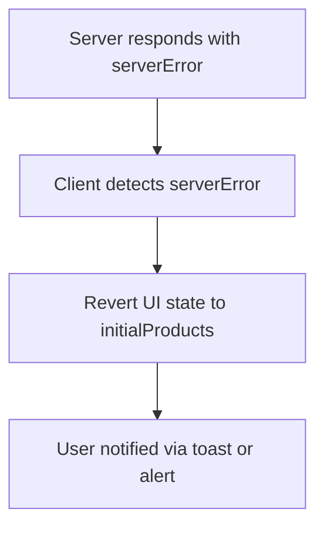

**Diagram sources**
- [CartPage.tsx](file://app/(root)/cart/CartPage.tsx#L166-L174)

**Section sources**
- [CartPage.tsx](file://app/(root)/cart/CartPage.tsx#L166-L174)
- [map.tsx](file://app/(root)/cart/_components/map.tsx#L62-L87)

### User Session Cart Merging
- Authentication and token generation: Server actions retrieve the current session and generate a JWT for protected endpoints. See [user.action.ts:125-130](file://actions/user.action.ts#L125-L130).
- Cart retrieval and revalidation: The cart endpoint returns the current user’s cart, and subsequent updates trigger revalidation of the cart page. See [getCart:217-227](file://actions/user.action.ts#L217-L227), [addToCart:138-140](file://actions/user.action.ts#L138-L140).

Note: The repository does not expose explicit guest cart merging logic. Operations require authentication, and cart data is scoped per authenticated user.

**Section sources**
- [user.action.ts:125-140](file://actions/user.action.ts#L125-L140)
- [user.action.ts:217-227](file://actions/user.action.ts#L217-L227)

### Relationship Between Cart Operations and Order Processing Workflow
- Order creation payload construction: [CartPage.tsx](file://app/(root)/cart/CartPage.tsx#L205-L211)
- Payment mode and coordinates: [CartPage.tsx](file://app/(root)/cart/CartPage.tsx#L212-L214)
- Post-order cart cleanup: [CartPage.tsx](file://app/(root)/cart/CartPage.tsx#L223-L229)
- Alternative payment flow: [create-order.btn.tsx](file://app/(root)/product/_components/create-order.btn.tsx#L19-L31)

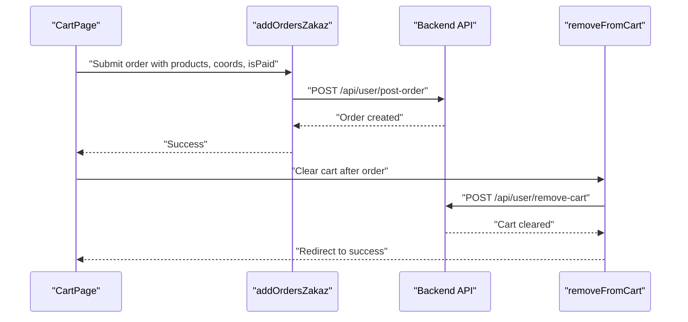

**Diagram sources**
- [CartPage.tsx](file://app/(root)/cart/CartPage.tsx#L196-L234)
- [user.action.ts:179-177](file://actions/user.action.ts#L179-L177)

**Section sources**
- [CartPage.tsx](file://app/(root)/cart/CartPage.tsx#L196-L234)
- [create-order.btn.tsx](file://app/(root)/product/_components/create-order.btn.tsx#L19-L31)
- [user.action.ts:179-177](file://actions/user.action.ts#L179-L177)

## Dependency Analysis
- UI depends on server actions for cart mutations and order placement.
- Server actions depend on session management and token generation.
- Types define the shape of cart items and order payloads.
- Product integration components call addToCart to synchronize with the backend.

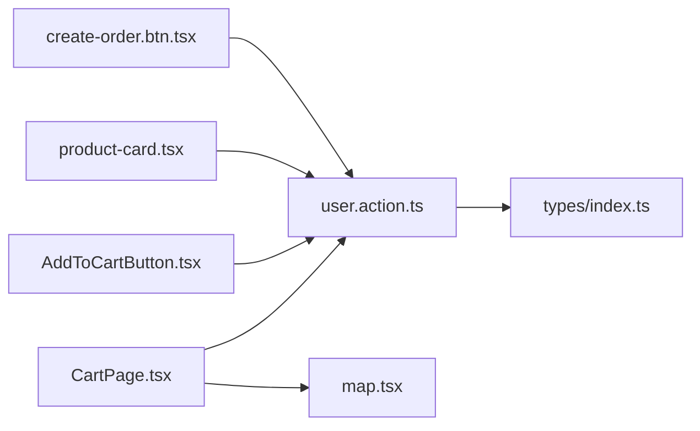

**Diagram sources**
- [CartPage.tsx](file://app/(root)/cart/CartPage.tsx#L1-L487)
- [user.action.ts:1-295](file://actions/user.action.ts#L1-L295)
- [map.tsx](file://app/(root)/cart/_components/map.tsx#L1-L390)
- [AddToCartButton.tsx](file://app/(root)/product/_components/AddToCartButton.tsx#L1-L45)
- [product-card.tsx](file://app/(root)/_components/product-card.tsx#L167-L241)
- [create-order.btn.tsx](file://app/(root)/product/_components/create-order.btn.tsx#L1-L53)
- [index.ts:1-209](file://types/index.ts#L1-L209)

**Section sources**
- [CartPage.tsx](file://app/(root)/cart/CartPage.tsx#L1-L487)
- [user.action.ts:1-295](file://actions/user.action.ts#L1-L295)
- [index.ts:1-209](file://types/index.ts#L1-L209)

## Performance Considerations
- Client-side optimistic updates reduce perceived latency during quantity changes. See [CartPage.tsx](file://app/(root)/cart/CartPage.tsx#L150-L157).
- Server-side revalidation ensures UI consistency after mutations. See [user.action.ts:138-140](file://actions/user.action.ts#L138-L140).
- Dynamic imports reduce initial bundle size for heavy components like the map. See [page.tsx](file://app/(root)/cart/page.tsx#L5-L6), [map.tsx](file://app/(root)/cart/_components/map.tsx#L19-L27).
- Large cart lists: Consider virtualization or pagination for item lists if cart sizes grow significantly.
- Toast notifications and loading states prevent redundant requests and improve UX. See [AddToCartButton.tsx](file://app/(root)/product/_components/AddToCartButton.tsx#L14-L32), [CartPage.tsx](file://app/(root)/cart/CartPage.tsx#L115-L116, L196-L198).

[No sources needed since this section provides general guidance]

## Troubleshooting Guide
- Items revert after quantity change: Indicates a server error response; the client reverts to initialProducts. See [CartPage.tsx](file://app/(root)/cart/CartPage.tsx#L166-L174).
- Cannot add to cart when not logged in: Server action enforces authentication. See [user.action.ts:125-128](file://actions/user.action.ts#L125-L128).
- Order placement fails: Check serverError in response and ensure location is valid. See [CartPage.tsx](file://app/(root)/cart/CartPage.tsx#L217-L221, L440-L448).
- Location outside Bukhara region: Validation prevents order placement until a valid location is selected. See [map.tsx](file://app/(root)/cart/_components/map.tsx#L79-L86).

**Section sources**
- [CartPage.tsx](file://app/(root)/cart/CartPage.tsx#L166-L174)
- [user.action.ts:125-128](file://actions/user.action.ts#L125-L128)
- [CartPage.tsx](file://app/(root)/cart/CartPage.tsx#L217-L221)
- [map.tsx](file://app/(root)/cart/_components/map.tsx#L79-L86)

## Conclusion
Optim Bozor’s cart system combines client-side state management with robust server actions for persistence and order processing. It supports item addition/removal, quantity adjustments with optimistic UI updates, location-based validation, and seamless order creation. While the system currently requires authentication for cart operations, it provides clear extension points for guest cart merging and advanced performance optimizations such as virtualization and caching strategies.