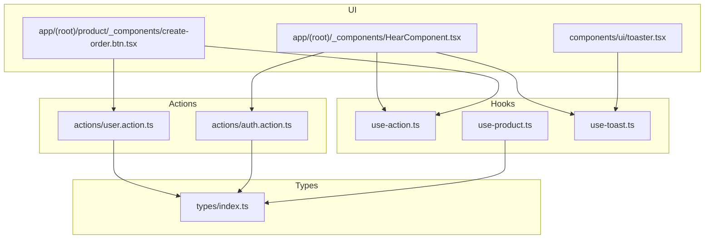
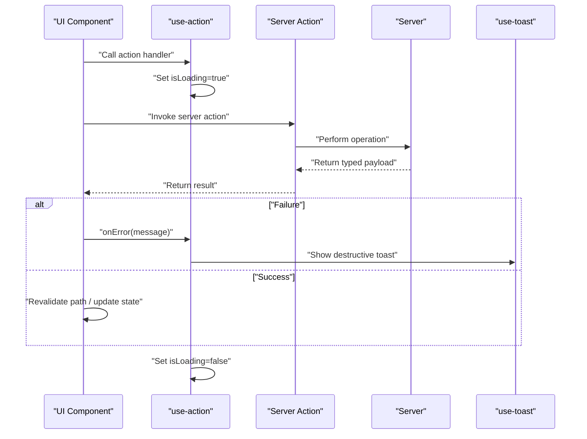
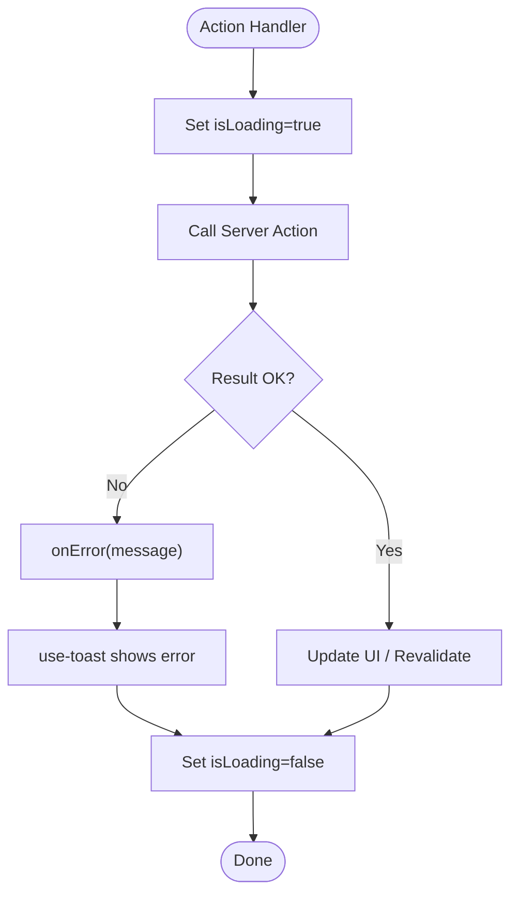
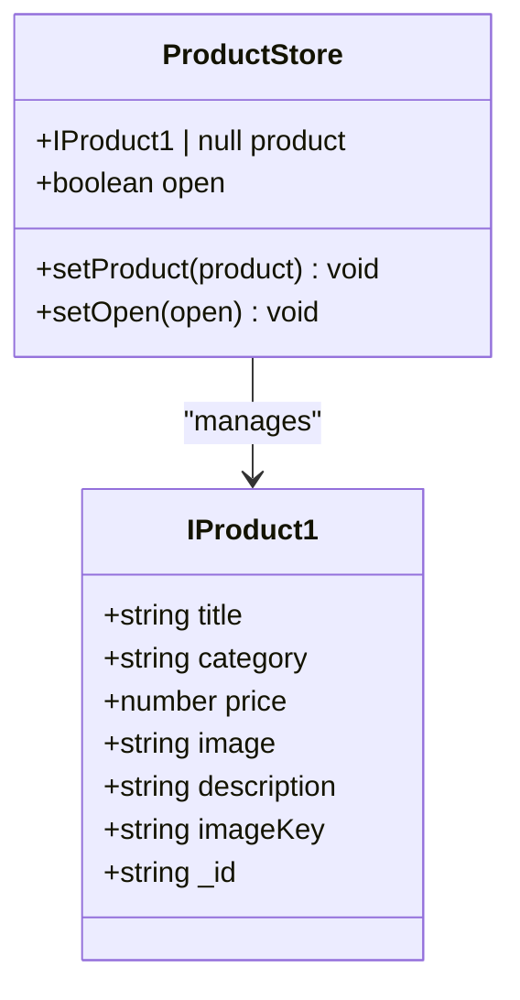
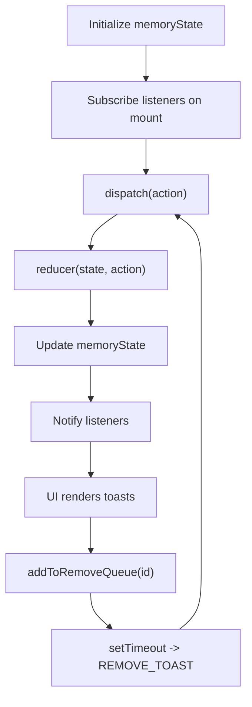
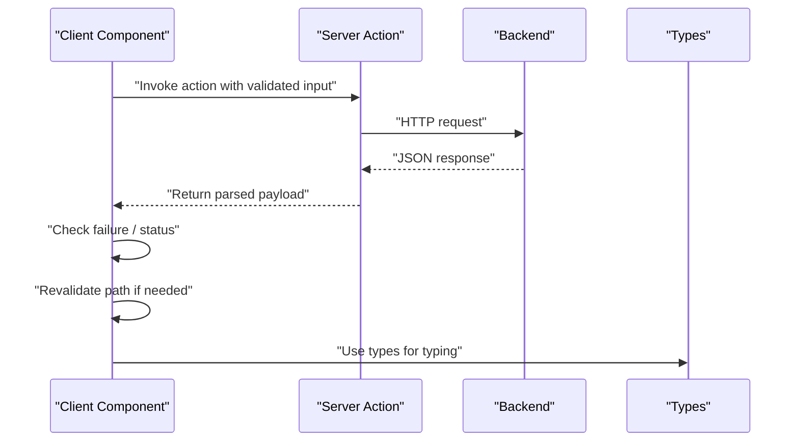
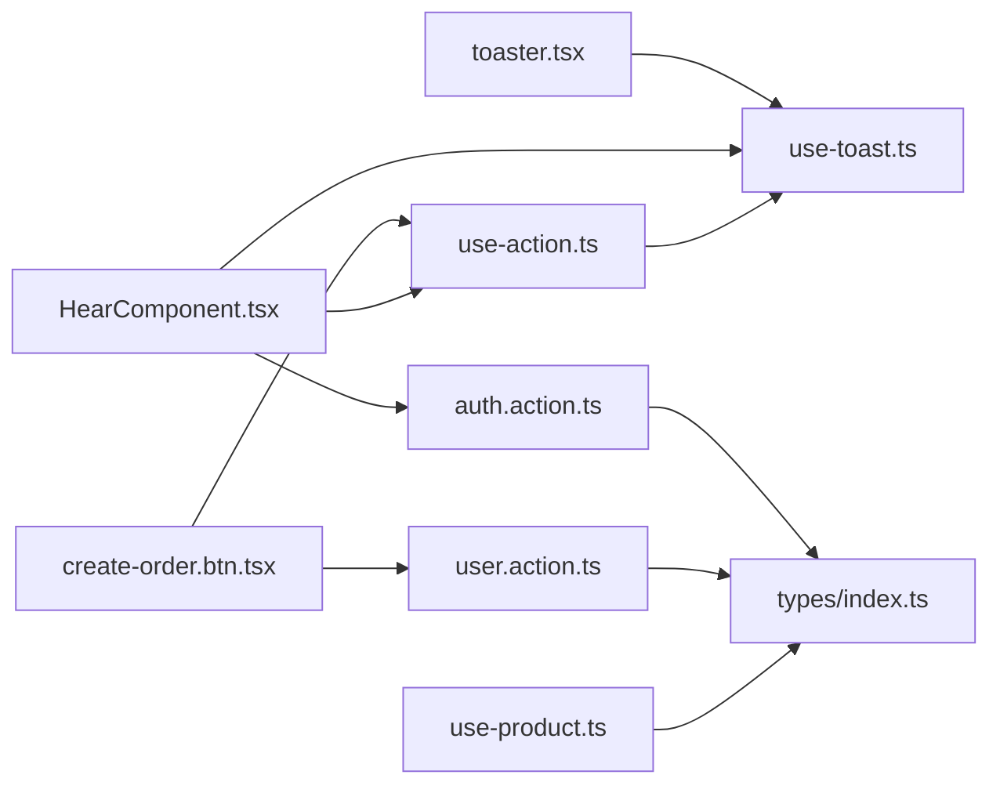

# State Management

<cite>
**Referenced Files in This Document**
- [use-action.ts](file://hooks/use-action.ts)
- [use-product.ts](file://hooks/use-product.ts)
- [use-toast.ts](file://hooks/use-toast.ts)
- [index.ts](file://types/index.ts)
- [auth.action.ts](file://actions/auth.action.ts)
- [user.action.ts](file://actions/user.action.ts)
- [HearComponent.tsx](file://app/(root)/_components/HearComponent.tsx)
- [create-order.btn.tsx](file://app/(root)/product/_components/create-order.btn.tsx)
- [toaster.tsx](file://components/ui/toaster.tsx)
</cite>

## Table of Contents
1. [Introduction](#introduction)
2. [Project Structure](#project-structure)
3. [Core Components](#core-components)
4. [Architecture Overview](#architecture-overview)
5. [Detailed Component Analysis](#detailed-component-analysis)
6. [Dependency Analysis](#dependency-analysis)
7. [Performance Considerations](#performance-considerations)
8. [Troubleshooting Guide](#troubleshooting-guide)
9. [Conclusion](#conclusion)

## Introduction
This document explains the state management patterns used in Optim Bozor. It focuses on three custom hooks—use-action, use-product, and use-toast—and how they integrate with server actions to manage UI state, product context, and notifications. It also covers local component state, global state via Zustand, server state synchronization, hook composition, optimistic updates, error rollback, performance optimizations, and persistence strategies.

## Project Structure
State-related code is organized into:
- Hooks: reusable state/logic abstractions for actions, product context, and toasts
- Types: shared TypeScript interfaces for server action payloads and domain entities
- Actions: Next.js “use server” functions that encapsulate server requests and revalidation
- UI: toast renderer and components that consume hooks

**Diagram sources**
- [use-action.ts:1-16](file://hooks/use-action.ts#L1-L16)
- [use-product.ts:1-17](file://hooks/use-product.ts#L1-L17)
- [use-toast.ts:1-192](file://hooks/use-toast.ts#L1-L192)
- [index.ts:1-209](file://types/index.ts#L1-L209)
- [auth.action.ts:1-51](file://actions/auth.action.ts#L1-L51)
- [user.action.ts:1-296](file://actions/user.action.ts#L1-L296)
- [HearComponent.tsx](file://app/(root)/_components/HearComponent.tsx#L1-L60)
- [create-order.btn.tsx](file://app/(root)/product/_components/create-order.btn.tsx#L1-L53)
- [toaster.tsx:1-36](file://components/ui/toaster.tsx#L1-L36)

**Section sources**
- [use-action.ts:1-16](file://hooks/use-action.ts#L1-L16)
- [use-product.ts:1-17](file://hooks/use-product.ts#L1-L17)
- [use-toast.ts:1-192](file://hooks/use-toast.ts#L1-L192)
- [index.ts:1-209](file://types/index.ts#L1-L209)
- [auth.action.ts:1-51](file://actions/auth.action.ts#L1-L51)
- [user.action.ts:1-296](file://actions/user.action.ts#L1-L296)
- [HearComponent.tsx](file://app/(root)/_components/HearComponent.tsx#L1-L60)
- [create-order.btn.tsx](file://app/(root)/product/_components/create-order.btn.tsx#L1-L53)
- [toaster.tsx:1-36](file://components/ui/toaster.tsx#L1-L36)

## Core Components
- use-action: Provides loading state and centralized error handling for UI actions. It integrates with use-toast to surface errors as destructive notifications.
- use-product: Global product context store built with Zustand, managing current product selection and modal open state.
- use-toast: A toast notification manager with a reducer-based dispatcher, listener pattern, and automatic cleanup timers.

Key responsibilities:
- Local component state: UI flags (loading, open/close), transient selections, and ephemeral UI feedback.
- Global state with Zustand: Persistent product context across views.
- Server state synchronization: Server actions return structured payloads; components revalidate paths and update UI accordingly.

**Section sources**
- [use-action.ts:1-16](file://hooks/use-action.ts#L1-L16)
- [use-product.ts:1-17](file://hooks/use-product.ts#L1-L17)
- [use-toast.ts:1-192](file://hooks/use-toast.ts#L1-L192)

## Architecture Overview
The state lifecycle for user-initiated actions follows a predictable flow:
- UI triggers an action
- use-action sets loading state and delegates error reporting to use-toast
- Server action executes on the server, performs work, and returns a typed payload
- UI revalidates affected routes and updates local/global state
- Notifications are shown via use-toast

**Diagram sources**
- [use-action.ts:1-16](file://hooks/use-action.ts#L1-L16)
- [use-toast.ts:1-192](file://hooks/use-toast.ts#L1-L192)
- [user.action.ts:1-296](file://actions/user.action.ts#L1-L296)
- [auth.action.ts:1-51](file://actions/auth.action.ts#L1-L51)

## Detailed Component Analysis

### use-action Hook
Purpose:
- Centralizes loading state and error presentation for UI actions.
- Standardizes error handling by delegating to use-toast with a destructive variant.

Implementation highlights:
- Maintains a boolean isLoading flag.
- Provides onError to stop loading and trigger a toast notification.
- Exposes setIsLoading for manual control when needed.

Usage patterns:
- Components call setIsLoading before invoking server actions.
- onError is invoked when server actions return failures or validation errors.
- After successful completion, components reset loading state.

**Diagram sources**
- [use-action.ts:1-16](file://hooks/use-action.ts#L1-L16)
- [use-toast.ts:1-192](file://hooks/use-toast.ts#L1-L192)

**Section sources**
- [use-action.ts:1-16](file://hooks/use-action.ts#L1-L16)

### use-product Store (Zustand)
Purpose:
- Provide a global product context store for product details and UI modal state.

Store shape:
- product: IProduct1 | null
- setProduct: (product: IProduct1 | null) => void
- open: boolean
- setOpen: (open: boolean) => void

Patterns:
- Zustand’s create API defines a functional store with setters.
- Consumers subscribe to parts of the store via selector usage (commonly done in components).

**Diagram sources**
- [use-product.ts:1-17](file://hooks/use-product.ts#L1-L17)
- [index.ts:17-25](file://types/index.ts#L17-L25)

**Section sources**
- [use-product.ts:1-17](file://hooks/use-product.ts#L1-L17)
- [index.ts:17-25](file://types/index.ts#L17-L25)

### use-toast Manager
Purpose:
- Provide a toast notification system with a reducer-based dispatcher and listener pattern.
- Enforce limits and automatic cleanup of toasts.

Key behaviors:
- Memory-backed state initialized once and reused across renders.
- Listeners subscribe to state changes and receive updates.
- Automatic removal timers per toast id to prevent unbounded growth.
- Public APIs: toast(), dismiss(), and a React hook useToast() returning current state plus helpers.

**Diagram sources**
- [use-toast.ts:1-192](file://hooks/use-toast.ts#L1-L192)

**Section sources**
- [use-toast.ts:1-192](file://hooks/use-toast.ts#L1-L192)

### Server Actions Integration
Two primary patterns are used:
- Typed server actions with schema validation and safe execution.
- Return payloads conforming to shared types for consistent client handling.

Representative actions:
- Authentication actions (login, register, OTP) return a unified payload type.
- User actions (favorites, cart, orders, profile updates) return typed results and often trigger revalidation of specific paths.

**Diagram sources**
- [auth.action.ts:1-51](file://actions/auth.action.ts#L1-L51)
- [user.action.ts:1-296](file://actions/user.action.ts#L1-L296)
- [index.ts:54-73](file://types/index.ts#L54-L73)

**Section sources**
- [auth.action.ts:1-51](file://actions/auth.action.ts#L1-L51)
- [user.action.ts:1-296](file://actions/user.action.ts#L1-L296)
- [index.ts:54-73](file://types/index.ts#L54-L73)

### Hook Composition Patterns
Common compositions observed:
- use-action combined with server actions to manage loading and error states.
- use-toast used alongside use-action for immediate user feedback.
- Zustand store used for cross-component product context sharing.

Examples in the codebase:
- Favorite toggling uses use-action for loading/error and localStorage for persistence until server confirms.
- Order creation uses use-action to disable UI while awaiting server response and opens checkout URL upon success.

**Section sources**
- [HearComponent.tsx](file://app/(root)/_components/HearComponent.tsx#L1-L60)
- [create-order.btn.tsx](file://app/(root)/product/_components/create-order.btn.tsx#L1-L53)
- [use-action.ts:1-16](file://hooks/use-action.ts#L1-L16)
- [use-toast.ts:1-192](file://hooks/use-toast.ts#L1-L192)

### State Update Mechanisms
- Local component state: handled via React useState in UI components; used for UI flags and ephemeral selections.
- Global state: managed by Zustand store for product context; accessed via selectors in consumers.
- Server state synchronization: server actions return payloads; components revalidate paths and update UI accordingly.

**Section sources**
- [HearComponent.tsx](file://app/(root)/_components/HearComponent.tsx#L1-L60)
- [use-product.ts:1-17](file://hooks/use-product.ts#L1-L17)
- [user.action.ts:1-296](file://actions/user.action.ts#L1-L296)

### Optimistic Updates and Rollback Strategies
Observed patterns:
- Optimistic toggling of favorites with immediate UI change and localStorage update, followed by server confirmation.
- Rollback on error: loading state is reset, and use-toast displays a destructive message.

Recommended enhancements:
- For server actions that modify remote state, consider temporarily updating UI optimistically and rolling back on failure.
- Use a temporary in-memory cache keyed by action identifiers to revert changes if the server responds with an error.

**Section sources**
- [HearComponent.tsx](file://app/(root)/_components/HearComponent.tsx#L19-L40)
- [use-action.ts:7-10](file://hooks/use-action.ts#L7-L10)

### Performance Considerations
- Minimize re-renders by selecting only necessary slices from Zustand stores.
- Limit concurrent toasts to avoid UI clutter; the toast manager enforces a limit.
- Debounce or batch UI updates after server responses to reduce layout thrashing.
- Avoid unnecessary deep equality checks; rely on primitive selectors for Zustand.

[No sources needed since this section provides general guidance]

## Dependency Analysis
Relationships among state management components:

**Diagram sources**
- [use-action.ts:1-16](file://hooks/use-action.ts#L1-L16)
- [use-toast.ts:1-192](file://hooks/use-toast.ts#L1-L192)
- [HearComponent.tsx](file://app/(root)/_components/HearComponent.tsx#L1-L60)
- [create-order.btn.tsx](file://app/(root)/product/_components/create-order.btn.tsx#L1-L53)
- [toaster.tsx:1-36](file://components/ui/toaster.tsx#L1-L36)
- [use-product.ts:1-17](file://hooks/use-product.ts#L1-L17)
- [index.ts:1-209](file://types/index.ts#L1-L209)
- [auth.action.ts:1-51](file://actions/auth.action.ts#L1-L51)
- [user.action.ts:1-296](file://actions/user.action.ts#L1-L296)

**Section sources**
- [use-action.ts:1-16](file://hooks/use-action.ts#L1-L16)
- [use-toast.ts:1-192](file://hooks/use-toast.ts#L1-L192)
- [HearComponent.tsx](file://app/(root)/_components/HearComponent.tsx#L1-L60)
- [create-order.btn.tsx](file://app/(root)/product/_components/create-order.btn.tsx#L1-L53)
- [toaster.tsx:1-36](file://components/ui/toaster.tsx#L1-L36)
- [use-product.ts:1-17](file://hooks/use-product.ts#L1-L17)
- [index.ts:1-209](file://types/index.ts#L1-L209)
- [auth.action.ts:1-51](file://actions/auth.action.ts#L1-L51)
- [user.action.ts:1-296](file://actions/user.action.ts#L1-L296)

## Troubleshooting Guide
Common issues and resolutions:
- Toasts not appearing:
  - Ensure the Toaster component is mounted in the app shell and useToast is called inside a client component.
- Toasts stacking excessively:
  - The toast manager enforces a limit; verify that toasts are dismissed properly and not accumulating due to missing onOpenChange handling.
- Loading state stuck:
  - Confirm that setIsLoading is reset in both success and error branches after server action calls.
- Server action errors:
  - Use onError to surface messages; ensure server actions return a consistent payload structure for reliable client-side checks.

**Section sources**
- [toaster.tsx:1-36](file://components/ui/toaster.tsx#L1-L36)
- [use-toast.ts:1-192](file://hooks/use-toast.ts#L1-L192)
- [use-action.ts:1-16](file://hooks/use-action.ts#L1-L16)
- [user.action.ts:1-296](file://actions/user.action.ts#L1-L296)

## Conclusion
Optim Bozor employs a clean separation of concerns for state management:
- use-action standardizes loading and error handling.
- use-toast centralizes notifications with automatic lifecycle management.
- use-product provides a global product context via Zustand.
- Server actions encapsulate backend logic and return typed payloads for predictable client handling.

Adopting optimistic updates with rollback, careful state selection, and consistent error handling will further improve reliability and user experience.