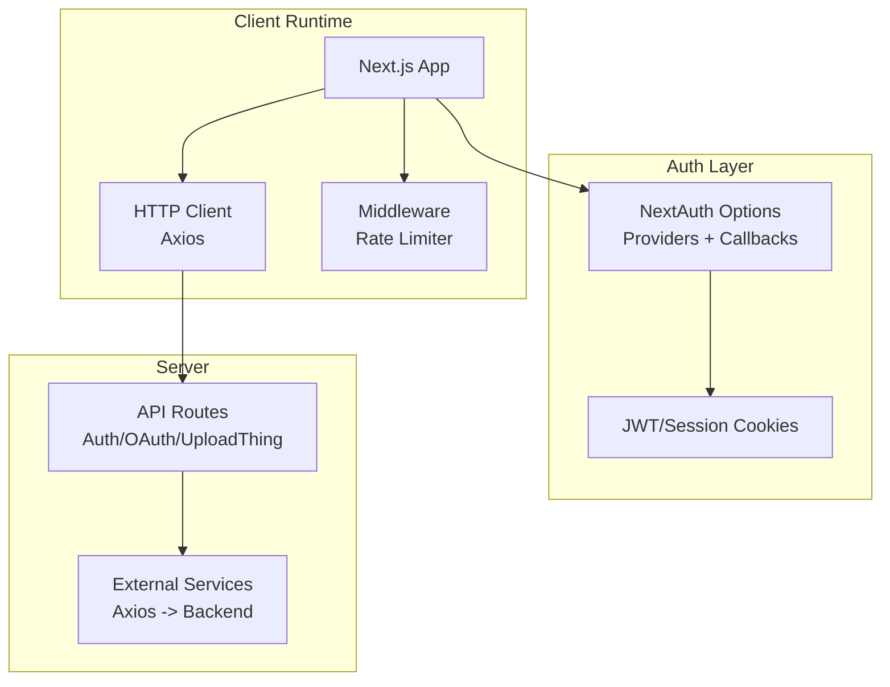
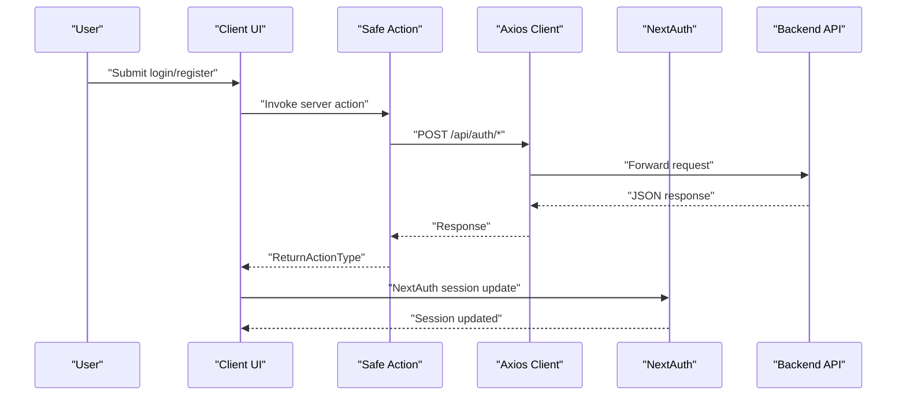
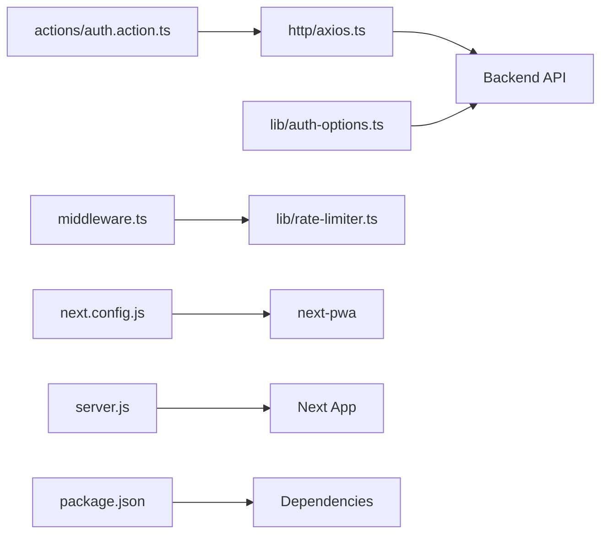

# Troubleshooting & FAQ

<cite>
**Referenced Files in This Document**
- [actions/auth.action.ts](file://actions/auth.action.ts)
- [lib/auth-options.ts](file://lib/auth-options.ts)
- [middleware.ts](file://middleware.ts)
- [lib/rate-limiter.ts](file://lib/rate-limiter.ts)
- [http/axios.ts](file://http/axios.ts)
- [next.config.js](file://next.config.js)
- [server.js](file://server.js)
- [package.json](file://package.json)
- [hooks/use-action.ts](file://hooks/use-action.ts)
- [lib/validation.ts](file://lib/validation.ts)
- [types/index.ts](file://types/index.ts)
- [lib/constants.ts](file://lib/constants.ts)
</cite>

## Table of Contents
1. [Introduction](#introduction)
2. [Project Structure](#project-structure)
3. [Core Components](#core-components)
4. [Architecture Overview](#architecture-overview)
5. [Detailed Component Analysis](#detailed-component-analysis)
6. [Dependency Analysis](#dependency-analysis)
7. [Performance Considerations](#performance-considerations)
8. [Troubleshooting Guide](#troubleshooting-guide)
9. [Conclusion](#conclusion)
10. [Appendices](#appendices)

## Introduction
This document provides a comprehensive troubleshooting and FAQ guide for Optim Bozor. It focuses on diagnosing and resolving common issues related to authentication, deployment, performance, and browser compatibility. It also outlines step-by-step debugging procedures for both development and production environments, error resolution strategies for server actions, API integration failures, and component rendering issues. Additionally, it covers diagnostic tools, logging strategies, monitoring approaches, performance troubleshooting, memory leak prevention, optimization recommendations, and community resources.

## Project Structure
Optim Bozor is a Next.js 14 application with TypeScript, NextAuth.js for authentication, Safe Actions for server-side validation, Axios for HTTP requests, and PWA enabled via next-pwa. Key areas affecting troubleshooting include:
- Authentication: NextAuth.js configuration and providers, JWT/session callbacks, and cookie policies
- Routing and middleware: Rate limiting middleware and API route protections
- HTTP client: Base URL, credentials, and timeouts
- Build and runtime: Next.js configuration, PWA caching, and server startup script
- Validation and types: Zod schemas and shared types for server actions and API responses

**Diagram sources**
- [lib/auth-options.ts:1-128](file://lib/auth-options.ts#L1-L128)
- [http/axios.ts:1-10](file://http/axios.ts#L1-L10)
- [middleware.ts:1-26](file://middleware.ts#L1-L26)
- [next.config.js:1-35](file://next.config.js#L1-L35)

**Section sources**
- [next.config.js:1-35](file://next.config.js#L1-L35)
- [server.js:1-16](file://server.js#L1-L16)
- [package.json:1-67](file://package.json#L1-L67)

## Core Components
- Authentication and session management: NextAuth.js with credentials and Google providers, JWT/session callbacks, and strict cookie policies
- Rate limiting: Middleware enforcing per-IP request limits
- HTTP client: Axios instance with base URL, credentials, and timeout
- Safe actions: Server actions with Zod validation and standardized response shape
- Types and validation: Shared types and Zod schemas for forms and API payloads
- PWA and caching: Next.js PWA plugin and cache-control headers for sensitive API routes

**Section sources**
- [lib/auth-options.ts:1-128](file://lib/auth-options.ts#L1-L128)
- [middleware.ts:1-26](file://middleware.ts#L1-L26)
- [lib/rate-limiter.ts:1-29](file://lib/rate-limiter.ts#L1-L29)
- [http/axios.ts:1-10](file://http/axios.ts#L1-L10)
- [actions/auth.action.ts:1-51](file://actions/auth.action.ts#L1-L51)
- [lib/validation.ts:1-96](file://lib/validation.ts#L1-L96)
- [types/index.ts:54-73](file://types/index.ts#L54-L73)
- [next.config.js:1-35](file://next.config.js#L1-L35)

## Architecture Overview
The client authenticates via NextAuth.js, which integrates with backend APIs. Safe Actions encapsulate server logic and return a unified response type. Middleware enforces rate limits. The HTTP client communicates with the backend using environment-provided base URLs and credentials.

**Diagram sources**
- [actions/auth.action.ts:13-50](file://actions/auth.action.ts#L13-L50)
- [http/axios.ts:3-9](file://http/axios.ts#L3-L9)
- [lib/auth-options.ts:69-122](file://lib/auth-options.ts#L69-L122)
- [types/index.ts:54-73](file://types/index.ts#L54-L73)

## Detailed Component Analysis

### Authentication Troubleshooting
Common symptoms:
- Login fails silently or redirects incorrectly
- Session not persisted across pages
- Google OAuth login stuck or missing phone capture
- OTP send/verify not working

Root causes and fixes:
- Environment variables missing or incorrect:
  - Verify NEXT_PUBLIC_SERVER_URL, NEXT_PUBLIC_JWT_SECRET, NEXT_AUTH_SECRET, GOOGLE_CLIENT_ID, GOOGLE_CLIENT_SECRET
  - Confirm cookie policy headers and domain/path settings
- Provider misconfiguration:
  - Ensure credentials provider returns a user object with required fields
  - Validate Google provider client credentials
- Session/token callbacks:
  - Confirm JWT callback enriches token with userId/role/phone
  - Ensure session callback fetches full profile and merges into session.user
- Safe action validation:
  - Check schemas for login/register/otp and ensure payload matches
- Network/API:
  - Confirm backend endpoints exist and respond within timeout

Debugging steps:
- Development:
  - Enable browser network tab; inspect requests to /api/auth/* and /api/otp/*
  - Check console for NextAuth errors and warnings
  - Temporarily log parsedInput in actions to verify payloads
- Production:
  - Review server logs for 429 responses from middleware
  - Inspect NextAuth cookies and CSRF tokens in browser devtools Application tab
  - Validate backend service health and endpoint availability

**Section sources**
- [lib/auth-options.ts:8-127](file://lib/auth-options.ts#L8-L127)
- [actions/auth.action.ts:13-50](file://actions/auth.action.ts#L13-L50)
- [lib/validation.ts:3-39](file://lib/validation.ts#L3-L39)
- [http/axios.ts:3-9](file://http/axios.ts#L3-L9)
- [types/index.ts:54-73](file://types/index.ts#L54-L73)

### Deployment and Runtime Issues
Symptoms:
- PWA install prompt not appearing
- Service worker not updating
- Build fails or runtime errors on start

Checks:
- PWA configuration:
  - Confirm next-pwa plugin settings and runtimeCaching
  - Ensure public/ destination writable during build
- Server startup:
  - Verify NODE_ENV and PORT environment variables
  - Confirm server.js prepares Next app and binds to port
- Build artifacts:
  - Ensure static generation and dynamic routes compile without type errors

Fixes:
- PWA:
  - Disable PWA in development via env flag
  - Clear public/ and rebuild for fresh cache
- Server:
  - Set NODE_ENV=production and ensure PORT is open
  - Use start script to run built app
- Build:
  - Resolve TypeScript errors and lint warnings
  - Reinstall dependencies if lockfile mismatch occurs

**Section sources**
- [next.config.js:1-35](file://next.config.js#L1-L35)
- [server.js:1-16](file://server.js#L1-L16)
- [package.json:5-10](file://package.json#L5-L10)

### API Integration Failures
Symptoms:
- 404/429 responses from API routes
- CORS or credential issues
- Timeouts or unexpected response shapes

Checks:
- Base URL and credentials:
  - Confirm NEXT_PUBLIC_SERVER_URL set and reachable
  - Verify withCredentials enabled for cross-origin cookies
- Rate limiting:
  - Review middleware matcher and rateLimiter thresholds
- Response shape:
  - Ensure ReturnActionType fields align with backend responses

Fixes:
- Base URL:
  - Set NEXT_PUBLIC_SERVER_URL to backend origin
  - Test endpoint availability externally
- Credentials:
  - Ensure SameSite/Lax/Secure cookie settings match frontend origin
- Timeout:
  - Increase axios timeout if needed for slow endpoints
- Monitoring:
  - Log request/response bodies in development for quick diagnosis

**Section sources**
- [http/axios.ts:3-9](file://http/axios.ts#L3-L9)
- [middleware.ts:9-20](file://middleware.ts#L9-L20)
- [lib/rate-limiter.ts:9-28](file://lib/rate-limiter.ts#L9-L28)
- [types/index.ts:54-73](file://types/index.ts#L54-L73)

### Component Rendering Issues
Symptoms:
- Hydration errors
- SSR vs CSR mismatches
- Suspense boundaries not rendering/loading states

Checks:
- NoSSR wrappers:
  - Wrap components relying on window/document in NoSSR
- Loading states:
  - Implement Suspense boundaries and loading.tsx placeholders
- Data fetching:
  - Ensure server actions return normalized data matching types

Fixes:
- Hydration:
  - Move browser-only code behind dynamic imports or NoSSR
- Suspense:
  - Add proper loading.tsx and skeletons for long-tasks
- Types:
  - Align props with types/index.ts interfaces

**Section sources**
- [types/index.ts:1-209](file://types/index.ts#L1-L209)

### Browser Compatibility and PWA
Symptoms:
- Service worker not registered
- Cache not updating
- Offline mode not working

Checks:
- PWA plugin:
  - Confirm next-pwa enabled/disabled per environment
  - Validate public/ directory permissions
- Cache headers:
  - Ensure no-store headers for auth and sensitive APIs
- Manifest and SW:
  - Verify manifest.json and sw.js presence in public/

Fixes:
- PWA:
  - Rebuild with production env to generate service worker
  - Clear browser cache and unregister old workers if stuck
- Manifest:
  - Validate icons and paths in manifest.json

**Section sources**
- [next.config.js:2-8](file://next.config.js#L2-L8)
- [next.config.js:20-31](file://next.config.js#L20-L31)

## Dependency Analysis

**Diagram sources**
- [http/axios.ts:1-10](file://http/axios.ts#L1-L10)
- [actions/auth.action.ts:1-51](file://actions/auth.action.ts#L1-L51)
- [lib/auth-options.ts:1-128](file://lib/auth-options.ts#L1-L128)
- [middleware.ts:1-26](file://middleware.ts#L1-L26)
- [lib/rate-limiter.ts:1-29](file://lib/rate-limiter.ts#L1-L29)
- [next.config.js:1-35](file://next.config.js#L1-L35)
- [server.js:1-16](file://server.js#L1-L16)
- [package.json:11-53](file://package.json#L11-L53)

**Section sources**
- [package.json:11-53](file://package.json#L11-L53)

## Performance Considerations
- Rate limiting:
  - Tune window size and max requests in rateLimiter
  - Monitor 429 responses and adjust thresholds per environment
- HTTP client:
  - Optimize timeout and retry strategies
  - Consider request deduplication for concurrent identical requests
- PWA caching:
  - Configure runtimeCaching for static assets
  - Avoid caching sensitive API responses
- Rendering:
  - Use dynamic imports for heavy components
  - Implement skeleton loaders and lazy loading
- Memory:
  - Avoid retaining large arrays or objects in global state
  - Use cleanup in useEffect and event listeners

[No sources needed since this section provides general guidance]

## Troubleshooting Guide

### Authentication Problems
- Symptom: Login does nothing or redirects to error page
  - Check environment variables for NEXT_PUBLIC_SERVER_URL, NEXT_PUBLIC_JWT_SECRET, NEXT_AUTH_SECRET
  - Verify credentials provider returns a user object with id/email/name
  - Inspect network tab for failed POST to /api/auth/login
  - Confirm session callback fetches user profile and populates session.user
- Symptom: Google OAuth login stuck on pendingOAuth
  - Ensure Google provider client ID/secret are set
  - Check session callback sets pendingOAuth and merges into session
- Symptom: OTP send/verify fails
  - Validate email/otp schemas and ensure payload matches
  - Confirm backend endpoints exist and respond within axios timeout

**Section sources**
- [lib/auth-options.ts:8-127](file://lib/auth-options.ts#L8-L127)
- [actions/auth.action.ts:27-39](file://actions/auth.action.ts#L27-L39)
- [lib/validation.ts:8-15](file://lib/validation.ts#L8-L15)

### Deployment Errors
- Symptom: PWA not installing or service worker not updating
  - Verify next-pwa plugin settings and public/ write permissions
  - Rebuild with production environment
- Symptom: Build fails with TypeScript errors
  - Fix type mismatches against types/index.ts
  - Run lint and resolve issues
- Symptom: Start script fails
  - Ensure NODE_ENV and PORT are set
  - Confirm server.js prepares Next app and binds to port

**Section sources**
- [next.config.js:1-35](file://next.config.js#L1-L35)
- [server.js:1-16](file://server.js#L1-L16)

### Performance Bottlenecks
- Symptom: Frequent 429 Too Many Requests
  - Adjust rateLimiter window and max requests
  - Review middleware matcher to avoid blocking static assets unnecessarily
- Symptom: Slow API responses
  - Increase axios timeout temporarily to isolate backend latency
  - Add request/response logging in development
- Symptom: UI lag during navigation
  - Split large components with dynamic imports
  - Add loading skeletons and Suspense boundaries

**Section sources**
- [lib/rate-limiter.ts:9-28](file://lib/rate-limiter.ts#L9-L28)
- [middleware.ts:23-25](file://middleware.ts#L23-L25)
- [http/axios.ts:8](file://http/axios.ts#L8)

### Browser Compatibility Issues
- Symptom: Cookies not set or blocked
  - Ensure SameSite/Lax/Secure cookie options match origin
  - Verify CORS headers and withCredentials usage
- Symptom: PWA features not working
  - Confirm HTTPS in production
  - Validate manifest.json and service worker registration

**Section sources**
- [lib/auth-options.ts:46-67](file://lib/auth-options.ts#L46-L67)
- [next.config.js:20-31](file://next.config.js#L20-L31)

### Step-by-Step Debugging Procedures

#### Development Environment
- Enable verbose logging:
  - Log parsedInput in actions and inspect network tab
  - Use browser devtools to monitor cookies and storage
- Validate environment:
  - Print NEXT_PUBLIC_SERVER_URL and secrets at runtime
- Reproduce with minimal payload:
  - Test login/register with minimal fields and valid schemas

#### Production Environment
- Check middleware:
  - Confirm rateLimiter is invoked and returning false for bursts
  - Review server logs for 429 responses
- Validate auth flow:
  - Inspect NextAuth cookies and session token lifecycle
  - Verify backend endpoints availability and response shapes
- Monitor performance:
  - Use browser performance panel and network timings
  - Track memory usage and long tasks

**Section sources**
- [middleware.ts:9-20](file://middleware.ts#L9-L20)
- [lib/rate-limiter.ts:9-28](file://lib/rate-limiter.ts#L9-L28)
- [lib/auth-options.ts:69-122](file://lib/auth-options.ts#L69-L122)

### Error Resolution Strategies

#### Server Actions and Safe Actions
- Use standardized ReturnActionType to unify responses
- Validate inputs with Zod schemas before dispatching to backend
- On error, surface user-friendly messages and avoid leaking internal details

#### API Integration Failures
- Centralize HTTP client configuration (baseURL, credentials, timeout)
- Implement retry/backoff for transient failures
- Log request/response bodies in development for quick diagnosis

#### Component Rendering Issues
- Wrap browser-only code in NoSSR or dynamic imports
- Provide loading.tsx and skeletons for async data
- Align component props with types/index.ts interfaces

**Section sources**
- [actions/auth.action.ts:13-50](file://actions/auth.action.ts#L13-L50)
- [lib/validation.ts:1-96](file://lib/validation.ts#L1-L96)
- [types/index.ts:54-73](file://types/index.ts#L54-L73)
- [http/axios.ts:3-9](file://http/axios.ts#L3-L9)

### Diagnostic Tools, Logging, and Monitoring
- Browser tools:
  - Network tab for request/response inspection
  - Console for NextAuth and runtime errors
  - Application tab for cookies, storage, and service worker
- Server logs:
  - Middleware logs for rate-limit decisions
  - Next.js logs for unhandled errors
- Monitoring:
  - Track 429 rates and response latencies
  - Observe memory and CPU usage in production

**Section sources**
- [middleware.ts:9-20](file://middleware.ts#L9-L20)
- [server.js:9-15](file://server.js#L9-L15)

### Frequently Asked Questions

Q: How do I configure Google OAuth?
- Set GOOGLE_CLIENT_ID and GOOGLE_CLIENT_SECRET in environment
- Ensure Google provider is enabled in authOptions
- Confirm session callback handles pendingOAuth for initial onboarding

Q: Why am I getting 429 Too Many Requests?
- Middleware enforces rate limits per IP; reduce bursty requests or increase thresholds
- Review matcher to avoid blocking legitimate traffic

Q: How do I fix login not persisting sessions?
- Verify JWT/Session callbacks populate session.user and currentUser
- Ensure cookies are SameSite/Lax/Secure and match origin

Q: How do I customize the dashboard navigation?
- Edit dashboardSidebar in lib/constants.ts to change routes and icons

Q: How do I extend the product schema?
- Update productSchema and updateProductSchema in lib/validation.ts
- Align component forms and server actions with new fields

Q: How do I add a new authentication provider?
- Add provider to authOptions.providers and handle token/session callbacks
- Ensure user object returned contains required fields

Q: How do I enable offline support?
- Ensure PWA is enabled in production and service worker is registered
- Avoid caching sensitive API responses

Q: How do I troubleshoot component hydration errors?
- Wrap browser-only code in NoSSR or dynamic imports
- Provide loading.tsx and skeletons for async data

Q: How do I optimize performance?
- Split large components, add loading skeletons, and tune rate limits
- Use dynamic imports and lazy loading for heavy features

**Section sources**
- [lib/auth-options.ts:8-44](file://lib/auth-options.ts#L8-L44)
- [lib/constants.ts:13-17](file://lib/constants.ts#L13-L17)
- [lib/validation.ts:40-54](file://lib/validation.ts#L40-L54)
- [middleware.ts:23-25](file://middleware.ts#L23-L25)
- [next.config.js:2-8](file://next.config.js#L2-L8)

## Conclusion
By following the structured troubleshooting procedures and leveraging the diagnostic tools outlined here, most authentication, deployment, performance, and browser compatibility issues in Optim Bozor can be quickly identified and resolved. Consistent environment configuration, robust validation, and clear error messaging are essential for maintainable operations across development and production.

## Appendices

### Environment Variables Checklist
- NEXT_PUBLIC_SERVER_URL
- NEXT_PUBLIC_JWT_SECRET
- NEXT_AUTH_SECRET
- GOOGLE_CLIENT_ID
- GOOGLE_CLIENT_SECRET
- PORT (optional)

**Section sources**
- [lib/auth-options.ts:40-43](file://lib/auth-options.ts#L40-L43)
- [server.js:4](file://server.js#L4)

### Community Resources and Support
- GitHub Discussions: Use repository discussions for setup and configuration help
- Issue Tracker: Report bugs with reproduction steps and environment details
- Contribution Guidelines: Fork, branch, test locally, and submit PRs with clear descriptions

**Section sources**
- [package.json:5-10](file://package.json#L5-L10)