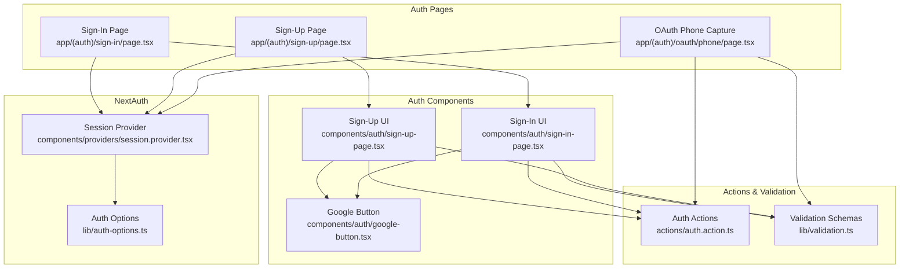
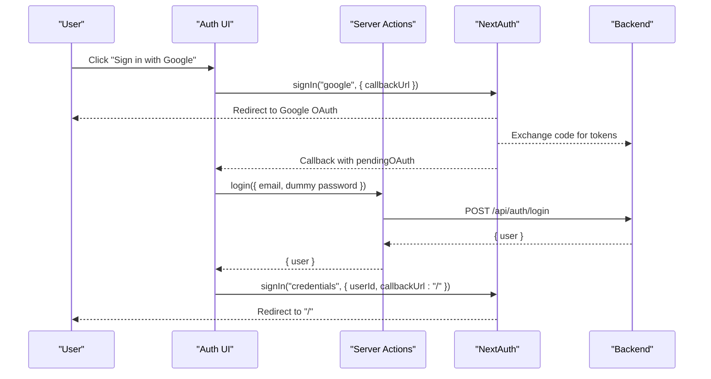
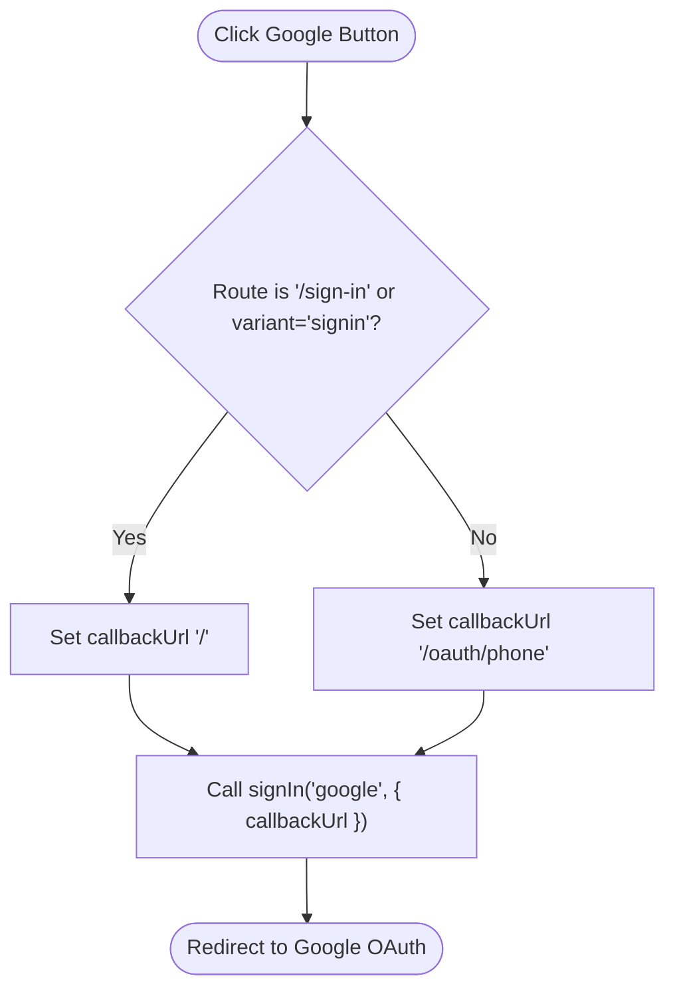
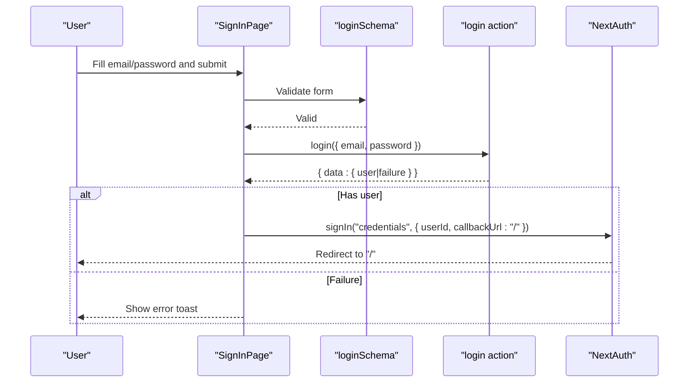
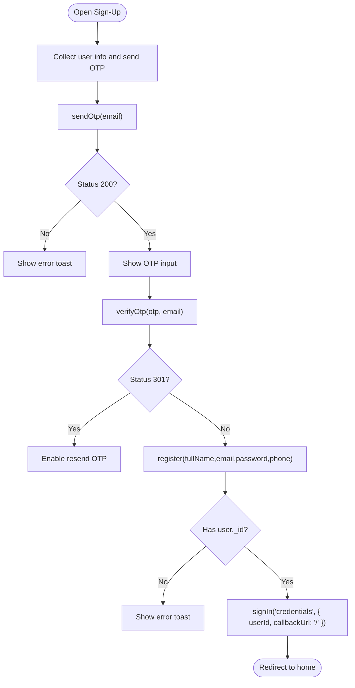
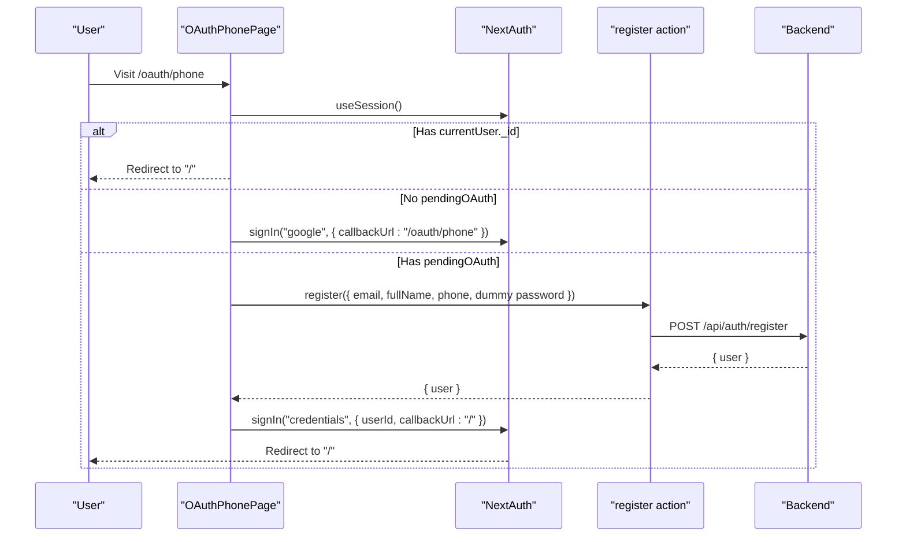
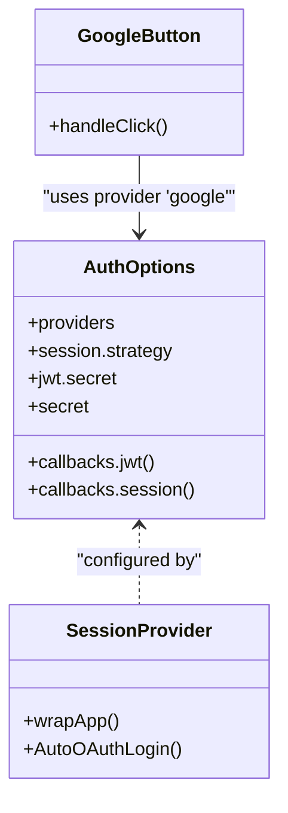
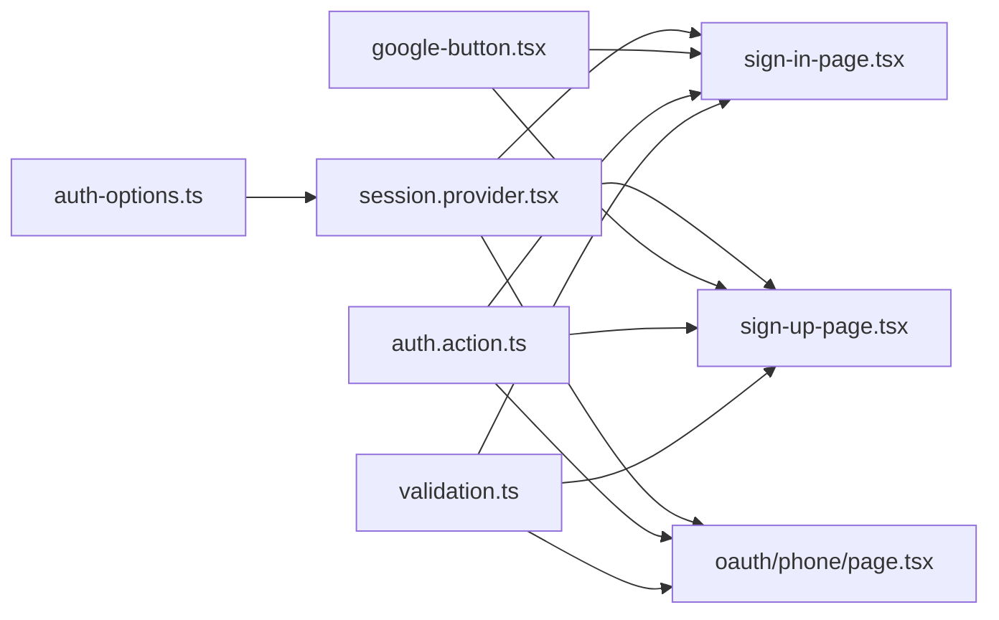

# Authentication Components

<cite>
**Referenced Files in This Document**
- [components/auth/google-button.tsx](file://components/auth/google-button.tsx)
- [components/auth/sign-in-page.tsx](file://components/auth/sign-in-page.tsx)
- [components/auth/sign-up-page.tsx](file://components/auth/sign-up-page.tsx)
- [app/(auth)/sign-in/page.tsx](file://app/(auth)/sign-in/page.tsx)
- [app/(auth)/sign-up/page.tsx](file://app/(auth)/sign-up/page.tsx)
- [actions/auth.action.ts](file://actions/auth.action.ts)
- [lib/validation.ts](file://lib/validation.ts)
- [lib/auth-options.ts](file://lib/auth-options.ts)
- [components/providers/session.provider.tsx](file://components/providers/session.provider.tsx)
- [app/(auth)/layout.tsx](file://app/(auth)/layout.tsx)
- [app/(auth)/oauth/phone/page.tsx](file://app/(auth)/oauth/phone/page.tsx)
- [hooks/use-action.ts](file://hooks/use-action.ts)
- [components/ui/button.tsx](file://components/ui/button.tsx)
- [components/ui/form.tsx](file://components/ui/form.tsx)
</cite>

## Table of Contents
1. [Introduction](#introduction)
2. [Project Structure](#project-structure)
3. [Core Components](#core-components)
4. [Architecture Overview](#architecture-overview)
5. [Detailed Component Analysis](#detailed-component-analysis)
6. [Dependency Analysis](#dependency-analysis)
7. [Performance Considerations](#performance-considerations)
8. [Troubleshooting Guide](#troubleshooting-guide)
9. [Conclusion](#conclusion)

## Introduction
This document explains Optim Bozor’s authentication UI components and flows. It covers:
- Google OAuth button integration
- Sign-in and sign-up pages, including form handling and validation
- OAuth post-login phone capture flow
- Authentication state management via NextAuth
- Redirect handling and UX flows
- Security considerations and customization guidance

## Project Structure
Authentication-related UI and logic are organized under:
- UI components: components/auth/*
- Pages: app/(auth)/* (sign-in, sign-up, OAuth phone capture)
- Actions: actions/auth.action.ts (server actions for login/register/OTP)
- Validation: lib/validation.ts (Zod schemas)
- NextAuth config: lib/auth-options.ts
- Provider wrapper: components/providers/session.provider.tsx
- Shared UI primitives: components/ui/*

**Diagram sources**
- [app/(auth)/sign-in/page.tsx](file://app/(auth)/sign-in/page.tsx#L1-L14)
- [app/(auth)/sign-up/page.tsx](file://app/(auth)/sign-up/page.tsx#L1-L14)
- [app/(auth)/oauth/phone/page.tsx](file://app/(auth)/oauth/phone/page.tsx#L1-L199)
- [components/auth/sign-in-page.tsx:1-178](file://components/auth/sign-in-page.tsx#L1-L178)
- [components/auth/sign-up-page.tsx:1-436](file://components/auth/sign-up-page.tsx#L1-L436)
- [components/auth/google-button.tsx:1-60](file://components/auth/google-button.tsx#L1-L60)
- [actions/auth.action.ts:1-51](file://actions/auth.action.ts#L1-L51)
- [lib/validation.ts:1-96](file://lib/validation.ts#L1-L96)
- [lib/auth-options.ts:1-128](file://lib/auth-options.ts#L1-L128)
- [components/providers/session.provider.tsx:1-39](file://components/providers/session.provider.tsx#L1-L39)

**Section sources**
- [app/(auth)/layout.tsx](file://app/(auth)/layout.tsx#L1-L75)
- [components/ui/button.tsx:1-73](file://components/ui/button.tsx#L1-L73)
- [components/ui/form.tsx:1-179](file://components/ui/form.tsx#L1-L179)

## Core Components
- Google OAuth Button: A reusable button that triggers provider sign-in with appropriate callback URLs depending on context.
- Sign-In Page: Zod-based form with react-hook-form, server action submission, and NextAuth credentials sign-in.
- Sign-Up Page: Multi-step flow with OTP sending/verification and registration, then credentials sign-in.
- OAuth Phone Capture: Post-Google OAuth step to collect phone number and finalize registration.
- Session Provider: Wraps the app to auto-trigger OAuth login when pending OAuth data exists.

**Section sources**
- [components/auth/google-button.tsx:1-60](file://components/auth/google-button.tsx#L1-L60)
- [components/auth/sign-in-page.tsx:1-178](file://components/auth/sign-in-page.tsx#L1-L178)
- [components/auth/sign-up-page.tsx:1-436](file://components/auth/sign-up-page.tsx#L1-L436)
- [app/(auth)/oauth/phone/page.tsx](file://app/(auth)/oauth/phone/page.tsx#L1-L199)
- [components/providers/session.provider.tsx:1-39](file://components/providers/session.provider.tsx#L1-L39)

## Architecture Overview
The authentication system integrates:
- UI components for sign-in and sign-up
- Server actions for backend interactions
- NextAuth for session/state management and OAuth
- A dedicated phone-capture step for Google OAuth users

**Diagram sources**
- [components/auth/google-button.tsx:17-21](file://components/auth/google-button.tsx#L17-L21)
- [lib/auth-options.ts:79-82](file://lib/auth-options.ts#L79-L82)
- [components/providers/session.provider.tsx:10-27](file://components/providers/session.provider.tsx#L10-L27)
- [actions/auth.action.ts:13-18](file://actions/auth.action.ts#L13-L18)
- [lib/auth-options.ts:103-114](file://lib/auth-options.ts#L103-L114)

## Detailed Component Analysis

### Google OAuth Button
Implements a branded Google sign-in button with:
- Variant-aware labeling ("Sign in" vs "Sign up")
- Route-aware callback URL selection
- Styled with a custom button component and SVG icon

**Diagram sources**
- [components/auth/google-button.tsx:17-21](file://components/auth/google-button.tsx#L17-L21)

**Section sources**
- [components/auth/google-button.tsx:1-60](file://components/auth/google-button.tsx#L1-L60)
- [components/ui/button.tsx:1-73](file://components/ui/button.tsx#L1-L73)

### Sign-In Page
- Uses react-hook-form with Zod resolver for validation
- Submits to a server action for login
- On success, triggers NextAuth credentials sign-in with a redirect to home
- Displays errors via toast and disables controls during loading

**Diagram sources**
- [components/auth/sign-in-page.tsx:29-52](file://components/auth/sign-in-page.tsx#L29-L52)
- [lib/validation.ts:3-6](file://lib/validation.ts#L3-L6)
- [actions/auth.action.ts:13-18](file://actions/auth.action.ts#L13-L18)
- [lib/auth-options.ts:103-114](file://lib/auth-options.ts#L103-L114)

**Section sources**
- [components/auth/sign-in-page.tsx:1-178](file://components/auth/sign-in-page.tsx#L1-L178)
- [lib/validation.ts:3-6](file://lib/validation.ts#L3-L6)
- [hooks/use-action.ts:1-16](file://hooks/use-action.ts#L1-L16)

### Sign-Up Page
Multi-step flow:
- Step 1: Collect full name, email, password, phone; send OTP
- Step 2: Verify OTP; on success, register user and sign in via credentials
- Uses two forms: registration and OTP verification
- Integrates with NextAuth and toast feedback

**Diagram sources**
- [components/auth/sign-up-page.tsx:48-103](file://components/auth/sign-up-page.tsx#L48-L103)
- [actions/auth.action.ts:27-39](file://actions/auth.action.ts#L27-L39)
- [actions/auth.action.ts:20-25](file://actions/auth.action.ts#L20-L25)
- [lib/auth-options.ts:103-114](file://lib/auth-options.ts#L103-L114)

**Section sources**
- [components/auth/sign-up-page.tsx:1-436](file://components/auth/sign-up-page.tsx#L1-L436)
- [lib/validation.ts:13-24](file://lib/validation.ts#L13-L24)
- [hooks/use-action.ts:1-16](file://hooks/use-action.ts#L1-L16)

### OAuth Phone Capture Page
- Ensures a pending OAuth session exists; otherwise initiates Google OAuth
- Collects phone number, finalizes registration, and signs in via credentials
- Validates phone format and handles errors gracefully

**Diagram sources**
- [app/(auth)/oauth/phone/page.tsx](file://app/(auth)/oauth/phone/page.tsx#L34-L84)
- [actions/auth.action.ts:20-25](file://actions/auth.action.ts#L20-L25)
- [lib/auth-options.ts:103-114](file://lib/auth-options.ts#L103-L114)

**Section sources**
- [app/(auth)/oauth/phone/page.tsx](file://app/(auth)/oauth/phone/page.tsx#L1-L199)
- [lib/validation.ts:35-39](file://lib/validation.ts#L35-L39)

### Authentication State Management and Redirect Handling
- NextAuth providers include Credentials and Google
- JWT/session callbacks enrich session with user profile and handle pending OAuth
- Session provider auto-completes OAuth login by attempting credentials sign-in when pending OAuth data is present
- Pages set callback URLs based on context to ensure correct redirects after OAuth

**Diagram sources**
- [lib/auth-options.ts:8-44](file://lib/auth-options.ts#L8-L44)
- [components/providers/session.provider.tsx:31-38](file://components/providers/session.provider.tsx#L31-L38)
- [components/auth/google-button.tsx:17-21](file://components/auth/google-button.tsx#L17-L21)

**Section sources**
- [lib/auth-options.ts:1-128](file://lib/auth-options.ts#L1-L128)
- [components/providers/session.provider.tsx:1-39](file://components/providers/session.provider.tsx#L1-L39)

## Dependency Analysis
- UI components depend on:
  - Validation schemas for form rules
  - Server actions for network requests
  - NextAuth for authentication state and redirects
- Pages are thin wrappers around components and manage layout and routing
- Shared UI components (Button, Form) provide consistent styling and accessibility

**Diagram sources**
- [lib/validation.ts:1-96](file://lib/validation.ts#L1-L96)
- [actions/auth.action.ts:1-51](file://actions/auth.action.ts#L1-L51)
- [components/auth/sign-in-page.tsx:1-178](file://components/auth/sign-in-page.tsx#L1-L178)
- [components/auth/sign-up-page.tsx:1-436](file://components/auth/sign-up-page.tsx#L1-L436)
- [app/(auth)/oauth/phone/page.tsx](file://app/(auth)/oauth/phone/page.tsx#L1-L199)
- [lib/auth-options.ts:1-128](file://lib/auth-options.ts#L1-L128)
- [components/providers/session.provider.tsx:1-39](file://components/providers/session.provider.tsx#L1-L39)

**Section sources**
- [components/ui/button.tsx:1-73](file://components/ui/button.tsx#L1-L73)
- [components/ui/form.tsx:1-179](file://components/ui/form.tsx#L1-L179)

## Performance Considerations
- Minimize re-renders by disabling form controls during async operations
- Use server actions to keep sensitive logic on the server
- Keep validation schemas close to forms to avoid runtime parsing overhead
- Debounce or throttle OTP resend to reduce backend load

## Troubleshooting Guide
Common issues and resolutions:
- Google OAuth fails silently
  - Ensure provider credentials are configured and callback URL matches
  - Verify NextAuth cookies and secure flags for production
- Pending OAuth not completing
  - Confirm session provider runs and attempts credentials sign-in when pendingOAuth exists
- OTP verification errors
  - Handle 301 status to prompt resend; show user-friendly messages
- Phone number validation failures
  - Enforce +998XXXXXXXXX format before submission

**Section sources**
- [components/providers/session.provider.tsx:10-27](file://components/providers/session.provider.tsx#L10-L27)
- [app/(auth)/oauth/phone/page.tsx](file://app/(auth)/oauth/phone/page.tsx#L78-L84)
- [lib/validation.ts:35-39](file://lib/validation.ts#L35-L39)

## Conclusion
Optim Bozor’s authentication UI combines robust form validation, server actions, and NextAuth to deliver a smooth sign-in and sign-up experience. The Google OAuth flow is integrated with a seamless phone-capture step, ensuring compliance and usability. The architecture supports easy customization and extension to additional providers.