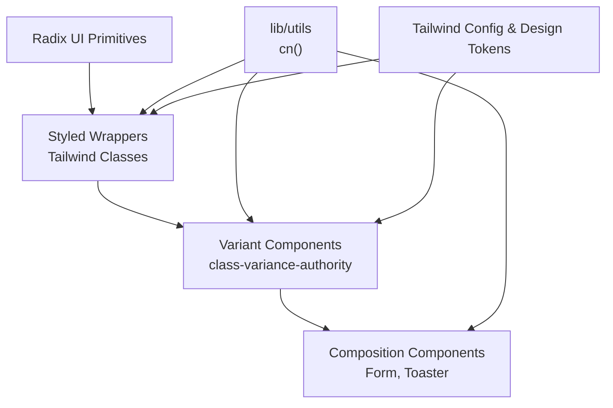
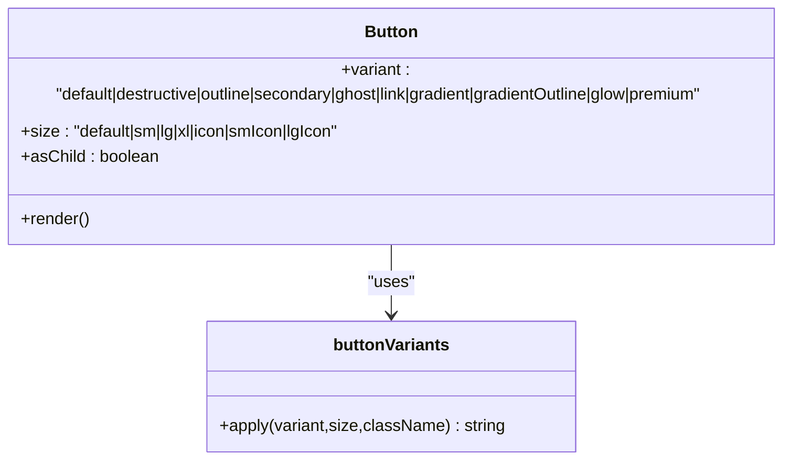
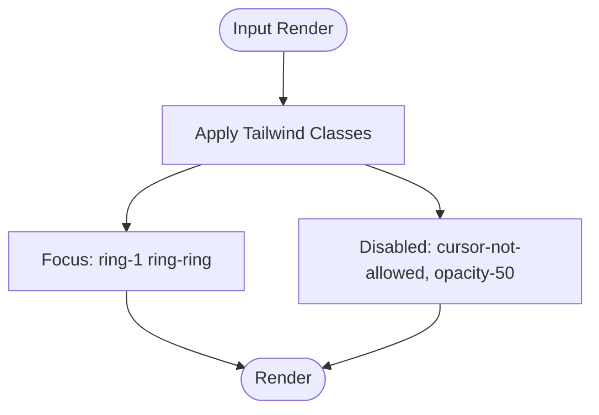
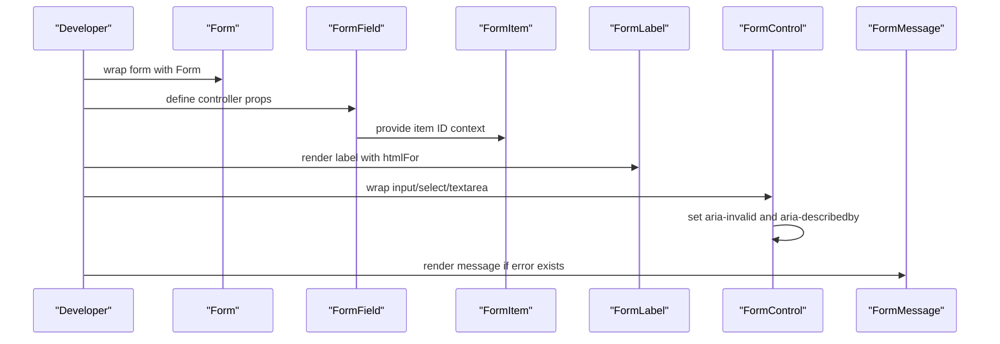
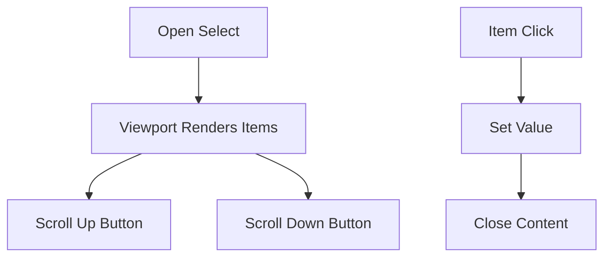
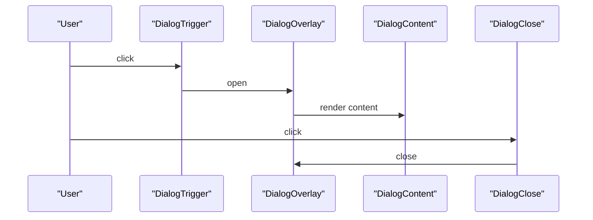
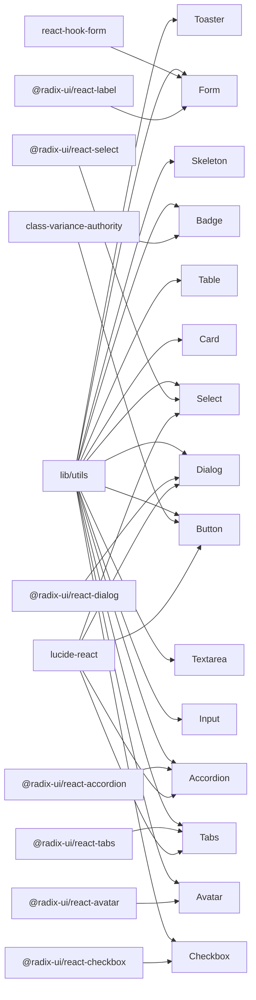

# Core UI Library

<cite>
**Referenced Files in This Document**
- [button.tsx](file://components/ui/button.tsx)
- [input.tsx](file://components/ui/input.tsx)
- [textarea.tsx](file://components/ui/textarea.tsx)
- [form.tsx](file://components/ui/form.tsx)
- [select.tsx](file://components/ui/select.tsx)
- [dialog.tsx](file://components/ui/dialog.tsx)
- [checkbox.tsx](file://components/ui/checkbox.tsx)
- [avatar.tsx](file://components/ui/avatar.tsx)
- [badge.tsx](file://components/ui/badge.tsx)
- [card.tsx](file://components/ui/card.tsx)
- [table.tsx](file://components/ui/table.tsx)
- [tabs.tsx](file://components/ui/tabs.tsx)
- [accordion.tsx](file://components/ui/accordion.tsx)
- [skeleton.tsx](file://components/ui/skeleton.tsx)
- [toaster.tsx](file://components/ui/toaster.tsx)
- [utils.ts](file://lib/utils.ts)
- [tailwind.config.ts](file://tailwind.config.ts)
- [globals.css](file://app/globals.css)
- [label.tsx](file://components/ui/label.tsx)
</cite>

## Table of Contents
1. [Introduction](#introduction)
2. [Project Structure](#project-structure)
3. [Core Components](#core-components)
4. [Architecture Overview](#architecture-overview)
5. [Detailed Component Analysis](#detailed-component-analysis)
6. [Dependency Analysis](#dependency-analysis)
7. [Performance Considerations](#performance-considerations)
8. [Accessibility Compliance](#accessibility-compliance)
9. [Design System Consistency](#design-system-consistency)
10. [Integration Patterns](#integration-patterns)
11. [Troubleshooting Guide](#troubleshooting-guide)
12. [Conclusion](#conclusion)

## Introduction
This document describes Optim Bozor's core UI component library built on Radix UI primitives and styled with Tailwind CSS. It covers component APIs, variants, states, accessibility, styling approaches, composition patterns, form integration, responsive design, and design system consistency. The goal is to help developers build accessible, consistent, and maintainable user interfaces across the application.

## Project Structure
The UI components live under components/ui and integrate with:
- Radix UI for accessible base primitives
- Tailwind CSS for styling and design tokens
- class-variance-authority for variant-driven styling
- react-hook-form for form integration
- lucide-react for icons

```mermaid
graph TB
subgraph "UI Components"
Btn["Button<br/>variants, sizes"]
Inp["Input"]
Txt["Textarea"]
Frm["Form<br/>Provider, Item, Label, Control, Description, Message"]
Sel["Select<br/>Trigger, Content, Item, Label"]
Dlg["Dialog<br/>Overlay, Content, Title, Description"]
Cbx["Checkbox"]
Av["Avatar<br/>Root, Image, Fallback"]
Bdg["Badge<br/>variants"]
Crd["Card<br/>Header, Title, Description, Content, Footer"]
Tbl["Table<br/>Table, Head, Body, Row, Cell, Caption"]
Tb["Tabs<br/>List, Trigger, Content"]
Acc["Accordion<br/>Item, Trigger, Content"]
Skel["Skeleton"]
Tos["Toaster"]
end
subgraph "Styling & Utilities"
TW["Tailwind CSS"]
CVA["class-variance-authority"]
Utils["lib/utils<br/>cn()"]
end
Btn --> CVA
Btn --> Utils
Btn --> TW
Inp --> Utils
Inp --> TW
Txt --> Utils
Txt --> TW
Frm --> Utils
Frm --> TW
Sel --> Utils
Sel --> TW
Dlg --> Utils
Dlg --> TW
Cbx --> Utils
Cbx --> TW
Av --> Utils
Av --> TW
Bdg --> CVA
Bdg --> Utils
Crd --> Utils
Crd --> TW
Tbl --> Utils
Tbl --> TW
Tb --> Utils
Tb --> TW
Acc --> Utils
Acc --> TW
Skel --> Utils
Tos --> Utils
```

**Diagram sources**
- [button.tsx:1-73](file://components/ui/button.tsx#L1-L73)
- [input.tsx:1-23](file://components/ui/input.tsx#L1-L23)
- [textarea.tsx:1-23](file://components/ui/textarea.tsx#L1-L23)
- [form.tsx:1-179](file://components/ui/form.tsx#L1-L179)
- [select.tsx:1-160](file://components/ui/select.tsx#L1-L160)
- [dialog.tsx:1-123](file://components/ui/dialog.tsx#L1-L123)
- [checkbox.tsx:1-31](file://components/ui/checkbox.tsx#L1-L31)
- [avatar.tsx:1-51](file://components/ui/avatar.tsx#L1-L51)
- [badge.tsx:1-30](file://components/ui/badge.tsx#L1-L30)
- [card.tsx:1-77](file://components/ui/card.tsx#L1-L77)
- [table.tsx:1-121](file://components/ui/table.tsx#L1-L121)
- [tabs.tsx:1-56](file://components/ui/tabs.tsx#L1-L56)
- [accordion.tsx:1-58](file://components/ui/accordion.tsx#L1-L58)
- [skeleton.tsx:1-16](file://components/ui/skeleton.tsx#L1-L16)
- [toaster.tsx:1-36](file://components/ui/toaster.tsx#L1-L36)
- [utils.ts](file://lib/utils.ts)
- [tailwind.config.ts](file://tailwind.config.ts)

**Section sources**
- [button.tsx:1-73](file://components/ui/button.tsx#L1-L73)
- [form.tsx:1-179](file://components/ui/form.tsx#L1-L179)
- [select.tsx:1-160](file://components/ui/select.tsx#L1-L160)
- [dialog.tsx:1-123](file://components/ui/dialog.tsx#L1-L123)
- [card.tsx:1-77](file://components/ui/card.tsx#L1-L77)
- [table.tsx:1-121](file://components/ui/table.tsx#L1-L121)
- [tabs.tsx:1-56](file://components/ui/tabs.tsx#L1-L56)
- [accordion.tsx:1-58](file://components/ui/accordion.tsx#L1-L58)
- [badge.tsx:1-30](file://components/ui/badge.tsx#L1-L30)
- [avatar.tsx:1-51](file://components/ui/avatar.tsx#L1-L51)
- [checkbox.tsx:1-31](file://components/ui/checkbox.tsx#L1-L31)
- [input.tsx:1-23](file://components/ui/input.tsx#L1-L23)
- [textarea.tsx:1-23](file://components/ui/textarea.tsx#L1-L23)
- [skeleton.tsx:1-16](file://components/ui/skeleton.tsx#L1-L16)
- [toaster.tsx:1-36](file://components/ui/toaster.tsx#L1-L36)
- [utils.ts](file://lib/utils.ts)
- [tailwind.config.ts](file://tailwind.config.ts)

## Core Components
This section summarizes the primary UI components and their capabilities.

- Button
  - Variants: default, destructive, outline, secondary, ghost, link, gradient, gradientOutline, glow, premium
  - Sizes: default, sm, lg, xl, icon, smIcon, lgIcon
  - Props: standard button attributes plus variant, size, asChild
  - Accessibility: focus-visible ring, disabled states, pointer-events handling
  - Styling: Tailwind classes with class-variance-authority variants

- Input
  - Purpose: single-line text input with consistent focus states and disabled behavior
  - Props: standard input attributes plus type

- Textarea
  - Purpose: multi-line text area with consistent focus states and disabled behavior
  - Props: standard textarea attributes

- Form
  - Provider: wraps react-hook-form
  - Components: FormField, FormItem, FormLabel, FormControl, FormDescription, FormMessage
  - Hooks: useFormField for accessing field state and ARIA identifiers
  - Accessibility: integrates ARIA-invalid, aria-describedby, and generated IDs

- Select
  - Primitives: Root, Group, Value, Trigger, Content, Label, Item, Separator, ScrollUp/Down buttons
  - Styling: Tailwind classes with portal-based overlay positioning
  - Accessibility: keyboard navigation, focus management, scroll buttons

- Dialog
  - Primitives: Root, Portal, Overlay, Close, Content, Header, Footer, Title, Description
  - Accessibility: focus trapping, close button with screen reader label, animations
  - Responsive: centered content with max-width and grid layout

- Checkbox
  - Primitive: Radix UI Checkbox with check indicator
  - Styling: Tailwind classes, focus-visible ring, disabled state

- Avatar
  - Components: Root, Image, Fallback
  - Styling: rounded-full container, fallback background

- Badge
  - Variants: default, secondary, destructive, outline
  - Styling: class-variance-authority variants

- Card
  - Components: Card, CardHeader, CardTitle, CardDescription, CardContent, CardFooter
  - Styling: Tailwind classes for background, border, and shadows

- Table
  - Components: Table, TableHeader, TableBody, TableFooter, TableRow, TableHead, TableCell, TableCaption
  - Styling: responsive wrapper, hover and selected states

- Tabs
  - Components: Tabs, TabsList, TabsTrigger, TabsContent
  - Styling: background and active state styling

- Accordion
  - Components: Accordion, AccordionItem, AccordionTrigger, AccordionContent
  - Styling: transitions and chevron rotation

- Skeleton
  - Purpose: animated placeholder content

- Toaster
  - Purpose: toast notifications provider and renderer

**Section sources**
- [button.tsx:52-73](file://components/ui/button.tsx#L52-L73)
- [input.tsx:5-23](file://components/ui/input.tsx#L5-L23)
- [textarea.tsx:5-23](file://components/ui/textarea.tsx#L5-L23)
- [form.tsx:18-179](file://components/ui/form.tsx#L18-L179)
- [select.tsx:9-160](file://components/ui/select.tsx#L9-L160)
- [dialog.tsx:9-123](file://components/ui/dialog.tsx#L9-L123)
- [checkbox.tsx:9-31](file://components/ui/checkbox.tsx#L9-L31)
- [avatar.tsx:8-51](file://components/ui/avatar.tsx#L8-L51)
- [badge.tsx:23-30](file://components/ui/badge.tsx#L23-L30)
- [card.tsx:5-77](file://components/ui/card.tsx#L5-L77)
- [table.tsx:5-121](file://components/ui/table.tsx#L5-L121)
- [tabs.tsx:8-56](file://components/ui/tabs.tsx#L8-L56)
- [accordion.tsx:9-58](file://components/ui/accordion.tsx#L9-L58)
- [skeleton.tsx:3-16](file://components/ui/skeleton.tsx#L3-L16)
- [toaster.tsx:13-36](file://components/ui/toaster.tsx#L13-L36)

## Architecture Overview
The UI library follows a layered architecture:
- Base primitives from Radix UI for accessibility and semantics
- Styled components wrapping primitives with Tailwind classes
- Variant-driven components using class-variance-authority
- Composition helpers for forms and notifications
- Utility functions for class merging and design tokens

**Diagram sources**
- [button.tsx:1-73](file://components/ui/button.tsx#L1-L73)
- [form.tsx:1-179](file://components/ui/form.tsx#L1-L179)
- [toaster.tsx:1-36](file://components/ui/toaster.tsx#L1-L36)
- [utils.ts](file://lib/utils.ts)
- [tailwind.config.ts](file://tailwind.config.ts)

## Detailed Component Analysis

### Button
- Props
  - variant: selects from default, destructive, outline, secondary, ghost, link, gradient, gradientOutline, glow, premium
  - size: selects from default, sm, lg, xl, icon, smIcon, lgIcon
  - asChild: renders a slot element instead of button
  - Inherits standard button attributes
- States and Behaviors
  - Focus-visible ring with ring offset
  - Disabled state with reduced opacity and pointer events
  - Hover, active, and icon-specific styles
- Styling Approach
  - Uses class-variance-authority for variants and sizes
  - Centralized Tailwind classes for colors, shadows, and transitions
- Accessibility
  - Maintains focus-visible outline and supports keyboard activation
- Examples
  - Variant usage: [button.tsx:10-49](file://components/ui/button.tsx#L10-L49)
  - Size usage: [button.tsx:35-44](file://components/ui/button.tsx#L35-L44)
  - Icon variant: [button.tsx:40-42](file://components/ui/button.tsx#L40-L42)

**Diagram sources**
- [button.tsx:7-50](file://components/ui/button.tsx#L7-L50)

**Section sources**
- [button.tsx:52-73](file://components/ui/button.tsx#L52-L73)

### Input
- Props
  - type: input type
  - Inherits standard input attributes
- Behavior
  - Focus ring, disabled state, placeholder styling
- Styling
  - Tailwind utility classes for borders, padding, and transitions
- Accessibility
  - Standard input semantics and focus management

**Diagram sources**
- [input.tsx:5-23](file://components/ui/input.tsx#L5-L23)

**Section sources**
- [input.tsx:5-23](file://components/ui/input.tsx#L5-L23)

### Textarea
- Props
  - Inherits standard textarea attributes
- Behavior
  - Focus ring, disabled state, placeholder styling
- Styling
  - Tailwind utility classes for padding and transitions

**Section sources**
- [textarea.tsx:5-23](file://components/ui/textarea.tsx#L5-L23)

### Form Integration
- Components
  - Form: wraps react-hook-form FormProvider
  - FormField: wires controller to field context
  - FormItem: manages item ID context
  - FormLabel: renders label with error-aware styling and proper htmlFor
  - FormControl: injects ARIA attributes and IDs
  - FormDescription: neutral helper text
  - FormMessage: renders error messages with destructively styled text
- Hooks
  - useFormField: resolves field state, IDs, and error presence
- Accessibility
  - aria-invalid, aria-describedby, and generated IDs ensure screen reader compatibility
- Usage Pattern
  - Wrap form with Form
  - Use FormField per field
  - Use FormLabel and FormControl together
  - Use FormDescription and FormMessage for hints and errors

**Diagram sources**
- [form.tsx:18-179](file://components/ui/form.tsx#L18-L179)

**Section sources**
- [form.tsx:18-179](file://components/ui/form.tsx#L18-L179)

### Select
- Components
  - Trigger: focusable trigger with chevron icon
  - Content: portal-based overlay with scroll buttons
  - Item: selectable option with check indicator
  - Label: group labels
  - Separator: visual dividers
- Behavior
  - Scroll buttons for long lists
  - Popper positioning with viewport sizing
- Accessibility
  - Keyboard navigation, focus management, disabled states
- Styling
  - Tailwind classes for backgrounds, borders, and transitions

**Diagram sources**
- [select.tsx:15-160](file://components/ui/select.tsx#L15-L160)

**Section sources**
- [select.tsx:15-160](file://components/ui/select.tsx#L15-L160)

### Dialog
- Components
  - Overlay: backdrop with fade animation
  - Content: centered grid with close button
  - Header/Footer: layout containers
  - Title/Description: semantic headings
- Behavior
  - Portal rendering, animations, focus trapping
  - Close button with sr-only label
- Accessibility
  - Focus management, ARIA roles, keyboard support

**Diagram sources**
- [dialog.tsx:32-54](file://components/ui/dialog.tsx#L32-L54)

**Section sources**
- [dialog.tsx:32-54](file://components/ui/dialog.tsx#L32-L54)

### Checkbox
- Behavior
  - Controlled via Radix UI state
  - Check indicator visible when checked
- Styling
  - Tailwind classes for border, focus, disabled, and checked states

**Section sources**
- [checkbox.tsx:9-31](file://components/ui/checkbox.tsx#L9-L31)

### Avatar
- Components
  - Root: container with overflow hidden
  - Image: aspect-square image
  - Fallback: center-aligned fallback with muted background
- Styling
  - Rounded-full container, fallback background

**Section sources**
- [avatar.tsx:8-51](file://components/ui/avatar.tsx#L8-L51)

### Badge
- Props
  - variant: default, secondary, destructive, outline
- Styling
  - class-variance-authority variants

**Section sources**
- [badge.tsx:23-30](file://components/ui/badge.tsx#L23-L30)

### Card
- Components
  - Card, CardHeader, CardTitle, CardDescription, CardContent, CardFooter
- Styling
  - Tailwind classes for background, border, and spacing

**Section sources**
- [card.tsx:5-77](file://components/ui/card.tsx#L5-L77)

### Table
- Components
  - Table, TableHeader, TableBody, TableFooter, TableRow, TableHead, TableCell, TableCaption
- Behavior
  - Hover and selection states, responsive wrapper
- Styling
  - Tailwind classes for borders, alignment, and spacing

**Section sources**
- [table.tsx:5-121](file://components/ui/table.tsx#L5-L121)

### Tabs
- Components
  - Tabs, TabsList, TabsTrigger, TabsContent
- Behavior
  - Active state styling, focus-visible rings

**Section sources**
- [tabs.tsx:8-56](file://components/ui/tabs.tsx#L8-L56)

### Accordion
- Components
  - Accordion, AccordionItem, AccordionTrigger, AccordionContent
- Behavior
  - Chevron rotation, animation classes for open/close

**Section sources**
- [accordion.tsx:9-58](file://components/ui/accordion.tsx#L9-L58)

### Skeleton
- Purpose
  - Animated placeholder with pulse animation
- Styling
  - Background with low opacity primary tint

**Section sources**
- [skeleton.tsx:3-16](file://components/ui/skeleton.tsx#L3-L16)

### Toaster
- Purpose
  - Renders toast notifications from hook state
- Behavior
  - Iterates over toasts and renders title/description/action

**Section sources**
- [toaster.tsx:13-36](file://components/ui/toaster.tsx#L13-L36)

## Dependency Analysis
Component dependencies and coupling:
- All components depend on lib/utils for class merging
- Variant components depend on class-variance-authority
- Form components depend on react-hook-form and @radix-ui/react-label
- Interactive components depend on @radix-ui primitives
- Icons come from lucide-react

**Diagram sources**
- [button.tsx:1-73](file://components/ui/button.tsx#L1-L73)
- [badge.tsx:1-30](file://components/ui/badge.tsx#L1-L30)
- [form.tsx:1-179](file://components/ui/form.tsx#L1-L179)
- [select.tsx:1-160](file://components/ui/select.tsx#L1-L160)
- [dialog.tsx:1-123](file://components/ui/dialog.tsx#L1-L123)
- [tabs.tsx:1-56](file://components/ui/tabs.tsx#L1-L56)
- [accordion.tsx:1-58](file://components/ui/accordion.tsx#L1-L58)
- [checkbox.tsx:1-31](file://components/ui/checkbox.tsx#L1-L31)
- [avatar.tsx:1-51](file://components/ui/avatar.tsx#L1-L51)
- [input.tsx:1-23](file://components/ui/input.tsx#L1-L23)
- [textarea.tsx:1-23](file://components/ui/textarea.tsx#L1-L23)
- [table.tsx:1-121](file://components/ui/table.tsx#L1-L121)
- [skeleton.tsx:1-16](file://components/ui/skeleton.tsx#L1-L16)
- [toaster.tsx:1-36](file://components/ui/toaster.tsx#L1-L36)
- [utils.ts](file://lib/utils.ts)

**Section sources**
- [utils.ts](file://lib/utils.ts)
- [button.tsx:1-73](file://components/ui/button.tsx#L1-L73)
- [badge.tsx:1-30](file://components/ui/badge.tsx#L1-L30)
- [form.tsx:1-179](file://components/ui/form.tsx#L1-L179)
- [select.tsx:1-160](file://components/ui/select.tsx#L1-L160)
- [dialog.tsx:1-123](file://components/ui/dialog.tsx#L1-L123)
- [tabs.tsx:1-56](file://components/ui/tabs.tsx#L1-L56)
- [accordion.tsx:1-58](file://components/ui/accordion.tsx#L1-L58)
- [checkbox.tsx:1-31](file://components/ui/checkbox.tsx#L1-L31)
- [avatar.tsx:1-51](file://components/ui/avatar.tsx#L1-L51)
- [input.tsx:1-23](file://components/ui/input.tsx#L1-L23)
- [textarea.tsx:1-23](file://components/ui/textarea.tsx#L1-L23)
- [table.tsx:1-121](file://components/ui/table.tsx#L1-L121)
- [skeleton.tsx:1-16](file://components/ui/skeleton.tsx#L1-L16)
- [toaster.tsx:1-36](file://components/ui/toaster.tsx#L1-L36)

## Performance Considerations
- Prefer variant components over ad-hoc class concatenation to leverage class-variance-authority caching.
- Use asChild patterns (e.g., Button with asChild) to avoid unnecessary DOM nodes.
- Keep interactive components declarative and avoid heavy computations in render paths.
- Use Skeleton for placeholders to reduce layout shifts during async loads.
- Limit portal usage to essential overlays (Dialog, Select) to minimize reflows.

## Accessibility Compliance
- Focus Management
  - Buttons and interactive elements expose focus-visible rings.
  - Dialogs and Selects manage focus trapping and restoration.
- ARIA Attributes
  - Form components set aria-invalid and aria-describedby dynamically.
  - Dialog close button includes a screen reader-only label.
- Keyboard Navigation
  - Select supports scrolling and item selection via keyboard.
  - Tabs and Accordion support keyboard activation and arrow navigation.
- Screen Reader Support
  - Semantic HTML and Radix primitives ensure proper labeling.
  - FormMessage renders error text as visible and announced by assistive technologies.

**Section sources**
- [button.tsx:8-68](file://components/ui/button.tsx#L8-L68)
- [form.tsx:110-125](file://components/ui/form.tsx#L110-L125)
- [dialog.tsx:47-50](file://components/ui/dialog.tsx#L47-L50)
- [select.tsx:70-100](file://components/ui/select.tsx#L70-L100)
- [tabs.tsx:25-53](file://components/ui/tabs.tsx#L25-L53)
- [accordion.tsx:23-55](file://components/ui/accordion.tsx#L23-L55)

## Design System Consistency
- Color Scheme
  - Primary, secondary, destructive, muted, accent, and background palettes used consistently across components.
  - Gradient variants for prominent actions and decorative accents.
- Typography Scale
  - Consistent text sizes and weights across inputs, labels, and content areas.
- Spacing System
  - Uniform padding and margin utilities applied via Tailwind classes.
- Tokens and Utilities
  - Centralized class merging via lib/utils ensures consistent application of design tokens.

**Section sources**
- [button.tsx:10-49](file://components/ui/button.tsx#L10-L49)
- [input.tsx:10-11](file://components/ui/input.tsx#L10-L11)
- [card.tsx:11-14](file://components/ui/card.tsx#L11-L14)
- [table.tsx:58-64](file://components/ui/table.tsx#L58-L64)
- [utils.ts](file://lib/utils.ts)
- [tailwind.config.ts](file://tailwind.config.ts)

## Integration Patterns
- Form Validation
  - Wrap forms with Form, use FormField per field, pair FormLabel with FormControl, and render FormMessage conditionally.
- Responsive Design
  - Use responsive utilities (e.g., md:) for text sizes and paddings.
- Composition
  - Combine primitive components (e.g., Card + Table) to build complex layouts.
- Theming
  - Extend variants for Button and Badge to introduce new design directions while maintaining consistency.

**Section sources**
- [form.tsx:18-179](file://components/ui/form.tsx#L18-L179)
- [input.tsx:10-11](file://components/ui/input.tsx#L10-L11)
- [card.tsx:5-77](file://components/ui/card.tsx#L5-L77)
- [table.tsx:5-121](file://components/ui/table.tsx#L5-L121)

## Troubleshooting Guide
- Button not responding to clicks
  - Ensure disabled prop is not set and pointer-events are enabled.
  - Verify focus-visible ring appears on keyboard focus.
- Form field not labeled correctly
  - Confirm FormLabel has htmlFor matching the item ID and FormControl is wrapped around the input.
- Select not opening or scrolling
  - Check that Content is rendered inside a Portal and viewport sizing matches trigger dimensions.
- Dialog not closing or trapping focus
  - Ensure Close button is present and accessible; verify overlay and content classes are applied.
- Checkbox not reflecting state
  - Confirm controlled state via Radix UI and that the indicator displays when checked.

**Section sources**
- [button.tsx:8-68](file://components/ui/button.tsx#L8-L68)
- [form.tsx:92-125](file://components/ui/form.tsx#L92-L125)
- [select.tsx:70-100](file://components/ui/select.tsx#L70-L100)
- [dialog.tsx:32-54](file://components/ui/dialog.tsx#L32-L54)
- [checkbox.tsx:13-27](file://components/ui/checkbox.tsx#L13-L27)

## Conclusion
Optim Bozor’s UI library combines accessible Radix UI primitives with Tailwind CSS and variant-driven styling to deliver a consistent, extensible component system. By following the documented patterns for props, variants, accessibility, and composition, teams can build scalable interfaces that remain maintainable and inclusive.